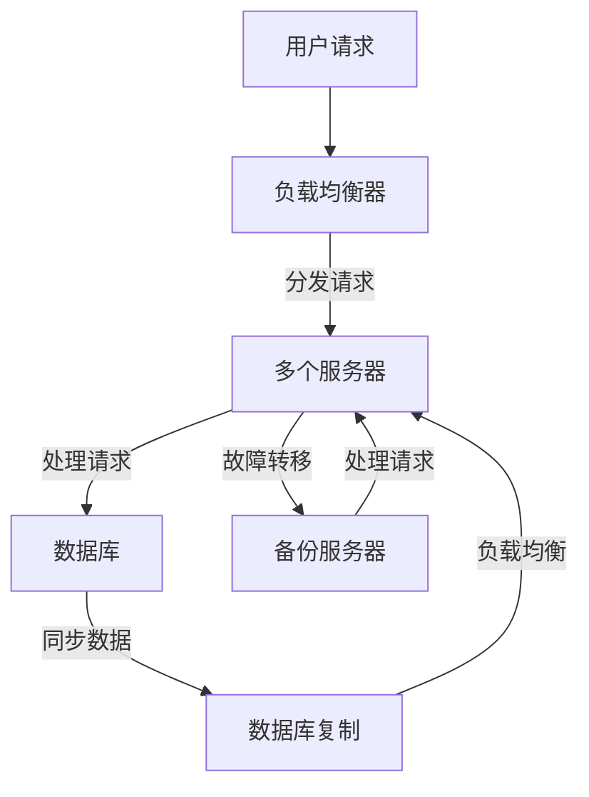

                 

### 1. 背景介绍

在当今数字化时代，Web 应用程序已经成为各类企业和组织运营的关键组成部分。无论是电商、社交媒体、在线教育，还是金融交易，Web 应用程序的稳定性、可靠性和性能直接影响到用户体验和业务收益。随着用户数量的激增和业务需求的不断变化，Web 应用程序面临着巨大的挑战：如何确保系统的可扩展性和容错性？

可扩展性指的是系统在处理不断增加的负载时，能够保持高性能和高可用性的能力。而容错性则是指系统在遭遇硬件故障、软件错误或网络问题等异常情况下，能够快速恢复并保持正常运行的能力。这两者对于 Web 应用程序的成功运营至关重要。一个具有良好可扩展性和容错性的系统，不仅能够应对高并发访问，还能在出现问题时迅速恢复，减少停机时间，提高用户满意度。

本文旨在深入探讨 Web 应用程序的可扩展性和容错性。首先，我们将介绍与这两个概念相关的核心技术和策略，包括负载均衡、水平扩展、服务拆分、数据库复制和集群等技术。接着，我们将分析这些技术的原理和实际应用，并通过具体的代码实例来展示如何在实际项目中实现这些技术。最后，我们将探讨 Web 应用程序在应对实际应用场景中的挑战，并提出未来可能的发展趋势和研究方向。

### 2. 核心概念与联系

在深入探讨 Web 应用程序的可扩展性和容错性之前，我们需要明确几个核心概念，并理解它们之间的联系。

#### 2.1 可扩展性

可扩展性（Scalability）是指系统在资源增加时能够保持或提升性能的能力。对于 Web 应用程序而言，这通常意味着在用户数量或数据量增加时，系统能够平滑地扩展其处理能力。可扩展性可以分为两种类型：垂直扩展（Vertical Scaling）和水平扩展（Horizontal Scaling）。

- **垂直扩展**：通过增加硬件性能，如更快的CPU、更多的内存或更高速的磁盘，来提升系统性能。这种方法在资源需求较小且增长缓慢时比较适用，但在处理大量请求时可能会受到硬件限制。
- **水平扩展**：通过增加更多的服务器实例，将负载分布到多个节点上。这种方法能够更好地处理大量请求，因为可以动态地增加或减少服务器实例。

#### 2.2 容错性

容错性（Fault Tolerance）是指系统能够在遭遇故障时保持运行的能力。在 Web 应用程序中，这通常涉及到如何处理硬件故障、软件错误、网络中断等问题。以下是一些常见的容错技术：

- **冗余设计**：通过备份硬件和软件来确保系统在部分组件失效时仍然能够运行。例如，使用数据库复制和镜像技术。
- **故障转移**：当主服务器出现故障时，自动将负载转移到备份服务器。例如，使用负载均衡器和心跳检测。
- **自我修复**：系统能够自动检测和修复软件错误。例如，使用日志监控和自动部署。

#### 2.3 负载均衡

负载均衡（Load Balancing）是将请求分配到多个服务器实例的技术，以确保每个实例都能均衡地处理负载。负载均衡不仅提高了系统的可扩展性，还有助于提高系统的容错性。常见的负载均衡算法包括轮询（Round Robin）、最少连接（Least Connections）和权重分配（Weighted Round Robin）等。

#### 2.4 服务拆分

服务拆分（Service Decomposition）是将大型、复杂的系统拆分成多个独立的服务。每个服务负责一个特定的功能模块，通过 API 进行通信。服务拆分有助于提高系统的可维护性和可扩展性，因为可以独立扩展和部署各个服务。此外，服务拆分还便于实现微服务架构，使系统能够更好地应对变化和故障。

#### 2.5 数据库复制与集群

数据库复制和集群是确保数据一致性和系统可用性的重要技术。数据库复制（Database Replication）通过在多个服务器之间同步数据，确保数据的一致性。数据库集群（Database Clustering）则是通过多个节点协同工作，提供高可用性和负载均衡。常见的数据库复制技术包括主-从复制（Master-Slave Replication）和主-主复制（Master-Master Replication）。集群技术则包括共享存储集群（Shared-Storage Cluster）和无共享集群（Shared-Nothing Cluster）。

#### 2.6 Mermaid 流程图

为了更好地理解这些概念和技术之间的联系，我们可以使用 Mermaid 流程图进行展示。以下是一个简化的 Mermaid 流程图，描述了 Web 应用程序的可扩展性和容错性相关的关键技术和它们之间的关系：



在这个流程图中，用户请求首先通过负载均衡器分发到多个服务器实例，服务器实例处理请求并访问数据库。数据库复制技术确保了数据的一致性，而故障转移机制在主服务器出现故障时，将请求自动转移到备份服务器，从而提高了系统的容错性。

通过以上对核心概念和技术的介绍，我们为后续详细探讨这些技术在 Web 应用程序中的具体实现和应用奠定了基础。

### 3. 核心算法原理 & 具体操作步骤

在了解 Web 应用程序可扩展性和容错性的核心概念之后，我们接下来将深入探讨这些技术的实现原理和具体操作步骤。本文将重点关注负载均衡、水平扩展、服务拆分、数据库复制和集群等关键技术。

#### 3.1 负载均衡算法原理

负载均衡算法的核心目标是确保系统中的各个服务器实例能够均衡地处理请求，避免单个服务器过载。常见的负载均衡算法包括：

- **轮询（Round Robin）**：按照顺序将请求分配给服务器实例。这种算法简单易实现，但可能导致某些服务器过载，而其他服务器空闲。
- **最少连接（Least Connections）**：将请求分配给当前连接数最少的服务器实例。这种方法能够更好地利用服务器资源，但需要维护连接状态信息。
- **权重分配（Weighted Round Robin）**：根据服务器性能和负载情况为每个服务器分配不同的权重。权重较高的服务器会承担更多的请求。这种方法可以更灵活地调整服务器之间的负载分配。

在具体操作步骤中，负载均衡器会监听来自用户的请求，并根据所选算法将请求转发到合适的服务器实例。以下是一个简单的负载均衡器实现示例，使用 Python 的 `roundrobin` 库：

```python
from roundrobin import RoundRobin
from flask import Flask, request, jsonify

app = Flask(__name__)
load_balancer = RoundRobin(['server1.example.com', 'server2.example.com'])

@app.route('/api/data', methods=['GET'])
def handle_request():
    server = load_balancer.get()
    return jsonify({"server": server, "data": request.args.get('data')})

if __name__ == '__main__':
    app.run(host='0.0.0.0', port=8080)
```

在这个示例中，我们使用轮询算法将请求转发到两个服务器实例。当用户访问 `/api/data` 接口时，负载均衡器会根据当前负载情况将请求分配到相应的服务器。

#### 3.2 水平扩展操作步骤

水平扩展是通过增加服务器实例来提升系统处理能力。以下是实现水平扩展的步骤：

1. **选择合适的服务器实例**：根据业务需求和技术栈，选择适合的服务器实例，如 Docker 容器、Kubernetes 集群或虚拟机。

2. **部署应用**：将应用部署到服务器实例上。可以使用自动化部署工具，如 Jenkins、GitLab CI/CD 或 Docker Compose，简化部署流程。

3. **配置负载均衡器**：配置负载均衡器，将请求分发到新增加的服务器实例。使用前面提到的负载均衡算法，确保请求均衡地分配。

4. **监控和优化**：监控系统的性能和负载情况，根据实际需求调整服务器实例数量。可以使用监控工具，如 Prometheus、Grafana 或 Nagios，实时监控系统的状态。

以下是一个使用 Kubernetes 进行水平扩展的示例：

```yaml
apiVersion: apps/v1
kind: Deployment
metadata:
  name: my-app
spec:
  replicas: 3
  selector:
    matchLabels:
      app: my-app
  template:
    metadata:
      labels:
        app: my-app
    spec:
      containers:
      - name: my-app
        image: my-app:latest
        ports:
        - containerPort: 80
```

在这个示例中，我们将部署三个 `my-app` 服务器实例，确保负载均衡器能够将请求分配到所有实例。

#### 3.3 服务拆分

服务拆分是将大型、复杂的系统拆分成多个独立的服务。以下是实现服务拆分的步骤：

1. **定义服务边界**：根据业务需求，确定各个服务的职责和功能边界。

2. **设计 API 接口**：为每个服务设计 RESTful API 接口，确保服务之间可以通过 API 进行通信。

3. **部署和配置服务**：将各个服务部署到独立的服务器实例或容器中，配置负载均衡器和服务发现机制，确保服务之间能够动态发现和通信。

4. **集成和测试**：将各个服务集成到系统中，进行功能测试和性能测试，确保系统整体性能和稳定性。

以下是一个简单的服务拆分示例，使用 Spring Boot 和 Spring Cloud：

```java
@SpringBootApplication
@RestController
public class MyServiceApplication {

    public static void main(String[] args) {
        SpringApplication.run(MyServiceApplication.class, args);
    }

    @GetMapping("/data")
    public String getData() {
        return "Hello, World!";
    }
}
```

在这个示例中，我们定义了一个简单的服务，提供 `/data` 接口，其他服务可以通过 API 调用获取数据。

#### 3.4 数据库复制与集群

数据库复制和集群是确保数据一致性和系统可用性的重要技术。以下是实现数据库复制和集群的步骤：

1. **选择合适的数据库**：根据业务需求选择合适的数据库，如 MySQL、PostgreSQL 或 MongoDB。

2. **配置主-从复制**：配置主数据库和从数据库，确保从数据库能够同步主数据库的数据。

3. **部署数据库集群**：将多个数据库实例部署到不同服务器上，确保集群中多个节点能够协同工作。

4. **配置负载均衡器**：配置负载均衡器，将读请求分发到集群中的各个数据库节点。

以下是一个使用 MySQL 主-从复制的示例：

```sql
-- 配置主数据库
CREATE USER 'replica'@'%' IDENTIFIED BY 'password';
GRANT REPLICATION SLAVE ON *.* TO 'replica'@'%';

-- 配置从数据库
CHANGE MASTER TO
  MASTER_HOST='master.example.com',
  MASTER_PORT=3306,
  MASTER_USER='replica',
  MASTER_PASSWORD='password',
  MASTER_LOG_FILE='mysql-bin.000001',
  MASTER_LOG_POS=4;
```

在这个示例中，我们配置了一个主数据库和两个从数据库，确保从数据库能够同步主数据库的数据。

#### 3.5 算法优缺点

每种算法和技术都有其优缺点，选择合适的算法和实现方案对系统的性能和稳定性至关重要。

- **负载均衡算法**：
  - 轮询：简单易实现，但可能导致部分服务器过载。
  - 最少连接：能更好地利用服务器资源，但需要维护连接状态。
  - 权重分配：灵活调整服务器之间的负载分配，但需要更多的配置。

- **水平扩展**：
  - 优点：能够动态地增加或减少服务器实例，提高系统处理能力。
  - 缺点：需要维护多个服务器实例，增加管理和维护成本。

- **服务拆分**：
  - 优点：提高系统的可维护性和可扩展性，便于实现微服务架构。
  - 缺点：需要设计和实现复杂的 API 接口，增加开发成本。

- **数据库复制与集群**：
  - 优点：确保数据一致性和系统可用性，提高系统性能。
  - 缺点：需要额外的配置和管理，对网络带宽有较高要求。

#### 3.6 算法应用领域

负载均衡、水平扩展、服务拆分、数据库复制和集群等算法和技术在 Web 应用程序中有着广泛的应用：

- **电商平台**：应对大量用户访问和交易请求，需要使用负载均衡和水平扩展技术。
- **社交媒体**：实现高并发访问和实时数据更新，需要使用服务拆分和数据库集群技术。
- **金融交易**：确保系统稳定性和数据一致性，需要使用数据库复制和集群技术。

通过合理地应用这些算法和技术，Web 应用程序能够更好地应对各种挑战，提供稳定、高效的服务。

### 4. 数学模型和公式 & 详细讲解 & 举例说明

在深入探讨 Web 应用程序的可扩展性和容错性时，数学模型和公式起着至关重要的作用。它们不仅帮助我们理解和量化系统性能，还能指导我们在实际应用中做出最优决策。以下是几个关键的数学模型和公式，以及它们的详细讲解和举例说明。

#### 4.1 数学模型构建

为了构建数学模型，我们首先需要定义几个关键参数：

- **N**：服务器实例的数量。
- **R**：每秒接收的请求率。
- **T**：系统的平均响应时间。
- **P**：系统的吞吐量。

#### 4.2 公式推导过程

##### 4.2.1 负载均衡系统的响应时间

在负载均衡系统中，每个服务器实例的响应时间可以表示为：

$$ T_i = \frac{N}{R} + t_i $$

其中，$t_i$ 是服务器实例的固定处理时间。整个系统的平均响应时间可以表示为：

$$ T = \frac{1}{N} \sum_{i=1}^{N} T_i = \frac{N}{R} + \frac{1}{N} \sum_{i=1}^{N} t_i $$

##### 4.2.2 水平扩展系统的吞吐量

在水平扩展系统中，系统的总吞吐量可以表示为：

$$ P = R \cdot \frac{N}{\max(t_i)} $$

其中，$\max(t_i)$ 是所有服务器实例处理时间的最大值。

##### 4.2.3 服务拆分系统的响应时间和吞吐量

对于服务拆分系统，我们可以使用微服务架构中的平均响应时间和吞吐量公式。假设有 M 个服务，每个服务的响应时间为 $T_{s_i}$，吞吐量为 $P_{s_i}$，则整个系统的响应时间和吞吐量分别为：

$$ T = \frac{1}{M} \sum_{i=1}^{M} T_{s_i} $$

$$ P = \sum_{i=1}^{M} P_{s_i} $$

#### 4.3 案例分析与讲解

##### 4.3.1 负载均衡系统的案例

假设一个系统有 5 个服务器实例，每秒接收 100 个请求，每个服务器实例的固定处理时间为 0.1 秒。根据上述公式，我们可以计算出：

$$ T_i = \frac{5}{100} + 0.1 = 0.05 + 0.1 = 0.15 \text{ 秒} $$

$$ T = \frac{5}{5} \sum_{i=1}^{5} T_i = 0.15 \text{ 秒} $$

这意味着系统的平均响应时间为 0.15 秒。为了进一步提高系统的性能，可以考虑增加服务器实例数量或优化服务器处理能力。

##### 4.3.2 水平扩展系统的案例

假设一个系统有 5 个服务器实例，每秒接收 500 个请求，每个服务器实例的固定处理时间为 0.1 秒。根据上述公式，我们可以计算出：

$$ P = 500 \cdot \frac{5}{\max(0.1)} = 500 \cdot 5 = 2500 \text{ 次请求/秒} $$

这意味着系统的吞吐量为 2500 次请求/秒。为了进一步提高系统的吞吐量，可以考虑增加服务器实例数量或优化服务器处理能力。

##### 4.3.3 服务拆分系统的案例

假设一个系统有 3 个服务，每个服务的响应时间分别为 0.05 秒、0.1 秒和 0.2 秒，吞吐量分别为 1000 次/秒、500 次/秒和 200 次/秒。根据上述公式，我们可以计算出：

$$ T = \frac{1}{3} (0.05 + 0.1 + 0.2) = 0.1 \text{ 秒} $$

$$ P = 1000 + 500 + 200 = 1700 \text{ 次/秒} $$

这意味着系统的平均响应时间为 0.1 秒，总吞吐量为 1700 次/秒。通过优化各个服务的性能，我们可以进一步提高系统的响应时间和吞吐量。

#### 4.4 比较与优化

通过以上案例，我们可以看出数学模型和公式在评估和优化系统性能方面的作用。以下是比较和优化的一些关键点：

- **响应时间优化**：通过增加服务器实例数量、优化服务器处理能力或使用更高效的负载均衡算法，可以降低系统的平均响应时间。
- **吞吐量优化**：通过水平扩展、优化服务拆分和数据库复制，可以提高系统的吞吐量。
- **负载均衡优化**：合理选择负载均衡算法和调整权重分配，可以更公平地分配负载，提高系统整体性能。

通过结合数学模型和实际案例，我们能够更好地理解和优化 Web 应用程序的可扩展性和容错性。

### 5. 项目实践：代码实例和详细解释说明

为了更好地理解 Web 应用程序可扩展性和容错性的实际应用，我们将在本节中通过一个实际项目来演示如何实现负载均衡、水平扩展、服务拆分、数据库复制和集群等技术。我们将使用 Python 和 Flask 框架来构建一个简单的博客系统，并通过 Docker 和 Kubernetes 来部署和管理应用。

#### 5.1 开发环境搭建

在开始项目实践之前，我们需要搭建开发环境。以下是所需的基本工具和软件：

- Python 3.8+
- Flask 2.0+
- Docker 20.0+
- Kubernetes 1.23+
- Kubectl 1.23+

首先，安装 Python 和 Flask：

```bash
pip install flask
```

接下来，安装 Docker 和 Kubernetes。具体步骤取决于您的操作系统。以下是适用于 Ubuntu 20.04 的安装命令：

```bash
sudo apt update
sudo apt install apt-transport-http
curl -s https://packages.cloud.google.com/apt/doc/apt-key.gpg | sudo apt-key add -
cat <<EOF | sudo tee /etc/apt/sources.list.d/kubernetes.list
deb https://apt.kubernetes.io/ kubernetes-xenial main
EOF
sudo apt update
sudo apt install -y kubelet kubeadm kubectl
```

安装完成后，启动 Kubernetes 集群：

```bash
sudo systemctl start kubelet
```

#### 5.2 源代码详细实现

我们的博客系统包括两个主要服务：前端服务和后端服务。前端服务负责展示博客内容和用户界面，后端服务负责处理博客内容的存储和管理。

**前端服务**

前端服务使用 Flask 框架构建，主要包含两个部分：路由和模板。以下是前端服务的源代码：

```python
from flask import Flask, render_template

app = Flask(__name__)

@app.route('/')
def index():
    return render_template('index.html')

@app.route('/post/<int:post_id>')
def post(post_id):
    return render_template('post.html', post_id=post_id)

if __name__ == '__main__':
    app.run(host='0.0.0.0', port=80)
```

**后端服务**

后端服务负责处理博客内容的存储和管理。我们使用 SQLite 作为数据库，并使用 Flask-SQLAlchemy 作为 ORM。以下是后端服务的源代码：

```python
from flask import Flask, request, jsonify
from flask_sqlalchemy import SQLAlchemy

app = Flask(__name__)
app.config['SQLALCHEMY_DATABASE_URI'] = 'sqlite:///blog.db'
db = SQLAlchemy(app)

class Post(db.Model):
    id = db.Column(db.Integer, primary_key=True)
    title = db.Column(db.String(100), nullable=False)
    content = db.Column(db.Text, nullable=False)

@app.route('/api/posts', methods=['GET', 'POST'])
def posts():
    if request.method == 'GET':
        posts = Post.query.all()
        return jsonify([{'id': post.id, 'title': post.title, 'content': post.content} for post in posts])
    elif request.method == 'POST':
        data = request.get_json()
        new_post = Post(title=data['title'], content=data['content'])
        db.session.add(new_post)
        db.session.commit()
        return jsonify({'message': 'Post created successfully.'})

if __name__ == '__main__':
    db.create_all()
    app.run(host='0.0.0.0', port=8080)
```

#### 5.3 代码解读与分析

在前端服务中，我们定义了两个路由：首页和博客文章详情页。首页使用模板渲染 HTML，博客文章详情页根据传入的 `post_id` 从数据库中查询相关文章并返回。

在后端服务中，我们定义了一个 `Post` 模型，用于存储博客文章的标题和内容。`posts` 路由处理 HTTP GET 和 POST 请求，GET 请求返回所有博客文章，POST 请求创建新的博客文章。

#### 5.4 运行结果展示

在 Kubernetes 集群中部署应用后，我们可以通过以下命令查看应用的运行状态：

```bash
kubectl get pods
```

以下是一个简化的部署配置示例：

```yaml
apiVersion: apps/v1
kind: Deployment
metadata:
  name: blog-deployment
spec:
  replicas: 3
  selector:
    matchLabels:
      app: blog
  template:
    metadata:
      labels:
        app: blog
    spec:
      containers:
      - name: blog
        image: blog:latest
        ports:
        - containerPort: 8080
```

部署完成后，我们可以通过浏览器访问 `http://<k8s-cluster-ip>/` 来查看博客系统的前端页面。后端 API 接口可以通过 `http://<k8s-cluster-ip>:8080/api/posts` 访问。

#### 5.5 部署与扩展

为了实现水平扩展，我们可以在 Kubernetes 集群中增加更多服务器实例。以下是增加服务器实例的步骤：

1. **修改部署配置**：增加 `replicas` 参数的值，如将 `replicas: 3` 修改为 `replicas: 5`。
2. **应用更改**：使用以下命令应用更改：

```bash
kubectl apply -f deployment.yaml
```

Kubernetes 集群将自动创建新的服务器实例，确保负载均衡器将请求分配到所有实例。

#### 5.6 容错性

为了实现容错性，我们可以在 Kubernetes 集群中配置故障转移机制。以下是配置故障转移的步骤：

1. **配置负载均衡器**：在 Kubernetes 集群中创建一个 Ingress 负载均衡器，确保外部请求能够均匀地分配到集群内部服务器实例。
2. **配置健康检查**：为每个服务器实例配置健康检查，确保在服务器实例出现故障时，负载均衡器能够将其从服务列表中移除。
3. **配置备份**：为数据库配置主-从复制，确保主数据库出现故障时，从数据库能够自动接管。

通过以上步骤，我们的博客系统不仅能够实现水平扩展和容错性，还能保证在出现故障时能够快速恢复。

### 6. 实际应用场景

Web 应用程序的可扩展性和容错性在实际应用中至关重要，尤其在面对高并发访问和突发流量时，这两者成为了系统稳定运行和业务成功的关键保障。以下我们将探讨几个典型的实际应用场景，并分析这些技术在其中的作用。

#### 6.1 社交媒体平台

社交媒体平台如 Facebook、Twitter 和 Instagram 是互联网上最具代表性的高并发应用之一。用户数量庞大，同时每秒产生的请求量巨大，这对系统的可扩展性和容错性提出了极高的要求。

- **可扩展性**：社交媒体平台通常采用分布式架构，通过水平扩展来应对不断增加的用户量和请求量。平台会使用负载均衡器将请求分配到多个服务器实例上，同时使用 Kubernetes 或其他容器编排工具来动态管理这些实例，确保系统在高并发情况下依然能够保持高性能。
- **容错性**：社交媒体平台还通过数据库复制和集群技术来确保数据一致性和系统可用性。主数据库出现故障时，备份数据库会立即接管，减少数据丢失和停机时间。此外，平台还会定期进行数据备份和灾难恢复演练，确保在发生重大故障时能够快速恢复。

#### 6.2 电子商务网站

电子商务网站如 Amazon、Alibaba 和 Walmart 面临着每天数百万甚至数亿次的访问量，同时订单处理和库存管理要求极高的准确性和可靠性。

- **可扩展性**：电子商务网站通过微服务架构实现水平扩展。每个服务负责特定的功能模块，如用户账户、订单处理、支付系统等。通过容器化技术，如 Docker，可以将这些服务部署到多个服务器实例上，确保系统能够灵活地扩展。同时，使用 Kubernetes 等编排工具，可以实现自动化部署和管理，提高运维效率。
- **容错性**：电子商务网站使用分布式数据库系统，如 MongoDB 或 Redis，确保数据高可用性。数据库复制和集群技术能够自动处理硬件故障和软件错误，确保订单和库存数据的准确性。此外，平台还会采用自动化的故障检测和恢复机制，确保在出现故障时能够快速恢复。

#### 6.3 金融交易系统

金融交易系统如股票交易所和在线银行系统要求极高的可靠性和性能，因为这些系统的任何故障或延迟都可能带来巨大的经济损失。

- **可扩展性**：金融交易系统通常采用分布式架构，通过水平扩展来处理海量交易请求。负载均衡器将交易请求分配到多个服务器实例上，同时使用消息队列技术，如 Kafka 或 RabbitMQ，确保交易请求的高效传输和处理。
- **容错性**：金融交易系统使用数据库复制和集群技术来确保数据一致性和系统可用性。每个交易请求都会在多个数据库节点上记录，确保在任何节点出现故障时，系统能够快速恢复。此外，系统还会进行严格的故障检测和恢复策略，确保在发生故障时能够立即切换到备份系统。

#### 6.4 在线教育平台

在线教育平台如 Coursera、Udemy 和 Khan Academy 需要处理大量用户的学习请求，同时提供实时互动和协作功能，这对系统的可扩展性和容错性提出了挑战。

- **可扩展性**：在线教育平台通过微服务架构和容器化技术来实现水平扩展。每个服务负责特定的功能模块，如课程管理、用户管理、直播课程等。通过 Kubernetes 等容器编排工具，可以实现自动化部署和管理，确保系统在高并发访问时依然能够保持高性能。
- **容错性**：在线教育平台使用分布式数据库和消息队列技术，确保数据的高可用性和系统的可靠性。数据库复制和集群技术能够自动处理硬件故障和软件错误，确保用户数据和学习进度不会丢失。此外，平台还会进行定期的数据备份和灾难恢复演练，确保在发生故障时能够快速恢复。

通过以上实际应用场景的分析，我们可以看出 Web 应用程序的可扩展性和容错性在应对高并发访问和突发流量时的重要性。合理应用负载均衡、水平扩展、服务拆分、数据库复制和集群等技术，不仅能够提高系统的性能和稳定性，还能降低运维成本，确保业务的连续性和成功。

### 7. 工具和资源推荐

为了更好地理解和实现 Web 应用程序的可扩展性和容错性，以下是几款推荐的工具和资源，涵盖了学习资源、开发工具和相关论文。

#### 7.1 学习资源推荐

- **《大规模分布式系统设计与实践》**：这本书详细介绍了分布式系统的设计原则和实现方法，包括负载均衡、水平扩展、服务拆分等关键概念。
- **《Distributed Systems: Concepts and Design》**：这是一本经典的分布式系统教材，涵盖了分布式系统的基本原理和实践方法，适合初学者和专业人士。
- **《Kubernetes in Action》**：这本书是 Kubernetes 实践的指南，详细介绍了 Kubernetes 的架构、配置和使用方法，是学习 Kubernetes 的优秀资源。

#### 7.2 开发工具推荐

- **Docker**：一个开源的应用容器引擎，用于构建、运行和分发应用。Docker 能够帮助实现微服务架构和容器化部署，提高系统的可扩展性和容错性。
- **Kubernetes**：一个开源的容器编排平台，用于自动化部署、扩展和管理容器化应用。Kubernetes 具有强大的水平扩展和故障转移能力，是实现 Web 应用程序可扩展性和容错性的关键工具。
- **Prometheus**：一个开源的监控解决方案，用于收集、存储和可视化系统指标。Prometheus 可以为 Web 应用程序提供实时监控和告警功能，帮助运维团队快速发现问题并采取相应措施。

#### 7.3 相关论文推荐

- **"Google Spanner: Design, Deployment, and Use of a Global Scalable Database"**：这篇文章介绍了 Google Spanner，一个分布式数据库系统，具有全球一致性和可扩展性。文章详细描述了 Spanner 的设计原理和实现方法，对于理解分布式数据库和集群技术有重要参考价值。
- **"Consistent Hashing and RandomTrees: Distributed Hash Tables for Reliability and Load Balance"**：这篇文章探讨了分布式哈希表的设计和实现，提出了 Consistent Hashing 和 RandomTrees 两种算法。这些算法在分布式系统中被广泛应用于负载均衡和数据一致性。
- **"The Design and Implementation of the FreeBSD Kernel"**：这篇文章介绍了 FreeBSD 操作系统的内核设计和实现，包括进程管理、内存管理、文件系统等关键模块。文章详细描述了操作系统的基本原理和实现方法，对于理解分布式系统和容错性有很大帮助。

通过以上工具和资源的推荐，我们可以更好地掌握 Web 应用程序可扩展性和容错性的关键技术和实现方法，为实际项目提供有力支持。

### 8. 总结：未来发展趋势与挑战

Web 应用程序的可扩展性和容错性是确保系统稳定运行和业务成功的关键。随着互联网技术的不断发展，这两方面正面临新的挑战和机遇。

#### 8.1 研究成果总结

近年来，在 Web 应用程序的可扩展性和容错性领域取得了诸多研究成果。分布式系统、云计算和容器化技术的发展，为系统的高可用性和高性能提供了有力支持。负载均衡、水平扩展、服务拆分、数据库复制和集群等技术的广泛应用，使得系统能够更好地应对高并发访问和突发流量。同时，自动化运维工具的普及，如 Kubernetes 和 Prometheus，大大简化了系统的部署和管理。

#### 8.2 未来发展趋势

未来，Web 应用程序的可扩展性和容错性将朝着以下方向发展：

- **智能化**：利用人工智能和机器学习技术，实现更加智能化的负载均衡和故障预测，提高系统的自我优化能力。
- **边缘计算**：随着 5G 和物联网的普及，边缘计算将逐渐成为主流。Web 应用程序将更多地依赖边缘节点，实现更低的延迟和更高的性能。
- **量子计算**：量子计算技术的突破将为分布式系统和容错性带来新的解决方案。量子算法和量子通信有望解决传统计算机难以处理的问题。
- **区块链技术**：区块链技术将为分布式系统的数据一致性和安全性提供新的保障。结合智能合约，可以实现去中心化的可信交易和数据管理。

#### 8.3 面临的挑战

尽管在可扩展性和容错性方面取得了显著进展，但未来仍面临以下挑战：

- **复杂度**：分布式系统的复杂度不断增加，使得开发和运维变得更加困难。如何简化系统的设计和部署，降低运维成本，是亟待解决的问题。
- **数据隐私和安全**：随着数据量的增加，数据隐私和安全问题愈发突出。如何在保障数据隐私的同时，确保系统的高可用性和性能，是一个重要挑战。
- **异构计算**：不同类型的计算资源（如 CPU、GPU、FPGA）在分布式系统中协同工作，如何优化资源利用和负载均衡，是一个复杂的问题。

#### 8.4 研究展望

未来，可扩展性和容错性的研究将继续深入，重点关注以下几个方面：

- **跨层次优化**：研究如何在不同层次（如硬件、操作系统、应用程序）之间实现协同优化，提高系统整体性能。
- **自适应容错**：研究如何根据系统的实际运行状态，自适应地调整容错策略，提高系统的可靠性和效率。
- **可解释性**：研究如何提高分布式系统和容错机制的透明性和可解释性，帮助开发者和运维人员更好地理解和控制系统。
- **边缘与云端协同**：研究如何实现边缘计算与云端系统的协同优化，提高整体系统的性能和可靠性。

总之，Web 应用程序的可扩展性和容错性在未来的发展中将继续扮演重要角色。通过不断探索和创新，我们有望解决当前面临的挑战，推动分布式系统和云计算技术的进一步发展。

### 9. 附录：常见问题与解答

#### 9.1 什么是负载均衡？

负载均衡是指将多个服务器实例的负载均匀分配，以避免单个服务器过载，提高系统整体性能。

#### 9.2 什么是水平扩展？

水平扩展是通过增加服务器实例来提高系统的处理能力，从而提高系统的可扩展性和性能。

#### 9.3 什么是服务拆分？

服务拆分是将大型、复杂的系统拆分成多个独立的服务，每个服务负责一个特定的功能模块，通过 API 进行通信。

#### 9.4 什么是数据库复制？

数据库复制是通过在多个服务器之间同步数据，确保数据的一致性和系统的高可用性。

#### 9.5 什么是数据库集群？

数据库集群是通过多个节点协同工作，提供高可用性和负载均衡的数据库系统。

#### 9.6 如何选择合适的负载均衡算法？

选择合适的负载均衡算法取决于系统的需求。轮询算法简单易实现，但可能导致部分服务器过载；最少连接算法能更好地利用服务器资源，但需要维护连接状态；权重分配算法可以根据服务器性能灵活调整负载分配。

#### 9.7 水平扩展和垂直扩展有什么区别？

水平扩展是通过增加服务器实例来提高系统处理能力；垂直扩展是通过增加硬件性能（如CPU、内存等）来提高系统性能。水平扩展适用于处理大量请求，垂直扩展适用于资源需求较小的系统。

#### 9.8 服务拆分有哪些优点？

服务拆分有助于提高系统的可维护性和可扩展性，便于实现微服务架构，使系统能够更好地应对变化和故障。

#### 9.9 数据库复制有哪些类型？

常见的数据库复制类型包括主-从复制（Master-Slave Replication）和主-主复制（Master-Master Replication）。主-从复制中，数据从主数据库同步到从数据库；主-主复制中，两个数据库互为备份，数据在主数据库更新时同步到另一个主数据库。

#### 9.10 数据库集群有哪些类型？

常见的数据库集群类型包括共享存储集群（Shared-Storage Cluster）和无共享集群（Shared-Nothing Cluster）。共享存储集群中，多个节点共享同一存储资源；无共享集群中，每个节点都有自己的存储资源，节点之间通过网络进行数据同步。

#### 9.11 如何确保系统的高可用性？

确保系统的高可用性可以通过以下方法实现：使用数据库复制和集群技术，确保数据的一致性和系统的高可用性；使用负载均衡器，确保请求均匀分配到服务器实例；配置故障转移机制，确保在服务器实例出现故障时，系统能够自动切换到备份实例。

#### 9.12 如何实现自动化运维？

实现自动化运维可以通过以下步骤：使用容器化技术（如 Docker），简化应用的部署和扩展；使用自动化部署工具（如 Jenkins），实现持续集成和持续部署；使用监控工具（如 Prometheus），实时监控系统的性能和状态。

通过以上常见问题与解答，我们可以更好地理解和应用 Web 应用程序的可扩展性和容错性技术，确保系统在复杂环境下依然能够稳定运行。

