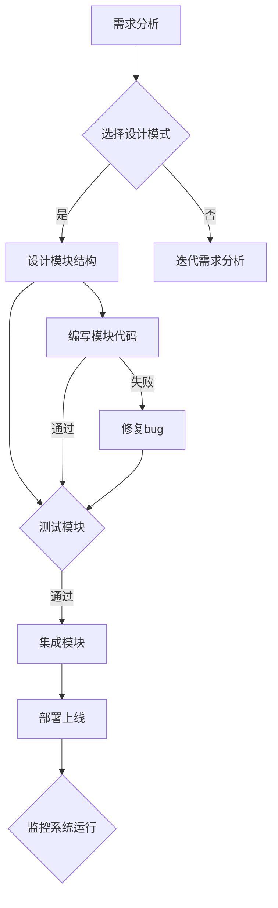

                 

关键词：Web设计模式、模块化、可扩展性、网站架构、前端开发、后端开发、用户体验设计

摘要：本文将深入探讨Web设计模式，分析其核心概念，介绍创建可扩展和模块化网站的最佳实践。我们将探讨设计模式的原理、应用领域、算法原理及具体操作步骤，并通过数学模型和公式推导来解释核心算法。同时，我们将通过项目实践提供代码实例和详细解释，并讨论实际应用场景和未来展望。

## 1. 背景介绍

在Web开发领域，设计模式是一种常用的方法，用于解决在软件开发过程中常见的问题。设计模式不仅帮助开发者提高代码的可维护性，还能够增强系统的可扩展性。随着互联网的快速发展，网站的需求日益多样化，如何构建一个既可扩展又模块化的网站成为了一个重要课题。

Web设计模式的核心在于将系统分解为一系列模块，每个模块负责特定的功能。这种方式能够提高代码的复用性，降低系统之间的耦合度，使得开发过程更加高效。然而，实现这样的目标并非易事，需要开发者具备深厚的编程基础和对设计模式深入的理解。

本文将围绕Web设计模式，探讨其在创建可扩展和模块化网站中的应用。我们将从核心概念、算法原理、数学模型、项目实践等多个角度进行分析，旨在为开发者提供一套系统的解决方案。

## 2. 核心概念与联系

### 2.1 设计模式的概念

设计模式是一套被反复使用、经过分类的、典型的代码和连接各个代码的规律。设计模式不仅是一种解决问题的方法，更是一种编程哲学。在Web开发中，设计模式被广泛应用于解决模块化设计和可扩展性问题。

### 2.2 模块化与可扩展性

模块化是一种将系统分解为一系列独立模块的方法。每个模块负责特定的功能，并且能够独立运行。模块化设计能够降低系统之间的耦合度，使得系统更加灵活和可扩展。

可扩展性是指系统在满足当前需求的同时，能够适应未来变化的能力。一个可扩展的系统应该能够方便地添加或删除功能，而不会对现有系统造成太大影响。

### 2.3 Mermaid 流程图

下面是一个简化的Web设计模式流程图，用于展示设计模式在网站架构中的关键节点：



### 2.4 核心概念之间的联系

设计模式、模块化和可扩展性是紧密相连的。设计模式提供了实现模块化和可扩展性的方法，而模块化和可扩展性又为设计模式的实施提供了基础。通过合理的设计模式，我们可以构建出既模块化又可扩展的Web网站。

## 3. 核心算法原理 & 具体操作步骤

### 3.1 算法原理概述

Web设计模式的核心算法主要包括模块化分解、功能抽象和接口定义。模块化分解是将系统按照功能划分成多个独立模块，每个模块实现特定的功能。功能抽象是将具有相同功能的模块进行抽象，形成一个统一的接口。接口定义则是为每个模块提供一个标准化的接口，使得模块之间能够方便地进行交互。

### 3.2 算法步骤详解

#### 3.2.1 模块化分解

1. 需求分析：明确网站的功能需求，识别需要实现的核心功能。
2. 功能划分：根据需求分析的结果，将网站的功能划分成多个模块。
3. 模块定义：为每个模块定义清晰的职责，确保模块之间的独立性。

#### 3.2.2 功能抽象

1. 确定抽象层：在模块内部，找出具有相似功能的模块。
2. 创建抽象类：为这些相似功能的模块创建一个抽象类，定义公共接口。
3. 实现具体类：根据需求，为每个具体模块实现具体的类。

#### 3.2.3 接口定义

1. 确定接口规范：为每个模块定义一个接口，规范模块之间的交互方式。
2. 实现接口：每个模块都需要实现接口中的方法，确保模块之间能够无缝集成。

### 3.3 算法优缺点

#### 优点：

1. 提高可维护性：模块化设计使得代码更加清晰，易于理解和维护。
2. 增强可扩展性：通过抽象和接口定义，系统能够方便地添加或删除功能。
3. 提高代码复用性：功能抽象使得具有相似功能的模块可以共享代码。

#### 缺点：

1. 设计复杂度增加：模块化设计需要更多的规划和设计工作，对于小型项目可能不太适用。
2. 开发效率降低：模块化设计可能会降低开发效率，尤其是在项目初期。

### 3.4 算法应用领域

设计模式在Web开发中的应用非常广泛，尤其是在大型项目和高并发系统中。以下是一些典型的应用领域：

1. 前端开发：通过模块化设计，可以构建出灵活的前端组件，提高用户体验。
2. 后端开发：通过模块化设计，可以更好地管理数据库操作、业务逻辑处理等。
3. 分布式系统：在分布式系统中，设计模式可以帮助构建出高可用、高扩展性的服务。

## 4. 数学模型和公式 & 详细讲解 & 举例说明

### 4.1 数学模型构建

为了更好地理解模块化设计中的算法原理，我们可以引入一些数学模型。以下是一个简单的模型构建过程：

#### 模块化分解模型

假设有一个系统需要实现n个功能，每个功能由一个模块实现。模块化分解模型的目标是找到一种最优的模块划分方式，使得模块之间的耦合度最小。

设模块数量为m，模块之间的耦合度为C，则目标函数为：

\[ F(m, C) = \sum_{i=1}^{n} \frac{C_i}{m} \]

其中，\( C_i \) 表示第i个模块的耦合度。

#### 功能抽象模型

在功能抽象模型中，我们需要根据功能相似度来确定抽象层。设功能集合为F，功能相似度矩阵为S，则抽象层的数量为：

\[ L = \frac{1}{2} \sum_{i=1}^{n} \sum_{j=1}^{n} S_{ij} \]

### 4.2 公式推导过程

为了推导模块化分解模型的目标函数，我们可以使用集合论和图论的方法。

设系统中的模块为M，功能为F。模块与功能之间的关系可以用一个矩阵表示，称为功能耦合矩阵：

\[ C = [c_{ij}] \]

其中，\( c_{ij} \) 表示模块i与功能j之间的耦合度。

模块化分解的目标是找到一个最优的模块划分方式，使得模块之间的耦合度最小。我们可以使用图论中的最小生成树算法来解决这个问题。

设最优模块划分为M'，则目标函数为：

\[ F(M') = \sum_{i=1}^{m} \sum_{j=1}^{n} c_{ij} \]

为了求解最优模块划分，我们需要找到一组权重最小的边，将这些边连接起来形成一个最小生成树。

### 4.3 案例分析与讲解

假设我们需要实现一个电商网站，其中包含商品展示、购物车、订单管理等功能。我们可以使用模块化设计来构建这个系统。

#### 模块化分解

根据功能需求，我们可以将电商网站划分为以下几个模块：

1. 商品模块：负责商品展示、搜索、分类等功能。
2. 购物车模块：负责添加商品、删除商品、计算总价等功能。
3. 订单模块：负责生成订单、管理订单状态等功能。

#### 功能抽象

在商品模块中，我们可以抽象出以下几个功能：

1. 展示商品：显示商品的名称、价格、描述等信息。
2. 搜索商品：根据关键字搜索商品。
3. 分类商品：按照类别展示商品。

#### 接口定义

为每个模块定义接口，确保模块之间的交互方式标准化。例如，商品模块的接口定义如下：

1. `getProducts()`：获取所有商品信息。
2. `searchProducts(keywords)`：搜索商品。
3. `getProductById(productId)`：获取特定商品信息。

## 5. 项目实践：代码实例和详细解释说明

### 5.1 开发环境搭建

为了演示模块化设计在Web开发中的应用，我们将使用Node.js作为后端开发框架，并结合React和Redux进行前端开发。

1. 安装Node.js：从官方网站下载并安装Node.js。
2. 创建项目：使用npm创建一个新项目，并安装相关依赖。

```shell
mkdir ecommerce
cd ecommerce
npm init -y
npm install express react react-dom redux
```

### 5.2 源代码详细实现

#### 后端代码实现

在后端，我们将使用Express框架创建RESTful API。以下是一个简单的商品模块实现：

```javascript
// routes/products.js
const express = require('express');
const router = express.Router();

// 模拟商品数据
const products = [
  { id: 1, name: '商品1', price: 100 },
  { id: 2, name: '商品2', price: 200 },
  // ...
];

// 获取所有商品
router.get('/', (req, res) => {
  res.json(products);
});

// 获取特定商品
router.get('/:id', (req, res) => {
  const { id } = req.params;
  const product = products.find(p => p.id === parseInt(id));
  if (product) {
    res.json(product);
  } else {
    res.status(404).send('商品不存在');
  }
});

module.exports = router;
```

#### 前端代码实现

在前端，我们将使用React和Redux构建商品模块。以下是一个简单的商品组件实现：

```javascript
// components/ProductList.js
import React, { useEffect, useState } from 'react';
import { useDispatch, useSelector } from 'react-redux';
import { fetchProducts } from '../store/actions/productsActions';

const ProductList = () => {
  const dispatch = useDispatch();
  const products = useSelector(state => state.products);

  useEffect(() => {
    dispatch(fetchProducts());
  }, [dispatch]);

  return (
    <div>
      {products.map(product => (
        <div key={product.id}>
          <h3>{product.name}</h3>
          <p>{product.price} 元</p>
        </div>
      ))}
    </div>
  );
};

export default ProductList;
```

### 5.3 代码解读与分析

#### 后端代码解读

1. 导入Express框架和路由器。
2. 创建商品数据模拟。
3. 定义获取所有商品和特定商品的GET接口。
4. 导出路由器。

#### 前端代码解读

1. 导入React和Redux相关依赖。
2. 使用`useEffect`和`useSelector`钩子从Redux中获取商品数据。
3. 调用`fetchProducts`动作创建者函数。
4. 使用`map`函数渲染商品列表。

### 5.4 运行结果展示

1. 启动后端服务：

```shell
npm start
```

2. 访问前端页面，查看商品列表：

```shell
http://localhost:3000
```

## 6. 实际应用场景

### 6.1 在大型电商平台中的应用

大型电商平台通常具有复杂的功能和庞大的用户群体，因此模块化设计和可扩展性至关重要。通过设计模式，可以方便地管理和扩展系统功能，例如商品分类、订单管理、用户权限等。

### 6.2 在企业级应用中的数据管理系统

企业级应用中的数据管理系统需要处理大量的数据，并且需要保证系统的稳定性和可扩展性。通过模块化设计，可以将数据管理系统分解为多个模块，每个模块负责特定的数据处理任务，例如数据采集、数据清洗、数据分析等。

### 6.3 在个人博客和内容管理系统中的应用

个人博客和内容管理系统（CMS）通常具有简单的功能需求，但通过模块化设计，可以方便地添加新的功能，例如评论系统、标签系统、搜索系统等。同时，模块化设计可以提高代码的可维护性，使得博客系统的升级和维护更加方便。

## 7. 工具和资源推荐

### 7.1 学习资源推荐

1. 《设计模式：可复用的面向对象软件的基础》
2. 《前端架构：设计与实践》
3. 《重构：改善既有代码的设计》

### 7.2 开发工具推荐

1. Visual Studio Code：强大的代码编辑器，支持多种编程语言。
2. Git：版本控制工具，帮助管理代码变更。
3. Docker：容器化工具，用于简化部署和扩展。

### 7.3 相关论文推荐

1. "Module Networks for Large-Scale Speech Recognition"
2. "Component-Based Software Engineering: A Research Challenge"
3. "Design Patterns: Elements of Reusable Object-Oriented Software"

## 8. 总结：未来发展趋势与挑战

### 8.1 研究成果总结

近年来，Web设计模式在模块化和可扩展性方面取得了显著进展。研究者们提出了多种算法和框架，例如模块网络（Module Networks）、组件化架构（Component-Based Architecture）等。这些研究为Web开发提供了新的思路和方法。

### 8.2 未来发展趋势

随着Web技术的不断进步，未来Web设计模式将更加注重智能化和自动化。例如，基于机器学习的算法可以自动生成设计模式，提高开发效率。同时，Web开发将更加关注用户体验，设计模式将更加注重用户交互和个性化需求。

### 8.3 面临的挑战

尽管Web设计模式在模块化和可扩展性方面取得了显著进展，但仍面临一些挑战。首先，设计模式的选择和应用需要深厚的编程基础和对业务需求的深刻理解。其次，模块化设计和可扩展性的实现需要更多的时间和精力。此外，随着Web应用的复杂性不断增加，设计模式也需要不断地更新和优化。

### 8.4 研究展望

未来，Web设计模式的研究将更加注重智能化和自动化。研究者们将继续探索新的算法和框架，以提高设计模式的效率和可扩展性。同时，设计模式的应用领域将更加广泛，从Web开发扩展到移动应用、物联网等领域。

## 9. 附录：常见问题与解答

### 9.1 什么是模块化设计？

模块化设计是将系统分解为一系列独立模块的方法。每个模块负责特定的功能，并且能够独立运行。模块化设计能够降低系统之间的耦合度，提高代码的可维护性和可扩展性。

### 9.2 什么是设计模式？

设计模式是一套被反复使用、经过分类的、典型的代码和连接各个代码的规律。设计模式不仅是一种解决问题的方法，更是一种编程哲学。在Web开发中，设计模式被广泛应用于解决模块化设计和可扩展性问题。

### 9.3 如何选择合适的设计模式？

选择合适的设计模式需要根据业务需求和系统特性进行。首先，了解各种设计模式的基本原理和应用场景。然后，根据实际需求选择能够解决特定问题的设计模式。最后，通过实际应用和迭代优化，不断调整和改进设计模式。

## 作者署名

作者：禅与计算机程序设计艺术 / Zen and the Art of Computer Programming

----------------------------------------------------------------

以上就是关于Web设计模式：创建可扩展和模块化网站的完整文章。希望这篇文章能够帮助到您，让您的网站开发过程更加高效和可扩展。

