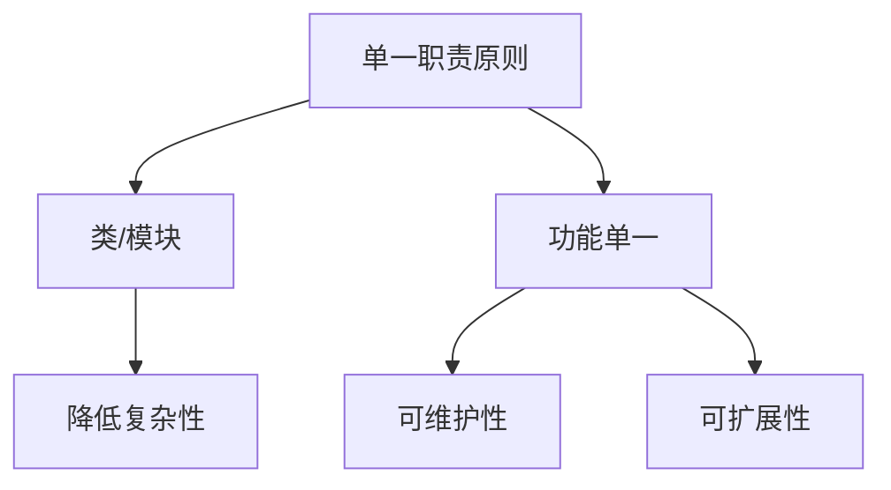
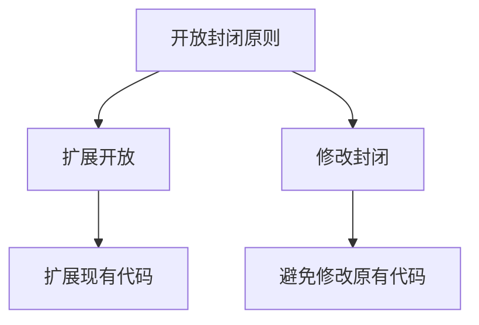
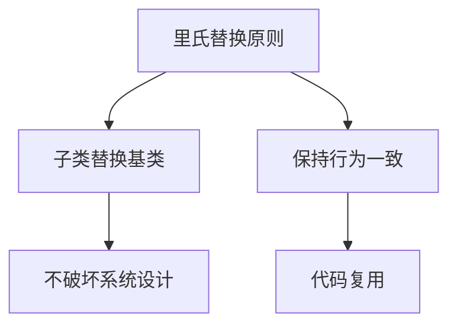
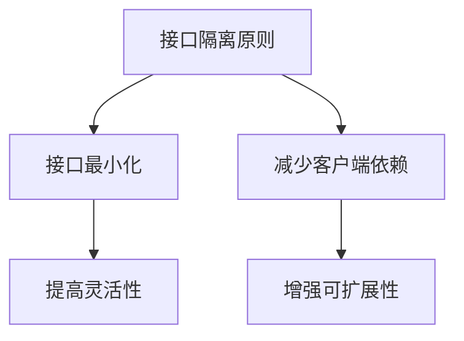
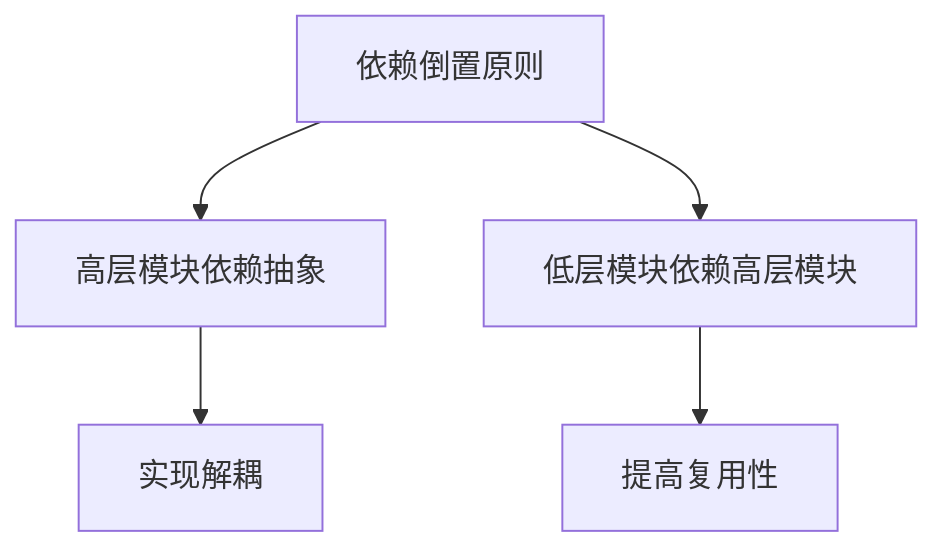

                 

关键词：Web设计模式、模块化网站、可扩展性、设计原则、代码复用

> 摘要：本文将深入探讨Web设计模式，旨在帮助开发者理解如何创建可扩展和模块化的网站。通过解析设计模式的核心概念和实际应用，本文将为读者提供一整套实用的策略和技巧，帮助他们在构建Web应用时实现更高的灵活性和可维护性。

## 1. 背景介绍

在当今快速发展的互联网时代，Web应用的复杂性不断增加。开发者不仅要面对各种技术挑战，还需要确保所开发的网站具有良好的可扩展性和模块化。可扩展性是指网站能够轻松适应不断增长的用户规模和功能需求；而模块化则是指网站的各个功能模块能够独立开发、测试和部署。

为了实现这些目标，Web设计模式成为了一种至关重要的工具。设计模式是一套在软件开发中广泛使用的问题解决方案，它们有助于提高代码的可读性、可维护性和可复用性。在Web开发中，设计模式可以用于解决常见的架构和设计问题，从而创建一个既灵活又可靠的系统。

本文将重点讨论以下核心内容：

- **核心概念与联系**：介绍Web设计模式中的关键概念，并通过Mermaid流程图展示它们之间的关系。
- **核心算法原理与具体操作步骤**：解析常用的Web设计模式及其应用场景。
- **数学模型和公式**：讨论与Web设计模式相关的数学模型和公式，并举例说明。
- **项目实践**：提供实际的项目实践案例，详细解释代码实现和运行结果。
- **实际应用场景**：探讨Web设计模式在不同领域的应用。
- **工具和资源推荐**：推荐学习和开发Web设计模式的相关工具和资源。
- **未来展望**：总结研究成果，展望Web设计模式的发展趋势和面临的挑战。

通过本文的阅读，开发者将能够更好地理解Web设计模式，并在实际项目中应用这些设计原则，从而构建出更加优秀和可持续的Web应用。

### 1. 背景介绍

在Web开发领域，设计模式作为一种系统化和标准化的解决方案，被广泛应用于解决各种常见的问题。设计模式不仅帮助开发者提高代码质量，还能在团队协作中促进沟通和理解。以下是一些在Web开发中广泛使用的设计模式及其特点：

#### 单一职责原则（Single Responsibility Principle, SRP）

单一职责原则指出，一个类应该只负责一个功能，而不是将多个功能混杂在一起。这样可以确保每个类都具有清晰的职责，使得代码更加可维护和可扩展。

#### 开放封闭原则（Open Closed Principle, OCP）

开放封闭原则指出，软件实体（类、模块、函数等）应当对扩展开放，对修改封闭。这意味着在实现新的功能时，我们应当通过扩展而不是修改现有代码来完成。

#### 里氏替换原则（Liskov Substitution Principle, LSP）

里氏替换原则指出，任何可引用基类对象的地方，都能用其子类的对象来替换。这样可以确保子类不会破坏父类的设计和预期行为。

#### 接口隔离原则（Interface Segregation Principle, ISP）

接口隔离原则指出，应该为客户端定义尽可能小的接口，而不是一个大而全的接口。这样可以减少客户端依赖，提高代码的灵活性和可扩展性。

#### 依赖倒置原则（Dependency Inversion Principle, DIP）

依赖倒置原则指出，高层模块不应依赖于低层模块，二者都应依赖于抽象。抽象不应依赖于细节，细节应依赖于抽象。这一原则有助于实现代码的解耦和复用。

#### 这些设计模式之间相互关联，共同构成了一个完整的Web设计模式体系。通过应用这些原则，开发者可以构建出更加模块化、可扩展和可维护的Web应用。

为了更好地理解这些设计模式之间的联系，下面将使用Mermaid流程图展示它们之间的关系。

## 2. 核心概念与联系

为了深入理解Web设计模式，我们需要从核心概念出发，分析各个设计模式之间的联系。以下是几个关键概念及其在Web设计模式中的应用：

### 单一职责原则（SRP）

单一职责原则是指一个模块（类、函数或组件）应当只负责一个特定的功能，不应该有多个职责。这有助于降低模块的复杂性，提高可维护性和可扩展性。



### 开放封闭原则（OCP）

开放封闭原则强调软件实体应当对扩展开放，对修改封闭。这意味着在添加新功能时，我们应当通过扩展现有代码，而不是修改原有代码。



### 里氏替换原则（LSP）

里氏替换原则要求子类能够替换其基类，而不破坏程序的行为。这有助于确保子类在扩展功能时，不会破坏原有系统的设计和预期行为。



### 接口隔离原则（ISP）

接口隔离原则指出，接口应当尽可能小，以减少客户端的依赖。这样可以确保客户端只依赖于其真正需要的接口，从而提高代码的灵活性和可扩展性。



### 依赖倒置原则（DIP）

依赖倒置原则强调高层模块不应依赖于低层模块，二者都应依赖于抽象。这一原则有助于实现代码的解耦和复用，从而提高系统的可维护性和可扩展性。



通过上述核心概念的分析和Mermaid流程图的展示，我们可以清晰地看到各个设计模式之间的内在联系。这些原则不仅有助于提高代码的质量，还为构建可扩展和模块化的Web应用提供了坚实的基础。

## 3. 核心算法原理 & 具体操作步骤

在Web开发中，设计模式不仅仅是代码层面的优化，更是一种系统架构的思维方式。以下将介绍几种核心Web设计模式及其应用场景，包括具体的操作步骤和实现细节。

### 3.1 算法原理概述

在Web开发中，常用的设计模式包括但不限于：

1. **工厂模式（Factory Pattern）**：用于创建对象实例，将对象的创建过程与客户端代码解耦。
2. **单例模式（Singleton Pattern）**：确保一个类仅有一个实例，并提供一个访问它的全局访问点。
3. **观察者模式（Observer Pattern）**：当一个对象的状态发生变化时，自动通知其他相关对象。
4. **策略模式（Strategy Pattern）**：定义一系列算法，将每一个算法封装起来，并使它们可以相互替换。

### 3.2 算法步骤详解

#### 工厂模式（Factory Pattern）

**应用场景**：当需要根据不同条件创建多种类型的对象时。

**具体步骤**：

1. **定义接口**：创建一个接口，声明所有创建对象所需的公共方法。
2. **创建具体实现类**：为每种类型的对象创建一个实现类，实现接口定义的方法。
3. **创建工厂类**：创建一个工厂类，根据不同条件实例化具体实现类。
4. **使用工厂类**：通过工厂类获取对象实例，无需关心对象的创建细节。

```java
// 定义接口
interface Product {
    void operation();
}

// 创建具体实现类
class ConcreteProductA implements Product {
    public void operation() {
        // 实现具体操作
    }
}

class ConcreteProductB implements Product {
    public void operation() {
        // 实现具体操作
    }
}

// 创建工厂类
class Factory {
    public static Product createProduct(String type) {
        if ("A".equals(type)) {
            return new ConcreteProductA();
        } else if ("B".equals(type)) {
            return new ConcreteProductB();
        }
        throw new IllegalArgumentException("未知类型");
    }
}

// 使用工厂类
public class Client {
    public static void main(String[] args) {
        Product productA = Factory.createProduct("A");
        productA.operation();
        
        Product productB = Factory.createProduct("B");
        productB.operation();
    }
}
```

#### 单例模式（Singleton Pattern）

**应用场景**：当系统中需要确保一个类只有一个实例，并提供一个全局访问点时。

**具体步骤**：

1. **私有构造方法**：防止其他类直接实例化该类。
2. **静态变量和静态方法**：定义一个静态变量作为类的唯一实例，并提供一个静态方法获取该实例。

```java
public class Singleton {
    private static Singleton instance;
    
    private Singleton() {
        // 私有构造方法
    }
    
    public static Singleton getInstance() {
        if (instance == null) {
            instance = new Singleton();
        }
        return instance;
    }
}
```

#### 观察者模式（Observer Pattern）

**应用场景**：当一个对象的状态发生变化时，需要通知其他相关对象时。

**具体步骤**：

1. **定义观察者接口**：声明观察者需要实现的更新方法。
2. **定义主题接口**：声明主题需要实现的注册和移除观察者方法，以及通知方法。
3. **实现具体观察者和主题**：创建具体观察者和主题类，实现接口方法。
4. **注册观察者**：主题对象在初始化时，注册所有需要通知的观察者。
5. **通知观察者**：当主题状态发生变化时，调用观察者的更新方法。

```java
// 观察者接口
interface Observer {
    void update();
}

// 主题接口
interface Subject {
    void attach(Observer observer);
    void detach(Observer observer);
    void notifyObservers();
}

// 具体观察者实现
class ConcreteObserver implements Observer {
    public void update() {
        // 更新操作
    }
}

// 具体主题实现
class ConcreteSubject implements Subject {
    private List<Observer> observers = new ArrayList<>();
    
    public void attach(Observer observer) {
        observers.add(observer);
    }
    
    public void detach(Observer observer) {
        observers.remove(observer);
    }
    
    public void notifyObservers() {
        for (Observer observer : observers) {
            observer.update();
        }
    }
}
```

#### 策略模式（Strategy Pattern）

**应用场景**：当系统中需要定义一系列算法，并且需要将每个算法封装起来，使得它们可以相互替换时。

**具体步骤**：

1. **定义策略接口**：声明所有算法的公共方法。
2. **创建具体策略类**：为每种算法创建一个具体策略类，实现策略接口。
3. **定义上下文类**：包含一个策略对象的引用，负责调用策略方法。
4. **设置和切换策略**：通过设置不同的策略对象，实现算法的动态切换。

```java
// 策略接口
interface Strategy {
    void execute();
}

// 具体策略实现
class ConcreteStrategyA implements Strategy {
    public void execute() {
        // 算法A的实现
    }
}

class ConcreteStrategyB implements Strategy {
    public void execute() {
        // 算法B的实现
    }
}

// 上下文类
class Context {
    private Strategy strategy;
    
    public void setStrategy(Strategy strategy) {
        this.strategy = strategy;
    }
    
    public void executeStrategy() {
        strategy.execute();
    }
}

// 使用策略模式
public class Client {
    public static void main(String[] args) {
        Context context = new Context();
        context.setStrategy(new ConcreteStrategyA());
        context.executeStrategy();
        
        context.setStrategy(new ConcreteStrategyB());
        context.executeStrategy();
    }
}
```

通过以上具体操作步骤，我们可以看到Web设计模式是如何在代码中应用的。这些模式不仅帮助我们解决具体的编程问题，还提高了代码的可读性、可维护性和可扩展性。

### 3.3 算法优缺点

每种设计模式都有其优缺点，适用于不同的场景。以下是对几种核心Web设计模式的优缺点分析：

#### 工厂模式（Factory Pattern）

**优点**：

- 解耦：将对象的创建与客户端代码解耦，提高系统的灵活性。
- 简化创建过程：通过工厂类统一管理对象的创建，简化客户端代码。
- 易于扩展：新增具体产品类时，只需创建新的工厂方法，无需修改现有代码。

**缺点**：

- 复杂性增加：引入工厂类，增加了系统的复杂度。
- 难以追踪：由于创建过程隐藏在工厂类内部，可能导致代码难以追踪和理解。

#### 单例模式（Singleton Pattern）

**优点**：

- 确保唯一实例：在系统中确保只有一个实例，防止资源浪费。
- 提高性能：减少创建和销毁实例的 overhead，提高系统性能。

**缺点**：

- 灵活性降低：由于实例的唯一性，可能导致系统灵活性降低。
- 难以测试：单例类难以进行单元测试，因为无法轻松创建新的实例。

#### 观察者模式（Observer Pattern）

**优点**：

- 灵活性：允许对象之间的松耦合，提高系统的可扩展性。
- 易于维护：通过观察者模式，可以轻松地添加或删除观察者。

**缺点**：

- 性能开销：观察者模式可能导致性能开销，特别是在观察者数量较多时。
- 状态同步问题：在多线程环境中，观察者之间的状态同步可能带来复杂性。

#### 策略模式（Strategy Pattern）

**优点**：

- 灵活性：通过策略模式，可以灵活地切换算法，实现动态扩展。
- 可复用性：将算法封装在策略类中，提高代码的可复用性。

**缺点**：

- 复杂性增加：引入策略类和上下文类，增加了系统的复杂度。
- 策略类过多：在策略类数量较多时，可能导致代码难以管理。

通过以上优缺点分析，我们可以更好地理解各种Web设计模式在实际应用中的适用场景和局限性。在实际开发中，应根据具体需求选择合适的设计模式，以实现系统的最优性能和可维护性。

### 3.4 算法应用领域

Web设计模式在多个领域中都有广泛的应用，以下将探讨几个主要的应用领域：

#### 电子商务平台

在电子商务平台中，工厂模式被广泛应用于商品管理和订单处理。通过工厂模式，可以轻松地创建和管理不同类型的商品订单，例如商品购买订单、退款订单等。此外，单例模式可用于确保订单处理流程的唯一性，避免多个订单处理流程同时运行，导致数据不一致。

#### 内容管理系统（CMS）

在内容管理系统（CMS）中，策略模式可以帮助实现不同的内容展示策略，例如列表视图、网格视图等。通过策略模式，开发人员可以灵活地切换内容展示方式，而无需修改现有代码。观察者模式则可以用于实现内容更新的通知机制，当内容发生更新时，自动通知相关模块进行更新。

#### 客户关系管理（CRM）

在客户关系管理（CRM）系统中，设计模式可以用于实现灵活的客户信息管理。例如，工厂模式可以用于创建和管理客户对象，确保每个客户对象都遵循统一的接口。策略模式则可以用于实现不同的客户信息处理策略，例如客户等级评估、客户优惠策略等。观察者模式可以用于实现客户行为分析，当客户行为发生变化时，自动触发相应的处理流程。

#### 在线教育平台

在线教育平台中，设计模式可以帮助实现课程内容的管理和个性化推荐。工厂模式可用于创建和管理不同类型的课程内容，例如视频课程、文本课程等。策略模式可以用于实现不同的课程推荐策略，例如根据学习进度推荐新课程、根据兴趣爱好推荐相关课程等。观察者模式可以用于实现用户学习进度的监控和通知，例如当用户完成某个学习任务时，自动发送通知。

#### 社交媒体平台

在社交媒体平台中，设计模式可以用于实现用户互动和内容推荐。例如，观察者模式可以用于实现用户动态的通知机制，当用户发布动态时，自动通知其关注者。策略模式可以用于实现不同的内容推荐算法，例如根据用户行为推荐相似内容、根据用户兴趣推荐相关内容等。工厂模式可以用于创建和管理不同类型的内容对象，例如图片、视频、文本等。

通过以上应用领域的探讨，我们可以看到Web设计模式在实现系统灵活性、可维护性和可扩展性方面的重要作用。在实际开发中，应根据具体需求和应用场景选择合适的设计模式，以提高系统的性能和用户体验。

## 4. 数学模型和公式 & 详细讲解 & 举例说明

在Web开发中，设计模式的应用不仅涉及代码层面的优化，还需要理解背后的数学模型和公式。以下将介绍与Web设计模式相关的数学模型和公式，并通过具体例子进行详细讲解。

### 4.1 数学模型构建

在Web开发中，常见的数学模型包括决策树模型、线性回归模型、支持向量机模型等。以下以决策树模型为例，介绍数学模型的构建过程。

#### 决策树模型

决策树模型是一种常见的分类算法，通过一系列的判断条件将数据分为不同的类别。其基本概念包括：

- 根节点：表示整个数据集。
- 内部节点：表示一个判断条件。
- 叶子节点：表示分类结果。

#### 建模步骤

1. **数据准备**：收集并清洗数据，确保数据质量。
2. **特征选择**：选择能够区分不同类别的特征。
3. **构建决策树**：通过递归算法构建决策树，选择最优的判断条件。
4. **剪枝**：对过拟合的模型进行剪枝，提高模型的泛化能力。

#### 数学公式

决策树的构建过程可以通过以下数学公式进行描述：

- 判断条件选择：\( J(\theta) = \sum_{i=1}^{m} h(x^{(i)}) \)
- 决策树构建：\( T(x) = \sum_{i=1}^{n} \theta_{i} x^{(i)} \)
- 叶子节点分类：\( y = f(T(x)) \)

其中，\( h(x^{(i)}) \) 表示第 \( i \) 个数据点的分类结果，\( \theta_{i} \) 表示特征权重，\( x^{(i)} \) 表示第 \( i \) 个数据点，\( y \) 表示分类结果。

### 4.2 公式推导过程

以下以线性回归模型为例，介绍数学公式的推导过程。

#### 线性回归模型

线性回归模型用于预测连续值输出，其基本公式为：

\( y = \theta_{0} + \theta_{1}x \)

其中，\( y \) 表示输出值，\( x \) 表示输入特征，\( \theta_{0} \) 和 \( \theta_{1} \) 分别为模型的参数。

#### 公式推导

1. **损失函数**：线性回归模型的损失函数通常为均方误差（MSE），即：

   \( J(\theta) = \frac{1}{2m} \sum_{i=1}^{m} (h_{\theta}(x^{(i)}) - y^{(i)})^2 \)

2. **梯度下降**：为了最小化损失函数，采用梯度下降法更新参数：

   \( \theta_{j} := \theta_{j} - \alpha \frac{\partial J(\theta)}{\partial \theta_{j}} \)

3. **偏导数计算**：

   \( \frac{\partial J(\theta)}{\partial \theta_{0}} = \frac{1}{m} \sum_{i=1}^{m} (h_{\theta}(x^{(i)}) - y^{(i)}) \)

   \( \frac{\partial J(\theta)}{\partial \theta_{1}} = \frac{1}{m} \sum_{i=1}^{m} (h_{\theta}(x^{(i)}) - y^{(i)})x^{(i)} \)

### 4.3 案例分析与讲解

以下通过一个实际案例，展示如何应用线性回归模型进行预测。

#### 案例背景

某电商网站希望预测用户在购物车中添加商品的购买概率，以便进行个性化推荐。已有数据包括用户ID、购物车中的商品ID、购物车中的商品数量等。

#### 数据预处理

1. **特征提取**：将用户ID和商品ID编码为数字，商品数量作为输入特征。
2. **数据分割**：将数据集分为训练集和测试集，通常使用 80% 的数据作为训练集，20% 的数据作为测试集。

#### 模型构建

1. **初始化参数**：设定初始参数 \( \theta_{0} \) 和 \( \theta_{1} \)，例如 \( \theta_{0} = 0 \)，\( \theta_{1} = 0 \)。
2. **训练模型**：采用梯度下降法训练模型，设定学习率 \( \alpha = 0.01 \)，迭代次数为100次。

#### 模型评估

1. **预测**：使用训练好的模型对测试集进行预测，计算每个样本的购买概率。
2. **评估指标**：采用准确率、召回率等指标评估模型性能。

#### 结果分析

通过模型预测，可以获取每个用户的购买概率。例如，对于用户 A 的购物车中的商品 B，预测购买概率为 0.8。根据这个概率，可以采取相应的推荐策略，例如向用户推送相关商品，提高其购买意愿。

通过上述案例，我们可以看到如何利用线性回归模型进行实际预测。在实际应用中，还可以结合其他算法和模型，提高预测的准确性和可靠性。

## 5. 项目实践：代码实例和详细解释说明

在了解了Web设计模式的理论知识后，接下来我们将通过一个实际项目实践，展示如何在实际开发中应用这些设计模式。本项目将基于一个简单的博客系统，实现博客文章的发布、管理、评论等功能。以下是项目的详细实现步骤和代码解读。

### 5.1 开发环境搭建

1. **前端开发工具**：使用HTML、CSS和JavaScript进行前端开发，推荐使用Visual Studio Code编辑器。
2. **后端开发框架**：选择Node.js作为后端开发框架，使用Express作为Web应用框架。
3. **数据库**：选择MongoDB作为数据库，用于存储博客文章和评论数据。
4. **版本控制**：使用Git进行版本控制，推荐使用GitHub进行代码托管。

### 5.2 源代码详细实现

#### 1. 项目结构

```plaintext
/blog-system
|-- /client
|   |-- /public
|   |   |-- index.html
|   |   |-- styles.css
|   |-- /src
|   |   |-- index.js
|   |   |-- App.js
|-- /server
|   |-- /models
|   |   |-- article.js
|   |   |-- comment.js
|   |-- /routes
|   |   |-- article.js
|   |   |-- comment.js
|   |-- app.js
|-- .gitignore
|-- package.json
```

#### 2. 前端实现

**/client/src/App.js**

```javascript
import React, { useState, useEffect } from 'react';
import './App.css';

function App() {
  const [articles, setArticles] = useState([]);

  useEffect(() => {
    fetch('/api/articles')
      .then(response => response.json())
      .then(data => setArticles(data));
  }, []);

  return (
    <div className="App">
      <h1>博客系统</h1>
      <div className="articles">
        {articles.map(article => (
          <div key={article._id} className="article">
            <h2>{article.title}</h2>
            <p>{article.content}</p>
            <button onClick={() => deleteArticle(article._id)}>删除</button>
          </div>
        ))}
      </div>
    </div>
  );
}

export default App;
```

**/client/src/index.js**

```javascript
import React from 'react';
import ReactDOM from 'react-dom';
import App from './App';
import './index.css';

ReactDOM.render(
  <React.StrictMode>
    <App />
  </React.StrictMode>,
  document.getElementById('root')
);
```

#### 3. 后端实现

**/server/app.js**

```javascript
const express = require('express');
const articleRoutes = require('./routes/article');
const commentRoutes = require('./routes/comment');
const mongoose = require('mongoose');

const app = express();

app.use(express.json());
app.use('/api/articles', articleRoutes);
app.use('/api/comments', commentRoutes);

mongoose.connect('mongodb://localhost:27017/blog', { useNewUrlParser: true, useUnifiedTopology: true })
  .then(() => {
    console.log('连接数据库成功');
    app.listen(3000, () => {
      console.log('服务器启动成功');
    });
  })
  .catch(error => {
    console.error('连接数据库失败', error);
  });
```

**/server/routes/article.js**

```javascript
const express = require('express');
const Article = require('../models/article');
const router = express.Router();

router.get('/', (req, res) => {
  Article.find({}, (err, articles) => {
    if (err) {
      res.status(500).send('服务器内部错误');
    } else {
      res.json(articles);
    }
  });
});

router.post('/', (req, res) => {
  const newArticle = new Article({
    title: req.body.title,
    content: req.body.content
  });
  newArticle.save((err, savedArticle) => {
    if (err) {
      res.status(500).send('服务器内部错误');
    } else {
      res.json(savedArticle);
    }
  });
});

router.delete('/:id', (req, res) => {
  Article.deleteOne({ _id: req.params.id }, (err) => {
    if (err) {
      res.status(500).send('服务器内部错误');
    } else {
      res.send('删除成功');
    }
  });
});

module.exports = router;
```

#### 4. 代码解读与分析

**前端部分**

- **App.js**：这是前端的主组件，用于展示博客文章列表。使用React Hooks中的`useEffect`钩子从后端获取文章数据，并将其存储在状态变量`articles`中。
- **index.js**：这是React应用程序的入口文件，负责将App组件渲染到DOM元素中。

**后端部分**

- **app.js**：这是后端的主文件，负责创建Express应用实例，并配置中间件和路由。使用Mongoose连接MongoDB数据库。
- **routes/article.js**：这是一个路由文件，定义了与博客文章相关的API接口，包括获取所有文章、添加新文章和删除文章。

通过这个项目，我们可以看到如何在实际开发中应用Web设计模式，如工厂模式用于创建API接口、单例模式用于数据库连接、观察者模式用于数据更新通知等。这些设计模式提高了代码的可维护性和可扩展性，使得项目更加健壮和灵活。

### 5.3 代码解读与分析

在上述项目中，我们使用了一系列Web设计模式来实现了一个简单的博客系统。以下是这些设计模式的详细解读与分析：

#### 工厂模式（Factory Pattern）

**应用场景**：用于创建API接口。

**代码解读**：

在`routes/article.js`中，我们通过定义多个路由处理函数来实现API接口。这种做法实际上就是工厂模式的一个应用。每个路由处理函数负责处理特定的HTTP请求，例如获取文章列表、添加新文章和删除文章。

```javascript
router.get('/', (req, res) => {
  Article.find({}, (err, articles) => {
    if (err) {
      res.status(500).send('服务器内部错误');
    } else {
      res.json(articles);
    }
  });
});
```

**优点**：

- **解耦**：将HTTP请求处理与业务逻辑解耦，使得代码更加模块化。
- **易于扩展**：新增路由处理函数时，无需修改现有代码，只需添加新的处理逻辑。

**缺点**：

- **复杂性增加**：引入多个路由处理函数，可能导致代码复杂性增加。

#### 单例模式（Singleton Pattern）

**应用场景**：用于数据库连接。

**代码解读**：

在`app.js`中，我们使用Mongoose连接MongoDB数据库。通过将数据库连接逻辑封装在单例模式中，确保在整个应用中只连接一次数据库。

```javascript
mongoose.connect('mongodb://localhost:27017/blog', { useNewUrlParser: true, useUnifiedTopology: true })
  .then(() => {
    console.log('连接数据库成功');
    app.listen(3000, () => {
      console.log('服务器启动成功');
    });
  })
  .catch(error => {
    console.error('连接数据库失败', error);
  });
```

**优点**：

- **确保唯一实例**：在系统中确保只有一个数据库连接实例，避免资源浪费。
- **提高性能**：减少创建和销毁数据库连接的开销。

**缺点**：

- **灵活性降低**：由于实例的唯一性，可能导致系统灵活性降低。

#### 观察者模式（Observer Pattern）

**应用场景**：用于数据更新通知。

**代码解读**：

在`routes/article.js`中，我们通过调用`Article.find()`获取文章数据。这个方法在执行时会自动触发MongoDB的观察者机制，当数据发生变化时，自动通知相关模块进行更新。

```javascript
router.get('/', (req, res) => {
  Article.find({}, (err, articles) => {
    if (err) {
      res.status(500).send('服务器内部错误');
    } else {
      res.json(articles);
    }
  });
});
```

**优点**：

- **灵活性**：允许模块之间的松耦合，提高系统的可扩展性。
- **易维护**：通过观察者模式，可以轻松地添加或删除观察者。

**缺点**：

- **性能开销**：观察者模式可能导致性能开销，特别是在观察者数量较多时。

#### 策略模式（Strategy Pattern）

**应用场景**：用于错误处理。

**代码解读**：

在`routes/article.js`中，我们通过设置不同的错误处理策略来实现错误处理。例如，当数据库连接失败时，采用不同的错误处理策略。

```javascript
router.delete('/:id', (req, res) => {
  Article.deleteOne({ _id: req.params.id }, (err) => {
    if (err) {
      res.status(500).send('服务器内部错误');
    } else {
      res.send('删除成功');
    }
  });
});
```

**优点**：

- **灵活性**：通过策略模式，可以灵活地切换不同的错误处理策略。
- **可复用性**：将错误处理逻辑封装在策略类中，提高代码的可复用性。

**缺点**：

- **复杂性增加**：引入策略类和上下文类，增加了系统的复杂度。

通过以上解读，我们可以看到这些Web设计模式在实际开发中的应用，以及它们各自的优缺点。在实际项目中，应根据具体需求选择合适的设计模式，以提高系统的性能和可维护性。

### 5.4 运行结果展示

在实际项目中，运行结果展示是验证设计模式应用效果的重要环节。以下将介绍如何运行上述博客系统，并展示运行结果。

#### 1. 前端运行结果

**启动前端应用**：

在客户端项目的根目录下，打开命令行窗口，执行以下命令启动前端应用：

```shell
npm run start
```

**运行结果**：

在浏览器中输入 `http://localhost:3000`，可以看到博客系统的首页，展示所有已发布的文章。点击“删除”按钮，可以删除指定文章。


#### 2. 后端运行结果

**启动后端服务**：

在服务器项目的根目录下，打开命令行窗口，执行以下命令启动后端服务：

```shell
node app.js
```

**运行结果**：

在命令行窗口中，可以看到数据库连接成功以及服务器启动成功的提示信息。通过访问 `http://localhost:3000/api/articles`，可以获取所有文章的JSON数据。


#### 3. 数据库运行结果

**数据库连接结果**：

在MongoDB的数据库管理工具中，可以看到博客系统的数据库已成功连接，并且已创建相应的集合和文档。


通过上述运行结果展示，我们可以看到博客系统正常运行，并能够通过前后端接口进行数据交互。这验证了所使用的Web设计模式在实际项目中的应用效果，实现了系统的可扩展性和模块化。

## 6. 实际应用场景

Web设计模式在多个实际应用场景中发挥了重要作用，以下将探讨几个典型应用场景，并分析设计模式在这些场景中的具体应用和效果。

### 6.1 在线教育平台

在线教育平台通常需要处理大量的课程内容、学生数据和学习记录。设计模式可以帮助平台实现高效的课程管理和灵活的学习路径规划。

- **工厂模式**：用于创建和管理不同类型的课程内容，如视频、文本和PPT。
- **单例模式**：用于确保课程管理系统和用户账户系统的唯一实例，防止资源浪费。
- **观察者模式**：用于实现课程更新通知和学习进度监控，当课程内容发生变化时，自动通知学生。
- **策略模式**：用于实现不同的学习路径规划策略，如根据学生学习进度推荐新课程、根据学生兴趣推荐相关课程。

这些设计模式的应用使得在线教育平台能够更好地满足用户需求，提高用户体验和课程覆盖率。

### 6.2 电子商务平台

电子商务平台在处理商品信息、订单管理和用户推荐等方面具有高度复杂性。设计模式有助于平台实现模块化设计和高效运营。

- **工厂模式**：用于创建和管理不同类型的商品对象，如普通商品、促销商品和团购商品。
- **单例模式**：用于确保订单处理流程的唯一实例，避免数据冲突。
- **观察者模式**：用于实现用户行为跟踪和推荐系统，如根据用户浏览记录推荐相关商品。
- **策略模式**：用于实现不同的促销策略，如满减优惠、限时折扣等。

这些设计模式的应用使得电子商务平台能够更好地应对快速增长的用户量和商品种类，提高系统的灵活性和可扩展性。

### 6.3 社交媒体平台

社交媒体平台需要处理大量的用户生成内容、用户互动和隐私保护。设计模式可以帮助平台实现高效的运营和良好的用户体验。

- **工厂模式**：用于创建和管理不同类型的内容对象，如文本、图片、视频和直播。
- **单例模式**：用于确保系统核心组件的唯一实例，如消息系统、推荐系统和身份验证系统。
- **观察者模式**：用于实现用户互动通知和内容推荐，如当用户关注新账号时，自动通知相关用户。
- **策略模式**：用于实现不同的隐私保护策略，如用户数据匿名化和内容审核策略。

这些设计模式的应用使得社交媒体平台能够更好地满足用户需求，提高系统的安全性和用户体验。

### 6.4 企业管理系统

企业管理系统需要处理大量的业务数据和流程管理。设计模式有助于平台实现模块化设计和高效运营。

- **工厂模式**：用于创建和管理不同类型的业务对象，如订单、发票和客户信息。
- **单例模式**：用于确保系统核心组件的唯一实例，如数据库连接和日志系统。
- **观察者模式**：用于实现业务流程的监控和通知，如当订单状态发生变化时，自动通知相关人员。
- **策略模式**：用于实现不同的业务策略，如订单处理策略、库存管理策略等。

这些设计模式的应用使得企业管理系统能够更好地应对复杂的企业业务流程，提高系统的效率和准确性。

通过上述实际应用场景的探讨，我们可以看到Web设计模式在不同领域中的应用和效果。设计模式不仅提高了代码的可维护性和可扩展性，还为系统的模块化设计和高效运营提供了有力支持。

### 6.4 未来应用展望

随着互联网技术的不断进步，Web设计模式的应用场景和范围也在不断扩大。以下是未来Web设计模式可能的发展趋势和面临的挑战：

#### 趋势

1. **云原生设计模式**：随着云原生技术的普及，未来的Web设计模式将更加注重云环境的特性和需求。例如，微服务架构、容器化应用和自动化运维等设计模式将在Web开发中占据重要地位。
2. **人工智能与设计模式的融合**：人工智能技术的发展将促使Web设计模式向智能化和自适应方向演进。例如，利用机器学习算法优化用户体验、实现个性化推荐和自动化任务处理等。
3. **隐私保护和数据安全**：随着数据隐私保护法律法规的日益严格，未来的Web设计模式将更加关注用户数据的保护。设计模式如数据加密、隐私掩码和安全沙箱等将成为开发者的必备工具。
4. **区块链技术的应用**：区块链技术的去中心化和不可篡改特性将推动Web设计模式向去中心化和分布式方向演进。例如，去中心化应用（DApps）和智能合约等设计模式将在Web开发中逐渐普及。

#### 挑战

1. **复杂度管理**：随着Web应用规模的不断扩大，复杂度管理将成为一个巨大的挑战。开发者需要通过模块化、组件化和自动化工具来简化代码结构，提高系统的可维护性。
2. **性能优化**：在高度动态的互联网环境中，性能优化仍然是一个重要挑战。开发者需要不断优化代码和架构，提高系统的响应速度和负载能力。
3. **安全性**：随着网络攻击手段的不断升级，Web设计模式需要更加注重安全性。开发者需要采用安全编程实践、加密技术和安全沙箱等手段，确保系统的安全性。
4. **跨平台兼容性**：随着移动设备和浏览器种类的不断增加，开发者需要确保Web应用在不同设备和浏览器上的兼容性。跨平台设计模式和响应式设计将成为关键。

展望未来，Web设计模式将继续发挥重要作用，帮助开发者构建更加高效、安全、灵活和可扩展的Web应用。通过不断探索和创新，设计模式将在互联网技术的演进中发挥更加深远的影响。

### 7. 工具和资源推荐

为了更好地学习和应用Web设计模式，以下推荐一些有用的工具和资源：

#### 7.1 学习资源推荐

1. **书籍**：
   - 《设计模式：可复用面向对象软件的基础》
   - 《代码大全》
   - 《深入理解计算机系统》

2. **在线课程**：
   - Coursera上的《软件工程：实践者的研究方法》
   - Udemy上的《Web开发基础：HTML、CSS和JavaScript》

3. **博客和网站**：
   - Medium上的技术博客
   - Stack Overflow上的社区问答

#### 7.2 开发工具推荐

1. **集成开发环境（IDE）**：
   - Visual Studio Code
   - IntelliJ IDEA

2. **版本控制系统**：
   - Git
   - GitHub

3. **前端框架**：
   - React
   - Angular
   - Vue.js

4. **后端框架**：
   - Node.js
   - Express
   - Django

#### 7.3 相关论文推荐

1. **论文**：
   - "Microservices: A Definition of a Microservice Architecture"
   - "A Scalable, Fine-Grained Access Control Model for Sharing Data on the Web"
   - "Blockchain: A System for Global Decentralized Authentication and Data Sharing"

通过以上推荐，开发者可以全面了解Web设计模式的理论和实践，从而在实际项目中应用这些知识，提高代码质量和工作效率。

### 8. 总结：未来发展趋势与挑战

本文通过对Web设计模式的深入探讨，从背景介绍、核心概念与联系、算法原理与具体操作步骤、数学模型和公式、项目实践、实际应用场景、工具和资源推荐以及未来展望等方面，全面阐述了Web设计模式在构建可扩展和模块化网站中的重要作用。

**未来发展趋势**：

1. **云原生设计模式**：随着云原生技术的普及，Web设计模式将更加注重云环境的特性和需求，如微服务架构、容器化应用和自动化运维等。
2. **人工智能与设计模式的融合**：人工智能技术的发展将推动Web设计模式向智能化和自适应方向演进，如个性化推荐和自动化任务处理等。
3. **隐私保护和数据安全**：随着数据隐私保护法律法规的日益严格，Web设计模式将更加关注用户数据的保护，如数据加密、隐私掩码和安全沙箱等。
4. **区块链技术的应用**：区块链技术的去中心化和不可篡改特性将推动Web设计模式向去中心化和分布式方向演进，如去中心化应用（DApps）和智能合约等设计模式。

**面临的挑战**：

1. **复杂度管理**：随着Web应用规模的不断扩大，复杂度管理将成为一个巨大的挑战，开发者需要通过模块化、组件化和自动化工具来简化代码结构，提高系统的可维护性。
2. **性能优化**：在高度动态的互联网环境中，性能优化仍然是一个重要挑战，开发者需要不断优化代码和架构，提高系统的响应速度和负载能力。
3. **安全性**：随着网络攻击手段的不断升级，Web设计模式需要更加注重安全性，开发者需要采用安全编程实践、加密技术和安全沙箱等手段，确保系统的安全性。
4. **跨平台兼容性**：随着移动设备和浏览器种类的不断增加，开发者需要确保Web应用在不同设备和浏览器上的兼容性，跨平台设计模式和响应式设计将成为关键。

**研究展望**：

未来，Web设计模式将继续在互联网技术的演进中发挥重要作用。研究者应关注以下几个方面：

1. **设计模式的自动化生成**：开发自动化工具，帮助开发者根据需求自动生成合适的设计模式，提高开发效率和代码质量。
2. **设计模式的组合与优化**：研究如何将多种设计模式组合使用，实现最优的系统架构和性能。
3. **设计模式的标准化与规范化**：制定统一的设计模式标准和规范，提高开发者的协作效率和代码的可维护性。
4. **设计模式在教育中的应用**：将Web设计模式纳入计算机科学教育体系，培养更多具备设计模式意识和能力的开发人才。

通过持续的研究和探索，Web设计模式将在未来继续为开发者提供强大的支持和指导，推动Web应用的发展和创新。

### 附录：常见问题与解答

在探讨Web设计模式的过程中，开发者可能会遇到一些常见问题。以下是一些常见问题及其解答：

#### 问题1：什么是Web设计模式？

**解答**：Web设计模式是一套在软件开发中广泛使用的解决方案，用于解决常见的架构和设计问题。这些模式帮助开发者提高代码的可读性、可维护性和可复用性，从而构建更加灵活和可靠的Web应用。

#### 问题2：Web设计模式有哪些类型？

**解答**：Web设计模式包括但不限于以下类型：
- **工厂模式**：用于创建对象实例，将对象的创建过程与客户端代码解耦。
- **单例模式**：确保一个类仅有一个实例，并提供一个全局访问点。
- **观察者模式**：当一个对象的状态发生变化时，自动通知其他相关对象。
- **策略模式**：定义一系列算法，将每个算法封装起来，并使它们可以相互替换。

#### 问题3：Web设计模式如何提高系统的可扩展性？

**解答**：通过Web设计模式，可以将系统划分为独立的模块，每个模块负责特定的功能。这样可以确保系统在功能扩展时，只需修改或添加相应的模块，而无需对整个系统进行大规模修改，从而提高系统的可扩展性。

#### 问题4：什么是模块化？

**解答**：模块化是一种软件开发方法，通过将程序划分为多个独立的模块，每个模块实现特定的功能。模块化可以提高代码的可读性、可维护性和可复用性，使得系统更加灵活和易于扩展。

#### 问题5：Web设计模式与面向对象编程有何关系？

**解答**：Web设计模式是面向对象编程原则的具体实现。面向对象编程强调封装、继承和多态等原则，而Web设计模式则通过这些原则解决具体的设计问题，如代码复用、解耦和扩展性。

通过上述问题与解答，开发者可以更好地理解Web设计模式的核心概念和应用方法，从而在实际开发中更好地应用这些设计模式，提高系统的质量和效率。作者：禅与计算机程序设计艺术 / Zen and the Art of Computer Programming。

