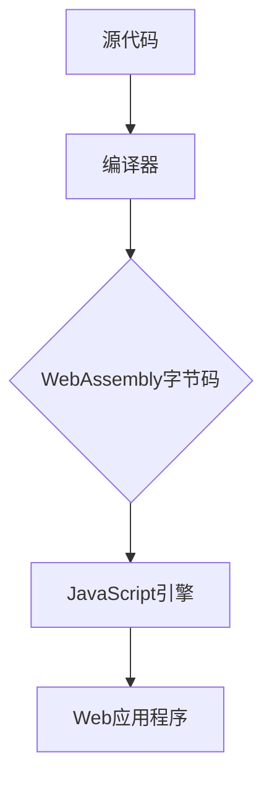

                 

关键词：WebAssembly、Web平台、JavaScript、编译、执行效率、跨平台、安全性

> 摘要：本文深入探讨了WebAssembly（Wasm）的起源、核心概念、架构、算法原理、应用场景以及未来发展趋势。WebAssembly作为Web平台的新时代，其高性能、安全性以及跨平台能力正逐渐改变着我们对Web应用程序的理解和构建方式。

## 1. 背景介绍

### WebAssembly的起源

WebAssembly（Wasm）的诞生可以追溯到2011年，当时浏览器逐渐成为互联网的客户端主力，开发者们对JavaScript（JS）的性能和限制感到不满。JavaScript尽管是Web开发的基石，但其解释执行的方式使得运行效率远不如传统编译型语言如C、C++。开发者们渴望一种能够在浏览器中高效运行的语言，以满足日益复杂的Web应用程序需求。

### WebAssembly的推出

为了解决这个问题，Google、Microsoft、Mozilla等主要浏览器制造商于2015年共同启动了WebAssembly项目。WebAssembly旨在提供一个新的字节码格式，它能够通过高效的方式在浏览器中运行。WebAssembly的设计目标是低开销、高安全性和跨平台兼容性。

## 2. 核心概念与联系

### 核心概念

- **WebAssembly模块**：WebAssembly的基本构建单元是一个模块，它包含了一组指令和数据结构，这些指令和数据结构定义了模块的行为。
- **编译过程**：WebAssembly代码通常由源代码编译而来，通过特定的编译器将源代码编译成WebAssembly字节码。
- **执行过程**：编译后的WebAssembly字节码可以在浏览器中直接执行，不需要额外的解释过程。

### WebAssembly与JavaScript的联系

WebAssembly与JavaScript之间有着紧密的联系。WebAssembly可以与JavaScript无缝交互，使得开发者可以在同一个Web应用程序中使用两种语言的优势。

### 架构的 Mermaid 流程图



## 3. 核心算法原理 & 具体操作步骤

### 3.1 算法原理概述

WebAssembly的设计目标是高效性和安全性。其算法原理主要包括：

- **静态类型系统**：WebAssembly采用了静态类型系统，这意味着在编译时就可以确定变量的类型，从而提高了执行效率。
- **即时编译（JIT）**：WebAssembly字节码通过即时编译（JIT）在JavaScript引擎中执行，这使得运行速度非常快。
- **安全沙箱**：WebAssembly代码在浏览器中运行时被限制在一个安全的沙箱环境中，以防止恶意代码的执行。

### 3.2 算法步骤详解

1. **源代码编写**：开发者使用C、C++、Rust等语言编写源代码。
2. **编译**：使用特定的编译器将源代码编译成WebAssembly字节码。
3. **加载**：Web应用程序通过JavaScript加载WebAssembly模块。
4. **执行**：WebAssembly模块在JavaScript引擎中即时编译并执行。
5. **交互**：WebAssembly模块与JavaScript代码进行交互，共享数据和函数。

### 3.3 算法优缺点

**优点**：

- **高性能**：通过即时编译，WebAssembly代码的执行效率接近原生代码。
- **跨平台**：WebAssembly可以在不同的设备和操作系统上运行，无需重新编译。
- **安全性**：WebAssembly代码在安全的沙箱环境中执行，防止恶意代码的威胁。

**缺点**：

- **学习曲线**：与JavaScript相比，WebAssembly的语法和开发流程有所不同，需要开发者学习新的工具和技术。
- **工具链**：尽管WebAssembly已经得到了广泛的支持，但相关的工具链和生态系统仍在不断发展和完善。

### 3.4 算法应用领域

WebAssembly的应用领域非常广泛，包括但不限于：

- **游戏开发**：许多大型游戏，如《我的世界》和《塞尔达传说：荒野之息》，已经开始采用WebAssembly作为主要渲染引擎。
- **Web应用程序**：WebAssembly可以提高Web应用程序的运行效率，特别是在图形处理、音频处理和机器学习等方面。
- **云计算**：WebAssembly可以在云计算环境中运行，为开发者提供更高效的服务。

## 4. 数学模型和公式 & 详细讲解 & 举例说明

### 4.1 数学模型构建

WebAssembly的数学模型基于静态类型系统和即时编译技术。具体而言，其模型包括以下方面：

- **数据类型**：WebAssembly支持整数和浮点数等基本数据类型。
- **变量绑定**：WebAssembly中的变量绑定是基于静态类型的，这意味着在编译时就需要确定变量的类型。
- **操作指令**：WebAssembly的操作指令包括加载、存储、计算等。

### 4.2 公式推导过程

WebAssembly的即时编译过程涉及到一系列复杂的数学计算和优化。具体推导过程如下：

1. **抽象语法树（AST）构建**：源代码首先被编译器解析成抽象语法树。
2. **类型检查**：编译器对AST进行类型检查，确保变量类型的一致性。
3. **中间代码生成**：AST被转换成中间代码，这通常是伪代码形式。
4. **优化**：中间代码进行各种优化，如循环展开、常量折叠等。
5. **目标代码生成**：优化后的中间代码被转换成WebAssembly字节码。

### 4.3 案例分析与讲解

假设我们有一个简单的C语言程序，计算两个整数的和。我们可以按照以下步骤将其编译成WebAssembly代码：

1. **源代码编写**：
   ```c
   int add(int a, int b) {
       return a + b;
   }
   ```

2. **编译**：
   使用C编译器将源代码编译成WebAssembly字节码。

3. **加载与执行**：
   在Web应用程序中加载WebAssembly模块，并通过JavaScript调用`add`函数。

4. **交互**：
   JavaScript可以与WebAssembly模块共享数据和函数，实现复杂的交互逻辑。

## 5. 项目实践：代码实例和详细解释说明

### 5.1 开发环境搭建

要开始开发WebAssembly项目，首先需要搭建开发环境。以下是搭建步骤：

1. 安装Node.js和npm。
2. 安装WebAssembly编译工具，如Emscripten。
3. 安装文本编辑器，如Visual Studio Code。

### 5.2 源代码详细实现

以下是一个简单的C语言程序，用于计算两个整数的和：

```c
#include <stdio.h>

int add(int a, int b) {
    return a + b;
}

int main() {
    int num1 = 5;
    int num2 = 10;
    int result = add(num1, num2);
    printf("The sum of %d and %d is %d\n", num1, num2, result);
    return 0;
}
```

### 5.3 代码解读与分析

这段代码首先定义了一个`add`函数，用于计算两个整数的和。在`main`函数中，我们定义了两个整数`num1`和`num2`，然后调用`add`函数计算它们的和，并打印结果。

### 5.4 运行结果展示

要运行这段代码，首先需要将其编译成WebAssembly字节码。使用以下命令：

```bash
emcc example.c -o example.wasm
```

然后，在Web应用程序中加载WebAssembly模块并执行：

```javascript
const wasmModule = await WebAssembly.instantiateStreaming(fetch('example.wasm'));
const { add } = wasmModule.instance.exports;
const result = add(5, 10);
console.log(result); // 输出：15
```

## 6. 实际应用场景

### 6.1 游戏开发

WebAssembly在游戏开发中得到了广泛应用。通过WebAssembly，开发者可以将高性能的C++代码集成到Web应用程序中，从而提高游戏的性能和运行效率。

### 6.2 Web应用程序

WebAssembly可以提高Web应用程序的运行效率，特别是在图形处理、音频处理和机器学习等方面。例如，开发者可以使用WebAssembly进行复杂的图像渲染和音频处理，从而实现更加流畅和互动的Web体验。

### 6.3 云计算

WebAssembly在云计算环境中也具有巨大的潜力。通过将WebAssembly模块部署到云服务器上，开发者可以提供更加高效和灵活的服务。

## 7. 未来应用展望

### 7.1 新兴领域

随着技术的不断发展，WebAssembly有望在更多新兴领域得到应用，如虚拟现实（VR）、增强现实（AR）和物联网（IoT）等。

### 7.2 性能优化

未来，WebAssembly的性能将继续优化，以满足更复杂和更高性能的应用需求。

### 7.3 安全性提升

WebAssembly的安全性也将得到进一步提升，以应对日益严峻的安全挑战。

## 8. 工具和资源推荐

### 8.1 学习资源推荐

- 《WebAssembly：设计和实现》
- 《Emscripten：WebAssembly编译工具集》
- WebAssembly官方文档

### 8.2 开发工具推荐

- Visual Studio Code
- WebAssembly Text Format（WAT）编辑器
- Emscripten

### 8.3 相关论文推荐

- "WebAssembly: A New Type of Assembly Language for the Web"
- "The WebAssembly Core Specification"
- "WebAssembly and JavaScript: Working Together for the Web"

## 9. 总结：未来发展趋势与挑战

### 9.1 研究成果总结

WebAssembly作为Web平台的新时代，其高效性、安全性和跨平台能力得到了广泛认可。通过结合JavaScript，开发者可以构建更加复杂和高效的Web应用程序。

### 9.2 未来发展趋势

未来，WebAssembly将继续在性能、安全性和生态系统中进行优化。随着Web技术的发展，WebAssembly有望在更多新兴领域得到应用。

### 9.3 面临的挑战

尽管WebAssembly具有巨大的潜力，但仍然面临一些挑战，如开发者适应和学习新工具和技术的难度、工具链和生态系统的完善等。

### 9.4 研究展望

随着WebAssembly的不断发展和完善，我们期待它能够在未来的Web开发中发挥更加重要的作用，推动Web技术的进一步创新。

## 附录：常见问题与解答

### 1. 什么是WebAssembly？

WebAssembly是一种新的编程语言，用于在浏览器中高效地执行代码。

### 2. WebAssembly与JavaScript有什么区别？

WebAssembly与JavaScript相比，具有更高的性能和安全性。

### 3. 如何将C/C++代码编译成WebAssembly？

使用Emscripten等WebAssembly编译工具，将C/C++代码编译成WebAssembly字节码。

### 4. WebAssembly支持哪些编程语言？

WebAssembly支持多种编程语言，如C、C++、Rust等。

作者：禅与计算机程序设计艺术 / Zen and the Art of Computer Programming
------------------------------------------------------------------------

