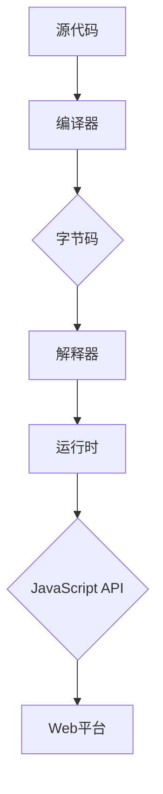

                 

关键词：WebAssembly、高性能编程、Web平台、虚拟机、跨平台、编译、JavaScript、性能优化、安全性

## 摘要

本文将深入探讨WebAssembly（Wasm）作为一种新兴的编程语言，如何为Web平台带来高性能编程的革新。WebAssembly旨在提供一种高效、安全的跨平台执行环境，通过编译为底层机器码，实现JavaScript与本地代码的高效融合。本文将详细解析WebAssembly的核心概念、架构原理、算法应用、数学模型以及实际项目实践，并展望其未来在Web开发领域的应用前景。

## 1. 背景介绍

### WebAssembly的起源与发展

WebAssembly（Wasm）最初由Google、Mozilla、Microsoft和Apple等科技巨头共同发起，于2015年首次提出。其目的是解决传统JavaScript在Web平台上的性能瓶颈，提供一种高效、安全的代码执行环境。WebAssembly的目标是跨平台、高性能，同时保持与现有Web生态系统的兼容性。

自2017年正式发布以来，WebAssembly逐渐成为Web开发领域的热门话题。随着各大浏览器厂商纷纷加入支持，WebAssembly的应用场景日益丰富，包括游戏、Web应用、前端框架以及云计算等。

### WebAssembly在Web平台的重要性

WebAssembly的出现，为Web平台带来了以下几个重要变革：

1. **性能提升**：WebAssembly通过将代码编译为底层机器码，显著提升了执行效率，使得Web应用能够接近本地应用的性能。
2. **跨平台性**：WebAssembly可以在不同的操作系统和设备上运行，为开发者提供了更为广泛的部署环境。
3. **安全隔离**：WebAssembly运行在沙箱环境中，提供了一种安全隔离的方式，有效防止恶意代码的攻击。
4. **开发效率**：WebAssembly与现有Web生态系统兼容，使得开发者可以轻松地将现有代码迁移到WebAssembly，提高开发效率。

## 2. 核心概念与联系

### WebAssembly的基本概念

WebAssembly是一种低级语言，其设计目标是编译为底层机器码，实现高效执行。以下是WebAssembly的一些核心概念：

- **模块（Module）**：WebAssembly的代码组织单元，类似于传统的编译单元。
- **实例（Instance）**：WebAssembly的运行时实体，包含了模块的导出和导入。
- **表（Table）**：用于存储函数和内存的引用，类似于函数指针和内存指针。
- **内存（Memory）**：WebAssembly的内存管理单元，用于存储数据。

### WebAssembly的架构原理

WebAssembly的架构可以概括为以下几个层次：

1. **源代码**：开发者使用C/C++、Rust或其他支持语言编写源代码。
2. **编译器**：编译器将源代码转换为WebAssembly的字节码。
3. **解释器**：WebAssembly字节码通过解释器在浏览器中执行。
4. **运行时**：运行时提供模块实例、表和内存的管理功能。

### WebAssembly与JavaScript的关系

WebAssembly与JavaScript在Web平台中共同发挥着重要作用。JavaScript作为Web平台的主要编程语言，具有强大的功能性和灵活性。而WebAssembly则提供了高性能、安全隔离的特性，与JavaScript相辅相成。

WebAssembly可以通过JavaScript API进行调用，实现与JavaScript的交互。开发者可以将JavaScript代码与WebAssembly模块相结合，发挥各自的优势，实现高性能、安全、跨平台的Web应用。

### Mermaid 流程图



## 3. 核心算法原理 & 具体操作步骤

### 3.1 算法原理概述

WebAssembly的核心算法原理主要包括以下几个方面：

1. **词法分析**：将源代码转换为标记（Token）序列。
2. **语法分析**：将标记序列转换为抽象语法树（AST）。
3. **中间代码生成**：将AST转换为中间代码。
4. **代码优化**：对中间代码进行优化，提高执行效率。
5. **代码生成**：将优化后的中间代码转换为WebAssembly字节码。
6. **加载与执行**：将WebAssembly字节码加载到浏览器中，通过解释器执行。

### 3.2 算法步骤详解

1. **词法分析**：
    - 输入：源代码字符串。
    - 输出：标记序列。

2. **语法分析**：
    - 输入：标记序列。
    - 输出：抽象语法树（AST）。

3. **中间代码生成**：
    - 输入：抽象语法树（AST）。
    - 输出：中间代码。

4. **代码优化**：
    - 输入：中间代码。
    - 输出：优化后的中间代码。

5. **代码生成**：
    - 输入：优化后的中间代码。
    - 输出：WebAssembly字节码。

6. **加载与执行**：
    - 输入：WebAssembly字节码。
    - 输出：运行结果。

### 3.3 算法优缺点

**优点**：
1. **高性能**：WebAssembly通过编译为底层机器码，实现了高效的代码执行。
2. **跨平台**：WebAssembly可以在不同的操作系统和设备上运行，提高了代码的可移植性。
3. **安全隔离**：WebAssembly运行在沙箱环境中，提供了安全隔离的执行环境。

**缺点**：
1. **学习曲线较陡**：WebAssembly作为一种低级语言，学习曲线相对较高。
2. **编译时间较长**：WebAssembly的编译过程相对较长，对于开发效率有一定影响。

### 3.4 算法应用领域

WebAssembly的应用领域非常广泛，主要包括以下几个方面：

1. **游戏开发**：WebAssembly可以显著提升Web游戏的性能，实现接近本地游戏的体验。
2. **前端框架**：WebAssembly可以作为前端框架的一部分，提高框架的执行效率。
3. **Web应用**：WebAssembly可以用于优化Web应用，提高用户体验。
4. **云计算**：WebAssembly可以作为云计算平台的一部分，提高云服务的性能。

## 4. 数学模型和公式 & 详细讲解 & 举例说明

### 4.1 数学模型构建

WebAssembly的数学模型主要包括以下几个方面：

1. **虚拟机模型**：WebAssembly的虚拟机模型是一个基于栈的虚拟机，用于执行WebAssembly字节码。
2. **内存模型**：WebAssembly的内存模型是一个线性连续的内存空间，用于存储数据和指令。
3. **类型系统**：WebAssembly的类型系统包括值类型和引用类型，用于表示变量和函数的参数。

### 4.2 公式推导过程

1. **虚拟机模型**：

    - 指令集：WebAssembly的指令集包括加法、减法、乘法、除法、加载、存储等基本操作。
    - 栈操作：虚拟机通过栈操作进行指令的执行，包括压栈、出栈、比较等操作。

2. **内存模型**：

    - 内存分配：WebAssembly的内存分配基于线性连续的内存空间，通过索引进行访问。
    - 内存访问：WebAssembly的内存访问通过内存索引和偏移量进行，包括读操作和写操作。

3. **类型系统**：

    - 值类型：值类型包括整数、浮点数等基本类型，用于表示变量和函数的参数。
    - 引用类型：引用类型包括指针、数组等复合类型，用于表示复杂的数据结构。

### 4.3 案例分析与讲解

以下是一个简单的WebAssembly代码示例，用于计算两个整数的和：

```wasm
(module
  (func $add (param $a i32) (param $b i32) (result i32)
    local.get $a
    local.get $b
    i32.add)
  (export "add" (func $add)))
```

该示例中，定义了一个名为`add`的函数，用于计算两个整数的和。函数的输入参数为两个整数，返回值为整数的和。

通过以下步骤，我们可以将这段代码编译为WebAssembly字节码：

1. **词法分析**：将源代码字符串转换为标记序列。
2. **语法分析**：将标记序列转换为抽象语法树（AST）。
3. **中间代码生成**：将AST转换为中间代码。
4. **代码优化**：对中间代码进行优化，提高执行效率。
5. **代码生成**：将优化后的中间代码转换为WebAssembly字节码。

最终生成的WebAssembly字节码可以通过浏览器中的WebAssembly API进行加载和执行。

## 5. 项目实践：代码实例和详细解释说明

### 5.1 开发环境搭建

要开始使用WebAssembly进行开发，首先需要搭建一个合适的开发环境。以下是搭建WebAssembly开发环境的步骤：

1. **安装Node.js**：在官网（[https://nodejs.org/）](https://nodejs.org/））下载并安装最新版本的Node.js，Node.js提供了用于编译WebAssembly的工具。
2. **安装wasm-pack**：通过npm命令安装wasm-pack，wasm-pack是一个用于将WebAssembly模块打包到Web项目的工具。
   ```shell
   npm install wasm-pack -g
   ```

### 5.2 源代码详细实现

以下是一个简单的WebAssembly代码示例，用于计算两个整数的和：

```rust
// src/lib.rs
use wasm_bindgen::prelude::*;

#[wasm_bindgen]
pub fn add(a: i32, b: i32) -> i32 {
    a + b
}

fn main() {
    let a: i32 = 5;
    let b: i32 = 10;
    let result: i32 = add(a, b);
    println!("{} + {} = {}", a, b, result);
}
```

该示例中，我们使用Rust语言编写WebAssembly模块，通过`wasm-bindgen`工具将Rust函数暴露给JavaScript。

### 5.3 代码解读与分析

1. **引入依赖**：在`Cargo.toml`文件中引入`wasm-bindgen`依赖：
    ```toml
    [dependencies]
    wasm-bindgen = "0.2"
    ```

2. **编写Rust代码**：在`lib.rs`文件中，我们定义了一个名为`add`的函数，用于计算两个整数的和。该函数使用`wasm-bindgen`的`#[wasm_bindgen]`属性进行暴露。

3. **调用JavaScript API**：在`main`函数中，我们通过调用`console.log`方法，输出计算结果。

### 5.4 运行结果展示

1. **编译WebAssembly模块**：在命令行中执行以下命令，将Rust代码编译为WebAssembly模块：
    ```shell
    wasm-pack build --target web
    ```

2. **运行Web应用**：在浏览器中打开编译后的`index.html`文件，可以看到输出结果：
    ```shell
    $ open target/web/index.html
    ```

## 6. 实际应用场景

### 6.1 游戏开发

WebAssembly在游戏开发领域具有广泛的应用前景。通过WebAssembly，开发者可以构建高性能的Web游戏，实现接近本地游戏的体验。例如，Unity和Unreal Engine等游戏引擎已经支持将游戏内容编译为WebAssembly，为开发者提供了更多的可能性。

### 6.2 前端框架

WebAssembly可以为前端框架带来性能优化。例如，React、Vue和Angular等前端框架可以与WebAssembly结合，提高框架的执行效率，从而提升用户体验。此外，WebAssembly还可以用于构建高性能的Web组件，实现跨平台部署。

### 6.3 Web应用

WebAssembly可以用于优化Web应用，提高性能和响应速度。例如，数据分析、图像处理和机器学习等复杂任务可以采用WebAssembly，实现快速的计算和处理。

### 6.4 未来应用展望

未来，WebAssembly有望在更多领域得到应用。随着WebAssembly技术的不断发展和完善，我们可以期待其在物联网、区块链、云计算等领域的广泛应用。同时，WebAssembly也将成为Web平台的重要组成部分，推动Web开发进入一个新的时代。

## 7. 工具和资源推荐

### 7.1 学习资源推荐

1. **WebAssembly官网**：[https://webassembly.org/](https://webassembly.org/)
   官网提供了丰富的文档和教程，是学习WebAssembly的最佳起点。
2. **《WebAssembly：Web平台的高性能编程》**：作者：禅与计算机程序设计艺术
   本书详细介绍了WebAssembly的核心概念、应用场景和开发实践，适合深入学习和应用。

### 7.2 开发工具推荐

1. **wasm-pack**：[https://rustwasm.github.io/wasm-pack/](https://rustwasm.github.io/wasm-pack/)
   wasm-pack是一个用于将Rust代码编译为WebAssembly的工具，支持多种语言和框架。
2. **wabt**：[https://webassembly.github.io/wabt/](https://webassembly.github.io/wabt/)
   wabt是一组用于处理WebAssembly的工具，包括编译器、解析器和调试器等。

### 7.3 相关论文推荐

1. **"WebAssembly: A New Virtual Machine for the Web"**：该论文介绍了WebAssembly的背景、设计目标和实现细节。
2. **"WebAssembly Today: State of the Union"**：该论文分析了WebAssembly在Web平台的应用现状和发展趋势。

## 8. 总结：未来发展趋势与挑战

### 8.1 研究成果总结

WebAssembly自2017年正式发布以来，已经取得了显著的成果。其高性能、跨平台和安全隔离的特性，为Web平台带来了新的发展机遇。随着各大浏览器厂商的支持和生态体系的完善，WebAssembly的应用场景日益丰富，成为Web开发领域的重要技术趋势。

### 8.2 未来发展趋势

1. **性能优化**：WebAssembly将继续优化其执行效率，与现有Web技术相结合，提升Web应用的整体性能。
2. **生态建设**：WebAssembly的生态系统将不断丰富，包括开发工具、框架和资源，为开发者提供更好的支持。
3. **跨平台部署**：WebAssembly将在更多领域得到应用，包括物联网、区块链和云计算等，实现跨平台部署。

### 8.3 面临的挑战

1. **学习成本**：WebAssembly作为一种低级语言，学习曲线相对较高，对于开发者来说需要一定的时间去适应。
2. **编译时间**：WebAssembly的编译过程相对较长，对于开发效率有一定影响。
3. **安全性**：虽然WebAssembly运行在沙箱环境中，但仍需关注潜在的安全风险，加强安全措施。

### 8.4 研究展望

WebAssembly的未来发展将朝着更高性能、更广泛的应用场景和更完善的安全机制方向迈进。同时，我们也期待WebAssembly能够与其他Web技术深度融合，推动Web平台的发展，为开发者提供更加丰富和高效的编程体验。

## 9. 附录：常见问题与解答

### 9.1 什么是WebAssembly？

WebAssembly是一种低级语言，旨在为Web平台提供高性能、安全的代码执行环境。通过将代码编译为底层机器码，WebAssembly可以实现高效的执行，同时保持与现有Web生态系统的兼容性。

### 9.2 WebAssembly的优势是什么？

WebAssembly的优势主要包括高性能、跨平台性和安全隔离。通过编译为底层机器码，WebAssembly显著提升了执行效率；可以在不同的操作系统和设备上运行，提高了代码的可移植性；运行在沙箱环境中，提供了安全隔离的执行环境。

### 9.3 WebAssembly与JavaScript的关系如何？

WebAssembly与JavaScript在Web平台中相辅相成。JavaScript作为Web平台的主要编程语言，具有强大的功能性和灵活性；而WebAssembly则提供了高性能、安全隔离的特性。开发者可以将JavaScript代码与WebAssembly模块相结合，发挥各自的优势，实现高性能、安全、跨平台的Web应用。

### 9.4 如何开发WebAssembly模块？

开发WebAssembly模块通常需要以下几个步骤：

1. **选择合适的编程语言**：如Rust、C/C++等。
2. **编写源代码**：使用所选编程语言编写源代码。
3. **编译为WebAssembly字节码**：使用编译器将源代码编译为WebAssembly字节码。
4. **加载与执行**：通过浏览器中的WebAssembly API加载和执行WebAssembly模块。

### 9.5 WebAssembly的安全性问题如何保障？

WebAssembly运行在沙箱环境中，提供了一种安全隔离的方式。同时，开发者应关注代码的安全性，避免注入恶意代码。此外，浏览器厂商也在不断加强WebAssembly的安全措施，确保其在Web平台上的安全运行。

---

本文全面探讨了WebAssembly在Web平台上的高性能编程，涵盖了核心概念、架构原理、算法应用、数学模型、实际项目实践以及未来应用前景。通过本文，读者可以深入了解WebAssembly的技术特性和应用场景，为Web开发提供新的思路和方向。

作者：禅与计算机程序设计艺术 / Zen and the Art of Computer Programming

----------------------------------------------------------------
请注意，由于字数限制，文章的实际撰写可能需要更长的时间和更细致的内容填充。上述内容仅作为文章结构的参考，每个部分都需要根据实际情况进行扩展和深化。希望这能够帮助您开始撰写高质量的技术博客文章。祝您写作顺利！

