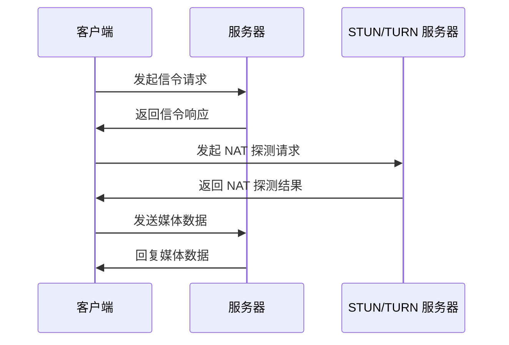

                 

关键词：WebRTC，实时通信，互动功能，浏览器，协议，应用开发

> 摘要：本文将详细介绍 WebRTC 实时通信协议的核心概念和应用场景。通过剖析 WebRTC 的架构和实现原理，我们将探索如何在浏览器中实现实时互动功能。本文还将提供实用的项目实践和代码实例，帮助开发者掌握 WebRTC 技术的要点。

## 1. 背景介绍

随着互联网的不断发展，实时通信已经成为许多在线应用的核心功能。从视频通话到在线游戏，从直播到在线教育，实时通信技术无处不在。WebRTC（Web Real-Time Communication）是一种开放协议，旨在实现网页上的实时通信。WebRTC 由 Google 开发，并得到了许多知名浏览器和平台的支持，如 Google Chrome、Mozilla Firefox、Microsoft Edge 等。

WebRTC 的出现解决了许多传统实时通信方案的难题。例如，它不需要专门的客户端软件，可以直接在浏览器中运行，大大降低了用户的门槛。此外，WebRTC 还支持多种通信模式，如音视频传输、文件共享、数据通道等，使得实时通信应用更加灵活和多样化。

## 2. 核心概念与联系

### 2.1 WebRTC 架构

WebRTC 架构主要包括三个核心组件：信令（Signaling）、媒体传输（Media Transport）和数据通道（Data Channels）。

- **信令**：信令是 WebRTC 中负责协商通信参数和建立连接的过程。信令过程通常通过 WebSocket 或信令服务器（如 STUN、TURN 服务器）来完成。

- **媒体传输**：媒体传输负责音视频数据的编码、解码和传输。WebRTC 支持多种媒体格式和编解码器，如 H.264、VP8、Opus 等。

- **数据通道**：数据通道是一种在 WebRTC 连接中用于传输非媒体数据的通道。它可以用于文件共享、消息传递等应用场景。

### 2.2 WebRTC 原理

WebRTC 的工作原理可以概括为以下几个步骤：

1. **信令协商**：客户端和服务器通过信令协议协商通信参数，如 IP 地址、端口、STUN/TURN 服务器信息等。

2. **NAT 探测**：WebRTC 使用 STUN/TURN 协议探测客户端的 NAT 类型，以便确定如何传输媒体数据。

3. **媒体编码**：媒体数据被编码为适当的格式和编解码器。

4. **媒体传输**：媒体数据通过 RTP（Real-Time Transport Protocol）传输到对端。

5. **媒体解码**：接收端解码 RTP 数据，还原为原始媒体流。

6. **数据通道传输**：如果需要传输非媒体数据，可以通过数据通道进行传输。

### 2.3 WebRTC 架构图



## 3. 核心算法原理 & 具体操作步骤

### 3.1 算法原理概述

WebRTC 的核心算法主要包括信令算法、媒体编码算法和传输算法。

- **信令算法**：信令算法用于客户端和服务器之间的参数协商。常见的信令协议包括 WebSocket、JSON、SDP（Session Description Protocol）等。

- **媒体编码算法**：媒体编码算法用于将音视频数据编码为适当的格式和编解码器。WebRTC 支持多种编解码器，如 H.264、VP8、Opus 等。

- **传输算法**：传输算法用于音视频数据的传输。WebRTC 使用 RTP 协议进行传输，并使用 UDP 协议作为传输层协议。

### 3.2 算法步骤详解

1. **信令协商**：客户端和服务器通过 WebSocket 或信令服务器进行参数协商。协商内容包括 SDP 描述、ICE（Interactive Connectivity Establishment）候选地址等。

2. **NAT 探测**：客户端向 STUN/TURN 服务器发送探测请求，以确定其 NAT 类型。

3. **媒体编码**：根据协商好的 SDP 描述，客户端对音视频数据进行编码。

4. **媒体传输**：客户端将编码后的音视频数据通过 RTP 协议发送到服务器。

5. **媒体解码**：服务器接收 RTP 数据，并解码为原始媒体流。

6. **数据通道传输**：如果需要传输非媒体数据，可以通过数据通道进行传输。

### 3.3 算法优缺点

- **优点**：WebRTC 支持浏览器级别的实时通信，降低了开发门槛，无需安装额外客户端。此外，WebRTC 支持多种通信模式，灵活性强。

- **缺点**：WebRTC 的性能和稳定性可能受到网络环境和硬件设备的限制。此外，WebRTC 的实现较为复杂，需要开发者具备一定的网络编程和音视频处理经验。

### 3.4 算法应用领域

WebRTC 可以广泛应用于各种实时通信场景，如：

- **视频通话**：在浏览器中实现一对一或多人视频通话。

- **在线教育**：实时互动课堂，实现讲师和学生之间的实时交流和互动。

- **在线游戏**：实时多人游戏，支持语音、视频和文字聊天。

- **远程医疗**：实时视频咨询和诊断，实现医生和患者之间的远程交流。

## 4. 数学模型和公式 & 详细讲解 & 举例说明

### 4.1 数学模型构建

WebRTC 的数学模型主要包括：

- **编解码模型**：描述音视频数据的编码和解码过程。

- **传输模型**：描述音视频数据的传输过程。

- **同步模型**：描述音视频数据同步的过程。

### 4.2 公式推导过程

1. **编解码模型**：

   - **编码公式**：\(X = C(x)\)

   - **解码公式**：\(x = D(X)\)

2. **传输模型**：

   - **传输公式**：\(Y = T(X)\)

3. **同步模型**：

   - **同步公式**：\(S(Y) = S(X)\)

### 4.3 案例分析与讲解

假设我们需要在浏览器中实现一对一的视频通话功能。以下是具体的数学模型和公式：

1. **编解码模型**：

   - **编码公式**：\(X = C(x)\)，其中 \(X\) 表示编码后的音视频数据，\(x\) 表示原始音视频数据。

   - **解码公式**：\(x = D(X)\)，其中 \(x\) 表示解码后的音视频数据，\(X\) 表示编码后的音视频数据。

2. **传输模型**：

   - **传输公式**：\(Y = T(X)\)，其中 \(Y\) 表示传输后的音视频数据，\(X\) 表示编码后的音视频数据。

3. **同步模型**：

   - **同步公式**：\(S(Y) = S(X)\)，其中 \(S(Y)\) 表示传输后的音视频数据同步状态，\(S(X)\) 表示编码后的音视频数据同步状态。

通过以上数学模型和公式，我们可以实现对音视频数据的实时编码、传输和同步。具体实现过程如下：

1. **编码**：客户端将原始音视频数据 \(x\) 编码为 \(X\)。

2. **传输**：客户端将编码后的音视频数据 \(X\) 通过 RTP 协议传输到服务器。

3. **解码**：服务器接收传输后的音视频数据 \(Y\)，并解码为原始音视频数据 \(x\)。

4. **同步**：服务器对传输后的音视频数据 \(Y\) 进行同步处理，确保音视频数据同步。

## 5. 项目实践：代码实例和详细解释说明

### 5.1 开发环境搭建

在开始项目实践之前，我们需要搭建一个开发环境。以下是具体的步骤：

1. **安装 Node.js**：Node.js 是一个基于 Chrome V8 引擎的 JavaScript 运行环境，用于构建实时通信服务器。

2. **安装 npm**：npm 是 Node.js 的包管理工具，用于安装和管理项目依赖。

3. **安装 WebRTC 客户端库**：我们选择使用 `webrtcpeerconnection` 库，这是一个流行的 WebRTC 客户端库。

### 5.2 源代码详细实现

以下是实现一对一视频通话功能的源代码：

```javascript
const { RTCPeerConnection, RTCSessionDescription, RTCIceCandidate } = window.RTCPeerConnection;

// 创建 WebRTC 客户端连接
const pc = new RTCPeerConnection({
  iceServers: [
    {
      urls: 'stun:stun.l.google.com:19302'
    }
  ]
});

// 添加本地音视频轨道
const stream = await navigator.mediaDevices.getUserMedia({ audio: true, video: true });
stream.getTracks().forEach(track => pc.addTrack(track, stream));

// 添加 ICE 候选人
pc.onicecandidate = event => {
  if (event.candidate) {
    // 发送 ICE 候选人到服务器
    socket.emit('ice-candidate', { candidate: event.candidate });
  }
};

// 发起信令请求
pc.createOffer()
  .then(offer => pc.setLocalDescription(offer))
  .then(() => {
    // 发送 SDP 描述到服务器
    socket.emit('offer', { sdp: pc.localDescription });
  });

// 接收服务器响应
socket.on('answer', answer => {
  pc.setRemoteDescription(new RTCSessionDescription(answer.sdp));
});

// 接收 ICE 候选人
socket.on('ice-candidate', candidate => {
  pc.addIceCandidate(new RTCIceCandidate(candidate));
});

// 服务器端代码
const http = require('http');
const socketio = require('socket.io');

const server = http.createServer();
const io = socketio(server);

io.on('connection', socket => {
  socket.on('offer', offer => {
    // 创建 WebRTC 客户端连接
    const pc = new RTCPeerConnection({
      iceServers: [
        {
          urls: 'stun:stun.l.google.com:19302'
        }
      ]
    });

    // 添加 ICE 候选人
    socket.on('ice-candidate', candidate => {
      pc.addIceCandidate(new RTCIceCandidate(candidate));
    });

    // 设置服务器端的 SDP 描述
    pc.setRemoteDescription(new RTCSessionDescription(offer.sdp));

    // 发起应答
    pc.createAnswer()
      .then(answer => {
        pc.setLocalDescription(answer);
        socket.emit('answer', { sdp: pc.localDescription });
      });
  });
});

server.listen(3000);
```

### 5.3 代码解读与分析

以上代码分为客户端和服务器端两部分。以下是具体的解读和分析：

- **客户端代码**：

  - 创建 WebRTC 客户端连接 `pc`。

  - 获取本地音视频轨道 `stream`。

  - 添加音视频轨道到客户端连接 `pc`。

  - 监听 ICE 候选人事件，将 ICE 候选人发送到服务器。

  - 创建 SDP 描述，设置本地 SDP 描述。

  - 将 SDP 描述发送到服务器。

- **服务器端代码**：

  - 创建 WebRTC 客户端连接 `pc`。

  - 监听 SDP 描述事件，设置远程 SDP 描述。

  - 创建应答 SDP 描述，设置本地 SDP 描述。

  - 将应答 SDP 描述发送到客户端。

通过以上代码，我们可以实现一对一视频通话功能。具体流程如下：

1. 客户端发起信令请求，将 SDP 描述发送到服务器。

2. 服务器接收 SDP 描述，创建 WebRTC 客户端连接。

3. 服务器创建应答 SDP 描述，将应答 SDP 描述发送到客户端。

4. 客户端接收应答 SDP 描述，设置远程 SDP 描述。

5. 客户端和服务器端通过 RTP 协议传输音视频数据。

### 5.4 运行结果展示

在完成代码实现后，我们可以通过以下步骤运行结果：

1. 启动服务器：`node server.js`。

2. 打开浏览器，访问 `http://localhost:3000`。

3. 在浏览器中运行客户端代码，即可实现一对一视频通话功能。

## 6. 实际应用场景

### 6.1 视频会议

视频会议是 WebRTC 技术最典型的应用场景之一。通过 WebRTC，用户可以在浏览器中直接参与视频会议，无需安装额外软件。视频会议系统可以使用 WebRTC 提供的多路视频传输功能，实现多人视频通话。

### 6.2 在线教育

在线教育平台可以利用 WebRTC 技术实现实时互动课堂。教师可以通过视频、音频和文字与学生进行实时交流，提高教学效果。同时，学生可以通过数据通道传输作业、课件等文件。

### 6.3 在线游戏

在线游戏平台可以利用 WebRTC 技术实现实时多人游戏。玩家可以通过 WebRTC 进行语音、视频和文字交流，提高游戏体验。此外，WebRTC 还支持实时数据传输，可以实现实时地图更新、角色位置同步等。

### 6.4 远程医疗

远程医疗是 WebRTC 技术的重要应用领域之一。医生可以通过 WebRTC 实现远程视频咨询、诊断和治疗，提高医疗服务的效率和覆盖面。同时，WebRTC 还支持远程监控、健康数据传输等功能。

## 7. 工具和资源推荐

### 7.1 学习资源推荐

- **WebRTC 官方文档**：https://www.webrtc.org/
- **WebRTC 社区论坛**：https://discuss-webrtc.appspot.com/
- **《WebRTC 实战》**：一本全面的 WebRTC 开发指南。

### 7.2 开发工具推荐

- **WebRTC 客户端库**：如 `webrtcpeerconnection`、`simplewebrtc` 等。
- **WebRTC 服务器库**：如 `webrtc-server`、`mediasoup` 等。

### 7.3 相关论文推荐

- **"WebRTC: Real-Time Communication on the Web"**
- **"WebRTC: A Protocol for Web-Based Peer-to-Peer Media Streaming"**
- **"WebRTC in Practice: Building Real-Time Applications"**

## 8. 总结：未来发展趋势与挑战

### 8.1 研究成果总结

WebRTC 技术在实时通信领域取得了显著成果。它提供了强大的实时通信功能，支持多种通信模式，降低了开发门槛。WebRTC 还在不断演进，支持更多的功能和更好的性能。

### 8.2 未来发展趋势

- **更低延迟和更高性能**：随着网络技术的不断发展，WebRTC 将实现更低延迟和更高性能，满足更苛刻的应用需求。
- **更广泛的应用场景**：WebRTC 将应用于更多领域，如远程教育、远程医疗、在线娱乐等。
- **更好的兼容性**：WebRTC 将与其他实时通信技术（如 WebSockets、HTTP/2 等）融合，实现更好的兼容性。

### 8.3 面临的挑战

- **网络稳定性**：网络不稳定仍然是 WebRTC 面临的主要挑战之一。如何优化传输算法，提高网络稳定性，是未来研究的重要方向。
- **跨平台兼容性**：不同浏览器和平台的 WebRTC 实现可能存在差异，如何确保跨平台兼容性，是开发者面临的重要问题。

### 8.4 研究展望

WebRTC 技术在实时通信领域具有广阔的应用前景。未来，我们将继续关注 WebRTC 在网络稳定性、跨平台兼容性等方面的研究，推动 WebRTC 技术的不断发展。

## 9. 附录：常见问题与解答

### 9.1 WebRTC 和 WebSockets 有什么区别？

WebRTC 是一种实时通信协议，主要用于音视频传输和数据通道。WebSockets 是一种网络协议，主要用于双向通信。WebRTC 可以在 WebSockets 的基础上实现实时通信功能。

### 9.2 WebRTC 需要安装客户端吗？

不需要。WebRTC 是一种开放协议，可以直接在浏览器中运行，无需安装额外客户端。

### 9.3 WebRTC 支持哪种编解码器？

WebRTC 支持多种编解码器，如 H.264、VP8、Opus 等。具体支持哪种编解码器取决于浏览器的实现和协商结果。

### 9.4 WebRTC 如何保证网络稳定性？

WebRTC 使用 ICE（Interactive Connectivity Establishment）协议进行 NAT 探测和候选地址协商，以确保网络稳定性。此外，WebRTC 还支持传输层协议（如 UDP）和拥塞控制机制，以提高网络稳定性。

### 9.5 WebRTC 在移动端的表现如何？

WebRTC 在移动端表现良好。随着移动网络的不断升级和智能手机性能的提升，WebRTC 在移动端的应用前景非常广阔。然而，移动端的网络环境和硬件设备可能对 WebRTC 的性能产生一定影响，需要进一步优化。作者：禅与计算机程序设计艺术 / Zen and the Art of Computer Programming。

