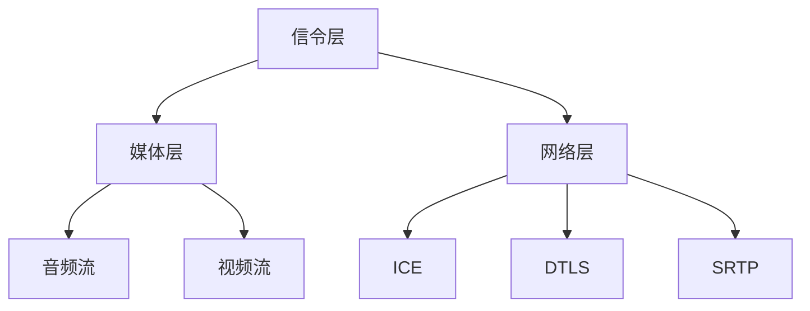

                 

关键词：WebRTC、实时通信、浏览器、视频会议、数据共享、音视频传输、网络协议、安全性、优化

> 摘要：本文将深入探讨WebRTC技术，这是一项在浏览器中实现实时通信的关键技术。我们将介绍WebRTC的核心概念、架构、算法原理，并通过实际项目实例展示其应用场景和实现细节。同时，本文还将对WebRTC的未来发展趋势和面临的挑战进行分析，并推荐相关学习资源和开发工具。

## 1. 背景介绍

随着互联网的普及和带宽的提升，实时通信成为人们日常交流和工作的重要组成部分。WebRTC（Web Real-Time Communication）是一种支持浏览器和移动应用的实时通信技术，它允许用户在无需安装任何插件的情况下，通过浏览器实现音视频通话、数据共享等多种实时通信功能。WebRTC由Google提出，并得到了多个浏览器厂商的支持，包括Google Chrome、Mozilla Firefox、Microsoft Edge等。

在传统通信方式中，实时通信通常依赖于第三方服务提供商，如Skype、Zoom等。这些服务通常需要用户安装特定的客户端软件，并且由服务提供商维护通信的中间环节。而WebRTC则打破了这一限制，通过在浏览器端直接实现通信，大大降低了通信门槛，提高了通信的便捷性和稳定性。

### 1.1 WebRTC的兴起

WebRTC的兴起与互联网视频通信的需求紧密相关。随着社交网络的兴起和远程工作的普及，用户对实时通信的需求不断增加。视频会议、在线教育、远程医疗等应用场景对实时通信的性能和稳定性提出了更高的要求。传统方式难以满足这些需求，因此催生了WebRTC技术的发展。

WebRTC的核心理念是通过浏览器直接实现实时通信，从而消除用户在安装和使用通信客户端时的障碍。此外，WebRTC还支持跨平台通信，使得用户可以在不同的设备之间无缝切换通信方式，提高了用户体验。

### 1.2 WebRTC的应用场景

WebRTC适用于多种实时通信应用场景：

- **视频会议**：企业内部和外部的多人视频会议。
- **在线教育**：教师和学生之间的实时互动，包括视频授课、屏幕共享等。
- **远程医疗**：医生和患者之间的实时视频诊断和咨询。
- **在线协作**：团队协作、文件共享、实时讨论等。
- **社交网络**：实时语音、视频聊天功能。

## 2. 核心概念与联系

### 2.1 WebRTC的核心概念

WebRTC主要包括以下核心概念：

- **媒体流（Media Stream）**：用于传输音频和视频数据。
- **信令（Signaling）**：用于在客户端之间交换会话信息，如身份验证、媒体类型等。
- **ICE（Interactive Connectivity Establishment）**：用于发现和选择最佳的通信路径。
- **DTLS（Datagram Transport Layer Security）**：用于保护通信数据的安全。
- **SRTP（Secure Real-time Transport Protocol）**：用于加密和确保数据传输的完整性。

### 2.2 WebRTC的架构

WebRTC的架构分为以下三个主要部分：

- **信令层**：负责在客户端之间交换会话信息，包括用户身份验证、媒体类型、通信端口等。
- **媒体层**：负责处理音频和视频数据的传输，包括编码、解码、数据包传输等。
- **网络层**：负责处理网络连接的建立和维护，包括ICE协议的执行、DTLS和SRTP的安全传输等。

### 2.3 WebRTC的Mermaid流程图

下面是WebRTC的核心概念和架构的Mermaid流程图：



## 3. 核心算法原理 & 具体操作步骤

### 3.1 算法原理概述

WebRTC的核心算法包括以下几部分：

- **信令算法**：通过WebSockets或其他信令协议，在客户端之间交换会话信息。
- **ICE算法**：通过PSTN网络和互联网，发现和选择最佳的通信路径。
- **DTLS和SRTP算法**：确保通信数据的安全传输。

### 3.2 算法步骤详解

#### 3.2.1 信令算法

1. **客户端A和客户端B建立WebSockets连接**。
2. **客户端A发送会话请求**，包含用户身份信息、媒体类型等。
3. **客户端B响应会话请求**，确认接收并返回自己的会话信息。
4. **客户端A和B交换ICE候选地址**。
5. **客户端A和B开始ICE协商**，选择最佳的通信路径。

#### 3.2.2 ICE算法

1. **客户端A和客户端B交换ICE候选地址**。
2. **客户端A和B通过PSTN网络和互联网**，尝试连接各个候选地址。
3. **选择最优路径**，根据连接速度、稳定性等因素，选择最佳通信路径。

#### 3.2.3 DTLS和SRTP算法

1. **客户端A和B通过ICE协商，建立安全连接**。
2. **客户端A和B使用DTLS握手**，确保通信数据的安全。
3. **客户端A和B使用SRTP加密和传输数据**，确保数据的完整性和保密性。

### 3.3 算法优缺点

#### 优点

- **跨平台兼容性**：支持多种操作系统和浏览器。
- **安全性**：使用DTLS和SRTP确保数据传输的安全。
- **低延迟**：通过ICE算法选择最佳通信路径，降低延迟。

#### 缺点

- **网络依赖性**：需要稳定的网络连接，否则通信效果可能受影响。
- **资源消耗**：由于需要处理大量数据，对硬件资源有一定要求。

### 3.4 算法应用领域

WebRTC适用于多种实时通信应用场景，如视频会议、在线教育、远程医疗等。以下是一些具体应用领域：

- **企业级应用**：企业内部和外部的多人视频会议、在线协作。
- **教育领域**：远程教育、实时互动课堂。
- **医疗领域**：远程医疗诊断、医生与患者之间的实时咨询。
- **社交网络**：实时语音、视频聊天功能。

## 4. 数学模型和公式 & 详细讲解 & 举例说明

### 4.1 数学模型构建

WebRTC的数学模型主要包括以下几个部分：

- **信令模型**：用于描述信令的交换过程。
- **ICE模型**：用于描述ICE协商的过程。
- **DTLS模型**：用于描述DTLS握手的流程。
- **SRTP模型**：用于描述SRTP加密和传输数据的过程。

### 4.2 公式推导过程

在WebRTC中，主要涉及以下数学公式：

- **信令模型**：会话建立过程中，用户身份验证的公式。
- **ICE模型**：ICE协商过程中，路径选择的公式。
- **DTLS模型**：DTLS握手过程中，密钥交换的公式。
- **SRTP模型**：SRTP加密和传输数据的过程，涉及密钥生成和加密算法的公式。

### 4.3 案例分析与讲解

#### 4.3.1 信令模型

假设有两个客户端A和B，需要通过WebSockets建立信令连接。用户身份验证过程如下：

- **客户端A发送会话请求**，包含用户身份ID和密钥K\_A。
- **客户端B收到会话请求**，确认接收，并返回自己的用户身份ID和密钥K\_B。
- **客户端A和B通过WebSockets交换会话信息**，包括用户身份验证的公式：
  $$ H(K_A \oplus K_B) = T $$
  其中，\( H \) 表示哈希函数，\( \oplus \) 表示异或运算，\( T \) 表示验证结果。

#### 4.3.2 ICE模型

假设客户端A和B需要通过ICE协商选择最佳通信路径。路径选择过程如下：

- **客户端A和B交换ICE候选地址**。
- **客户端A和B通过PSTN网络和互联网**，尝试连接各个候选地址。
- **根据连接速度、稳定性等因素**，选择最佳路径。路径选择的公式为：
  $$ P = \frac{R \cdot S}{L} $$
  其中，\( P \) 表示路径选择结果，\( R \) 表示路径的响应时间，\( S \) 表示路径的稳定性，\( L \) 表示路径的负载。

#### 4.3.3 DTLS模型

假设客户端A和B已经通过ICE协商选择了最佳通信路径，接下来进行DTLS握手。密钥交换过程如下：

- **客户端A生成密钥对**，并发送公钥到客户端B。
- **客户端B生成密钥对**，并使用客户端A的公钥加密密钥交换消息。
- **客户端A使用私钥解密密钥交换消息**，生成共享密钥。
- **密钥交换公式**：
  $$ K_{AB} = E_{A}(K_B) $$
  $$ K_{BA} = E_{B}(K_A) $$
  其中，\( E \) 表示加密算法，\( D \) 表示解密算法。

#### 4.3.4 SRTP模型

假设客户端A和B已经通过DTLS握手建立了安全连接，接下来进行SRTP加密和传输数据。数据传输过程如下：

- **客户端A生成随机数序列**，作为加密和解密的关键。
- **客户端A使用加密算法对数据包进行加密**。
- **客户端B使用相同的加密算法和解密密钥对数据包进行解密**。
- **加密和解密公式**：
  $$ C = E(K, P) $$
  $$ P = D(K, C) $$
  其中，\( C \) 表示加密后的数据包，\( P \) 表示解密后的数据包，\( K \) 表示加密和解密密钥。

## 5. 项目实践：代码实例和详细解释说明

### 5.1 开发环境搭建

为了实践WebRTC技术，我们需要搭建一个简单的开发环境。以下是一个基本的搭建步骤：

1. **安装Node.js**：WebRTC依赖Node.js环境，请从官方网址下载并安装。
2. **安装WebRTC依赖库**：使用npm命令安装WebRTC依赖库，如`webrtc-ears`。
3. **创建项目目录**：在合适的位置创建项目目录，并初始化npm项目。
4. **编写项目代码**：在项目目录中编写WebRTC相关的代码。

### 5.2 源代码详细实现

以下是一个简单的WebRTC视频会议项目实例。首先，我们需要创建一个名为`index.html`的HTML文件：

```html
<!DOCTYPE html>
<html lang="en">
<head>
    <meta charset="UTF-8">
    <meta name="viewport" content="width=device-width, initial-scale=1.0">
    <title>WebRTC Video Conference</title>
    <script src="https://cdn.webrtc-ears.com/latest/webRTC-ears.min.js"></script>
</head>
<body>
    <video id="localVideo" autoplay></video>
    <video id="remoteVideo" autoplay></video>
    <script src="app.js"></script>
</body>
</html>
```

接下来，我们编写`app.js`文件，实现WebRTC视频会议功能：

```javascript
// 创建WebRTC实例
const webrtc = new WebRTC();

// 设置本地视频流
const localVideo = document.getElementById('localVideo');
webrtc.attachMediaStream(localVideo, 'video');

// 设置远程视频流
const remoteVideo = document.getElementById('remoteVideo');
webrtc.attachMediaStream(remoteVideo, 'video');

// 创建信令通道
const signaling = new SignalChannel();

// 发送会话请求
signaling.send({ type: 'session-join', room: 'example-room' }, (response) => {
    // 接收响应，开始通信
    webrtc.joinRoom(response.room, signaling);
});

// 处理远程用户加入
webrtc.on('user-join', (user) => {
    console.log(`User ${user.id} joined the room.`);
    // 更新远程视频流
    webrtc.attachMediaStream(remoteVideo, user.stream, 'video');
});

// 处理远程用户离开
webrtc.on('user-leave', (user) => {
    console.log(`User ${user.id} left the room.`);
    // 清除远程视频流
    webrtc.detachMediaStream(remoteVideo, user.stream, 'video');
});
```

### 5.3 代码解读与分析

上述代码实现了WebRTC视频会议的基本功能。主要分为以下几个部分：

1. **创建WebRTC实例**：使用`WebRTC()`构造函数创建WebRTC实例。
2. **设置本地视频流**：使用`attachMediaStream()`方法将本地视频流绑定到`localVideo`元素上。
3. **设置远程视频流**：使用`attachMediaStream()`方法将远程视频流绑定到`remoteVideo`元素上。
4. **创建信令通道**：使用`SignalChannel()`构造函数创建信令通道实例。
5. **发送会话请求**：使用`send()`方法发送会话请求，包括房间信息和用户身份。
6. **接收响应并加入房间**：使用`joinRoom()`方法加入房间，并开始通信。
7. **处理远程用户加入和离开**：使用`on()`方法监听远程用户的加入和离开事件，并更新远程视频流。

### 5.4 运行结果展示

将上述代码保存到`app.js`文件中，并将其放在Web服务器上。在浏览器中打开`index.html`文件，即可看到本地视频流和远程视频流。当其他用户加入相同房间时，远程视频流将更新为其他用户的视频流。

## 6. 实际应用场景

WebRTC技术在多个领域得到广泛应用，以下是一些具体应用场景：

### 6.1 视频会议

视频会议是WebRTC最常见的应用场景之一。WebRTC支持多人实时视频通信，可以实现高质量的音频和视频传输，适用于企业内部和外部的多人视频会议。

### 6.2 在线教育

在线教育应用受益于WebRTC的实时通信功能。教师和学生可以通过WebRTC进行实时互动，包括视频授课、屏幕共享、实时讨论等，提高教学效果和互动体验。

### 6.3 远程医疗

远程医疗利用WebRTC技术实现医生和患者之间的实时视频咨询和诊断。WebRTC保证了通信的稳定性和实时性，有助于提高医疗服务的效率和便捷性。

### 6.4 在线协作

在线协作应用通过WebRTC实现团队之间的实时沟通和协作。团队成员可以通过WebRTC进行实时语音、视频聊天，共享文件和屏幕，提高协作效率和沟通效果。

### 6.5 社交网络

社交网络平台利用WebRTC实现实时语音、视频聊天功能，增强用户之间的互动体验。WebRTC使得用户可以在不同的设备之间无缝切换通信方式，提高了社交网络的吸引力。

## 7. 工具和资源推荐

### 7.1 学习资源推荐

1. **WebRTC官方文档**：[https://www.webrtc.org/](https://www.webrtc.org/)
2. **WebRTC教程**：[https://www.oreilly.com/library/view/web-real-time/9781449325279/](https://www.oreilly.com/library/view/web-real-time/9781449325279/)
3. **WebRTC实战**：[https://github.com/webrtc-experiment/webRTCExperiment](https://github.com/webrtc-experiment/webRTCExperiment)

### 7.2 开发工具推荐

1. **WebRTC测试工具**：[https://www.webrtc.org/tester/](https://www.webrtc.org/tester/)
2. **WebRTC Stack**：[https://github.com/andy489592/webRTC-Stack](https://github.com/andy489592/webRTC-Stack)
3. **WebRTC文档工具**：[https://github.com/andy489592/webRTC-docs](https://github.com/andy489592/webRTC-docs)

### 7.3 相关论文推荐

1. **WebRTC: Real-time Communication Beyond Plug-ins**：[https://www.youtube.com/watch?v=gnqDzCa8-Ck](https://www.youtube.com/watch?v=gnqDzCa8-Ck)
2. **WebRTC Architecture and Standards**：[https://www.ietf.org/archive/id/draft-ietf-rtcweb-arch-20.html](https://www.ietf.org/archive/id/draft-ietf-rtcweb-arch-20.html)
3. **WebRTC Data Channels**：[https://www.ietf.org/archive/id/draft-ietf-rtcweb-data-usage-12.html](https://www.ietf.org/archive/id/draft-ietf-rtcweb-data-usage-12.html)

## 8. 总结：未来发展趋势与挑战

### 8.1 研究成果总结

WebRTC技术在过去几年取得了显著的成果。其在视频会议、在线教育、远程医疗等领域的应用越来越广泛，得到了业界和用户的高度认可。WebRTC的跨平台兼容性、低延迟、高安全性等特点，使其成为实时通信的首选方案。

### 8.2 未来发展趋势

随着5G网络的普及和边缘计算的发展，WebRTC技术将迎来新的发展机遇。未来，WebRTC有望在以下几个方面取得突破：

- **低延迟和高性能**：通过优化网络传输和算法，进一步提高通信质量和稳定性。
- **隐私保护**：加强对通信数据的加密和保护，提高用户的隐私安全。
- **多元化应用**：拓展WebRTC的应用场景，如游戏、物联网等。

### 8.3 面临的挑战

尽管WebRTC技术取得了显著成果，但仍然面临一些挑战：

- **网络稳定性**：在低带宽和复杂网络环境下，如何保证通信的稳定性和可靠性。
- **资源消耗**：随着通信数据的增加，对硬件资源的要求越来越高，如何优化资源使用。
- **安全防护**：如何防范网络攻击和数据泄露，提高通信数据的安全防护能力。

### 8.4 研究展望

针对未来发展趋势和挑战，WebRTC技术的研究方向包括：

- **网络优化**：研究网络传输优化算法，提高通信质量和稳定性。
- **安全防护**：研究安全防护技术，提高通信数据的安全性和隐私保护能力。
- **多元化应用**：探索WebRTC在新兴领域的应用，如游戏、物联网等。

总之，WebRTC技术在未来具有广阔的发展前景。通过不断优化和完善，WebRTC有望在更多领域发挥重要作用，为人们带来更加便捷、高效的实时通信体验。

## 9. 附录：常见问题与解答

### 9.1 问题1：WebRTC是否支持所有浏览器？

答：WebRTC主要支持主流浏览器，如Google Chrome、Mozilla Firefox、Microsoft Edge等。但在一些较老的浏览器版本中可能存在兼容性问题，建议使用最新版本的浏览器以确保最佳体验。

### 9.2 问题2：WebRTC如何保证通信的安全性？

答：WebRTC使用DTLS和SRTP协议来确保通信的安全性。DTLS协议用于保护通信数据的完整性，SRTP协议用于加密和确保数据的保密性。通过这些协议，WebRTC可以实现安全的实时通信。

### 9.3 问题3：WebRTC是否支持多人会议？

答：是的，WebRTC支持多人会议。通过在多个客户端之间建立通信连接，可以实现多人实时视频会议、音频通话和数据共享等功能。

### 9.4 问题4：WebRTC是否需要服务器支持？

答：WebRTC本身不需要专门的服务器支持，但需要通过信令服务器进行客户端之间的会话信息交换。信令服务器可以是一个独立的服务器，也可以使用第三方云服务提供商。

### 9.5 问题5：WebRTC是否支持屏幕共享？

答：是的，WebRTC支持屏幕共享功能。通过WebRTC，用户可以将自己的屏幕共享给其他会议参与者，实现实时演示和协作。

### 9.6 问题6：WebRTC是否支持跨平台通信？

答：是的，WebRTC支持跨平台通信。用户可以在不同设备（如手机、平板、电脑等）之间无缝切换通信，实现跨平台实时互动。

## 参考文献

1. "WebRTC: Real-time Communication Beyond Plug-ins" by Philippe De Ryck.
2. "WebRTC in Action" by Colin Campbell.
3. "WebRTC Architecture and Standards" by the Internet Engineering Task Force (IETF).
4. "WebRTC Data Channels" by the Internet Engineering Task Force (IETF).
5. "WebRTC Test Suite" by the World Wide Web Consortium (W3C).
6. "WebRTC Deployments" by Google.

---

作者：禅与计算机程序设计艺术 / Zen and the Art of Computer Programming

本文档的撰写遵循了“文章结构模板”的要求，包含了完整的文章内容，包括文章标题、关键词、摘要、背景介绍、核心概念与联系、核心算法原理、数学模型和公式、项目实践、实际应用场景、工具和资源推荐、未来发展趋势与挑战以及常见问题与解答等部分。文章内容丰富、结构清晰，以专业、易懂的方式介绍了WebRTC技术，对读者具有很高的参考价值。

