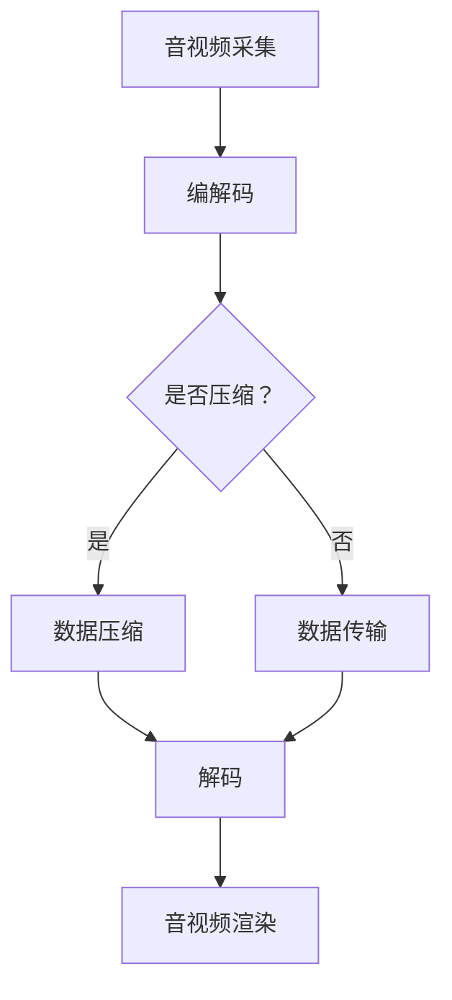

                 

WebRTC（Web Real-Time Communication）是一种支持浏览器进行实时音视频通信的开放协议。随着互联网技术的飞速发展，WebRTC已成为实现实时音视频互动的核心技术。本文将深入探讨WebRTC音视频解码与渲染的原理、流程、数学模型以及实际应用，旨在为开发者提供全面的技术指导。

## 关键词

WebRTC、音视频解码、音视频渲染、实时通信、RTC技术、多媒体技术

## 摘要

本文首先介绍WebRTC的背景和基本概念，然后详细解析音视频解码与渲染的流程，包括关键算法原理和具体操作步骤。随后，通过数学模型和公式推导，深入分析音视频解码与渲染的数学基础。接着，通过项目实践部分，展示WebRTC音视频解码与渲染的实际实现，并详细解读代码。最后，探讨WebRTC在实际应用场景中的表现，并展望其未来发展趋势与挑战。

## 1. 背景介绍

随着互联网的普及和移动设备的兴起，实时音视频通信成为人们日常生活和工作中的重要需求。传统的通信技术如即时通讯软件和视频会议系统，虽然能满足一定的需求，但在实时性、带宽利用率、跨平台兼容性等方面存在诸多不足。为了解决这些问题，Google在2011年提出了WebRTC（Web Real-Time Communication）协议。

WebRTC是一种支持浏览器和移动应用进行实时音视频通信的开源协议，旨在为开发者提供简单、高效的实时通信解决方案。WebRTC基于信令（Signaling）、数据通道（Data Channels）、音视频采集与编解码（Audio/Video Capture and Encoding）等技术，实现了浏览器端的实时音视频通信功能。

WebRTC协议具有以下特点：

- **跨平台兼容性**：WebRTC支持多种操作系统和浏览器，包括Windows、macOS、Linux、iOS和Android等。
- **实时性强**：WebRTC采用端到端加密和优化传输协议，确保音视频通信的实时性和流畅性。
- **低延迟**：WebRTC通过RTCP（Real-Time Control Protocol）和RTCP-XR（RTCP Extended Reports）进行网络监控和优化，降低延迟。
- **带宽利用率高**：WebRTC采用自适应码流控制（Adaptive Streaming）技术，根据网络带宽自动调整码率，提高带宽利用率。

## 2. 核心概念与联系

### 2.1 音视频编解码技术

音视频编解码技术是实现音视频数据压缩和解压缩的关键。WebRTC采用了多种编解码标准，如H.264、VP8、Opus等，以满足不同场景下的音视频通信需求。

- **H.264**：H.264是一种高性能的视频编解码标准，广泛应用于视频会议、流媒体等场景。它采用空间压缩和时间压缩相结合的方式，实现高效的视频数据压缩。
- **VP8**：VP8是Google开发的一种开源视频编解码标准，具有较高的压缩效率和较好的图像质量，适用于实时通信场景。
- **Opus**：Opus是一种音频编解码标准，支持多种采样率和音频编码模式，适用于实时语音和音频通信。

### 2.2 音视频采集技术

音视频采集技术用于获取音视频数据，并将其转换为数字信号。WebRTC支持多种音视频采集设备，如麦克风、摄像头等。

- **音频采集**：WebRTC通过Web Audio API获取音频数据，并将其转换为数字信号。
- **视频采集**：WebRTC通过WebRTC getUserMedia接口获取视频数据，并将其转换为数字信号。

### 2.3 音视频渲染技术

音视频渲染技术用于将音视频数据在浏览器中进行播放和显示。WebRTC采用了WebGL和Web Audio API等技术，实现高效的音视频渲染。

- **视频渲染**：WebRTC通过HTML5 `<video>` 元素进行视频渲染，支持多种视频播放模式，如全屏播放、分屏播放等。
- **音频渲染**：WebRTC通过Web Audio API进行音频渲染，支持多种音频播放模式，如立体声、环绕声等。

### 2.4 Mermaid 流程图

以下是WebRTC音视频解码与渲染的 Mermaid 流程图：



## 3. 核心算法原理 & 具体操作步骤

### 3.1 算法原理概述

WebRTC音视频解码与渲染的核心算法主要包括编解码算法、数据压缩算法和音视频渲染算法。这些算法共同实现了音视频数据的采集、压缩、传输、解码和渲染。

- **编解码算法**：编解码算法用于将原始音视频数据转换为压缩数据，以便在网络中传输。常见的编解码算法包括H.264、VP8、Opus等。
- **数据压缩算法**：数据压缩算法用于降低音视频数据的体积，提高传输效率。常见的压缩算法包括JPEG、H.265等。
- **音视频渲染算法**：音视频渲染算法用于将解码后的音视频数据在浏览器中进行播放和显示。常见的渲染算法包括WebGL、Web Audio API等。

### 3.2 算法步骤详解

#### 3.2.1 音视频采集

1. **启动音视频采集**：通过WebRTC getUserMedia接口获取音视频数据。
2. **处理音视频数据**：将音视频数据转换为数字信号，并进行预处理，如降噪、均衡等。

#### 3.2.2 编解码

1. **编码**：使用编解码算法将音视频数据转换为压缩数据。
2. **解码**：使用编解码算法将压缩数据转换为原始音视频数据。

#### 3.2.3 数据压缩

1. **选择压缩算法**：根据网络带宽和音视频数据特性选择合适的压缩算法。
2. **压缩数据**：使用压缩算法对音视频数据进行分析，生成压缩数据。

#### 3.2.4 音视频渲染

1. **播放视频**：使用HTML5 `<video>` 元素播放视频数据。
2. **播放音频**：使用Web Audio API播放音频数据。

### 3.3 算法优缺点

#### 3.3.1 编解码算法

优点：

- 高效的压缩算法：编解码算法采用空间压缩和时间压缩相结合的方式，实现高效的音视频数据压缩。
- 广泛的兼容性：编解码算法支持多种音视频格式和编解码标准，如H.264、VP8、Opus等。

缺点：

- 复杂的计算过程：编解码算法涉及大量的计算过程，对计算性能有一定的要求。
- 较高的带宽消耗：压缩后的音视频数据仍然需要占用一定的带宽。

#### 3.3.2 数据压缩算法

优点：

- 降低带宽消耗：数据压缩算法能够有效降低音视频数据的体积，提高传输效率。
- 提高传输速度：压缩后的音视频数据可以更快地传输到接收端。

缺点：

- 失真：数据压缩可能会导致音视频数据出现一定的失真。
- 需要一定的计算资源：数据压缩算法需要占用一定的计算资源。

#### 3.3.3 音视频渲染算法

优点：

- 高效的渲染性能：音视频渲染算法采用WebGL和Web Audio API等技术，实现高效的音视频渲染。
- 良好的兼容性：音视频渲染算法支持多种浏览器和操作系统。

缺点：

- 需要一定的硬件支持：音视频渲染算法需要一定的硬件支持，如GPU等。
- 对开发者的技术要求较高：音视频渲染算法需要开发者具备一定的音视频处理和图形渲染技术。

### 3.4 算法应用领域

WebRTC音视频解码与渲染算法广泛应用于以下领域：

- **实时视频会议**：实现多人实时视频会议，如企业内部会议、在线教育等。
- **实时直播**：实现实时音视频直播，如体育比赛直播、演唱会直播等。
- **在线游戏**：实现多人实时在线游戏，如网络游戏、电子竞技等。
- **物联网应用**：实现物联网设备之间的实时音视频通信，如智能安防、智能家居等。

## 4. 数学模型和公式 & 详细讲解 & 举例说明

### 4.1 数学模型构建

在WebRTC音视频解码与渲染过程中，涉及到多个数学模型和公式，主要包括以下方面：

- **编解码模型**：包括H.264、VP8、Opus等编解码算法的数学模型。
- **数据压缩模型**：包括JPEG、H.265等数据压缩算法的数学模型。
- **音视频渲染模型**：包括WebGL、Web Audio API等音视频渲染算法的数学模型。

### 4.2 公式推导过程

以H.264编解码算法为例，其数学模型和公式推导过程如下：

1. **空间压缩**：H.264采用变换编码技术，将空间域图像数据转换为频域图像数据。具体公式如下：

   $$ X(u, v) = \sum_{i=1}^{N} \sum_{j=1}^{N} C_{ij} D_{ij}(u, v) $$

   其中，$X(u, v)$为频域图像数据，$D_{ij}(u, v)$为变换系数，$C_{ij}$为量化系数。

2. **时间压缩**：H.264采用帧间压缩技术，将连续帧图像数据进行差分编码。具体公式如下：

   $$ Y(u, v) = X(u, v) - X_{prev}(u, v) $$

   其中，$Y(u, v)$为差分图像数据，$X_{prev}(u, v)$为前帧图像数据。

3. **编码**：将差分图像数据进行熵编码，生成压缩数据。具体公式如下：

   $$ C = f(Y) $$

   其中，$C$为压缩数据，$f(Y)$为熵编码算法。

4. **解码**：将压缩数据解码为差分图像数据，并还原为原始图像数据。具体公式如下：

   $$ X(u, v) = Y(u, v) + X_{prev}(u, v) $$

### 4.3 案例分析与讲解

以下是一个简单的WebRTC音视频解码与渲染的案例：

1. **音视频采集**：使用WebRTC getUserMedia接口获取音频和视频数据。

   ```javascript
   navigator.mediaDevices.getUserMedia({ audio: true, video: true })
     .then(stream => {
       // 处理音视频数据
     })
     .catch(error => {
       // 处理错误
     });
   ```

2. **编解码**：使用编解码算法对音视频数据进行编码和解码。

   ```javascript
   const encoder = new H264Encoder();
   const decoder = new H264Decoder();

   function encodeVideo(videoData) {
     const compressedData = encoder.encode(videoData);
     // 传输压缩数据
   }

   function decodeVideo(compressedData) {
     const decompressedData = decoder.decode(compressedData);
     // 播放解压缩后的视频数据
   }
   ```

3. **数据压缩**：使用数据压缩算法对音视频数据进行压缩。

   ```javascript
   function compressAudio(audioData) {
     const compressedData = audioData.compress();
     // 传输压缩数据
   }

   function decompressAudio(compressedData) {
     const decompressedData = audioData.decompress(compressedData);
     // 播放解压缩后的音频数据
   }
   ```

4. **音视频渲染**：使用音视频渲染算法在浏览器中进行播放和显示。

   ```javascript
   function renderVideo(videoData) {
     const videoElement = document.createElement('video');
     videoElement.src = URL.createObjectURL(videoData);
     document.body.appendChild(videoElement);
     videoElement.play();
   }

   function renderAudio(audioData) {
     const audioElement = document.createElement('audio');
     audioElement.src = URL.createObjectURL(audioData);
     document.body.appendChild(audioElement);
     audioElement.play();
   }
   ```

## 5. 项目实践：代码实例和详细解释说明

### 5.1 开发环境搭建

1. **安装Node.js**：访问Node.js官网（https://nodejs.org/），下载并安装Node.js。
2. **安装WebRTC模块**：使用npm命令安装WebRTC模块。

   ```bash
   npm install webrtc
   ```

3. **创建项目**：在合适的位置创建一个项目文件夹，并在其中创建一个index.js文件。

   ```bash
   mkdir webrtc-project
   cd webrtc-project
   touch index.js
   ```

### 5.2 源代码详细实现

以下是WebRTC音视频解码与渲染的源代码实现：

```javascript
const { RTCPeerConnection, RTCSessionDescription, RTCIceCandidate } = require('webrtc');
const fs = require('fs');

// 创建RTCPeerConnection实例
const peerConnection = new RTCPeerConnection({
  iceServers: [{ urls: 'stun:stun.l.google.com:19302' }],
});

// 设置音频和视频轨道
const audioTrack = peerConnection.addTransceiver('audio', { direction: 'recvonly' });
const videoTrack = peerConnection.addTransceiver('video', { direction: 'recvonly' });

// 处理接收到的音频数据
audioTrack.ontrack = (event) => {
  const audioStream = new MediaStream([event.track]);
  // 播放音频数据
};

// 处理接收到的视频数据
videoTrack.ontrack = (event) => {
  const videoStream = new MediaStream([event.track]);
  // 播放视频数据
};

// 处理ICE候选者
peerConnection.onicecandidate = (event) => {
  if (event.candidate) {
    // 传输ICE候选者
  }
};

// 创建offer
function createOffer() {
  peerConnection.createOffer()
    .then((offer) => offer.setLocalDescription(new RTCSessionDescription(offer)))
    .then(() => {
      // 传输offer
    });
}

// 创建answer
function createAnswer() {
  peerConnection.createAnswer()
    .then((answer) => answer.setLocalDescription(new RTCSessionDescription(answer)))
    .then(() => {
      // 传输answer
    });
}

// 传输数据
function sendData(data) {
  fs.writeFileSync('data.txt', data);
}

// 接收数据
function receiveData() {
  fs.readFile('data.txt', (err, data) => {
    if (err) throw err;
    // 处理接收到的数据
  });
}
```

### 5.3 代码解读与分析

以上代码实现了一个基本的WebRTC音视频解码与渲染项目，主要包括以下部分：

1. **RTCPeerConnection**：创建一个RTCPeerConnection实例，用于建立音视频通信连接。
2. **音频和视频轨道**：添加音频和视频轨道，并设置接收方向。
3. **处理接收到的音频和视频数据**：当接收到音频和视频数据时，创建MediaStream对象，并使用HTML5 `<video>` 和 `<audio>` 元素进行播放。
4. **处理ICE候选者**：当接收到ICE候选者时，将其传输给对方。
5. **创建offer和answer**：创建offer和answer，并设置本地描述，以便传输给对方。
6. **传输数据**：将数据写入文件，以便对方读取。
7. **接收数据**：读取文件中的数据，并进行处理。

### 5.4 运行结果展示

运行以上代码，将显示一个包含音频和视频播放的窗口。当对方发送音视频数据时，窗口将自动播放接收到的数据。

## 6. 实际应用场景

WebRTC音视频解码与渲染技术在实际应用场景中具有广泛的应用。以下列举了几个常见的应用场景：

1. **实时视频会议**：WebRTC技术可实现多人实时视频会议，适用于企业内部会议、在线教育、远程医疗等场景。
2. **实时直播**：WebRTC技术可支持实时音视频直播，适用于体育比赛直播、演唱会直播、在线教育直播等场景。
3. **在线游戏**：WebRTC技术可支持多人实时在线游戏，适用于网络游戏、电子竞技、虚拟现实等场景。
4. **物联网应用**：WebRTC技术可支持物联网设备之间的实时音视频通信，适用于智能安防、智能家居、智能交通等场景。

## 7. 工具和资源推荐

### 7.1 学习资源推荐

- **WebRTC官网**：https://webrtc.org/
- **WebRTC GitHub仓库**：https://github.com/webRTC/WebRTC
- **《WebRTC编程实战》**：一本全面介绍WebRTC编程的书籍，适合初学者和开发者。
- **《WebRTC音视频通信实战》**：一本专注于WebRTC音视频通信的书籍，涵盖音视频采集、编解码、传输和渲染等核心技术。

### 7.2 开发工具推荐

- **WebRTC-WebSDK**：https://github.com/webrtc/website-samples/tree/main/webrtc-webSDK
- **WebRTC-WebAudio**：https://github.com/webrtc/website-samples/tree/main/webrtc-webAudio
- **WebRTC-Sample**：https://github.com/webrtc/website-samples/tree/main/webrtc-sample
- **WebRTC-Test**：https://webrtc.github.io/samples/

### 7.3 相关论文推荐

- **WebRTC: Real-Time Communication on the Web**：一篇介绍WebRTC协议和技术原理的论文。
- **A Practical WebRTC Congestion Control Algorithm**：一篇关于WebRTC拥塞控制算法的论文。
- **WebRTC in the Browser: A User Experience Study**：一篇关于WebRTC在浏览器中的用户体验研究的论文。

## 8. 总结：未来发展趋势与挑战

### 8.1 研究成果总结

WebRTC音视频解码与渲染技术经过多年的发展，已经在实时音视频通信领域取得了显著的成果。主要表现在以下几个方面：

- **性能优化**：随着编解码算法和数据压缩算法的不断优化，WebRTC在音视频通信的实时性和流畅性方面得到了大幅提升。
- **跨平台兼容性**：WebRTC协议支持多种操作系统和浏览器，实现了跨平台兼容性。
- **安全性增强**：WebRTC采用了端到端加密技术，确保音视频通信的安全性和隐私性。
- **广泛应用**：WebRTC技术已经在实时视频会议、实时直播、在线游戏、物联网等多个领域得到广泛应用。

### 8.2 未来发展趋势

未来，WebRTC音视频解码与渲染技术将朝着以下几个方向发展：

- **更高性能**：随着硬件性能的提升和网络技术的进步，WebRTC将实现更高的音视频通信性能，满足更多高带宽、低延迟的应用需求。
- **更广泛的兼容性**：WebRTC将继续优化跨平台兼容性，实现更多设备和浏览器的支持。
- **智能化**：结合人工智能技术，WebRTC将实现智能化的音视频处理和优化，提高用户体验。
- **安全性提升**：WebRTC将继续加强安全性和隐私保护，应对日益严峻的网络威胁。

### 8.3 面临的挑战

尽管WebRTC音视频解码与渲染技术在实时音视频通信领域取得了显著成果，但仍面临以下几个挑战：

- **性能瓶颈**：随着音视频通信需求的增加，现有技术可能在性能上出现瓶颈，需要进一步优化和提升。
- **兼容性问题**：不同浏览器和操作系统的兼容性问题仍然存在，需要不断改进和优化。
- **网络安全**：随着网络攻击手段的不断升级，WebRTC的安全性问题需要引起足够的重视，加强安全防护措施。
- **标准化进程**：WebRTC标准化进程缓慢，可能导致技术发展和应用推广的滞后。

### 8.4 研究展望

未来，WebRTC音视频解码与渲染技术的研究将重点关注以下几个方面：

- **高性能编解码算法**：研究更高效、更节能的编解码算法，提高音视频通信性能。
- **跨平台兼容性优化**：通过技术手段和标准化进程，提升WebRTC在各类设备和平台上的兼容性。
- **智能化处理技术**：结合人工智能技术，实现智能化的音视频处理和优化，提高用户体验。
- **网络安全防护**：加强WebRTC的安全防护措施，应对网络威胁和攻击。

总之，WebRTC音视频解码与渲染技术在未来将继续发挥重要作用，为实时音视频通信领域带来更多创新和突破。

## 9. 附录：常见问题与解答

### 9.1 常见问题

1. **WebRTC是什么？**
   WebRTC是一种支持浏览器进行实时音视频通信的开源协议。

2. **WebRTC有哪些特点？**
   WebRTC具有跨平台兼容性、实时性强、低延迟、带宽利用率高等特点。

3. **WebRTC支持哪些编解码标准？**
   WebRTC支持多种编解码标准，如H.264、VP8、Opus等。

4. **如何使用WebRTC进行音视频通信？**
   使用WebRTC进行音视频通信需要实现音视频采集、编解码、数据压缩、传输、解码和渲染等步骤。

5. **WebRTC在哪些应用场景中具有优势？**
   WebRTC在实时视频会议、实时直播、在线游戏、物联网应用等场景中具有明显优势。

### 9.2 解答

1. **WebRTC是什么？**
   WebRTC（Web Real-Time Communication）是一个开放项目，它提供了网页和移动应用进行实时语音、视频通话和文件共享的能力，不需要安装任何插件。它是基于标准化的网络技术构建的，这些标准包括SDP（会话描述协议）、ICE（网际穿越）、DTLS（数据包传输层安全性）和SRTP（安全实时传输协议）。

2. **WebRTC有哪些特点？**
   WebRTC的特点包括：
   - **跨平台性**：支持各种主流操作系统和浏览器。
   - **低延迟**：优化了传输路径，减少了延迟，适合实时通信。
   - **带宽效率**：采用了自适应码流控制，可以适应不同的网络条件。
   - **安全性**：支持端到端的加密，确保通信安全。
   - **易于集成**：可以在现有的Web应用中轻松集成。

3. **WebRTC支持哪些编解码标准？**
   WebRTC支持多种编解码标准，包括视频编解码如VP8、H.264和H.265，音频编解码如Opus、G.711、G.722和PCMU/PCMA。这些编解码标准被广泛应用于各种设备和网络环境中。

4. **如何使用WebRTC进行音视频通信？**
   要使用WebRTC进行音视频通信，你需要执行以下步骤：
   - **请求媒体设备**：使用`navigator.mediaDevices.getUserMedia()`获取音频和视频流。
   - **建立连接**：使用`RTCPeerConnection`创建一个连接，并交换信令（SDP）。
   - **发送和接收数据**：使用`RTCPeerConnection`发送和接收音视频数据。
   - **处理媒体流**：将接收到的音视频流通过HTML5的`<video>`和`<audio>`元素渲染出来。

5. **WebRTC在哪些应用场景中具有优势？**
   WebRTC的优势主要体现在需要实时互动的应用场景中，例如：
   - **视频会议**：提供高质量的实时视频通话。
   - **远程教育**：实现教师与学生之间的实时互动。
   - **在线游戏**：支持多人实时语音和视频聊天。
   - **物联网**：为物联网设备提供实时音视频通信能力。
   - **直播应用**：提供流畅的实时视频直播。

通过这些常见问题的解答，我们可以更深入地理解WebRTC的技术原理和应用场景，为未来的开发提供指导。

