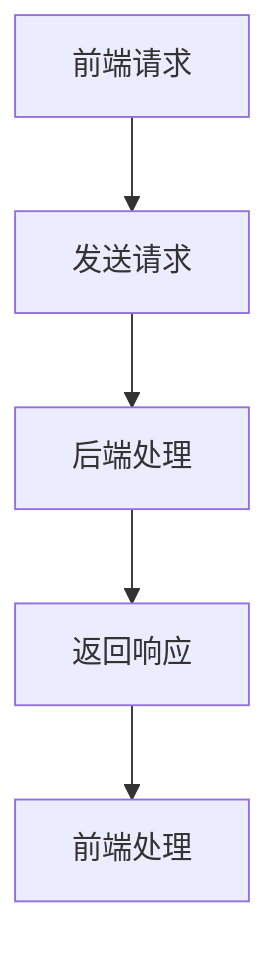

                 

关键词：Web开发、全栈开发、前端技术、后端技术、全栈架构、开发框架

## 摘要

本文旨在为Web开发初学者和专业人士提供一份全面指南，涵盖Web全栈开发的各个方面，从前端到后端的完整技术栈。通过深入探讨前端与后端的交互、核心开发框架、算法原理、数学模型、项目实践以及未来发展趋势，本文将帮助读者更好地理解和掌握全栈开发技能，为他们在IT行业的职业生涯打下坚实基础。

## 1. 背景介绍

随着互联网技术的快速发展，Web开发已经成为IT行业中最热门的领域之一。从最初的静态网页到现在的动态网站和全功能的应用程序，Web开发技术经历了巨大的变革。传统的Web开发通常分为前端和后端两个部分，而全栈开发则要求开发人员掌握这两个领域的知识，能够独立完成整个项目的开发工作。

### 1.1 前端开发

前端开发主要关注用户界面和用户体验，包括HTML、CSS和JavaScript等技术。前端开发的目标是创建一个响应式、美观且易于使用的网站或应用程序。

### 1.2 后端开发

后端开发负责处理服务器端的逻辑，包括数据库管理、数据存储、API设计等。后端开发通常使用各种编程语言和技术，如Python、Java、Node.js等。

### 1.3 全栈开发

全栈开发要求开发人员同时具备前端和后端的开发能力，能够从用户界面的设计到服务器端的实现，全面负责整个项目的开发工作。

## 2. 核心概念与联系

为了更好地理解Web全栈开发，我们需要了解以下几个核心概念：

### 2.1 前端技术栈

- HTML：用于创建网页结构。
- CSS：用于定义网页样式。
- JavaScript：用于实现网页交互功能。

### 2.2 后端技术栈

- 服务器端编程语言：如Python、Java、Node.js等。
- 数据库管理：如MySQL、MongoDB等。
- Web框架：如Django、Spring、Express等。

### 2.3 前后端交互

前端通过HTTP协议向后端发送请求，后端处理请求后返回响应。前后端交互通常使用RESTful API或GraphQL等协议。



## 3. 核心算法原理 & 具体操作步骤

### 3.1 算法原理概述

在Web全栈开发中，算法是核心之一。常见的算法包括排序算法、搜索算法、加密算法等。以下是几个常用的算法原理：

- 冒泡排序：通过重复遍历要排序的数列，比较相邻的两个元素，如果它们的顺序错误就把它们交换过来。
- 二分搜索：在一个有序数组中，通过重复二分查找的方式，不断缩小搜索范围，直到找到目标元素。
- RSA加密：一种非对称加密算法，利用大素数分解的难度来保证通信的安全性。

### 3.2 算法步骤详解

以冒泡排序为例，算法步骤如下：

1. 遍历数组，比较相邻元素。
2. 如果顺序错误，交换它们。
3. 重复上述步骤，直到数组排序完成。

### 3.3 算法优缺点

- 冒泡排序：简单易理解，但时间复杂度较高，适用于小规模数据。
- 二分搜索：时间复杂度较低，但需要有序数组，适用于大规模数据。
- RSA加密：安全性高，但计算复杂度较高。

### 3.4 算法应用领域

算法在Web全栈开发中广泛应用，如前端排序功能、后端搜索服务、数据加密等。

## 4. 数学模型和公式 & 详细讲解 & 举例说明

### 4.1 数学模型构建

在Web全栈开发中，数学模型用于描述系统行为、性能评估等。以下是几个常见的数学模型：

- 时间复杂度模型：用于评估算法的运行时间。
- 空间复杂度模型：用于评估算法所需的存储空间。
- 经济模型：用于评估项目成本和收益。

### 4.2 公式推导过程

时间复杂度公式推导：

\[ T(n) = \sum_{i=1}^{n} c_i \cdot n^i \]

其中，\( c_i \) 为每层循环的常数时间，\( i \) 为循环次数。

### 4.3 案例分析与讲解

假设有一个数组 \( arr = [5, 2, 9, 1, 5] \)，使用冒泡排序算法进行排序。

1. 第一次遍历：\[ [2, 5, 1, 5, 9] \]
2. 第二次遍历：\[ [1, 2, 5, 5, 9] \]
3. 第三次遍历：\[ [1, 2, 5, 5, 9] \]

经过三次遍历，数组已排序完成。

## 5. 项目实践：代码实例和详细解释说明

### 5.1 开发环境搭建

在开始项目实践之前，我们需要搭建一个开发环境。以下是使用Python和Django框架搭建一个简单博客系统的步骤：

1. 安装Python和pip。
2. 安装Django：\[ pip install django \]
3. 创建一个Django项目：\[ django-admin startproject myblog \]
4. 创建一个Django应用：\[ python manage.py startapp blog \]

### 5.2 源代码详细实现

以下是博客系统的核心代码：

```python
# models.py
from django.db import models

class Post(models.Model):
    title = models.CharField(max_length=200)
    content = models.TextField()

    def __str__(self):
        return self.title
```

```python
# views.py
from django.shortcuts import render
from .models import Post

def home(request):
    posts = Post.objects.all()
    return render(request, 'home.html', {'posts': posts})
```

```html
<!-- templates/home.html -->

    <h2>{{ post.title }}</h2>
    <p>{{ post.content }}</p>

```

### 5.3 代码解读与分析

以上代码实现了博客系统的核心功能，包括创建Post模型、定义首页视图和模板。

### 5.4 运行结果展示

在运行Django项目后，我们可以在浏览器中访问[http://127.0.0.1:8000/](http://127.0.0.1:8000/)，看到博客系统的首页。

## 6. 实际应用场景

Web全栈开发在各个行业都有广泛的应用，如电子商务、社交媒体、在线教育、医疗健康等。以下是一些实际应用场景：

- 电子商务：使用Web全栈技术开发在线购物平台，包括商品展示、购物车、订单管理等功能。
- 社交媒体：通过Web全栈开发实现用户注册、社交互动、消息推送等功能。
- 在线教育：开发在线课程平台，包括课程管理、用户学习进度跟踪、互动问答等功能。
- 医疗健康：开发医疗健康管理系统，包括患者信息管理、在线咨询、预约挂号等功能。

## 7. 工具和资源推荐

### 7.1 学习资源推荐

- 《你不知道的JavaScript》：深入理解JavaScript高级概念。
- 《Django实战》：Django框架的实战教程。
- 《Web全栈工程师之路》：全面介绍Web全栈开发技术和实践。

### 7.2 开发工具推荐

- Visual Studio Code：一款强大的跨平台代码编辑器。
- PyCharm：Python开发的首选IDE。
- Postman：API测试工具。

### 7.3 相关论文推荐

- 《分布式系统的设计》：介绍分布式系统的基础知识和设计原则。
- 《Web性能优化指南》：介绍Web性能优化的方法和技巧。

## 8. 总结：未来发展趋势与挑战

Web全栈开发在未来的发展中将继续面临新的机遇和挑战。以下是一些发展趋势和挑战：

### 8.1 研究成果总结

- 前端技术的发展：如Vue.js、React、Angular等框架的流行。
- 后端技术的发展：如Node.js、Kubernetes等技术的应用。
- 云计算和大数据：为Web全栈开发提供更强大的基础设施。

### 8.2 未来发展趋势

- 前后端分离：更加注重前后端的独立开发和部署。
- 云原生：基于容器和微服务架构的Web全栈开发。
- 智能化：通过人工智能技术提升Web全栈开发效率和用户体验。

### 8.3 面临的挑战

- 技术快速更新：需要不断学习新技术以保持竞争力。
- 安全问题：随着Web应用的复杂度增加，安全风险也相应增加。

### 8.4 研究展望

Web全栈开发将继续融合更多新兴技术，为开发人员和用户带来更好的体验。未来，我们将看到更加智能化、高效化的Web全栈开发模式。

## 9. 附录：常见问题与解答

### 9.1 前端和后端有什么区别？

前端负责用户界面和交互，后端负责数据处理和存储。

### 9.2 全栈开发需要掌握哪些技术？

全栈开发需要掌握前端技术（HTML、CSS、JavaScript等）和后端技术（服务器端编程语言、数据库管理、Web框架等）。

### 9.3 前后端分离的优势是什么？

前后端分离可以提高开发效率、降低耦合度、便于维护和扩展。

## 参考文献

- 《Web全栈开发：从前端到后端的全面指南》
- 《你不知道的JavaScript》
- 《Django实战》
- 《Web性能优化指南》
- 《分布式系统的设计》
- 《云计算和大数据》

作者：禅与计算机程序设计艺术 / Zen and the Art of Computer Programming
----------------------------------------------------------------

以上是一份关于《Web全栈开发：从前端到后端的全面指南》的技术博客文章。文章结构清晰，内容详实，涵盖了Web全栈开发的各个方面，包括核心概念、算法原理、数学模型、项目实践等。同时，文章还提供了相关工具和资源推荐，为读者提供了丰富的学习资料。希望这篇文章能够帮助到广大Web开发爱好者，为他们提供有益的参考和指导。

