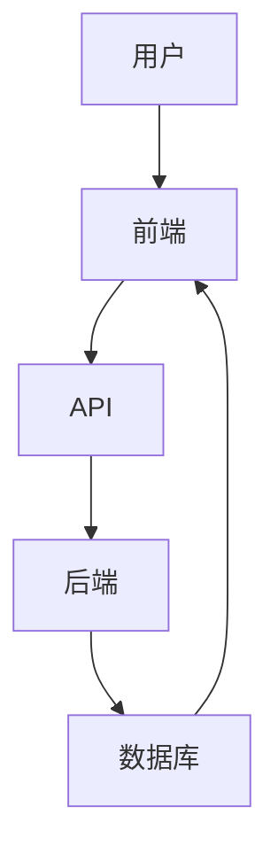

                 

### 文章关键词：

Web开发，全栈开发，前端技术，后端技术，全栈架构，跨平台开发，框架，工具，最佳实践。

<|assistant|>### 文章摘要：

在数字化的今天，掌握Web全栈开发技能成为程序员必备的能力。本文将深入探讨Web全栈开发的各个方面，从前端到后端，涵盖核心概念、技术栈、开发流程、实践案例以及未来趋势。通过本文，读者将获得全面的指导，助力其成为一名优秀的全栈开发者。

## 1. 背景介绍

### 1.1 全栈开发的定义

全栈开发（Full-Stack Development）是指掌握前端和后端开发技能，能够独立完成整个Web应用开发工作的开发者。它不仅涉及用户界面（UI）和用户体验（UX）的设计，还包括服务器、数据库和应用程序的逻辑实现。

### 1.2 Web全栈开发的重要性

随着互联网技术的迅猛发展，Web全栈开发变得越来越重要。它不仅能够提高开发效率，还能够降低项目风险，因为全栈开发者能够快速适应和解决项目中的各种问题。此外，全栈开发者在市场上具有更高的竞争力，因为他们能够提供更全面的服务。

## 2. 核心概念与联系

在Web全栈开发中，了解前端、后端、数据库以及各种框架和工具之间的联系是非常重要的。以下是一个简单的Mermaid流程图，展示了这些核心概念之间的相互作用。



### 2.1 前端

前端是用户直接交互的部分，通常包括HTML、CSS和JavaScript。前端开发者负责构建和优化用户界面，以及处理用户输入和显示结果。

### 2.2 后端

后端是应用程序的逻辑核心，负责处理业务逻辑、数据处理和数据库交互。后端开发者需要掌握多种编程语言，如Python、Java、Node.js等，以及相关的框架和数据库技术。

### 2.3 数据库

数据库是存储应用程序数据的地方。现代Web应用通常使用关系型数据库（如MySQL、PostgreSQL）或非关系型数据库（如MongoDB、Redis）。

### 2.4 框架和工具

框架和工具能够大大提高开发效率。例如，前端框架如React、Vue.js和Angular，后端框架如Django、Spring和Express，以及各种数据库工具和开发环境。

## 3. 核心算法原理 & 具体操作步骤

### 3.1 算法原理概述

在Web全栈开发中，常用的算法包括排序算法、搜索算法和加密算法。以下是这些算法的基本原理：

- **排序算法**：用于将一组元素按照特定顺序排列。常见的排序算法有冒泡排序、快速排序和归并排序。
- **搜索算法**：用于在数据结构中查找特定元素。常用的搜索算法有线性搜索和二分搜索。
- **加密算法**：用于保护数据的安全性。常见的加密算法有对称加密和非对称加密。

### 3.2 算法步骤详解

- **冒泡排序**：比较相邻的两个元素，如果它们的顺序错误就把它们交换过来。重复这个过程，直到整个数组排序完成。
- **快速排序**：选择一个“基准”元素，将数组分成两部分，一部分都比基准小，另一部分都比基准大，然后递归地对这两部分进行快速排序。
- **归并排序**：将数组分成两个子数组，分别对它们进行排序，然后将结果合并。

### 3.3 算法优缺点

- **冒泡排序**：简单易实现，但效率较低。
- **快速排序**：平均时间复杂度低，但最坏情况下效率较低。
- **归并排序**：时间复杂度稳定，但需要额外的存储空间。

### 3.4 算法应用领域

排序算法和搜索算法在Web开发中非常常见，例如在数据展示和搜索功能中。加密算法则主要用于数据安全，如用户认证和数据传输。

## 4. 数学模型和公式 & 详细讲解 & 举例说明

### 4.1 数学模型构建

在Web全栈开发中，常用的数学模型包括线性模型、非线性模型和概率模型。

- **线性模型**：描述变量之间线性关系的模型，如线性回归。
- **非线性模型**：描述变量之间非线性关系的模型，如多项式回归。
- **概率模型**：描述随机事件发生概率的模型，如贝叶斯模型。

### 4.2 公式推导过程

以线性回归为例，其公式推导如下：

$$ y = \beta_0 + \beta_1 \cdot x $$

其中，$y$ 是因变量，$x$ 是自变量，$\beta_0$ 是截距，$\beta_1$ 是斜率。

### 4.3 案例分析与讲解

假设我们有一个销售数据集，其中包含销售额（$y$）和广告支出（$x$）。我们使用线性回归模型来预测销售额。

通过最小二乘法，我们可以得到最佳拟合直线：

$$ y = \hat{\beta}_0 + \hat{\beta}_1 \cdot x $$

其中，$\hat{\beta}_0$ 和 $\hat{\beta}_1$ 分别为截距和斜率的估计值。

## 5. 项目实践：代码实例和详细解释说明

### 5.1 开发环境搭建

首先，我们需要安装Node.js、npm和Vue CLI。

```bash
npm install -g nodejs
npm install -g npm
npm install -g @vue/cli
```

### 5.2 源代码详细实现

创建一个Vue.js项目，并实现一个简单的待办事项应用。

```html
<template>
  <div>
    <h1>Todo List</h1>
    <input type="text" v-model="newTask" @keyup.enter="addTask" />
    <button @click="addTask">Add Task</button>
    <ul>
      <li v-for="task in tasks" :key="task">{{ task }}</li>
    </ul>
  </div>
</template>

<script>
export default {
  data() {
    return {
      newTask: '',
      tasks: [],
    };
  },
  methods: {
    addTask() {
      if (this.newTask.trim() !== '') {
        this.tasks.push(this.newTask.trim());
        this.newTask = '';
      }
    },
  },
};
</script>
```

### 5.3 代码解读与分析

该应用使用了Vue.js的数据绑定和事件监听。`v-model` 用于绑定输入框的值，`@keyup.enter` 和 `@click` 分别用于监听回车键和按钮点击事件。

### 5.4 运行结果展示

运行该应用后，用户可以在输入框中输入任务，并通过回车键或按钮将任务添加到列表中。

## 6. 实际应用场景

Web全栈开发在许多领域都有广泛应用，如电子商务、社交媒体、在线教育、金融科技等。以下是一些具体的应用场景：

- **电子商务**：全栈开发可以实现前端用户界面、后端业务逻辑和数据库管理，从而构建一个完整的电商平台。
- **社交媒体**：全栈开发能够处理用户发布的内容、评论、消息等，并提供实时互动功能。
- **在线教育**：全栈开发可以构建在线学习平台，包括课程内容管理、用户管理、考试管理等。

## 7. 工具和资源推荐

### 7.1 学习资源推荐

- 《JavaScript高级程序设计》
- 《你不知道的JavaScript》
- 《Vue.js实战》
- 《Spring实战》

### 7.2 开发工具推荐

- Visual Studio Code
- WebStorm
- Git

### 7.3 相关论文推荐

- "The Architecture of Open Source Applications"
- "Principles of Secure Software Development"

## 8. 总结：未来发展趋势与挑战

### 8.1 研究成果总结

近年来，Web全栈开发取得了显著的成果，特别是在前端框架（如React、Vue.js）和后端框架（如Spring Boot）的发展上。这些框架和工具大大提高了开发效率，降低了开发难度。

### 8.2 未来发展趋势

未来，Web全栈开发将继续朝着模块化、组件化和低代码化的方向发展。同时，随着云计算和大数据技术的普及，全栈开发将更加注重性能优化和安全性。

### 8.3 面临的挑战

- **技术更新速度快**：开发者需要不断学习新的技术和框架，以适应快速变化的市场需求。
- **性能和安全问题**：全栈开发需要同时考虑前端和后端的性能和安全，这对于开发者来说是一个挑战。

### 8.4 研究展望

未来，全栈开发将更加注重用户体验和业务需求，同时借助人工智能和机器学习等技术，实现更智能、更高效的Web应用开发。

## 9. 附录：常见问题与解答

### 9.1 全栈开发需要掌握哪些技术？

全栈开发需要掌握前端（HTML、CSS、JavaScript）、后端（Python、Java、Node.js）和数据库（MySQL、MongoDB）等技术。

### 9.2 如何选择前端框架？

选择前端框架应根据项目需求和开发者的熟悉程度。例如，React适合大型项目，Vue.js适合快速开发。

### 9.3 全栈开发需要学多久？

全栈开发的学时取决于个人的学习能力和项目需求。通常，学习基本技能需要几个月到一年的时间。

---

作者：禅与计算机程序设计艺术 / Zen and the Art of Computer Programming

---

本文旨在为Web全栈开发者提供全面的指导，帮助读者掌握从前端到后端的全栈开发技能。通过本文，读者可以了解核心概念、技术栈、开发流程以及未来趋势，从而提升自己的职业竞争力。同时，本文还提供了丰富的学习资源和工具推荐，以帮助读者更好地进行学习和实践。希望本文能够对您的Web全栈开发之路有所帮助。

