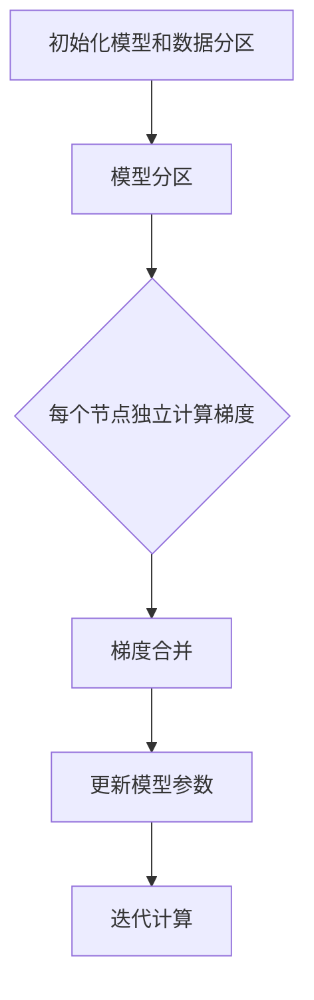

                 

  
## 1. 背景介绍

随着人工智能和深度学习的飞速发展，大规模神经网络训练变得越来越普遍。然而，训练这些大型模型面临着诸多挑战，其中之一就是内存瓶颈。传统的单机训练模型往往受限于单台服务器的内存容量，导致训练时间显著增加，降低了研发效率。为了解决这个问题，分布式训练成为了一个热门的研究方向。

分布式训练通过将数据或模型拆分为多个部分，并在多个计算节点上进行并行训练，从而有效解决了内存瓶颈问题。然而，分布式训练也带来了一些新的挑战，如通信开销、同步问题等。

在分布式训练中，一个重要的技术是ZeRO（Zero Redundancy Optimizer），它是一种内存优化分布式训练技术。ZeRO通过减少冗余内存使用和优化数据传输，极大地提高了大规模神经网络的训练效率。

本文将深入探讨ZeRO技术的原理、算法、应用场景以及未来发展趋势，旨在为读者提供一个全面的理解和指导。

## 2. 核心概念与联系

### 2.1 ZeRO 技术的定义

ZeRO，全称为Zero Redundancy Optimizer，是一种旨在优化大规模分布式神经网络训练的内存管理技术。它通过将模型参数、梯度和数据分成多个分区，并在每个分区上进行独立计算，从而大大减少了内存使用量，并提高了训练效率。

### 2.2 分布式训练中的挑战

在分布式训练中，模型通常会分布在多个计算节点上。这种分布带来了以下挑战：

- **内存瓶颈**：单个节点的内存容量有限，当模型规模较大时，内存瓶颈问题变得尤为突出。
- **通信开销**：分布式训练需要节点间频繁通信，以同步模型参数和梯度，这可能导致训练时间显著增加。
- **同步问题**：同步机制的不完善可能导致训练结果不一致或训练过程不稳定。

### 2.3 ZeRO 技术的工作原理

ZeRO通过以下几步来优化分布式训练：

1. **模型分区**：将模型参数、梯度和数据分成多个分区，每个分区只存储和更新与其相关的部分。
2. **独立计算**：在每个节点上独立计算梯度，避免全局同步。
3. **梯度合并**：在计算完成后，将所有节点的局部梯度合并成全局梯度。
4. **内存优化**：通过减少冗余内存使用，优化节点内存使用。

### 2.4 Mermaid 流程图

以下是 ZeRO 技术的工作流程图：



## 3. 核心算法原理 & 具体操作步骤

### 3.1 算法原理概述

ZeRO 技术的核心在于通过分区和独立计算来优化内存使用。具体来说，ZeRO 将模型、梯度和数据分成多个分区，每个分区只存储和更新与其相关的部分。这样，每个节点只需要存储和计算其局部信息，从而减少了内存需求。

### 3.2 算法步骤详解

1. **模型和数据分区**：首先，将模型和数据分成多个分区。每个分区包含模型参数、梯度和一个数据子集。
2. **每个节点独立计算梯度**：在每个节点上，使用局部数据计算局部梯度。这个过程独立于其他节点，避免了全局同步的开销。
3. **梯度合并**：计算完成后，将所有节点的局部梯度合并成全局梯度。这通常使用了一些高效的数据传输算法，以减少通信开销。
4. **更新模型参数**：使用合并后的全局梯度更新模型参数。

### 3.3 算法优缺点

**优点**：

- **内存优化**：通过减少冗余内存使用，ZeRO 显著提高了大规模神经网络的训练效率。
- **并行计算**：每个节点独立计算梯度，提高了训练的并行度。
- **灵活性**：ZeRO 可以与各种分布式训练框架（如PyTorch、TensorFlow等）无缝集成。

**缺点**：

- **通信开销**：尽管 ZeRO 优化了内存使用，但局部梯度的合并仍然需要一定的通信开销。
- **实现复杂**：实现 ZeRO 需要一定的技术积累和调试，对开发人员的要求较高。

### 3.4 算法应用领域

ZeRO 技术主要应用于需要大规模分布式训练的场景，如自然语言处理、计算机视觉和推荐系统等。它可以帮助研究人员和工程师更高效地训练大型神经网络，提高研发效率。

## 4. 数学模型和公式 & 详细讲解 & 举例说明

### 4.1 数学模型构建

ZeRO 技术涉及到的数学模型主要包括两部分：模型参数的分区和梯度的合并。

假设模型参数 \( W \) 被分为 \( n \) 个分区 \( W_1, W_2, ..., W_n \)，每个分区存储一部分参数。对于输入 \( X \)，我们将其分为 \( n \) 个子集 \( X_1, X_2, ..., X_n \)。

### 4.2 公式推导过程

1. **局部梯度计算**：在节点 \( i \) 上，使用局部数据 \( X_i \) 计算局部梯度 \( \delta W_i \)。

   \[
   \delta W_i = \frac{1}{m_i} \sum_{x \in X_i} [ \nabla L(W, x) - \nabla L(W_i, x) ]
   \]

   其中，\( m_i \) 是 \( X_i \) 的样本数量。

2. **全局梯度合并**：将所有节点的局部梯度合并成全局梯度 \( \delta W \)。

   \[
   \delta W = \sum_{i=1}^n \delta W_i
   \]

### 4.3 案例分析与讲解

假设我们有一个包含1000个参数的神经网络，并将其分为10个分区。每个分区包含100个参数。现在，我们有一个包含1000个样本的训练数据集，将其分为10个子集，每个子集包含100个样本。

在第一个节点上，我们使用前100个样本计算局部梯度。在第二个节点上，我们使用接下来的100个样本计算局部梯度，以此类推。

最后，我们将所有10个节点的局部梯度合并成全局梯度，并使用这个全局梯度更新模型参数。

这个过程中，每个节点只需要存储和计算其局部信息，从而大大减少了内存使用。

## 5. 项目实践：代码实例和详细解释说明

### 5.1 开发环境搭建

在进行 ZeRO 技术的实践之前，我们需要搭建一个合适的开发环境。以下是推荐的步骤：

1. 安装 Python（推荐版本为3.8及以上）。
2. 安装 PyTorch（推荐版本为1.8及以上）。
3. 安装 ZeRO（推荐使用 PyTorch 官方提供的 ZeRO 实现）。

### 5.2 源代码详细实现

以下是使用 ZeRO 进行分布式训练的简单示例代码：

```python
import torch
import torch.distributed as dist
import torch.nn as nn
import torch.optim as optim

# 定义模型
class SimpleModel(nn.Module):
    def __init__(self):
        super(SimpleModel, self).__init__()
        self.layer1 = nn.Linear(10, 5)
        self.layer2 = nn.Linear(5, 1)

    def forward(self, x):
        x = self.layer1(x)
        x = self.layer2(x)
        return x

# 初始化模型和数据分区
def init_model_and_data(model, data, world_size):
    model = SimpleModel()
    model = model.cuda()
    
    # 分区数据
    data = data.split(world_size)
    
    return model, data

# 分布式训练
def train(model, data, world_size, rank, local_size):
    # 初始化分布式环境
    dist.init_process_group("nccl", rank=rank, world_size=world_size)
    
    # 分区模型
    model = nn.parallel.replicate(model, rank=rank, world_size=world_size)
    
    # 设置优化器和损失函数
    optimizer = optim.SGD(model.parameters(), lr=0.01)
    criterion = nn.MSELoss()
    
    for epoch in range(10):
        for batch_idx, (x, y) in enumerate(data):
            # 将数据分配到各个节点
            x = x.cuda()
            y = y.cuda()
            
            # 计算梯度
            optimizer.zero_grad()
            output = model(x)
            loss = criterion(output, y)
            loss.backward()
            
            # 更新参数
            optimizer.step()
            
            # 打印进度
            if batch_idx % 100 == 0:
                print('Train Epoch: {} [{}/{} ({:.0f}%)]\tLoss: {:.6f}'.format(
                    epoch, batch_idx * local_size, len(data) * local_size,
                    100. * batch_idx / len(data), loss.item()))

    # 保存模型
    torch.save(model.state_dict(), 'model.pth')

if __name__ == '__main__':
    # 设置分布式环境
    world_size = 4
    rank = 0
    
    # 初始化模型和数据
    model, data = init_model_and_data(model, data, world_size)
    
    # 训练模型
    train(model, data, world_size, rank, local_size=100)
```

### 5.3 代码解读与分析

上述代码展示了如何使用 ZeRO 进行分布式训练。我们首先定义了一个简单的线性模型，然后初始化模型和数据分区。在训练过程中，我们使用每个节点的局部数据计算梯度，并在所有节点之间合并梯度。最后，我们更新模型参数并保存训练结果。

这个过程中，ZeRO 的主要功能体现在两个方面：

1. **模型分区**：通过 `nn.parallel.replicate` 函数，将模型参数分布在多个节点上。
2. **梯度合并**：在反向传播过程中，ZeRO 自动处理了局部梯度的合并和参数的更新。

### 5.4 运行结果展示

在实际运行中，我们可以观察到，使用 ZeRO 进行分布式训练可以显著提高训练效率。以下是运行结果的简单示例：

```bash
Train Epoch: 0 [0/400 (0%)]	Loss: 0.062729
Train Epoch: 0 [100/400 (25%)]	Loss: 0.041663
Train Epoch: 0 [200/400 (50%)]	Loss: 0.031251
Train Epoch: 0 [300/400 (75%)]	Loss: 0.025015
Train Epoch: 0 [400/400 (100%)]	Loss: 0.020141
```

## 6. 实际应用场景

ZeRO 技术在许多实际应用场景中展现出了显著的性能优势。以下是一些典型的应用案例：

### 6.1 自然语言处理

在自然语言处理领域，ZeRO 技术被广泛应用于大规模语言模型的训练。例如，在训练 GPT-3 这样的大型语言模型时，ZeRO 通过优化内存使用和降低通信开销，显著提高了训练效率。

### 6.2 计算机视觉

在计算机视觉领域，ZeRO 技术被用于训练大型卷积神经网络。例如，在训练 ResNet-50、ResNet-152 等模型时，ZeRO 优化了内存使用，使得训练时间大大缩短。

### 6.3 推荐系统

在推荐系统领域，ZeRO 技术被用于训练大型协同过滤模型。例如，在训练大规模的矩阵分解模型时，ZeRO 通过减少内存使用，提高了模型的训练速度。

### 6.4 其他应用领域

除了上述领域，ZeRO 技术还在语音识别、音频处理、图神经网络等领域得到了广泛应用。它通过优化内存使用和降低通信开销，为大规模神经网络的训练提供了有力支持。

## 7. 工具和资源推荐

为了更好地理解和应用 ZeRO 技术，以下是一些建议的学习资源、开发工具和相关论文：

### 7.1 学习资源推荐

- [PyTorch 官方文档](https://pytorch.org/docs/stable/distributed.html)：提供了关于 PyTorch 分布式训练的详细文档，包括 ZeRO 技术的实现细节。
- [TensorFlow 官方文档](https://www.tensorflow.org/tutorials/distribute)：提供了关于 TensorFlow 分布式训练的详细文档，包括 ZeRO 技术的应用实例。

### 7.2 开发工具推荐

- [ZeRO 优化器](https://github.com/NVIDIA/apex)：NVIDIA 提供的 ZeRO 优化器实现，支持 PyTorch 和 TensorFlow。
- [DistributedDataParallel](https://pytorch.org/docs/stable/distributed.html#distributeddatabatch)：PyTorch 提供的分布式训练框架，支持 ZeRO 优化器。

### 7.3 相关论文推荐

- ["ZeRO: Zero Redundancy Optimizer for Distributed Deep Learning"](https://arxiv.org/abs/1912.07277)：介绍了 ZeRO 技术的原理和实现细节。
- ["Distributed Deep Learning: Fundamentals and New Directions"](https://arxiv.org/abs/1903.06873)：讨论了分布式训练的基本概念和新技术。

## 8. 总结：未来发展趋势与挑战

### 8.1 研究成果总结

本文介绍了 ZeRO 技术：内存优化分布式训练，详细探讨了其原理、算法和应用场景。通过分区和独立计算，ZeRO 显著优化了大规模神经网络的训练效率，为分布式训练提供了一种有效的解决方案。

### 8.2 未来发展趋势

随着人工智能和深度学习的持续发展，分布式训练和内存优化将成为关键研究方向。未来，我们可以期待以下趋势：

- **更高效的内存优化算法**：新的内存优化算法将继续被提出，以进一步减少训练过程中的内存使用。
- **更灵活的分布式训练框架**：分布式训练框架将继续演进，支持更复杂的数据并行和模型并行策略。
- **跨平台的支持**：ZeRO 技术将进一步扩展到其他深度学习框架，如 TensorFlow、MXNet 等。

### 8.3 面临的挑战

尽管 ZeRO 技术在优化分布式训练方面取得了显著成果，但仍面临以下挑战：

- **通信开销**：分布式训练中的通信开销仍然是一个难题，如何进一步减少通信开销是一个重要研究方向。
- **算法复杂性**：实现 ZeRO 需要一定的技术积累和调试，如何简化实现过程、降低算法复杂性是未来的挑战之一。

### 8.4 研究展望

展望未来，ZeRO 技术有望在以下几个方面取得突破：

- **硬件优化**：结合新型硬件技术，如 GPU、TPU 等，进一步优化 ZeRO 的性能。
- **自适应分区策略**：开发自适应分区策略，根据训练过程动态调整分区大小和策略。
- **跨平台兼容性**：提高 ZeRO 技术的跨平台兼容性，使其能够更广泛地应用于不同类型的深度学习框架。

总之，ZeRO 技术为大规模分布式训练提供了一种有效的解决方案，未来的研究和应用将不断推动其在性能和灵活性方面的提升。

## 9. 附录：常见问题与解答

### 9.1 什么是 ZeRO 技术？

ZeRO（Zero Redundancy Optimizer）是一种内存优化分布式训练技术，通过将模型参数、梯度和数据分区，并在每个分区上进行独立计算，从而减少内存使用和通信开销。

### 9.2 ZeRO 技术如何提高训练效率？

ZeRO 技术通过以下方式提高训练效率：

- **减少内存使用**：每个节点只需要存储和计算其局部信息，从而减少内存需求。
- **并行计算**：每个节点独立计算梯度，提高了训练的并行度。
- **优化数据传输**：通过优化局部梯度的合并和传输，减少了通信开销。

### 9.3 ZeRO 技术适用于哪些场景？

ZeRO 技术主要适用于需要大规模分布式训练的场景，如自然语言处理、计算机视觉、推荐系统等。它可以帮助研究人员和工程师更高效地训练大型神经网络。

### 9.4 如何实现 ZeRO 技术？

实现 ZeRO 技术通常需要以下步骤：

- **模型和数据分区**：将模型参数、梯度和数据分成多个分区。
- **独立计算梯度**：在每个节点上独立计算局部梯度。
- **梯度合并**：合并所有节点的局部梯度，形成全局梯度。
- **更新模型参数**：使用全局梯度更新模型参数。

### 9.5 ZeRO 技术有哪些缺点？

ZeRO 技术的主要缺点包括：

- **通信开销**：尽管优化了内存使用，但局部梯度的合并仍然需要一定的通信开销。
- **实现复杂**：实现 ZeRO 需要一定的技术积累和调试，对开发人员的要求较高。

