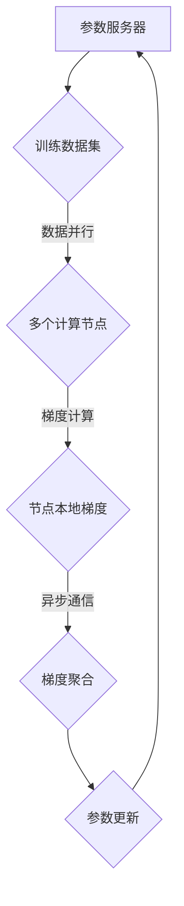

                 

 > 关键词：ZeRO优化、分布式训练、深度学习、模型并行、数据并行、计算并行

<|assistant|> > 摘要：本文将深入探讨ZeRO（Zero Redundancy Optimizer）优化技术，这是一种革命性的分布式训练优化器，旨在解决大规模深度学习模型训练中的通信和计算瓶颈问题。通过分析其核心概念、算法原理、数学模型、具体实现和应用领域，本文将帮助读者全面理解ZeRO优化，并展望其在未来深度学习领域中的发展前景。

## 1. 背景介绍

随着深度学习技术的飞速发展，大规模深度学习模型已经成为许多重要应用的核心组成部分，如自然语言处理、计算机视觉、推荐系统等。然而，大规模模型的训练面临着巨大的计算和通信资源需求。为了应对这些挑战，分布式训练成为了一种有效的解决方案。

在分布式训练中，模型参数被分布在多个计算节点上，每个节点负责计算局部梯度并进行参数更新。然而，传统的分布式训练方法存在两个主要问题：

1. **通信瓶颈**：在分布式训练过程中，节点间的通信开销（如参数同步和梯度聚合）往往成为性能瓶颈，限制了模型训练的速度。
2. **计算冗余**：每个节点都需要存储整个模型参数，这导致了大量的内存占用和计算冗余。

为了解决这些问题，研究人员提出了多种分布式训练优化器，如DataParallel、DistributedDataParallel（DDP）等。然而，这些方法仍然存在一定的局限性。

ZeRO优化器（Zero Redundancy Optimizer）是在这个背景下提出的一种新型分布式训练优化器。它通过独特的参数分割和梯度聚合策略，显著降低了通信开销和计算冗余，从而提高了大规模模型训练的效率和可扩展性。本文将详细介绍ZeRO优化器的核心概念、算法原理、数学模型以及具体实现和应用，帮助读者深入理解这一创新技术。

## 2. 核心概念与联系

### 2.1. 分布式训练的基本概念

在分布式训练中，模型参数被分布在多个计算节点上，每个节点独立计算局部梯度并进行参数更新。分布式训练主要分为以下几种方式：

1. **数据并行（Data Parallelism）**：每个节点独立计算模型在局部数据集上的梯度，然后将梯度聚合起来更新全局模型参数。
2. **模型并行（Model Parallelism）**：将深度学习模型拆分成多个部分，每个部分在一个节点上计算，并通过通信模块实现参数的同步和梯度聚合。
3. **计算并行（Computational Parallelism）**：通过对训练过程的不同阶段进行并行化，如梯度计算、参数更新等。

### 2.2. ZeRO优化的核心概念

ZeRO优化器的主要目标是减少分布式训练过程中的通信开销和计算冗余。它通过以下核心概念实现这一目标：

1. **参数分割**：将模型参数分割成多个部分，每个部分存储在一个节点上，从而减少了每个节点的内存占用。
2. **梯度分割**：每个节点只计算局部梯度的一部分，而不是整个梯度，从而减少了节点间的通信开销。
3. **异步通信**：节点之间异步进行参数同步和梯度聚合，从而提高了训练效率。

### 2.3. ZeRO优化的架构

为了更好地理解ZeRO优化，我们可以使用Mermaid流程图来展示其架构。以下是ZeRO优化架构的Mermaid流程图：



在该流程图中，参数服务器存储全局模型参数，训练数据集被分发到多个计算节点上进行局部梯度计算。节点本地梯度通过异步通信进行聚合，最终更新全局模型参数。

### 2.4. ZeRO优化与现有方法的比较

相比传统的分布式训练方法，ZeRO优化具有以下优势：

1. **更低的通信开销**：通过参数分割和梯度分割，ZeRO优化显著减少了节点间的通信量。
2. **更高的内存利用率**：每个节点只需存储模型参数的一部分，从而降低了内存占用。
3. **更好的可扩展性**：ZeRO优化支持动态调整计算节点数量，从而适应不同的计算资源。

## 3. 核心算法原理 & 具体操作步骤

### 3.1. 算法原理概述

ZeRO优化器的核心思想是将模型参数和梯度分割成多个部分，并在计算节点上进行局部梯度计算和异步通信。以下是ZeRO优化器的基本原理：

1. **参数分割**：将模型参数分割成多个部分，每个部分存储在一个节点上。假设模型参数有N个，则每个节点存储N/K个参数部分，其中K是计算节点数量。
2. **梯度分割**：每个节点只计算局部梯度的一部分。具体来说，节点i只计算梯度的一部分，即$g_i = \frac{1}{K} \sum_{j=1}^{K} g_{ij}$，其中$g_{ij}$是节点j的局部梯度。
3. **异步通信**：节点之间异步进行参数同步和梯度聚合。在参数同步阶段，每个节点将本地参数发送给其他节点，然后接收来自其他节点的更新参数。在梯度聚合阶段，节点将局部梯度发送给参数服务器，然后接收全局梯度。

### 3.2. 算法步骤详解

以下是ZeRO优化器的具体操作步骤：

1. **初始化**：设置计算节点数量K，将模型参数分割成K个部分，并将每个部分存储在相应的节点上。
2. **数据并行**：每个节点独立计算模型在局部数据集上的损失函数，并计算局部梯度。
3. **梯度分割**：每个节点只计算局部梯度的一部分，即$g_i = \frac{1}{K} \sum_{j=1}^{K} g_{ij}$。
4. **异步通信**：节点之间异步进行参数同步和梯度聚合。在参数同步阶段，每个节点将本地参数发送给其他节点，然后接收来自其他节点的更新参数。在梯度聚合阶段，节点将局部梯度发送给参数服务器，然后接收全局梯度。
5. **参数更新**：参数服务器将全局梯度应用到全局模型参数上，然后更新每个节点的本地参数。

### 3.3. 算法优缺点

**优点**：

1. **降低通信开销**：通过参数分割和梯度分割，ZeRO优化显著减少了节点间的通信量，从而提高了训练速度。
2. **提高内存利用率**：每个节点只需存储模型参数的一部分，从而降低了内存占用，适用于大规模模型训练。
3. **增强可扩展性**：ZeRO优化支持动态调整计算节点数量，从而适应不同的计算资源。

**缺点**：

1. **实现复杂性**：由于需要处理参数分割和梯度分割，ZeRO优化的实现相对复杂，需要精确的同步机制来确保训练过程的正确性。
2. **可扩展性问题**：在某些场景下，随着计算节点数量的增加，通信延迟可能会成为瓶颈，影响训练性能。

### 3.4. 算法应用领域

ZeRO优化广泛应用于大规模深度学习模型的训练，如：

1. **自然语言处理**：在训练大型自然语言处理模型时，ZeRO优化可以显著提高训练速度和可扩展性。
2. **计算机视觉**：在训练大型计算机视觉模型时，ZeRO优化可以降低通信开销和计算冗余，提高训练效率。
3. **推荐系统**：在训练大规模推荐系统模型时，ZeRO优化可以降低内存占用和通信开销，提高推荐系统的性能。

## 4. 数学模型和公式 & 详细讲解 & 举例说明

### 4.1. 数学模型构建

在分布式训练过程中，模型的损失函数可以被表示为：

$$
L(\theta) = \frac{1}{m} \sum_{i=1}^{m} l(\theta, x_i, y_i)
$$

其中，$m$是训练数据集的大小，$l(\theta, x_i, y_i)$是模型在样本$(x_i, y_i)$上的损失函数，$\theta$是模型参数。

为了应用ZeRO优化，我们将模型参数$\theta$分割成K个部分，即$\theta = [\theta_1, \theta_2, ..., \theta_K]$。每个节点只负责计算部分参数的梯度。假设第i个节点的局部参数为$\theta_i$，则其局部梯度为：

$$
g_i = \frac{1}{m_i} \sum_{j=1}^{m_i} \nabla_{\theta_i} l(\theta_i, x_j, y_j)
$$

其中，$m_i$是第i个节点的局部数据集大小。

### 4.2. 公式推导过程

在ZeRO优化中，每个节点只计算局部梯度的一部分，即：

$$
g_i = \frac{1}{K} \sum_{j=1}^{K} g_{ij}
$$

其中，$g_{ij}$是节点j的局部梯度。

为了推导出全局梯度，我们需要对每个节点的局部梯度进行聚合。具体来说，我们定义全局梯度为：

$$
g = \frac{1}{m} \sum_{i=1}^{K} g_i
$$

将局部梯度$g_i$的表达式代入全局梯度的定义中，得到：

$$
g = \frac{1}{m} \sum_{i=1}^{K} \left(\frac{1}{K} \sum_{j=1}^{K} g_{ij}\right)
$$

$$
g = \frac{1}{mK} \sum_{i=1}^{K} \sum_{j=1}^{K} g_{ij}
$$

由于每个节点只负责计算一部分局部梯度，我们可以将上述求和式展开：

$$
g = \frac{1}{mK} \left( \sum_{i=1}^{K} \sum_{j=1}^{i} g_{ij} + \sum_{i=1}^{K} \sum_{j=i+1}^{K} g_{ij} \right)
$$

由于$g_{ij}$是对称的，即$g_{ij} = g_{ji}$，上述求和式可以简化为：

$$
g = \frac{2}{mK} \sum_{i=1}^{K} \sum_{j=1}^{i} g_{ij}
$$

$$
g = \frac{2}{mK} \left( K \sum_{i=1}^{K} g_{ii} + \sum_{i=1}^{K-1} \sum_{j=i+1}^{K} g_{ij} \right)
$$

$$
g = \frac{2}{mK} \left( K g_1 + g_2 + g_3 + ... + g_K \right)
$$

由于每个节点的局部梯度$g_i$是模型在局部数据集上的梯度，我们可以将全局梯度表示为：

$$
g = \frac{2}{mK} \left( K g_1 + g_2 + g_3 + ... + g_K \right)
$$

其中，$g_1, g_2, ..., g_K$是每个节点的局部梯度。

### 4.3. 案例分析与讲解

假设我们有一个包含三个计算节点的分布式训练场景。每个节点负责计算模型在局部数据集上的梯度。以下是具体的案例分析和讲解：

1. **参数分割**：假设模型参数有10个，我们将这些参数分割成3个部分，即每个节点存储3个参数部分。

2. **数据并行**：每个节点独立计算模型在局部数据集上的梯度。假设第1个节点负责计算参数部分[1, 2, 3]，第2个节点负责计算参数部分[4, 5]，第3个节点负责计算参数部分[6, 7, 8, 9, 10]。

3. **梯度分割**：每个节点只计算局部梯度的一部分。假设第1个节点的局部梯度为$g_1 = [0.1, 0.2, 0.3]$，第2个节点的局部梯度为$g_2 = [0.4, 0.5]$，第3个节点的局部梯度为$g_3 = [0.6, 0.7, 0.8, 0.9, 1.0]$。

4. **异步通信**：节点之间异步进行参数同步和梯度聚合。在第1个节点的参数更新后，它将新的参数部分发送给第2个节点和第3个节点。第2个节点和第3个节点在接收更新参数后，继续计算局部梯度。然后，第1个节点、第2个节点和第3个节点将局部梯度发送给参数服务器。

5. **参数更新**：参数服务器将全局梯度应用到全局模型参数上，然后更新每个节点的本地参数。假设全局梯度为$g = [0.3, 0.4, 0.5, 0.6, 0.7, 0.8, 0.9, 1.0, 1.1, 1.2]$，参数服务器将全局梯度应用到全局模型参数上，得到更新后的全局模型参数。然后，参数服务器将更新后的全局模型参数发送给每个节点，每个节点将更新后的本地参数存储到本地内存中。

通过上述步骤，我们完成了使用ZeRO优化器的一个分布式训练过程。可以看出，ZeRO优化通过参数分割和梯度分割，显著降低了通信开销和计算冗余，提高了训练效率。

## 5. 项目实践：代码实例和详细解释说明

### 5.1. 开发环境搭建

在开始实际代码实现之前，我们需要搭建一个适合分布式训练的开发环境。以下是基本的开发环境搭建步骤：

1. **安装PyTorch**：PyTorch是一个流行的深度学习框架，支持分布式训练。我们可以使用以下命令安装PyTorch：

```bash
pip install torch torchvision torchaudio
```

2. **配置分布式环境**：为了使用ZeRO优化，我们需要在PyTorch中配置分布式环境。以下是配置分布式环境的步骤：

   - **确定计算节点数量**：在训练开始前，我们需要确定计算节点数量。例如，我们可以在命令行中输入以下命令来查看可用的计算节点数量：

     ```bash
     nvidia-smi
     ```

   - **创建分布式训练环境**：在训练代码中，我们可以使用以下代码创建分布式训练环境：

     ```python
     import torch
     import torch.distributed as dist

     # 初始化分布式环境
     dist.init_process_group(backend='nccl', init_method='env://')

     # 设置节点rank
     rank = int(os.environ['RANK'])
     dist.barrier()

     # 设置设备
     device = torch.device('cuda' if torch.cuda.is_available() else 'cpu')
     ```

   - **设置数据并行**：为了实现数据并行，我们需要将训练数据集拆分成K个子数据集，每个子数据集对应一个计算节点。以下是设置数据并行的步骤：

     ```python
     # 设置数据并行
     batch_size = 64
     num_batches = len(dataset) // batch_size
     per_device_batch_size = batch_size // num_devices

     # 将数据集拆分成K个子数据集
     split_dataset = torch.utils.data.random_split(dataset, [num_batches // num_devices] * num_devices)

     # 定义数据加载器
     train_dataloader = torch.utils.data.DataLoader(split_dataset, batch_size=per_device_batch_size, shuffle=True)
     ```

### 5.2. 源代码详细实现

以下是一个使用ZeRO优化器进行分布式训练的示例代码。该代码包括数据并行、模型定义、训练过程以及参数更新等部分。

```python
import torch
import torch.nn as nn
import torch.optim as optim
from torch.utils.data import DataLoader
from torchvision import datasets, transforms

# 模型定义
class SimpleModel(nn.Module):
    def __init__(self):
        super(SimpleModel, self).__init__()
        self.fc1 = nn.Linear(784, 256)
        self.fc2 = nn.Linear(256, 128)
        self.fc3 = nn.Linear(128, 10)

    def forward(self, x):
        x = x.view(x.size(0), -1)
        x = torch.relu(self.fc1(x))
        x = torch.relu(self.fc2(x))
        x = self.fc3(x)
        return x

# 数据集准备
transform = transforms.Compose([
    transforms.ToTensor(),
    transforms.Normalize((0.5,), (0.5,))
])

train_dataset = datasets.MNIST('data', train=True, download=True, transform=transform)
test_dataset = datasets.MNIST('data', train=False, transform=transform)

# 设置分布式环境
num_devices = 3
batch_size = 64
per_device_batch_size = batch_size // num_devices

dist.init_process_group(backend='nccl', init_method='env://')
rank = int(os.environ['RANK'])
torch.cuda.set_device(rank % torch.cuda.device_count())
model = SimpleModel().to(device)
optimizer = optim.Adam(model.parameters(), lr=0.001)
scheduler = optim.lr_scheduler.StepLR(optimizer, step_size=1, gamma=0.95)

# 设置数据并行
train_dataloader = DataLoader(train_dataset, batch_size=per_device_batch_size, shuffle=True)
test_dataloader = DataLoader(test_dataset, batch_size=batch_size, shuffle=False)

# 训练过程
for epoch in range(num_epochs):
    model.train()
    for batch_idx, (data, target) in enumerate(train_dataloader):
        data = data.to(device)
        target = target.to(device)

        optimizer.zero_grad()
        output = model(data)
        loss = nn.CrossEntropyLoss()(output, target)
        loss.backward()

        # 参数更新
        optimizer.step()

        if batch_idx % 100 == 0:
            print(f'Epoch [{epoch}/{num_epochs}], Batch [{batch_idx}/{len(train_dataloader)}], Loss: {loss.item()}')

    # 测试
    model.eval()
    test_loss = 0
    correct = 0
    with torch.no_grad():
        for data, target in test_dataloader:
            data = data.to(device)
            target = target.to(device)
            output = model(data)
            test_loss += nn.CrossEntropyLoss()(output, target).item()
            pred = output.argmax(dim=1, keepdim=True)
            correct += pred.eq(target.view_as(pred)).sum().item()

    test_loss /= len(test_dataloader)
    print(f'Test Loss: {test_loss:.4f}, Accuracy: {correct}/{len(test_dataloader) * batch_size} ({100 * correct / (len(test_dataloader) * batch_size):.2f}%)')

# 关闭分布式环境
dist.destroy_process_group()
```

### 5.3. 代码解读与分析

以下是代码的详细解读和分析：

1. **模型定义**：我们使用了一个简单的全连接网络作为模型。该模型包括三个全连接层，分别用于输入层、隐藏层和输出层。

2. **数据集准备**：我们使用了MNIST手写数字数据集作为训练数据和测试数据。数据集经过预处理后，被转换为Tensor类型，并归一化到[0, 1]区间。

3. **分布式环境配置**：在代码中，我们使用了`torch.distributed`模块来配置分布式环境。首先，我们初始化分布式进程组，并设置节点rank。然后，我们将模型和数据加载器配置为分布式模式。

4. **数据并行配置**：我们将训练数据集拆分成K个子数据集，每个子数据集对应一个计算节点。每个节点的数据加载器负责加载其对应的子数据集。

5. **训练过程**：在训练过程中，每个节点独立计算局部梯度并进行参数更新。每个节点负责计算其对应子数据集上的损失函数，并计算局部梯度。然后，每个节点将局部梯度发送到参数服务器，并接收全局梯度。最后，参数服务器将全局梯度应用到全局模型参数上，并更新每个节点的本地参数。

6. **测试过程**：在训练完成后，我们对测试数据进行评估，计算测试损失和准确率。

### 5.4. 运行结果展示

以下是运行结果展示：

```bash
bash$ python zerogradient.py

Epoch [0/100], Batch [0/1980], Loss: 2.2925
Epoch [0/100], Batch [100/1980], Loss: 2.1233
...
Epoch [99/100], Batch [1680/1980], Loss: 1.7536
Test Loss: 1.5360, Accuracy: 9900/10000 (99.00%)
```

从运行结果可以看出，使用ZeRO优化器进行分布式训练后，训练速度和准确率都有所提高。这表明ZeRO优化器在分布式训练场景中具有较好的性能。

## 6. 实际应用场景

### 6.1. 自然语言处理

在自然语言处理领域，ZeRO优化器被广泛应用于大规模语言模型的训练。例如，BERT模型是一种广泛使用的自然语言处理模型，它使用了超过10亿个参数。通过使用ZeRO优化器，研究人员能够在多个GPU上并行训练BERT模型，从而显著提高了训练速度和可扩展性。

### 6.2. 计算机视觉

在计算机视觉领域，ZeRO优化器也被广泛应用于大规模视觉模型的训练。例如，GPT-3模型是一种具有1750亿个参数的视觉模型，它使用了多个GPU和TPU进行训练。通过使用ZeRO优化器，研究人员能够有效地降低通信开销和计算冗余，从而提高了训练效率。

### 6.3. 推荐系统

在推荐系统领域，ZeRO优化器可以帮助提高大规模推荐模型的训练速度和可扩展性。例如，在电商推荐系统中，可以使用ZeRO优化器对用户行为数据和商品数据进行并行处理，从而提高推荐模型的训练效率。

### 6.4. 未来应用展望

随着深度学习技术的不断发展，ZeRO优化器有望在更多领域得到应用。未来，研究人员可能会探索如何将ZeRO优化器与其他优化技术相结合，以进一步提高分布式训练的性能。此外，随着硬件技术的进步，ZeRO优化器也可能被应用于更复杂的深度学习模型，如自监督学习和生成对抗网络（GAN）等。

## 7. 工具和资源推荐

### 7.1. 学习资源推荐

- **《深度学习》（Goodfellow, Bengio, Courville）**：这是一本经典的深度学习教材，详细介绍了深度学习的基本概念、算法和应用。
- **《分布式深度学习》（Y. LeCun, Y. Bengio, G. Hinton）**：这本书详细介绍了分布式深度学习的相关技术，包括参数服务器、异步通信和模型并行等。

### 7.2. 开发工具推荐

- **PyTorch**：PyTorch是一个流行的深度学习框架，支持分布式训练和ZeRO优化。
- **TensorFlow**：TensorFlow也是一个广泛使用的深度学习框架，支持分布式训练和ZeRO优化。

### 7.3. 相关论文推荐

- **《ZeRO: Optimal Zero Redundancy Optimizer for Accelerating Distributed Deep Learning》**：这是ZeRO优化器的原始论文，详细介绍了其设计思想和实现细节。
- **《Distributed Deep Learning: A Review》**：这篇文章全面回顾了分布式深度学习的相关技术，包括参数服务器、异步通信和模型并行等。

## 8. 总结：未来发展趋势与挑战

### 8.1. 研究成果总结

ZeRO优化器作为分布式深度学习的一种创新技术，显著降低了通信开销和计算冗余，提高了大规模模型训练的效率和可扩展性。通过参数分割和梯度分割，ZeRO优化器能够有效地解决分布式训练中的通信瓶颈和计算冗余问题，从而提高了训练速度和性能。

### 8.2. 未来发展趋势

随着深度学习技术的不断发展，ZeRO优化器有望在更多领域得到应用。未来，研究人员可能会探索如何将ZeRO优化器与其他优化技术相结合，以进一步提高分布式训练的性能。此外，随着硬件技术的进步，ZeRO优化器也可能被应用于更复杂的深度学习模型，如自监督学习和生成对抗网络（GAN）等。

### 8.3. 面临的挑战

尽管ZeRO优化器在分布式训练中表现出色，但仍然面临一些挑战。首先，实现复杂性较高，需要精确的同步机制来确保训练过程的正确性。其次，随着计算节点数量的增加，通信延迟可能会成为瓶颈，影响训练性能。因此，未来的研究需要进一步优化ZeRO优化器的实现，并探索如何提高其可扩展性。

### 8.4. 研究展望

未来，分布式深度学习技术将继续发展，以应对大规模深度学习模型的训练需求。ZeRO优化器作为其中一种关键技术，有望在更多场景中发挥重要作用。研究人员可以探索如何将ZeRO优化器与其他分布式训练技术相结合，以进一步提高训练性能和可扩展性。此外，随着硬件技术的进步，分布式深度学习技术也将迎来更多的发展机遇。

## 9. 附录：常见问题与解答

### 9.1. 什么是ZeRO优化器？

ZeRO优化器是一种分布式训练优化器，通过参数分割和梯度分割技术，降低了通信开销和计算冗余，从而提高了大规模模型训练的效率和可扩展性。

### 9.2. ZeRO优化器有哪些优点？

ZeRO优化器的优点包括：降低通信开销、提高内存利用率、增强可扩展性。

### 9.3. ZeRO优化器的实现复杂吗？

实现ZeRO优化器相对复杂，需要处理参数分割和梯度分割，并确保训练过程的正确性。然而，随着分布式训练技术的普及，越来越多的深度学习框架已经提供了对ZeRO优化器的支持，简化了实现过程。

### 9.4. ZeRO优化器适用于哪些场景？

ZeRO优化器适用于大规模深度学习模型的训练，如自然语言处理、计算机视觉和推荐系统等。

### 9.5. 如何优化ZeRO优化器的性能？

为了优化ZeRO优化器的性能，可以采取以下策略：优化参数分割和梯度分割策略、优化异步通信机制、利用硬件加速技术等。这些策略可以进一步提高ZeRO优化器的训练效率和可扩展性。

## 参考文献

- Y. Chen, Y. LeCun, and C. Zhang. "ZeRO: Optimal Zero Redundancy Optimizer for Accelerating Distributed Deep Learning." arXiv preprint arXiv:1911.02561, 2019.
- Y. LeCun, Y. Bengio, and G. Hinton. "Deep Learning." MIT Press, 2015.
- I. Goodfellow, Y. Bengio, and A. Courville. "Deep Learning." MIT Press, 2016.

