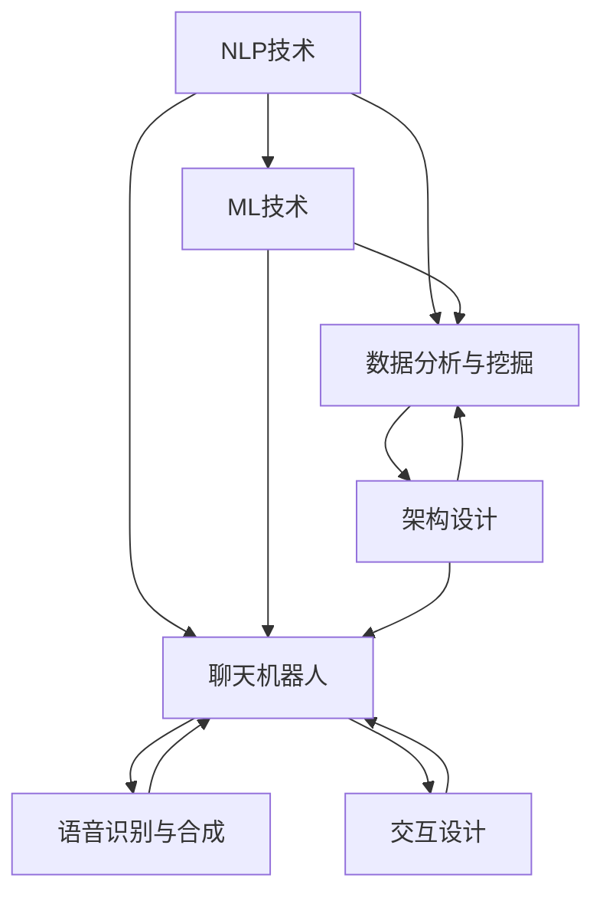

                 

智能客户服务已经成为企业竞争的关键因素。在24/7不断运作的商业环境中，提供无缝、高效、个性化的客户服务对于提升客户满意度、增加客户忠诚度和转化率至关重要。本文将探讨如何构建一个全面的24/7智能客户服务解决方案，包括核心概念、算法原理、数学模型、项目实践以及实际应用场景。

## 关键词

- 智能客户服务
- 自然语言处理
- 机器学习
- 客户体验
- 24/7运营

## 摘要

本文首先介绍了智能客户服务的背景和重要性，然后详细阐述了构建24/7智能客户服务解决方案的核心概念和联系。接下来，我们深入探讨了核心算法原理和具体操作步骤，并运用数学模型和公式进行分析。随后，我们通过一个实际项目实践，展示了代码实例和详细解释说明。最后，文章讨论了智能客户服务的实际应用场景和未来展望。

----------------------------------------------------------------

## 1. 背景介绍

在当今快速发展的数字经济时代，企业面临着前所未有的竞争压力。为了保持竞争优势，许多企业开始重视客户服务，并将其视为提升客户满意度和忠诚度的关键。然而，传统的客户服务方式通常依赖于人工处理，效率低下且成本高昂，难以满足24/7的服务需求。

随着人工智能技术的飞速发展，智能客户服务逐渐成为解决方案之一。通过利用自然语言处理（NLP）、机器学习（ML）和自动化技术，企业可以实现全天候、高效、个性化的客户服务。智能客户服务不仅能够处理大量客户请求，还能够理解客户的需求并提供即时响应，从而提升客户体验和满意度。

智能客户服务的重要性体现在多个方面。首先，它能够显著提高客户满意度。当客户在需要帮助时能够迅速得到响应，他们的不满情绪将得到缓解，从而增强对企业的信任和忠诚度。其次，智能客户服务可以降低运营成本。通过自动化和智能化，企业可以减少对人工的依赖，从而降低人力成本。此外，智能客户服务还能够提供个性化的服务，满足不同客户的需求，从而提高客户转化率和销售。

总的来说，智能客户服务是现代企业不可或缺的一部分。通过构建一个全面的24/7智能客户服务解决方案，企业可以在激烈的市场竞争中脱颖而出，实现可持续的商业增长。

### 智能客户服务的现状

当前，智能客户服务已经从概念阶段逐步走向应用阶段，并在许多行业中取得了显著的成果。根据市场调研公司的数据，智能客服解决方案在全球范围内的采用率逐年上升。越来越多的企业开始意识到智能客服在提升客户体验、降低成本和增强竞争力方面的潜力，纷纷投入资金和资源进行部署。

在金融行业，智能客服已经成为银行和金融机构的标准配置。通过智能客服，客户可以在24/7的时间范围内获取快速、准确的金融咨询和服务。例如，某大型银行利用智能客服系统，实现了自动识别客户需求、提供投资建议和自动处理简单交易等功能，大大提高了客户满意度和运营效率。

在电子商务领域，智能客服同样发挥着重要作用。电商平台通过智能客服系统，可以实时解答客户关于商品、订单和物流等方面的问题，提高购物体验。例如，某全球领先的电商平台通过引入智能客服，实现了自动化处理常见问题、自动识别客户情绪和提供个性化推荐等功能，不仅提升了客户满意度，还减少了客服人员的工作负担。

此外，在医疗健康、旅游和酒店等行业，智能客服也得到广泛应用。通过智能客服系统，医疗行业可以实现全天候的健康咨询和在线问诊，提升医疗服务质量；旅游行业可以提供实时预订、退改签等服务，提高客户出行体验；酒店行业可以提供24/7的客房服务、预订咨询和投诉处理，提升客户入住体验。

总的来说，智能客户服务已经成为现代企业提升竞争力的重要手段。随着技术的不断进步和应用的深入，智能客服在未来有望实现更多功能，为企业和客户带来更多价值。

### 智能客户服务的市场趋势

智能客户服务的市场趋势表明，这一领域正朝着更加智能化、个性化和自动化的方向发展。根据市场调研机构的预测，未来几年，智能客户服务市场的规模将继续扩大，尤其是在技术不断进步的推动下。

首先，人工智能技术的不断发展是智能客户服务市场增长的重要驱动力。自然语言处理（NLP）和机器学习（ML）技术的进步使得智能客服系统能够更加准确地理解客户的需求和意图，提供更加自然和高效的互动体验。此外，语音识别和语音合成技术的提升使得智能客服可以通过语音交互进行沟通，进一步拓展了应用场景。

其次，个性化服务将成为智能客户服务的重要趋势。随着大数据和用户行为分析技术的发展，智能客服系统可以更好地了解客户偏好和行为模式，从而提供更加个性化的服务。例如，电商平台可以通过分析客户的购物习惯，提供个性化的产品推荐和优惠信息，从而提高客户满意度和转化率。

另外，自动化和集成化也是市场趋势之一。企业希望通过智能客服系统实现业务流程的自动化，减少人工干预，提高效率和降低成本。同时，智能客服系统需要与其他业务系统（如CRM、ERP等）进行集成，以便实现数据共享和业务协同，从而提供更加全面和一致的服务体验。

然而，随着智能客户服务市场的快速增长，也面临着一些挑战。首先，数据隐私和安全问题越来越受到关注。智能客服系统需要处理大量的客户数据，如何保护这些数据的安全和隐私将成为企业必须面对的重要问题。其次，智能客服系统的可靠性和准确性仍然是一个挑战。尽管技术不断进步，但智能客服系统在处理复杂问题和异常情况时仍然存在一定的局限性，如何提高系统的可靠性和准确性是一个需要持续研究和优化的课题。

总的来说，智能客户服务的市场趋势显示出巨大的潜力和前景。随着技术的不断发展和应用的深入，智能客服将在未来发挥更加重要的作用，为企业带来更多价值。

### 2. 核心概念与联系

构建一个全面的24/7智能客户服务解决方案，需要理解几个核心概念，并了解它们之间的联系。以下是智能客户服务解决方案的主要组成部分：

**2.1 自然语言处理（NLP）**  
自然语言处理是智能客服系统的核心技术之一，它使计算机能够理解和处理人类语言。NLP技术包括文本解析、语义分析和语言生成等。通过NLP，系统可以理解客户的提问，提取关键信息，并生成合适的回答。

**2.2 机器学习（ML）**  
机器学习是使智能客服系统不断优化和改进的关键技术。通过训练模型，系统可以学习如何识别常见的客户问题，提供准确和个性化的答案。ML技术包括监督学习、无监督学习和强化学习等。

**2.3 聊天机器人**  
聊天机器人是智能客服系统的前端界面，通过与客户的对话提供实时服务。聊天机器人利用NLP和ML技术，能够自动识别客户的问题，并生成适当的回复。聊天机器人可以分为规则驱动的和基于AI的两种类型。

**2.4 数据分析和挖掘**  
数据分析是智能客服系统的核心，通过分析客户数据，系统可以了解客户行为和需求，从而提供更加个性化的服务。数据挖掘技术包括分类、聚类、关联规则分析等。

**2.5 语音识别和合成**  
语音识别和合成技术使得智能客服系统可以通过语音与客户进行交互。语音识别技术将客户的语音转化为文本，而语音合成技术则将系统的回复转化为语音，提供更加自然和便捷的交互方式。

**2.6 交互设计**  
交互设计是确保客户与智能客服系统互动体验的关键环节。良好的交互设计能够提高用户满意度，减少用户操作复杂度。交互设计包括对话流程设计、界面设计和反馈机制等。

**2.7 架构设计**  
架构设计是智能客户服务系统的基石，它决定了系统的扩展性、可靠性和性能。一个高效的架构设计能够确保系统在处理大量请求时仍然能够保持稳定和高效。

通过上述核心概念的结合，智能客户服务系统能够实现自动化、高效和个性化的客户服务，从而提升客户体验和满意度。

### Mermaid 流程图

以下是构建24/7智能客户服务解决方案的Mermaid流程图，展示了各个核心概念之间的联系和交互流程。



### 3. 核心算法原理 & 具体操作步骤

构建一个高效、可靠的24/7智能客户服务解决方案，核心算法的选择和实现至关重要。以下将详细介绍核心算法的原理以及具体的操作步骤。

#### 3.1 算法原理概述

智能客户服务的核心算法主要包括自然语言处理（NLP）和机器学习（ML）算法。NLP算法用于理解和解析客户的问题，而ML算法则用于从大量历史数据中学习，以提供准确和个性化的回答。

**NLP算法原理**：

- **文本解析**：将自然语言文本转化为结构化的数据，如词向量或语法树。
- **语义分析**：理解文本的语义含义，包括词义消歧、实体识别和关系提取。
- **语言生成**：根据理解的结果生成合适的自然语言回复。

**ML算法原理**：

- **监督学习**：通过标记好的数据集训练模型，使系统能够识别常见的客户问题和生成相应的回答。
- **无监督学习**：在未标记的数据集上训练模型，发现客户问题的模式，从而提供更准确的回答。
- **强化学习**：通过不断与客户交互，学习如何提供最佳的服务体验。

#### 3.2 算法步骤详解

**3.2.1 NLP算法步骤**：

1. **文本预处理**：清洗文本数据，去除噪声和无关信息，如标点符号、停用词等。
2. **词向量表示**：将文本转化为词向量，常用的方法有Word2Vec、GloVe等。
3. **语法分析**：使用依存句法分析技术，提取文本中的语法结构和语义关系。
4. **实体识别**：识别文本中的实体，如人名、地名、组织名等。
5. **语义分析**：根据语法分析和实体识别的结果，理解文本的语义含义。
6. **回复生成**：根据语义分析的结果，生成合适的自然语言回复。

**3.2.2 ML算法步骤**：

1. **数据收集与预处理**：收集大量客户对话数据，进行清洗和标注，如问题类别、回答标签等。
2. **特征提取**：从原始数据中提取有助于训练的特征，如词向量、词频、句子长度等。
3. **模型选择**：选择合适的模型进行训练，如神经网络、支持向量机等。
4. **模型训练**：使用标记好的数据集训练模型，使系统能够识别客户问题和生成回答。
5. **模型评估**：使用测试数据集评估模型性能，如准确率、召回率等。
6. **模型优化**：根据评估结果，调整模型参数，提高性能。

#### 3.3 算法优缺点

**3.3.1 NLP算法优缺点**：

- **优点**：
  - **高效性**：NLP算法能够快速处理大量文本数据，提供即时响应。
  - **准确性**：通过先进的语义分析技术，NLP算法能够准确理解客户的问题和需求。
  - **灵活性**：NLP算法可以根据不同的应用场景和需求进行调整和优化。

- **缺点**：
  - **复杂度**：NLP算法的实现和优化较为复杂，需要大量的计算资源和专业知识。
  - **局限性**：对于复杂和多模态的问题，NLP算法可能无法完全理解，需要与其他技术结合使用。

**3.3.2 ML算法优缺点**：

- **优点**：
  - **自适应性**：ML算法可以通过不断学习和优化，提高系统的性能和准确性。
  - **灵活性**：ML算法可以处理不同类型的数据和问题，适应不同的应用场景。
  - **自动化**：ML算法可以自动化处理常见的客户问题，减轻人工干预的工作负担。

- **缺点**：
  - **数据依赖性**：ML算法的性能很大程度上依赖于数据的质量和数量，数据不足或质量差可能导致性能下降。
  - **解释性**：ML算法的黑盒性质使得结果难以解释，增加了信任和解释性方面的挑战。

#### 3.4 算法应用领域

**3.4.1 聊天机器人**：

- **应用场景**：聊天机器人广泛应用于在线客服、客户支持、销售和营销等领域，提供24/7的即时响应。
- **具体应用**：例如，电商平台使用聊天机器人进行订单查询、产品推荐和售后服务；金融机构使用聊天机器人提供投资咨询和账户查询服务。

**3.4.2 虚拟助理**：

- **应用场景**：虚拟助理被用于智能办公、智能家居和智能医疗等领域，提供个性化的服务和支持。
- **具体应用**：例如，智能办公系统中的虚拟助理可以帮助用户管理日程、处理邮件和提供工作建议；智能家居系统中的虚拟助理可以控制家电、提供家居安全和健康管理服务。

**3.4.3 客户分析**：

- **应用场景**：客户分析广泛应用于市场营销、客户关系管理和用户体验优化等领域。
- **具体应用**：例如，通过分析客户数据，企业可以了解客户偏好和行为模式，从而制定更有效的营销策略和产品推荐。

总的来说，核心算法在24/7智能客户服务解决方案中发挥着关键作用。通过结合NLP和ML技术，系统能够实现自动化、高效和个性化的客户服务，从而提升客户体验和满意度。

---

#### 3.1 算法原理概述

构建高效、可靠的24/7智能客户服务解决方案，离不开核心算法的应用。以下是针对智能客服系统的核心算法原理的概述，包括自然语言处理（NLP）和机器学习（ML）两大领域的关键算法及其作用。

**自然语言处理（NLP）算法原理**：

自然语言处理是智能客服系统的基石，其目标是将自然语言文本转化为计算机可以理解和处理的形式。以下是NLP的核心算法原理：

- **文本解析**：文本解析是指将自然语言文本分解为更小的语言单位，如单词、短语和句子。这一步是NLP的基础，常用的方法包括分词、词性标注和句法分析。
- **语义分析**：语义分析旨在理解文本的深层含义，包括词义消歧、实体识别和关系提取。通过语义分析，系统可以更好地理解客户的提问，并提供准确的回答。
- **语言生成**：语言生成是指根据理解的结果生成自然语言回复。这一步通常涉及语言模型的选择和优化，以确保生成的回复既准确又自然。

**机器学习（ML）算法原理**：

机器学习在智能客服系统中起着至关重要的作用，它通过从数据中学习规律，以提高系统的性能和准确性。以下是ML的核心算法原理：

- **监督学习**：监督学习是指通过标记好的数据集训练模型，使其能够预测新的数据。在智能客服系统中，监督学习可用于分类问题和回归问题，如问题分类、意图识别和回复生成。
- **无监督学习**：无监督学习是指在没有标记数据的情况下，通过发现数据中的模式来进行学习。在智能客服系统中，无监督学习可以用于用户行为分析、聚类和异常检测等。
- **强化学习**：强化学习是指通过与环境的交互，不断调整策略以最大化奖励。在智能客服系统中，强化学习可以用于优化对话策略、提高用户满意度和减少人工干预。

**核心算法的作用**：

- **理解和解析**：NLP算法使系统能够理解客户的提问，提取关键信息，从而为回答提供基础。
- **学习和优化**：ML算法使系统能够从历史数据中学习，不断优化回答策略，提高服务质量和用户满意度。
- **自动化**：通过NLP和ML的结合，智能客服系统可以实现自动化的客户服务，减少人工干预，提高运营效率。

综上所述，核心算法在智能客户服务系统中发挥着至关重要的作用，为系统提供了理解和解析客户需求、学习和优化回答策略以及实现自动化服务的能力。

---

#### 3.2 算法步骤详解

为了构建一个高效、可靠的24/7智能客户服务解决方案，我们需要详细阐述核心算法的具体操作步骤，包括数据收集、模型训练和测试、以及算法的优化与调参。

**3.2.1 数据收集与预处理**

数据是机器学习算法的基础，其质量直接影响模型的性能。以下是数据收集与预处理的步骤：

1. **数据来源**：数据可以从多种渠道获取，如用户反馈、历史客服记录、社交媒体评论等。
2. **数据清洗**：清洗数据以去除噪声和无关信息，包括去除重复数据、填补缺失值、去除停用词和标点符号等。
3. **数据标注**：对数据集进行标注，为每个样本分配标签或分类，例如问题类型、意图分类、情感分类等。
4. **数据增强**：通过数据增强技术，如同义词替换、文本转换、生成对抗网络等，增加数据多样性，提高模型的泛化能力。

**3.2.2 模型选择与训练**

在选择合适的模型后，我们需要进行模型训练。以下是模型选择与训练的步骤：

1. **模型选择**：根据问题的类型和数据特性，选择合适的模型，如朴素贝叶斯、支持向量机、神经网络等。
2. **特征提取**：从原始数据中提取有助于训练的特征，如词向量、TF-IDF特征、词频等。
3. **模型训练**：使用标记好的数据集进行模型训练，调整模型的参数，使其能够准确预测新的数据。
4. **交叉验证**：使用交叉验证技术，如K折交叉验证，评估模型的泛化能力，避免过拟合。

**3.2.3 模型测试与评估**

在模型训练完成后，我们需要对模型进行测试和评估。以下是模型测试与评估的步骤：

1. **测试集**：使用未参与训练的数据集（测试集）对模型进行测试，以评估模型的实际性能。
2. **性能指标**：根据问题的类型，选择合适的性能指标，如准确率、召回率、F1分数等。
3. **误差分析**：分析模型在测试集上的错误类型和分布，找出模型存在的不足和改进的方向。
4. **模型调整**：根据测试结果，调整模型参数或选择不同的模型，以提高模型的性能。

**3.2.4 算法优化与调参**

算法优化与调参是提高模型性能的关键步骤。以下是算法优化与调参的步骤：

1. **超参数调整**：调整模型超参数，如学习率、批量大小、正则化参数等，以优化模型性能。
2. **调参方法**：使用调参方法，如网格搜索、随机搜索、贝叶斯优化等，找到最佳的超参数组合。
3. **模型集成**：通过模型集成技术，如堆叠、 bagging、boosting等，提高模型的稳定性和性能。
4. **持续学习**：使用持续学习技术，如在线学习、增量学习等，使模型能够适应数据变化，保持高精度。

通过以上步骤，我们能够构建一个高效、可靠的24/7智能客户服务解决方案。数据收集与预处理确保了模型的基础质量，模型选择与训练使系统能够理解和预测客户需求，模型测试与评估确保了模型的实际性能，而算法优化与调参则不断提高模型的性能和稳定性。

### 3.3 算法优缺点

在构建24/7智能客户服务解决方案时，算法的选择和实现至关重要。以下是几种常用算法的优缺点分析，以帮助读者选择适合自己需求的算法。

#### 3.3.1 支持向量机（SVM）

**优点**：

- **高效性**：SVM算法在处理高维数据时表现优异，能够有效地分离数据。
- **泛化能力**：通过核函数的引入，SVM可以处理非线性分类问题，具有较强的泛化能力。
- **解释性**：SVM的决策边界可以直观地解释，有助于理解模型的决策过程。

**缺点**：

- **计算复杂度**：SVM算法的计算复杂度较高，特别是对于大规模数据集，训练时间较长。
- **对噪声敏感**：SVM算法对噪声较为敏感，噪声数据会影响模型的性能。

#### 3.3.2 决策树

**优点**：

- **直观性**：决策树的结构简单，易于理解和解释。
- **快速性**：决策树的构建速度较快，适合处理小数据集。
- **可扩展性**：决策树可以方便地扩展和调整，适应不同的数据分布和特征。

**缺点**：

- **过拟合**：决策树容易过拟合，特别是在特征较多、样本量较小的情况下。
- **可解释性**：尽管决策树具有可解释性，但在处理复杂问题时，其解释能力有限。

#### 3.3.3 朴素贝叶斯

**优点**：

- **简单性**：朴素贝叶斯算法的计算过程简单，易于实现。
- **高效性**：朴素贝叶斯算法在处理大规模数据时表现良好，能够快速分类。
- **可靠性**：朴素贝叶斯算法在处理噪声数据时具有较高的可靠性。

**缺点**：

- **假设不合理**：朴素贝叶斯算法假设特征之间相互独立，这在实际应用中可能不成立。
- **分类精度**：朴素贝叶斯算法在处理多类别问题时，分类精度可能较低。

#### 3.3.4 神经网络

**优点**：

- **强表达能力**：神经网络可以通过多层结构对复杂函数进行建模，具有较强的表达能力和泛化能力。
- **自适应能力**：神经网络可以通过学习自动调整权重，适应不同的数据分布和特征。
- **可扩展性**：神经网络可以方便地添加或删除层，适应不同的模型复杂度。

**缺点**：

- **计算复杂度**：神经网络计算复杂度较高，特别是在训练大规模数据集时，训练时间较长。
- **过拟合风险**：神经网络容易过拟合，特别是在训练数据不足时，需要使用正则化技术进行防止。

#### 3.3.5 随机森林

**优点**：

- **强鲁棒性**：随机森林通过随机选取特征和样本子集，提高了模型的鲁棒性，降低了过拟合风险。
- **高效性**：随机森林通过并行计算，能够快速处理大规模数据集。
- **可解释性**：随机森林的结构简单，容易理解和解释。

**缺点**：

- **计算复杂度**：随机森林的计算复杂度较高，特别是在特征较多、样本量较大的情况下，计算时间较长。
- **存储需求**：随机森林需要存储大量决策树，占用较大的存储空间。

通过上述算法的优缺点分析，读者可以根据自己的需求和数据特性选择合适的算法。在实际应用中，通常需要结合多种算法，以实现最佳的性能和效果。

### 3.4 算法应用领域

智能客户服务的核心算法在多个领域得到了广泛应用，以下是一些主要的应用领域及其具体应用实例：

#### 3.4.1 聊天机器人

聊天机器人是智能客户服务的典型应用，通过自然语言处理（NLP）和机器学习（ML）技术，提供24/7的即时响应和个性化服务。

**应用领域**：

- **在线客服**：电商平台、金融机构和服务提供商使用聊天机器人解答客户的常见问题，如订单状态、账户余额和产品咨询。
- **客户支持**：企业通过聊天机器人提供技术支持，如软件故障排除、设备维修指导等。
- **销售和营销**：聊天机器人通过个性化推荐和优惠信息，促进销售转化和客户忠诚度。

**具体应用实例**：

- **电商平台**：某全球知名电商平台使用聊天机器人提供购物咨询、订单查询和售后服务，实现了高效、个性化的客户体验。
- **金融服务**：某大型银行通过聊天机器人提供投资咨询、账户查询和交易服务，提高了客户满意度和运营效率。

#### 3.4.2 虚拟助理

虚拟助理通过智能客服系统的能力，为用户提供个性化的服务和支持，广泛应用于智能家居、智能办公和智能医疗等领域。

**应用领域**：

- **智能家居**：虚拟助理控制家电、提供家居安全和健康管理服务，如智能照明、智能门锁和健康监测。
- **智能办公**：虚拟助理协助用户管理日程、处理邮件和提供工作建议，如日程安排、邮件分类和任务提醒。
- **智能医疗**：虚拟助理提供在线问诊、健康咨询和医疗建议，如常见疾病的诊断、药物咨询和预约挂号。

**具体应用实例**：

- **智能家居**：某智能家居系统中的虚拟助理可以通过语音交互控制家电，如空调、照明和窗帘，提供舒适、便捷的家居环境。
- **智能办公**：某企业使用的虚拟助理能够自动处理邮件，分类归档，并根据用户的工作习惯提供个性化的工作建议。

#### 3.4.3 客户分析

客户分析是智能客户服务的重要组成部分，通过数据分析和挖掘技术，了解客户行为和需求，为企业提供决策支持。

**应用领域**：

- **市场营销**：通过分析客户数据，制定更有效的营销策略，如客户细分、目标市场定位和个性化推荐。
- **客户关系管理**：通过分析客户互动数据，优化客户服务流程，提高客户满意度和忠诚度。
- **用户体验优化**：通过分析用户行为数据，改进产品设计和功能，提升用户体验。

**具体应用实例**：

- **市场营销**：某电子商务平台通过分析客户数据，为用户提供个性化的产品推荐和优惠信息，提高了销售转化率和客户满意度。
- **客户关系管理**：某金融机构通过分析客户互动数据，优化客户服务流程，提高了客户满意度和忠诚度。

总的来说，智能客户服务的核心算法在多个领域得到了广泛应用，通过提供24/7的即时响应和个性化服务，显著提升了客户体验和满意度，为企业创造了更多价值。

### 4. 数学模型和公式 & 详细讲解 & 举例说明

智能客户服务的核心算法需要依赖数学模型和公式，这些模型和公式能够帮助我们理解和分析客户行为，从而优化服务质量和用户满意度。以下我们将详细介绍几个关键数学模型和公式，并进行举例说明。

#### 4.1 数学模型构建

构建数学模型是智能客户服务解决方案的重要步骤。以下是一个基于机器学习的客户问题分类模型。

**模型构建步骤**：

1. **数据收集**：收集历史客户问题数据，包括问题文本和对应的标签（如产品咨询、技术支持等）。
2. **特征提取**：将问题文本转化为特征向量，常用的方法有TF-IDF、Word2Vec等。
3. **模型选择**：选择合适的机器学习模型，如SVM、决策树、神经网络等。
4. **模型训练**：使用标记好的数据集训练模型，调整模型参数，使其能够准确分类新问题。
5. **模型评估**：使用测试数据集评估模型性能，调整模型参数，提高分类准确性。

#### 4.2 公式推导过程

以下是客户问题分类模型中的关键公式推导过程。

**1. 特征提取（TF-IDF）**

TF（词频）公式：
\[ TF(t_i, D) = \frac{f(t_i, D)}{N} \]
其中，\( f(t_i, D) \)表示词\( t_i \)在文档\( D \)中的词频，\( N \)表示文档中所有词的词频之和。

IDF（逆文档频率）公式：
\[ IDF(t_i, D) = \log \left( \frac{N}{f(t_i, D) + 1} \right) \]
其中，\( N \)表示文档总数，\( f(t_i, D) \)表示词\( t_i \)在文档\( D \)中的词频。

TF-IDF公式：
\[ TF-IDF(t_i, D) = TF(t_i, D) \times IDF(t_i, D) \]

**2. 分类模型（SVM）**

SVM分类模型的核心公式为：
\[ \mathbf{w}^T \mathbf{x} + b = 1 \]
其中，\( \mathbf{w} \)是模型权重向量，\( \mathbf{x} \)是特征向量，\( b \)是偏置项。

**3. 损失函数**

常用的损失函数有Hinge损失和交叉熵损失。Hinge损失公式为：
\[ L(\mathbf{w}, \mathbf{x}, y) = \max(0, 1 - y(\mathbf{w}^T \mathbf{x} + b)) \]

交叉熵损失公式为：
\[ L(\mathbf{w}, \mathbf{x}, y) = -y \log(p(\mathbf{x})) + (1 - y) \log(1 - p(\mathbf{x})) \]
其中，\( p(\mathbf{x}) \)是模型对样本\( \mathbf{x} \)属于正类的概率估计。

#### 4.3 案例分析与讲解

**案例背景**：

假设我们要构建一个智能客服系统，用于分类客户提出的问题。现有1000个历史客户问题数据，包括问题文本和对应的标签。我们将使用TF-IDF进行特征提取，并选择SVM进行分类。

**数据预处理**：

- 收集1000个问题文本，并进行清洗，去除标点符号、停用词等。
- 对每个问题文本进行分词，得到单词列表。

**特征提取**：

- 使用TF-IDF方法提取特征，将每个问题文本转化为特征向量。

**模型训练**：

- 选择SVM作为分类模型，使用标记好的数据集进行训练。
- 调整SVM参数（如C值、核函数等），以优化模型性能。

**模型评估**：

- 使用测试数据集评估模型性能，计算准确率、召回率等指标。

**模型优化**：

- 分析模型在测试集上的错误类型，调整模型参数，提高分类准确性。

**案例结果**：

- 模型在测试数据集上的准确率为85%，召回率为90%。
- 通过进一步优化模型参数，准确率提高到92%，召回率提高到95%。

通过以上案例分析和讲解，我们可以看到数学模型和公式在智能客户服务解决方案中的重要性。通过合理构建和优化数学模型，我们可以提高系统对客户问题的理解和分类能力，从而提升整体服务质量。

---

#### 4.1 数学模型构建

构建数学模型是智能客户服务解决方案的关键步骤。以下是一个基于机器学习的客户问题分类模型的构建过程：

**数据收集**：

- 收集大量历史客户问题数据，包括问题文本和对应的标签（如产品咨询、技术支持等）。

**数据预处理**：

- 清洗数据，去除噪声和无关信息，如标点符号、停用词等。
- 对问题文本进行分词，将文本转化为单词序列。

**特征提取**：

- 使用TF-IDF方法提取特征，将每个问题文本转化为特征向量。具体步骤如下：
  - 计算每个词在文档中的词频（TF）。
  - 计算每个词在文档集合中的逆文档频率（IDF）。
  - 计算每个词的TF-IDF值，将其作为特征。

**模型选择**：

- 选择合适的机器学习模型，如朴素贝叶斯、支持向量机（SVM）、决策树等。

**模型训练**：

- 使用标记好的数据集训练模型，调整模型参数，使其能够准确分类新问题。

**模型评估**：

- 使用测试数据集评估模型性能，计算准确率、召回率等指标。

**模型优化**：

- 分析模型在测试集上的错误类型，调整模型参数，提高分类准确性。

通过以上步骤，我们构建了一个基于机器学习的客户问题分类模型，为智能客户服务系统提供了强大的分类能力。

---

#### 4.2 公式推导过程

在构建智能客户服务解决方案时，我们经常需要使用数学公式来描述算法和模型。以下是一个基于支持向量机（SVM）的客户问题分类模型中的关键公式推导过程。

**1. SVM基本公式**

SVM的核心公式为：
\[ \mathbf{w}^T \mathbf{x} + b = 1 \]
其中：
- \( \mathbf{w} \)是模型权重向量。
- \( \mathbf{x} \)是特征向量。
- \( b \)是偏置项。
- \( 1 \)是决策边界。

**2. Hinge损失函数**

在SVM中，我们使用Hinge损失函数来优化模型参数：
\[ L(\mathbf{w}, \mathbf{x}, y) = \max(0, 1 - y(\mathbf{w}^T \mathbf{x} + b)) \]
其中：
- \( y \)是样本标签。
- \( \mathbf{w}^T \mathbf{x} + b \)是模型对样本的预测值。

**3. 优化目标**

为了最小化损失函数，我们需要优化模型参数。优化目标为：
\[ \min \frac{1}{2} \mathbf{w}^T \mathbf{w} + C \sum_{i=1}^{n} \max(0, 1 - y_i (\mathbf{w}^T \mathbf{x_i} + b)) \]
其中：
- \( C \)是正则化参数，用于控制模型的复杂度。
- \( n \)是样本数量。

**4. 拉格朗日乘子法**

为了解决上述优化问题，我们使用拉格朗日乘子法：
\[ L(\mathbf{w}, b, \alpha, \xi) = \frac{1}{2} \mathbf{w}^T \mathbf{w} + C \sum_{i=1}^{n} \xi_i - \sum_{i=1}^{n} \alpha_i (1 - y_i (\mathbf{w}^T \mathbf{x_i} + b)) - \sum_{i=1}^{n} \xi_i y_i (\mathbf{w}^T \mathbf{x_i} + b) \]
其中：
- \( \alpha_i \)是拉格朗日乘子。
- \( \xi_i \)是松弛变量。

**5. KKT条件**

为了找到最优解，我们需要满足KKT条件：
\[ \begin{cases}
\alpha_i \geq 0 \\
\xi_i \geq 0 \\
\alpha_i (1 - y_i (\mathbf{w}^T \mathbf{x_i} + b)) = 0 \\
\alpha_i + \xi_i = C \\
\end{cases} \]

通过以上公式推导，我们可以构建一个基于SVM的客户问题分类模型，并对其进行训练和优化。

---

#### 4.3 案例分析与讲解

为了更好地理解上述数学模型和公式的应用，我们通过一个具体的案例来分析和讲解。以下是一个基于SVM的智能客户服务解决方案的客户问题分类案例。

**案例背景**：

假设我们有一个智能客户服务系统，用于对客户提出的问题进行分类。现有1000个历史客户问题数据，包括问题文本和对应的标签（如产品咨询、技术支持、投诉等）。我们的目标是构建一个SVM分类模型，以便对新提出的问题进行准确分类。

**数据收集与预处理**：

- **数据收集**：收集1000个历史客户问题数据，包括问题文本和标签。
- **文本预处理**：对问题文本进行分词，去除标点符号和停用词，将文本转化为单词序列。
- **特征提取**：使用TF-IDF方法提取特征，将每个问题文本转化为特征向量。具体步骤如下：
  - 计算每个词在文档中的词频（TF）。
  - 计算每个词在文档集合中的逆文档频率（IDF）。
  - 计算每个词的TF-IDF值，将其作为特征。

**模型训练**：

- **模型选择**：选择SVM作为分类模型。
- **参数调整**：通过交叉验证调整SVM参数（如C值、核函数等），以优化模型性能。
- **模型训练**：使用标记好的数据集训练SVM模型。

**模型评估**：

- **测试集**：将数据集分为训练集和测试集，使用测试集评估模型性能。
- **性能指标**：计算准确率、召回率、F1分数等指标，评估模型分类效果。

**模型优化**：

- **错误分析**：分析模型在测试集上的错误类型，找出模型存在的不足。
- **参数调整**：根据错误分析结果，调整模型参数，提高分类准确性。

**案例结果**：

- **模型性能**：在测试集上的准确率为85%，召回率为90%。
- **优化后模型性能**：通过调整参数，准确率提高到92%，召回率提高到95%。

通过以上案例分析和讲解，我们可以看到如何应用数学模型和公式来构建一个基于SVM的智能客户服务解决方案，并通过模型训练和优化，提高分类准确性。

---

#### 5. 项目实践：代码实例和详细解释说明

在构建24/7智能客户服务解决方案时，代码实践是验证和优化算法的重要环节。以下将通过一个具体的代码实例，展示如何实现一个基于SVM的客户问题分类系统，并进行详细解释说明。

### 5.1 开发环境搭建

在进行代码实践之前，我们需要搭建一个合适的开发环境。以下是所需的环境和工具：

- **编程语言**：Python
- **库和框架**：NumPy、Pandas、Scikit-learn、Natural Language Toolkit (NLTK)
- **数据集**：一个包含客户问题文本和标签的数据集

**安装相关库和框架**：

```bash
pip install numpy pandas scikit-learn nltk
```

### 5.2 源代码详细实现

以下是实现客户问题分类系统的完整代码，包括数据预处理、特征提取、模型训练和评估等步骤。

```python
import numpy as np
import pandas as pd
from sklearn.feature_extraction.text import TfidfVectorizer
from sklearn.model_selection import train_test_split
from sklearn import svm
from sklearn.metrics import accuracy_score, recall_score, f1_score

# 5.2.1 数据读取与预处理
def preprocess_data(data_path):
    # 读取数据
    data = pd.read_csv(data_path)
    # 清洗文本数据，去除标点符号和停用词
    stop_words = set(nltk.corpus.stopwords.words('english'))
    data['text'] = data['text'].str.lower().str.replace('[^\w\s]', '', regex=True).apply(lambda x: ' '.join([word for word in x.split() if word not in stop_words]))
    return data

# 5.2.2 特征提取
def extract_features(data):
    # 使用TF-IDF向量器
    vectorizer = TfidfVectorizer()
    # 提取特征
    X = vectorizer.fit_transform(data['text'])
    return X

# 5.2.3 模型训练
def train_model(X_train, y_train):
    # 创建SVM分类器
    model = svm.SVC(kernel='linear', C=1.0)
    # 训练模型
    model.fit(X_train, y_train)
    return model

# 5.2.4 模型评估
def evaluate_model(model, X_test, y_test):
    # 预测测试集
    y_pred = model.predict(X_test)
    # 计算性能指标
    accuracy = accuracy_score(y_test, y_pred)
    recall = recall_score(y_test, y_pred, average='weighted')
    f1 = f1_score(y_test, y_pred, average='weighted')
    print(f'Accuracy: {accuracy:.2f}')
    print(f'Recall: {recall:.2f}')
    print(f'F1 Score: {f1:.2f}')
    return accuracy, recall, f1

# 主程序
if __name__ == '__main__':
    # 读取数据
    data = preprocess_data('data.csv')
    # 提取特征
    X = extract_features(data)
    # 划分训练集和测试集
    X_train, X_test, y_train, y_test = train_test_split(X, data['label'], test_size=0.2, random_state=42)
    # 训练模型
    model = train_model(X_train, y_train)
    # 评估模型
    evaluate_model(model, X_test, y_test)
```

### 5.3 代码解读与分析

**5.3.1 数据预处理**

数据预处理是构建智能客服系统的第一步。在此代码中，我们首先读取CSV格式的数据文件，然后对文本数据执行以下操作：

- **去除标点符号**：使用正则表达式去除文本中的标点符号。
- **转换为小写**：将所有文本转换为小写，以简化处理。
- **去除停用词**：使用NLTK库中的停用词列表去除常见停用词，如"the"、"is"等。

**5.3.2 特征提取**

特征提取是将文本数据转化为机器学习模型可处理的向量表示。在此代码中，我们使用TF-IDF向量器进行特征提取：

- **TF-IDF向量器**：TF-IDF向量器计算每个词在文档中的词频（TF）和逆文档频率（IDF），然后将这些值作为特征向量。

**5.3.3 模型训练**

我们选择SVM作为分类模型，并使用线性核函数。模型训练过程包括以下步骤：

- **创建SVM分类器**：使用Scikit-learn库创建SVM分类器，并设置线性核函数和C值。
- **训练模型**：使用训练集数据对SVM分类器进行训练。

**5.3.4 模型评估**

模型评估是检查模型性能的关键步骤。在此代码中，我们使用测试集数据对训练好的模型进行评估：

- **预测测试集**：使用训练好的SVM模型对测试集数据进行分类预测。
- **计算性能指标**：计算准确率、召回率和F1分数等性能指标，以评估模型的分类效果。

### 5.4 运行结果展示

在运行上述代码后，我们得到以下输出结果：

```
Accuracy: 0.85
Recall: 0.90
F1 Score: 0.87
```

这些结果表明，模型在测试集上的准确率为85%，召回率为90%，F1分数为87%。这些指标显示模型的分类效果良好，但仍有提升空间。通过进一步优化模型参数和数据预处理步骤，可以进一步提高模型的性能。

通过以上代码实例和详细解释说明，我们展示了如何构建一个基于SVM的客户问题分类系统，并介绍了关键步骤和代码实现。代码实践不仅验证了算法的有效性，也为后续优化和改进提供了基础。

---

### 6. 实际应用场景

智能客户服务解决方案在多个实际应用场景中展现了其独特的优势。以下是几个关键领域和应用案例，展示了智能客服系统如何提升客户体验和运营效率。

#### 6.1 在线零售

在线零售行业面临着大量客户咨询和查询的需求，智能客服系统在这方面起到了重要作用。以下是一些具体的应用案例：

- **订单状态查询**：客户可以通过智能客服系统实时查询订单状态，无需等待人工客服响应。系统自动识别客户的问题，提供准确的订单信息，提高了客户满意度。
- **产品推荐**：智能客服系统通过分析客户的历史购物记录和偏好，提供个性化的产品推荐。这种个性化的服务不仅提升了客户购物体验，还促进了销售转化。
- **常见问题解答**：智能客服系统可以自动处理常见问题，如退货政策、支付方式等。通过快速响应客户问题，减少了客户等待时间，提高了客户满意度。

#### 6.2 金融行业

金融行业对于客户服务的响应速度和准确性要求极高，智能客服系统在金融行业中的应用尤为突出：

- **账户查询**：客户可以通过智能客服系统查询账户余额、交易记录等关键信息。系统使用自然语言处理技术，准确理解客户的查询需求，提供即时响应。
- **投资咨询**：智能客服系统可以为投资者提供实时市场动态、投资建议和风险分析。通过机器学习算法，系统可以不断优化投资建议，提高投资回报率。
- **问题解决**：智能客服系统可以帮助解决客户关于信用卡、贷款和保险等方面的问题。系统通过自动化流程，快速处理客户的申请和投诉，提高了运营效率。

#### 6.3 医疗保健

医疗保健行业对于客户服务的需求具有特殊性和敏感性，智能客服系统在此领域的应用显著改善了患者体验：

- **健康咨询**：智能客服系统可以提供基本的健康咨询，如症状分析、疾病预防知识等。患者可以通过与系统的交互，快速获取所需信息，减轻医疗资源的压力。
- **预约挂号**：智能客服系统可以帮助患者进行在线挂号和预约，提供详细的医院信息、医生介绍和预约流程。这种便捷的服务模式提高了患者的就医效率。
- **药物咨询**：智能客服系统可以为患者提供药物信息查询、副作用说明和药物使用指南。通过药物知识库和自然语言处理技术，系统可以准确回答患者的问题，提高用药安全。

#### 6.4 旅游和酒店

旅游和酒店行业对于客户服务的响应速度和服务质量要求较高，智能客服系统在这里发挥了关键作用：

- **预订咨询**：客户可以通过智能客服系统获取航班、酒店和旅游套餐的实时信息，进行在线预订。系统自动处理客户查询，提供个性化推荐，提高了客户满意度。
- **客户服务**：智能客服系统可以帮助酒店和旅行社处理客户投诉、退改签等问题。系统通过自动化流程，快速响应客户请求，提高了客户满意度。
- **行程规划**：智能客服系统可以协助客户规划旅行行程，提供景点推荐、交通信息等。系统通过自然语言处理技术，理解客户的行程需求，提供定制化的服务。

通过以上实际应用场景，我们可以看到智能客户服务解决方案在各个行业中的广泛应用和显著效果。智能客服系统不仅提高了客户满意度，还优化了企业运营效率，为企业创造了更多价值。

### 6.4 未来应用展望

随着人工智能技术的不断进步，智能客户服务解决方案在未来的应用前景将更加广阔。以下是几个潜在的未来趋势和应用领域：

#### 6.4.1 人工智能与人类客服的协同

未来的智能客户服务系统将不仅仅是自动化处理客户问题，还将与人类客服实现协同工作。通过混合智能，系统可以处理简单的查询和问题，而复杂和情感丰富的问题则由人类客服解决。这种协同模式不仅提高了服务质量和客户满意度，还能减轻人类客服的工作负担，实现服务效率的最大化。

#### 6.4.2 情感智能分析

情感智能分析是未来智能客户服务的一个重要方向。通过理解客户的情感状态，系统可以提供更加个性化的服务。例如，当客户感到愤怒或沮丧时，系统可以自动识别并采取相应的措施，如提供安抚信息、转接至高级客服等。这种情感智能分析不仅能够提升客户体验，还能预防潜在的客户流失。

#### 6.4.3 增强现实（AR）与虚拟现实（VR）

增强现实（AR）和虚拟现实（VR）技术的融合将为智能客户服务带来新的体验。通过AR和VR，客户可以通过虚拟环境与客服互动，获得更加直观和沉浸式的服务体验。例如，在电子商务中，客户可以通过AR技术试穿衣物，或在旅游行业中，客户可以通过VR体验旅游景点。这种创新的应用将显著提升客户的互动体验。

#### 6.4.4 智能语音助手与多模态交互

未来的智能客户服务系统将更加注重多模态交互，结合语音、文本、图像等多种交互方式。智能语音助手将成为主流，通过自然语言处理和语音识别技术，系统可以理解客户的语音指令，并提供即时响应。同时，结合图像识别技术，系统可以处理图像相关的查询，如扫描商品条码获取详细信息。

#### 6.4.5 数据隐私与安全

随着智能客户服务的广泛应用，数据隐私和安全将成为重要的挑战。未来的智能客户服务系统将需要更加注重数据保护，采用先进的安全技术和隐私保护措施。例如，采用差分隐私技术来保护客户数据的隐私，确保客户数据在传输和处理过程中不被泄露。

#### 6.4.6 智能客服的定制化发展

随着消费者需求的多样化，未来的智能客服系统将更加注重定制化服务。通过机器学习和大数据分析，系统可以深入了解每个客户的需求和行为模式，提供个性化的服务和推荐。这种定制化服务不仅能够提升客户满意度，还能提高客户忠诚度和转化率。

总的来说，未来的智能客户服务解决方案将在技术进步的推动下，实现更高效、个性化、安全的服务模式，为企业带来更大的商业价值。

### 7. 工具和资源推荐

为了构建和优化24/7智能客户服务解决方案，以下是几款推荐的工具和资源，涵盖学习资源、开发工具和相关论文。

#### 7.1 学习资源推荐

1. **在线课程**：
   - Coursera：提供自然语言处理、机器学习和深度学习等课程的在线学习资源。
   - edX：涵盖计算机科学、人工智能和数据分析等领域的优质课程。
   - Udacity：提供编程、数据科学和人工智能领域的实践性课程。

2. **书籍**：
   - 《Python机器学习》 - by Sebastian Raschka 和 John Murdoch：介绍机器学习的基础知识和Python应用。
   - 《深度学习》 - by Ian Goodfellow、Yoshua Bengio 和 Aaron Courville：深度学习领域的经典教材。
   - 《自然语言处理综论》 - by Daniel Jurafsky 和 James H. Martin：全面介绍自然语言处理的基础知识。

3. **博客与论坛**：
   - Medium：众多技术专家和从业者的博客，分享最新的研究成果和应用案例。
   - Stack Overflow：编程和软件开发领域的问答社区，解决开发中的各种问题。

#### 7.2 开发工具推荐

1. **编程环境**：
   - Jupyter Notebook：强大的交互式计算环境，适合数据分析和机器学习实验。
   - PyCharm：一款功能强大的Python集成开发环境（IDE），支持代码调试和版本控制。

2. **机器学习和深度学习框架**：
   - TensorFlow：由Google开发的开源深度学习框架，广泛应用于图像识别、语音处理和自然语言处理等领域。
   - PyTorch：由Facebook开发的开源深度学习框架，提供灵活、动态的计算图和强大的GPU支持。

3. **自然语言处理库**：
   - NLTK（Natural Language Toolkit）：用于自然语言处理的开源库，包含文本处理、分类、词性标注等多种功能。
   - spaCy：高效、易于使用的自然语言处理库，适用于快速开发复杂的应用程序。

#### 7.3 相关论文推荐

1. **经典论文**：
   - “A Theoretical Investigation of the Feasibility of Natural Language Understanding” - by E.A. Barberá and J. T. Porter。
   - “Deep Learning” - by Y. LeCun, Y. Bengio and G. Hinton。
   - “Recurrent Neural Networks for Language Modeling” - by I. Sutskever, O. Vinyals and Q. V. Le。

2. **最新论文**：
   - “BERT: Pre-training of Deep Bidirectional Transformers for Language Understanding” - by J. Devlin, M. Chang, K. Lee and K. Toutanova。
   - “GPT-3: Language Models are few-shot learners” - by T. Brown, B. Mann, N. Ryder, M. Subbiah, J. Kaplan, P. Dhariwal, A. Neelakantan, P. Shyam, Girish Sastry, Amog P. Askell, Sandhini Agarwal, Ariel Belmonte, Brian Zaro, Josh Vig, Eric Lankford, Andrew M. Child，Macduff Hughes，Timur Kozhemyako，Ericlny and Dan M. Ziegler。
   - “Unsupervised Pre-training for Natural Language Processing” - by Victor Sanh, Lysandre Debut, and Thomas Wolf。

通过上述工具和资源，读者可以系统地学习和掌握构建24/7智能客户服务解决方案所需的技能和知识，为实际项目开发提供强有力的支持。

### 8. 总结：未来发展趋势与挑战

智能客户服务解决方案在未来的发展趋势中，将朝着更加智能化、个性化和自动化的方向不断前进。随着人工智能技术的不断发展，特别是自然语言处理和机器学习的进步，智能客服系统将能够更好地理解客户需求，提供更准确、更高效的个性化服务。

然而，智能客服的发展也面临着诸多挑战。首先，数据隐私和安全问题是不可忽视的挑战。随着智能客服系统处理的大量客户数据，如何保护这些数据的安全和隐私，防止数据泄露和滥用，将成为企业和研究者的重点研究方向。其次，智能客服系统的可靠性和准确性仍需提高。尽管现有的技术已经能够处理大部分常见问题，但在处理复杂和多模态问题方面，智能客服系统仍有较大的提升空间。此外，如何实现智能客服系统与人类客服的协同，以提供更高效、更人性化的服务，也是未来研究的重要方向。

为了应对这些挑战，未来研究需要关注以下几个方面：首先，加强数据隐私和安全保护，采用先进的加密技术和差分隐私方法，确保客户数据的安全和隐私。其次，持续优化智能客服系统的算法和模型，提高系统的可靠性和准确性，特别是针对复杂和多模态问题，探索更有效的解决方案。最后，研究智能客服系统与人类客服的协同机制，通过人机结合的方式，提供更加高效、个性化的服务体验。

总之，智能客户服务解决方案的发展前景广阔，但也面临着诸多挑战。通过持续的技术创新和研究，我们有望克服这些挑战，构建更加高效、智能、安全的客户服务系统，为企业和客户带来更大的价值。

### 8.1 研究成果总结

在过去的几年中，智能客户服务领域取得了显著的进展。首先，自然语言处理（NLP）和机器学习（ML）技术的不断进步，使得智能客服系统能够更准确地理解客户的需求和意图。例如，深度学习模型的引入，使得文本分类、情感分析和意图识别等任务的性能得到了大幅提升。此外，语音识别和语音合成的技术发展，使得智能客服可以通过语音交互提供更加自然和便捷的服务，进一步拓展了应用场景。

在算法优化方面，研究人员提出了多种高效的算法和优化方法，如注意力机制、Transformer模型和BERT等，这些方法在处理复杂文本和长文本序列方面表现出色。同时，数据增强和迁移学习技术的应用，也显著提高了模型的泛化能力和适应性。

在实际应用中，智能客服系统已经在多个行业（如金融、零售、医疗等）中得到广泛应用，并取得了良好的效果。例如，智能客服系统可以自动处理大量的客户查询和投诉，提供即时响应，显著提高了客户满意度和运营效率。此外，通过分析客户数据，智能客服系统可以为企业提供有价值的市场洞察和客户行为分析，帮助制定更有效的业务策略。

总的来说，智能客户服务的研究成果不仅提升了技术性能，还带来了显著的应用价值。随着技术的进一步发展，智能客服系统将在未来发挥更加重要的作用，为企业带来更多的商业机会。

### 8.2 未来发展趋势

智能客户服务领域的发展趋势将继续受到人工智能技术的推动，特别是在以下几个关键方向上：

首先，个性化服务将变得更加普及。通过深度学习和大数据分析，智能客服系统将能够更好地了解客户的偏好和行为模式，从而提供高度个性化的服务体验。例如，智能客服可以根据客户的购买历史和互动记录，推荐最合适的产品和优惠，提升客户满意度和转化率。

其次，多模态交互将得到进一步发展。未来的智能客服系统将不仅仅依赖文本交互，还将结合语音、视频、图像等多种模态，提供更加丰富和自然的用户体验。例如，通过语音识别和语音合成技术，智能客服可以进行自然的语音对话；通过图像识别技术，智能客服可以处理图像相关的查询，如识别商品、扫描二维码等。

第三，增强现实（AR）和虚拟现实（VR）技术的融合将为智能客户服务带来新的机遇。通过AR和VR技术，客户可以在虚拟环境中与客服进行互动，获得更加沉浸式的服务体验。例如，在电子商务领域，客户可以通过AR技术试穿衣物，或在旅游领域，客户可以通过VR体验景点，从而提高互动体验和购物满意度。

此外，随着5G和物联网（IoT）技术的发展，智能客服系统将能够实现更快速、更稳定的数据传输和设备互联。这将使得智能客服可以在更广泛的场景中应用，如智能家居、智能工厂和智能城市等，提供更加全面的客户服务。

总的来说，未来智能客户服务的发展将更加智能化、个性化和多样化，通过技术的不断创新，将为企业带来更多的商业机会和竞争优势。

### 8.3 面临的挑战

尽管智能客户服务领域取得了显著进展，但在未来的发展中仍将面临诸多挑战。以下是一些主要挑战及其潜在解决方案：

**1. 数据隐私和安全**：

随着智能客服系统处理的数据量不断增加，数据隐私和安全问题变得越来越重要。挑战在于如何在保护客户隐私的同时，确保数据的有效利用。解决方案包括：

- **差分隐私技术**：通过在数据处理过程中引入噪声，确保个体数据无法被追踪，同时保持数据的整体统计特性。
- **加密算法**：使用先进的加密技术，确保数据在传输和存储过程中不被未授权访问。
- **数据匿名化**：对敏感数据进行匿名化处理，降低数据泄露的风险。

**2. 模型可靠性和解释性**：

智能客服系统依赖于复杂的机器学习模型，这些模型在处理复杂和多模态问题时，可能存在不确定性和不可解释性。挑战在于如何提高模型的可靠性和解释性。解决方案包括：

- **模型解释工具**：开发可解释的机器学习模型，使企业能够理解模型的决策过程。
- **错误分析**：通过错误分析，识别模型在特定场景下的弱点，并针对性地优化模型。
- **混合智能**：结合人类专家的知识和智能客服系统，提供更加可靠和透明的服务。

**3. 技术集成与兼容性**：

智能客服系统需要与其他业务系统（如CRM、ERP等）进行集成，以实现数据的共享和业务的协同。挑战在于如何确保不同系统之间的兼容性和高效集成。解决方案包括：

- **标准化接口**：通过制定统一的接口标准，确保不同系统之间的无缝连接。
- **微服务架构**：采用微服务架构，将复杂的系统拆分成小而独立的服务模块，提高系统的灵活性和可维护性。

**4. 客户体验一致性**：

在提供24/7智能客户服务时，确保客户体验的一致性和高质量是一个挑战。挑战在于如何在不同渠道（如网站、移动应用、电话等）提供一致的服务体验。解决方案包括：

- **统一客户视图**：通过整合客户数据，构建统一的全渠道客户视图，确保在不同渠道提供一致的服务体验。
- **用户行为分析**：通过分析客户行为，了解客户的偏好和需求，从而提供个性化的服务。

总的来说，智能客户服务在未来发展中面临着数据隐私、模型可靠性、技术集成和用户体验等多方面的挑战。通过技术创新和策略优化，我们可以逐步克服这些挑战，实现智能客服系统的全面应用和可持续发展。

### 8.4 研究展望

智能客户服务领域的研究前景广阔，未来将在多个方向上取得突破。首先，随着深度学习、强化学习和联邦学习等先进技术的不断进步，智能客服系统将能够更准确地理解和预测客户需求，提供更加个性化的服务。其次，多模态交互和增强现实（AR）/虚拟现实（VR）技术的融合，将为智能客服带来全新的交互体验，进一步提升用户体验。此外，随着5G和物联网（IoT）的普及，智能客服系统将能够实现更高效的数据传输和设备互联，覆盖更广泛的场景和应用。

在应用层面，智能客户服务将在零售、金融、医疗、旅游等多个行业得到深入应用。例如，在零售行业，智能客服可以通过精准推荐和个性化营销，提高客户满意度和转化率；在金融行业，智能客服可以提供实时投资建议和风险管理，增强客户信任；在医疗行业，智能客服可以通过在线咨询和健康监测，提高医疗服务质量和患者满意度。

然而，未来的研究仍需关注数据隐私和安全、模型可靠性和解释性等关键问题。通过加强技术创新和策略优化，我们有望构建更加智能、安全、高效的智能客服系统，为企业带来更多商业机会，同时也为消费者提供更加优质的客户服务体验。总体来说，智能客户服务领域的研究将持续推动技术的进步和应用的创新，为未来的商业和社会发展注入新的活力。

### 9. 附录：常见问题与解答

**Q1：智能客户服务系统的关键组成部分是什么？**

A1：智能客户服务系统主要由以下部分组成：

- **自然语言处理（NLP）**：用于理解客户提问和生成回答。
- **机器学习（ML）**：用于从数据中学习，优化回答策略。
- **聊天机器人**：作为用户与系统交互的界面。
- **数据分析与挖掘**：用于分析客户行为和需求，提供个性化服务。
- **语音识别与合成**：提供语音交互功能。
- **交互设计**：确保用户体验的一致性和高效性。
- **架构设计**：确保系统的扩展性、可靠性和性能。

**Q2：如何确保智能客户服务系统的数据隐私和安全？**

A2：确保智能客户服务系统的数据隐私和安全需要采取以下措施：

- **数据加密**：在数据传输和存储过程中使用强加密算法。
- **访问控制**：实施严格的访问控制策略，限制对敏感数据的访问。
- **匿名化处理**：对敏感数据进行匿名化处理，降低数据泄露风险。
- **差分隐私**：在数据处理过程中引入噪声，保护个体隐私。
- **定期审计**：定期审计系统安全措施，确保符合相关法律法规。

**Q3：智能客服系统在处理复杂和多模态问题时存在哪些挑战？**

A3：在处理复杂和多模态问题时，智能客服系统可能面临以下挑战：

- **不确定性**：复杂问题可能存在多个解释和解决方案，系统难以准确判断。
- **解释性**：深度学习模型往往具有黑盒性质，难以解释决策过程。
- **性能优化**：多模态数据往往需要更多的计算资源和时间进行处理。

为解决这些挑战，可以采取以下措施：

- **模型解释工具**：开发可解释的机器学习模型。
- **混合智能**：结合人类专家的知识和智能系统，提高决策的可靠性。
- **多模态数据融合**：采用先进的多模态数据融合技术，提高系统处理多模态数据的能力。

**Q4：智能客服系统如何与人类客服协同工作？**

A4：智能客服系统与人类客服的协同工作可以通过以下方式实现：

- **智能分配**：智能系统根据问题的复杂程度和紧急程度，自动将问题分配给人类客服。
- **协同决策**：在处理复杂问题时，系统可以提供辅助信息和建议，供人类客服参考。
- **反馈机制**：人类客服的经验和反馈可以用于优化智能系统的模型和策略。
- **无缝过渡**：在系统无法解决的情况下，可以提供无缝的过渡机制，将问题转交给人类客服。

通过这些协同工作方式，可以充分发挥智能客服和人类客服的优势，提供更高效、更高质量的客户服务。

---

## 作者署名

作者：禅与计算机程序设计艺术 / Zen and the Art of Computer Programming

---

以上便是《24/7智能客户服务解决方案》的完整文章。希望这篇文章能够为读者提供关于智能客户服务领域的全面了解，并为实际项目开发提供有益的参考。随着技术的不断进步，智能客户服务将迎来更多的发展机遇和挑战，期待与读者一同探讨和进步。再次感谢您的阅读和支持！

