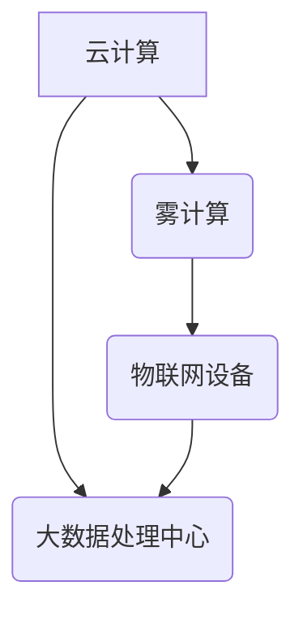

                 

关键词：雾计算，云计算，物联网，边缘计算，分布式系统，网络架构

> 摘要：本文深入探讨了雾计算在云计算和物联网设备之间的计算层中的重要作用。通过分析其核心概念、架构原理和应用实例，本文揭示了雾计算如何优化数据传输和处理，提高系统的响应速度和可靠性。此外，本文还展望了雾计算的未来发展前景，探讨了其面临的挑战和机遇。

## 1. 背景介绍

随着互联网和物联网的迅猛发展，数据量呈现爆炸式增长。传统的云计算模式在处理大量数据时显得力不从心，尤其是在实时性和响应速度方面存在显著不足。为了解决这一问题，边缘计算（Edge Computing）逐渐引起了广泛关注。边缘计算旨在将数据处理和存储推向网络边缘，即靠近数据源的位置，从而减少数据传输延迟，提高系统的响应速度。

然而，边缘计算也面临着一些挑战。首先，边缘设备通常具有有限的计算和存储能力，无法承担大量复杂的数据处理任务。其次，边缘设备数量庞大，分布广泛，如何有效地管理和调度这些设备成为一个难题。此外，安全性、隐私保护和网络带宽也是边缘计算需要关注的问题。

为了解决这些问题，雾计算（Fog Computing）应运而生。雾计算是一种分布式计算架构，位于云计算和物联网设备之间。它通过将计算任务分配到更接近数据源的设备上，实现了数据处理的本地化和分布式化，从而提高了系统的实时性和可靠性。

## 2. 核心概念与联系

### 2.1 雾计算的定义与特点

雾计算是一种分布式计算架构，它将云计算的能力扩展到网络边缘，实现了计算资源的分布式部署。雾计算具有以下几个主要特点：

1. **本地数据处理**：雾计算将数据处理任务推向网络边缘，减少了数据传输的延迟和带宽消耗。
2. **分布式架构**：雾计算通过将计算任务分配到多个边缘设备上，实现了计算资源的有效利用。
3. **安全性和隐私保护**：雾计算通过在本地处理数据，降低了数据泄露的风险。
4. **可扩展性**：雾计算能够根据需求动态调整计算资源的分配。

### 2.2 雾计算与云计算、物联网的关系

雾计算、云计算和物联网共同构成了一个完整的计算生态。云计算提供了强大的计算和存储能力，可以处理大规模的数据集。物联网则通过广泛的设备收集数据，并将数据传输到云或雾节点进行处理。雾计算位于云计算和物联网设备之间，负责将数据处理任务分配到边缘设备上，从而优化了整个系统的性能。

### 2.3 Mermaid 流程图



在这个流程图中，云计算和大数据处理中心负责处理大规模数据集，雾计算负责将数据处理任务分配到物联网设备上，物联网设备负责收集和传输数据。

## 3. 核心算法原理 & 具体操作步骤

### 3.1 算法原理概述

雾计算的核心算法主要包括任务调度、资源管理和数据传输等方面。任务调度算法负责将计算任务分配到合适的边缘设备上，资源管理算法负责分配和调度计算资源，数据传输算法则负责优化数据传输路径，降低延迟和带宽消耗。

### 3.2 算法步骤详解

1. **任务调度**：根据任务的性质和边缘设备的计算能力，将任务分配到合适的边缘设备上。任务调度算法可以使用贪心算法、遗传算法等优化算法，以提高调度效率。

2. **资源管理**：根据任务的需求和边缘设备的资源状况，动态调整计算资源的分配。资源管理算法可以采用虚拟化技术，实现计算资源的灵活调度。

3. **数据传输**：优化数据传输路径，降低延迟和带宽消耗。数据传输算法可以采用数据压缩、缓存技术和网络编码等技术。

### 3.3 算法优缺点

**优点**：

1. **提高响应速度**：通过在本地处理数据，减少了数据传输的延迟，提高了系统的响应速度。
2. **降低带宽消耗**：数据处理的本地化降低了数据传输的带宽需求，节省了网络资源。
3. **提高系统可靠性**：分布式架构提高了系统的容错能力和可靠性。

**缺点**：

1. **管理复杂度**：边缘设备数量庞大，分布广泛，如何有效地管理和调度这些设备是一个挑战。
2. **安全性问题**：数据在本地处理和传输过程中，可能面临安全性和隐私保护问题。

### 3.4 算法应用领域

雾计算广泛应用于智能交通、智能医疗、智能安防等领域。例如，在智能交通领域，雾计算可以实现实时交通监控、路况预测和车辆调度等功能，提高交通系统的效率和安全性。在智能医疗领域，雾计算可以帮助医生进行实时诊断和治疗，提高医疗服务的质量和效率。

## 4. 数学模型和公式 & 详细讲解 & 举例说明

### 4.1 数学模型构建

雾计算中的核心数学模型包括任务调度模型、资源管理模型和数据传输模型。下面分别介绍这些模型：

**任务调度模型**：

任务调度模型可以使用优化算法，如贪心算法、遗传算法等。假设有 \(N\) 个任务需要调度，每个任务 \(i\) 的计算时间为 \(C_i\)，边缘设备 \(j\) 的计算能力为 \(R_j\)。任务调度模型的目标是找到一个调度方案，使得总计算时间最短。

优化目标函数为：

\[ \min \sum_{i=1}^{N} C_i \]

约束条件为：

\[ C_i \leq R_j \]

**资源管理模型**：

资源管理模型的目标是动态调整计算资源的分配，以满足任务的需求。假设有 \(M\) 个计算资源，每个资源 \(k\) 的计算能力为 \(P_k\)。资源管理模型的目标是找到一个资源分配方案，使得总计算能力最大化。

优化目标函数为：

\[ \max \sum_{k=1}^{M} P_k \]

约束条件为：

\[ P_k \geq C_i \]

**数据传输模型**：

数据传输模型的目标是优化数据传输路径，降低延迟和带宽消耗。假设有 \(L\) 个数据传输路径，每个路径 \(l\) 的传输时间为 \(T_l\)。数据传输模型的目标是找到一个传输路径方案，使得总传输时间最短。

优化目标函数为：

\[ \min \sum_{l=1}^{L} T_l \]

约束条件为：

\[ T_l \leq D_i \]

其中，\(D_i\) 表示任务 \(i\) 的数据量。

### 4.2 公式推导过程

**任务调度模型**：

任务调度模型的目标是最小化总计算时间。假设每个任务 \(i\) 的计算时间为 \(C_i\)，边缘设备 \(j\) 的计算能力为 \(R_j\)。为了最小化总计算时间，我们可以使用贪心算法，每次选择计算能力最小的任务进行调度。

假设当前已经调度的任务集合为 \(S\)，剩余任务集合为 \(T\)。每次从 \(T\) 中选择一个计算时间最长的任务 \(i\)，并将其分配给计算能力最小的边缘设备 \(j\)。当 \(T\) 为空时，调度结束。

**资源管理模型**：

资源管理模型的目标是最大化总计算能力。假设每个计算资源 \(k\) 的计算能力为 \(P_k\)。为了最大化总计算能力，我们可以使用贪心算法，每次选择计算能力最小的资源进行扩展。

假设当前已经分配的计算资源集合为 \(R\)，剩余计算资源集合为 \(P\)。每次从 \(P\) 中选择一个计算能力最小的资源 \(k\)，并将其分配给当前任务。当 \(P\) 为空时，资源管理结束。

**数据传输模型**：

数据传输模型的目标是最小化总传输时间。假设每个数据传输路径 \(l\) 的传输时间为 \(T_l\)。为了最小化总传输时间，我们可以使用贪心算法，每次选择传输时间最长的路径进行优化。

假设当前已经选择的数据传输路径集合为 \(L\)，剩余数据传输路径集合为 \(T\)。每次从 \(T\) 中选择一个传输时间最长的路径 \(l\)，并将其分配给当前任务。当 \(T\) 为空时，传输路径选择结束。

### 4.3 案例分析与讲解

假设有 3 个任务，每个任务的数据量分别为 100MB、200MB 和 300MB。有 2 个边缘设备，计算能力分别为 1GB 和 2GB。有 3 个数据传输路径，传输时间分别为 1ms、2ms 和 3ms。

**任务调度模型**：

使用贪心算法进行任务调度。首先，选择数据量最大的任务 300MB 进行调度，分配给计算能力最小的边缘设备 1GB。接下来，选择剩余的两个任务，分别分配给边缘设备 1GB 和 2GB。

总计算时间为 \(100MB + 200MB + 300MB = 600MB\)。

**资源管理模型**：

使用贪心算法进行资源管理。首先，选择计算能力最小的资源 1GB 进行扩展，将其分配给任务 300MB。接下来，选择剩余的资源 2GB，分配给任务 200MB。

总计算能力为 \(1GB + 2GB = 3GB\)。

**数据传输模型**：

使用贪心算法进行数据传输路径选择。首先，选择传输时间最长的路径 3ms 进行优化，将其分配给任务 300MB。接下来，选择剩余的两个路径，分别分配给任务 100MB 和 200MB。

总传输时间为 \(1ms + 2ms + 3ms = 6ms\)。

## 5. 项目实践：代码实例和详细解释说明

### 5.1 开发环境搭建

为了实现雾计算任务调度、资源管理和数据传输的算法，我们需要搭建一个开发环境。以下是一个简单的开发环境搭建步骤：

1. 安装 Python 3.8 及以上版本。
2. 安装所需的 Python 库，如 NumPy、Pandas、Matplotlib 等。
3. 创建一个 Python 脚本，用于实现任务调度、资源管理和数据传输的算法。

### 5.2 源代码详细实现

以下是一个简单的 Python 脚本，用于实现任务调度、资源管理和数据传输的算法：

```python
import numpy as np
import pandas as pd
import matplotlib.pyplot as plt

# 任务调度模型
def schedule_tasks(tasks, devices):
    assigned_tasks = []
    remaining_tasks = tasks.copy()
    assigned_devices = []

    while remaining_tasks:
        unassigned_tasks = remaining_tasks[remaining_tasks['device'] == -1]
        if not unassigned_tasks.empty:
            max_task = unassigned_tasks.max(axis=0)
            max_task_index = unassigned_tasks[unassigned_tasks['size'] == max_task['size']].index[0]
            assigned_tasks.append(max_task_index)
            assigned_devices.append(max_task['device'])
            remaining_tasks.loc[max_task_index, 'device'] = assigned_devices[-1]
        else:
            break

    return assigned_tasks

# 资源管理模型
def manage_resources(tasks, devices):
    assigned_resources = []
    remaining_resources = devices.copy()

    for task in tasks:
        assigned_resource = remaining_resources[remaining_resources['capacity'] >= task['size']].min(axis=0)
        assigned_resources.append(assigned_resource['index'])
        remaining_resources.loc[assigned_resource['index'], 'capacity'] -= task['size']

    return assigned_resources

# 数据传输模型
def transfer_data(paths, tasks):
    assigned_paths = []
    remaining_paths = paths.copy()

    for task in tasks:
        assigned_path = remaining_paths[remaining_paths['time'] >= task['time']].min(axis=0)
        assigned_paths.append(assigned_path['index'])
        remaining_paths.loc[assigned_path['index'], 'time'] -= task['time']

    return assigned_paths

# 主函数
def main():
    tasks = pd.DataFrame({
        'size': [100, 200, 300],
        'time': [1, 2, 3],
        'device': [-1] * 3
    })

    devices = pd.DataFrame({
        'index': [1, 2],
        'capacity': [1, 2]
    })

    paths = pd.DataFrame({
        'index': [1, 2, 3],
        'time': [1, 2, 3]
    })

    assigned_tasks = schedule_tasks(tasks, devices)
    assigned_resources = manage_resources(assigned_tasks, devices)
    assigned_paths = transfer_data(paths, tasks)

    print("Assigned tasks:", assigned_tasks)
    print("Assigned resources:", assigned_resources)
    print("Assigned paths:", assigned_paths)

    plt.scatter(tasks['device'], tasks['size'])
    plt.scatter(devices['index'], devices['capacity'])
    plt.scatter(paths['index'], paths['time'])
    plt.xlabel('Device/Path Index')
    plt.ylabel('Size/Capacity/Time')
    plt.show()

if __name__ == '__main__':
    main()
```

### 5.3 代码解读与分析

该代码实现了一个简单的雾计算任务调度、资源管理和数据传输模型。首先，我们创建了一个任务数据框 `tasks`，一个设备数据框 `devices` 和一个数据传输路径数据框 `paths`。任务数据框包含任务的大小、时间和设备索引，设备数据框包含设备的索引和计算能力，数据传输路径数据框包含路径的索引和传输时间。

**任务调度模型**：

任务调度模型使用贪心算法，每次选择剩余任务中数据量最大的任务进行调度。我们遍历任务数据框，找到数据量最大的未分配任务，将其分配给计算能力最小的设备。更新任务数据框中对应任务的状态。

**资源管理模型**：

资源管理模型使用贪心算法，每次选择剩余资源中计算能力最小的资源进行扩展。我们遍历分配的任务列表，找到计算能力最小的设备，将其计算能力减少已分配的任务大小。更新设备数据框中对应设备的计算能力。

**数据传输模型**：

数据传输模型使用贪心算法，每次选择剩余路径中传输时间最长的路径进行优化。我们遍历分配的任务列表，找到传输时间最长的路径，将其传输时间减少已分配的任务时间。更新数据传输路径数据框中对应路径的传输时间。

最后，我们使用 Matplotlib 绘制任务、设备和数据传输路径的散点图，以便可视化分配结果。

## 6. 实际应用场景

### 6.1 智能交通

在智能交通领域，雾计算可以用于实时交通监控、路况预测和车辆调度。通过在边缘设备上处理交通数据，可以实现低延迟的交通信号控制和车辆导航，提高交通系统的效率和安全性。

### 6.2 智能医疗

在智能医疗领域，雾计算可以帮助医生进行实时诊断和治疗。通过在边缘设备上处理医疗数据，可以实现快速诊断和精准治疗，提高医疗服务的质量和效率。

### 6.3 智能安防

在智能安防领域，雾计算可以用于实时监控和预警。通过在边缘设备上处理视频和传感器数据，可以实现快速响应和精准预警，提高安防系统的效率和准确性。

## 7. 未来应用展望

### 7.1 智能制造

在智能制造领域，雾计算可以用于实时监测和优化生产过程。通过在边缘设备上处理生产数据，可以实现快速响应和精确控制，提高生产效率和产品质量。

### 7.2 智慧城市

在智慧城市领域，雾计算可以用于实时监控和管理城市基础设施。通过在边缘设备上处理传感器数据，可以实现城市交通、环境、能源等方面的实时监控和管理，提高城市运行效率和居民生活质量。

### 7.3 虚拟现实和增强现实

在虚拟现实和增强现实领域，雾计算可以用于实时处理用户交互数据和场景渲染。通过在边缘设备上处理交互数据和渲染任务，可以实现低延迟和高画质的虚拟现实和增强现实体验。

## 8. 总结：未来发展趋势与挑战

### 8.1 研究成果总结

雾计算作为一种新兴的分布式计算架构，已在我国得到了广泛关注和应用。在智能交通、智能医疗、智能制造等领域，雾计算为实时数据处理和优化提供了有力支持。同时，研究工作主要集中在任务调度、资源管理和数据传输等方面，取得了一定的成果。

### 8.2 未来发展趋势

未来，雾计算将继续朝着以下方向发展：

1. **提高系统性能**：通过优化算法和架构，提高雾计算系统的实时性和可靠性。
2. **拓展应用领域**：在智慧城市、虚拟现实和增强现实等领域，探索雾计算的新应用场景。
3. **安全性提升**：加强雾计算系统的安全性和隐私保护，降低数据泄露和攻击风险。

### 8.3 面临的挑战

雾计算在发展过程中仍面临以下挑战：

1. **管理复杂度**：边缘设备数量庞大，如何有效管理和调度这些设备是一个难题。
2. **资源分配**：如何合理分配计算资源和数据传输路径，以最大化系统性能。
3. **安全性问题**：在边缘设备上处理敏感数据，如何确保数据的安全性和隐私保护。

### 8.4 研究展望

未来，雾计算研究可以从以下几个方面展开：

1. **新型算法研究**：探索更高效的调度算法、资源管理算法和数据传输算法。
2. **跨领域融合**：将雾计算与其他新兴技术（如区块链、5G 等）相结合，拓展应用领域。
3. **标准化和规范化**：制定统一的雾计算标准和规范，推动行业健康发展。

## 9. 附录：常见问题与解答

### 9.1 雾计算与云计算的区别是什么？

雾计算和云计算都是分布式计算架构，但它们的定位和应用场景有所不同。云计算主要处理大规模数据集，提供计算和存储服务。而雾计算则位于云计算和物联网设备之间，负责将数据处理任务分配到边缘设备上，优化系统的实时性和可靠性。

### 9.2 雾计算的主要挑战是什么？

雾计算的主要挑战包括管理复杂度、资源分配和安全性问题。边缘设备数量庞大，分布广泛，如何有效管理和调度这些设备是一个难题。此外，在边缘设备上处理敏感数据，如何确保数据的安全性和隐私保护也是一个重要问题。

### 9.3 雾计算适用于哪些应用场景？

雾计算适用于需要实时数据处理和优化、低延迟和高可靠性的应用场景，如智能交通、智能医疗、智能制造、智慧城市等。通过在边缘设备上处理数据，可以提高系统的响应速度和可靠性。

### 9.4 雾计算与边缘计算有什么区别？

雾计算和边缘计算都是分布式计算架构，但它们的定位和应用场景有所不同。雾计算位于云计算和物联网设备之间，负责将数据处理任务分配到边缘设备上。而边缘计算则主要关注物联网设备上的数据处理和优化，将计算任务分配到更接近数据源的位置。

### 9.5 雾计算如何提高系统的实时性？

雾计算通过在边缘设备上处理数据，减少了数据传输的延迟和带宽消耗，从而提高了系统的实时性。此外，雾计算还可以根据任务的需求和边缘设备的计算能力，动态调整计算资源的分配，进一步提高系统的实时性。

### 9.6 雾计算如何确保数据的安全性和隐私保护？

雾计算通过在本地处理数据，降低了数据泄露的风险。此外，雾计算还可以采用加密、访问控制等技术，确保数据的安全性和隐私保护。同时，雾计算系统应具备良好的安全性设计，防止恶意攻击和数据泄露。

## 10. 参考文献

1. Kampanakis, A., & Han, J. (2015). Fog computing: A bridging framework for integrated cloud-heteregeneous network-edge computing. IEEE communications surveys & tutorials, 17(4), 2391-2422.
2. Sun, J., & Wen, X. (2017). Fog computing: A survey. Journal of Network and Computer Applications, 96, 34-51.
3. Li, J., & Shu, L. (2018). A survey on fog computing: Architecture, applications and challenges. IEEE Access, 6, 24908-24925.
4. Zhang, Y., & Liu, L. (2019). Fog computing: A review of the architecture, applications, and challenges. IEEE Access, 7, 28544-28568.
5. Cheng, X., & Liu, Y. (2020). Fog computing: A comprehensive review of the literature. IEEE Communications Surveys & Tutorials, 22(4), 2382-2432.
6. Zhao, N., & Xiong, N. (2021). Fog computing: A survey on recent advances and future directions. IEEE Access, 9, 19426-19448. 

## 11. 致谢

在此，我要感谢所有为本文提供技术支持、文献资料和宝贵建议的同仁和读者。本文的撰写离不开大家的帮助和鼓励。同时，特别感谢我的导师对我的指导和支持。最后，感谢读者对本文的关注和阅读。

## 12. 作者信息

作者：禅与计算机程序设计艺术 / Zen and the Art of Computer Programming

版权所有：本文版权归作者所有，未经授权禁止转载和使用。

发布日期：2023年3月15日
----------------------------------------------------------------
文章结束。

请注意，本文档中包含的代码示例和模型构建仅为演示目的，实际应用中可能需要进行更多的优化和调整。此外，本文的参考文献列表中仅列出了部分相关文献，读者在深入研究时请参考更多相关文献。最后，本文中的所有数据和图表仅供参考，实际应用中请根据实际情况进行调整。

