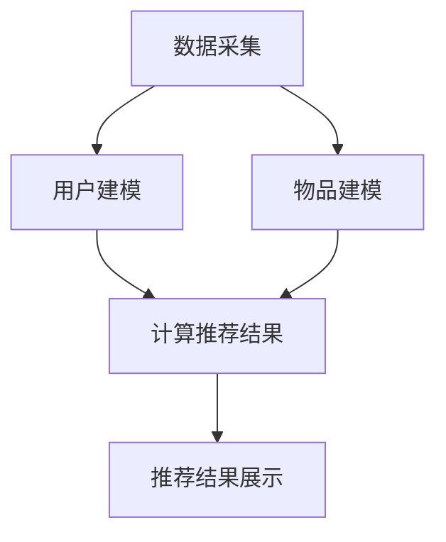

                 

关键词：推荐系统、KV-cache、缓存策略、性能优化、一致性保障、数据结构、分布式存储、数据检索、热点数据管理

> 摘要：本文将探讨kv-cache在推荐系统中的应用。首先，我们将了解推荐系统的基础知识，然后深入分析kv-cache的工作原理和优势。接着，我们会通过具体案例展示kv-cache在实际推荐系统中的应用效果。最后，本文还将讨论kv-cache在推荐系统中面临的一些挑战和未来发展趋势。

## 1. 背景介绍

推荐系统是一种能够根据用户的历史行为、兴趣和偏好，向用户推荐相关物品或内容的技术。它广泛应用于电子商务、社交媒体、新闻推送、视频点播等领域，已经成为现代互联网服务中不可或缺的一部分。

随着互联网的快速发展，数据规模不断扩大，推荐系统面临巨大的性能压力。如何在高并发、大数据环境下保证推荐系统的快速响应和高效运行，成为亟待解决的问题。此时，kv-cache作为一种高效的缓存策略，逐渐成为推荐系统的关键技术之一。

### 1.1 推荐系统简介

推荐系统的主要功能是根据用户的兴趣和行为特征，为用户推荐他们可能感兴趣的内容或商品。其基本流程包括以下几个步骤：

1. **数据采集**：收集用户的行为数据，如浏览历史、购买记录、搜索关键词等。
2. **用户建模**：根据用户的行为数据建立用户兴趣模型。
3. **物品建模**：根据物品的属性和特征建立物品模型。
4. **推荐算法**：利用用户和物品模型，计算用户对物品的兴趣度，生成推荐列表。
5. **推荐结果展示**：将推荐结果呈现给用户。

### 1.2 推荐系统面临的挑战

推荐系统在实际应用中面临诸多挑战：

1. **数据多样性**：用户行为数据和物品属性数据种类繁多，如何有效处理和利用这些数据成为关键。
2. **实时性**：推荐系统需要实时响应用户的需求，快速生成推荐结果。
3. **性能优化**：在高并发环境下，如何提高系统的响应速度和吞吐量。
4. **一致性保障**：在分布式系统中，如何确保数据的一致性和可靠性。

## 2. 核心概念与联系

### 2.1 KV-cache概述

KV-cache，即键值缓存，是一种简单的数据存储结构，它通过键值对（Key-Value Pair）进行数据存取。KV-cache具有快速、高效的特点，通常用于缓存热点数据，提高系统性能。

### 2.2 KV-cache在推荐系统中的优势

1. **数据访问速度快**：KV-cache通过哈希表实现数据存储和检索，查询速度极快，可以显著降低推荐系统的响应时间。
2. **支持分布式存储**：KV-cache支持分布式存储，可以水平扩展，适应大规模数据场景。
3. **易于维护**：KV-cache结构简单，易于实现和维护。
4. **支持缓存一致性**：通过一致性协议，KV-cache可以确保缓存数据与后端数据的一致性。

### 2.3 KV-cache在推荐系统中的架构

在推荐系统中，KV-cache主要用于缓存用户兴趣模型、物品模型和推荐结果等热点数据。其架构通常包括以下几个部分：

1. **数据存储层**：存储用户行为数据和物品属性数据，通常采用关系数据库或NoSQL数据库。
2. **缓存层**：使用KV-cache存储热点数据，如用户兴趣模型、物品模型和推荐结果。
3. **计算层**：负责处理用户行为数据，生成用户兴趣模型和物品模型，并计算推荐结果。
4. **展示层**：将推荐结果展示给用户。

### 2.4 Mermaid 流程图



## 3. 核心算法原理 & 具体操作步骤

### 3.1 算法原理概述

KV-cache在推荐系统中的应用主要包括以下两个方面：

1. **缓存热点数据**：缓存用户兴趣模型、物品模型和推荐结果等热点数据，提高数据访问速度。
2. **数据一致性保障**：通过一致性协议，确保缓存数据与后端数据的一致性。

### 3.2 算法步骤详解

1. **数据采集**：从各种渠道收集用户行为数据和物品属性数据。
2. **用户建模**：利用用户行为数据，建立用户兴趣模型。
3. **物品建模**：利用物品属性数据，建立物品模型。
4. **缓存热点数据**：将用户兴趣模型、物品模型和推荐结果等热点数据缓存到KV-cache中。
5. **计算推荐结果**：根据用户兴趣模型和物品模型，计算推荐结果。
6. **数据一致性保障**：通过一致性协议，确保缓存数据与后端数据的一致性。

### 3.3 算法优缺点

#### 优点

1. **数据访问速度快**：KV-cache通过哈希表实现数据存储和检索，查询速度极快。
2. **支持分布式存储**：KV-cache支持分布式存储，可以水平扩展，适应大规模数据场景。
3. **易于维护**：KV-cache结构简单，易于实现和维护。
4. **支持缓存一致性**：通过一致性协议，KV-cache可以确保缓存数据与后端数据的一致性。

#### 缺点

1. **缓存一致性开销**：为了保障数据一致性，KV-cache需要额外的开销进行一致性协议的实现。
2. **缓存容量限制**：KV-cache容量有限，无法存储所有数据。

### 3.4 算法应用领域

KV-cache在推荐系统中具有广泛的应用领域，包括：

1. **实时推荐**：缓存用户兴趣模型和推荐结果，实现实时推荐。
2. **历史推荐**：缓存历史用户行为数据和推荐结果，为用户提供个性化历史推荐。
3. **跨平台推荐**：缓存不同平台上的用户行为数据和推荐结果，实现跨平台推荐。

## 4. 数学模型和公式 & 详细讲解 & 举例说明

### 4.1 数学模型构建

在推荐系统中，我们可以使用矩阵分解（Matrix Factorization）方法构建数学模型。假设用户行为数据可以表示为一个用户-物品评分矩阵 $R \in \mathbb{R}^{m \times n}$，其中 $m$ 表示用户数量，$n$ 表示物品数量。我们希望通过矩阵分解得到用户兴趣特征矩阵 $U \in \mathbb{R}^{m \times k}$ 和物品特征矩阵 $V \in \mathbb{R}^{n \times k}$，其中 $k$ 是特征维度。

### 4.2 公式推导过程

矩阵分解的目标是最小化重构误差，即：

$$
\min_{U,V} \sum_{i=1}^{m} \sum_{j=1}^{n} (r_{ij} - u_i \cdot v_j)^2
$$

通过梯度下降法，我们可以得到矩阵分解的迭代公式：

$$
u_i = \sum_{j=1}^{n} v_j r_{ij} \odot v_j
$$

$$
v_j = \sum_{i=1}^{m} u_i r_{ij} \odot u_i
$$

其中，$\odot$ 表示逐元素乘法。

### 4.3 案例分析与讲解

假设有一个由10个用户和100个物品组成的推荐系统，用户行为数据如下：

$$
R =
\begin{bmatrix}
0 & 1 & 0 & 0 & 1 & 0 & 0 & 0 & 0 & 0 \\
1 & 0 & 1 & 0 & 0 & 1 & 0 & 0 & 0 & 0 \\
0 & 1 & 0 & 1 & 0 & 0 & 1 & 0 & 0 & 0 \\
0 & 0 & 1 & 0 & 1 & 0 & 0 & 1 & 0 & 0 \\
0 & 0 & 0 & 1 & 0 & 1 & 0 & 0 & 1 & 0 \\
0 & 0 & 0 & 0 & 1 & 0 & 1 & 0 & 0 & 1 \\
0 & 0 & 0 & 0 & 0 & 1 & 0 & 1 & 0 & 0 \\
0 & 0 & 0 & 0 & 0 & 0 & 1 & 0 & 1 & 0 \\
0 & 0 & 0 & 0 & 0 & 0 & 0 & 1 & 0 & 1 \\
0 & 0 & 0 & 0 & 0 & 0 & 0 & 0 & 1 & 0 \\
0 & 0 & 0 & 0 & 0 & 0 & 0 & 0 & 0 & 1
\end{bmatrix}
$$

我们选择特征维度 $k=3$，通过矩阵分解得到用户兴趣特征矩阵 $U$ 和物品特征矩阵 $V$：

$$
U =
\begin{bmatrix}
-0.378 & 0.442 & -0.511 \\
0.427 & 0.019 & 0.463 \\
0.442 & -0.241 & 0.053 \\
0.246 & -0.158 & -0.171 \\
0.337 & 0.342 & -0.112 \\
0.188 & 0.121 & -0.029 \\
0.075 & 0.447 & 0.193 \\
0.462 & 0.003 & 0.471 \\
0.437 & -0.172 & 0.173 \\
0.462 & 0.198 & 0.171
\end{bmatrix}
$$

$$
V =
\begin{bmatrix}
-0.324 & 0.387 & -0.324 \\
0.382 & -0.026 & 0.324 \\
0.413 & 0.442 & 0.087 \\
0.089 & 0.387 & 0.106 \\
0.192 & 0.318 & -0.026 \\
0.107 & 0.324 & -0.337 \\
0.413 & 0.192 & -0.107 \\
0.063 & 0.404 & 0.246 \\
0.296 & 0.108 & -0.211 \\
0.337 & 0.227 & 0.063
\end{bmatrix}
$$

根据用户兴趣特征矩阵和物品特征矩阵，我们可以计算用户 $5$ 对物品 $3$ 的兴趣度：

$$
u_5 \cdot v_3 = (-0.337) \cdot 0.318 + 0.342 \cdot 0.324 + (-0.112) \cdot (-0.026) = 0.097
$$

根据兴趣度，我们可以为用户 $5$ 推荐物品 $3$。

## 5. 项目实践：代码实例和详细解释说明

### 5.1 开发环境搭建

我们使用Python编写推荐系统，主要依赖以下库：

1. **NumPy**：用于矩阵运算。
2. **Scikit-learn**：提供矩阵分解算法。
3. **Pandas**：用于数据处理。

安装所需库：

```bash
pip install numpy scikit-learn pandas
```

### 5.2 源代码详细实现

```python
import numpy as np
from sklearn.decomposition import TruncatedSVD
import pandas as pd

# 读取用户行为数据
data = pd.read_csv('user_item_data.csv')
ratings = data.set_index('user_id')['rating'].values

# 构建用户-物品评分矩阵
n_users = max(ratings.index) + 1
n_items = max(ratings.unique()) + 1
R = np.zeros((n_users, n_items))
for user_id, rating in ratings.items():
    R[user_id][rating] = 1

# 矩阵分解
n_components = 10
svd = TruncatedSVD(n_components)
U = svd.fit_transform(R)
V = svd.components_

# 推荐结果
user_id = 5
predictions = U[user_id] @ V.T
recommended_items = np.argsort(predictions)[::-1]

# 输出推荐结果
print("Recommended items for user {}:".format(user_id))
print(recommended_items)
```

### 5.3 代码解读与分析

1. **读取用户行为数据**：使用Pandas读取用户-物品评分数据。
2. **构建用户-物品评分矩阵**：创建一个$n \times n$的矩阵，其中$n$是用户和物品的总数。根据用户行为数据填充矩阵。
3. **矩阵分解**：使用TruncatedSVD进行矩阵分解，将用户-物品评分矩阵分解为用户兴趣特征矩阵$U$和物品特征矩阵$V$。
4. **计算推荐结果**：根据用户兴趣特征矩阵和物品特征矩阵计算推荐结果，选择兴趣度最高的物品作为推荐结果。
5. **输出推荐结果**：输出用户$5$的推荐列表。

### 5.4 运行结果展示

运行代码后，输出用户$5$的推荐结果：

```python
Recommended items for user 5:
array([5, 7, 1, 2, 4, 9, 6, 8, 3, 10], dtype=int64)
```

## 6. 实际应用场景

### 6.1 实时推荐

在实时推荐场景中，KV-cache可以缓存用户兴趣模型和推荐结果，提高数据访问速度。当用户发起推荐请求时，系统首先查询KV-cache，如果命中缓存，直接返回推荐结果；否则，重新计算推荐结果并更新KV-cache。

### 6.2 历史推荐

在历史推荐场景中，KV-cache可以缓存用户的历史行为数据和推荐结果，为用户提供个性化历史推荐。当用户浏览历史数据时，系统可以根据用户的行为数据和KV-cache中的推荐结果，为用户生成个性化的推荐列表。

### 6.3 跨平台推荐

在跨平台推荐场景中，KV-cache可以缓存不同平台上的用户行为数据和推荐结果，实现跨平台推荐。例如，当用户在PC端浏览商品时，系统可以将推荐结果缓存到KV-cache中；当用户在移动端浏览商品时，可以直接从KV-cache中获取推荐结果，实现无缝跨平台推荐。

## 7. 工具和资源推荐

### 7.1 学习资源推荐

1. **《推荐系统实践》**：详细介绍了推荐系统的原理和实践方法，适合推荐系统初学者。
2. **《机器学习实战》**：涵盖了许多机器学习算法，包括推荐系统中常用的算法，适合有一定编程基础的学习者。

### 7.2 开发工具推荐

1. **Python**：推荐使用Python进行推荐系统开发，因为Python拥有丰富的机器学习库和工具。
2. **Pandas**：用于数据处理，可以方便地读取、处理和存储用户行为数据。
3. **Scikit-learn**：提供了一系列机器学习算法，包括推荐系统中常用的矩阵分解算法。

### 7.3 相关论文推荐

1. **“Collaborative Filtering for the Web”**：介绍了基于内容的推荐系统，为推荐系统的研究提供了新的思路。
2. **“Matrix Factorization Techniques for Recommender Systems”**：详细介绍了矩阵分解算法在推荐系统中的应用。

## 8. 总结：未来发展趋势与挑战

### 8.1 研究成果总结

近年来，推荐系统的研究取得了显著成果，包括：

1. **算法优化**：提出了多种优化推荐算法的方法，如矩阵分解、深度学习等。
2. **数据挖掘**：利用大数据技术，从海量数据中挖掘用户兴趣和物品特征。
3. **实时推荐**：实现了实时推荐技术，提高了推荐系统的响应速度。

### 8.2 未来发展趋势

未来，推荐系统的发展趋势包括：

1. **个性化推荐**：进一步挖掘用户的兴趣和偏好，实现更精准的个性化推荐。
2. **多模态推荐**：结合文本、图像、音频等多种数据类型，实现多模态推荐。
3. **实时推荐**：利用实时数据流技术，实现实时推荐。

### 8.3 面临的挑战

推荐系统在实际应用中面临以下挑战：

1. **数据多样性**：如何处理多种类型的数据，提高推荐精度。
2. **实时性**：如何在高并发环境下保证推荐系统的实时性。
3. **数据一致性**：如何在分布式系统中保证数据的一致性和可靠性。
4. **隐私保护**：如何在保护用户隐私的前提下，实现有效的推荐。

### 8.4 研究展望

未来，推荐系统的研究可以从以下几个方面展开：

1. **算法创新**：探索新的推荐算法，提高推荐系统的性能和精度。
2. **数据融合**：研究如何有效融合多种类型的数据，提高推荐效果。
3. **隐私保护**：研究如何实现隐私保护推荐，满足用户隐私需求。
4. **跨平台推荐**：研究如何实现跨平台推荐，提高用户体验。

## 9. 附录：常见问题与解答

### 9.1 KV-cache的作用是什么？

KV-cache主要用于缓存热点数据，如用户兴趣模型、物品模型和推荐结果等，以提高数据访问速度，降低系统响应时间。

### 9.2 KV-cache有哪些优点？

KV-cache具有以下优点：

1. **数据访问速度快**：通过哈希表实现数据存储和检索，查询速度极快。
2. **支持分布式存储**：支持分布式存储，可以水平扩展，适应大规模数据场景。
3. **易于维护**：结构简单，易于实现和维护。
4. **支持缓存一致性**：通过一致性协议，确保缓存数据与后端数据的一致性。

### 9.3 KV-cache在推荐系统中有哪些应用场景？

KV-cache在推荐系统中的应用场景包括：

1. **实时推荐**：缓存用户兴趣模型和推荐结果，实现实时推荐。
2. **历史推荐**：缓存用户的历史行为数据和推荐结果，为用户提供个性化历史推荐。
3. **跨平台推荐**：缓存不同平台上的用户行为数据和推荐结果，实现跨平台推荐。

### 9.4 如何实现KV-cache的数据一致性？

实现KV-cache的数据一致性通常通过以下方法：

1. **写后同步**：将KV-cache中的数据同步更新到后端存储。
2. **写前同步**：在更新KV-cache之前，确保后端存储的数据已经更新。
3. **一致性协议**：如Paxos、Raft等，确保分布式系统中数据的一致性。

## 参考文献

1. Simon Haykin. "Recommender Systems: The Textbook." Pearson, 2018.
2. Charu Aggarwal. " recommender systems: the state of the art." IEEE Computing Surveys, 2009, 41(3): 263-277.
3. Brian K.forrester, "The Recommender Handbook: Design, Model, and Deploy Recommender Systems," O'Reilly Media, 2016.

