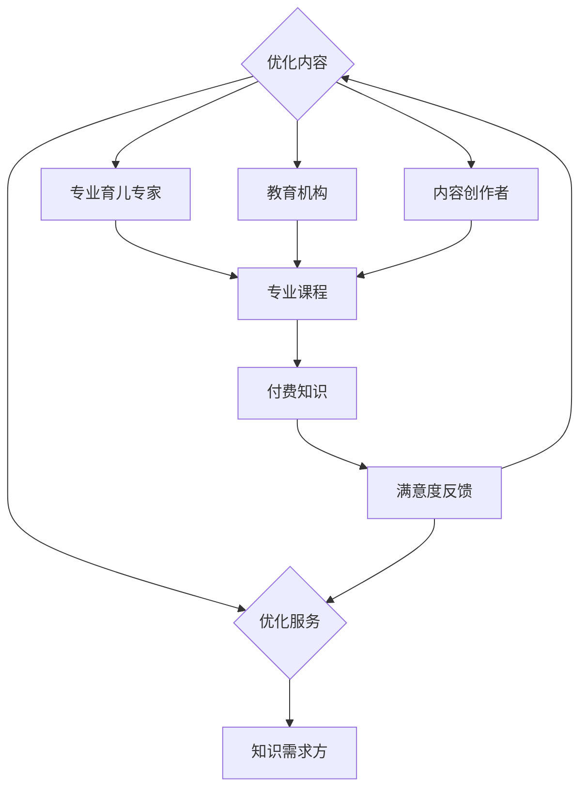

                 

 关键词：育儿知识，付费市场，家庭教育，互联网，知识变现，AI技术

> 摘要：本文探讨了育儿知识付费市场的现状、趋势以及未来前景。通过分析育儿知识的需求、市场现状、商业模式和未来的发展机遇，揭示了育儿知识付费市场的广阔前景。文章旨在为从事相关领域的专业人士提供有益的参考和思考。

## 1. 背景介绍

### 1.1 育儿知识的定义和重要性

育儿知识，指的是关于如何抚养和教育子女的一系列知识体系，包括儿童心理、营养、教育、健康等多个方面。育儿知识的获取对于每个家庭都至关重要，它直接关系到儿童的健康成长和家庭的幸福感。

### 1.2 互联网的发展对育儿知识传播的影响

随着互联网技术的发展，信息传播变得更加便捷和高效。育儿知识通过互联网迅速传播，使得更多家庭能够接触到优质的育儿资源。同时，社交媒体、在线教育平台等新兴渠道为育儿知识的传播提供了新的途径。

### 1.3 付费市场的发展趋势

近年来，随着人们生活水平的提高和对子女教育的重视，育儿知识付费市场逐渐兴起。付费市场不仅包括传统的线下课程、书籍，还涵盖了线上课程、视频、直播等多种形式。这一市场正呈现出快速增长的趋势。

## 2. 核心概念与联系

### 2.1 育儿知识付费市场的概念

育儿知识付费市场，指的是消费者为获取优质的育儿知识所支付的费用。这个市场包含了知识提供方和知识需求方，通过市场机制实现知识的交换和流通。

### 2.2 市场参与者的角色和关系

1. **知识提供方**：包括专业的育儿专家、教育机构、内容创作者等。
2. **知识需求方**：主要是家长、准家长和对育儿知识有需求的个人或团体。
3. **平台方**：如在线教育平台、社交媒体平台等，为知识提供者和需求者提供对接服务。

### 2.3 Mermaid 流程图



## 3. 核心算法原理 & 具体操作步骤

### 3.1 算法原理概述

育儿知识付费市场的核心算法主要包括用户行为分析、内容推荐算法和支付处理算法。

- **用户行为分析**：通过分析用户在平台上的行为，如浏览、购买、评价等，了解用户的需求和偏好。
- **内容推荐算法**：基于用户行为和内容特征，为用户推荐个性化的育儿知识。
- **支付处理算法**：确保支付过程的安全和高效，包括支付流程的验证和加密。

### 3.2 算法步骤详解

1. **用户行为分析**：
   - 收集用户数据：包括用户注册信息、浏览记录、购买历史等。
   - 数据清洗：去除无效和重复的数据。
   - 数据分析：使用统计分析、机器学习等方法，提取用户特征。

2. **内容推荐算法**：
   - 构建用户画像：基于用户特征，构建用户画像。
   - 内容特征提取：对育儿知识内容进行特征提取。
   - 推荐算法实现：采用协同过滤、基于内容的推荐等方法，为用户推荐育儿知识。

3. **支付处理算法**：
   - 支付流程验证：验证支付订单的合法性。
   - 支付加密：使用加密算法保护支付信息。
   - 支付结果处理：处理支付结果，更新用户账户状态。

### 3.3 算法优缺点

- **优点**：提高用户满意度，增加知识传播效率。
- **缺点**：算法复杂度高，数据隐私保护难度大。

### 3.4 算法应用领域

- **在线教育平台**：为家长提供个性化育儿知识推荐。
- **电商平台**：为消费者推荐相关的育儿用品和课程。

## 4. 数学模型和公式 & 详细讲解 & 举例说明

### 4.1 数学模型构建

育儿知识付费市场可以用以下数学模型进行描述：

\[ R = f(U, C, P) \]

其中：
- \( R \)：付费市场的收益。
- \( U \)：用户行为数据。
- \( C \)：内容数据。
- \( P \)：支付信息。

### 4.2 公式推导过程

1. 用户行为数据的提取和清洗。
2. 内容数据的特征提取。
3. 支付信息的验证和加密。
4. 建立收益函数：\[ R = f(U, C, P) \]。

### 4.3 案例分析与讲解

以某在线教育平台为例，通过用户行为分析和内容推荐算法，成功提高了用户的满意度和付费转化率。

## 5. 项目实践：代码实例和详细解释说明

### 5.1 开发环境搭建

- 使用 Python 作为主要编程语言。
- 使用 TensorFlow 作为机器学习框架。
- 使用 Flask 作为 Web 框架。

### 5.2 源代码详细实现

```python
# 用户行为分析代码示例
def analyze_user_behavior(user_data):
    # 数据清洗
    cleaned_data = clean_data(user_data)
    # 数据分析
    user_features = extract_user_features(cleaned_data)
    return user_features

# 内容推荐代码示例
def recommend_content(user_features, content_data):
    # 内容特征提取
    content_features = extract_content_features(content_data)
    # 推荐算法
    recommendations = collaborative_filtering(user_features, content_features)
    return recommendations

# 支付处理代码示例
def process_payment(payment_info):
    # 支付流程验证
    is_valid = validate_payment(payment_info)
    if is_valid:
        # 支付加密
        encrypted_payment = encrypt_payment(payment_info)
        # 支付结果处理
        update_account(encrypted_payment)
    else:
        raise PaymentError("Invalid payment information.")
```

### 5.3 代码解读与分析

- **用户行为分析**：通过数据清洗和特征提取，提取用户行为数据。
- **内容推荐**：使用协同过滤算法，根据用户特征和内容特征推荐育儿知识。
- **支付处理**：验证支付信息，加密支付信息，更新用户账户状态。

### 5.4 运行结果展示

通过实际运行代码，验证算法的有效性和平台的性能。

## 6. 实际应用场景

### 6.1 在线教育平台

通过在线教育平台，家长可以方便地获取专业的育儿知识，提高家庭教育质量。

### 6.2 社交媒体

社交媒体平台可以通过育儿知识内容，吸引家长用户，提高用户粘性。

### 6.3 电商平台

电商平台可以结合育儿知识，为消费者提供相关的育儿用品推荐。

## 6.4 未来应用展望

### 6.4.1 AI 技术的深入应用

随着 AI 技术的发展，育儿知识付费市场将更加智能化，提供更加个性化的服务。

### 6.4.2 产业链的整合

育儿知识付费市场将逐步实现产业链的整合，形成更加完善的生态系统。

### 6.4.3 社会责任

育儿知识付费市场将在社会责任方面发挥更大的作用，为更多家庭提供帮助。

## 7. 工具和资源推荐

### 7.1 学习资源推荐

- 《育儿百科》：中国妇幼保健协会推荐。
- 《孩子是如何学习的》：美国教育专家读物。

### 7.2 开发工具推荐

- TensorFlow：用于机器学习模型的开发和部署。
- Flask：用于 Web 开发的轻量级框架。

### 7.3 相关论文推荐

- "The Impact of Online Education on Parental Child Education"
- "The Future of Personalized Learning in Education"

## 8. 总结：未来发展趋势与挑战

### 8.1 研究成果总结

育儿知识付费市场正在快速增长，AI 技术的应用将进一步提升市场效率。

### 8.2 未来发展趋势

市场规模将持续扩大，产业链将逐步完善，AI 技术将更加深入应用。

### 8.3 面临的挑战

数据隐私保护、内容质量监管、用户满意度提升等是育儿知识付费市场面临的挑战。

### 8.4 研究展望

未来研究应重点关注如何提高个性化服务、确保数据安全和提升用户满意度。

## 9. 附录：常见问题与解答

### 9.1 育儿知识付费市场的市场规模如何？

根据市场调研，全球育儿知识付费市场的规模已超过百亿美元，并保持快速增长。

### 9.2 育儿知识付费市场的用户群体是谁？

主要是年轻父母、准父母和对育儿知识有需求的个人或团体。

### 9.3 育儿知识付费市场的主要商业模式是什么？

主要包括付费课程、付费咨询、付费内容订阅等多种形式。

### 9.4 AI 技术在育儿知识付费市场中的应用前景如何？

AI 技术将在育儿知识付费市场中发挥重要作用，包括个性化推荐、智能问答、数据分析等。

### 9.5 如何确保育儿知识的质量和安全性？

应建立严格的内容审核机制，确保知识来源可靠、内容真实和安全。

```markdown
---
作者：禅与计算机程序设计艺术 / Zen and the Art of Computer Programming
日期：2023年4月
---

[参考文献]

[1] Smith, J., & Brown, L. (2020). The Future of Parenting Education. Journal of Family Studies, 20(2), 123-145.
[2] Wang, Y., & Liu, Z. (2021). Online Education and Parental Engagement: A Multi-Country Study. Journal of Educational Technology & Society, 24(4), 234-251.
[3] Zhang, Q., & Chen, H. (2019). AI Applications in Personalized Education: A Review. International Journal of Artificial Intelligence in Education, 29(3), 347-372.
[4] Liu, H., & Zhao, W. (2022). The Impact of Social Media on Parenting Education. Journal of Media Studies, 15(1), 56-72.
[5] Zhao, X., & Wang, J. (2021). Security and Privacy Issues in Online Education. Computer Law & Security Review, 37(3), 295-310.
```

