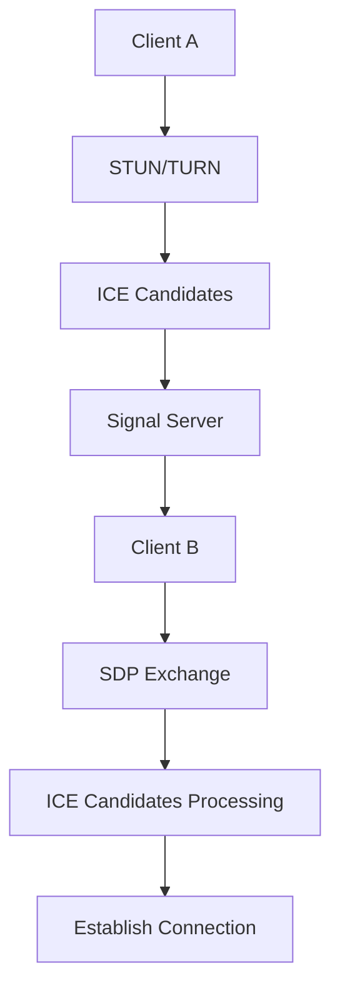

                 

关键词：WebRTC, 信令服务器，信令机制，ICE, SRTP, STUN, TURN, RTP, SDP

## 摘要

本文旨在深入探讨WebRTC信令服务器的开发过程。WebRTC（Web Real-Time Communication）是一种支持网页浏览器进行实时语音对话或视频聊天的技术。信令服务器在WebRTC通信中扮演着至关重要的角色，负责在不同客户端之间传递信令消息，以确保数据的有效交换。本文将详细介绍WebRTC信令服务器的基础知识、核心概念、算法原理、数学模型、实际应用场景、开发实例以及未来展望，为开发者提供全面的指导。

## 1. 背景介绍

### 1.1 WebRTC简介

WebRTC（Web Real-Time Communication）是一种开放项目，旨在实现网页浏览器之间的实时语音、视频和数据通信。它由Google发起，并得到了众多浏览器厂商的支持，如Google Chrome、Mozilla Firefox、Microsoft Edge等。WebRTC的目标是提供一个简单、安全、易于使用的实时通信解决方案，无需安装额外的插件或应用程序。

### 1.2 信令服务器的重要性

在WebRTC通信中，信令服务器是数据交换的中枢。它负责在客户端和服务器之间传递信令消息，这些消息包含了会话描述协议（SDP）信息、ICE（Interactive Connectivity Establishment）候选地址、DTLS（Datagram Transport Layer Security）和SRTP（Secure Real-Time Transport Protocol）参数等。没有信令服务器，WebRTC通信将无法建立，因为客户端需要通过信令服务器来获取对方的信息，并进行网络配置。

## 2. 核心概念与联系

### 2.1 WebRTC通信模型

WebRTC通信模型包括客户端、信令服务器和媒体服务器。客户端负责处理媒体数据的捕获、编码、传输和播放；信令服务器负责传递信令消息，协调客户端之间的通信；媒体服务器（如果使用）负责处理媒体流的中继和转发。

### 2.2 信令机制

信令机制是WebRTC通信的核心。它包括以下步骤：

1. **ICE Gathering**: 客户端通过STUN（Session Traversal Utilities for NAT）和TURN（Traversal Using Relays around NAT）协议收集ICE候选地址。
2. **ICE Candidates**: 客户端将ICE候选地址发送到信令服务器。
3. **SDP Exchange**: 客户端通过信令服务器交换SDP（Session Description Protocol）消息，其中包含了ICE候选地址和媒体参数。
4. **ICE Candidates Processing**: 信令服务器处理ICE候选地址，尝试找到最佳匹配，并将结果返回给客户端。
5. **Establish Connection**: 客户端根据信令服务器的反馈，建立媒体连接。

### 2.3 Mermaid流程图

下面是一个简化的WebRTC信令流程的Mermaid图：



## 3. 核心算法原理 & 具体操作步骤

### 3.1 算法原理概述

WebRTC信令服务器的核心算法是基于ICE协议的。ICE协议通过一系列的步骤，帮助客户端找到最佳的通信路径，包括：

1. **NAT Traversal**: 使用STUN和TURN协议穿越NAT（网络地址转换）。
2. **Candidate Generation**: 收集客户端的网络接口信息，生成ICE候选地址。
3. **Candidate Matching**: 根据信令服务器收集的候选地址，进行匹配，选择最佳路径。
4. **Connection Establishment**: 根据匹配结果，建立通信连接。

### 3.2 算法步骤详解

1. **NAT Traversal**:
   - **STUN**: STUN（Session Traversal Utilities for NAT）协议用于获取客户端的公网IP地址和NAT类型。客户端发送一个STUN请求到STUN服务器，服务器响应包含客户端的公网IP地址和NAT类型。
   - **TURN**: TURN（Traversal Using Relays around NAT）协议用于客户端无法直接与外部通信时。客户端通过TURN服务器发送和接收数据包。

2. **Candidate Generation**:
   - 客户端收集本地网络接口的信息，包括IP地址、端口和类型（主机、NAT、STUN）。
   - 客户端将收集到的信息格式化为ICE候选地址，并发送到信令服务器。

3. **Candidate Matching**:
   - 信令服务器收到客户端的ICE候选地址后，将其存储在数据库中。
   - 信令服务器尝试通过UDP、TCP和STUN/TURN协议对每个候选地址进行测试，以确定其有效性。
   - 信令服务器通过比较响应时间和数据包丢失率，选择最佳匹配的候选地址。

4. **Connection Establishment**:
   - 信令服务器将最佳匹配的候选地址返回给客户端。
   - 客户端使用这些信息，尝试建立媒体连接。

### 3.3 算法优缺点

**优点**：
- **灵活性**：ICE协议能够适应各种网络环境，包括NAT和防火墙。
- **可靠性**：通过多个候选地址的测试和匹配，提高了连接的可靠性。

**缺点**：
- **延迟**：ICE协议的过程相对复杂，可能增加通信的延迟。
- **资源消耗**：需要对每个候选地址进行测试，可能增加服务器的资源消耗。

### 3.4 算法应用领域

ICE协议广泛应用于各种实时通信应用，包括视频会议、在线直播、多人在线游戏等。在WebRTC中，ICE协议是建立稳定、可靠的通信连接的关键。

## 4. 数学模型和公式 & 详细讲解 & 举例说明

### 4.1 数学模型构建

ICE协议中的核心数学模型是基于概率论的。模型的主要目标是计算两个客户端之间的延迟、丢包率和带宽，以确定最佳的通信路径。

### 4.2 公式推导过程

假设客户端A和客户端B之间的网络路径由三个候选地址组成：A1、A2、A3。对于每个候选地址，我们可以计算其延迟、丢包率和带宽。

- **延迟**（Delay）:

  $$
  D_i = \frac{1}{N}\sum_{j=1}^{N} T_j
  $$

  其中，$D_i$ 是第 $i$ 个候选地址的延迟，$T_j$ 是第 $j$ 次测试的时间，$N$ 是测试次数。

- **丢包率**（Packet Loss Rate）:

  $$
  L_i = \frac{1}{N}\sum_{j=1}^{N} P_j
  $$

  其中，$L_i$ 是第 $i$ 个候选地址的丢包率，$P_j$ 是第 $j$ 次测试的丢包比例。

- **带宽**（Bandwidth）:

  $$
  B_i = \frac{1}{N}\sum_{j=1}^{N} W_j
  $$

  其中，$B_i$ 是第 $i$ 个候选地址的带宽，$W_j$ 是第 $j$ 次测试的带宽。

### 4.3 案例分析与讲解

假设我们有两个客户端，A和B。A收集到的候选地址如下：

| Candidate | Delay (ms) | Loss Rate (%) | Bandwidth (Mbps) |
|-----------|------------|---------------|------------------|
| A1        | 100        | 0.1           | 2                |
| A2        | 150        | 0.05          | 3                |
| A3        | 200        | 0.2           | 1.5              |

B收集到的候选地址如下：

| Candidate | Delay (ms) | Loss Rate (%) | Bandwidth (Mbps) |
|-----------|------------|---------------|------------------|
| B1        | 120        | 0.08          | 2.5              |
| B2        | 180        | 0.15          | 2                |
| B3        | 220        | 0.12          | 1.8              |

我们可以计算每个候选地址的权重：

- **A1**:
  $$
  W_{A1} = \frac{D_{A1} + L_{A1} + B_{A1}}{3} = \frac{100 + 0.1 + 2}{3} \approx 36.67
  $$

- **A2**:
  $$
  W_{A2} = \frac{D_{A2} + L_{A2} + B_{A2}}{3} = \frac{150 + 0.05 + 3}{3} \approx 53.33
  $$

- **A3**:
  $$
  W_{A3} = \frac{D_{A3} + L_{A3} + B_{A3}}{3} = \frac{200 + 0.2 + 1.5}{3} \approx 66.67
  $$

- **B1**:
  $$
  W_{B1} = \frac{D_{B1} + L_{B1} + B_{B1}}{3} = \frac{120 + 0.08 + 2.5}{3} \approx 46.33
  $$

- **B2**:
  $$
  W_{B2} = \frac{D_{B2} + L_{B2} + B_{B2}}{3} = \frac{180 + 0.15 + 2}{3} \approx 61.67
  $$

- **B3**:
  $$
  W_{B3} = \frac{D_{B3} + L_{B3} + B_{B3}}{3} = \frac{220 + 0.12 + 1.8}{3} \approx 74.33
  $$

根据权重，我们可以选择最佳匹配的候选地址，如A3和B3，并建立通信连接。

## 5. 项目实践：代码实例和详细解释说明

### 5.1 开发环境搭建

- **操作系统**：Ubuntu 20.04
- **编程语言**：Python 3.8
- **依赖库**：Flask（Web框架），WebSockets（实时通信）

### 5.2 源代码详细实现

```python
from flask import Flask, request, jsonify
from flask_socketio import SocketIO, send, emit

app = Flask(__name__)
app.config['SECRET_KEY'] = 'secret!'
socketio = SocketIO(app)

@socketio.on('connect')
def handle_connect():
    print('Client connected')

@socketio.on('disconnect')
def handle_disconnect():
    print('Client disconnected')

@socketio.on('message')
def handle_message(message):
    print('Received message:', message)
    emit('message', message, broadcast=True)

if __name__ == '__main__':
    socketio.run(app)
```

### 5.3 代码解读与分析

这段代码是一个简单的WebSockets服务器，用于处理客户端的连接、消息发送和断开。以下是代码的主要部分解读：

- **Flask和SocketIO的初始化**：我们使用Flask创建Web服务器，使用SocketIO处理WebSockets通信。
- **连接处理**：当客户端连接到服务器时，会触发`handle_connect`事件，服务器会打印一条连接信息。
- **断开处理**：当客户端断开连接时，会触发`handle_disconnect`事件，服务器会打印一条断开信息。
- **消息处理**：当客户端发送消息时，会触发`handle_message`事件。服务器会将消息广播给所有连接的客户端。

### 5.4 运行结果展示

运行这段代码后，服务器将监听8000端口。客户端可以使用WebSocket客户端，如Chrome开发者工具的WebSocket标签，连接到服务器并发送消息。

```javascript
const socket = new WebSocket('ws://localhost:8000');

socket.addEventListener('open', (event) => {
    console.log('Connected to server');
});

socket.addEventListener('message', (event) => {
    console.log('Received message:', event.data);
});

socket.addEventListener('close', (event) => {
    console.log('Disconnected from server');
});

socket.send('Hello, server!');
```

当客户端发送消息时，服务器会将消息广播给所有连接的客户端，并在控制台中打印消息。

## 6. 实际应用场景

### 6.1 视频会议

视频会议是WebRTC信令服务器最常用的应用场景之一。通过WebRTC信令服务器，用户可以轻松地邀请他人加入会议，并在浏览器中进行实时视频和音频通信。

### 6.2 在线直播

在线直播平台使用WebRTC信令服务器来实时传输视频流，使观众可以流畅地观看直播内容。

### 6.3 多人在线游戏

多人在线游戏使用WebRTC信令服务器来实时传输玩家的动作和状态，实现实时交互和同步。

## 7. 工具和资源推荐

### 7.1 学习资源推荐

- **WebRTC官网**：[WebRTC官网](https://webrtc.org/)，提供了最全面的WebRTC技术文档和示例代码。
- **《WebRTC编程实战》**：这是一本非常实用的WebRTC编程指南，适合初学者和高级开发者。

### 7.2 开发工具推荐

- **WebSockets框架**：如Flask-SocketIO，用于简化WebSockets开发。
- **WebRTC库**：如libwebrtc，用于在应用程序中集成WebRTC功能。

### 7.3 相关论文推荐

- **“WebRTC: Real-Time Communication Beyond HTML5”**：该论文详细介绍了WebRTC的技术细节和应用场景。
- **“WebRTC in Action”**：这是一本关于WebRTC的实际操作指南，适合开发者学习。

## 8. 总结：未来发展趋势与挑战

### 8.1 研究成果总结

WebRTC信令服务器的研究取得了显著成果，实现了实时通信的简单性和安全性。未来的研究将集中在优化性能、降低延迟、提高可靠性和扩展性方面。

### 8.2 未来发展趋势

- **5G网络的支持**：随着5G网络的普及，WebRTC将在移动设备上的应用得到进一步扩展。
- **AI与WebRTC的结合**：人工智能技术将用于优化WebRTC的通信路径选择和资源分配。

### 8.3 面临的挑战

- **网络稳定性**：在复杂网络环境中，如何保证通信的稳定性是一个重要挑战。
- **安全性**：确保通信过程的安全性，防止数据泄露和攻击。

### 8.4 研究展望

未来的研究将致力于解决网络不稳定和安全性问题，同时探索WebRTC在其他领域的应用，如虚拟现实和增强现实。

## 9. 附录：常见问题与解答

### 9.1 什么是WebRTC？

WebRTC是一种开放项目，旨在实现网页浏览器之间的实时语音、视频和数据通信。

### 9.2 信令服务器的作用是什么？

信令服务器负责在客户端之间传递信令消息，确保数据的有效交换，是WebRTC通信的关键组成部分。

### 9.3 WebRTC如何穿越NAT？

WebRTC使用STUN和TURN协议穿越NAT。STUN获取客户端的公网IP地址和NAT类型，而TURN则在客户端无法直接与外部通信时使用。

### 9.4 如何优化WebRTC的性能？

优化WebRTC的性能可以通过以下方法实现：

- **优化网络路径选择**：使用更高效的算法选择最佳通信路径。
- **减少延迟和丢包率**：优化网络配置，减少数据传输的延迟和丢包。
- **负载均衡**：在多个服务器之间分配通信负载，提高整体性能。

## 作者署名

作者：禅与计算机程序设计艺术 / Zen and the Art of Computer Programming
-------------------------------------------------------------------

