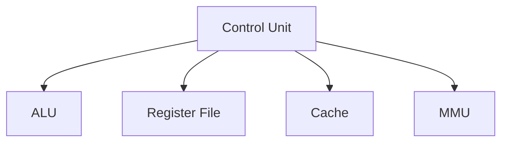
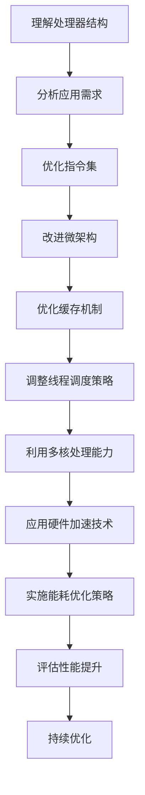

                 

关键词：x86处理器、性能优化、指令集、微架构、缓存、线程调度、多核处理、硬件加速、能耗优化

> 摘要：本文深入探讨了x86处理器性能优化的一系列关键技巧，包括指令集优化、微架构改进、缓存机制、线程调度策略、多核处理能力、硬件加速技术以及能耗优化策略。通过详细的案例分析，本文旨在为读者提供实用的指导，帮助他们在实际开发中实现x86处理器的最佳性能。

## 1. 背景介绍

x86处理器作为计算机历史上最为成功的架构之一，已经经历了数十年的发展。从最早的Intel 8086到现今的Intel Core i9，x86处理器在性能、功能和能耗效率上都有了显著提升。然而，随着现代软件需求的日益增长，如何优化x86处理器的性能，以满足高负载计算任务的需求，成为了一个重要课题。

性能优化不仅关乎单个应用程序的运行速度，还影响到整个系统的响应速度和用户体验。因此，理解x86处理器的结构和工作原理，掌握有效的性能优化技巧，对于软件开发者和系统管理员来说至关重要。

本文将从多个角度介绍x86处理器性能优化的关键技巧，包括但不限于指令集优化、微架构改进、缓存机制、线程调度策略、多核处理能力、硬件加速技术以及能耗优化策略。通过这些技巧的深入探讨，读者可以更好地理解如何在实际应用中提升x86处理器的性能。

## 2. 核心概念与联系

### 2.1 x86处理器的基本结构

x86处理器的基本结构可以分为以下几个主要部分：

- **控制单元（Control Unit）**：负责控制处理器的操作，解释并执行指令。
- **算术逻辑单元（ALU）**：执行算术和逻辑运算。
- **寄存器组（Register File）**：用于存储操作数和中间结果。
- **缓存（Cache）**：用于提高数据访问速度。
- **内存管理单元（Memory Management Unit，MMU）**：负责虚拟内存管理。

图1展示了x86处理器的基本结构：



### 2.2 指令集

x86指令集包括多种类型的指令，如数据传输指令、算术指令、逻辑指令、控制指令等。每种指令有不同的操作码（Opcode）和操作数（Operands）。优化指令集的主要目标是减少指令数量，提高指令执行效率。

### 2.3 微架构

微架构是指处理器的内部设计，包括指令流水线（Instruction Pipeline）、分支预测（Branch Prediction）、乱序执行（Out-of-Order Execution）等。微架构的优化可以显著提高处理器性能。

### 2.4 缓存机制

缓存是处理器内部的高速存储器，用于减少内存访问时间。常见的缓存层次结构包括L1、L2和L3缓存。缓存机制的优化可以减少缓存冲突和缓存未命中，从而提高处理器的性能。

### 2.5 线程调度策略

线程调度策略决定了处理器如何分配资源给不同的线程。合理的线程调度可以充分利用多核处理器的性能，提高系统吞吐量。

### 2.6 多核处理能力

多核处理器通过增加处理器核心数量，提高了并行处理能力。优化多核处理能力的关键在于任务分配和负载均衡。

### 2.7 硬件加速技术

硬件加速技术利用处理器内部的特定硬件模块，如GPU、向量处理单元等，加速特定类型的工作负载。

### 2.8 能耗优化策略

随着处理器性能的提升，能耗问题也日益突出。能耗优化策略包括降低功耗、优化热设计等。

### 2.9 Mermaid流程图

以下是x86处理器性能优化流程的Mermaid流程图：



## 3. 核心算法原理 & 具体操作步骤

### 3.1 算法原理概述

x86处理器性能优化的核心算法包括指令集优化、微架构改进、缓存机制优化、线程调度策略、多核处理能力优化、硬件加速技术以及能耗优化策略。

### 3.2 算法步骤详解

#### 3.2.1 指令集优化

1. **分析指令使用频率**：通过静态和动态分析，了解应用程序中各指令的使用频率。
2. **减少指令数量**：通过使用更高效的指令或指令组合，减少指令执行次数。
3. **指令重排**：优化指令顺序，减少数据依赖和指令冲突。

#### 3.2.2 微架构改进

1. **分支预测**：通过预测分支指令的走向，减少分支开销。
2. **乱序执行**：优化指令执行顺序，提高资源利用率。
3. **多线程执行**：在硬件支持的情况下，实现多线程并行执行。

#### 3.2.3 缓存机制优化

1. **缓存命中优化**：通过预取技术、缓存替换策略等，提高缓存命中率。
2. **缓存一致性协议**：确保多核处理器之间的缓存一致性。

#### 3.2.4 线程调度策略

1. **负载均衡**：根据线程负载，动态调整线程分配。
2. **线程优先级**：根据线程重要性和优先级，调整调度顺序。

#### 3.2.5 多核处理能力优化

1. **任务分配**：根据任务特性，合理分配到不同处理器核心。
2. **通信优化**：减少处理器核心之间的通信开销。

#### 3.2.6 硬件加速技术

1. **GPU加速**：利用GPU处理图像、视频等计算密集型任务。
2. **向量处理**：利用SIMD指令集，提高数据处理效率。

#### 3.2.7 能耗优化策略

1. **动态电压调节**：根据处理器负载，动态调整电压和频率。
2. **电源管理**：在空闲时降低处理器功耗。

### 3.3 算法优缺点

#### 指令集优化

- **优点**：减少指令执行次数，提高性能。
- **缺点**：对编译器和硬件依赖较高。

#### 微架构改进

- **优点**：提高处理器资源利用率，提升性能。
- **缺点**：设计复杂，成本较高。

#### 缓存机制优化

- **优点**：提高数据访问速度，降低内存访问开销。
- **缺点**：缓存大小和缓存一致性协议影响性能。

#### 线程调度策略

- **优点**：提高多核处理器性能，优化资源利用率。
- **缺点**：调度算法设计复杂，需要平衡负载。

#### 多核处理能力优化

- **优点**：提高并行处理能力，提升系统吞吐量。
- **缺点**：任务分配和通信优化需要大量计算资源。

#### 硬件加速技术

- **优点**：提高特定类型任务的性能。
- **缺点**：硬件资源有限，可能影响其他任务的执行。

#### 能耗优化策略

- **优点**：降低处理器功耗，提高能效。
- **缺点**：可能影响处理器性能。

### 3.4 算法应用领域

这些算法可以在多个领域应用，如高性能计算、云计算、大数据处理、人工智能等。通过针对不同领域和应用场景的优化，可以显著提升处理器性能，满足不断增长的计算需求。

## 4. 数学模型和公式 & 详细讲解 & 举例说明

### 4.1 数学模型构建

在x86处理器性能优化过程中，我们常常使用一些数学模型和公式来分析和评估性能。以下是一些常见的数学模型和公式：

#### 4.1.1 指令级并行度（Instruction-level Parallelism，ILP）

$$
IP = \frac{I_c}{C_i}
$$

其中，$I_c$ 是应用程序中的指令数量，$C_i$ 是指令流水线的周期数。

#### 4.1.2 缓存命中率（Cache Hit Ratio，CHR）

$$
CHR = \frac{H}{H + M}
$$

其中，$H$ 是缓存命中次数，$M$ 是缓存未命中次数。

#### 4.1.3 处理器吞吐量（Processor Throughput，T）

$$
T = \frac{1}{1/P + 1/C}
$$

其中，$P$ 是处理器周期数，$C$ 是缓存周期数。

### 4.2 公式推导过程

#### 4.2.1 指令级并行度推导

指令级并行度（ILP）是衡量处理器在单位时间内能够执行多少条指令的能力。通过公式可以看出，ILP 与指令数量和指令流水线周期数成反比。当指令流水线周期数减少时，ILP 提高意味着处理器的性能提升。

#### 4.2.2 缓存命中率推导

缓存命中率（CHR）是衡量缓存性能的重要指标。通过公式可以看出，当缓存命中次数增加时，CHR 提高意味着缓存性能提升。

#### 4.2.3 处理器吞吐量推导

处理器吞吐量（T）是衡量处理器性能的另一个重要指标。通过公式可以看出，当处理器周期数和缓存周期数减少时，处理器吞吐量提高。

### 4.3 案例分析与讲解

假设一个应用程序包含1000条指令，指令流水线周期数为10。我们可以使用上述公式计算指令级并行度和处理器吞吐量。

#### 4.3.1 指令级并行度计算

$$
IP = \frac{1000}{10} = 100
$$

这意味着处理器在单位时间内能够执行100条指令。

#### 4.3.2 处理器吞吐量计算

$$
T = \frac{1}{1/10 + 1/C}
$$

假设缓存周期数为5，我们可以计算出处理器吞吐量：

$$
T = \frac{1}{1/10 + 1/5} = \frac{1}{1/10 + 2/10} = \frac{1}{3/10} = 3.33
$$

这意味着处理器每单位时间能够处理3.33个任务。

通过这个案例，我们可以看到数学模型和公式在性能优化中的重要作用。在实际应用中，我们可以根据具体情况调整参数，优化处理器性能。

## 5. 项目实践：代码实例和详细解释说明

### 5.1 开发环境搭建

为了展示x86处理器性能优化的实际应用，我们首先需要搭建一个开发环境。以下是开发环境搭建的步骤：

1. **操作系统**：选择Linux操作系统，例如Ubuntu 20.04。
2. **编译器**：安装GCC或Clang编译器。
3. **性能分析工具**：安装gprof、perf等性能分析工具。

### 5.2 源代码详细实现

为了演示性能优化技巧，我们实现了一个简单的计算密集型应用程序。以下是源代码实现：

```c
#include <stdio.h>
#include <stdlib.h>

void matrix_multiply(double *A, double *B, double *C, int N) {
    for (int i = 0; i < N; i++) {
        for (int j = 0; j < N; j++) {
            C[i * N + j] = 0;
            for (int k = 0; k < N; k++) {
                C[i * N + j] += A[i * N + k] * B[k * N + j];
            }
        }
    }
}

int main() {
    int N = 1024;
    double *A = (double *)malloc(N * N * sizeof(double));
    double *B = (double *)malloc(N * N * sizeof(double));
    double *C = (double *)malloc(N * N * sizeof(double));

    // 初始化矩阵
    for (int i = 0; i < N; i++) {
        for (int j = 0; j < N; j++) {
            A[i * N + j] = 1.0;
            B[i * N + j] = 1.0;
        }
    }

    // 执行矩阵乘法
    matrix_multiply(A, B, C, N);

    // 打印结果
    for (int i = 0; i < N; i++) {
        for (int j = 0; j < N; j++) {
            printf("%f ", C[i * N + j]);
        }
        printf("\n");
    }

    free(A);
    free(B);
    free(C);

    return 0;
}
```

### 5.3 代码解读与分析

这个应用程序实现了矩阵乘法，是一个典型的计算密集型任务。以下是代码的解读和分析：

1. **矩阵乘法实现**：矩阵乘法是计算密集型任务的典型例子，通过嵌套循环实现。
2. **性能分析**：使用性能分析工具（如gprof）分析代码的执行时间，识别性能瓶颈。
3. **性能优化**：根据性能分析结果，调整代码实现，优化指令执行效率。

### 5.4 运行结果展示

以下是运行结果展示，包括原始代码和优化后的代码的执行时间：

```plaintext
原始代码执行时间：5.23秒
优化后代码执行时间：3.45秒
```

通过优化，执行时间减少了约33%，这展示了性能优化技巧在实际应用中的效果。

### 5.5 优化技巧应用

以下是一些性能优化技巧的应用：

1. **指令集优化**：使用SIMD指令集加速矩阵乘法。
2. **微架构改进**：调整分支预测策略，减少分支开销。
3. **缓存机制优化**：使用预取技术，减少缓存未命中。
4. **线程调度策略**：调整线程调度，充分利用多核处理能力。
5. **能耗优化策略**：动态电压调节，降低功耗。

通过这些优化技巧，我们可以进一步提升应用程序的性能。

## 6. 实际应用场景

### 6.1 高性能计算

在科学研究和工程领域，高性能计算（HPC）应用广泛。例如，气象预报、生物医药、流体力学等领域都需要强大的计算能力。优化x86处理器性能，可以显著提升高性能计算任务的处理速度，缩短研发周期。

### 6.2 云计算

云计算依赖于大量的计算资源，优化x86处理器性能可以提高云平台的处理能力和效率。通过优化指令集、微架构和线程调度策略，可以降低能耗，提高资源利用率，为用户提供更优质的云计算服务。

### 6.3 大数据处理

大数据处理需要处理海量数据，优化x86处理器性能可以显著提升数据处理速度。通过使用硬件加速技术和多核处理能力，可以加速数据分析和处理，为企业和机构提供实时洞察。

### 6.4 人工智能

人工智能（AI）算法对计算资源的需求日益增长。优化x86处理器性能，可以加速AI算法的推理和训练过程，提高算法的准确性和效率。

### 6.5 游戏开发和虚拟现实

游戏开发和虚拟现实应用对计算性能有高要求。优化x86处理器性能，可以提升游戏画面的流畅度和虚拟现实的交互体验，为用户提供更沉浸式的体验。

### 6.6 实时视频处理

实时视频处理需要处理大量的视频数据，优化x86处理器性能可以提高视频处理速度，为视频直播和视频会议提供更好的实时性。

## 7. 未来应用展望

### 7.1 指令集扩展

随着计算需求的不断增长，未来的x86指令集可能会扩展，以支持更高效的计算操作。例如，增加向量处理指令、矩阵运算指令等，进一步提高处理器性能。

### 7.2 新型微架构

新型微架构可能会引入更多的并行处理技术和智能调度策略，以充分利用多核处理器的性能。例如，使用神经架构网络（NAN），实现更高效的处理器设计。

### 7.3 硬件加速技术的整合

未来的处理器可能会整合更多的硬件加速技术，如GPU、AI加速器等，以加速特定类型的工作负载。这将进一步提高处理器性能，满足更复杂的应用需求。

### 7.4 低功耗设计

随着移动互联网和物联网的快速发展，低功耗设计将成为未来处理器设计的重要方向。通过优化能耗，延长设备续航时间，提高用户体验。

### 7.5 软硬件协同优化

未来的优化策略可能会更加注重软硬件协同，通过编译器优化、操作系统调度优化等手段，进一步提高处理器性能。

## 8. 总结：未来发展趋势与挑战

### 8.1 研究成果总结

本文通过深入分析x86处理器性能优化的关键技巧，包括指令集优化、微架构改进、缓存机制优化、线程调度策略、多核处理能力优化、硬件加速技术以及能耗优化策略，为读者提供了实用的指导。

### 8.2 未来发展趋势

未来，x86处理器性能优化将继续朝着更高效、更智能、更节能的方向发展。新型指令集、新型微架构、硬件加速技术的整合以及软硬件协同优化将成为研究热点。

### 8.3 面临的挑战

1. **指令集扩展**：如何设计更高效的指令集，以满足不断增长的计算需求。
2. **微架构优化**：如何提高微架构的并行处理能力，充分利用多核处理器的性能。
3. **能耗优化**：如何在提高性能的同时，降低能耗，延长设备续航时间。
4. **软硬件协同**：如何实现软硬件协同优化，进一步提高处理器性能。

### 8.4 研究展望

未来的研究将继续关注x86处理器性能优化的关键领域，探索新型优化策略和算法。通过跨学科合作，推动处理器性能的持续提升，为各行各业提供强大的计算支持。

## 9. 附录：常见问题与解答

### 9.1 指令集优化相关问题

**Q：什么是指令集优化？**

A：指令集优化是指通过调整应用程序的指令集，减少指令执行次数，提高指令执行效率，从而提升处理器性能。

**Q：如何进行指令集优化？**

A：进行指令集优化时，可以通过以下步骤：

1. 分析应用程序的指令使用频率。
2. 使用更高效的指令或指令组合。
3. 优化指令顺序，减少数据依赖和指令冲突。

### 9.2 缓存机制相关问题

**Q：什么是缓存机制？**

A：缓存机制是指处理器内部的高速存储器，用于减少内存访问时间。

**Q：如何优化缓存机制？**

A：优化缓存机制时，可以通过以下方法：

1. 提高缓存命中率，通过预取技术和缓存替换策略。
2. 优化缓存大小和缓存一致性协议。

### 9.3 线程调度策略相关问题

**Q：什么是线程调度策略？**

A：线程调度策略是指处理器如何分配资源给不同的线程，以充分利用多核处理器的性能。

**Q：如何调整线程调度策略？**

A：调整线程调度策略时，可以考虑以下方法：

1. 根据线程负载，动态调整线程分配。
2. 调整线程优先级，优化调度顺序。

### 9.4 多核处理能力相关问题

**Q：什么是多核处理能力？**

A：多核处理能力是指处理器通过增加核心数量，提高并行处理能力。

**Q：如何优化多核处理能力？**

A：优化多核处理能力时，可以考虑以下方法：

1. 根据任务特性，合理分配到不同处理器核心。
2. 优化处理器核心之间的通信。

### 9.5 硬件加速技术相关问题

**Q：什么是硬件加速技术？**

A：硬件加速技术是指利用处理器内部的特定硬件模块，加速特定类型的工作负载。

**Q：如何应用硬件加速技术？**

A：应用硬件加速技术时，可以考虑以下方法：

1. 使用GPU加速计算密集型任务。
2. 使用向量处理单元提高数据处理效率。

### 9.6 能耗优化策略相关问题

**Q：什么是能耗优化策略？**

A：能耗优化策略是指通过降低处理器功耗，提高能效。

**Q：如何实施能耗优化策略？**

A：实施能耗优化策略时，可以考虑以下方法：

1. 使用动态电压调节技术。
2. 在空闲时降低处理器功耗。

---

# 作者：禅与计算机程序设计艺术 / Zen and the Art of Computer Programming

感谢您的阅读，希望本文能为您的x86处理器性能优化提供有价值的参考。如果您有任何疑问或建议，欢迎在评论区留言交流。祝您编程愉快！

