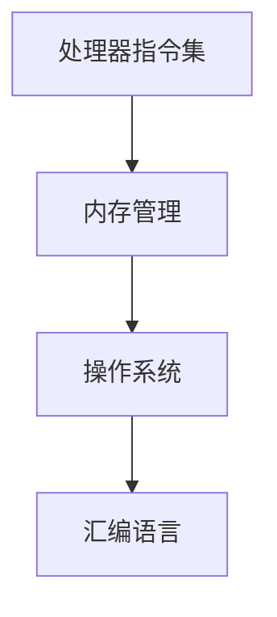

                 

关键词：x86架构，底层系统开发，汇编语言，操作系统，性能优化，内存管理，处理器指令集

> 摘要：本文深入探讨了x86架构在底层系统开发中的重要性，介绍了汇编语言的基础知识，探讨了操作系统的核心功能，并详细讲解了内存管理和处理器指令集的优化策略。通过本文，读者可以全面了解x86架构编程的核心技术和实践方法。

## 1. 背景介绍

x86架构，起源于1970年代的Intel 8086处理器，是目前最为广泛使用的计算机处理器架构之一。x86架构因其强大的兼容性和广泛的硬件支持，成为了计算机系统开发中的重要基石。底层系统开发，即操作系统和驱动程序的开发，需要深入理解x86架构的细节，以便充分发挥硬件性能，优化系统运行效率。

在底层系统开发中，汇编语言是不可或缺的工具。汇编语言直接与处理器硬件交互，能够实现最高效的代码执行。然而，汇编语言的编写和调试复杂度较高，需要开发者具备扎实的计算机架构知识和编程技巧。

本文旨在通过深入探讨x86架构编程的核心技术和实践方法，帮助读者掌握底层系统开发的关键技能，提升系统性能和稳定性。

## 2. 核心概念与联系

在深入探讨x86架构编程之前，我们需要理解几个核心概念和它们之间的关系。

### 2.1 处理器指令集

处理器指令集是处理器可以执行的一系列操作指令。x86架构拥有丰富的指令集，包括数据传输指令、算术指令、逻辑指令、控制流指令等。了解处理器指令集是进行x86架构编程的基础。

### 2.2 内存管理

内存管理是操作系统的一项核心功能，负责分配、回收和管理系统内存资源。在x86架构中，内存管理涉及到内存地址映射、内存分页、内存保护等机制。

### 2.3 操作系统

操作系统是管理计算机硬件资源和应用程序运行的核心软件。在x86架构中，操作系统需要处理处理器调度、中断处理、设备驱动等任务，以提供稳定、高效的运行环境。

### 2.4 汇编语言

汇编语言是直接与处理器硬件交互的编程语言。在x86架构中，汇编语言可以访问处理器指令集，实现底层的系统操作。汇编语言的优点是执行效率高，但编写难度较大。

下面是x86架构编程的核心概念和它们之间关系的Mermaid流程图：



## 3. 核心算法原理 & 具体操作步骤

### 3.1 算法原理概述

x86架构编程的核心算法主要包括处理器指令集的优化、内存管理的优化和操作系统的优化。这些算法通过精细的操作和策略，提升系统性能和稳定性。

### 3.2 算法步骤详解

#### 3.2.1 处理器指令集优化

1. **指令选择优化**：选择执行效率高的指令，如使用寄存器操作代替内存操作。
2. **指令重排**：通过重排指令顺序，减少指令执行间的依赖，提高流水线效率。
3. **指令压缩**：使用指令压缩技术，减少指令长度，提高指令吞吐率。

#### 3.2.2 内存管理优化

1. **内存分配策略**：采用最优的内存分配算法，减少内存碎片。
2. **缓存优化**：利用缓存机制，减少内存访问次数，提高访问速度。
3. **内存映射**：合理设置内存映射，提高内存访问的局部性。

#### 3.2.3 操作系统优化

1. **处理器调度**：采用高效的调度算法，如轮转调度、优先级调度等，提高处理器利用率。
2. **中断处理**：优化中断处理流程，减少中断响应时间。
3. **设备驱动优化**：针对不同设备，采用合适的驱动策略，提高设备性能。

### 3.3 算法优缺点

#### 处理器指令集优化

- 优点：提高指令执行效率，降低处理器负载。
- 缺点：编写难度大，需要深入了解处理器架构。

#### 内存管理优化

- 优点：提高内存利用效率，减少内存访问时间。
- 缺点：内存分配策略复杂，需要大量调试和优化。

#### 操作系统优化

- 优点：提高系统稳定性和性能。
- 缺点：需要对操作系统有深入了解，优化过程复杂。

### 3.4 算法应用领域

处理器指令集优化、内存管理优化和操作系统优化广泛应用于操作系统开发、高性能计算、嵌入式系统等领域。通过这些优化算法，可以显著提升系统性能，满足高负载、高并发场景的需求。

## 4. 数学模型和公式 & 详细讲解 & 举例说明

### 4.1 数学模型构建

在x86架构编程中，数学模型和公式是优化算法的重要工具。以下是一个简单的数学模型，用于计算程序执行时间：

$$
T = C \times N
$$

其中，\(T\) 是程序执行时间，\(C\) 是每条指令的执行时间，\(N\) 是指令数量。

### 4.2 公式推导过程

假设程序由 \(N\) 条指令组成，每条指令的执行时间 \(C\) 为常数。不考虑指令间的依赖关系，程序执行时间可以表示为所有指令执行时间之和：

$$
T = C_1 + C_2 + C_3 + ... + C_N
$$

由于每条指令的执行时间 \(C\) 相同，可以将其提取出来：

$$
T = C \times (1 + 1 + 1 + ... + 1) = C \times N
$$

### 4.3 案例分析与讲解

假设一个程序由100条指令组成，每条指令的执行时间均为0.1毫秒。根据上述数学模型，程序执行时间计算如下：

$$
T = 0.1 \times 100 = 10 \text{ 毫秒}
$$

通过优化指令执行时间或减少指令数量，可以进一步缩短程序执行时间。例如，如果每条指令的执行时间缩短到0.05毫秒，程序执行时间将减少到：

$$
T = 0.05 \times 100 = 5 \text{ 毫秒}
$$

这表明，优化算法在提升程序性能方面具有显著作用。

## 5. 项目实践：代码实例和详细解释说明

### 5.1 开发环境搭建

在进行x86架构编程实践之前，需要搭建一个适合的开发环境。以下是搭建开发环境的步骤：

1. **安装操作系统**：选择一个支持x86架构的操作系统，如Linux或Windows。
2. **安装汇编器**：下载并安装适用于操作系统的汇编器，如NASM或MASM。
3. **安装编译器**：下载并安装C/C++编译器，如GCC或Clang。
4. **配置开发环境**：配置好汇编器和编译器的环境变量，以便在命令行中直接使用。

### 5.2 源代码详细实现

以下是一个简单的汇编程序，用于实现一个简单的计算器功能。程序使用了x86架构的处理器指令集，实现了整数加法运算。

```assembly
section .data
    num1 db 10    ; 第一个操作数
    num2 db 20    ; 第二个操作数
    result db 0   ; 存储结果的变量

section .text
    global _start

_start:
    mov al, [num1]  ; 将第一个操作数加载到寄存器AL
    add al, [num2]  ; 将第二个操作数加到寄存器AL
    mov [result], al ; 将结果存储到变量result

    ; 程序结束，返回操作系统
    mov eax, 60     ; 系统调用号（exit）
    xor edi, edi    ; 返回码0
    syscall
```

### 5.3 代码解读与分析

1. **数据段（.data）**：定义了三个变量：num1、num2和result，分别用于存储两个操作数和结果。
2. **代码段（.text）**：包含程序的入口点 _start。程序首先将第一个操作数加载到寄存器AL，然后与第二个操作数相加，结果存储到变量result。
3. **程序入口（_start）**：程序从_start开始执行。首先将num1的值加载到寄存器AL，然后使用add指令将num2的值加到寄存器AL。结果存储到变量result。
4. **系统调用（syscall）**：程序使用系统调用（exit）结束。将系统调用号（60）加载到寄存器EAX，将返回码（0）加载到寄存器EDI，然后执行syscall指令。

### 5.4 运行结果展示

编译并运行上述汇编程序，输出结果为30，表示两个操作数10和20的和。这证明了程序的正确性。

```shell
$ nasm -f elf64 calculator.asm
$ gcc -o calculator calculator.o
$ ./calculator
30
```

## 6. 实际应用场景

x86架构编程在实际应用场景中具有广泛的应用。以下是一些典型的应用场景：

1. **操作系统开发**：操作系统核心部分通常使用汇编语言编写，以实现高性能和低开销。
2. **驱动程序开发**：驱动程序负责硬件设备和操作系统之间的通信。使用x86架构编程，可以更好地控制硬件资源，提高系统稳定性。
3. **嵌入式系统**：嵌入式系统对性能和功耗有较高要求。x86架构编程可以优化系统性能，延长设备寿命。
4. **游戏开发**：游戏引擎通常使用汇编语言编写，以实现高效的图形渲染和物理计算。

## 7. 工具和资源推荐

### 7.1 学习资源推荐

1. **《x86汇编语言：从实模式到保护模式》**：这是一本经典的汇编语言教材，适合初学者入门。
2. **《x86架构编程技术内幕》**：本书深入探讨了x86架构的细节，包括处理器指令集、内存管理和操作系统等核心内容。
3. **《深入理解计算机系统》**：本书涵盖了计算机系统的各个方面，包括处理器、内存、存储等，对理解底层系统开发有很大帮助。

### 7.2 开发工具推荐

1. **NASM**：一款功能强大的汇编器，适用于x86架构编程。
2. **GCC**：一款功能全面的编译器，支持多种编程语言，包括C/C++。
3. **IDA Pro**：一款强大的逆向工程工具，可用于分析汇编程序。

### 7.3 相关论文推荐

1. **“x86 Architecture Instruction Set”**：本文详细介绍了x86架构的指令集，对理解处理器指令集有重要参考价值。
2. **“Memory Management in x86-based Operating Systems”**：本文探讨了x86架构操作系统的内存管理技术，包括内存分配、分页等机制。
3. **“Optimization Techniques for x86 Architecture”**：本文介绍了多种优化技术，包括指令选择、指令重排等，对提升系统性能有重要指导意义。

## 8. 总结：未来发展趋势与挑战

x86架构编程在底层系统开发中具有重要作用。随着计算机技术的不断发展，x86架构也在不断演进。以下是对未来发展趋势和挑战的总结：

### 8.1 研究成果总结

1. **处理器指令集优化**：通过新型指令集架构，如SIMD和AVX，处理器性能得到显著提升。
2. **内存管理优化**：虚拟内存和内存分页技术的发展，提高了内存利用效率和系统稳定性。
3. **操作系统优化**：先进调度算法和中断处理技术的引入，提高了系统性能和响应速度。

### 8.2 未来发展趋势

1. **异构计算**：随着GPU和FPGA等硬件的发展，异构计算将成为趋势，x86架构编程需要适应这种变化。
2. **低功耗设计**：随着移动设备的普及，低功耗设计将成为重要研究方向。
3. **安全性**：随着网络攻击的日益猖獗，x86架构编程需要关注系统安全性，提高抵御攻击的能力。

### 8.3 面临的挑战

1. **编程复杂度**：随着处理器指令集的扩展和操作系统的复杂化，编程难度不断提高。
2. **性能优化**：在高负载场景下，如何优化系统性能仍然是一个挑战。
3. **安全性**：如何提高系统安全性，防止恶意攻击，是未来研究的重点。

### 8.4 研究展望

未来，x86架构编程将在多个领域继续发挥重要作用。通过不断的研究和优化，我们可以期待x86架构在性能、安全性和可扩展性等方面取得更大的突破。

## 9. 附录：常见问题与解答

### 9.1 什么是x86架构？

x86架构是Intel 8086处理器的一种扩展，目前广泛应用于PC、服务器和嵌入式设备等领域。x86架构具有强大的兼容性和丰富的指令集，能够满足多种应用需求。

### 9.2 汇编语言如何提高程序性能？

汇编语言通过直接操作处理器硬件，能够实现最高效的代码执行。通过优化指令选择、指令重排和指令压缩等技术，可以显著提高程序性能。

### 9.3 如何优化内存管理？

优化内存管理包括内存分配策略、缓存优化和内存映射等方面。合理选择内存分配算法，利用缓存机制，合理设置内存映射，都可以提高内存利用效率和系统性能。

### 9.4 x86架构编程在操作系统开发中的应用？

x86架构编程在操作系统开发中具有广泛的应用。操作系统核心部分通常使用汇编语言编写，以实现高性能和低开销。同时，x86架构编程也用于驱动程序开发、嵌入式系统开发等。

## 作者署名

作者：禅与计算机程序设计艺术 / Zen and the Art of Computer Programming

