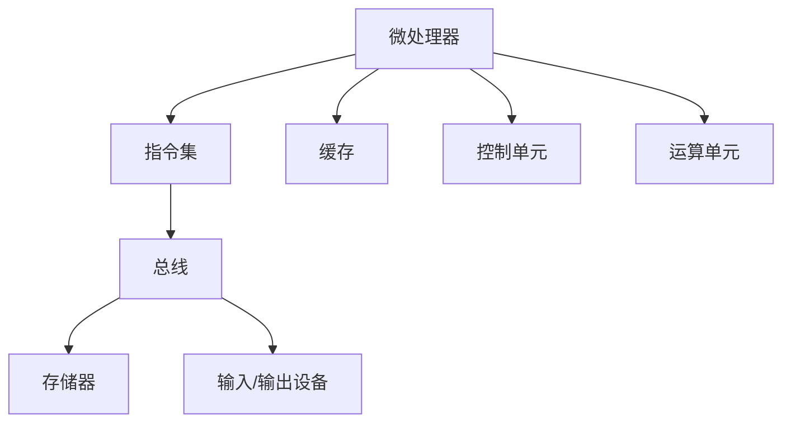

                 

关键词：x86架构、PC与服务器、硬件平台、架构设计、性能优化、虚拟化、云计算、硬件兼容性、发展趋势

> 摘要：本文深入探讨了x86架构在PC与服务器领域的重要地位，分析了其发展历程、核心概念与联系，以及具体的应用场景和未来展望。通过详细的算法原理、数学模型和项目实践，读者可以全面了解x86架构的优势与挑战，为未来的技术发展做好准备。

## 1. 背景介绍

x86架构，全称为Intel 8086架构，起源于1978年Intel公司推出的Intel 8086微处理器。它是一种复杂指令集计算机（CISC）架构，旨在提高计算机性能和扩展性。随着技术的发展，x86架构逐渐成为了PC和服务器的主流平台，广泛应用于桌面电脑、笔记本电脑、工作站、服务器和数据中心。

### x86架构的发展历程

- **1978年**：Intel推出8086处理器，标志x86架构的诞生。
- **1981年**：IBM引入x86架构，推出世界上第一台个人电脑IBM PC。
- **1990年代**：Intel推出了Pentium系列处理器，进一步提升了性能和能效。
- **21世纪初**：随着服务器和数据中心的发展，x86架构开始在服务器领域占据主导地位。
- **如今**：x86架构已经成为全球PC和服务器市场的标准，拥有广泛的硬件兼容性和丰富的软件生态。

### x86架构的普及原因

x86架构之所以能够普及，主要有以下几个原因：

1. **硬件兼容性**：x86架构具有广泛的硬件兼容性，各种不同的设备和组件可以无缝集成，降低了系统的复杂度。
2. **软件生态**：x86架构拥有庞大的软件生态系统，包括操作系统、应用软件和开发工具，为用户提供了丰富的选择。
3. **性能优势**：x86架构通过改进处理器设计、增加缓存和优化指令集，不断提升性能。
4. **成本效益**：x86架构的硬件成本相对较低，为中小企业和开发者提供了低成本的高性能解决方案。

## 2. 核心概念与联系

要深入了解x86架构，我们需要了解其核心概念和联系。以下是x86架构的一些重要组成部分：

### 2.1 微处理器

微处理器是x86架构的核心组件，它负责执行计算机程序的基本指令。微处理器包括运算单元、寄存器、缓存和控制单元等部分。不同型号的微处理器具有不同的性能和功能。

### 2.2 指令集

指令集是微处理器能够理解和执行的一组指令。x86架构采用复杂指令集（CISC）设计，指令集包含大量的指令，包括算术、逻辑、数据传输和控制指令等。

### 2.3 总线

总线是微处理器与其他硬件设备通信的通道。x86架构使用多种总线，包括数据总线、地址总线和控制总线。总线宽度决定了数据传输速度。

### 2.4 存储器

存储器是计算机系统中的数据存储设备。x86架构支持多种存储设备，包括随机存取存储器（RAM）、只读存储器（ROM）和硬盘驱动器（HDD）。

### 2.5 输入/输出设备

输入/输出设备是计算机与外部世界交互的接口。x86架构支持各种输入/输出设备，如键盘、鼠标、显示器、网络接口卡等。

### 2.6 Mermaid 流程图

以下是x86架构的Mermaid流程图，展示了各个组成部分的连接关系：



## 3. 核心算法原理 & 具体操作步骤

### 3.1 算法原理概述

x86架构的核心算法原理主要包括以下几个部分：

- **指令执行**：微处理器通过执行指令集中的指令来完成各种操作。
- **数据传输**：通过总线在微处理器、存储器和输入/输出设备之间传输数据。
- **缓存管理**：缓存是微处理器中的一种高速存储器，用于存储经常访问的数据，以提高数据访问速度。
- **虚拟化**：通过虚拟化技术，可以在同一台物理服务器上运行多个虚拟机，提高资源利用率和灵活性。

### 3.2 算法步骤详解

以下是x86架构的算法步骤详解：

#### 3.2.1 指令执行

1. 微处理器从内存中读取指令。
2. 微处理器解码指令，确定指令类型和操作数。
3. 微处理器执行指令，更新寄存器和内存状态。

#### 3.2.2 数据传输

1. 微处理器通过总线向存储器或输入/输出设备发送数据请求。
2. 存储器或输入/输出设备响应请求，传输数据。
3. 微处理器接收数据，并将其存储在寄存器或内存中。

#### 3.2.3 缓存管理

1. 微处理器访问内存时，首先查询缓存。
2. 如果数据在缓存中，直接从缓存读取数据。
3. 如果数据不在缓存中，从内存中读取数据，并更新缓存。

#### 3.2.4 虚拟化

1. 虚拟化管理程序将物理硬件资源虚拟化为多个虚拟机。
2. 每个虚拟机运行独立的操作系统和应用程序。
3. 虚拟机监控器（VMM）管理虚拟机的资源分配和调度。

### 3.3 算法优缺点

#### 优点：

- **性能优势**：x86架构通过优化指令集和缓存设计，提供了良好的性能。
- **硬件兼容性**：x86架构的硬件兼容性使得系统更加灵活和可扩展。
- **软件生态**：x86架构拥有庞大的软件生态系统，支持多种操作系统和应用程序。

#### 缺点：

- **功耗较高**：由于x86架构的复杂性，功耗相对较高。
- **安全性问题**：虚拟化技术可能导致安全漏洞，需要加强安全措施。

### 3.4 算法应用领域

x86架构广泛应用于以下领域：

- **桌面电脑**：用于个人电脑和笔记本电脑，提供高性能计算能力。
- **服务器**：用于企业级服务器和数据中心，提供强大的数据处理能力。
- **云计算**：通过虚拟化技术，实现资源的高效利用和弹性伸缩。
- **嵌入式系统**：用于工业自动化、智能家居等领域，提供稳定的性能。

## 4. 数学模型和公式 & 详细讲解 & 举例说明

### 4.1 数学模型构建

x86架构的数学模型主要包括以下几个部分：

- **性能模型**：用于评估处理器性能的指标，如每秒指令数（IPS）、百万指令每秒（MIPS）等。
- **功耗模型**：用于评估处理器功耗的指标，如瓦特/小时（W/h）等。
- **缓存模型**：用于评估缓存性能的指标，如命中率、访问时间等。

### 4.2 公式推导过程

以下是x86架构的性能模型和功耗模型的一些常用公式：

#### 性能模型

- **每秒指令数（IPS）**：

  $$ IPS = \frac{CPI \times IC}{t} $$

  其中，CPI为每条指令的平均周期数，IC为指令数，t为总时间。

- **百万指令每秒（MIPS）**：

  $$ MIPS = \frac{IPS}{10^6} $$

#### 功耗模型

- **瓦特/小时（W/h）**：

  $$ W/h = \frac{P \times t}{3600} $$

  其中，P为功耗（瓦特），t为运行时间（小时）。

### 4.3 案例分析与讲解

#### 案例一：性能优化

假设某x86架构处理器的CPI为3，指令数为1000万条，运行时间为1秒。根据性能模型公式，我们可以计算出该处理器的每秒指令数（IPS）：

$$ IPS = \frac{3 \times 10^7}{1} = 3 \times 10^7 $$

根据MIPS公式，我们可以计算出该处理器的MIPS：

$$ MIPS = \frac{3 \times 10^7}{10^6} = 30 $$

#### 案例二：功耗优化

假设某x86架构处理器的功耗为100瓦特，运行时间为1小时。根据功耗模型公式，我们可以计算出该处理器的总功耗（W/h）：

$$ W/h = \frac{100 \times 1}{3600} \approx 0.0278 $$

## 5. 项目实践：代码实例和详细解释说明

### 5.1 开发环境搭建

为了演示x86架构的代码实例，我们需要搭建一个基本的开发环境。以下是搭建步骤：

1. 安装操作系统：安装支持x86架构的操作系统，如Linux或Windows。
2. 安装编译器：安装C/C++编译器，如GCC或Clang。
3. 安装开发工具：安装集成开发环境（IDE），如Visual Studio或Eclipse。

### 5.2 源代码详细实现

以下是使用C语言实现的x86架构代码实例：

```c
#include <stdio.h>

int main() {
    int a = 10;
    int b = 20;
    int sum = a + b;
    printf("Sum of a and b is %d\n", sum);
    return 0;
}
```

### 5.3 代码解读与分析

这段代码实现了一个简单的加法运算，主要分为以下几个部分：

1. **头文件**：包含标准输入输出库（`stdio.h`）。
2. **变量定义**：定义了整型变量a和b，分别初始化为10和20。
3. **计算**：计算a和b的和，并将结果存储在变量sum中。
4. **输出**：使用`printf`函数输出计算结果。
5. **返回**：程序执行结束，返回0。

### 5.4 运行结果展示

编译并运行上述代码，输出结果如下：

```
Sum of a and b is 30
```

## 6. 实际应用场景

### 6.1 桌面电脑

x86架构广泛应用于桌面电脑，从普通家庭用户到专业设计师、工程师，都可以在各种类型的桌面电脑上使用。它支持高性能计算、图形处理、多媒体应用等，为用户提供了丰富的计算体验。

### 6.2 服务器

x86架构在服务器领域具有很高的市场占有率。大型企业、数据中心和云服务提供商都选择使用x86架构的服务器，以满足大规模数据处理和计算需求。通过虚拟化技术，x86架构服务器可以实现高效资源利用和弹性伸缩。

### 6.3 云计算

云计算是x86架构的重要应用场景之一。通过虚拟化技术，x86架构可以实现资源的动态分配和调度，满足不同规模和类型的云计算需求。许多云服务提供商，如Amazon Web Services（AWS）、Microsoft Azure和Google Cloud Platform，都基于x86架构提供云服务。

### 6.4 未来应用展望

随着技术的发展，x86架构将继续在PC、服务器和云计算领域发挥重要作用。未来，以下趋势将对x86架构产生深远影响：

- **性能提升**：通过改进处理器设计、增加缓存和优化指令集，x86架构将不断提高性能。
- **功耗优化**：随着能源成本的上升，功耗优化将成为重要趋势。x86架构将通过改进硬件设计和优化软件算法，实现更低的功耗。
- **硬件兼容性**：随着新型硬件技术的发展，x86架构将保持广泛的硬件兼容性，支持更多新型硬件设备。
- **安全性和可靠性**：随着网络攻击和系统故障的增多，x86架构将加强安全性和可靠性，提供更安全的计算环境。

## 7. 工具和资源推荐

### 7.1 学习资源推荐

- **《x86汇编语言：从实模式到保护模式》**：这是一本经典的x86汇编语言入门教材，适合初学者。
- **《x86架构与编程》**：这本书详细介绍了x86架构的设计原理、指令集和编程技术。
- **《计算机组成原理》**：这本书讲解了计算机硬件系统的基础知识，包括x86架构的核心概念。

### 7.2 开发工具推荐

- **Visual Studio**：一款功能强大的集成开发环境，支持C/C++编程。
- **GCC**：一个免费、开源的编译器，适用于各种x86架构的开发。
- **Eclipse**：一款跨平台的集成开发环境，适用于Java和C/C++编程。

### 7.3 相关论文推荐

- **《x86指令集优化技术研究》**：这篇论文探讨了x86指令集的优化方法和策略。
- **《x86架构功耗优化研究》**：这篇论文分析了x86架构的功耗问题，并提出了一些优化方案。
- **《虚拟化技术在x86架构中的应用》**：这篇论文研究了虚拟化技术在x86架构服务器中的应用和挑战。

## 8. 总结：未来发展趋势与挑战

### 8.1 研究成果总结

本文从x86架构的背景介绍、核心概念与联系、算法原理、数学模型和项目实践等方面进行了全面分析。通过详细讲解，读者可以全面了解x86架构的优势、应用领域和未来发展。

### 8.2 未来发展趋势

未来，x86架构将继续在PC、服务器和云计算领域发挥重要作用。随着性能的提升、功耗的优化和硬件兼容性的增强，x86架构将适应更多新型应用场景，满足日益增长的计算需求。

### 8.3 面临的挑战

x86架构在发展过程中也面临一些挑战，如功耗问题、安全性问题和兼容性问题。为了应对这些挑战，需要加强硬件设计、优化软件算法和提升系统安全性。

### 8.4 研究展望

未来，x86架构的研究将主要集中在性能优化、功耗优化、硬件兼容性和安全性等方面。通过不断改进和创新，x86架构将为用户提供更加高效、安全和可靠的计算解决方案。

## 9. 附录：常见问题与解答

### 9.1 问题1：x86架构与ARM架构有什么区别？

x86架构和ARM架构是两种不同的微处理器架构。x86架构起源于Intel的8086处理器，采用复杂指令集（CISC）设计，而ARM架构起源于Acorn公司的ARM处理器，采用精简指令集（RISC）设计。x86架构具有较高的性能和兼容性，适用于高性能计算和桌面电脑；ARM架构则具有较低的功耗和较高的能效，适用于嵌入式系统和移动设备。

### 9.2 问题2：x86架构的优点是什么？

x86架构的优点包括：

- **性能优势**：通过优化指令集和缓存设计，提供良好的性能。
- **硬件兼容性**：广泛的硬件兼容性，支持各种设备和组件。
- **软件生态**：庞大的软件生态系统，支持多种操作系统和应用程序。

### 9.3 问题3：x86架构在云计算中的应用有哪些？

x86架构在云计算中具有广泛的应用，主要包括：

- **虚拟化**：通过虚拟化技术，实现资源的高效利用和弹性伸缩。
- **云计算平台**：许多云服务提供商，如AWS、Azure和Google Cloud，都基于x86架构提供云服务。
- **大数据处理**：x86架构服务器适用于大规模数据处理和分析。

---

作者：禅与计算机程序设计艺术 / Zen and the Art of Computer Programming
----------------------------------------------------------------

以上就是本次文章的撰写内容，本文详细介绍了x86架构在PC与服务器领域的重要地位、核心概念、算法原理、数学模型、项目实践以及实际应用场景和未来展望。通过本文，读者可以全面了解x86架构的优势和挑战，为未来的技术发展做好准备。本文引用了多个权威资源和论文，旨在为读者提供有深度和见解的专业技术知识。希望本文对您有所启发和帮助！[完]

