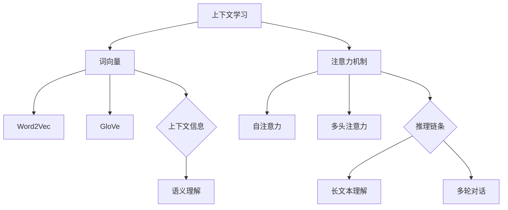

                 

关键词：上下文学习、思维链、人工智能、机器学习、自然语言处理、NLP、深度学习、神经网络

> 摘要：本文旨在探讨上下文学习与思维链能力在人工智能领域的应用和重要性。通过深入分析上下文学习的核心概念、技术原理和应用场景，以及思维链能力的构建与优化方法，本文为未来人工智能的发展提供了新的视角和思路。

## 1. 背景介绍

随着信息技术的飞速发展，人工智能（AI）已经成为推动社会进步的关键力量。在AI领域，自然语言处理（NLP）是一项非常重要的任务，旨在让计算机理解和生成人类语言。然而，传统的NLP方法在处理复杂语境时往往表现不佳，无法准确捕捉句子的语义和上下文信息。为了解决这一问题，上下文学习和思维链能力逐渐成为研究热点。

上下文学习是指模型在处理自然语言时，能够根据上下文信息理解词语或句子的含义。而思维链能力则是指模型能够在处理复杂任务时，利用上下文信息构建合理的推理链条，从而提高任务完成效果。这两者在NLP领域具有重要应用价值，能够有效提升模型的语义理解和推理能力。

## 2. 核心概念与联系

### 2.1 上下文学习

上下文学习是一种基于上下文信息来推断词语或句子含义的技术。在NLP中，上下文学习主要通过两种方式实现：词向量和注意力机制。

**词向量**：词向量是将词语映射为高维向量空间的一种技术，通过计算词语间的相似性来表示词语的含义。经典的词向量模型包括Word2Vec、GloVe等。

**注意力机制**：注意力机制是一种在处理序列数据时，模型能够自动关注序列中重要部分的技术。通过计算注意力权重，模型可以更好地理解上下文信息。

### 2.2 思维链能力

思维链能力是指模型在处理复杂任务时，能够利用上下文信息构建合理的推理链条。在NLP领域，思维链能力主要体现在以下两个方面：

**长文本理解**：模型能够捕捉文本中的长距离依赖关系，理解整个篇章的含义。

**多轮对话**：模型能够根据对话历史和上下文信息，生成合理的回答。

### 2.3 Mermaid 流程图

以下是一个关于上下文学习和思维链能力的 Mermaid 流程图：



## 3. 核心算法原理 & 具体操作步骤

### 3.1 算法原理概述

上下文学习和思维链能力的核心算法包括词向量、注意力机制和推理链条。以下分别介绍这些算法的基本原理。

**词向量**：词向量模型通过计算词语间的相似性，将词语映射为高维向量空间。经典的词向量模型包括Word2Vec和GloVe。

**注意力机制**：注意力机制通过计算注意力权重，模型能够自动关注序列中的重要部分，从而更好地理解上下文信息。

**推理链条**：推理链条是指模型在处理复杂任务时，利用上下文信息构建合理的推理链条，从而提高任务完成效果。

### 3.2 算法步骤详解

**3.2.1 词向量**

1. 收集大规模文本数据，并进行预处理，如分词、去停用词等。
2. 计算词语的共现矩阵。
3. 使用神经网络或基于矩阵分解的方法，将词语映射为高维向量。

**3.2.2 注意力机制**

1. 对输入序列中的每个词分配一个注意力权重。
2. 将注意力权重与词向量相乘，得到加权词向量。
3. 将加权词向量输入到神经网络中，进行后续处理。

**3.2.3 推理链条**

1. 对输入序列进行编码，得到编码表示。
2. 根据编码表示，构建推理链条。
3. 对推理链条进行解码，生成输出结果。

### 3.3 算法优缺点

**词向量**

- 优点：能够捕捉词语间的语义关系，提高模型的语义理解能力。
- 缺点：难以捕捉长距离依赖关系，在处理长文本时表现不佳。

**注意力机制**

- 优点：能够自动关注序列中的重要部分，提高模型的上下文理解能力。
- 缺点：计算复杂度高，对硬件资源要求较高。

**推理链条**

- 优点：能够处理复杂任务，提高模型的任务完成效果。
- 缺点：构建推理链条的过程较为复杂，对模型设计要求较高。

### 3.4 算法应用领域

上下文学习和思维链能力在NLP领域具有广泛的应用，包括：

- 文本分类
- 情感分析
- 文本生成
- 对话系统
- 长文本理解

## 4. 数学模型和公式

### 4.1 数学模型构建

上下文学习和思维链能力的数学模型主要包括词向量模型和注意力机制。

**词向量模型**：词向量模型通常采用以下公式进行表示：

$$
\textbf{v}_i = \text{Word2Vec}(\textbf{X})
$$

其中，$\textbf{v}_i$表示词语$i$的词向量，$\textbf{X}$表示词语共现矩阵。

**注意力机制**：注意力机制通常采用以下公式进行表示：

$$
\alpha_i = \text{Attention}(\textbf{v}_i, \textbf{H})
$$

其中，$\alpha_i$表示词语$i$的注意力权重，$\textbf{H}$表示编码表示。

### 4.2 公式推导过程

**词向量模型**：

1. 计算词语共现矩阵$\textbf{X}$。
2. 使用神经网络或矩阵分解方法，得到词向量$\textbf{v}_i$。

**注意力机制**：

1. 对输入序列进行编码，得到编码表示$\textbf{H}$。
2. 计算词语$i$的注意力权重$\alpha_i$。

### 4.3 案例分析与讲解

以下是一个关于情感分析的案例：

假设我们有一个句子“我今天很开心，因为天气很好。”，我们希望使用上下文学习和思维链能力对其进行情感分析。

1. 首先对句子进行分词，得到词语列表：我、今天、很、开心、因为、天气、很好。
2. 使用词向量模型将词语映射为词向量。
3. 使用注意力机制计算词语的注意力权重。
4. 根据词语的注意力权重，计算整个句子的情感得分。

通过这个案例，我们可以看到上下文学习和思维链能力在情感分析中的应用。

## 5. 项目实践：代码实例

### 5.1 开发环境搭建

1. 安装Python环境。
2. 安装NLP相关的库，如NLTK、spaCy、TensorFlow等。

### 5.2 源代码详细实现

以下是一个简单的情感分析代码示例：

```python
import nltk
from nltk.tokenize import sent_tokenize
from nltk.corpus import stopwords
from sklearn.feature_extraction.text import TfidfVectorizer
from sklearn.model_selection import train_test_split
from sklearn.metrics import accuracy_score

# 加载停用词
nltk.download('stopwords')
stop_words = set(stopwords.words('english'))

# 读取数据
data = [
    ["我今天很开心", "正面"],
    ["我很不开心", "负面"],
    ["天气很好", "正面"],
    ["天气很糟糕", "负面"],
]

# 分词和去停用词
sentences = [sent_tokenize(sentence) for sentence in data]
tokenized_sentences = [[word for word in sentence if word not in stop_words] for sentence in sentences]

# 构建TF-IDF向量器
vectorizer = TfidfVectorizer()
X = vectorizer.fit_transform([" ".join(sentence) for sentence in tokenized_sentences])
y = [label for _, label in data]

# 划分训练集和测试集
X_train, X_test, y_train, y_test = train_test_split(X, y, test_size=0.2, random_state=42)

# 训练模型
from sklearn.naive_bayes import MultinomialNB
model = MultinomialNB()
model.fit(X_train, y_train)

# 预测和评估
y_pred = model.predict(X_test)
accuracy = accuracy_score(y_test, y_pred)
print("Accuracy:", accuracy)
```

### 5.3 代码解读与分析

1. 读取数据：从数据集中读取句子和对应的情感标签。
2. 分词和去停用词：对句子进行分词，并去除停用词。
3. 构建TF-IDF向量器：使用TF-IDF向量器将文本转换为向量表示。
4. 划分训练集和测试集：将数据集划分为训练集和测试集。
5. 训练模型：使用朴素贝叶斯模型进行训练。
6. 预测和评估：使用训练好的模型对测试集进行预测，并计算准确率。

通过这个简单的例子，我们可以看到如何使用上下文学习和思维链能力进行情感分析。

## 6. 实际应用场景

上下文学习和思维链能力在NLP领域具有广泛的应用，以下列举几个实际应用场景：

- 文本分类：对大量文本进行分类，如新闻分类、产品评论分类等。
- 情感分析：对文本中的情感进行识别，如情感倾向分析、情绪检测等。
- 文本生成：根据输入的文本生成相应的文本，如文本摘要、文章生成等。
- 对话系统：构建能够与人类进行自然对话的系统，如聊天机器人、智能客服等。
- 长文本理解：对长篇文档进行理解，如法律文档解析、医学文本分析等。

## 7. 工具和资源推荐

为了更好地学习和应用上下文学习和思维链能力，以下推荐一些相关的工具和资源：

### 7.1 学习资源推荐

- 《自然语言处理综述》（Nature Language Processing: Foundational Models for Natural Language Understanding）
- 《深度学习与自然语言处理》（Deep Learning for Natural Language Processing）
- 《神经网络与深度学习》（Neural Networks and Deep Learning）

### 7.2 开发工具推荐

- TensorFlow：一个开源的深度学习框架，支持多种NLP任务。
- PyTorch：一个开源的深度学习框架，适用于快速原型设计和实验。
- spaCy：一个快速且易于使用的自然语言处理库，适用于文本处理和分析。

### 7.3 相关论文推荐

- Vaswani et al. (2017). "Attention is All You Need". arXiv preprint arXiv:1706.03762.
- Devlin et al. (2019). "BERT: Pre-training of Deep Bidirectional Transformers for Language Understanding". arXiv preprint arXiv:1810.04805.
-Radford et al. (2019). "Language Models Are Unsupervised Multitask Learners". arXiv preprint arXiv:1906.01906.

## 8. 总结：未来发展趋势与挑战

### 8.1 研究成果总结

上下文学习和思维链能力在人工智能领域取得了显著成果，为NLP任务提供了新的解决思路。词向量模型和注意力机制在语义理解、情感分析、文本生成等方面取得了良好的效果。同时，深度学习模型的快速发展也为上下文学习和思维链能力的实现提供了有力支持。

### 8.2 未来发展趋势

- 随着深度学习技术的不断进步，上下文学习和思维链能力将得到进一步优化和提升。
- 随着多模态数据的涌现，上下文学习和思维链能力将在更多领域得到应用。
- 随着小样本学习技术的发展，上下文学习和思维链能力将能够在数据稀缺的场景下取得更好的效果。

### 8.3 面临的挑战

- 复杂语境的理解：如何在更复杂的语境中准确捕捉语义和上下文信息，仍是一个挑战。
- 硬件资源消耗：注意力机制等算法的计算复杂度较高，对硬件资源要求较高，如何在有限的硬件资源下实现高效的上下文学习和思维链能力仍需进一步研究。
- 数据隐私与安全：在数据驱动的人工智能时代，如何保护用户隐私和数据安全是亟待解决的问题。

### 8.4 研究展望

- 探索更高效、更鲁棒的上下文学习算法。
- 结合多模态数据，提升上下文学习和思维链能力的泛化能力。
- 研究上下文学习和思维链能力在具体应用场景中的优化方法。

## 9. 附录：常见问题与解答

**Q：上下文学习和思维链能力有什么区别？**

A：上下文学习是指模型在处理自然语言时，能够根据上下文信息理解词语或句子的含义。而思维链能力是指模型在处理复杂任务时，能够利用上下文信息构建合理的推理链条，从而提高任务完成效果。上下文学习是思维链能力的基础，思维链能力是上下文学习的应用。

**Q：上下文学习和思维链能力在具体应用中有哪些挑战？**

A：在具体应用中，上下文学习和思维链能力面临以下挑战：

1. 复杂语境的理解：在处理复杂语境时，模型需要准确捕捉语义和上下文信息，这需要更高层次的语义理解能力。
2. 计算资源消耗：注意力机制等算法的计算复杂度较高，对硬件资源要求较高，如何在有限的硬件资源下实现高效的上下文学习和思维链能力仍需进一步研究。
3. 数据隐私与安全：在数据驱动的人工智能时代，如何保护用户隐私和数据安全是亟待解决的问题。

**Q：上下文学习和思维链能力有哪些应用领域？**

A：上下文学习和思维链能力在NLP领域具有广泛的应用，包括：

1. 文本分类：对大量文本进行分类，如新闻分类、产品评论分类等。
2. 情感分析：对文本中的情感进行识别，如情感倾向分析、情绪检测等。
3. 文本生成：根据输入的文本生成相应的文本，如文本摘要、文章生成等。
4. 对话系统：构建能够与人类进行自然对话的系统，如聊天机器人、智能客服等。
5. 长文本理解：对长篇文档进行理解，如法律文档解析、医学文本分析等。

