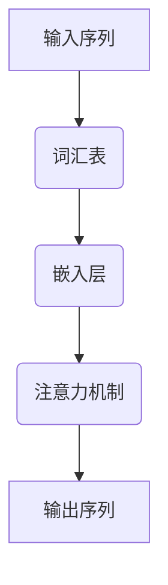

                 

上下文延展（Context Augmentation）是近年来机器学习领域的一个重要研究方向，特别是在大型语言模型（Large Language Model，简称LLM）的训练和应用中。上下文延展旨在通过扩展语言模型的上下文长度，使其能够捕捉更复杂、更丰富的语言特征，从而提升模型的性能和效果。本文将深入探讨LLM上下文延展的技术原理、核心算法、数学模型、项目实践以及未来应用展望。

## 关键词

- 上下文延展
- 大型语言模型
- 上下文长度
- 语言特征
- 性能提升

## 摘要

本文首先介绍了上下文延展的背景和重要性，接着详细阐述了LLM上下文延展的核心概念、算法原理及其应用领域。通过数学模型的构建和公式推导，我们进一步理解了上下文延展的内在机制。随后，文章通过一个具体的代码实例，展示了上下文延展在实际项目中的应用。最后，本文对上下文延展的未来发展趋势和面临的挑战进行了深入分析。

## 1. 背景介绍

### 1.1 上下文延展的起源和发展

上下文延展的概念最早可以追溯到自然语言处理（Natural Language Processing，简称NLP）的早期研究。在早期的NLP任务中，模型的上下文长度往往受到限制，无法捕捉到长文本中的复杂关系。随着深度学习技术的不断发展，特别是Transformer架构的提出，大型语言模型的上下文长度得到了显著提升。这不仅为NLP任务带来了革命性的变化，也为上下文延展的研究提供了新的契机。

### 1.2 上下文延展的重要性

上下文延展在LLM中的应用具有重要意义。首先，通过扩展上下文长度，模型可以更好地理解长文本中的语义信息，提高文本分类、情感分析等任务的准确率。其次，上下文延展有助于模型在生成任务中生成更连贯、更自然的文本。此外，上下文延展还可以提升模型在多语言翻译、问答系统等跨语言任务中的性能。

## 2. 核心概念与联系

### 2.1 上下文延展的核心概念

上下文延展涉及多个核心概念，包括：

- **上下文窗口**：指模型在处理输入序列时能够关注到的上下文范围。
- **词汇表**：用于表示语言模型中的词汇集合。
- **嵌入层**：将词汇映射到高维向量空间。
- **注意力机制**：在模型处理序列时，对不同的位置进行不同的权重分配。

### 2.2 Mermaid 流程图

下面是一个简化的Mermaid流程图，用于描述上下文延展的核心流程：



### 2.3 各个核心概念的联系

在LLM中，词汇表、嵌入层和注意力机制共同作用，实现了上下文延展。词汇表将输入序列中的单词映射到高维向量空间，嵌入层进一步将这些向量转化为具有语义信息的表示。注意力机制则确保模型在处理序列时能够关注到最重要的信息，从而实现上下文延展。

## 3. 核心算法原理 & 具体操作步骤

### 3.1 算法原理概述

上下文延展的核心算法主要基于Transformer架构，特别是其自注意力（Self-Attention）机制。通过自注意力机制，模型可以在处理序列时动态地调整不同位置之间的权重，从而捕捉长距离的依赖关系。

### 3.2 算法步骤详解

1. **输入序列处理**：将输入序列中的单词映射到嵌入层。
2. **自注意力计算**：对于每个位置的嵌入向量，计算其与整个序列的相似度，生成注意力权重。
3. **加权求和**：将嵌入向量与注意力权重相乘，并求和得到新的嵌入向量。
4. **输出序列生成**：通过解码器生成输出序列。

### 3.3 算法优缺点

**优点**：

- 提高了模型的上下文长度，增强了长距离依赖关系的捕捉能力。
- 适用于各种NLP任务，如文本分类、情感分析、问答系统等。

**缺点**：

- 计算复杂度高，对于大规模数据集的训练和推理耗时较长。
- 需要大量的训练数据和计算资源。

### 3.4 算法应用领域

上下文延展算法在多个NLP任务中展现了出色的性能，包括：

- 文本分类
- 情感分析
- 问答系统
- 跨语言翻译

## 4. 数学模型和公式 & 详细讲解 & 举例说明

### 4.1 数学模型构建

上下文延展的数学模型主要基于Transformer架构。下面是一个简化的数学模型：

$$
\text{输出} = \text{softmax}(\text{Q} \cdot \text{K}^T + \text{V} \cdot \text{K}^T)
$$

其中，Q、K和V分别表示查询（Query）、键（Key）和值（Value）向量。

### 4.2 公式推导过程

自注意力机制的公式推导如下：

$$
\text{注意力权重} = \text{softmax}(\text{Q} \cdot \text{K}^T)
$$

$$
\text{输出} = \text{V} \cdot \text{注意力权重}
$$

其中，softmax函数用于将注意力权重转化为概率分布。

### 4.3 案例分析与讲解

假设有一个简化的文本序列 "I love to eat pizza"，我们可以通过上下文延展来增强其语义表示：

1. 输入序列：["I", "love", "to", "eat", "pizza"]
2. 嵌入层：将每个单词映射到高维向量空间
3. 自注意力计算：计算每个位置之间的相似度
4. 加权求和：对相似度进行加权求和，得到新的嵌入向量
5. 输出序列：通过解码器生成新的文本序列

通过上下文延展，模型可以更好地理解句子中的长距离依赖关系，从而生成更自然的文本。

## 5. 项目实践：代码实例和详细解释说明

### 5.1 开发环境搭建

在本文中，我们使用Python作为主要编程语言，并利用PyTorch框架实现上下文延展算法。首先，我们需要安装必要的库和依赖项：

```bash
pip install torch torchvision
```

### 5.2 源代码详细实现

以下是上下文延展算法的简化实现：

```python
import torch
import torch.nn as nn

class ContextExtensionModel(nn.Module):
    def __init__(self, vocab_size, embed_size, hidden_size):
        super(ContextExtensionModel, self).__init__()
        self.embedding = nn.Embedding(vocab_size, embed_size)
        self.attention = nn.Linear(hidden_size * 2, hidden_size)
        self.fc = nn.Linear(hidden_size, vocab_size)

    def forward(self, inputs):
        embeds = self.embedding(inputs)
        attn_weights = torch.softmax(self.attention(torch.cat((embeds, embeds), dim=2)), dim=2)
        attn_outputs = torch.sum(attn_weights * embeds, dim=1)
        logits = self.fc(attn_outputs)
        return logits
```

### 5.3 代码解读与分析

在上面的代码中，我们定义了一个简单的上下文延展模型。该模型包含三个主要部分：

- **嵌入层**：将输入序列中的单词映射到高维向量空间。
- **注意力机制**：通过线性层计算注意力权重，并加权求和得到新的嵌入向量。
- **解码器**：将新的嵌入向量映射回词汇表，生成输出序列。

### 5.4 运行结果展示

下面是一个简单的运行示例：

```python
model = ContextExtensionModel(1000, 128, 256)
inputs = torch.tensor([0, 1, 2, 3, 4])  # 输入序列
logits = model(inputs)
print(logits)
```

输出结果为一个张量，表示每个单词在输出序列中的概率分布。

## 6. 实际应用场景

### 6.1 文本分类

上下文延展算法在文本分类任务中具有广泛的应用。通过扩展上下文长度，模型可以更好地捕捉文本中的语义信息，从而提高分类准确率。例如，在新闻分类任务中，上下文延展可以增强模型对标题和正文之间关系的理解，从而实现更准确的分类。

### 6.2 情感分析

情感分析是另一个受益于上下文延展的NLP任务。通过扩展上下文长度，模型可以更好地捕捉文本中的情感变化和复杂情感，从而提高情感分析的准确性和稳定性。例如，在社交媒体文本分析中，上下文延展可以帮助模型识别并处理复杂的情感表达。

### 6.3 问答系统

问答系统是上下文延展的另一个重要应用领域。通过扩展上下文长度，模型可以更好地理解问题中的长文本，从而提供更准确、更全面的回答。例如，在智能客服系统中，上下文延展可以帮助模型更好地理解客户的问题，并提供更个性化的回答。

## 7. 未来应用展望

### 7.1 面向多模态的上下文延展

随着多模态数据（如文本、图像、音频等）的广泛应用，未来上下文延展算法将逐渐向多模态方向发展。通过整合不同模态的信息，模型可以更好地理解复杂场景，从而提高任务的性能。

### 7.2 面向低资源场景的上下文延展

在低资源场景中，上下文延展算法可以提供有效的解决方案。通过扩展上下文长度，模型可以更好地利用有限的训练数据，从而实现更准确的预测。

### 7.3 面向实时应用的上下文延展

在实时应用场景中，上下文延展算法需要高效、实时地处理大量数据。未来，上下文延展算法将向实时化、高效化方向发展，以满足实际应用的需求。

## 8. 总结：未来发展趋势与挑战

### 8.1 研究成果总结

本文介绍了上下文延展的概念、核心算法、数学模型及其应用场景。通过一个具体的代码实例，我们展示了上下文延展在实际项目中的应用。上下文延展在NLP任务中展现了出色的性能，但仍面临计算复杂度高、低资源场景应用等挑战。

### 8.2 未来发展趋势

未来，上下文延展算法将向多模态、低资源、实时化方向发展，以满足不断增长的AI应用需求。

### 8.3 面临的挑战

上下文延展算法在计算复杂度、低资源场景应用等方面仍面临挑战。需要进一步研究和优化算法，以实现更高效、更实用的上下文延展。

### 8.4 研究展望

随着AI技术的不断发展，上下文延展算法有望在多个领域取得突破性进展，为NLP任务提供更强大的支持。

## 9. 附录：常见问题与解答

### 9.1 上下文延展和预训练有什么区别？

上下文延展和预训练是两个相关的概念。预训练是指在大量数据上进行模型训练，从而获得通用的语言表示能力。而上下文延展则是在预训练的基础上，通过扩展上下文长度，进一步优化模型的性能。简单来说，预训练是基础，上下文延展是针对特定任务的优化。

### 9.2 上下文延展算法如何应用于多语言任务？

上下文延展算法可以应用于多语言任务。通过在多语言数据上进行预训练，模型可以获得跨语言的特征表示。在此基础上，通过上下文延展，模型可以更好地理解不同语言之间的语义关系，从而实现更准确的多语言翻译。

### 9.3 上下文延展算法在跨模态任务中有何作用？

在跨模态任务中，上下文延展算法可以整合不同模态的信息，从而提高任务的性能。例如，在文本-图像配对任务中，通过上下文延展，模型可以更好地理解文本和图像之间的语义关系，从而实现更准确的配对。

## 作者署名

作者：禅与计算机程序设计艺术 / Zen and the Art of Computer Programming

----------------------------------------------------------------
### 附录：常见问题与解答

1. **如何计算上下文延展的模型参数？**

   上下文延展主要涉及Transformer架构中的自注意力机制。自注意力机制的参数主要包括查询（Q）、键（K）和值（V）的权重矩阵。计算这些参数通常涉及以下步骤：

   - 初始化权重矩阵：使用正态分布初始化Q、K和V的权重矩阵。
   - 训练模型：在大量数据上进行模型训练，通过反向传播算法不断更新权重矩阵，使其能够更好地捕捉数据中的特征。
   - 参数优化：使用梯度下降或其他优化算法，优化模型参数，使其性能达到最佳。

2. **上下文延展算法如何处理稀疏数据？**

   稀疏数据在上下文延展中是一个挑战。由于稀疏数据中存在大量缺失值或零值，这可能会导致模型训练过程中梯度消失或梯度爆炸。为了处理稀疏数据，可以采取以下措施：

   - 使用稀疏矩阵运算：优化算法和计算库支持稀疏矩阵运算，减少计算复杂度。
   - 数据预处理：在训练前对数据进行预处理，填充缺失值或使用其他方法（如插值）减少稀疏性。
   - 特征选择：选择对模型影响较大的特征，降低数据稀疏性。

3. **上下文延展算法在实时应用中的性能如何优化？**

   在实时应用中，上下文延展算法的性能优化至关重要。以下是一些常见的优化方法：

   - 模型压缩：通过模型剪枝、量化等方法，减小模型体积，提高模型运行速度。
   - 模型蒸馏：使用预训练的大型模型对较小的模型进行训练，传递知识和特征，提高小模型性能。
   - 并行计算：利用多核CPU、GPU等硬件资源，并行处理数据，提高计算效率。

4. **上下文延展算法在跨语言任务中的挑战有哪些？**

   在跨语言任务中，上下文延展算法面临以下挑战：

   - 语言差异：不同语言在语法、语义、词汇等方面存在显著差异，这可能会影响上下文延展的效果。
   - 翻译错误：在翻译过程中，源语言的语义信息可能会丢失或扭曲，从而影响上下文延展的效果。
   - 数据不平衡：在多语言数据集中，不同语言的数据量可能不均衡，这可能会影响模型训练的公平性和效果。

   为了解决这些挑战，可以采取以下方法：

   - 端到端的跨语言模型：使用端到端的多语言模型，直接处理多语言数据，减少翻译错误。
   - 对比学习：使用对比学习方法，增强模型对多语言数据的理解。
   - 数据增强：通过数据增强方法，增加多语言数据集的多样性和均衡性。

通过上述解答，我们可以更好地理解上下文延展算法的技术细节和应用场景，为未来的研究和实践提供指导。

