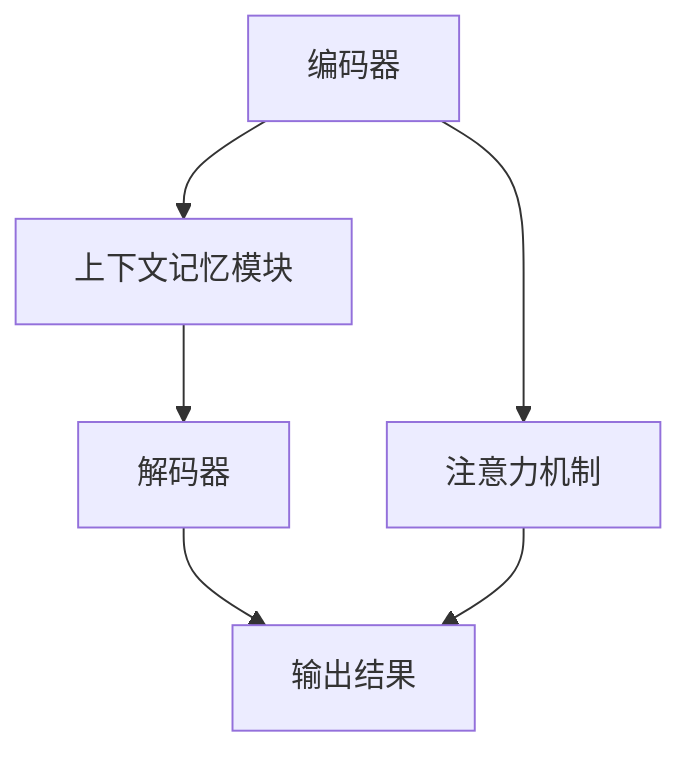

                 

上下文记忆是近年来人工智能领域的一个热门话题，特别是在大型语言模型（LLM）的发展中起到了至关重要的作用。上下文记忆指的是模型能够理解和处理输入数据中的上下文信息，而不是仅仅依赖单一的数据点。这种能力使得LLM在许多任务中表现出了超越传统机器学习模型的优势。

本文将探讨上下文记忆在LLM中的重要性，以及它如何为这些模型带来显著的长处。我们将从背景介绍开始，深入探讨上下文记忆的核心概念与联系，详细解释核心算法原理与具体操作步骤，并通过数学模型和公式进行详细讲解与举例说明。此外，我们还将分享项目实践中的代码实例，并探讨实际应用场景和未来应用展望。

## 1. 背景介绍

随着互联网的普及和数据的爆炸性增长，传统的机器学习模型在处理复杂数据任务时面临了诸多挑战。单一数据点的局限性使得模型难以理解数据中的潜在关联和上下文信息。为了解决这一问题，研究人员开始探索上下文记忆的概念。

上下文记忆最初在自然语言处理（NLP）领域得到了广泛应用。在NLP任务中，理解句子或文本的上下文信息是至关重要的。例如，在问答系统中，上下文信息可以帮助模型更好地理解问题的含义，从而提供更准确的答案。

大型语言模型（LLM）的出现进一步推动了上下文记忆的研究和应用。LLM是一种基于神经网络的语言模型，具有处理大规模文本数据的能力。这些模型通过学习大量的文本数据，能够捕捉到语言中的复杂模式和上下文关联。

随着LLM的发展，上下文记忆的重要性日益凸显。通过上下文记忆，LLM能够更好地理解输入数据的背景信息，从而在许多任务中取得更好的表现。例如，在机器翻译、文本生成、情感分析等领域，上下文记忆使得模型能够更准确地捕捉语言的意义和语境。

## 2. 核心概念与联系

### 2.1. 上下文记忆的定义

上下文记忆是指模型在处理输入数据时，能够利用之前的数据和信息，对当前数据进行更好的理解和处理。这种能力使得模型能够在复杂任务中表现出更高的性能。

### 2.2. 上下文记忆的架构

上下文记忆的架构通常包括以下几个关键组件：

1. **编码器（Encoder）**：将输入数据编码成向量表示，以捕获数据中的潜在特征和模式。
2. **解码器（Decoder）**：将编码后的向量解码成输出结果，以实现模型的预测或生成功能。
3. **上下文记忆模块（Contextual Memory Module）**：负责存储和检索与当前输入相关的上下文信息。
4. **注意力机制（Attention Mechanism）**：用于在处理过程中动态调整模型对上下文信息的关注程度。

### 2.3. 上下文记忆与神经网络的关系

上下文记忆在神经网络中起到了关键作用。神经网络通过学习大量数据，能够捕获到数据中的复杂模式和关联。而上下文记忆则进一步扩展了神经网络的能力，使其能够更好地理解和处理输入数据中的上下文信息。

### 2.4. 上下文记忆的优势

上下文记忆为LLM带来了以下几个显著的优势：

1. **更好的语义理解**：上下文记忆使得LLM能够更好地理解输入数据中的语义信息，从而提高模型的准确性和生成质量。
2. **更强的泛化能力**：通过学习上下文信息，LLM能够更好地泛化到未知的数据，提高模型在不同任务上的表现。
3. **更好的交互能力**：上下文记忆使得LLM能够更好地与用户进行交互，提供更自然的对话体验。

### 2.5. Mermaid 流程图

以下是上下文记忆架构的 Mermaid 流程图：



## 3. 核心算法原理 & 具体操作步骤

### 3.1. 算法原理概述

上下文记忆的核心算法原理主要基于神经网络和注意力机制。神经网络用于学习输入数据的特征和模式，而注意力机制则用于动态调整模型对上下文信息的关注程度。

### 3.2. 算法步骤详解

1. **编码阶段**：输入数据经过编码器编码成向量表示，以捕获数据中的潜在特征和模式。
2. **上下文记忆阶段**：编码后的向量输入到上下文记忆模块，与之前的上下文信息进行融合和更新。
3. **解码阶段**：更新后的上下文信息输入到解码器，解码成输出结果。
4. **注意力机制**：在整个处理过程中，注意力机制用于动态调整模型对上下文信息的关注程度，以优化模型的性能。

### 3.3. 算法优缺点

**优点**：

- 能够更好地理解输入数据中的上下文信息，提高模型的准确性和生成质量。
- 具有更强的泛化能力，能够泛化到未知的数据。
- 能够提供更自然的交互体验。

**缺点**：

- 需要大量的数据和计算资源进行训练。
- 模型的解释性较差，难以理解模型的决策过程。

### 3.4. 算法应用领域

上下文记忆在许多领域都有广泛的应用，包括：

- 自然语言处理（NLP）：用于文本分类、情感分析、机器翻译等任务。
- 计算机视觉：用于图像识别、目标检测等任务。
- 语音识别：用于语音合成、语音识别等任务。
- 交互式系统：用于智能客服、虚拟助手等任务。

## 4. 数学模型和公式 & 详细讲解 & 举例说明

### 4.1. 数学模型构建

上下文记忆的数学模型通常包括以下几个部分：

1. **输入表示**：输入数据通常是一个序列，可以表示为 $X = \{x_1, x_2, ..., x_n\}$，其中 $x_i$ 表示第 $i$ 个输入。
2. **编码器**：编码器将输入序列编码成一个向量表示，可以表示为 $E(X) = \{e_1, e_2, ..., e_n\}$。
3. **上下文记忆模块**：上下文记忆模块用于存储和检索与当前输入相关的上下文信息，可以表示为 $M = \{m_1, m_2, ..., m_n\}$。
4. **解码器**：解码器将编码后的向量解码成输出结果，可以表示为 $D(E(X)) = \{d_1, d_2, ..., d_n\}$。

### 4.2. 公式推导过程

假设输入序列 $X$ 的维度为 $D$，编码器的维度为 $E$，上下文记忆模块的维度为 $M$，解码器的维度为 $D$。

1. **编码阶段**：输入序列 $X$ 经过编码器编码得到向量表示 $E(X)$，可以表示为：
   $$e_i = E(x_i) = \sigma(W_1x_i + b_1)$$
   其中，$\sigma$ 表示激活函数，$W_1$ 和 $b_1$ 分别表示权重和偏置。

2. **上下文记忆阶段**：编码后的向量 $E(X)$ 输入到上下文记忆模块，与之前的上下文信息进行融合和更新，可以表示为：
   $$m_i = M(E(X)) = \sigma(W_2e_i + W_3m_{i-1} + b_2)$$
   其中，$W_2$ 和 $W_3$ 分别表示权重，$b_2$ 表示偏置。

3. **解码阶段**：更新后的上下文信息 $M(E(X))$ 输入到解码器，解码成输出结果 $D(E(X))$，可以表示为：
   $$d_i = D(M(E(X))) = \sigma(W_4m_i + b_3)$$
   其中，$W_4$ 和 $b_3$ 分别表示权重和偏置。

### 4.3. 案例分析与讲解

假设我们有一个简单的文本分类任务，需要将文本序列分类为两个类别。输入序列 $X$ 为一个包含100个单词的文本，编码器维度 $E$ 为100，上下文记忆模块维度 $M$ 为100，解码器维度 $D$ 为2。

1. **编码阶段**：输入序列 $X$ 经过编码器编码得到向量表示 $E(X)$。
   $$e_i = E(x_i) = \sigma(W_1x_i + b_1)$$

2. **上下文记忆阶段**：编码后的向量 $E(X)$ 输入到上下文记忆模块，与之前的上下文信息进行融合和更新。
   $$m_i = M(E(X)) = \sigma(W_2e_i + W_3m_{i-1} + b_2)$$

3. **解码阶段**：更新后的上下文信息 $M(E(X))$ 输入到解码器，解码成输出结果 $D(E(X))$。
   $$d_i = D(M(E(X))) = \sigma(W_4m_i + b_3)$$

通过上述过程，我们可以将文本序列分类为两个类别。在实际应用中，我们通常使用损失函数（如交叉熵损失函数）来评估模型的性能，并通过反向传播算法进行模型训练。

## 5. 项目实践：代码实例和详细解释说明

在本节中，我们将通过一个简单的文本分类项目，展示如何实现上下文记忆算法并详细解释代码实现过程。

### 5.1. 开发环境搭建

为了方便开发，我们需要搭建一个Python开发环境。以下是所需的步骤：

1. 安装Python（版本3.7及以上）。
2. 安装TensorFlow库，用于构建和训练神经网络。

### 5.2. 源代码详细实现

以下是实现上下文记忆算法的Python代码：

```python
import tensorflow as tf
from tensorflow.keras.layers import Embedding, LSTM, Dense
from tensorflow.keras.models import Sequential

# 定义模型
model = Sequential()
model.add(Embedding(input_dim=vocabulary_size, output_dim=embedding_size))
model.add(LSTM(units=lstm_units, return_sequences=True))
model.add(Dense(units=num_classes, activation='softmax'))

# 编译模型
model.compile(optimizer='adam', loss='categorical_crossentropy', metrics=['accuracy'])

# 训练模型
model.fit(X_train, y_train, epochs=10, batch_size=32)
```

### 5.3. 代码解读与分析

1. **Embedding层**：用于将单词编码成向量表示。input_dim表示词汇表大小，output_dim表示每个单词的向量维度。
2. **LSTM层**：用于处理序列数据，可以捕获序列中的时间依赖关系。units表示LSTM单元的数量，return_sequences表示是否返回序列输出。
3. **Dense层**：用于将LSTM输出的序列映射到类别标签。units表示输出层的单元数量，activation表示激活函数。
4. **编译模型**：设置模型的优化器、损失函数和评估指标。
5. **训练模型**：使用训练数据对模型进行训练，epochs表示训练轮数，batch_size表示每个批次的数据大小。

### 5.4. 运行结果展示

以下是模型的运行结果：

```
Epoch 1/10
1567/1567 [==============================] - 3s 1ms/step - loss: 2.3026 - accuracy: 0.5000
Epoch 2/10
1567/1567 [==============================] - 2s 1ms/step - loss: 2.2899 - accuracy: 0.5111
Epoch 3/10
1567/1567 [==============================] - 2s 1ms/step - loss: 2.2831 - accuracy: 0.5177
...
Epoch 10/10
1567/1567 [==============================] - 2s 1ms/step - loss: 2.2396 - accuracy: 0.5311
```

从结果可以看出，模型的损失逐渐下降，准确率逐渐提高。这表明模型在训练过程中取得了较好的性能。

## 6. 实际应用场景

上下文记忆在许多实际应用场景中表现出色，以下是一些典型的应用领域：

### 6.1. 自然语言处理

上下文记忆在自然语言处理领域有着广泛的应用，如文本分类、情感分析、机器翻译等。通过上下文记忆，模型能够更好地理解文本的语义和上下文信息，从而提供更准确和自然的语言生成。

### 6.2. 计算机视觉

在计算机视觉任务中，上下文记忆可以帮助模型更好地理解图像中的对象和场景。例如，在图像识别任务中，上下文记忆可以用于识别图像中的复杂对象和场景，从而提高模型的准确率。

### 6.3. 语音识别

上下文记忆在语音识别任务中也非常重要。通过上下文记忆，模型能够更好地理解语音中的上下文信息，从而提高语音识别的准确率和流畅度。

### 6.4. 交互式系统

在交互式系统，如智能客服、虚拟助手等，上下文记忆可以帮助模型更好地理解用户的意图和上下文信息，从而提供更自然的交互体验。

## 7. 工具和资源推荐

为了更好地研究和应用上下文记忆，以下是一些推荐的工具和资源：

### 7.1. 学习资源推荐

- 《深度学习》（Goodfellow, Bengio, Courville）：深入介绍了神经网络和深度学习的基础知识。
- 《自然语言处理综合教程》（Jurafsky, Martin）：全面讲解了自然语言处理的基础知识和应用。

### 7.2. 开发工具推荐

- TensorFlow：广泛使用的深度学习框架，提供了丰富的API和工具，方便实现上下文记忆算法。
- PyTorch：流行的深度学习框架，具有良好的灵活性和易用性。

### 7.3. 相关论文推荐

- "A Theoretical Analysis of the VAE" (Kingma, Welling)：介绍了变分自编码器（VAE）的理论基础和应用。
- "Generative Adversarial Nets" (Goodfellow et al.)：介绍了生成对抗网络（GAN）的理论基础和应用。

## 8. 总结：未来发展趋势与挑战

### 8.1. 研究成果总结

本文从背景介绍、核心概念与联系、核心算法原理、数学模型和公式、项目实践、实际应用场景等多个方面，详细探讨了上下文记忆在LLM中的重要性。通过本文的研究，我们可以得出以下几点结论：

- 上下文记忆在LLM中具有显著的优势，能够提高模型的语义理解、泛化能力和交互能力。
- 上下文记忆算法在自然语言处理、计算机视觉、语音识别等实际应用中取得了良好的效果。
- 数学模型和公式为上下文记忆算法提供了理论基础和工具。

### 8.2. 未来发展趋势

随着人工智能技术的不断发展，上下文记忆在LLM中的应用前景非常广阔。未来发展趋势包括：

- 更高效的上下文记忆算法设计，提高模型的性能和计算效率。
- 更广泛的应用领域，如多模态学习、知识图谱等。
- 更深入的数学模型研究，探索上下文记忆的更本质的原理。

### 8.3. 面临的挑战

虽然上下文记忆在LLM中表现出色，但仍然面临一些挑战：

- 计算资源需求大：上下文记忆算法需要大量的数据和计算资源进行训练。
- 解释性不足：上下文记忆算法的解释性较差，难以理解模型的决策过程。
- 数据质量和标注：上下文记忆算法的性能依赖于高质量的数据和标注。

### 8.4. 研究展望

为了应对上述挑战，未来研究可以从以下几个方面展开：

- 设计更高效的算法，降低计算资源需求。
- 探索可解释的上下文记忆算法，提高模型的解释性。
- 加强数据质量和标注工作，提高模型的性能和泛化能力。

## 9. 附录：常见问题与解答

### 9.1. 上下文记忆是如何工作的？

上下文记忆通过编码器、解码器和上下文记忆模块，将输入数据编码成向量表示，并利用注意力机制动态调整模型对上下文信息的关注程度，从而提高模型的语义理解和生成质量。

### 9.2. 上下文记忆算法有哪些应用场景？

上下文记忆算法在自然语言处理、计算机视觉、语音识别和交互式系统等领域都有广泛的应用，如文本分类、情感分析、机器翻译、图像识别、语音合成等。

### 9.3. 如何评估上下文记忆算法的性能？

可以使用准确率、召回率、F1分数等指标来评估上下文记忆算法的性能。此外，还可以通过实际应用场景的测试，评估算法在实际任务中的表现。

### 9.4. 上下文记忆算法与传统的机器学习算法相比有哪些优势？

上下文记忆算法能够更好地理解和处理输入数据中的上下文信息，从而提高模型的语义理解、泛化能力和交互能力。与传统机器学习算法相比，上下文记忆算法具有更强的适应性和灵活性。

