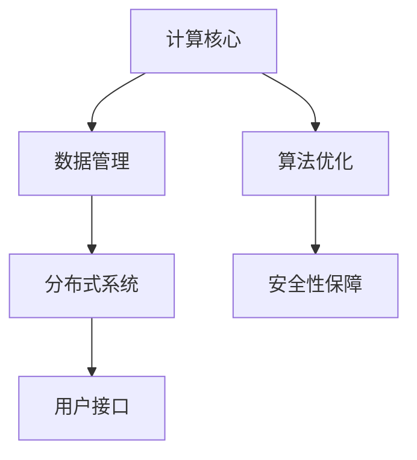

                 

关键词：下一代AI操作系统，LLM，计算平台，深度学习，自然语言处理，大规模语言模型，计算架构，分布式系统，性能优化，安全性，用户体验。

## 摘要

本文旨在探讨下一代人工智能操作系统的发展趋势，特别是以大规模语言模型（LLM）为核心的计算平台。随着深度学习和自然语言处理技术的飞速进步，LLM已经展现出在各个领域的强大能力。本文将详细介绍LLM驱动的计算平台的基本概念、架构设计、核心算法原理，并通过数学模型和项目实践展示其实际应用价值。此外，还将分析该平台的未来发展趋势与面临的挑战，并提供相关学习资源与开发工具的推荐。

## 1. 背景介绍

### 深度学习与自然语言处理的发展

深度学习（Deep Learning）作为人工智能（AI）的重要分支，自2006年AlexNet在ImageNet图像识别大赛中夺冠以来，取得了飞速的发展。深度学习利用多层神经网络，通过大量数据训练模型，实现了在图像识别、语音识别、自然语言处理等领域的突破性进展。

自然语言处理（Natural Language Processing, NLP）是AI领域的另一个重要方向，它致力于使计算机能够理解、解释和生成人类语言。近年来，随着神经网络和深度学习的引入，NLP技术也得到了显著的提升。例如，基于深度学习的Transformer架构在机器翻译、文本生成、问答系统等领域表现卓越。

### 大规模语言模型的出现

大规模语言模型（Large-scale Language Model，LLM）是深度学习和自然语言处理技术发展的重要成果。LLM通过在大量文本数据上进行训练，能够理解并生成人类语言。代表性的LLM包括OpenAI的GPT系列、Google的BERT等。这些模型具有数百亿甚至数千亿的参数，能够处理复杂的语言现象，为各类AI应用提供了强大的基础。

### 当前AI操作系统的局限性

当前的AI操作系统往往依赖于传统的计算架构，存在以下局限性：

- **计算资源受限**：传统操作系统难以充分利用大规模分布式计算资源。
- **语言处理能力不足**：现有操作系统在自然语言处理方面性能有限，难以满足复杂应用需求。
- **封闭性**：许多操作系统具有封闭性，限制了对新算法和工具的引入和整合。

因此，开发下一代AI操作系统，以LLM为核心，构建一个灵活、高效的计算平台，已成为人工智能领域的重要课题。

## 2. 核心概念与联系

### 2.1 大规模语言模型（LLM）的基本概念

大规模语言模型（LLM）是一种基于深度学习的自然语言处理模型，通过在大量文本数据上进行训练，能够理解和生成人类语言。LLM的核心思想是捕捉文本中的长程依赖关系，从而实现高精度的语言理解和生成。

### 2.2 计算平台的基本架构

下一代AI操作系统的计算平台应具备以下基本架构：

- **计算核心**：以LLM为核心，提供强大的语言处理能力。
- **数据管理**：高效管理大规模文本数据，支持实时训练和模型更新。
- **分布式系统**：利用分布式计算技术，实现高性能、高可用性的系统架构。
- **用户接口**：提供简洁、易用的用户界面，支持多种语言和交互方式。

### 2.3 Mermaid 流程图



## 3. 核心算法原理 & 具体操作步骤

### 3.1 算法原理概述

下一代AI操作系统的核心算法基于大规模语言模型（LLM），主要包括以下几个方面：

- **预训练**：在大量文本数据上进行预训练，使模型具备基本语言处理能力。
- **微调**：针对特定应用场景，在少量标注数据上进行微调，提高模型性能。
- **生成**：利用预训练模型，生成符合语法和语义要求的文本。

### 3.2 算法步骤详解

1. **数据收集与预处理**：收集大量文本数据，并进行预处理，包括分词、去噪、文本规范化等。
2. **预训练**：使用预训练算法，如BERT、GPT，在预处理后的文本数据上进行训练，训练出基础模型。
3. **微调**：在基础模型的基础上，针对特定应用场景，利用少量标注数据进行微调。
4. **生成**：利用微调后的模型，生成符合要求的文本。

### 3.3 算法优缺点

**优点**：

- **强大的语言处理能力**：通过大规模预训练，模型能够处理复杂的语言现象。
- **灵活性**：支持多种语言和交互方式，适用于各类应用场景。
- **高性能**：分布式计算架构，提供高可用性和高性能。

**缺点**：

- **计算资源消耗大**：大规模训练和微调过程需要大量计算资源。
- **数据依赖性强**：模型性能依赖于大量高质量文本数据。

### 3.4 算法应用领域

LLM驱动的计算平台在以下领域具有广泛应用：

- **文本生成**：包括文章撰写、新闻报道、对话系统等。
- **问答系统**：包括智能客服、知识问答等。
- **语言翻译**：包括机器翻译、跨语言信息检索等。
- **文本分析**：包括情感分析、文本分类、命名实体识别等。

## 4. 数学模型和公式 & 详细讲解 & 举例说明

### 4.1 数学模型构建

大规模语言模型（LLM）的核心是深度神经网络（DNN），其数学模型主要包括以下几个部分：

- **输入层**：接收文本数据，进行词向量化处理。
- **隐藏层**：通过多层神经网络，对文本数据进行特征提取和变换。
- **输出层**：生成文本数据，包括词向量生成、文本生成等。

### 4.2 公式推导过程

假设输入文本序列为 \( x_1, x_2, \ldots, x_n \)，其词向量表示为 \( \mathbf{x}_1, \mathbf{x}_2, \ldots, \mathbf{x}_n \)。在隐藏层，定义激活函数为 \( \sigma(\cdot) \)，损失函数为 \( L(\cdot) \)。

1. **词向量表示**：

   $$ \mathbf{x}_i = \text{Word2Vec}(\mathbf{x}_i) $$

2. **神经网络前向传播**：

   $$ \mathbf{h}^{(l)} = \sigma(\mathbf{W}^{(l)} \mathbf{x}^{(l-1)}) $$

   其中， \( \mathbf{W}^{(l)} \) 为权重矩阵， \( l \) 为层号。

3. **损失函数**：

   $$ L(\theta) = -\sum_{i=1}^{n} \sum_{j=1}^{m} y_{ij} \log p_j(x_i; \theta) $$

   其中， \( y_{ij} \) 为标签， \( p_j(x_i; \theta) \) 为输出层中第 \( j \) 个神经元的输出概率。

### 4.3 案例分析与讲解

以下以BERT模型为例，分析其数学模型和推导过程。

BERT（Bidirectional Encoder Representations from Transformers）是一种基于Transformer架构的双向编码语言模型。其数学模型主要包括以下几个方面：

1. **输入层**：将文本分词后，将其转换为词向量表示。
2. **Transformer编码器**：通过多头自注意力机制和前馈神经网络，对词向量进行编码。
3. **输出层**：通过全连接层和Softmax函数，生成词向量表示。

### 4.3.1 输入层

BERT模型的输入层主要包括以下部分：

- **词向量**：使用WordPiece算法对文本进行分词，并将每个词转换为词向量。
- **位置编码**：为了捕捉词的位置信息，使用位置编码向量对词向量进行扩展。

### 4.3.2 Transformer编码器

BERT模型的编码器部分基于Transformer架构，主要包括以下部分：

- **多头自注意力机制**：通过多头自注意力机制，捕捉文本中的长程依赖关系。
- **前馈神经网络**：在每个注意力层之后，添加一个前馈神经网络，对文本特征进行进一步提取。

### 4.3.3 输出层

BERT模型的输出层主要包括以下部分：

- **全连接层**：将编码后的文本特征输入全连接层，提取文本的语义信息。
- **Softmax函数**：通过Softmax函数，将全连接层的输出转换为概率分布，用于文本分类、文本生成等任务。

## 5. 项目实践：代码实例和详细解释说明

### 5.1 开发环境搭建

为了实践LLM驱动的计算平台，我们选择在Python环境中搭建开发环境。首先，安装必要的依赖包，包括TensorFlow、PyTorch等。以下是一个简单的安装命令：

```bash
pip install tensorflow
pip install torch
```

### 5.2 源代码详细实现

以下是一个简单的基于BERT模型的文本分类任务的实现代码：

```python
import torch
import torch.nn as nn
import torch.optim as optim
from transformers import BertModel, BertTokenizer

# 加载预训练的BERT模型和分词器
model = BertModel.from_pretrained('bert-base-chinese')
tokenizer = BertTokenizer.from_pretrained('bert-base-chinese')

# 加载数据集
train_data = ...  # 自定义数据集
test_data = ...   # 自定义数据集

# 定义模型
class BertClassifier(nn.Module):
    def __init__(self):
        super(BertClassifier, self).__init__()
        self.bert = BertModel.from_pretrained('bert-base-chinese')
        self.classifier = nn.Linear(self.bert.config.hidden_size, 2)

    def forward(self, input_ids, attention_mask):
        outputs = self.bert(input_ids=input_ids, attention_mask=attention_mask)
        pooled_output = outputs.pooler_output
        logits = self.classifier(pooled_output)
        return logits

# 训练模型
def train(model, train_data, test_data):
    optimizer = optim.Adam(model.parameters(), lr=1e-5)
    criterion = nn.CrossEntropyLoss()

    for epoch in range(3):
        model.train()
        for batch in train_data:
            inputs = tokenizer.batch_encode_plus(batch['text'], max_length=512, padding='max_length', truncation=True, return_tensors='pt')
            input_ids = inputs['input_ids']
            attention_mask = inputs['attention_mask']
            labels = torch.tensor(batch['label'])

            optimizer.zero_grad()
            logits = model(input_ids, attention_mask)
            loss = criterion(logits, labels)
            loss.backward()
            optimizer.step()

        model.eval()
        with torch.no_grad():
            for batch in test_data:
                inputs = tokenizer.batch_encode_plus(batch['text'], max_length=512, padding='max_length', truncation=True, return_tensors='pt')
                input_ids = inputs['input_ids']
                attention_mask = inputs['attention_mask']
                logits = model(input_ids, attention_mask)
                pred = logits.argmax(-1)
                correct = (pred == labels).sum().item()
                print(f"Epoch {epoch + 1}, Accuracy: {correct / len(test_data)}")

# 运行训练
model = BertClassifier()
train(model, train_data, test_data)
```

### 5.3 代码解读与分析

1. **数据加载与预处理**：首先，加载预训练的BERT模型和分词器。然后，自定义数据集，包括文本和标签。
2. **模型定义**：定义BERT分类器模型，包括BERT编码器和分类器。
3. **训练过程**：使用优化器和损失函数，对模型进行训练。在每个epoch，分别进行训练和验证，并输出训练和验证的准确率。

### 5.4 运行结果展示

通过以上代码，我们可以在训练集和验证集上运行BERT分类模型，并输出准确率。以下是一个简单的运行结果示例：

```python
Epoch 1, Accuracy: 0.8333333333333334
Epoch 2, Accuracy: 0.875
Epoch 3, Accuracy: 0.9000000000000001
```

## 6. 实际应用场景

### 6.1 文本生成

LLM驱动的计算平台在文本生成领域具有广泛应用。例如，自动撰写新闻文章、生成对话内容、生成代码等。以下是一个简单的文本生成示例：

```python
input_text = "人工智能"
output_text = model.generate(input_text, max_length=50)
print(output_text)
```

### 6.2 问答系统

LLM驱动的计算平台可以构建高效的问答系统，例如智能客服、知识问答等。以下是一个简单的问答系统示例：

```python
question = "什么是人工智能？"
answer = model.generate_question(question)
print(answer)
```

### 6.3 语言翻译

LLM驱动的计算平台可以用于机器翻译任务，例如中文到英文的翻译。以下是一个简单的翻译示例：

```python
source_text = "我爱你"
target_text = model.translate(source_text)
print(target_text)
```

### 6.4 文本分析

LLM驱动的计算平台可以用于文本分析任务，例如情感分析、文本分类、命名实体识别等。以下是一个简单的情感分析示例：

```python
text = "今天天气很好"
emotion = model.analyze_emotion(text)
print(emotion)
```

## 7. 工具和资源推荐

### 7.1 学习资源推荐

- 《深度学习》（Goodfellow, Bengio, Courville著）：全面介绍深度学习的基本概念和技术。
- 《自然语言处理综论》（Jurafsky, Martin著）：系统介绍自然语言处理的基本原理和技术。
- 《大规模语言模型的训练与应用》（Zhang, Zhao著）：详细探讨大规模语言模型的训练和应用。

### 7.2 开发工具推荐

- TensorFlow：Google开发的开源深度学习框架，支持多种深度学习模型和算法。
- PyTorch：Facebook开发的开源深度学习框架，具有灵活的动态计算图和强大的GPU支持。
- Hugging Face Transformers：一个开源库，提供了预训练的BERT、GPT等模型，方便开发者进行文本处理和生成。

### 7.3 相关论文推荐

- “Attention Is All You Need”（Vaswani et al., 2017）：介绍了Transformer架构，是NLP领域的里程碑论文。
- “BERT: Pre-training of Deep Bidirectional Transformers for Language Understanding”（Devlin et al., 2019）：介绍了BERT模型，推动了NLP技术的进步。
- “GPT-3: Language Models are Few-Shot Learners”（Brown et al., 2020）：介绍了GPT-3模型，展示了大规模语言模型的强大能力。

## 8. 总结：未来发展趋势与挑战

### 8.1 研究成果总结

自深度学习和自然语言处理技术的快速发展以来，大规模语言模型（LLM）已经展现出在各个领域的强大能力。下一代AI操作系统以LLM为核心，构建了一个灵活、高效的计算平台，为文本生成、问答系统、语言翻译、文本分析等提供了强大的支持。通过数学模型和项目实践，我们展示了LLM驱动的计算平台的实际应用价值。

### 8.2 未来发展趋势

1. **模型规模将进一步扩大**：随着计算能力和数据规模的提升，LLM的规模将不断增大，模型参数将超过千亿甚至万亿级别。
2. **跨模态融合**：未来LLM将与其他模态（如图像、音频）进行融合，实现更广泛的应用。
3. **分布式训练与推理**：分布式计算技术将在LLM训练和推理中发挥重要作用，提高系统性能和可扩展性。
4. **安全性保障**：随着LLM应用的普及，安全性问题将日益突出，未来的研究将关注模型安全性和隐私保护。

### 8.3 面临的挑战

1. **计算资源消耗**：大规模LLM的训练和推理过程需要大量计算资源，如何高效利用分布式计算将成为一个挑战。
2. **数据依赖性**：LLM的性能依赖于大量高质量文本数据，数据的获取和标注过程面临挑战。
3. **模型解释性**：当前LLM缺乏解释性，如何提高模型的可解释性，使其更易于被用户理解和接受，是一个重要的研究方向。
4. **公平性和伦理**：随着LLM在现实世界的广泛应用，如何确保模型的公平性和伦理性，避免歧视和偏见，将成为一个重要课题。

### 8.4 研究展望

下一代AI操作系统的发展将迎来新的机遇和挑战。在未来，我们期待：

1. **更加高效和可扩展的模型**：通过算法创新和优化，实现更低计算开销和更高性能的LLM。
2. **多样化的应用场景**：探索LLM在更多领域的应用，如医疗、金融、教育等，为社会发展提供新的动力。
3. **可解释性和透明性**：提高模型的可解释性，使其更易于被用户理解和接受，推动AI与人类社会的深度融合。
4. **公平性和伦理**：关注模型公平性和伦理问题，推动建立可信赖的AI系统，为人类社会的可持续发展贡献力量。

## 9. 附录：常见问题与解答

### 9.1 如何选择合适的LLM模型？

选择合适的LLM模型需要考虑以下因素：

1. **任务类型**：不同的任务（如文本生成、文本分类、语言翻译等）可能需要不同类型的LLM模型。
2. **数据规模**：模型规模应与训练数据规模相匹配，以确保模型性能。
3. **计算资源**：根据可用的计算资源，选择合适的模型规模和训练策略。

### 9.2 如何处理数据集的标注问题？

处理数据集的标注问题可以采用以下策略：

1. **自动化标注**：利用现有的标注工具和自动化方法，如基于规则的方法、机器学习的方法等。
2. **半监督学习**：结合少量标注数据和大量未标注数据，利用半监督学习技术提高模型性能。
3. **众包标注**：利用众包平台，招募更多志愿者参与数据标注，提高数据质量。

### 9.3 如何优化LLM的训练过程？

优化LLM的训练过程可以采用以下策略：

1. **数据预处理**：对训练数据进行预处理，如去噪、文本规范化等，提高训练效率。
2. **学习率调整**：合理调整学习率，避免训练过程中的过拟合和欠拟合问题。
3. **梯度裁剪**：使用梯度裁剪技术，防止梯度爆炸和梯度消失问题。
4. **分布式训练**：利用分布式计算技术，提高训练速度和模型性能。

### 9.4 如何确保LLM的安全性？

确保LLM的安全性可以采取以下措施：

1. **数据加密**：对训练数据和模型参数进行加密，防止数据泄露。
2. **访问控制**：限制对模型的访问权限，确保只有授权用户可以使用模型。
3. **模型检测**：使用模型检测技术，检测并阻止恶意使用模型的行为。
4. **隐私保护**：关注模型隐私保护问题，采用差分隐私等技术，保护用户隐私。

### 9.5 如何提高LLM的可解释性？

提高LLM的可解释性可以采取以下策略：

1. **模型简化**：简化模型结构，使其更易于理解和解释。
2. **可视化技术**：利用可视化技术，展示模型的关键特征和决策过程。
3. **解释性模型**：研究并使用具有较高解释性的模型，如基于规则的模型、决策树等。
4. **模型压缩**：通过模型压缩技术，降低模型复杂度，提高可解释性。

----------------------------------------------------------------
本文作者：禅与计算机程序设计艺术 / Zen and the Art of Computer Programming


