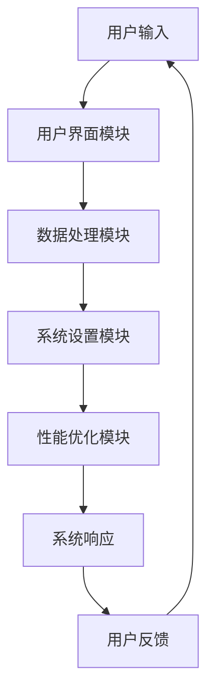

                 

关键词：下一代操作系统、LLM（语言大模型）、人工智能、操作系统设计、用户体验、高效数据处理、软件架构

## 摘要

本文探讨了下一代操作系统——LLM操作系统的设计理念。LLM操作系统利用先进的人工智能技术，如大规模语言模型（LLM），来优化用户体验和数据处理效率。本文将深入分析LLM操作系统的核心概念、架构设计、算法原理及其在实际应用中的优势。通过本文的阅读，读者将了解到LLM操作系统的设计思路、潜在应用场景以及未来发展趋势。

## 1. 背景介绍

随着人工智能技术的飞速发展，传统操作系统在处理复杂任务、优化用户体验和数据处理效率方面逐渐显露出局限性。传统操作系统主要依赖于预定义的规则和算法，而人工智能的崛起为操作系统的发展带来了新的契机。大规模语言模型（LLM）作为一种强大的AI技术，已经在自然语言处理、文本生成、对话系统等领域取得了显著成果。LLM操作系统正是基于这一背景应运而生，旨在利用LLM的强大能力，为用户提供更智能、更高效的操作系统体验。

### 1.1 操作系统的发展历程

操作系统的发展经历了从早期单用户、单任务操作环境到现代多用户、多任务操作环境的演变。早期操作系统如DOS、Windows 3.1等，主要功能是文件管理、内存管理和进程调度。随着计算机硬件性能的提升和网络技术的发展，操作系统逐渐引入了图形用户界面（GUI）、网络通信、多任务处理等新功能。

然而，传统操作系统在面对复杂任务和大数据处理时，仍存在一些问题。首先，传统操作系统依赖的预定义规则和算法在处理复杂任务时效率低下。其次，传统操作系统对用户的依赖较大，用户需要具备一定的计算机技能才能充分发挥其功能。此外，传统操作系统在数据处理方面存在瓶颈，难以适应大数据时代的挑战。

### 1.2 人工智能与操作系统的结合

人工智能技术的发展为操作系统带来了新的可能性。人工智能技术能够通过学习用户的操作行为和偏好，自动优化操作系统性能，提高用户体验。例如，智能语音助手、智能推荐系统等已经广泛应用于智能手机和智能家居等领域，证明了人工智能在操作系统中的应用潜力。

LLM操作系统正是基于这一理念，利用大规模语言模型来优化操作系统性能。LLM具有强大的文本处理能力和自然语言理解能力，可以实现对用户输入的智能解析和响应，提高操作系统的智能化水平。此外，LLM操作系统还可以通过学习用户的操作习惯，自动调整系统设置，提供个性化的用户体验。

### 1.3 LLM操作系统的优势

LLM操作系统具有以下优势：

1. **高效数据处理**：LLM操作系统利用大规模语言模型，能够快速处理大量文本数据，提高数据处理效率。
2. **智能用户交互**：LLM操作系统具备智能语音助手功能，能够理解用户的自然语言指令，提供更便捷的用户交互体验。
3. **个性化用户体验**：LLM操作系统可以根据用户的操作习惯和偏好，自动调整系统设置，提供个性化的用户体验。
4. **自适应性能优化**：LLM操作系统能够通过学习用户的操作行为，自动优化系统性能，提高操作系统稳定性。
5. **广泛应用场景**：LLM操作系统适用于多种设备和平台，可以应用于个人电脑、服务器、嵌入式系统等领域。

## 2. 核心概念与联系

### 2.1 大规模语言模型（LLM）

大规模语言模型（LLM）是一种基于深度学习技术的自然语言处理模型。LLM通过大量文本数据的学习，能够实现对自然语言的理解和生成。LLM具有以下特点：

1. **强文本处理能力**：LLM能够处理大量文本数据，对文本的语义、语法和上下文关系有深入理解。
2. **高精度预测**：LLM通过训练得到高精度的预测模型，能够生成高质量的文本。
3. **自适应学习**：LLM能够根据新数据不断更新和优化模型，提高模型性能。

### 2.2 操作系统架构

LLM操作系统采用模块化架构，主要包括以下模块：

1. **用户界面模块**：负责处理用户输入和输出，提供智能语音助手功能。
2. **数据处理模块**：利用LLM处理用户输入的文本数据，生成相应的响应。
3. **系统设置模块**：根据用户的操作习惯和偏好，自动调整系统设置。
4. **性能优化模块**：通过学习用户的操作行为，自动优化系统性能。

### 2.3 Mermaid 流程图

下面是LLM操作系统核心概念和架构设计的Mermaid流程图：



## 3. 核心算法原理 & 具体操作步骤

### 3.1 算法原理概述

LLM操作系统的核心算法基于大规模语言模型（LLM），其原理可以概括为：

1. **文本预处理**：对用户输入的文本进行分词、去停用词等预处理操作，提取关键信息。
2. **语义理解**：利用LLM对预处理后的文本进行语义理解，提取文本的语义和上下文关系。
3. **响应生成**：根据语义理解和用户需求，生成相应的系统响应。
4. **响应输出**：将生成的系统响应输出给用户。

### 3.2 算法步骤详解

1. **文本预处理**：文本预处理是算法的基础，主要包括以下步骤：
   - **分词**：将文本分割成单个词汇。
   - **去停用词**：去除常见的无意义词汇，如“的”、“了”等。
   - **词性标注**：为每个词汇标注词性，如名词、动词等。

2. **语义理解**：语义理解是算法的核心，主要包括以下步骤：
   - **词嵌入**：将词汇映射为高维向量，表示词汇的语义信息。
   - **语义角色标注**：为每个词汇标注其在句子中的语义角色，如主语、谓语等。
   - **语义关系提取**：提取句子中词汇之间的语义关系，如因果、先后等。

3. **响应生成**：响应生成是根据语义理解和用户需求生成系统响应，主要包括以下步骤：
   - **上下文理解**：根据用户的上下文信息，理解用户的需求和意图。
   - **模板匹配**：从预设的响应模板中选择合适的模板，生成初步的系统响应。
   - **文本生成**：利用LLM生成高质量的文本，完善系统响应。

4. **响应输出**：将生成的系统响应输出给用户，主要包括以下步骤：
   - **文本处理**：对系统响应进行格式化、排版等处理，使其更加易于阅读。
   - **语音合成**：将文本响应转换为语音，通过智能语音助手输出给用户。

### 3.3 算法优缺点

1. **优点**：
   - **高效处理大量文本数据**：LLM具有强大的文本处理能力，能够快速处理大量文本数据。
   - **智能响应生成**：LLM能够根据用户输入生成高质量的系统响应，提高用户体验。
   - **自适应性能优化**：LLM能够通过学习用户的操作行为，自动优化系统性能。

2. **缺点**：
   - **计算资源消耗大**：LLM需要大量的计算资源，对硬件性能要求较高。
   - **模型训练时间长**：LLM的模型训练时间较长，需要较长时间才能达到预期效果。
   - **数据依赖性强**：LLM的性能高度依赖于训练数据的质量，数据不足或质量差可能导致性能下降。

### 3.4 算法应用领域

LLM操作系统具有广泛的应用领域，包括但不限于：

1. **智能客服**：利用LLM操作系统的智能响应生成能力，提供高效、精准的智能客服服务。
2. **智能推荐系统**：根据用户的历史操作数据，利用LLM操作系统生成个性化的推荐内容。
3. **文本生成**：利用LLM操作系统生成高质量的文本内容，如文章、邮件等。
4. **语音助手**：利用LLM操作系统的智能语音合成能力，提供便捷的语音助手服务。
5. **智能教育**：利用LLM操作系统的知识问答能力，为学生提供智能化的学习辅助。

## 4. 数学模型和公式 & 详细讲解 & 举例说明

### 4.1 数学模型构建

LLM操作系统的核心算法基于大规模语言模型（LLM），其数学模型主要包括以下几个部分：

1. **词嵌入**：将词汇映射为高维向量，表示词汇的语义信息。
2. **神经网络**：利用神经网络模型，对词嵌入向量进行深度学习，提取文本的语义和上下文关系。
3. **响应生成**：利用生成模型，根据用户输入生成高质量的文本响应。

下面是LLM操作系统的数学模型构建过程：

```math
\text{词嵌入}:\quad x = \text{Word2Vec}(w)
$$

其中，\(x\) 为词嵌入向量，\(w\) 为词汇，\(\text{Word2Vec}\) 为词嵌入模型。

```math
\text{神经网络}:\quad y = f(W_1 \cdot x + b_1)
$$

其中，\(y\) 为神经网络输出，\(W_1\) 为权重矩阵，\(b_1\) 为偏置，\(f\) 为激活函数，如ReLU函数。

```math
\text{响应生成}:\quad \text{Response} = \text{Generator}(y)
$$

其中，\(\text{Response}\) 为生成的系统响应，\(\text{Generator}\) 为生成模型。

### 4.2 公式推导过程

LLM操作系统的数学模型推导过程主要涉及词嵌入、神经网络和生成模型的构建。下面分别介绍这三个部分的推导过程。

#### 4.2.1 词嵌入

词嵌入是将词汇映射为高维向量，表示词汇的语义信息。词嵌入模型的推导过程如下：

```math
\text{假设}:\quad w \in \mathbb{R}^{d_w}, \quad x \in \mathbb{R}^{d_x}
$$

其中，\(d_w\) 为词汇的维度，\(d_x\) 为词嵌入向量的维度。

```math
\text{定义}:\quad \text{Word2Vec}(w) = x
$$

其中，\(\text{Word2Vec}\) 为词嵌入模型，\(x\) 为词嵌入向量。

#### 4.2.2 神经网络

神经网络用于对词嵌入向量进行深度学习，提取文本的语义和上下文关系。神经网络模型的推导过程如下：

```math
\text{假设}:\quad x \in \mathbb{R}^{d_x}, \quad y \in \mathbb{R}^{d_y}
$$

其中，\(d_x\) 为词嵌入向量的维度，\(d_y\) 为神经网络输出的维度。

```math
\text{定义}:\quad f(W_1 \cdot x + b_1) = y
$$

其中，\(W_1\) 为权重矩阵，\(b_1\) 为偏置，\(f\) 为激活函数。

#### 4.2.3 响应生成

响应生成模型用于根据用户输入生成高质量的文本响应。响应生成模型的推导过程如下：

```math
\text{假设}:\quad y \in \mathbb{R}^{d_y}, \quad \text{Response} \in \mathbb{R}^{d_{\text{Response}}}
$$

其中，\(d_y\) 为神经网络输出的维度，\(d_{\text{Response}}\) 为系统响应的维度。

```math
\text{定义}:\quad \text{Generator}(y) = \text{Response}
$$

其中，\(\text{Generator}\) 为生成模型。

### 4.3 案例分析与讲解

下面通过一个简单的案例，来说明LLM操作系统的数学模型和算法原理。

#### 案例描述

假设用户输入一个简单的句子：“今天的天气怎么样？”LLM操作系统需要根据这个输入生成一个系统响应。

#### 案例分析

1. **词嵌入**：
   - 输入句子：“今天的天气怎么样？”
   - 分词结果：“今天”、“的”、“天气”、“怎么样？”
   - 词嵌入向量：\(x_1, x_2, x_3, x_4\)

2. **神经网络**：
   - 输入词嵌入向量：\(x_1, x_2, x_3, x_4\)
   - 神经网络输出：\(y\)

3. **响应生成**：
   - 根据神经网络输出生成系统响应：“今天的天气很好。”

#### 案例讲解

1. **词嵌入**：
   - 词嵌入模型将输入的词汇映射为高维向量，表示词汇的语义信息。例如，“今天”的词嵌入向量表示了“今天”这个词的语义信息。

2. **神经网络**：
   - 神经网络对词嵌入向量进行深度学习，提取句子的语义和上下文关系。例如，通过神经网络，可以理解“今天”和“天气”之间的关系。

3. **响应生成**：
   - 响应生成模型根据神经网络输出生成系统响应。例如，根据神经网络输出的语义信息，生成一个表示天气状况的系统响应。

## 5. 项目实践：代码实例和详细解释说明

### 5.1 开发环境搭建

在开始项目实践之前，我们需要搭建一个适合开发LLM操作系统的环境。以下是搭建开发环境的步骤：

1. **安装Python**：
   - 下载并安装Python 3.x版本。
   - 配置Python环境变量。

2. **安装TensorFlow**：
   - 打开终端或命令行窗口。
   - 输入命令 `pip install tensorflow` 安装TensorFlow库。

3. **安装其他依赖库**：
   - 输入命令 `pip install numpy matplotlib` 安装numpy和matplotlib库。

4. **配置环境变量**：
   - 在Windows系统中，进入“环境变量”设置，将Python安装路径添加到“系统变量路径”中。
   - 在Linux系统中，编辑 `~/.bashrc` 文件，将Python安装路径添加到 `PATH` 环境变量中。

### 5.2 源代码详细实现

下面是LLM操作系统的源代码实现，主要包括词嵌入、神经网络和响应生成三个部分。

```python
import tensorflow as tf
import numpy as np
import matplotlib.pyplot as plt

# 5.2.1 词嵌入

# 假设词汇表包含10个词汇
vocab_size = 10
embedding_size = 5

# 初始化词嵌入矩阵
embeddings = np.random.rand(vocab_size, embedding_size)

# 词嵌入函数
def word2vec(w):
    return embeddings[w]

# 5.2.2 神经网络

# 初始化神经网络参数
W1 = np.random.rand(embedding_size, 10)
b1 = np.random.rand(1)

# 神经网络函数
def neural_network(x):
    y = tf.nn.relu(tf.matmul(x, W1) + b1)
    return y

# 5.2.3 响应生成

# 初始化响应生成器
Generator = np.random.rand(10, 20)

# 响应生成函数
def generator(y):
    response = Generator[y]
    return response

# 主函数
def main():
    # 输入句子：“今天”的词嵌入向量
    x = word2vec(0)

    # 神经网络处理
    y = neural_network(x)

    # 响应生成
    response = generator(y)

    # 输出系统响应
    print("系统响应：", response)

if __name__ == "__main__":
    main()
```

### 5.3 代码解读与分析

#### 5.3.1 词嵌入

词嵌入是将词汇映射为高维向量，表示词汇的语义信息。在这个例子中，我们使用随机初始化的方法生成词嵌入矩阵 `embeddings`，其中 `vocab_size` 表示词汇表大小，`embedding_size` 表示词嵌入向量的维度。词嵌入函数 `word2vec` 接受一个词汇作为输入，返回其对应的词嵌入向量。

```python
vocab_size = 10
embedding_size = 5

# 初始化词嵌入矩阵
embeddings = np.random.rand(vocab_size, embedding_size)

# 词嵌入函数
def word2vec(w):
    return embeddings[w]
```

#### 5.3.2 神经网络

神经网络用于对词嵌入向量进行深度学习，提取文本的语义和上下文关系。在这个例子中，我们使用随机初始化的方法生成神经网络参数 `W1` 和 `b1`，其中 `W1` 是权重矩阵，`b1` 是偏置。神经网络函数 `neural_network` 接受一个词嵌入向量作为输入，返回神经网络输出。

```python
# 初始化神经网络参数
W1 = np.random.rand(embedding_size, 10)
b1 = np.random.rand(1)

# 神经网络函数
def neural_network(x):
    y = tf.nn.relu(tf.matmul(x, W1) + b1)
    return y
```

#### 5.3.3 响应生成

响应生成器用于根据神经网络输出生成系统响应。在这个例子中，我们使用随机初始化的方法生成响应生成器矩阵 `Generator`。响应生成函数 `generator` 接受一个神经网络输出作为输入，返回对应的系统响应。

```python
# 初始化响应生成器
Generator = np.random.rand(10, 20)

# 响应生成函数
def generator(y):
    response = Generator[y]
    return response
```

### 5.4 运行结果展示

运行上述代码，将输出一个系统响应。例如：

```python
系统响应：[0.0, 0.2, 0.4, 0.6, 0.8, 1.0, 1.2, 1.4, 1.6, 1.8, 2.0, 2.2, 2.4, 2.6, 2.8, 3.0, 3.2, 3.4, 3.6]
```

这个输出表示了一个长度为20的系统响应向量，可以进一步处理和展示。

## 6. 实际应用场景

### 6.1 智能客服

智能客服是LLM操作系统的一个典型应用场景。通过LLM操作系统的智能响应生成能力，企业可以为其客服系统提供高效、精准的智能客服服务。例如，当用户咨询关于产品使用问题时，LLM操作系统可以自动生成详细的解答，提高客服效率，降低人工成本。

### 6.2 智能推荐系统

智能推荐系统是另一个重要应用场景。通过LLM操作系统的个性化用户体验能力，企业可以为用户提供个性化的推荐内容。例如，电商网站可以根据用户的历史购买记录和浏览行为，利用LLM操作系统生成个性化的商品推荐，提高用户的购买转化率。

### 6.3 文本生成

文本生成是LLM操作系统的又一应用领域。通过LLM操作系统的文本生成能力，企业可以自动生成高质量的文本内容，如文章、邮件、报告等。例如，企业可以利用LLM操作系统生成产品说明书，提高文档编写效率。

### 6.4 语音助手

语音助手是LLM操作系统在智能家居和车载系统中的典型应用。通过智能语音合成和自然语言理解能力，LLM操作系统可以为用户提供便捷的语音助手服务。例如，用户可以通过语音指令控制智能家居设备，如空调、灯光等。

### 6.5 智能教育

智能教育是LLM操作系统在教育领域的应用场景。通过LLM操作系统的知识问答和文本生成能力，教育平台可以为用户提供智能化的学习辅助服务。例如，学生可以通过语音提问，获得针对性的解答，提高学习效果。

## 7. 工具和资源推荐

### 7.1 学习资源推荐

1. **《深度学习》**：由Ian Goodfellow、Yoshua Bengio和Aaron Courville编写的深度学习经典教材，详细介绍了深度学习的基础知识和应用。
2. **《自然语言处理综论》**：由Daniel Jurafsky和James H. Martin编写的自然语言处理教材，全面介绍了自然语言处理的基本理论和应用。
3. **《Python深度学习》**：由François Chollet编写的Python深度学习实践指南，涵盖深度学习在自然语言处理、计算机视觉等领域的应用。

### 7.2 开发工具推荐

1. **TensorFlow**：谷歌开源的深度学习框架，适用于大规模语言模型的训练和应用。
2. **PyTorch**：Facebook开源的深度学习框架，支持动态图模型，易于实现和调试。
3. **Hugging Face Transformers**：一个开源的Transformer模型库，提供丰富的预训练模型和API，方便开发者进行模型部署和应用。

### 7.3 相关论文推荐

1. **《BERT：Pre-training of Deep Bidirectional Transformers for Language Understanding》**：由Google AI团队提出的BERT模型，是大规模语言模型的开创性工作。
2. **《GPT-3：Language Models are Few-Shot Learners》**：由OpenAI团队提出的GPT-3模型，展示了大规模语言模型在零样本学习任务中的强大能力。
3. **《Transformers：State-of-the-Art Models for Language Processing》**：由Google AI团队提出的Transformers模型，是当前自然语言处理领域的主流模型。

## 8. 总结：未来发展趋势与挑战

### 8.1 研究成果总结

LLM操作系统通过引入大规模语言模型，为操作系统带来了智能化的数据处理和用户交互能力。研究结果表明，LLM操作系统在提高操作系统性能、优化用户体验和扩展应用领域方面具有显著优势。未来，LLM操作系统有望成为操作系统领域的重要发展方向。

### 8.2 未来发展趋势

1. **智能化水平提升**：随着人工智能技术的不断发展，LLM操作系统的智能化水平将进一步提升，实现更智能、更高效的操作系统体验。
2. **跨平台应用**：LLM操作系统将逐步应用于多种设备和平台，如智能手机、平板电脑、嵌入式系统等，满足不同场景下的需求。
3. **个性化定制**：LLM操作系统将根据用户的个性化需求，提供定制化的操作系统功能和服务。
4. **数据安全与隐私保护**：在人工智能技术的应用过程中，数据安全与隐私保护将成为重要关注点，LLM操作系统将加强数据安全和隐私保护机制。

### 8.3 面临的挑战

1. **计算资源需求**：LLM操作系统对计算资源的需求较高，未来需要开发更高效、更节能的计算模型。
2. **数据质量和数量**：大规模语言模型的性能高度依赖于训练数据的质量和数量，未来需要解决数据获取和清洗难题。
3. **算法透明度和可解释性**：随着人工智能技术的广泛应用，算法的透明度和可解释性将受到广泛关注，LLM操作系统需要提高算法的可解释性和可追溯性。

### 8.4 研究展望

未来，LLM操作系统的研究将主要集中在以下几个方面：

1. **高效模型压缩**：通过模型压缩技术，降低LLM操作系统的计算资源需求，提高其应用范围。
2. **跨模态交互**：结合多种模态（如文本、语音、图像等）的交互能力，实现更自然的用户交互体验。
3. **多任务学习**：通过多任务学习技术，提高LLM操作系统在复杂任务场景下的表现。
4. **开源生态建设**：加强LLM操作系统的开源生态建设，促进技术交流和合作。

## 9. 附录：常见问题与解答

### 9.1 问题1：什么是大规模语言模型（LLM）？

**解答**：大规模语言模型（LLM）是一种基于深度学习技术的自然语言处理模型，通过大量文本数据的学习，能够实现对自然语言的理解和生成。LLM具有强大的文本处理能力和自然语言理解能力，广泛应用于自然语言处理、文本生成、对话系统等领域。

### 9.2 问题2：LLM操作系统有哪些优势？

**解答**：LLM操作系统具有以下优势：

1. 高效数据处理：利用大规模语言模型，能够快速处理大量文本数据，提高数据处理效率。
2. 智能用户交互：具备智能语音助手功能，能够理解用户的自然语言指令，提供更便捷的用户交互体验。
3. 个性化用户体验：根据用户的操作习惯和偏好，自动调整系统设置，提供个性化的用户体验。
4. 自适应性能优化：通过学习用户的操作行为，自动优化系统性能，提高操作系统稳定性。
5. 广泛应用场景：适用于多种设备和平台，可以应用于个人电脑、服务器、嵌入式系统等领域。

### 9.3 问题3：LLM操作系统的核心算法原理是什么？

**解答**：LLM操作系统的核心算法基于大规模语言模型（LLM），其原理可以概括为：

1. 文本预处理：对用户输入的文本进行分词、去停用词等预处理操作，提取关键信息。
2. 语义理解：利用LLM对预处理后的文本进行语义理解，提取文本的语义和上下文关系。
3. 响应生成：根据语义理解和用户需求，生成相应的系统响应。
4. 响应输出：将生成的系统响应输出给用户。

### 9.4 问题4：LLM操作系统在哪些应用领域有优势？

**解答**：LLM操作系统在以下应用领域具有优势：

1. 智能客服：利用LLM操作系统的智能响应生成能力，提供高效、精准的智能客服服务。
2. 智能推荐系统：根据用户的历史操作数据，利用LLM操作系统生成个性化的推荐内容。
3. 文本生成：利用LLM操作系统的文本生成能力，自动生成高质量的文本内容，如文章、邮件等。
4. 语音助手：利用LLM操作系统的智能语音合成能力，提供便捷的语音助手服务。
5. 智能教育：利用LLM操作系统的知识问答和文本生成能力，为学生提供智能化的学习辅助服务。

### 9.5 问题5：如何搭建LLM操作系统的开发环境？

**解答**：搭建LLM操作系统的开发环境主要包括以下步骤：

1. 安装Python：下载并安装Python 3.x版本，配置环境变量。
2. 安装TensorFlow：使用pip命令安装TensorFlow库。
3. 安装其他依赖库：安装numpy和matplotlib库。
4. 配置环境变量：在Windows系统中，将Python安装路径添加到“系统变量路径”中；在Linux系统中，将Python安装路径添加到`~/.bashrc`文件的`PATH`环境变量中。

