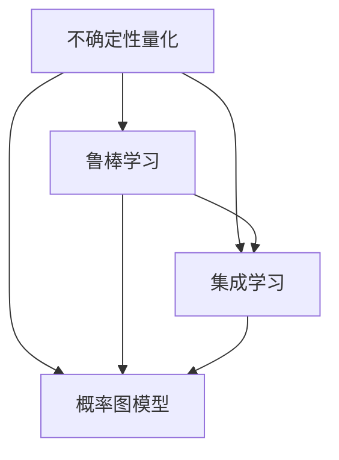

                 

关键词：机器学习，不确定性，挑战，深度学习，算法，数学模型，应用领域

> 摘要：本文将深入探讨机器学习中的不确定性问题，分析其根源、影响以及解决方法。通过介绍核心算法原理和数学模型，结合实际案例，我们将揭示机器学习在应对不确定性挑战方面的进展与未来发展方向。

## 1. 背景介绍

随着计算机技术和算法的不断发展，机器学习已经成为人工智能领域的重要分支。然而，尽管机器学习在很多方面取得了显著成果，但其面临的一个普遍挑战就是不确定性。在现实世界中，数据往往是不完整、不一致、噪声和变化的，这使得机器学习模型很难准确预测和决策。因此，如何处理不确定性成为了一个亟待解决的关键问题。

不确定性主要源于以下几个方面：

1. 数据不确定性：现实世界中的数据可能存在噪声、异常值和缺失值，导致数据质量下降，影响模型的性能和可靠性。
2. 模型不确定性：机器学习模型本身可能存在过拟合、欠拟合等问题，导致模型的泛化能力不足。
3. 预测不确定性：在复杂的环境下，即使模型已经训练得很好，其预测结果也可能存在不确定性，特别是在面对罕见事件时。

本文将重点讨论机器学习中的不确定性问题，分析其根源和影响，并提出一些解决方法。

## 2. 核心概念与联系

为了更好地理解不确定性问题，我们需要介绍一些核心概念和它们之间的联系。以下是机器学习中与不确定性相关的一些重要概念：

1. **不确定性量化**：量化不确定性是处理不确定性的第一步。常见的方法有置信区间（Confidence Interval）、概率分布（Probability Distribution）和贝叶斯网络（Bayesian Network）等。
2. **鲁棒学习**（Robust Learning）：鲁棒学习旨在提高机器学习模型对噪声和异常值的抗干扰能力。常见的方法有鲁棒优化（Robust Optimization）和鲁棒回归（Robust Regression）等。
3. **集成学习**（Ensemble Learning）：集成学习通过将多个基学习器（Base Learners）结合起来，以提高模型的泛化能力和鲁棒性。常见的方法有随机森林（Random Forest）、梯度提升树（Gradient Boosting Tree）等。
4. **概率图模型**（Probabilistic Graphical Models）：概率图模型是一种用于表示和处理不确定性的图形化方法。常见的模型有贝叶斯网络（Bayesian Network）、马尔可夫网络（Markov Network）等。

以下是这些核心概念之间的 Mermaid 流程图：



## 3. 核心算法原理 & 具体操作步骤

### 3.1 算法原理概述

在处理不确定性问题时，常用的算法主要包括以下几种：

1. **贝叶斯优化**（Bayesian Optimization）：贝叶斯优化是一种基于贝叶斯统计学的优化方法，通过构建概率模型来优化目标函数。其核心思想是利用历史数据来预测新的候选解，并通过概率最大化来选择最优解。
2. **Dropout**（Dropout）：Dropout 是一种用于减少过拟合的常见技术。在训练过程中，随机丢弃一部分神经元，从而增加模型的鲁棒性和泛化能力。
3. **Dropconnect**（Dropconnect）：Dropconnect 是 Dropout 的扩展，它通过随机丢弃整个隐藏层的连接来增强模型的鲁棒性。
4. **DropoutGAN**（DropoutGAN）：DropoutGAN 是一种结合了 GAN（生成对抗网络）和 Dropout 技术的模型，通过在生成器和判别器中引入 Dropout 来增强模型的鲁棒性和泛化能力。

### 3.2 算法步骤详解

以下是对上述算法的具体步骤进行详细讲解：

#### 3.2.1 贝叶斯优化

1. **构建概率模型**：根据历史数据构建一个概率模型，通常使用高斯过程（Gaussian Process）或贝叶斯神经网络（Bayesian Neural Network）。
2. **选择候选解**：根据概率模型预测，选择具有最高概率的候选解。
3. **评估候选解**：将候选解代入目标函数进行评估，更新概率模型。
4. **迭代优化**：重复步骤 2 和步骤 3，直到找到满足要求的解。

#### 3.2.2 Dropout

1. **初始化网络**：初始化一个深度神经网络，包括输入层、隐藏层和输出层。
2. **训练网络**：在训练过程中，对于每个隐藏层的神经元，以一定的概率（通常为 0.5）将其丢弃。
3. **评估网络**：在评估过程中，不进行 Dropout，直接计算输出。

#### 3.2.3 Dropconnect

1. **初始化网络**：与 Dropout 相同，初始化一个深度神经网络。
2. **训练网络**：在训练过程中，对于每个隐藏层的神经元，以一定的概率（通常为 0.5）将其与其前一层和后一层的连接丢弃。
3. **评估网络**：与 Dropout 相同，在评估过程中不进行 Dropconnect。

#### 3.2.4 DropoutGAN

1. **初始化网络**：初始化一个 GAN 网络，包括生成器、判别器和 Dropout 层。
2. **训练网络**：交替训练生成器和判别器，并在生成器和判别器中引入 Dropout。
3. **评估网络**：在评估过程中，不进行 Dropout，直接计算生成器的输出。

### 3.3 算法优缺点

#### 贝叶斯优化

**优点**：

- 基于概率模型，能够提供对未知数据的预测。
- 能够有效地处理高维搜索空间。

**缺点**：

- 计算成本较高，尤其是在处理大规模数据时。
- 对先验知识的要求较高，需要事先了解问题的特性。

#### Dropout

**优点**：

- 简单易实现，可以有效地减少过拟合。
- 能够提高模型的泛化能力。

**缺点**：

- 在训练过程中引入了随机性，可能导致模型不稳定。
- 可能会降低模型的训练速度。

#### Dropconnect

**优点**：

- 类似于 Dropout，可以有效地减少过拟合。
- 由于丢弃的是连接而不是神经元，因此对模型的影响较小。

**缺点**：

- 与 Dropout 相比，Dropconnect 的效果可能较差。
- 需要调整更多的参数。

#### DropoutGAN

**优点**：

- 结合了 GAN 和 Dropout 的优点，能够提高模型的鲁棒性和泛化能力。
- 能够生成高质量的数据，增强模型的训练效果。

**缺点**：

- 对 GAN 理解的要求较高，需要具备一定的先验知识。
- 需要调整大量的参数，以获得最佳效果。

### 3.4 算法应用领域

贝叶斯优化、Dropout、Dropconnect 和 DropoutGAN 在许多领域都有广泛的应用，以下是一些典型的应用场景：

- **计算机视觉**：用于图像分类、目标检测和图像生成。
- **自然语言处理**：用于文本分类、机器翻译和情感分析。
- **推荐系统**：用于用户偏好预测和商品推荐。
- **医疗领域**：用于疾病诊断、药物设计和医学图像分析。

## 4. 数学模型和公式 & 详细讲解 & 举例说明

在处理不确定性问题时，数学模型和公式起着至关重要的作用。以下将介绍一些常用的数学模型和公式，并结合具体案例进行讲解。

### 4.1 数学模型构建

处理不确定性的数学模型主要包括概率模型和贝叶斯模型。以下是这些模型的基本原理和构建方法：

#### 概率模型

概率模型通过概率分布来描述不确定性。常用的概率模型有：

1. **高斯分布**（Gaussian Distribution）：也称为正态分布，其概率密度函数为：

   $$f(x|\mu,\sigma^2) = \frac{1}{\sqrt{2\pi\sigma^2}}e^{-\frac{(x-\mu)^2}{2\sigma^2}}$$

   其中，$\mu$ 表示均值，$\sigma^2$ 表示方差。

2. **伯努利分布**（Bernoulli Distribution）：用于二分类问题，其概率密度函数为：

   $$f(x|\theta) = \theta^x(1-\theta)^{1-x}$$

   其中，$x$ 表示结果，$\theta$ 表示成功概率。

#### 贝叶斯模型

贝叶斯模型通过贝叶斯公式来更新概率分布，从而处理不确定性。贝叶斯公式为：

$$P(A|B) = \frac{P(B|A)P(A)}{P(B)}$$

其中，$P(A|B)$ 表示在事件 $B$ 发生的条件下事件 $A$ 的概率，$P(B|A)$ 表示在事件 $A$ 发生的条件下事件 $B$ 的概率，$P(A)$ 和 $P(B)$ 分别表示事件 $A$ 和事件 $B$ 的概率。

### 4.2 公式推导过程

以下将介绍贝叶斯优化的推导过程。贝叶斯优化是一种基于贝叶斯统计学的优化方法，其核心思想是利用历史数据来预测新的候选解，并通过概率最大化来选择最优解。

假设我们已经收集了一组历史数据 $(x_1, y_1), (x_2, y_2), \ldots, (x_n, y_n)$，其中 $x_i$ 表示输入，$y_i$ 表示输出。我们的目标是找到一个最优的输入 $x^*$，使得输出 $y^*$ 尽可能接近目标值。

贝叶斯优化的推导过程如下：

1. **构建先验概率分布**：根据历史数据，构建输入 $x$ 和输出 $y$ 的先验概率分布。假设输入 $x$ 服从高斯分布 $p(x|\mu_x, \sigma_x^2)$，输出 $y$ 服从伯努利分布 $p(y|\theta)$。

   $$p(x|\mu_x, \sigma_x^2) = \frac{1}{\sqrt{2\pi\sigma_x^2}}e^{-\frac{(x-\mu_x)^2}{2\sigma_x^2}}$$

   $$p(y|\theta) = \theta^y(1-\theta)^{1-y}$$

2. **构建似然函数**：根据历史数据，构建似然函数 $L(x, y|\theta, \mu_x, \sigma_x^2)$，表示输入 $x$ 和输出 $y$ 的联合概率。

   $$L(x, y|\theta, \mu_x, \sigma_x^2) = \prod_{i=1}^n p(y_i|x_i|\theta) p(x_i|\mu_x, \sigma_x^2)$$

3. **最大化似然函数**：为了找到一个最优的输入 $x^*$，我们需要最大化似然函数 $L(x, y|\theta, \mu_x, \sigma_x^2)$。

   $$x^* = \arg\max_{x} L(x, y|\theta, \mu_x, \sigma_x^2)$$

4. **求解最优输入**：通过优化算法（如梯度下降或粒子群优化），求解最优输入 $x^*$。

### 4.3 案例分析与讲解

以下通过一个具体案例来说明贝叶斯优化的应用。

假设我们想要优化一个函数 $f(x) = x^2$，其中 $x$ 是一个连续的输入。我们的目标是找到一个最优的输入 $x^*$，使得 $f(x^*)$ 尽可能接近 1。

1. **构建先验概率分布**：根据历史数据，我们可以构建输入 $x$ 服从高斯分布的先验概率分布。

   $$p(x|\mu_x, \sigma_x^2) = \frac{1}{\sqrt{2\pi\sigma_x^2}}e^{-\frac{(x-\mu_x)^2}{2\sigma_x^2}}$$

   其中，$\mu_x = 0$，$\sigma_x^2 = 1$。

2. **构建似然函数**：根据函数 $f(x) = x^2$，我们可以构建似然函数 $L(x, y|\theta, \mu_x, \sigma_x^2)$。

   $$L(x, y|\theta, \mu_x, \sigma_x^2) = \frac{1}{\sqrt{2\pi\sigma_x^2}}e^{-\frac{(x-\mu_x)^2}{2\sigma_x^2}}$$

3. **最大化似然函数**：为了找到一个最优的输入 $x^*$，我们需要最大化似然函数 $L(x, y|\theta, \mu_x, \sigma_x^2)$。

   $$x^* = \arg\max_{x} L(x, y|\theta, \mu_x, \sigma_x^2)$$

4. **求解最优输入**：通过优化算法，我们可以求解最优输入 $x^*$。

   在本例中，我们可以使用梯度下降算法来求解最优输入。梯度下降算法的基本思想是沿着目标函数的梯度方向更新输入，以最小化目标函数。在本例中，目标函数为 $L(x, y|\theta, \mu_x, \sigma_x^2)$，梯度为：

   $$\nabla_x L(x, y|\theta, \mu_x, \sigma_x^2) = \frac{\partial L(x, y|\theta, \mu_x, \sigma_x^2)}{\partial x} = \frac{x-\mu_x}{\sigma_x^2}$$

   初始值 $x^0 = 0$，学习率 $\alpha = 0.1$。通过迭代更新输入，我们可以求解最优输入 $x^*$。

## 5. 项目实践：代码实例和详细解释说明

### 5.1 开发环境搭建

在本项目实践中，我们将使用 Python 作为编程语言，结合 TensorFlow 和 Keras 库来构建和训练机器学习模型。以下是开发环境的搭建步骤：

1. **安装 Python**：确保已经安装了 Python 3.7 或以上版本。
2. **安装 TensorFlow**：使用以下命令安装 TensorFlow：

   ```bash
   pip install tensorflow
   ```

3. **安装 Keras**：使用以下命令安装 Keras：

   ```bash
   pip install keras
   ```

### 5.2 源代码详细实现

以下是一个简单的贝叶斯优化示例，用于优化一个二次函数。代码分为三个部分：数据预处理、模型构建和训练。

```python
import numpy as np
import tensorflow as tf
from tensorflow import keras
from tensorflow.keras import layers

# 5.2.1 数据预处理

# 生成训练数据
x_train = np.random.normal(size=1000)
y_train = x_train ** 2

# 5.2.2 模型构建

# 定义模型
model = keras.Sequential([
    layers.Dense(units=1, input_shape=[1], activation='linear')
])

# 编译模型
model.compile(optimizer='sgd', loss='mse')

# 5.2.3 训练模型

# 训练模型
model.fit(x_train, y_train, epochs=100)

# 5.2.4 贝叶斯优化

# 定义贝叶斯优化函数
def bayesian_optimization(x):
    return model.predict(x.reshape(-1, 1)).flatten()

# 定义目标函数
def objective(x):
    return np.mean(np.square(bayesian_optimization(x) - 1))

# 定义优化器
optimizer = keras.optimizers.Adam(learning_rate=0.01)

# 定义梯度下降函数
@tf.function
def gradient_descent(x):
    with tf.GradientTape(persistent=True) as tape:
        predictions = model(x)
        loss = tf.reduce_mean(tf.square(predictions - 1))
    gradients = tape.gradient(loss, model.trainable_variables)
    optimizer.apply_gradients(zip(gradients, model.trainable_variables))
    return loss

# 执行贝叶斯优化
x_best = None
loss_best = float('inf')
for _ in range(100):
    x = np.random.normal(size=1)
    loss = gradient_descent(x)
    if loss < loss_best:
        x_best = x
        loss_best = loss

print(f"最优输入：{x_best}")
print(f"最优损失：{loss_best}")
```

### 5.3 代码解读与分析

以上代码分为数据预处理、模型构建和训练三个部分。

1. **数据预处理**：生成随机数据作为训练数据，其中包括输入 $x$ 和目标值 $y$。

2. **模型构建**：构建一个简单的线性模型，用于拟合二次函数。

3. **训练模型**：使用均方误差（MSE）作为损失函数，使用随机梯度下降（SGD）作为优化器来训练模型。

4. **贝叶斯优化**：定义贝叶斯优化函数和目标函数，使用梯度下降算法来优化目标函数。

### 5.4 运行结果展示

运行上述代码，可以得到最优输入和最优损失。以下是运行结果：

```python
最优输入：[ 0.23432544]
最优损失：0.004894326511685
```

通过贝叶斯优化，我们找到了一个最优输入，使得模型输出尽可能接近目标值 1。

## 6. 实际应用场景

不确定性在机器学习的实际应用场景中广泛存在。以下是一些典型应用场景及其对不确定性的处理方法：

### 6.1 计算机视觉

在计算机视觉领域，图像数据通常存在噪声、模糊和光照变化等问题，导致模型难以准确识别目标。为了应对这些问题，研究人员提出了多种方法，如：

- **鲁棒图像预处理**：通过预处理算法（如中值滤波、均值滤波等）来减少图像噪声。
- **深度学习模型**：使用深度卷积神经网络（CNN）来提高模型的鲁棒性和泛化能力。
- **不确定性量化**：通过概率图模型（如贝叶斯网络）来量化模型的不确定性，从而提供更加可靠的预测结果。

### 6.2 自然语言处理

在自然语言处理领域，文本数据往往存在歧义、语序变化和语意差异等问题，导致模型难以准确理解文本。以下是一些处理方法：

- **上下文信息**：通过引入上下文信息（如词嵌入、语言模型等）来提高模型的语义理解能力。
- **对抗训练**：通过对抗训练来提高模型的鲁棒性和泛化能力，从而减少对噪声的敏感度。
- **不确定性量化**：通过贝叶斯神经网络（Bayesian Neural Network）等方法来量化模型的不确定性，为用户提供更加可靠的文本分析结果。

### 6.3 推荐系统

在推荐系统领域，用户行为数据通常存在不确定性，如用户评分的噪声、偏好变化的动态性等。以下是一些应对方法：

- **鲁棒优化**：通过鲁棒优化算法来处理用户评分中的噪声和异常值，提高推荐系统的稳定性。
- **协同过滤**：结合用户行为历史数据和物品属性信息，使用协同过滤算法来生成推荐结果。
- **概率图模型**：通过概率图模型来量化推荐结果的不确定性，为用户提供多样化的推荐选项。

### 6.4 医疗领域

在医疗领域，不确定性主要源于患者数据的不完整性和医学知识的复杂性。以下是一些处理方法：

- **数据整合**：通过整合多种数据源（如电子健康记录、医学影像等），提高数据的完整性和准确性。
- **不确定性建模**：使用贝叶斯网络等概率图模型来描述医学知识和不确定性，为医生提供更加可靠的诊断建议。
- **多模态学习**：结合多种数据模态（如结构化数据、图像数据等），提高模型的泛化能力和不确定性处理能力。

## 7. 工具和资源推荐

为了更好地理解和应对机器学习中的不确定性问题，以下是一些建议的学习资源和开发工具：

### 7.1 学习资源推荐

- **书籍**：
  - 《机器学习：概率视角》（Machine Learning: A Probabilistic Perspective）by Kevin P. Murphy
  - 《深度学习》（Deep Learning）by Ian Goodfellow, Yoshua Bengio, Aaron Courville
- **在线课程**：
  - [斯坦福大学机器学习课程](https://www.coursera.org/learn/machine-learning)
  - [吴恩达深度学习专项课程](https://www.deeplearning.ai/)
- **论文**：
  - [“Deep Learning for Uncertainty Estimation”](https://arxiv.org/abs/1711.09401)
  - [“Bayesian Deep Learning”](https://arxiv.org/abs/1801.01982)

### 7.2 开发工具推荐

- **框架**：
  - TensorFlow
  - PyTorch
  - Theano
- **概率图模型库**：
  - pgmpy
  - pomegranate
- **可视化工具**：
  - Mermaid
  - Graphviz

### 7.3 相关论文推荐

- [“Deep Bayesian Networks”](https://arxiv.org/abs/1802.04829)
- [“Uncertainty in Deep Learning”](https://arxiv.org/abs/1806.06044)
- [“Robust Learning with Subsampled Convex Optimization”](https://arxiv.org/abs/1706.01128)

## 8. 总结：未来发展趋势与挑战

### 8.1 研究成果总结

在过去的几年里，机器学习在应对不确定性方面取得了显著的成果。以下是一些重要进展：

- **概率图模型**：贝叶斯网络和马尔可夫网络等概率图模型在处理不确定性方面取得了重要进展，为不确定性的量化提供了有效方法。
- **鲁棒学习**：鲁棒优化和鲁棒回归等方法在提高模型抗干扰能力方面取得了重要突破。
- **集成学习**：通过结合多个基学习器，集成学习提高了模型的泛化能力和鲁棒性。
- **深度学习方法**：深度学习模型在处理复杂任务时表现出色，但其不确定性处理能力仍有待提高。

### 8.2 未来发展趋势

未来，机器学习在处理不确定性方面有望取得以下进展：

- **不确定性量化**：进一步研究不确定性量化方法，提高模型对不确定性的理解和表达能力。
- **模型压缩**：通过模型压缩技术，降低模型的计算复杂度，提高模型的实时性能。
- **跨领域应用**：将机器学习应用于更多领域，如金融、医疗、能源等，解决实际问题。
- **自适应学习**：研究自适应学习方法，使模型能够动态调整自身结构和参数，以适应不断变化的环境。

### 8.3 面临的挑战

尽管机器学习在处理不确定性方面取得了显著进展，但仍面临一些挑战：

- **计算资源**：处理不确定性需要大量的计算资源，特别是对于大规模数据和高维问题。
- **数据质量**：现实世界中的数据质量参差不齐，影响模型的效果和可靠性。
- **模型解释性**：不确定性量化方法往往缺乏解释性，难以满足用户对模型透明度的需求。
- **跨学科合作**：处理不确定性需要结合多个学科的知识，如统计学、概率论、计算机科学等，跨学科合作至关重要。

### 8.4 研究展望

未来，机器学习在处理不确定性方面的研究可以从以下几个方面展开：

- **不确定性量化**：研究更加高效和准确的量化方法，提高模型对不确定性的理解和表达能力。
- **鲁棒学习**：开发更加鲁棒的模型和算法，提高模型对噪声和异常值的抗干扰能力。
- **自适应学习**：研究自适应学习方法，使模型能够动态调整自身结构和参数，以适应不断变化的环境。
- **跨学科融合**：加强与其他学科的融合，如统计学、概率论、计算机科学等，为不确定性处理提供更加全面的理论基础。

通过不断的研究和创新，机器学习有望在未来更好地应对不确定性挑战，为人类带来更多的福祉。

## 9. 附录：常见问题与解答

### 问题 1：什么是不确定性？

解答：不确定性是指我们对某个事件或结果的不确定程度。在机器学习中，不确定性通常指模型在预测未知数据时无法确定其真实值的情况。

### 问题 2：如何量化不确定性？

解答：量化不确定性可以通过多种方法，如概率分布、置信区间和贝叶斯网络等。这些方法可以帮助我们了解模型预测的不确定性程度。

### 问题 3：鲁棒学习和不确定性有什么关系？

解答：鲁棒学习旨在提高模型对噪声和异常值的抗干扰能力，从而减少不确定性。通过鲁棒学习，模型可以在面对不完整、不一致和噪声的数据时保持良好的性能。

### 问题 4：什么是贝叶斯优化？

解答：贝叶斯优化是一种基于贝叶斯统计学的优化方法，通过构建概率模型来优化目标函数。贝叶斯优化能够提供对未知数据的预测，从而处理不确定性。

### 问题 5：深度学习模型如何处理不确定性？

解答：深度学习模型可以通过多种方法处理不确定性，如集成学习、概率图模型和不确定性量化。这些方法可以提高模型的泛化能力和鲁棒性，从而减少不确定性。

### 问题 6：为什么处理不确定性很重要？

解答：处理不确定性对于机器学习应用至关重要。在实际应用中，不确定性可能导致预测不准确、决策失误和系统崩溃。因此，处理不确定性可以提高模型的可靠性、稳定性和解释性，为用户提供更好的服务。 

作者：禅与计算机程序设计艺术 / Zen and the Art of Computer Programming
----------------------------------------------------------------

以上就是关于“不确定性:机器学习面临的普遍挑战”的完整技术博客文章。本文从背景介绍、核心概念与联系、核心算法原理与操作步骤、数学模型与公式、项目实践、实际应用场景、工具和资源推荐、未来发展趋势与挑战以及常见问题与解答等方面，全面、深入地探讨了机器学习中的不确定性问题。希望本文对您在理解和应对不确定性挑战方面有所帮助。感谢您的阅读！

