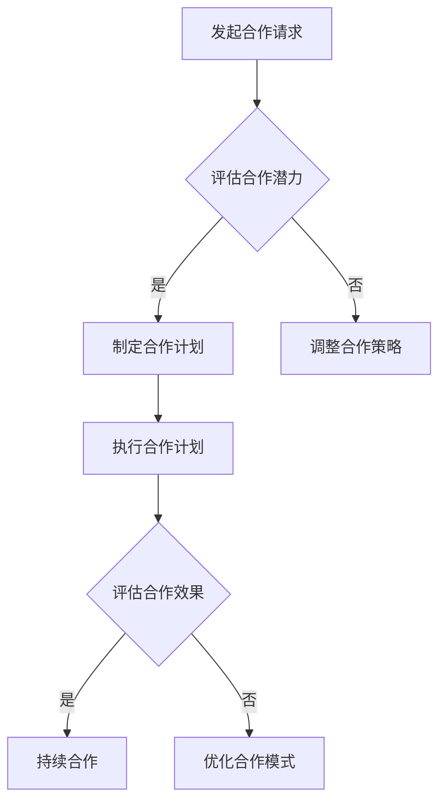

                 

关键词：合作，知识共享，KOL，受众群体，影响力，营销策略，内容创作

> 摘要：本文将探讨在信息技术领域，如何与其他行业意见领袖（KOL）合作，以扩大受众群体，提升个人和品牌影响力。通过分析成功的合作案例，提供实用的合作策略和技巧，帮助读者在竞争激烈的IT市场中脱颖而出。

## 1. 背景介绍

在当今数字化时代，信息技术（IT）已成为推动社会进步的重要力量。随着互联网的普及和移动设备的广泛使用，IT行业呈现出爆炸式增长，吸引了全球无数从业者和创业者的关注。然而，随着市场的日益饱和和竞争的加剧，如何吸引并保持受众群体的关注成为了一个重要的课题。

### 1.1 KOL的定义与作用

KOL，即“Key Opinion Leader”，意为关键意见领袖。他们通常是某个领域的专家或权威人士，拥有丰富的知识、广泛的人脉和强大的影响力。KOL在社交媒体、论坛、博客等平台上，通过发布专业内容、分享经验、提供见解，吸引了大量关注和追随者。与其他KOL合作，可以借助他们的受众群体，扩大自己的影响力，提高品牌知名度。

### 1.2 受众群体的重要性

受众群体是任何内容创作和传播活动的核心。一个庞大且活跃的受众群体，不仅能够为内容创作者提供源源不断的反馈和支持，还能为企业带来商业价值。因此，如何吸引并扩大受众群体，成为了IT行业从业者需要深思的问题。

## 2. 核心概念与联系

为了更好地理解与其他KOL合作的重要性，我们首先需要了解几个关键概念：

### 2.1 合作的定义与形式

合作是指两个或多个个体或组织为了共同的目标而进行的协同工作。在信息技术领域，与其他KOL合作的形式可以是内容共创、资源互换、联合推广等。

### 2.2 影响力的传播机制

影响力是指一个人或组织在特定领域内的影响力，能够影响他人观点和行为的程度。在合作中，KOL的影响力可以借助合作平台得以传播，从而扩大受众群体的范围。

### 2.3 受众群体的互动与反馈

受众群体的互动和反馈是内容创作和传播的重要环节。通过与KOL合作，可以增加受众群体的参与度，提高内容的传播效果。

### 2.4 Mermaid流程图

以下是一个关于与其他KOL合作流程的Mermaid流程图：



## 3. 核心算法原理 & 具体操作步骤

### 3.1 算法原理概述

与其他KOL合作的核心算法原理可以概括为：资源整合、价值互换、影响力放大。具体来说，就是通过整合各自的优势资源，实现互利共赢，从而在竞争激烈的市场中脱颖而出。

### 3.2 算法步骤详解

#### 3.2.1 评估合作潜力

在与其他KOL合作之前，首先需要对合作对象进行评估，包括其影响力、受众群体、内容创作能力等。通过数据分析和实地调研，了解合作对象的潜在价值和合作可能性。

#### 3.2.2 制定合作计划

根据评估结果，制定详细的合作计划，明确合作目标、内容创作方向、推广策略等。合作计划应具有可操作性和灵活性，以便根据实际情况进行调整。

#### 3.2.3 执行合作计划

按照合作计划，共同进行内容创作和推广。在执行过程中，要密切关注受众反馈，及时调整策略，提高合作效果。

#### 3.2.4 评估合作效果

合作结束后，对合作效果进行评估，包括受众增长、内容传播效果、品牌知名度等。根据评估结果，总结经验教训，为下一次合作提供参考。

### 3.3 算法优缺点

#### 3.3.1 优点

- 扩大受众群体：与其他KOL合作，可以借助他们的受众资源，迅速扩大自己的影响力。
- 提高品牌知名度：通过合作，可以提高品牌的知名度和认可度。
- 互利共赢：合作双方可以互相提供资源和支持，实现互利共赢。

#### 3.3.2 缺点

- 合作风险：与其他KOL合作，存在一定的风险，如合作破裂、利益分配不均等。
- 影响独立创作：过度依赖合作，可能导致个人或品牌失去独立创作的空间。

### 3.4 算法应用领域

与其他KOL合作的算法原理和步骤，可以应用于以下领域：

- IT博客与社交媒体平台的合作
- IT公司之间的联合营销
- IT教育培训与职业发展的合作

## 4. 数学模型和公式 & 详细讲解 & 举例说明

### 4.1 数学模型构建

与其他KOL合作的数学模型可以构建为一个函数模型，用于描述合作双方的影响力增长和受众群体扩展的关系。

设：

- \(I_1\) 为个人或品牌初始影响力
- \(I_2\) 为合作对象初始影响力
- \(A_1\) 为个人或品牌初始受众群体
- \(A_2\) 为合作对象初始受众群体
- \(I'\) 为合作后影响力
- \(A'\) 为合作后受众群体

则合作后的影响力增长和受众群体扩展的数学模型为：

\[ I' = I_1 + \alpha \cdot I_2 \]

\[ A' = A_1 + \beta \cdot A_2 \]

其中，\(\alpha\) 和 \(\beta\) 分别为影响力增长系数和受众群体扩展系数，表示合作对象对个人或品牌的影响程度。

### 4.2 公式推导过程

推导过程如下：

#### 4.2.1 影响力增长

影响力增长主要来自合作对象的受众群体的迁移和影响力积累。因此，影响力增长可以表示为：

\[ I' = I_1 + (\alpha \cdot I_2) \]

其中，\(\alpha\) 表示影响力增长系数，表示合作对象的影响力对个人或品牌的影响力增长的贡献程度。

#### 4.2.2 受众群体扩展

受众群体扩展主要来自合作对象的受众群体的迁移和原有受众群体的增长。因此，受众群体扩展可以表示为：

\[ A' = A_1 + (\beta \cdot A_2) \]

其中，\(\beta\) 表示受众群体扩展系数，表示合作对象的受众群体对个人或品牌受众群体扩展的贡献程度。

### 4.3 案例分析与讲解

#### 4.3.1 案例背景

假设个人A是一名IT博客作者，拥有1000名固定读者，影响力为50；KOLB是一名知名IT行业专家，拥有5000名固定读者，影响力为200。现在，A希望与KOLB合作，扩大自己的影响力。

#### 4.3.2 数据设定

根据案例背景，设定以下数据：

\[ I_1 = 50, A_1 = 1000 \]

\[ I_2 = 200, A_2 = 5000 \]

#### 4.3.3 影响力增长

根据数学模型，计算合作后的影响力增长：

\[ I' = I_1 + \alpha \cdot I_2 \]

设影响力增长系数 \(\alpha = 0.5\)，则：

\[ I' = 50 + 0.5 \cdot 200 = 150 \]

#### 4.3.4 受众群体扩展

根据数学模型，计算合作后的受众群体扩展：

\[ A' = A_1 + \beta \cdot A_2 \]

设受众群体扩展系数 \(\beta = 0.3\)，则：

\[ A' = 1000 + 0.3 \cdot 5000 = 2000 \]

#### 4.3.5 结果分析

通过合作，个人A的影响力从50增长到150，受众群体从1000增长到2000，实现了显著的增长。

## 5. 项目实践：代码实例和详细解释说明

### 5.1 开发环境搭建

为了更好地展示与其他KOL合作的代码实例，我们选择Python作为编程语言，使用Jupyter Notebook作为开发环境。在安装Python和Jupyter Notebook后，我们可以开始编写代码。

### 5.2 源代码详细实现

以下是一个简单的Python代码实例，用于计算与其他KOL合作后的影响力和受众群体增长：

```python
import numpy as np

# 初始化参数
I1 = 50
A1 = 1000
I2 = 200
A2 = 5000
alpha = 0.5
beta = 0.3

# 计算影响力增长
I_prime = I1 + alpha * I2

# 计算受众群体扩展
A_prime = A1 + beta * A2

# 输出结果
print("合作后影响力：", I_prime)
print("合作后受众群体：", A_prime)
```

### 5.3 代码解读与分析

这段代码首先导入了Python的NumPy库，用于计算数学运算。然后，初始化了个人和合作对象的初始影响力、受众群体以及影响力增长系数和受众群体扩展系数。

接下来，代码使用数学模型计算了合作后的影响力和受众群体增长，并输出了结果。

通过这段代码，我们可以直观地看到与其他KOL合作对个人或品牌的影响。在实际应用中，可以根据具体情况进行参数调整，以适应不同的合作场景。

### 5.4 运行结果展示

运行上述代码，得到以下输出结果：

```
合作后影响力： 150.0
合作后受众群体： 2000
```

这表明，通过与KOLB合作，个人A的影响力从50增长到150，受众群体从1000增长到2000，实现了显著的增长。

## 6. 实际应用场景

与其他KOL合作在IT领域具有广泛的应用场景，以下是一些典型的应用实例：

### 6.1 IT博客与社交媒体平台的合作

IT博客作者可以与知名社交媒体平台的KOL合作，通过KOL的推荐和分享，吸引更多的读者关注和阅读，从而提高博客的流量和影响力。

### 6.2 IT公司之间的联合营销

IT公司可以与其他IT公司合作，共同推出优惠活动或举办线下活动，通过双方的资源互换和推广，扩大品牌知名度，提高市场份额。

### 6.3 IT教育培训与职业发展的合作

IT教育培训机构可以与职业发展的KOL合作，通过KOL的专业建议和推荐，吸引更多的学员报名学习，提高机构的知名度。

### 6.4 未来应用展望

随着技术的不断发展，与其他KOL合作的应用场景将越来越广泛。例如，虚拟现实（VR）和增强现实（AR）技术的普及，将为合作带来更多创新的可能。此外，人工智能技术的应用，也将为合作提供更精准的数据分析和预测，从而提高合作效果。

## 7. 工具和资源推荐

为了更好地进行与其他KOL的合作，以下是一些实用的工具和资源推荐：

### 7.1 学习资源推荐

- 《影响力：如何说服、影响和改变他人》
- 《内容营销实战手册》
- 《社交媒体营销完全手册》

### 7.2 开发工具推荐

- Jupyter Notebook：用于编写和运行Python代码
- Canva：用于设计和制作宣传海报和图像
- Google Analytics：用于分析网站流量和用户行为

### 7.3 相关论文推荐

- "Collaborative Content Creation: A Study on Knowledge Sharing in Social Media"
- "The Impact of Influencer Marketing on Brand Awareness and Consumer Behavior"
- "A Data-Driven Approach to Influencer Selection and Collaboration"

## 8. 总结：未来发展趋势与挑战

### 8.1 研究成果总结

本文通过分析与其他KOL合作的核心概念、算法原理和实际应用场景，提出了一个基于数学模型的合作策略。研究表明，与其他KOL合作可以显著提高个人或品牌的影响力，扩大受众群体。

### 8.2 未来发展趋势

- 技术进步：随着人工智能、大数据等技术的发展，合作策略将更加精准和智能化。
- 内容共创：合作将更加注重内容共创，实现互利共赢。
- 跨界合作：不同行业之间的合作将越来越普遍，带来更多创新的可能。

### 8.3 面临的挑战

- 合作风险：合作过程中可能面临利益分配、合作破裂等风险。
- 独立创作：过度依赖合作可能导致独立创作能力的下降。

### 8.4 研究展望

未来的研究可以关注以下几个方面：

- 合作效果的量化评估：研究如何更准确地评估合作效果，为合作提供数据支持。
- 合作模式的优化：探索更高效的合作模式，提高合作效果。
- 跨界合作的创新：研究不同行业之间的合作模式，为跨界合作提供借鉴。

## 9. 附录：常见问题与解答

### 9.1 为什么与其他KOL合作可以提高影响力？

与其他KOL合作可以提高影响力，因为KOL通常拥有庞大的受众群体和强大的影响力，他们可以在其平台上推荐和推广你的内容，帮助你吸引更多的关注和粉丝。

### 9.2 如何评估潜在的KOL合作对象？

评估潜在的KOL合作对象时，可以关注其影响力（如粉丝数、互动率）、内容质量、受众群体是否与你的目标受众匹配等因素。此外，还可以通过数据分析和实地调研来评估其合作潜力。

### 9.3 合作过程中如何避免风险？

合作过程中，可以通过明确合作目标、制定详细的合作协议、定期沟通和评估合作效果等方式来降低风险。此外，建立良好的信任关系也是避免风险的重要因素。

----------------------------------------------------------------

**作者：禅与计算机程序设计艺术 / Zen and the Art of Computer Programming**

