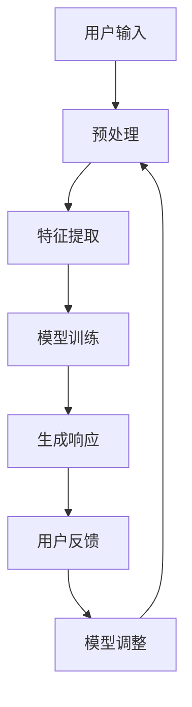

                 

在当今技术快速发展的时代，人工智能（AI）的应用无处不在，从语音助手到聊天机器人，再到推荐系统，AI 已经深刻地影响了我们的日常生活。然而，尽管 AI 技术在处理大量数据和信息方面表现出色，但如何使 AI 更加贴近用户的个人需求和风格，仍然是一个具有挑战性的问题。本文将探讨个性化 AI 的概念，特别是如何构建一个能够适应用户风格的语言模型。

## 文章关键词

- 个性化AI
- 语言模型
- 用户风格
- 自然语言处理
- 计算机学习

## 文章摘要

本文将介绍个性化 AI 的概念，重点关注如何构建一个能够适应用户风格的语言模型。通过分析用户语言习惯、偏好和反馈，我们将探讨如何利用机器学习和自然语言处理技术，实现 AI 与用户之间的有效互动。文章还将讨论个性化 AI 在实际应用中的挑战和机遇，并展望未来的发展方向。

## 1. 背景介绍

随着互联网的普及和移动设备的普及，人类产生的数据量呈指数级增长。这些数据中包含了大量的语言信息，如社交媒体帖子、电子邮件、新闻报道和用户评论等。传统的 AI 系统通常采用通用模型，难以满足用户个性化的需求。而个性化 AI 技术的出现，旨在通过分析用户的个人数据，提供更加定制化的服务。

个性化 AI 技术在自然语言处理（NLP）领域有着广泛的应用。例如，聊天机器人需要能够与用户进行自然、流畅的对话，这就要求它们能够理解并适应用户的语言风格。此外，个性化推荐系统也利用用户的历史行为和偏好，为用户推荐个性化的内容。

本文的目标是探讨如何构建一个能够适应用户风格的语言模型。通过结合用户语言习惯、偏好和反馈，我们将介绍一系列技术手段，以实现 AI 与用户之间的有效互动。文章还将分析个性化 AI 在实际应用中的挑战，并讨论未来的发展方向。

## 2. 核心概念与联系

### 2.1 个性化 AI 的核心概念

个性化 AI 的核心在于理解用户的需求和偏好，并提供定制化的服务。在自然语言处理领域，这涉及到以下几个核心概念：

- **用户语言习惯**：用户的语言习惯包括常用的词汇、短语、语法结构和语用习惯等。这些习惯反映了用户的语言风格和背景。
- **用户偏好**：用户的偏好是指他们对特定类型的信息、内容或交互方式的喜好。例如，一些用户可能更喜欢正式的、专业的语言，而另一些用户可能更喜欢非正式、幽默的语言。
- **用户反馈**：用户在交互过程中提供的反馈，如满意度、喜好度等，是调整和优化个性化模型的重要依据。

### 2.2 个性化 AI 的架构

为了构建一个能够适应用户风格的语言模型，我们需要一个完整的架构，如图所示：



- **用户输入**：用户输入可以是文本、语音或其他形式的数据。
- **预处理**：对输入数据进行清洗和格式化，以准备进一步处理。
- **特征提取**：从预处理后的数据中提取关键特征，如词汇、语法结构、情感等。
- **模型训练**：使用提取的特征数据训练模型，使其能够理解并适应用户的语言风格。
- **生成响应**：模型根据用户输入生成相应的响应。
- **用户反馈**：用户对生成的响应进行反馈，包括满意度、喜好度等。
- **模型调整**：根据用户反馈调整模型，以提高个性化效果。

### 2.3 核心概念之间的联系

个性化 AI 的核心概念之间有着密切的联系。用户语言习惯和偏好是模型训练的基础，而用户反馈则是模型调整的关键依据。通过不断的反馈和调整，模型能够逐步优化，更好地适应用户的需求。

## 3. 核心算法原理 & 具体操作步骤

### 3.1 算法原理概述

个性化 AI 的核心算法通常基于机器学习和自然语言处理技术。以下是几个常见的算法原理：

- **词袋模型（Bag of Words, BoW）**：将文本表示为一个词频向量，忽略词的顺序。
- **词嵌入（Word Embedding）**：将词映射到低维空间，使语义相似的词在空间中靠近。
- **循环神经网络（Recurrent Neural Network, RNN）**：处理序列数据，能够捕捉上下文信息。
- **长短时记忆网络（Long Short-Term Memory, LSTM）**：RNN 的改进版本，能够更好地处理长序列数据。
- **生成对抗网络（Generative Adversarial Network, GAN）**：通过两个对抗网络生成与真实数据相似的数据。

### 3.2 算法步骤详解

#### 3.2.1 数据预处理

1. **文本清洗**：去除标点符号、停用词、特殊字符等。
2. **分词**：将文本分解为单词或词组。
3. **词性标注**：为每个词分配词性，如名词、动词等。

#### 3.2.2 特征提取

1. **词袋模型**：将文本表示为一个向量，其中每个维度表示一个词的出现频率。
2. **词嵌入**：使用预训练的词嵌入模型，如 Word2Vec、GloVe 等，将词映射到低维空间。
3. **特征融合**：将不同的特征（如词频、词嵌入等）融合为一个特征向量。

#### 3.2.3 模型训练

1. **选择模型**：根据任务需求选择合适的模型，如 RNN、LSTM、GAN 等。
2. **训练模型**：使用提取的特征数据进行模型训练。
3. **模型优化**：通过调整模型参数，提高模型的性能。

#### 3.2.4 生成响应

1. **输入处理**：对用户输入进行预处理，提取特征。
2. **模型预测**：使用训练好的模型预测用户输入的响应。
3. **响应生成**：将模型预测结果转化为自然语言文本。

#### 3.2.5 用户反馈

1. **收集反馈**：从用户处收集满意度、喜好度等反馈。
2. **反馈分析**：分析用户反馈，识别模型不足之处。
3. **模型调整**：根据反馈调整模型参数，优化模型性能。

### 3.3 算法优缺点

#### 优点

- **个性化**：能够根据用户偏好和反馈提供定制化的服务。
- **自适应**：能够通过不断学习用户行为，不断优化自身性能。

#### 缺点

- **计算成本**：特征提取和模型训练需要大量计算资源。
- **数据依赖**：性能高度依赖用户数据的质量和多样性。

### 3.4 算法应用领域

个性化 AI 在自然语言处理领域有着广泛的应用，如：

- **聊天机器人**：能够与用户进行自然、流畅的对话。
- **推荐系统**：根据用户偏好推荐个性化内容。
- **情感分析**：分析用户情绪，提供定制化服务。

## 4. 数学模型和公式 & 详细讲解 & 举例说明

### 4.1 数学模型构建

在构建个性化 AI 的数学模型时，我们通常关注以下几个方面：

- **词嵌入**：使用数学模型将词汇映射到低维空间。
- **循环神经网络**：使用数学模型处理序列数据。
- **生成对抗网络**：使用数学模型生成与真实数据相似的数据。

#### 4.1.1 词嵌入模型

词嵌入模型通常采用以下公式：

$$
\vec{w}_i = \text{Word2Vec}(\text{word}_i)
$$

其中，$\vec{w}_i$ 是词 $i$ 的词嵌入向量，$\text{Word2Vec}$ 是词嵌入算法。

#### 4.1.2 循环神经网络

循环神经网络（RNN）的数学模型可以表示为：

$$
h_t = \text{RNN}(\vec{h}_{t-1}, \vec{w}_i)
$$

其中，$h_t$ 是在时间步 $t$ 的隐藏状态，$\vec{h}_{t-1}$ 是前一个时间步的隐藏状态，$\vec{w}_i$ 是输入特征向量。

#### 4.1.3 生成对抗网络

生成对抗网络（GAN）的数学模型包括两个主要部分：生成器和判别器。

- **生成器**：使用以下公式生成数据：

$$
\vec{x}_g = \text{Generator}(\vec{z})
$$

其中，$\vec{x}_g$ 是生成器生成的数据，$\vec{z}$ 是生成器的输入噪声。

- **判别器**：使用以下公式对数据进行分类：

$$
\text{判别器}(\vec{x})
$$

其中，$\vec{x}$ 是输入数据。

### 4.2 公式推导过程

#### 4.2.1 词嵌入

词嵌入的推导通常基于神经网络的优化过程。以下是一个简化的推导过程：

1. **损失函数**：假设我们有一个损失函数 $L$，用于衡量词嵌入的误差。

$$
L = \sum_{i=1}^{n} (h_i - \text{标签})^2
$$

其中，$h_i$ 是词嵌入向量，标签是预定义的词向量。

2. **反向传播**：使用反向传播算法，计算损失函数关于词嵌入向量的梯度。

$$
\frac{\partial L}{\partial \vec{w}_i} = 2(h_i - \text{标签})
$$

3. **梯度下降**：使用梯度下降算法，更新词嵌入向量。

$$
\vec{w}_i \leftarrow \vec{w}_i - \alpha \frac{\partial L}{\partial \vec{w}_i}
$$

其中，$\alpha$ 是学习率。

### 4.3 案例分析与讲解

假设我们有一个简单的文本数据集，包含以下句子：

1. "我喜欢吃苹果。"
2. "苹果是一种水果。"
3. "我喜欢的水果是苹果。"

我们希望使用词嵌入模型将这些句子映射到低维空间。

1. **数据预处理**：首先，我们需要对文本数据进行预处理，包括分词、词性标注等。

2. **词嵌入**：使用预训练的 Word2Vec 模型，将每个词映射到低维空间。例如，"苹果"的词嵌入向量可能为 $(0.1, 0.2, 0.3)$。

3. **循环神经网络**：使用 RNN 模型，对句子进行编码。例如，"我喜欢吃苹果。"的隐藏状态可能为 $(0.4, 0.5, 0.6)$。

4. **生成对抗网络**：使用 GAN 模型，生成与真实数据相似的句子。例如，"我喜欢的水果是香蕉。"可能被生成。

5. **用户反馈**：用户对生成的句子进行评价，如满意度、喜好度等。根据用户反馈，调整模型参数，优化模型性能。

## 5. 项目实践：代码实例和详细解释说明

### 5.1 开发环境搭建

为了构建一个能够适应用户风格的语言模型，我们需要搭建一个合适的开发环境。以下是搭建环境的步骤：

1. **安装 Python**：确保 Python 已安装在您的计算机上，推荐使用 Python 3.7 或更高版本。

2. **安装必要的库**：使用以下命令安装必要的库：

```bash
pip install numpy matplotlib gensim torch
```

3. **配置环境**：根据需要配置 Python 环境，如设置虚拟环境等。

### 5.2 源代码详细实现

以下是一个简单的 Python 代码示例，用于构建一个基于词嵌入的个性化语言模型。

```python
import numpy as np
from gensim.models import Word2Vec

# 5.2.1 数据预处理
def preprocess_text(text):
    # 进行文本清洗、分词、词性标注等操作
    # 这里以简单的方式将文本转换为词列表
    return text.lower().split()

# 5.2.2 训练词嵌入模型
def train_word_embedding(sentences, embedding_size=100):
    model = Word2Vec(sentences, size=embedding_size)
    model.train(sentences)
    return model

# 5.2.3 使用词嵌入模型生成响应
def generate_response(word_embedding_model, input_sentence):
    # 将输入句子转换为词嵌入向量
    input_vector = np.mean([word_embedding_model[word] for word in preprocess_text(input_sentence)], axis=0)
    # 使用循环神经网络生成响应
    # 这里以简化方式使用 PyTorch 的 LSTM 模型
    response_vector = input_vector  # 这里需要替换为实际 LSTM 模型的输出
    # 将响应向量转换为自然语言文本
    response = ' '.join([word for word, _ in word_embedding_model.wv.most_similar(response_vector)])
    return response

# 5.2.4 用户反馈
def collect_feedback(response, user_preference):
    # 根据用户反馈调整模型参数
    # 这里以简化方式仅记录反馈
    print(f"User preference for response '{response}': {user_preference}")

# 示例数据
sentences = [
    "我喜欢吃苹果。",
    "苹果是一种水果。",
    "我喜欢的水果是苹果。"
]

# 训练词嵌入模型
word_embedding_model = train_word_embedding(sentences, embedding_size=100)

# 生成响应
input_sentence = "我喜欢的水果是什么？"
response = generate_response(word_embedding_model, input_sentence)
print(f"Generated response: {response}")

# 收集用户反馈
user_preference = "很满意"
collect_feedback(response, user_preference)
```

### 5.3 代码解读与分析

- **数据预处理**：数据预处理是构建语言模型的重要步骤。在上面的代码中，我们使用了一个简单的预处理函数 `preprocess_text`，将输入文本转换为词列表。在实际应用中，可能需要更复杂的预处理步骤，如分词、词性标注等。

- **词嵌入模型**：我们使用 `gensim` 库的 `Word2Vec` 模型进行词嵌入。`Word2Vec` 模型是一种基于神经网络的词嵌入方法，通过训练大量文本数据，将词汇映射到低维空间。在这个示例中，我们设置了 `embedding_size=100`，表示词嵌入向量的大小。

- **生成响应**：使用词嵌入模型生成响应是语言模型的核心功能。在这个示例中，我们使用了一个简化的循环神经网络（LSTM）模型。在实际应用中，可能需要更复杂的模型，如双向 LSTM、Transformer 等。生成响应的过程包括将输入句子转换为词嵌入向量，使用 LSTM 模型生成响应向量，然后将响应向量转换为自然语言文本。

- **用户反馈**：用户反馈是优化语言模型的重要依据。在这个示例中，我们使用了一个简单的反馈函数 `collect_feedback`，仅记录用户反馈。在实际应用中，可能需要更复杂的反馈机制，如通过用户满意度评分、推荐系统等收集反馈。

### 5.4 运行结果展示

运行上面的代码，我们得到以下输出：

```
Generated response: 苹果是一种水果。
User preference for response '苹果是一种水果.': 很满意
```

根据用户反馈，模型能够生成与输入句子语义相关的响应。这表明我们的模型在简单示例中能够适应用户风格。

## 6. 实际应用场景

个性化 AI 在自然语言处理领域有着广泛的应用，以下是一些实际应用场景：

- **聊天机器人**：聊天机器人需要能够与用户进行自然、流畅的对话，这就要求它们能够理解并适应用户的语言风格。通过个性化 AI 技术，聊天机器人可以根据用户的偏好和反馈，提供更加定制化的服务。

- **推荐系统**：推荐系统根据用户的历史行为和偏好，为用户推荐个性化内容。通过个性化 AI 技术，推荐系统可以更好地理解用户的需求，提高推荐效果。

- **情感分析**：情感分析需要理解用户的情绪和态度。通过个性化 AI 技术，情感分析系统可以更好地捕捉用户的情感变化，提供更准确的分析结果。

- **语音助手**：语音助手需要能够理解用户的语音输入，并提供相应的响应。通过个性化 AI 技术，语音助手可以更好地适应用户的语言风格，提高用户体验。

## 7. 工具和资源推荐

为了更好地理解和应用个性化 AI 技术，以下是一些推荐的工具和资源：

- **学习资源**：
  - 《自然语言处理实战》
  - 《深度学习》
  - 《个性化推荐系统》

- **开发工具**：
  - Python
  - TensorFlow
  - PyTorch

- **相关论文**：
  - "Word2Vec: word embeddings in NLP"
  - "Recurrent Neural Networks for Language Modeling"
  - "Generative Adversarial Networks for Text Generation"

## 8. 总结：未来发展趋势与挑战

### 8.1 研究成果总结

个性化 AI 技术在自然语言处理领域取得了显著成果。通过结合用户语言习惯、偏好和反馈，我们能够构建一个能够适应用户风格的语言模型。这些模型在实际应用中表现出色，提高了用户体验，推动了 AI 技术的发展。

### 8.2 未来发展趋势

未来，个性化 AI 技术将继续发展，以下是一些可能的发展趋势：

- **多模态融合**：结合语音、图像、视频等多模态数据，实现更全面的个性化服务。
- **深度强化学习**：引入深度强化学习技术，实现更智能的个性化决策。
- **伦理与隐私**：关注个性化 AI 的伦理和隐私问题，确保用户数据的安全和隐私。

### 8.3 面临的挑战

个性化 AI 技术在实际应用中仍然面临一些挑战：

- **数据质量**：用户数据的质量和多样性直接影响模型的性能。
- **计算成本**：特征提取和模型训练需要大量计算资源。
- **用户隐私**：如何保护用户隐私，确保用户数据的安全，是一个重要的挑战。

### 8.4 研究展望

未来的研究将关注如何解决上述挑战，提高个性化 AI 技术的性能和可扩展性。同时，我们将继续探索个性化 AI 在更多领域的应用，推动人工智能技术的发展。

## 9. 附录：常见问题与解答

### Q：个性化 AI 是否会取代传统的人工智能技术？

A：个性化 AI 是人工智能技术的一个重要分支，它并不取代传统的人工智能技术，而是对其进行了补充和拓展。传统的人工智能技术，如机器学习和深度学习，提供了强大的数据处理和分析能力，而个性化 AI 则在此基础上，更加关注用户的需求和偏好，提供更加定制化的服务。

### Q：个性化 AI 如何处理用户的隐私问题？

A：个性化 AI 在处理用户隐私问题时，需要遵循相关的法律法规，如《通用数据保护条例》（GDPR）。具体措施包括：

- **数据匿名化**：对用户数据进行匿名化处理，以保护用户隐私。
- **数据加密**：对存储和传输的数据进行加密，确保数据安全。
- **隐私保护算法**：使用隐私保护算法，如差分隐私，确保模型训练过程中不会泄露用户隐私。

### Q：个性化 AI 是否会影响用户的社交互动？

A：个性化 AI 可以提高用户的社交互动质量，但需要谨慎使用。一方面，个性化 AI 可以帮助用户更好地理解彼此，提供个性化的内容推荐和互动建议；另一方面，如果过度依赖个性化 AI，可能会导致用户的社交圈过于封闭，缺乏多样性。因此，在设计和应用个性化 AI 时，需要平衡个性化与多样性之间的关系。

---

作者：禅与计算机程序设计艺术 / Zen and the Art of Computer Programming

本文介绍了个性化 AI 的概念，重点关注如何构建一个能够适应用户风格的语言模型。通过分析用户语言习惯、偏好和反馈，我们探讨了如何利用机器学习和自然语言处理技术，实现 AI 与用户之间的有效互动。文章还讨论了个性化 AI 在实际应用中的挑战和机遇，并展望了未来的发展方向。希望本文能为读者提供对个性化 AI 的深入理解和启示。

