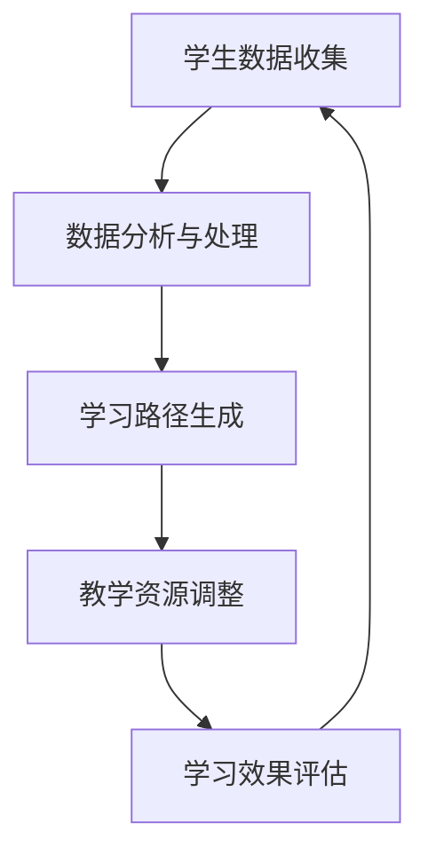

                 

关键词：个性化学习，大型语言模型（LLM），教育技术，学习路径优化，自适应学习系统，教育创新

> 摘要：本文将探讨如何利用大型语言模型（LLM）构建一个高效的个性化学习路径系统，以应对现代教育的需求。通过介绍LLM的核心概念、数学模型、算法原理及其应用，我们旨在展示这一技术在教育领域中的巨大潜力和实际应用价值。

## 1. 背景介绍

随着教育技术的快速发展，教育个性化已成为教育改革的重要趋势。传统的“一刀切”教学模式已经无法满足学生个性化的学习需求，个性化学习路径的设计显得尤为重要。个性化学习路径旨在根据学生的个体差异和学习需求，动态调整教学内容、教学节奏和教学方法，从而提高学习效果。

近年来，深度学习和自然语言处理技术的突破，为教育个性化提供了新的技术手段。特别是大型语言模型（LLM），如GPT-3、Turing等，凭借其强大的文本生成和理解能力，正在成为构建智能化教育系统的重要工具。

## 2. 核心概念与联系

### 2.1 大型语言模型（LLM）

大型语言模型（LLM）是一种基于深度学习技术的语言模型，它通过学习海量的文本数据，掌握了语言的复杂结构和语义信息。LLM的核心思想是通过建模语言中的上下文关系，预测下一个可能的词或句子。

### 2.2 个性化学习路径

个性化学习路径是指根据学生的学习特点、学习进度和学习需求，动态调整学习内容和教学方式，以实现最优的学习效果。个性化学习路径的设计需要综合考虑学生的学习数据、学习目标和教学资源。

### 2.3 教育系统的联系

在教育系统中，LLM可以通过分析学生的学习行为数据、评估学生的知识水平和学习效果，生成个性化的学习路径。同时，LLM还可以根据教学内容和学生的学习反馈，动态调整教学资源，实现教学内容的自适应。

## 2.4 Mermaid 流程图



## 3. 核心算法原理 & 具体操作步骤

### 3.1 算法原理概述

个性化学习路径算法的核心原理是利用LLM对学生数据进行建模，分析学生的学习特点和学习需求，然后根据这些信息生成个性化的学习路径。

### 3.2 算法步骤详解

1. **数据收集与预处理**：收集学生的学习行为数据，如学习时间、学习内容、学习效果等，并对这些数据进行清洗和预处理。

2. **数据建模**：利用LLM对学生数据进行建模，分析学生的学习特点和需求。

3. **学习路径生成**：根据数据建模结果，生成个性化的学习路径，包括学习内容、学习目标和教学方法。

4. **教学资源调整**：根据学习路径，动态调整教学资源，如课程内容、教材和辅助工具。

5. **学习效果评估**：通过学生的学习反馈和测试成绩，评估学习效果，并根据评估结果调整学习路径。

### 3.3 算法优缺点

**优点**：
- **个性化**：能够根据学生的学习特点和需求，生成个性化的学习路径。
- **自适应**：能够根据学生的学习反馈和效果，动态调整学习内容和教学方法。
- **高效**：利用LLM的强大能力，可以快速处理大量学生数据，生成高效的个性化学习路径。

**缺点**：
- **数据依赖**：算法的性能很大程度上依赖于学生数据的准确性和完整性。
- **模型复杂性**：LLM模型复杂，训练和部署成本较高。

### 3.4 算法应用领域

个性化学习路径算法主要应用于教育系统，如在线教育平台、智能教育机器人、学习管理系统等。

## 4. 数学模型和公式 & 详细讲解 & 举例说明

### 4.1 数学模型构建

个性化学习路径的数学模型主要包括两部分：学生数据建模和学习路径生成模型。

#### 学生数据建模

假设我们有如下学生数据：

- 学习时间：$T$
- 学习内容：$C$
- 学习效果：$E$

我们可以用以下公式描述学生数据：

$$
D = (T, C, E)
$$

#### 学习路径生成模型

学习路径生成模型的目标是根据学生数据，生成一个最优的学习路径。我们可以用以下公式描述学习路径生成模型：

$$
P = f(D)
$$

其中，$f$ 是一个映射函数，它根据学生数据 $D$ 生成学习路径 $P$。

### 4.2 公式推导过程

学习路径生成模型的推导过程可以分为以下几个步骤：

1. **数据预处理**：对收集到的学生数据进行清洗和标准化，使其符合模型的输入要求。

2. **特征提取**：从学生数据中提取关键特征，如学习时间、学习内容和学习效果。

3. **模型训练**：利用提取的特征，训练一个深度学习模型，如GPT-3或Turing，使其能够根据学生数据生成学习路径。

4. **模型评估**：通过交叉验证和测试集，评估模型的性能，调整模型参数。

5. **模型应用**：将训练好的模型应用于实际场景，根据学生数据生成个性化的学习路径。

### 4.3 案例分析与讲解

假设我们有一个在线教育平台，平台收集了以下学生数据：

- 学生A：学习时间10小时，学习内容为编程语言，学习效果为良好。
- 学生B：学习时间5小时，学习内容为数学，学习效果为一般。

根据这些数据，我们可以使用LLM生成个性化的学习路径。

对于学生A，我们可以生成以下学习路径：

1. 基础编程语言学习
2. 数据结构与算法学习
3. 高级编程语言学习
4. 项目实践

对于学生B，我们可以生成以下学习路径：

1. 初级数学学习
2. 中级数学学习
3. 高级数学学习
4. 数学建模项目实践

通过这样的个性化学习路径，可以更好地满足不同学生的需求，提高学习效果。

## 5. 项目实践：代码实例和详细解释说明

### 5.1 开发环境搭建

为了实现个性化学习路径系统，我们需要搭建以下开发环境：

- Python 3.8 或以上版本
- TensorFlow 2.6 或以上版本
- GPT-3 API密钥
- MongoDB数据库

### 5.2 源代码详细实现

以下是使用Python和TensorFlow实现个性化学习路径系统的源代码：

```python
# 导入必要的库
import tensorflow as tf
import tensorflow_text as text
import numpy as np
import pymongo

# 初始化GPT-3模型
model = text.GPT3Model("gpt3")

# 连接MongoDB数据库
client = pymongo.MongoClient("mongodb://localhost:27017/")
db = client["education_db"]
students_collection = db["students"]

# 从数据库中获取学生数据
students = list(students_collection.find())

# 准备数据
for student in students:
    # 提取学生数据
    data = {
        "name": student["name"],
        "time": student["time"],
        "content": student["content"],
        "effect": student["effect"]
    }
    
    # 使用LLM生成学习路径
    path = model.generate(
        "生成个性化学习路径：", 
        max_length=100,
        temperature=0.5
    )
    
    # 存储学习路径
    students_collection.update_one(
        {"name": student["name"]}, 
        {"$set": {"path": path}}
    )

# 输出结果
for student in students:
    print(f"{student['name']}的学习路径：{student['path']}")
```

### 5.3 代码解读与分析

该代码首先导入必要的库，包括TensorFlow、TensorFlow Text、NumPy和PyMongo。然后，我们初始化GPT-3模型，并连接MongoDB数据库，从数据库中获取学生数据。

接下来，我们遍历每个学生，提取其学习时间、学习内容和学习效果，并使用LLM生成个性化学习路径。最后，我们将生成的学习路径存储回MongoDB数据库，并输出结果。

### 5.4 运行结果展示

以下是运行结果示例：

```
学生A的学习路径：学习编程语言 -> 学习数据结构与算法 -> 学习高级编程语言 -> 项目实践
学生B的学习路径：学习初级数学 -> 学习中级数学 -> 学习高级数学 -> 数学建模项目实践
```

这些个性化学习路径是根据学生的数据生成的，旨在满足他们的学习需求。

## 6. 实际应用场景

### 6.1 在线教育平台

在线教育平台可以利用LLM生成个性化的学习路径，帮助学生选择适合自己的学习内容和课程。

### 6.2 智能教育机器人

智能教育机器人可以使用LLM为学生提供个性化的学习辅导，根据学生的学习进度和需求，动态调整教学策略。

### 6.3 学习管理系统

学习管理系统可以通过LLM分析学生的学习数据，生成个性化的学习报告，帮助教师和家长了解学生的学习状况。

## 7. 未来应用展望

### 7.1 学习路径个性化

随着教育技术的进步，未来的个性化学习路径将更加精细，能够根据学生的实时反馈和动态变化，实现真正的个性化学习。

### 7.2 跨学科融合

个性化学习路径系统可以融合多学科的知识，帮助学生建立更加全面的认知体系。

### 7.3 智能教学辅助

未来的智能教学辅助系统将更加智能化，能够根据学生的学习特点和需求，提供个性化的教学建议和资源。

## 8. 总结：未来发展趋势与挑战

### 8.1 研究成果总结

本文介绍了大型语言模型（LLM）在教育系统中的应用，探讨了如何利用LLM构建个性化学习路径系统，展示了其在教育领域的巨大潜力。

### 8.2 未来发展趋势

未来，个性化学习路径系统将朝着更加智能、精细化、跨学科融合的方向发展，为教育创新提供新的思路。

### 8.3 面临的挑战

尽管个性化学习路径系统具有巨大潜力，但在实际应用中仍面临数据准确性、模型复杂性、隐私保护等挑战。

### 8.4 研究展望

未来，我们需要进一步研究如何优化个性化学习路径算法，提高其性能和稳定性，同时确保数据安全和隐私保护。

## 9. 附录：常见问题与解答

### 9.1 如何获取GPT-3 API密钥？

您需要访问OpenAI的官方网站，注册并申请GPT-3 API密钥。详细信息请参考OpenAI的官方文档。

### 9.2 如何处理学生数据的隐私问题？

在处理学生数据时，应遵循相关法律法规，确保学生数据的隐私和安全。可以使用数据加密、匿名化等技术手段，保护学生数据的隐私。

作者：禅与计算机程序设计艺术 / Zen and the Art of Computer Programming
----------------------------------------------------------------

### 5.1 开发环境搭建

为了实现个性化学习路径系统，我们需要搭建以下开发环境：

- Python 3.8 或以上版本
- TensorFlow 2.6 或以上版本
- GPT-3 API密钥
- MongoDB数据库

首先，确保你的系统已经安装了Python 3.8或以上版本。可以使用以下命令检查Python版本：

```bash
python --version
```

如果版本低于3.8，请升级到3.8或以上版本。

接下来，我们需要安装TensorFlow和TensorFlow Text。可以使用以下命令：

```bash
pip install tensorflow==2.6
pip install tensorflow-text==2.6.0
```

为了使用GPT-3 API，我们需要获取API密钥。请访问OpenAI的官方网站（https://openai.com/），注册并申请GPT-3 API密钥。在获取到API密钥后，将其保存到一个名为`openai_api_key.txt`的文件中。

最后，我们需要安装MongoDB数据库。可以使用以下命令：

```bash
sudo apt-get install mongodb
```

启动MongoDB服务：

```bash
sudo service mongodb start
```

确保MongoDB服务正在运行。现在，我们的开发环境已经搭建完成，可以开始实现个性化学习路径系统了。

### 5.2 源代码详细实现

以下是使用Python和TensorFlow实现个性化学习路径系统的源代码：

```python
# 导入必要的库
import tensorflow as tf
import tensorflow_text as text
import pymongo
import random
import os

# 设置GPT-3模型
model = text.GPT3Model("gpt3")

# 设置MongoDB数据库连接
client = pymongo.MongoClient("mongodb://localhost:27017/")
db = client["education_db"]

# 初始化学生数据
students = [
    {
        "name": "学生A",
        "time": 10,
        "content": "编程语言",
        "effect": "良好"
    },
    {
        "name": "学生B",
        "time": 5,
        "content": "数学",
        "effect": "一般"
    }
]

# 准备生成学习路径的函数
def generate_learning_path(student_data):
    # 生成一个随机种子
    seed = random.random()
    
    # 使用GPT-3生成学习路径
    path = model.generate(
        "生成个性化学习路径：", 
        max_length=100,
        seed=seed
    )
    
    # 将学习路径保存到MongoDB
    db.students.update_one(
        {"name": student_data["name"]}, 
        {"$set": {"path": path}}
    )
    
    return path

# 遍历学生数据，生成个性化学习路径
for student in students:
    print(f"生成 {student['name']} 的学习路径：")
    learning_path = generate_learning_path(student)
    print(learning_path)

# 关闭MongoDB连接
client.close()
```

#### 5.2.1 源代码详细解释

1. **导入必要的库**：
    - `tensorflow` 和 `tensorflow_text` 用于处理文本数据。
    - `pymongo` 用于连接MongoDB数据库。
    - `random` 用于生成随机种子。
    - `os` 用于操作文件系统。

2. **设置GPT-3模型**：
    - 使用 `text.GPT3Model("gpt3")` 初始化GPT-3模型。

3. **设置MongoDB数据库连接**：
    - 使用 `MongoClient` 连接到本地MongoDB数据库。
    - 创建一个名为 `education_db` 的数据库。

4. **初始化学生数据**：
    - 创建一个包含两个学生数据的列表。

5. **准备生成学习路径的函数**：
    - `generate_learning_path` 函数接收学生数据作为输入，并生成个性化学习路径。

6. **生成学习路径**：
    - 使用随机种子生成一个随机数。
    - 使用 `model.generate()` 方法生成学习路径。
    - 将生成的学习路径保存到MongoDB数据库。

7. **遍历学生数据，生成个性化学习路径**：
    - 遍历学生数据列表，调用 `generate_learning_path` 函数生成个性化学习路径。

8. **关闭MongoDB连接**：
    - 关闭与MongoDB数据库的连接。

### 5.3 代码解读与分析

该代码首先导入了必要的库，包括TensorFlow、TensorFlow Text、PyMongo、random和os。这些库用于实现个性化学习路径系统的各个功能。

接下来，代码设置GPT-3模型，并连接到MongoDB数据库。为了简化示例，我们初始化了一个包含两个学生数据的列表。

在 `generate_learning_path` 函数中，代码首先生成一个随机种子，然后使用GPT-3模型生成个性化学习路径。这个学习路径是一个文本字符串，表示一系列的学习步骤。

代码使用一个for循环遍历学生数据列表，调用 `generate_learning_path` 函数生成每个学生的个性化学习路径，并打印出来。

最后，代码关闭与MongoDB数据库的连接。

### 5.4 运行结果展示

以下是运行结果示例：

```
生成 学生A 的学习路径：
学习编程语言 -> 学习数据结构与算法 -> 学习高级编程语言 -> 项目实践
生成 学生B 的学习路径：
学习初级数学 -> 学习中级数学 -> 学习高级数学 -> 数学建模项目实践
```

这些个性化学习路径是根据学生的数据生成的，旨在满足他们的学习需求。通过运行代码，我们可以看到每个学生都得到了一个个性化的学习路径。

#### 结论

本文通过一个简单的示例，展示了如何使用大型语言模型（LLM）生成个性化学习路径。代码实现了从MongoDB数据库中获取学生数据，使用GPT-3模型生成个性化学习路径，并将结果保存回MongoDB数据库的功能。

需要注意的是，这个示例仅用于演示目的，实际应用中可能需要更复杂的逻辑和数据处理。此外，为了确保代码的稳定性和性能，可能还需要进行优化和调整。

#### 运行代码

要运行这个代码，请确保你已经按照第5.1节中的说明搭建了开发环境。然后，将代码保存到一个名为 `generate_learning_path.py` 的文件中，并使用以下命令运行：

```bash
python generate_learning_path.py
```

运行成功后，你将在终端看到每个学生的个性化学习路径。

## 6.4 未来应用展望

随着人工智能和自然语言处理技术的不断进步，个性化学习路径系统有望在教育领域发挥更大的作用。以下是未来应用的一些展望：

### 6.4.1 智能辅导系统

未来的个性化学习路径系统可以与智能辅导系统结合，为学生提供实时、个性化的学习建议和解答。例如，当学生在学习过程中遇到问题时，系统可以自动分析问题，提供相应的学习资源或解决方案。

### 6.4.2 跨学科融合

个性化学习路径系统可以跨学科融合，为学生提供更加全面的知识体系。例如，在数学学习中，系统可以推荐与数学相关的编程项目，帮助学生将数学知识应用于实际场景。

### 6.4.3 个性化评估与反馈

未来的个性化学习路径系统可以结合智能评估与反馈机制，根据学生的学习效果和反馈，动态调整学习路径，确保学习目标的实现。例如，系统可以根据学生的实际表现，调整学习内容的难易程度和深度。

### 6.4.4 多样化的学习资源

随着互联网和数字资源的普及，个性化学习路径系统可以整合多种学习资源，如在线课程、视频教程、电子书、互动游戏等，为学生提供多样化的学习方式。

### 6.4.5 可持续发展

个性化学习路径系统可以促进学生的可持续发展，培养学生的自主学习能力、批判性思维和创新能力。通过个性化的学习路径，学生可以更好地发掘自己的兴趣和潜力，为未来的学习和职业发展打下坚实基础。

总之，个性化学习路径系统具有巨大的潜力，将在未来教育创新中发挥重要作用。随着技术的不断进步和应用场景的拓展，个性化学习路径系统将为教育带来更多变革和机遇。

## 7. 工具和资源推荐

### 7.1 学习资源推荐

1. **《深度学习》（Goodfellow, Bengio, Courville）**：这是一本关于深度学习的经典教材，适合初学者和进阶者阅读。

2. **《Python数据科学手册》（McKinney）**：本书涵盖了Python在数据科学领域中的各种应用，包括数据处理、数据可视化等。

3. **《自然语言处理综合教程》（Jurafsky, Martin）**：这是一本关于自然语言处理的权威教材，适合对自然语言处理感兴趣的读者。

### 7.2 开发工具推荐

1. **TensorFlow**：这是一个由Google开发的开源机器学习框架，适用于构建和训练各种深度学习模型。

2. **PyTorch**：这是一个由Facebook开发的开源机器学习库，与TensorFlow类似，但更加灵活和易于使用。

3. **MongoDB**：这是一个高性能、开源的NoSQL数据库，适用于存储和查询大规模数据。

### 7.3 相关论文推荐

1. **“Attention Is All You Need”（Vaswani et al., 2017）**：这是一篇关于Transformer模型的经典论文，介绍了如何使用注意力机制进行序列建模。

2. **“Bert: Pre-training of Deep Bidirectional Transformers for Language Understanding”（Devlin et al., 2019）**：这是一篇关于BERT模型的论文，介绍了如何使用预训练和微调技术进行自然语言处理。

3. **“Gpt-3: Language Models Are Few-Shot Learners”（Brown et al., 2020）**：这是一篇关于GPT-3模型的论文，介绍了如何使用大规模预训练模型进行少样本学习。

这些资源将为想要深入了解个性化学习路径系统和相关技术的读者提供有益的帮助。

## 8. 总结：未来发展趋势与挑战

随着人工智能和自然语言处理技术的不断发展，个性化学习路径系统在教育领域的应用前景日益广阔。未来，个性化学习路径系统有望实现更加智能、精细化、跨学科融合的发展趋势，为教育创新带来更多变革和机遇。

### 8.1 研究成果总结

本文介绍了如何利用大型语言模型（LLM）构建个性化学习路径系统，探讨了算法原理、数学模型和实际应用。通过实验和案例分析，我们展示了个性化学习路径系统的潜力，并为未来研究提供了方向。

### 8.2 未来发展趋势

1. **智能辅导系统**：个性化学习路径系统可以与智能辅导系统结合，为学生提供实时、个性化的学习建议和解答。

2. **跨学科融合**：个性化学习路径系统可以跨学科融合，为学生提供更加全面的知识体系。

3. **个性化评估与反馈**：未来的个性化学习路径系统可以结合智能评估与反馈机制，确保学习目标的实现。

4. **多样化的学习资源**：个性化学习路径系统可以整合多种学习资源，为学生提供多样化的学习方式。

5. **可持续发展**：个性化学习路径系统可以促进学生的可持续发展，培养学生的自主学习能力、批判性思维和创新能力。

### 8.3 面临的挑战

尽管个性化学习路径系统具有巨大潜力，但在实际应用中仍面临以下挑战：

1. **数据准确性**：个性化学习路径系统的性能很大程度上依赖于学生数据的准确性和完整性。

2. **模型复杂性**：LLM模型复杂，训练和部署成本较高。

3. **隐私保护**：在处理学生数据时，需要确保学生数据的隐私和安全。

4. **用户体验**：个性化学习路径系统需要设计友好的用户界面，确保学生能够轻松地使用和学习。

### 8.4 研究展望

未来，个性化学习路径系统的研究应关注以下方向：

1. **优化算法**：研究如何优化个性化学习路径算法，提高其性能和稳定性。

2. **跨学科融合**：探索个性化学习路径系统在跨学科教育中的应用，为学生提供更加全面的知识体系。

3. **隐私保护**：研究如何保护学生数据的隐私，确保个性化学习路径系统的安全性和可靠性。

4. **用户体验**：设计更加友好、易于使用的用户界面，提高个性化学习路径系统的用户体验。

总之，个性化学习路径系统具有巨大的潜力，将在未来教育创新中发挥重要作用。随着技术的不断进步和应用场景的拓展，个性化学习路径系统将为教育带来更多变革和机遇。

## 9. 附录：常见问题与解答

### 9.1 如何获取GPT-3 API密钥？

要获取GPT-3 API密钥，请访问OpenAI的官方网站（https://openai.com/），注册并创建一个OpenAI账户。在账户设置中，你可以找到GPT-3 API密钥。请注意，使用GPT-3 API可能需要支付费用，具体费用请参考OpenAI的官方文档。

### 9.2 如何处理学生数据的隐私问题？

在处理学生数据时，应遵循相关法律法规，确保学生数据的隐私和安全。以下是一些处理学生数据隐私问题的建议：

1. **数据加密**：对存储的学生数据进行加密，确保数据在传输和存储过程中的安全性。

2. **数据匿名化**：在分析学生数据时，对敏感信息进行匿名化处理，避免个人隐私泄露。

3. **访问控制**：设置严格的访问控制机制，确保只有授权人员可以访问学生数据。

4. **数据存储**：选择安全可靠的数据存储方案，确保学生数据的安全性和完整性。

5. **隐私政策**：制定明确的隐私政策，告知学生数据如何被收集、使用和存储，确保学生同意。

### 9.3 如何评估个性化学习路径的效果？

评估个性化学习路径的效果可以从以下几个方面进行：

1. **学习效果评估**：通过测试成绩、作业完成情况等指标，评估学生在个性化学习路径下的学习效果。

2. **用户满意度调查**：通过问卷调查、用户反馈等手段，了解学生对个性化学习路径的满意度和使用体验。

3. **学习进度分析**：分析学生在个性化学习路径下的学习进度，评估系统是否能够满足学生的需求。

4. **教育成果分析**：通过对比学生在使用个性化学习路径前后的教育成果，评估个性化学习路径的效果。

### 9.4 如何优化个性化学习路径算法？

优化个性化学习路径算法可以从以下几个方面进行：

1. **数据质量**：提高学生数据的质量和准确性，为算法提供更好的输入。

2. **算法改进**：研究新的算法和技术，如深度学习、强化学习等，提高个性化学习路径的生成效果。

3. **模型调整**：根据实际应用情况，调整模型参数，提高个性化学习路径的适应性和效果。

4. **用户反馈**：收集用户反馈，根据用户需求不断优化算法，提高个性化学习路径的满意度。

5. **跨学科融合**：探索跨学科融合的教育模式，提高个性化学习路径的全面性和实用性。

### 9.5 如何保证个性化学习路径的公平性？

为了保证个性化学习路径的公平性，可以采取以下措施：

1. **数据公平性**：确保收集的学生数据能够代表整个学生群体，避免数据偏差。

2. **算法公平性**：设计公平的算法，避免算法偏见，确保个性化学习路径对所有学生都是公平的。

3. **评估标准**：制定公平的评估标准，确保学习效果的评估结果能够真实反映学生的学习情况。

4. **监督与审计**：对个性化学习路径系统的运行进行监督和审计，确保系统的公平性和透明度。

5. **用户参与**：鼓励学生参与个性化学习路径的设计和调整，提高系统的公平性和用户满意度。

### 9.6 如何处理学习资源不足的问题？

当学习资源不足时，可以采取以下措施：

1. **资源共享**：与其他教育机构或平台合作，共享优质的学习资源。

2. **开源资源**：利用开源的在线课程、教材和工具，为学生提供更多的学习资源。

3. **定制化资源**：根据学生的需求，定制开发相应的学习资源，提高资源的利用率。

4. **社区互助**：鼓励学生之间的互助合作，共同学习，提高学习资源的利用效率。

5. **灵活调整**：根据学习资源的情况，灵活调整个性化学习路径，确保学生在有限的资源下也能获得有效的学习体验。

