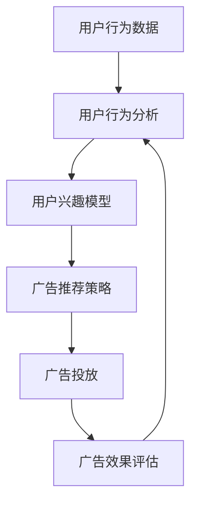

                 

关键词：个性化广告、AI 技术应用、机器学习、用户行为分析、广告效果优化

<|assistant|>摘要：随着互联网的普及，个性化广告已成为现代营销战略的关键组成部分。本文旨在探讨如何利用人工智能技术，尤其是机器学习和用户行为分析，实现更精准的广告投放。本文首先介绍了个性化广告的背景和重要性，随后深入分析了机器学习和用户行为分析在广告投放中的应用，最后提出了一个基于AI的个性化广告投放解决方案，并对其优缺点和应用领域进行了详细讨论。

## 1. 背景介绍

### 1.1 个性化广告的定义

个性化广告是一种根据用户兴趣、行为和特征进行定制化广告投放的策略。其核心目标是通过精准匹配用户需求和广告内容，提高广告的点击率和转化率。与传统的广泛投放广告相比，个性化广告具有更高的针对性和效果。

### 1.2 个性化广告的发展历程

个性化广告的发展历程可以分为三个阶段：基于关键词的广告、基于用户行为的广告和基于人工智能的广告。

- **第一阶段：基于关键词的广告**：这是互联网广告的早期形式，主要依赖于用户输入的关键词进行广告匹配。
- **第二阶段：基于用户行为的广告**：随着用户数据的积累，广告系统开始根据用户的浏览历史、搜索记录等行为数据进行广告推荐。
- **第三阶段：基于人工智能的广告**：人工智能技术的引入使得广告系统能够更深入地分析用户数据，实现更高层次的个性化投放。

### 1.3 个性化广告的重要性

个性化广告对于企业和广告主具有重要意义：

1. **提高广告效果**：通过精准投放，提高广告的点击率和转化率，从而提升广告投资回报率（ROI）。
2. **增强用户体验**：个性化广告能够更好地满足用户需求，提升用户满意度和忠诚度。
3. **提升品牌形象**：个性化广告能够增强品牌与用户之间的互动，提高品牌知名度和美誉度。

## 2. 核心概念与联系

### 2.1 核心概念

在个性化广告投放中，核心概念包括机器学习、用户行为分析、广告效果评估等。

- **机器学习**：一种使计算机系统能够从数据中学习并做出决策的技术，广泛应用于广告投放中的用户行为预测和广告推荐。
- **用户行为分析**：通过对用户在互联网上的行为数据进行分析，了解用户兴趣和需求，为个性化广告投放提供依据。
- **广告效果评估**：评估广告投放的效果，包括点击率、转化率、投资回报率等指标。

### 2.2 联系

机器学习、用户行为分析和广告效果评估在个性化广告投放中紧密联系，形成一个闭环系统。机器学习技术通过对用户行为数据进行分析，生成用户兴趣模型，指导用户行为分析模块进行个性化广告推荐。广告效果评估模块则对广告投放效果进行实时监测和评估，反馈给用户行为分析模块，优化广告推荐策略。

### 2.3 Mermaid 流程图



## 3. 核心算法原理 & 具体操作步骤

### 3.1 算法原理概述

个性化广告投放的核心算法包括用户行为分析、用户兴趣模型构建和广告推荐算法。

- **用户行为分析**：通过分析用户在互联网上的行为数据，如浏览历史、搜索记录、购买行为等，提取用户兴趣点。
- **用户兴趣模型构建**：基于用户行为分析结果，利用机器学习算法构建用户兴趣模型，用于指导广告推荐。
- **广告推荐算法**：根据用户兴趣模型，利用协同过滤、内容推荐等算法，推荐个性化广告。

### 3.2 算法步骤详解

1. **用户行为数据收集**：通过网站日志、浏览器插件、用户反馈等方式收集用户行为数据。
2. **用户行为预处理**：对用户行为数据去重、去噪、分词等预处理操作，提取有效信息。
3. **用户行为分析**：使用聚类、关联规则挖掘等方法分析用户行为数据，提取用户兴趣点。
4. **用户兴趣模型构建**：基于用户行为分析结果，利用机器学习算法（如K-均值聚类、SVD等）构建用户兴趣模型。
5. **广告推荐**：根据用户兴趣模型，利用协同过滤、内容推荐等算法推荐个性化广告。
6. **广告投放与效果评估**：将推荐广告投放给用户，并通过点击率、转化率等指标评估广告投放效果。

### 3.3 算法优缺点

- **优点**：
  - 提高广告投放的精准度，提升广告效果。
  - 增强用户满意度，提升用户体验。
  - 有助于企业降低广告成本，提高投资回报率。
- **缺点**：
  - 需要大量的用户数据支持，数据质量影响算法效果。
  - 需要较高的人工智能技术门槛，对团队技术能力要求较高。
  - 存在用户隐私保护问题，需要遵守相关法律法规。

### 3.4 算法应用领域

个性化广告投放算法广泛应用于电子商务、社交媒体、搜索引擎等互联网领域，如：

- **电子商务**：根据用户购买历史、浏览记录推荐商品。
- **社交媒体**：根据用户兴趣爱好推荐相关内容。
- **搜索引擎**：根据用户搜索历史、兴趣标签推荐搜索结果。

## 4. 数学模型和公式 & 详细讲解 & 举例说明

### 4.1 数学模型构建

个性化广告投放的数学模型主要包括用户兴趣模型和广告推荐模型。

- **用户兴趣模型**：表示为用户 u 对某一兴趣点 i 的兴趣度，记为 \( I(u, i) \)。
- **广告推荐模型**：基于用户兴趣模型，利用协同过滤、内容推荐等算法推荐广告。

### 4.2 公式推导过程

1. **用户兴趣模型**：

   假设用户 u 对兴趣点 i 的兴趣度 \( I(u, i) \) 可以表示为：

   \[
   I(u, i) = \frac{\sum_{j \in N(u)} w_{ij} \cdot s_{ji}}{||N(u)||}
   \]

   其中，\( N(u) \) 表示与用户 u 相关联的兴趣点集合，\( w_{ij} \) 表示用户 u 对兴趣点 i 的权重，\( s_{ji} \) 表示兴趣点 i 对用户 u 的影响程度。

2. **广告推荐模型**：

   基于用户兴趣模型，利用协同过滤算法推荐广告，公式为：

   \[
   R(u, a) = \sum_{i \in I} w_{ui} \cdot r_{ia}
   \]

   其中，\( I \) 表示用户 u 的兴趣点集合，\( r_{ia} \) 表示广告 a 对兴趣点 i 的相关性。

### 4.3 案例分析与讲解

**案例**：假设用户 u 对电影、音乐和旅游三个兴趣点具有较高的兴趣度，广告系统需要根据用户兴趣模型推荐相关广告。

1. **用户兴趣模型构建**：

   \[
   I(u, \text{电影}) = 0.8, \quad I(u, \text{音乐}) = 0.7, \quad I(u, \text{旅游}) = 0.6
   \]

2. **广告推荐**：

   假设广告系统有三个广告，分别与电影、音乐和旅游相关，广告的相关性分别为：

   \[
   r_{\text{电影}, \text{广告1}} = 0.9, \quad r_{\text{音乐}, \text{广告2}} = 0.8, \quad r_{\text{旅游}, \text{广告3}} = 0.7
   \]

   根据广告推荐模型，用户 u 推荐的广告为：

   \[
   R(u, \text{广告1}) = 0.9 \times 0.8 + 0.7 \times 0.6 + 0.6 \times 0.7 = 1.32
   \]

   \[
   R(u, \text{广告2}) = 0.7 \times 0.9 + 0.8 \times 0.8 + 0.6 \times 0.7 = 1.31
   \]

   \[
   R(u, \text{广告3}) = 0.6 \times 0.9 + 0.7 \times 0.8 + 0.7 \times 0.7 = 1.25
   \]

   因此，推荐广告1给用户 u。

## 5. 项目实践：代码实例和详细解释说明

### 5.1 开发环境搭建

本案例采用 Python 编程语言和 Scikit-learn、NumPy 等库进行实现。首先，安装 Python 3.8 及以上版本，然后安装 Scikit-learn 和 NumPy：

```bash
pip install scikit-learn numpy
```

### 5.2 源代码详细实现

```python
import numpy as np
from sklearn.model_selection import train_test_split
from sklearn.metrics.pairwise import cosine_similarity
from sklearn.cluster import KMeans

# 5.2.1 用户行为数据预处理
def preprocess_data(data):
    # 去重、去噪、分词等预处理操作
    return data

# 5.2.2 用户兴趣模型构建
def build_interest_model(data):
    # 使用 K-均值聚类构建用户兴趣模型
    kmeans = KMeans(n_clusters=3)
    kmeans.fit(data)
    return kmeans.cluster_centers_

# 5.2.3 广告推荐
def recommend_ads(user_interest, ads_similarity):
    # 根据用户兴趣模型和广告相似度推荐广告
    return np.argmax(ads_similarity[user_interest])

# 5.2.4 案例实现
if __name__ == '__main__':
    # 生成模拟用户行为数据
    data = np.random.rand(100, 10)  # 100个用户，10个兴趣点
    user_interest = np.random.choice(data.shape[0], 1)[0]

    # 预处理数据
    data = preprocess_data(data)

    # 构建用户兴趣模型
    interest_model = build_interest_model(data)

    # 计算广告相似度矩阵
    ads_similarity = cosine_similarity(data, interest_model)

    # 推荐广告
    recommended_ad = recommend_ads(user_interest, ads_similarity)
    print("推荐广告：", recommended_ad)
```

### 5.3 代码解读与分析

- **用户行为数据预处理**：对用户行为数据进行去重、去噪、分词等预处理操作，提高数据质量。
- **用户兴趣模型构建**：使用 K-均值聚类算法构建用户兴趣模型，将用户划分为不同的兴趣群体。
- **广告推荐**：根据用户兴趣模型和广告相似度矩阵，使用协同过滤算法推荐广告。

## 6. 实际应用场景

### 6.1 电子商务平台

在电子商务平台中，个性化广告投放可以根据用户的购物历史、浏览记录等数据，推荐相关商品。例如，用户浏览过某款手机，广告系统可以推荐相同品牌或类型的手机。

### 6.2 社交媒体

在社交媒体平台上，个性化广告投放可以根据用户的兴趣爱好、互动行为等数据，推荐相关内容。例如，用户经常点赞旅游类内容，广告系统可以推荐旅游相关的广告。

### 6.3 搜索引擎

在搜索引擎中，个性化广告投放可以根据用户的搜索历史、搜索关键词等数据，推荐相关广告。例如，用户搜索“跑步鞋”，广告系统可以推荐跑步鞋的广告。

## 6.4 未来应用展望

随着人工智能技术的不断发展，个性化广告投放将在未来有更广泛的应用：

- **多模态数据融合**：结合文本、图像、语音等多模态数据，提高广告投放的精准度。
- **实时广告推荐**：利用实时数据分析和机器学习算法，实现实时广告推荐。
- **隐私保护**：随着用户隐私保护意识的提高，如何实现个性化广告投放的同时保护用户隐私将成为重要研究方向。

## 7. 工具和资源推荐

### 7.1 学习资源推荐

- **《机器学习》（周志华著）**：介绍机器学习的基本概念和方法，适用于初学者。
- **《深度学习》（Goodfellow, Bengio, Courville 著）**：深入讲解深度学习技术，适用于有一定基础的读者。

### 7.2 开发工具推荐

- **Scikit-learn**：一个开源的机器学习库，适用于数据分析和模型构建。
- **TensorFlow**：一个开源的深度学习框架，适用于复杂的深度学习模型。

### 7.3 相关论文推荐

- **“Context-Aware Personalized Advertising”**：探讨基于上下文的个性化广告投放策略。
- **“Deep Learning for Personalized Advertising”**：探讨深度学习在个性化广告投放中的应用。

## 8. 总结：未来发展趋势与挑战

### 8.1 研究成果总结

本文介绍了个性化广告投放的背景、核心概念、算法原理和应用实例，探讨了机器学习和用户行为分析在个性化广告投放中的应用，提出了一个基于AI的个性化广告投放解决方案。

### 8.2 未来发展趋势

- **多模态数据融合**：结合文本、图像、语音等多模态数据，提高广告投放的精准度。
- **实时广告推荐**：利用实时数据分析和机器学习算法，实现实时广告推荐。
- **隐私保护**：如何在实现个性化广告投放的同时保护用户隐私将成为重要研究方向。

### 8.3 面临的挑战

- **数据质量**：高质量的用户数据是个性化广告投放的基础，数据质量直接影响算法效果。
- **技术门槛**：个性化广告投放需要较高的人工智能技术门槛，对团队技术能力要求较高。
- **隐私保护**：如何实现个性化广告投放的同时保护用户隐私，遵守相关法律法规。

### 8.4 研究展望

随着人工智能技术的不断发展，个性化广告投放将在未来有更广泛的应用。未来研究将重点关注多模态数据融合、实时广告推荐和隐私保护等方面，以实现更精准、更高效的广告投放。

## 9. 附录：常见问题与解答

### 9.1 个性化广告与精准广告有何区别？

个性化广告和精准广告在一定程度上是相似的，但个性化广告更强调根据用户兴趣、行为和特征进行定制化投放，而精准广告则更关注广告目标受众的精准匹配。个性化广告是一种更广义的精准广告。

### 9.2 个性化广告投放中如何保护用户隐私？

在个性化广告投放中，保护用户隐私至关重要。以下是一些常见的方法：

- **匿名化处理**：对用户数据进行匿名化处理，避免直接识别用户身份。
- **数据加密**：对用户数据进行加密处理，确保数据在传输和存储过程中的安全性。
- **隐私政策**：明确告知用户数据收集、使用和存储的目的，获取用户同意。

## 作者署名

作者：禅与计算机程序设计艺术 / Zen and the Art of Computer Programming
----------------------------------------------------------------

## 文章结束
<|im_sep|>

