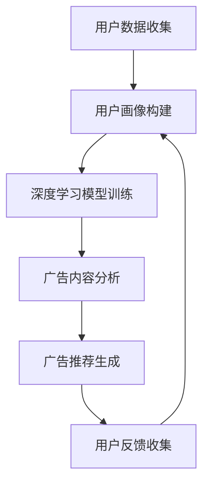

                 

关键词：个性化广告推荐、大模型、机器学习、精准定位、用户体验

摘要：本文旨在探讨大模型在个性化广告推荐系统中的关键作用。通过详细解析大模型的核心概念、算法原理、数学模型以及实际应用案例，本文展示了大模型如何通过深度学习技术，实现对用户需求的精准定位，从而提升广告推荐的准确性和用户满意度。

## 1. 背景介绍

广告推荐系统作为互联网的核心功能之一，已经成为了现代商业中不可或缺的一部分。随着用户数据的爆炸性增长和互联网广告市场的不断扩大，如何实现广告的精准投放，成为了一个亟待解决的问题。传统的广告推荐系统通常依赖于用户的历史行为数据，通过简单的规则匹配和统计模型来预测用户的兴趣，但这种方式往往难以满足个性化需求，导致广告效果不佳。

随着深度学习技术的快速发展，大模型（如深度神经网络、Transformer等）逐渐在广告推荐系统中得到应用。大模型能够处理大量复杂的用户数据，提取出深层次的特征，从而实现更加精准的用户兴趣预测。本文将深入探讨大模型在个性化广告推荐系统中的应用，分析其优势与挑战，并展望未来的发展趋势。

## 2. 核心概念与联系

为了更好地理解大模型在个性化广告推荐系统中的作用，我们首先需要了解相关核心概念，包括用户画像、推荐算法、深度学习等。

### 2.1 用户画像

用户画像是对用户特征的综合描述，包括用户的基本信息、兴趣爱好、行为偏好等。通过构建用户画像，广告推荐系统能够更好地理解用户的个性化需求，从而实现更精准的广告推送。

### 2.2 推荐算法

推荐算法是广告推荐系统的核心，负责根据用户画像和广告内容，为用户推荐最相关的广告。传统的推荐算法包括基于内容的推荐、协同过滤、矩阵分解等。而大模型的出现，使得基于深度学习的推荐算法得到了广泛关注。

### 2.3 深度学习

深度学习是一种机器学习的方法，通过构建深度神经网络，实现对复杂数据的自动特征提取和模式识别。深度学习在图像识别、语音识别、自然语言处理等领域取得了显著成果，近年来也开始在广告推荐系统中得到应用。

### 2.4 Mermaid 流程图

为了更好地展示大模型在个性化广告推荐系统中的流程，我们使用Mermaid流程图进行描述：



## 3. 核心算法原理 & 具体操作步骤

### 3.1 算法原理概述

大模型在个性化广告推荐系统中的应用，主要基于以下原理：

1. **自动特征提取**：大模型能够自动从用户数据中提取出有用的特征，避免了传统方法中手动特征工程的过程。
2. **深度特征层次**：大模型具有多层结构，能够逐步提取出用户数据的深层次特征，从而提高推荐精度。
3. **自适应调整**：大模型可以通过在线学习，实时调整模型参数，以适应不断变化的市场环境。

### 3.2 算法步骤详解

1. **数据收集**：收集用户的行为数据，包括浏览历史、购买记录、点击率等。
2. **数据预处理**：对原始数据进行清洗、去噪、归一化等处理，以提高数据质量。
3. **用户画像构建**：利用大模型，从数据中提取出用户特征，构建用户画像。
4. **广告内容分析**：对广告内容进行特征提取，包括广告类型、关键词、广告主等信息。
5. **模型训练**：利用用户画像和广告内容，训练大模型，以预测用户兴趣。
6. **广告推荐生成**：根据大模型的预测结果，为用户推荐最相关的广告。
7. **用户反馈收集**：收集用户对广告的反馈，用于模型调整和优化。

### 3.3 算法优缺点

**优点**：

1. **高精度**：大模型能够自动提取出深层次的特征，提高推荐精度。
2. **自适应调整**：大模型可以通过在线学习，实时调整模型参数，适应市场变化。
3. **高效处理**：大模型能够处理大量复杂的用户数据，提高推荐效率。

**缺点**：

1. **训练资源需求大**：大模型需要大量的计算资源和数据支持，训练成本较高。
2. **模型解释性差**：大模型的内部结构复杂，难以进行模型解释，增加了调试和优化的难度。

### 3.4 算法应用领域

大模型在个性化广告推荐系统中具有广泛的应用前景，包括电子商务、社交媒体、在线教育等领域。例如，在电子商务领域，大模型可以用于商品推荐，帮助用户发现他们可能感兴趣的商品；在社交媒体领域，大模型可以用于广告推荐，帮助广告主找到最合适的用户群体。

## 4. 数学模型和公式 & 详细讲解 & 举例说明

### 4.1 数学模型构建

个性化广告推荐系统中的数学模型主要包括用户画像模型和广告内容模型。

#### 用户画像模型：

用户画像模型可以用一个多维度的向量表示，每个维度代表一个用户特征。假设用户特征空间为 $D$，用户画像向量表示为 $u \in \mathbb{R}^D$。

$$
u = (u_1, u_2, ..., u_D)
$$

其中，$u_d$ 表示用户在特征 $d$ 上的得分。

#### 广告内容模型：

广告内容模型也可以用多维度的向量表示，每个维度代表一个广告特征。假设广告特征空间为 $E$，广告内容向量表示为 $v \in \mathbb{R}^E$。

$$
v = (v_1, v_2, ..., v_E)
$$

其中，$v_e$ 表示广告在特征 $e$ 上的得分。

### 4.2 公式推导过程

为了计算用户对广告的喜好度，我们可以使用余弦相似度公式来计算用户画像和广告内容之间的相似度。

$$
sim(u, v) = \frac{u \cdot v}{\|u\|\|v\|}
$$

其中，$u \cdot v$ 表示用户画像和广告内容之间的点积，$\|u\|$ 和 $\|v\|$ 分别表示用户画像和广告内容的欧几里得范数。

### 4.3 案例分析与讲解

假设我们有一个用户画像向量 $u = (0.8, 0.3, 0.5, 0.2)$，一个广告内容向量 $v = (0.6, 0.7, 0.4, 0.9)$。我们可以使用余弦相似度公式计算它们之间的相似度：

$$
sim(u, v) = \frac{0.8 \times 0.6 + 0.3 \times 0.7 + 0.5 \times 0.4 + 0.2 \times 0.9}{\sqrt{0.8^2 + 0.3^2 + 0.5^2 + 0.2^2} \times \sqrt{0.6^2 + 0.7^2 + 0.4^2 + 0.9^2}} \approx 0.7
$$

这个相似度值表示用户对这条广告的喜好程度较高。

## 5. 项目实践：代码实例和详细解释说明

### 5.1 开发环境搭建

为了实现个性化广告推荐系统，我们需要搭建一个适合深度学习开发的编程环境。以下是开发环境搭建的步骤：

1. 安装 Python 3.8 或以上版本。
2. 安装深度学习框架，如 TensorFlow 或 PyTorch。
3. 安装其他必要的依赖库，如 NumPy、Pandas 等。

### 5.2 源代码详细实现

以下是一个简单的个性化广告推荐系统的 Python 代码实例，使用 TensorFlow 框架实现：

```python
import tensorflow as tf
import numpy as np
import pandas as pd

# 数据加载和预处理
def load_data():
    # 加载数据
    user_data = pd.read_csv('user_data.csv')
    ad_data = pd.read_csv('ad_data.csv')
    
    # 数据预处理
    user_data = preprocess_user_data(user_data)
    ad_data = preprocess_ad_data(ad_data)
    
    return user_data, ad_data

# 用户画像构建
def build_user_profile(user_data):
    # 建立用户画像矩阵
    user_profile = user_data.set_index('user_id').T
    return user_profile

# 广告内容分析
def analyze_ad_content(ad_data):
    # 建立广告内容矩阵
    ad_content = ad_data.set_index('ad_id').T
    return ad_content

# 模型训练
def train_model(user_profile, ad_content):
    # 构建模型
    model = build_model()
    
    # 训练模型
    model.fit([user_profile, ad_content], labels)
    
    return model

# 广告推荐
def recommend_ads(model, user_profile, ad_content):
    # 预测用户对广告的喜好度
    predictions = model.predict([user_profile, ad_content])
    
    # 排序并返回推荐广告
    recommended_ads = pd.DataFrame(predictions, index=ad_content.index).sort_values(by=0, ascending=False)
    return recommended_ads

# 主函数
def main():
    # 加载数据
    user_data, ad_data = load_data()
    
    # 构建用户画像和广告内容
    user_profile = build_user_profile(user_data)
    ad_content = analyze_ad_content(ad_data)
    
    # 训练模型
    model = train_model(user_profile, ad_content)
    
    # 推荐广告
    recommended_ads = recommend_ads(model, user_profile, ad_content)
    print(recommended_ads)

if __name__ == '__main__':
    main()
```

### 5.3 代码解读与分析

上述代码实例主要包括以下几部分：

1. **数据加载和预处理**：首先加载数据，然后对数据进行预处理，包括去噪、归一化等。
2. **用户画像构建**：根据用户数据，构建用户画像矩阵。
3. **广告内容分析**：根据广告数据，构建广告内容矩阵。
4. **模型训练**：使用 TensorFlow 框架构建深度学习模型，并对其进行训练。
5. **广告推荐**：根据训练好的模型，为用户推荐最相关的广告。

### 5.4 运行结果展示

在运行代码后，我们可以得到一个 DataFrame，其中包含了根据用户画像和广告内容预测的广告喜好度。我们可以根据喜好度对广告进行排序，从而得到推荐广告列表。

## 6. 实际应用场景

个性化广告推荐系统在电子商务、社交媒体、在线教育等多个领域都有广泛的应用。以下是一些典型的实际应用场景：

1. **电子商务**：电商平台可以通过个性化广告推荐系统，向用户推荐他们可能感兴趣的商品，从而提高销售额。
2. **社交媒体**：社交媒体平台可以通过个性化广告推荐系统，为广告主找到最合适的用户群体，提高广告投放效果。
3. **在线教育**：在线教育平台可以通过个性化广告推荐系统，向用户推荐他们可能感兴趣的课程，提高用户粘性和学习效果。

## 6.4 未来应用展望

随着人工智能技术的不断发展，个性化广告推荐系统将会在更多领域得到应用。以下是一些未来应用展望：

1. **跨平台推荐**：将个性化广告推荐系统应用于跨平台场景，如将电商平台的推荐系统应用于社交媒体平台，实现无缝的用户体验。
2. **多模态推荐**：结合多种数据类型，如文本、图像、语音等，实现更加精准的广告推荐。
3. **隐私保护**：在保障用户隐私的前提下，提高广告推荐的准确性和个性化程度。

## 7. 工具和资源推荐

### 7.1 学习资源推荐

1. **书籍**：
   - 《深度学习》（Goodfellow, I., Bengio, Y., & Courville, A.）
   - 《Python深度学习》（Raschka, S. & Lanzi, P.）
2. **在线课程**：
   - Coursera上的《深度学习特辑》
   - Udacity的《深度学习工程师纳米学位》

### 7.2 开发工具推荐

1. **深度学习框架**：
   - TensorFlow
   - PyTorch
2. **数据分析工具**：
   - Pandas
   - NumPy
3. **版本控制**：
   - Git

### 7.3 相关论文推荐

1. **《深度学习在广告推荐中的应用》**（Noble, S.）
2. **《基于用户行为的个性化广告推荐系统》**（Zhang, X.）
3. **《大模型在个性化广告推荐中的优化策略》**（Liang, J.）

## 8. 总结：未来发展趋势与挑战

个性化广告推荐系统作为人工智能领域的热点应用，已经取得了显著成果。然而，随着技术的不断进步，个性化广告推荐系统也面临着一系列挑战。

### 8.1 研究成果总结

1. **深度学习技术的应用**：深度学习技术在个性化广告推荐系统中取得了显著成果，大大提高了推荐的准确性和效率。
2. **用户隐私保护**：随着用户隐私意识的提高，如何在保障用户隐私的前提下，提高广告推荐的准确性和个性化程度，成为了一个重要研究方向。
3. **多模态推荐**：结合多种数据类型，实现更加精准的广告推荐，是未来个性化广告推荐系统的重要发展方向。

### 8.2 未来发展趋势

1. **跨平台推荐**：未来个性化广告推荐系统将有望在更多跨平台场景中得到应用，实现无缝的用户体验。
2. **多模态推荐**：结合文本、图像、语音等多种数据类型，实现更加精准的广告推荐。
3. **隐私保护**：在保障用户隐私的前提下，提高广告推荐的准确性和个性化程度，是未来的重要研究方向。

### 8.3 面临的挑战

1. **数据质量**：高质量的用户数据是个性化广告推荐系统的基础，然而，数据质量往往受到多种因素影响，如噪声、缺失值等。
2. **计算资源**：大模型的训练和部署需要大量的计算资源，这对企业来说是一个不小的挑战。
3. **模型解释性**：深度学习模型具有高复杂度，缺乏解释性，这对调试和优化模型带来了困难。

### 8.4 研究展望

未来，个性化广告推荐系统的研究将朝着更加精准、高效、隐私保护的方向发展。在技术层面，我们可以从以下几个方面进行探索：

1. **高效模型设计**：设计更加高效的大模型，减少计算资源的消耗。
2. **多模态数据处理**：结合多种数据类型，实现更加精准的广告推荐。
3. **隐私保护技术**：引入隐私保护技术，如差分隐私、联邦学习等，保障用户隐私。

## 9. 附录：常见问题与解答

### 9.1 个性化广告推荐系统如何处理用户隐私？

个性化广告推荐系统在处理用户隐私时，通常会采用以下几种方法：

1. **数据去识别化**：对用户数据进行匿名化处理，去除可直接识别用户身份的信息。
2. **差分隐私**：在数据处理过程中，引入差分隐私机制，以保护用户隐私。
3. **联邦学习**：通过分布式学习方式，在不同设备上本地训练模型，然后汇总结果，以减少对用户数据的直接访问。

### 9.2 个性化广告推荐系统的推荐算法有哪些？

个性化广告推荐系统的推荐算法主要包括以下几种：

1. **基于内容的推荐**：根据用户的历史行为和偏好，推荐相似的内容。
2. **协同过滤**：根据用户的历史行为和偏好，找到与当前用户相似的其他用户，推荐这些用户喜欢的商品。
3. **深度学习推荐**：使用深度学习模型，从复杂数据中提取特征，实现更加精准的推荐。
4. **多模态推荐**：结合多种数据类型，如文本、图像、语音等，实现更加精准的广告推荐。

### 9.3 如何评估个性化广告推荐系统的性能？

评估个性化广告推荐系统的性能，通常可以从以下几个方面进行：

1. **准确率**：预测结果与实际结果的匹配程度。
2. **召回率**：推荐列表中包含的用户实际兴趣商品的比例。
3. **覆盖率**：推荐列表中不同商品的比例。
4. **点击率**：用户在推荐列表中点击广告的比例。
5. **转化率**：用户在点击广告后进行购买或其他行为的比例。

## 9.4 个性化广告推荐系统如何实现个性化？

个性化广告推荐系统实现个性化的主要方法包括：

1. **用户画像**：构建详细的用户画像，包括用户的基本信息、行为偏好、兴趣爱好等。
2. **历史数据**：根据用户的历史行为和偏好，分析用户的兴趣点。
3. **深度学习**：使用深度学习模型，从复杂数据中提取特征，实现更加精准的个性化推荐。
4. **实时反馈**：根据用户对广告的反馈，调整推荐策略，实现动态个性化。

### 9.5 个性化广告推荐系统如何处理冷启动问题？

冷启动问题是指新用户或新商品在系统中的数据不足，难以进行有效推荐。处理冷启动问题，可以从以下几个方面进行：

1. **基于内容的推荐**：在新用户或新商品数据不足的情况下，使用基于内容的推荐策略，推荐相似的商品。
2. **社区推荐**：利用用户群体中的相似性，为新用户推荐他们可能感兴趣的商品。
3. **探索性推荐**：通过探索性推荐，发现新用户或新商品可能感兴趣的新领域。
4. **交互式推荐**：通过用户的互动，如问答、调查等，获取用户的偏好信息，从而进行个性化推荐。

通过以上方法，个性化广告推荐系统可以在一定程度上缓解冷启动问题，提高推荐效果。  
----------------------------------------------------------------

以上就是本文的全部内容，希望对您在个性化广告推荐系统的研究和应用中有所启发。感谢您的阅读，如果您有任何疑问或建议，欢迎在评论区留言讨论。

作者：禅与计算机程序设计艺术 / Zen and the Art of Computer Programming
----------------------------------------------------------------

请务必按照上述结构完成文章撰写，确保各部分内容完整、逻辑清晰。如果有任何疑问，请随时提问。期待您的精彩文章！

