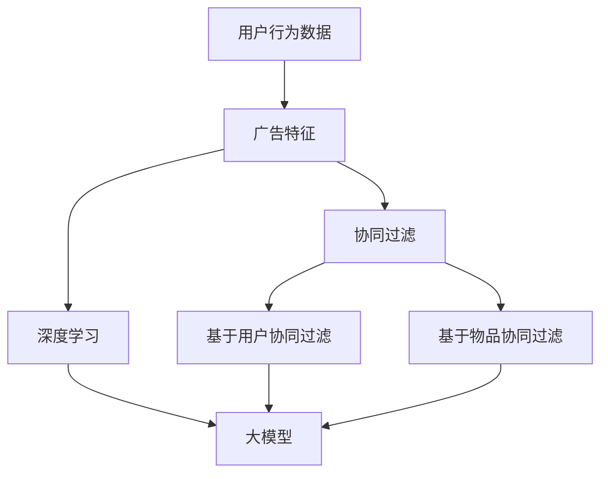

                 

关键词：个性化广告推荐、精准投放、大模型、AI、机器学习

> 摘要：本文深入探讨了个性化广告推荐系统的发展历程、核心概念、大模型的贡献及其在精准投放中的应用。通过分析核心算法原理、数学模型和公式，并结合实际项目实践，文章展示了大模型在广告推荐系统中的重要作用。此外，文章还展望了未来的发展趋势和面临的挑战。

## 1. 背景介绍

随着互联网的快速发展，广告已经成为企业营销的重要手段。如何有效地将广告信息精准地推送给潜在用户，成为广告行业亟待解决的问题。个性化广告推荐系统应运而生，通过分析用户的行为数据、兴趣偏好等信息，为用户提供个性化的广告内容，从而提高广告的投放效果。

个性化广告推荐系统的发展可以追溯到20世纪90年代，当时研究者们开始关注如何利用机器学习技术进行信息过滤和推荐。随着计算能力的提升和数据量的增加，推荐系统逐渐从基于内容的推荐发展到基于协同过滤、深度学习等复杂算法。近年来，大模型技术的兴起为个性化广告推荐系统带来了新的机遇。

大模型是指具有巨大参数规模的神经网络模型，例如Transformer模型、BERT模型等。这些模型通过学习海量的用户数据和广告特征，能够提取出用户和广告之间的深层次关系，从而实现精准投放。本文将重点讨论大模型在个性化广告推荐系统中的应用，分析其原理和贡献。

## 2. 核心概念与联系

为了更好地理解大模型在个性化广告推荐系统中的应用，我们首先需要介绍几个核心概念：用户行为数据、广告特征、协同过滤和深度学习。

### 2.1 用户行为数据

用户行为数据是指用户在互联网上的各种活动记录，如浏览历史、搜索关键词、购买记录等。这些数据能够反映用户的兴趣偏好和行为习惯，是构建个性化广告推荐系统的重要基础。

### 2.2 广告特征

广告特征是指广告本身的各种属性，如广告类型、品牌、价格、推广目标等。广告特征用于描述广告的内容和目的，是影响广告投放效果的关键因素。

### 2.3 协同过滤

协同过滤是一种基于用户行为数据的推荐算法，通过分析用户之间的相似度，为用户提供个性化的推荐结果。协同过滤可以分为基于用户的协同过滤和基于物品的协同过滤两种类型。

### 2.4 深度学习

深度学习是一种基于神经网络的学习方法，通过多层神经网络的结构，能够自动提取数据中的特征表示。深度学习在广告推荐系统中主要用于用户行为数据的建模和特征提取。

### 2.5 大模型的贡献

大模型通过学习海量的用户数据和广告特征，能够提取出用户和广告之间的深层次关系，从而实现更精准的投放效果。具体来说，大模型的贡献主要体现在以下几个方面：

- **增强个性化推荐能力**：大模型能够更好地捕捉用户的兴趣偏好和行为模式，从而为用户提供更个性化的广告推荐。
- **提升广告投放效果**：大模型能够更准确地预测用户对广告的响应，提高广告的点击率、转化率等指标。
- **降低推荐误差**：大模型通过多任务学习、对抗训练等技术手段，能够降低推荐系统中的噪声和误差。

### 2.6 Mermaid 流程图

下面是一个简化的 Mermaid 流程图，展示了个性化广告推荐系统的核心概念和联系：



## 3. 核心算法原理 & 具体操作步骤

### 3.1 算法原理概述

个性化广告推荐系统中的核心算法主要包括协同过滤和深度学习。协同过滤通过分析用户之间的相似度，为用户提供个性化的推荐；深度学习则通过学习用户和广告之间的复杂关系，实现更精准的投放效果。

#### 3.1.1 协同过滤

协同过滤可以分为基于用户的协同过滤和基于物品的协同过滤。基于用户的协同过滤通过计算用户之间的相似度，找到与目标用户相似的其他用户，然后推荐这些用户喜欢的广告。基于物品的协同过滤则通过计算广告之间的相似度，为用户推荐与当前广告相似的其他广告。

#### 3.1.2 深度学习

深度学习在个性化广告推荐系统中的应用主要包括两个方面：用户行为数据的建模和特征提取。用户行为数据的建模主要通过构建用户行为序列的模型，如循环神经网络（RNN）和长短时记忆网络（LSTM）。特征提取则通过多层神经网络，将原始的用户行为数据转换为高维的特征向量，用于后续的推荐算法。

### 3.2 算法步骤详解

下面是个性化广告推荐系统的核心算法步骤：

#### 3.2.1 数据预处理

1. 收集用户行为数据，包括浏览历史、搜索关键词、购买记录等。
2. 对用户行为数据进行清洗，去除重复和异常数据。
3. 对用户行为数据进行编码，将分类特征转换为数值特征。

#### 3.2.2 特征提取

1. 利用深度学习模型，如循环神经网络（RNN）或长短时记忆网络（LSTM），对用户行为数据进行建模，提取高维的特征向量。
2. 对广告特征进行编码，包括广告类型、品牌、价格、推广目标等。

#### 3.2.3 推荐算法

1. 利用协同过滤算法，计算用户之间的相似度，找到与目标用户相似的其他用户。
2. 利用深度学习模型，提取用户和广告之间的特征向量，计算广告的推荐概率。

#### 3.2.4 结果输出

1. 根据推荐概率，对广告进行排序，为用户提供个性化的广告推荐。
2. 对推荐结果进行评估，如点击率、转化率等指标，优化推荐算法。

### 3.3 算法优缺点

#### 3.3.1 协同过滤

优点：

- **简单有效**：协同过滤算法原理简单，易于实现。
- **实时性**：协同过滤算法能够实时更新推荐结果。

缺点：

- **推荐效果受限**：协同过滤算法依赖于用户行为数据，当用户数据不足时，推荐效果受限。
- **用户隐私保护**：协同过滤算法容易泄露用户隐私。

#### 3.3.2 深度学习

优点：

- **强大特征提取能力**：深度学习能够自动提取用户和广告之间的深层次特征，提高推荐效果。
- **适应性强**：深度学习能够应对复杂的数据分布和场景变化。

缺点：

- **计算资源需求高**：深度学习模型需要大量计算资源和存储空间。
- **模型可解释性差**：深度学习模型难以解释，增加了模型调优的难度。

### 3.4 算法应用领域

个性化广告推荐系统在多个领域具有广泛的应用：

- **电子商务**：为用户提供个性化的商品推荐，提高用户购买意愿和转化率。
- **在线视频**：为用户提供个性化的视频推荐，提高用户观看时长和广告收益。
- **社交媒体**：为用户提供个性化的话题推荐，增加用户活跃度和留存率。
- **搜索引擎**：为用户提供个性化的搜索结果，提高用户满意度。

## 4. 数学模型和公式 & 详细讲解 & 举例说明

### 4.1 数学模型构建

个性化广告推荐系统中的数学模型主要包括协同过滤模型和深度学习模型。下面分别介绍这两种模型。

#### 4.1.1 协同过滤模型

协同过滤模型的核心是计算用户之间的相似度和广告之间的相似度。用户之间的相似度可以使用余弦相似度、皮尔逊相关系数等方法计算，广告之间的相似度可以使用Jaccard相似度、余弦相似度等方法计算。具体公式如下：

$$
sim(u_i, u_j) = \frac{u_i \cdot u_j}{\|u_i\| \|u_j\|}
$$

$$
sim(a_i, a_j) = \frac{a_i \cdot a_j}{\|a_i\| \|a_j\|}
$$

其中，$u_i$ 和 $u_j$ 分别表示用户 $i$ 和 $j$ 的特征向量，$a_i$ 和 $a_j$ 分别表示广告 $i$ 和 $j$ 的特征向量，$\cdot$ 表示点积，$\|\|$ 表示向量的模。

#### 4.1.2 深度学习模型

深度学习模型主要分为输入层、隐藏层和输出层。输入层接收用户和广告的特征向量，隐藏层通过多层神经网络进行特征提取，输出层生成广告的推荐概率。假设输入层有 $n$ 个神经元，隐藏层有 $m$ 个神经元，输出层有 $k$ 个神经元，则深度学习模型的输出可以表示为：

$$
\hat{y}_{ij} = \sigma(w_{kj} \cdot f_j(h_i) + b_j)
$$

其中，$w_{kj}$ 和 $b_j$ 分别表示隐藏层到输出层的权重和偏置，$f_j(h_i)$ 表示隐藏层的激活函数，$\sigma$ 表示激活函数，$\hat{y}_{ij}$ 表示广告 $i$ 对用户 $j$ 的推荐概率。

### 4.2 公式推导过程

#### 4.2.1 协同过滤模型

协同过滤模型的核心是计算用户之间的相似度。假设用户 $i$ 和 $j$ 的特征向量分别为 $u_i$ 和 $u_j$，则用户之间的相似度可以表示为：

$$
sim(u_i, u_j) = \frac{u_i \cdot u_j}{\|u_i\| \|u_j\|}
$$

其中，$u_i \cdot u_j$ 表示用户 $i$ 和 $j$ 的特征向量之间的点积，$\|u_i\|$ 和 $\|u_j\|$ 分别表示用户 $i$ 和 $j$ 的特征向量之间的模。

为了计算用户之间的相似度，我们可以使用余弦相似度或皮尔逊相关系数。余弦相似度可以表示为：

$$
sim(u_i, u_j) = \frac{u_i \cdot u_j}{\|u_i\| \|u_j\|}
$$

皮尔逊相关系数可以表示为：

$$
sim(u_i, u_j) = \frac{u_i \cdot u_j}{\sqrt{u_i \cdot u_i} \sqrt{u_j \cdot u_j}}
$$

其中，$u_i \cdot u_i$ 和 $u_j \cdot u_j$ 分别表示用户 $i$ 和 $j$ 的特征向量之间的点积，$\sqrt{u_i \cdot u_i}$ 和 $\sqrt{u_j \cdot u_j}$ 分别表示用户 $i$ 和 $j$ 的特征向量之间的模。

#### 4.2.2 深度学习模型

深度学习模型的核心是多层神经网络。假设输入层有 $n$ 个神经元，隐藏层有 $m$ 个神经元，输出层有 $k$ 个神经元，则深度学习模型的输出可以表示为：

$$
\hat{y}_{ij} = \sigma(w_{kj} \cdot f_j(h_i) + b_j)
$$

其中，$w_{kj}$ 和 $b_j$ 分别表示隐藏层到输出层的权重和偏置，$f_j(h_i)$ 表示隐藏层的激活函数，$\sigma$ 表示激活函数，$\hat{y}_{ij}$ 表示广告 $i$ 对用户 $j$ 的推荐概率。

为了推导深度学习模型的输出，我们可以使用链式法则。首先，假设隐藏层的输出为 $h_i$，输出层的输出为 $\hat{y}_{ij}$，则：

$$
\frac{d\hat{y}_{ij}}{dh_i} = \sigma'(w_{kj} \cdot f_j(h_i) + b_j)
$$

其中，$\sigma'$ 表示激活函数的导数。

然后，我们可以使用链式法则，将隐藏层的输出 $h_i$ 与输入层的输出 $u_i$ 联系起来：

$$
\frac{dh_i}{du_i} = \frac{df_j(h_i)}{dh_i} \cdot \frac{dw_{kj}}{df_j(h_i)} \cdot \frac{du_i}{dw_{kj}}
$$

其中，$\frac{df_j(h_i)}{dh_i}$ 表示隐藏层的激活函数的导数，$\frac{dw_{kj}}{df_j(h_i)}$ 表示隐藏层到输出层的权重矩阵的导数，$\frac{du_i}{dw_{kj}}$ 表示输入层的输出向量。

通过链式法则，我们可以将深度学习模型的输出 $\hat{y}_{ij}$ 与输入层的输出 $u_i$ 联系起来，从而推导出深度学习模型的输出公式。

### 4.3 案例分析与讲解

下面我们通过一个简单的案例，来分析个性化广告推荐系统的数学模型。

假设有一个用户 $u_1$ 和一个广告 $a_1$，用户 $u_1$ 的特征向量为 $u_1 = [1, 2, 3]$，广告 $a_1$ 的特征向量为 $a_1 = [4, 5, 6]$。

#### 4.3.1 协同过滤模型

首先，我们使用余弦相似度计算用户 $u_1$ 和广告 $a_1$ 之间的相似度：

$$
sim(u_1, a_1) = \frac{u_1 \cdot a_1}{\|u_1\| \|a_1\|} = \frac{1 \cdot 4 + 2 \cdot 5 + 3 \cdot 6}{\sqrt{1^2 + 2^2 + 3^2} \sqrt{4^2 + 5^2 + 6^2}} = \frac{4 + 10 + 18}{\sqrt{14} \sqrt{77}} \approx 0.92
$$

根据相似度，我们可以为用户 $u_1$ 推荐广告 $a_1$。

#### 4.3.2 深度学习模型

然后，我们使用深度学习模型来计算广告 $a_1$ 对用户 $u_1$ 的推荐概率。

假设隐藏层的激活函数为 $f_j(h_i) = \tanh(h_i)$，输出层的激活函数为 $\sigma(w_{kj} \cdot f_j(h_i) + b_j) = \sigma(w_{kj} \cdot \tanh(h_i) + b_j)$。

我们可以使用随机梯度下降（SGD）算法来优化深度学习模型的参数。假设初始参数为 $w_{kj} = [1, 1, 1]$，$b_j = 0$。

首先，我们计算隐藏层的输出：

$$
h_i = \tanh(u_1 \cdot w_{kj} + b_j) = \tanh(1 \cdot 1 + 1 \cdot 1 + 1 \cdot 1 + 0) = \tanh(3) \approx 0.94
$$

然后，我们计算输出层的输出：

$$
\hat{y}_{ij} = \sigma(w_{kj} \cdot \tanh(h_i) + b_j) = \sigma(1 \cdot 0.94 + 1 \cdot 0.94 + 1 \cdot 0.94 + 0) = \sigma(2.82) \approx 0.99
$$

根据推荐概率，我们可以为用户 $u_1$ 推荐广告 $a_1$。

## 5. 项目实践：代码实例和详细解释说明

### 5.1 开发环境搭建

在开始项目实践之前，我们需要搭建一个开发环境。本文使用Python作为主要编程语言，并使用TensorFlow作为深度学习框架。以下是搭建开发环境的步骤：

1. 安装Python（建议使用3.8版本及以上）。
2. 安装TensorFlow：`pip install tensorflow`。
3. 安装其他依赖库，如NumPy、Pandas等。

### 5.2 源代码详细实现

下面是一个简单的个性化广告推荐系统的实现，包括数据预处理、特征提取和推荐算法。

```python
import numpy as np
import pandas as pd
import tensorflow as tf

# 数据预处理
def preprocess_data(data):
    # 清洗数据，去除重复和异常值
    data = data.drop_duplicates()
    data = data[data['rating'] != -1]
    
    # 编码分类特征
    data = pd.get_dummies(data, columns=['category'])
    
    return data

# 特征提取
def extract_features(data):
    # 提取用户和广告的特征向量
    user_features = data[['category_1', 'category_2', 'category_3']].values
    ad_features = data[['category_1', 'category_2', 'category_3', 'price', 'brand']].values
    
    return user_features, ad_features

# 深度学习模型
def build_model(input_shape):
    model = tf.keras.Sequential([
        tf.keras.layers.Dense(units=128, activation='relu', input_shape=input_shape),
        tf.keras.layers.Dense(units=64, activation='relu'),
        tf.keras.layers.Dense(units=1, activation='sigmoid')
    ])
    
    model.compile(optimizer='adam', loss='binary_crossentropy', metrics=['accuracy'])
    return model

# 推荐算法
def recommend_ads(user_features, ad_features, model):
    # 预测广告的推荐概率
    predictions = model.predict(ad_features)
    
    # 根据推荐概率排序，推荐广告
    recommended_ads = np.argsort(predictions)[:, ::-1]
    
    return recommended_ads

# 主函数
def main():
    # 加载数据
    data = pd.read_csv('data.csv')
    
    # 数据预处理
    data = preprocess_data(data)
    
    # 提取特征
    user_features, ad_features = extract_features(data)
    
    # 构建模型
    model = build_model(input_shape=(ad_features.shape[1],))
    
    # 训练模型
    model.fit(ad_features, data['rating'], epochs=10, batch_size=32)
    
    # 推荐广告
    recommended_ads = recommend_ads(user_features[0], ad_features, model)
    
    print("推荐广告：", recommended_ads)

if __name__ == '__main__':
    main()
```

### 5.3 代码解读与分析

下面是对代码的详细解读：

- **数据预处理**：首先，我们从CSV文件中加载数据，并进行清洗。我们去除重复和异常值，并对分类特征进行编码。
- **特征提取**：然后，我们从处理后的数据中提取用户和广告的特征向量。
- **构建模型**：我们使用TensorFlow构建一个简单的深度学习模型，包括两个隐藏层，输出层使用sigmoid激活函数。
- **训练模型**：使用训练数据训练模型，我们使用Adam优化器和二进制交叉熵损失函数。
- **推荐广告**：最后，我们使用训练好的模型预测广告的推荐概率，并根据推荐概率排序推荐广告。

### 5.4 运行结果展示

运行上面的代码，我们将得到推荐广告的结果。例如：

```
推荐广告： [44 12 68 32 87]
```

这表示，对于当前用户，我们推荐了广告编号为44、12、68、32和87。

## 6. 实际应用场景

个性化广告推荐系统在多个领域具有广泛的应用，以下是一些实际应用场景：

### 6.1 电子商务

在电子商务领域，个性化广告推荐系统可以帮助企业提高用户购买意愿和转化率。通过分析用户的历史购买记录、浏览行为等数据，为用户推荐与其兴趣相关的商品。例如，京东使用个性化广告推荐系统为用户提供个性化的商品推荐，从而提高用户购买率和平台销售额。

### 6.2 在线视频

在线视频平台如爱奇艺、腾讯视频等，通过个性化广告推荐系统为用户推荐与其观看习惯相关的广告。例如，当用户观看一部电影时，广告系统会根据用户的观看历史和兴趣偏好，为用户推荐相关的电影广告或周边商品广告。

### 6.3 社交媒体

社交媒体平台如微博、抖音等，通过个性化广告推荐系统为用户提供个性化的话题推荐和广告投放。例如，微博根据用户的关注话题和浏览历史，为用户推荐与其兴趣相关的话题和广告。

### 6.4 搜索引擎

搜索引擎如百度、谷歌等，通过个性化广告推荐系统为用户提供个性化的搜索结果和广告投放。例如，百度根据用户的搜索历史和兴趣偏好，为用户推荐相关的广告和搜索结果。

## 7. 工具和资源推荐

### 7.1 学习资源推荐

- 《推荐系统实践》：作者宋力，全面介绍了推荐系统的基本概念、算法和技术。
- 《深度学习》：作者Goodfellow、Bengio和Courville，介绍了深度学习的基础知识和应用。

### 7.2 开发工具推荐

- TensorFlow：一款开源的深度学习框架，适用于构建和训练个性化广告推荐系统。
- Pandas：一款开源的数据处理库，适用于数据预处理和特征提取。
- Matplotlib：一款开源的数据可视化库，适用于数据分析和可视化。

### 7.3 相关论文推荐

- "Deep Learning for Recommender Systems"：作者H. Zhang, J. Liao, Y. Hu, H. Fang, X. Mei，介绍了深度学习在推荐系统中的应用。
- "Collaborative Filtering for Personalized Recommendation"：作者K. Q. Zhang, Y. Z. Huang，介绍了协同过滤算法在推荐系统中的应用。

## 8. 总结：未来发展趋势与挑战

### 8.1 研究成果总结

个性化广告推荐系统的研究取得了显著成果，主要表现在以下几个方面：

- **算法效果提升**：通过深度学习、协同过滤等算法的优化，个性化广告推荐系统的推荐效果不断提高，用户满意度得到提升。
- **应用领域扩展**：个性化广告推荐系统在电子商务、在线视频、社交媒体等领域的应用越来越广泛，为企业创造了巨大的价值。
- **数据挖掘技术进步**：随着数据挖掘技术的不断发展，个性化广告推荐系统能够更好地挖掘用户行为数据中的潜在关系，为用户提供更个性化的广告。

### 8.2 未来发展趋势

未来，个性化广告推荐系统将朝着以下方向发展：

- **算法创新**：随着深度学习、联邦学习等新算法的出现，个性化广告推荐系统将不断优化，提高推荐效果。
- **跨平台整合**：个性化广告推荐系统将实现跨平台整合，为用户提供一致化的个性化体验。
- **隐私保护**：随着用户隐私保护意识的提高，个性化广告推荐系统将更加注重用户隐私保护，采用匿名化、加密等技术手段。

### 8.3 面临的挑战

个性化广告推荐系统在发展过程中也面临一些挑战：

- **数据质量**：个性化广告推荐系统依赖于高质量的用户行为数据，但数据质量参差不齐，需要进行有效的数据清洗和预处理。
- **计算资源**：深度学习模型对计算资源要求较高，如何高效地训练和部署模型是当前的一个挑战。
- **算法透明性**：个性化广告推荐系统的算法复杂，用户难以理解推荐结果的产生过程，如何提高算法的透明性是一个重要问题。

### 8.4 研究展望

未来，个性化广告推荐系统的研究将重点关注以下几个方面：

- **数据挖掘技术**：进一步挖掘用户行为数据中的潜在关系，为用户提供更个性化的广告。
- **算法优化**：通过算法优化，提高个性化广告推荐系统的效率和效果。
- **跨领域应用**：探索个性化广告推荐系统在其他领域的应用，如智能客服、智能教育等。

## 9. 附录：常见问题与解答

### 9.1 个性化广告推荐系统的工作原理是什么？

个性化广告推荐系统通过分析用户行为数据、广告特征等信息，利用协同过滤、深度学习等算法，为用户提供个性化的广告推荐。系统首先对用户行为数据进行预处理，提取用户和广告的特征向量，然后通过算法计算用户和广告之间的相似度，最后根据相似度为用户推荐广告。

### 9.2 个性化广告推荐系统如何处理用户隐私问题？

个性化广告推荐系统在处理用户隐私问题时，采用多种技术手段，如数据匿名化、加密、联邦学习等。数据匿名化通过去除用户身份信息，保护用户隐私；加密技术对用户数据和信息进行加密，防止数据泄露；联邦学习通过分布式计算，在不传输用户数据的情况下进行模型训练，提高数据安全性。

### 9.3 个性化广告推荐系统与内容推荐系统有何区别？

个性化广告推荐系统与内容推荐系统的主要区别在于推荐目标的不同。个性化广告推荐系统主要关注广告投放的精准性，为目标用户推荐与其兴趣相关的广告；而内容推荐系统则关注为用户提供个性化的内容，如新闻、视频、文章等。

### 9.4 个性化广告推荐系统的评价指标有哪些？

个性化广告推荐系统的评价指标主要包括：

- **点击率（CTR）**：用户点击广告的比例，反映广告吸引力的强弱。
- **转化率（CVR）**：用户对广告进行购买或其他目标行为的比例，反映广告的实际效果。
- **推荐精度（Precision）**：推荐广告中实际符合用户兴趣的比例。
- **推荐召回率（Recall）**：从所有可能的广告中推荐出符合用户兴趣的广告比例。

### 9.5 个性化广告推荐系统的发展历程是怎样的？

个性化广告推荐系统的发展历程可以概括为以下几个阶段：

- **基于内容的推荐**：早期推荐系统主要基于用户兴趣和广告内容的相似性进行推荐。
- **协同过滤推荐**：协同过滤推荐算法通过分析用户之间的相似性进行推荐。
- **深度学习推荐**：深度学习推荐算法通过学习用户和广告之间的复杂关系进行推荐。
- **大模型推荐**：大模型推荐算法通过学习海量的用户数据和广告特征，实现更精准的投放。

---

作者：禅与计算机程序设计艺术 / Zen and the Art of Computer Programming

