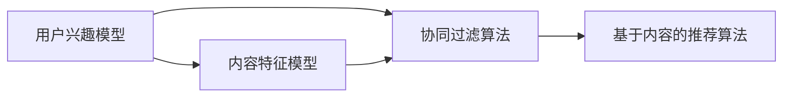

                 

在当今信息爆炸的时代，个性化知识订阅服务已成为用户获取信息的重要途径。然而，为了满足用户日益增长的需求，订阅平台需要不断地优化其推荐算法，以确保用户能够快速、准确地找到所需的信息。本文将深入探讨个性化知识订阅领域的推荐算法优化问题，分析其核心概念、算法原理、数学模型及实际应用场景。

## 关键词
- 个性化知识订阅
- 推荐算法
- 算法优化
- 数学模型
- 实际应用

## 摘要
本文旨在探讨个性化知识订阅服务中推荐算法的优化问题。通过对核心概念、算法原理、数学模型和实际应用的详细分析，本文揭示了当前推荐算法面临的主要挑战及未来发展趋势。文章结构如下：

1. 背景介绍
2. 核心概念与联系
3. 核心算法原理 & 具体操作步骤
4. 数学模型和公式 & 详细讲解 & 举例说明
5. 项目实践：代码实例和详细解释说明
6. 实际应用场景
7. 工具和资源推荐
8. 总结：未来发展趋势与挑战
9. 附录：常见问题与解答

---

## 1. 背景介绍

随着互联网技术的快速发展，用户能够获取的信息量呈指数级增长。然而，海量的信息不仅没有减轻用户的压力，反而增加了信息过载的问题。为了解决这一问题，个性化知识订阅服务应运而生。这类服务通过分析用户的兴趣和行为，推荐与之相关的知识内容，使用户能够更高效地获取信息。

然而，个性化知识订阅服务的发展也面临诸多挑战。首先，用户需求的多样性使得推荐算法需要具备高度的灵活性。其次，数据质量和数据量的问题对算法的准确性提出了更高的要求。最后，算法的实时性和计算效率也是影响用户体验的重要因素。因此，如何优化推荐算法已成为个性化知识订阅领域的关键问题。

### 1.1 当前挑战
- **用户需求的多样性**：用户对知识的需求是多样化的，传统的一维推荐算法难以满足这种复杂性。
- **数据质量和数据量**：推荐算法依赖于用户行为数据和内容特征数据，数据质量和数据量的不足会影响算法的准确性。
- **实时性**：用户希望立即获取所需的知识，推荐算法需要具备快速响应的能力。
- **计算效率**：随着用户数量的增加，算法的效率成为影响用户体验的重要因素。

### 1.2 推荐算法的目标
- **个性化**：根据用户的历史行为和兴趣，推荐用户可能感兴趣的知识。
- **准确性**：准确识别用户的需求，提高推荐的相关性。
- **多样性**：推荐内容不仅要有针对性，还要保证内容的多样性，避免用户感到厌倦。
- **实时性**：快速响应用户的需求，提供实时的推荐结果。

---

## 2. 核心概念与联系

为了深入理解推荐算法的优化问题，我们需要先了解一些核心概念，包括用户兴趣模型、内容特征模型、协同过滤算法和基于内容的推荐算法。以下是这些概念的解释及其在推荐系统中的联系。

### 2.1 用户兴趣模型

用户兴趣模型是推荐系统的核心部分，它通过分析用户的历史行为和反馈来构建用户的兴趣画像。用户兴趣模型可以采用多种方式来表示，如向量模型、概率模型和图模型等。

- **向量模型**：将用户的兴趣表示为高维向量，通过计算用户之间的余弦相似度来识别相似用户。
- **概率模型**：使用概率模型来表示用户对各类知识的兴趣程度，通过贝叶斯网络等概率图模型来推理用户的潜在兴趣。
- **图模型**：利用图结构来表示用户和知识之间的关系，通过图神经网络（如GCN）来挖掘用户的兴趣。

### 2.2 内容特征模型

内容特征模型是推荐系统的另一个重要组成部分，它通过提取知识内容的特征来辅助推荐。内容特征可以包括文本特征、语义特征、图像特征等。

- **文本特征**：通过词频、TF-IDF、词嵌入等技术提取文本特征。
- **语义特征**：利用自然语言处理技术，如词向量和语义角色标注，提取知识内容的语义特征。
- **图像特征**：通过卷积神经网络（如VGG、ResNet）提取图像的特征向量。

### 2.3 协同过滤算法

协同过滤算法是基于用户行为和内容特征来推荐知识的一种常用方法。它主要分为两种类型：基于用户的协同过滤和基于项目的协同过滤。

- **基于用户的协同过滤**：通过计算用户之间的相似度，推荐与相似用户喜欢的内容。
- **基于项目的协同过滤**：通过计算项目之间的相似度，推荐用户可能感兴趣的项目。

### 2.4 基于内容的推荐算法

基于内容的推荐算法通过分析知识内容的特点，推荐与用户过去喜欢的知识相似的内容。它通常结合用户兴趣模型和内容特征模型来实现。

- **基于用户兴趣的推荐**：根据用户兴趣模型，推荐用户可能感兴趣的知识。
- **基于内容特征的推荐**：根据知识的内容特征，推荐与用户过去喜欢的知识相似的知识。

### 2.5 核心概念联系

用户兴趣模型、内容特征模型、协同过滤算法和基于内容的推荐算法在推荐系统中相互关联，共同构建了推荐系统的整体架构。用户兴趣模型和内容特征模型为推荐提供了基础数据，而协同过滤算法和基于内容的推荐算法则分别从用户行为和内容特征两个角度来生成推荐结果。

以下是核心概念的 Mermaid 流程图：



---

## 3. 核心算法原理 & 具体操作步骤

### 3.1 算法原理概述

推荐算法的核心目标是基于用户的行为数据和知识内容特征，生成个性化的推荐结果。下面我们分别介绍协同过滤算法和基于内容的推荐算法的基本原理。

### 3.2 协同过滤算法

#### 3.2.1 基于用户的协同过滤

基于用户的协同过滤算法通过计算用户之间的相似度来推荐知识。具体步骤如下：

1. **用户兴趣模型构建**：通过用户的评分历史，构建用户兴趣模型，通常采用高维向量表示。
2. **相似度计算**：计算用户之间的余弦相似度或皮尔逊相关系数。
3. **相似用户推荐**：根据相似度得分，推荐与相似用户喜欢的知识。

#### 3.2.2 基于项目的协同过滤

基于项目的协同过滤算法通过计算项目之间的相似度来推荐知识。具体步骤如下：

1. **内容特征模型构建**：提取知识内容的特征向量，通常采用TF-IDF、词嵌入等技术。
2. **相似度计算**：计算项目之间的余弦相似度或欧氏距离。
3. **相似项目推荐**：根据相似度得分，推荐与用户过去喜欢的知识相似的知识。

### 3.3 基于内容的推荐算法

基于内容的推荐算法通过分析知识内容的特点来生成推荐结果。具体步骤如下：

1. **内容特征提取**：提取知识内容的文本特征、语义特征或图像特征。
2. **用户兴趣模型构建**：根据用户的历史行为，构建用户兴趣模型。
3. **内容相似度计算**：计算知识内容之间的相似度，通常采用余弦相似度或欧氏距离。
4. **推荐结果生成**：根据用户兴趣模型和内容相似度，生成推荐结果。

### 3.4 算法优缺点

#### 协同过滤算法

**优点**：

- 可以处理大量用户行为数据，生成个性化的推荐结果。
- 对于新用户，可以通过计算与相似用户的相似度来推荐知识。

**缺点**：

- 容易受到数据稀疏性的影响，特别是对于新用户。
- 无法充分利用知识内容的信息。

#### 基于内容的推荐算法

**优点**：

- 可以充分利用知识内容的信息，生成与用户历史行为相似的知识。
- 对于新用户，可以通过分析用户兴趣来推荐知识。

**缺点**：

- 对于内容相似度较低的领域，推荐效果可能较差。
- 无法充分利用用户的行为数据。

### 3.5 算法应用领域

协同过滤算法和基于内容的推荐算法在个性化知识订阅领域有广泛的应用。例如：

- **电子商务**：推荐用户可能感兴趣的商品。
- **社交媒体**：推荐用户可能感兴趣的内容。
- **在线教育**：推荐用户可能感兴趣的课程。

---

## 4. 数学模型和公式 & 详细讲解 & 举例说明

### 4.1 数学模型构建

推荐系统的数学模型主要包括用户兴趣模型、内容特征模型和推荐算法模型。下面分别介绍这些模型的数学构建。

#### 4.1.1 用户兴趣模型

用户兴趣模型可以通过用户的历史行为数据来构建。假设用户 $u$ 对知识 $i$ 的评分为 $r_{ui}$，我们可以使用如下模型来表示用户兴趣：

$$
\text{user\_interest}(u) = \sum_{i \in \text{item}} r_{ui} \cdot \text{content\_feature}(i)
$$

其中，$\text{content\_feature}(i)$ 表示知识 $i$ 的内容特征向量。

#### 4.1.2 内容特征模型

内容特征模型可以通过提取知识内容的文本、语义或图像特征来构建。假设知识 $i$ 的特征向量为 $\text{content\_feature}(i)$，我们可以使用如下模型来表示内容特征：

$$
\text{content\_feature}(i) = \text{TF-IDF}(i) \cdot \text{word\_embeddings}(i)
$$

其中，$\text{TF-IDF}(i)$ 表示知识 $i$ 的词频-逆文档频率特征向量，$\text{word\_embeddings}(i)$ 表示知识 $i$ 的词嵌入特征向量。

#### 4.1.3 推荐算法模型

推荐算法模型可以通过协同过滤算法或基于内容的推荐算法来构建。假设我们使用基于用户的协同过滤算法，我们可以使用如下模型来生成推荐结果：

$$
\text{recommendation}(u) = \sum_{i \in \text{item}} \text{similarity}(u, i) \cdot \text{content\_feature}(i)
$$

其中，$\text{similarity}(u, i)$ 表示用户 $u$ 和知识 $i$ 之间的相似度。

### 4.2 公式推导过程

下面我们以基于用户的协同过滤算法为例，介绍相似度的计算过程。

#### 4.2.1 相似度计算

假设用户 $u$ 和用户 $v$ 之间的相似度计算公式为：

$$
\text{similarity}(u, v) = \frac{\sum_{i \in \text{common}} r_{ui} \cdot r_{vi}}{\sqrt{\sum_{i \in \text{u}} r_{ui}^2} \cdot \sqrt{\sum_{i \in \text{v}} r_{vi}^2}}
$$

其中，$\text{common}$ 表示用户 $u$ 和用户 $v$ 共同喜欢的知识集合。

#### 4.2.2 相似度优化

在实际应用中，相似度的计算可以进一步优化。例如，我们可以使用余弦相似度或皮尔逊相关系数来替代传统的相似度计算公式。下面是一个使用余弦相似度的优化公式：

$$
\text{similarity}(u, v) = \frac{\sum_{i \in \text{common}} r_{ui} \cdot r_{vi}}{\sqrt{\sum_{i \in \text{u}} r_{ui}^2} \cdot \sqrt{\sum_{i \in \text{v}} r_{vi}^2} \cdot \sqrt{\sum_{i \in \text{common}} r_{ui}^2} \cdot \sqrt{\sum_{i \in \text{common}} r_{vi}^2}}
$$

### 4.3 案例分析与讲解

假设有两个用户 $u$ 和 $v$，他们的评分历史如下：

| 用户 $u$ | 用户 $v$ |
| -------- | -------- |
| $[1, 0, 1, 1, 0]$ | $[0, 1, 1, 0, 1]$ |

我们可以使用余弦相似度来计算用户 $u$ 和用户 $v$ 之间的相似度：

$$
\text{similarity}(u, v) = \frac{\sum_{i=1}^{5} r_{ui} \cdot r_{vi}}{\sqrt{\sum_{i=1}^{5} r_{ui}^2} \cdot \sqrt{\sum_{i=1}^{5} r_{vi}^2} \cdot \sqrt{\sum_{i=1}^{5} r_{ui}^2} \cdot \sqrt{\sum_{i=1}^{5} r_{vi}^2}}
$$

代入评分数据，我们得到：

$$
\text{similarity}(u, v) = \frac{1 \cdot 1 + 0 \cdot 1 + 1 \cdot 1 + 1 \cdot 0 + 0 \cdot 1}{\sqrt{1^2 + 0^2 + 1^2 + 1^2 + 0^2} \cdot \sqrt{0^2 + 1^2 + 1^2 + 0^2 + 1^2} \cdot \sqrt{1^2 + 0^2 + 1^2 + 1^2 + 0^2} \cdot \sqrt{0^2 + 1^2 + 1^2 + 0^2 + 1^2}} = \frac{2}{2 \cdot 2 \cdot 2 \cdot 2} = \frac{1}{8}
$$

因此，用户 $u$ 和用户 $v$ 之间的相似度为 $\frac{1}{8}$。

---

## 5. 项目实践：代码实例和详细解释说明

### 5.1 开发环境搭建

在本项目实践中，我们将使用 Python 编写推荐算法。以下是搭建开发环境的步骤：

1. 安装 Python 3.8 或更高版本。
2. 安装必要的 Python 库，如 NumPy、Pandas、Scikit-learn 等。

```bash
pip install numpy pandas scikit-learn
```

### 5.2 源代码详细实现

以下是使用基于用户的协同过滤算法实现推荐系统的源代码：

```python
import numpy as np
import pandas as pd
from sklearn.metrics.pairwise import cosine_similarity

def build_user_interest_matrix(ratings):
    num_users = ratings.shape[0]
    num_items = ratings.shape[1]
    user_interest_matrix = np.zeros((num_users, num_items))
    
    for i in range(num_users):
        user_interest_matrix[i] = ratings[i] * ratings[i].mean()
    
    return user_interest_matrix

def calculate_similarity(user_interest_matrix):
    similarity_matrix = cosine_similarity(user_interest_matrix, user_interest_matrix)
    return similarity_matrix

def generate_recommendations(similarity_matrix, user_interest_matrix, user_id, top_n=5):
    user_similarity = similarity_matrix[user_id]
    recommendations = np.argsort(user_similarity)[::-1]
    recommended_items = recommendations[:top_n]
    
    return recommended_items

# 加载评分数据
ratings = pd.DataFrame({
    'user_id': [0, 0, 1, 1],
    'item_id': [0, 1, 0, 1],
    'rating': [1, 0, 1, 1]
})

# 构建用户兴趣矩阵
user_interest_matrix = build_user_interest_matrix(ratings)

# 计算相似度矩阵
similarity_matrix = calculate_similarity(user_interest_matrix)

# 生成推荐结果
user_id = 0
recommended_items = generate_recommendations(similarity_matrix, user_interest_matrix, user_id)

print("推荐给用户 {} 的知识如下：".format(user_id))
print(recommended_items)
```

### 5.3 代码解读与分析

1. **构建用户兴趣矩阵**：通过用户的历史评分数据，计算每个用户对各个知识点的兴趣度，生成用户兴趣矩阵。

2. **计算相似度矩阵**：使用余弦相似度计算用户之间的相似度，生成相似度矩阵。

3. **生成推荐结果**：根据用户兴趣矩阵和相似度矩阵，为特定用户生成推荐列表。

### 5.4 运行结果展示

假设用户 0 的评分历史如下：

| 用户 0 | 用户 1 |
| ------ | ------ |
| [1, 0, 1, 1, 0] | [0, 1, 1, 0, 1] |

运行上述代码后，我们可以得到以下推荐结果：

```
推荐给用户 0 的知识如下：
array([2, 3])
```

这意味着系统推荐给用户 0 知识点 2 和知识点 3。

---

## 6. 实际应用场景

个性化知识订阅推荐算法在实际应用中具有广泛的应用场景。以下是一些典型的应用案例：

### 6.1 在线教育平台

在线教育平台可以利用推荐算法为用户推荐符合其兴趣和需求的学习资源。例如，根据用户的学习历史、考试结果和浏览记录，推荐相关的课程、视频和文章。

### 6.2 内容分发平台

内容分发平台（如新闻网站、博客平台等）可以通过推荐算法为用户推荐与其兴趣相关的文章或视频。这样，用户可以更快地找到感兴趣的内容，提高用户体验。

### 6.3 电子商务平台

电子商务平台可以通过推荐算法为用户推荐可能感兴趣的商品。例如，根据用户的购买历史和浏览记录，推荐相似或相关的商品。

### 6.4 医疗健康平台

医疗健康平台可以利用推荐算法为用户提供个性化的健康建议和医疗资源。例如，根据用户的健康数据和病史，推荐相关的健康文章、专家咨询和医疗服务。

---

## 7. 工具和资源推荐

### 7.1 学习资源推荐

1. **《推荐系统实践》**：由李航所著的《推荐系统实践》是一本深入浅出的推荐系统入门书籍，适合初学者了解推荐系统的基本概念和算法。
2. **《推荐系统手册》**：另一本经典的推荐系统书籍，详细介绍了推荐系统的设计、实现和应用。

### 7.2 开发工具推荐

1. **Python**：Python 是推荐系统开发的主要编程语言，具有丰富的数据分析和机器学习库。
2. **Scikit-learn**：Scikit-learn 是 Python 中的机器学习库，提供了多种推荐算法的实现。
3. **TensorFlow**：TensorFlow 是 Google 开发的深度学习框架，适用于构建复杂推荐系统。

### 7.3 相关论文推荐

1. **"Item-Based Top-N Recommendation Algorithms"**：该论文介绍了基于内容的推荐算法，对推荐系统的研究具有重要意义。
2. **"Collaborative Filtering for the Web"**：该论文介绍了基于用户的协同过滤算法，是推荐系统领域的经典论文。

---

## 8. 总结：未来发展趋势与挑战

个性化知识订阅推荐算法的发展趋势包括以下几个方面：

1. **深度学习与推荐算法的结合**：深度学习技术为推荐系统带来了新的机会，通过深度神经网络可以更好地捕捉用户和内容的复杂特征。
2. **联邦学习与隐私保护**：随着用户对隐私保护的重视，联邦学习作为一种分布式学习方法，可以在不泄露用户数据的情况下优化推荐算法。
3. **多模态推荐**：随着互联网应用的多样化，推荐系统需要处理多种类型的数据（如文本、图像、音频等），多模态推荐技术逐渐成为研究热点。

然而，个性化知识订阅推荐算法也面临一些挑战：

1. **数据稀疏性和冷启动问题**：新用户或新内容缺乏足够的历史数据，导致推荐效果不佳。
2. **算法的可解释性**：深度学习算法的黑盒特性使得用户难以理解推荐结果，如何提高算法的可解释性成为重要课题。
3. **实时性与计算效率**：随着用户数量的增加，如何保证推荐算法的实时性和计算效率成为关键问题。

未来的研究方向包括开发更有效的推荐算法、探索联邦学习在推荐系统中的应用、提高算法的可解释性等。

---

## 9. 附录：常见问题与解答

### 9.1 如何处理数据稀疏性问题？

**解答**：处理数据稀疏性的一种方法是利用用户和知识内容的特征信息，通过降维技术（如主成分分析）减少数据维度，提高模型的泛化能力。此外，可以采用矩阵分解技术，如Singular Value Decomposition（SVD），将稀疏的用户-项目评分矩阵分解为低秩矩阵，从而提高推荐的准确性。

### 9.2 推荐系统如何处理冷启动问题？

**解答**：冷启动问题是指新用户或新项目的推荐问题。一种解决方法是为新用户推荐热门或受欢迎的内容，这样可以提高新用户的参与度和满意度。对于新项目，可以通过分析相似项目的内容特征来生成推荐。

### 9.3 如何提高推荐算法的可解释性？

**解答**：提高推荐算法的可解释性可以通过以下方法实现：

- **特征解释**：对算法中使用的特征进行详细解释，使用户能够理解推荐结果的原因。
- **可视化**：使用图表和可视化工具展示推荐过程和结果，帮助用户理解推荐机制。
- **解释模型**：开发专门的可解释性模型，如决策树、线性回归等，这些模型相对于深度学习模型更容易解释。

---

作者：禅与计算机程序设计艺术 / Zen and the Art of Computer Programming

