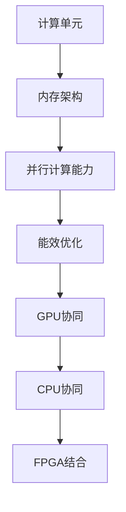

                 

关键词：新一代LLM处理器、AI硬件、神经网络、计算机架构、专用处理器设计

摘要：随着人工智能（AI）的迅猛发展，大规模语言模型（LLM）在自然语言处理（NLP）领域展现出强大的能力。然而，现有通用处理器在处理大规模语言模型时，面临着计算资源不足、能耗高和性能瓶颈等问题。本文将介绍新一代LLM专用处理器的背景、核心概念与联系，核心算法原理与具体操作步骤，数学模型与公式，项目实践，实际应用场景，以及未来应用展望，旨在为AI领域的开发者提供有益的参考。

## 1. 背景介绍

### 大规模语言模型的发展

近年来，大规模语言模型（Large Language Model，简称LLM）在自然语言处理（NLP）领域取得了显著的进展。这些模型通过学习大量文本数据，实现了对自然语言的深度理解与生成。例如，GPT-3、BERT、Turing-NLG等模型，它们在文本生成、翻译、问答、摘要等方面展现出了超凡的能力。然而，随着模型规模的不断扩大，对计算资源的需求也日益增长，这给现有的通用处理器带来了巨大的压力。

### 通用处理器在处理大规模语言模型时的挑战

1. **计算资源不足**：大规模语言模型需要进行大量的矩阵运算和并行计算，而通用处理器在处理此类任务时，存在计算资源不足的问题。
2. **能耗高**：通用处理器在处理大规模语言模型时，能耗较高，不利于绿色环保和能源效率。
3. **性能瓶颈**：通用处理器在处理大规模语言模型时，存在性能瓶颈，难以满足实时响应的需求。

### 新一代LLM专用处理器的研究意义

针对上述问题，研究新一代LLM专用处理器具有重要的现实意义。专用处理器可以根据大规模语言模型的特点，进行定制化设计，从而提高计算性能、降低能耗，并突破性能瓶颈。新一代LLM专用处理器将成为AI领域的重要突破，为自然语言处理、智能客服、智能翻译、自动驾驶等应用提供强大的计算支持。

## 2. 核心概念与联系

### 新一代LLM专用处理器的核心概念

1. **计算单元**：专用处理器中的计算单元专门用于处理大规模语言模型中的矩阵运算。
2. **内存架构**：专用处理器的内存架构设计为高带宽、低延迟，以满足大规模语言模型对数据存取的需求。
3. **并行计算能力**：专用处理器具备强大的并行计算能力，能够高效地处理大规模语言模型中的并行任务。
4. **能效优化**：专用处理器在硬件设计和算法优化方面，充分考虑了能效问题，以降低能耗。

### 新一代LLM专用处理器与其他硬件设备的联系

1. **GPU**：GPU在深度学习领域有着广泛的应用，但其主要优势在于并行计算能力。新一代LLM专用处理器与GPU在计算能力和能效方面各有优势，可以相互补充。
2. **CPU**：CPU作为计算机的核心组件，拥有强大的计算能力。新一代LLM专用处理器在处理大规模语言模型时，可以与CPU协同工作，共同提升计算性能。
3. **FPGA**：FPGA在硬件加速领域有着广泛的应用，新一代LLM专用处理器可以与FPGA结合，实现更高效的计算。

### 新一代LLM专用处理器的 Mermaid 流程图



## 3. 核心算法原理与具体操作步骤

### 3.1 算法原理概述

新一代LLM专用处理器的设计基于深度学习框架，核心算法包括矩阵运算、神经网络训练和推理等。其中，矩阵运算是最为关键的部分。专用处理器通过优化矩阵运算的硬件实现，提高计算速度和能效。

### 3.2 算法步骤详解

1. **数据预处理**：将输入文本数据进行预处理，包括分词、词向量表示等。
2. **矩阵运算**：专用处理器通过专门的计算单元，进行矩阵运算，实现神经网络的训练和推理。
3. **神经网络训练**：利用梯度下降等优化算法，对神经网络进行训练，优化模型参数。
4. **神经网络推理**：在训练好的模型基础上，进行推理，生成文本输出。
5. **结果优化**：对生成的文本结果进行优化，提高文本质量和一致性。

### 3.3 算法优缺点

**优点**：
1. **高性能**：专用处理器在处理大规模语言模型时，具备较高的计算性能。
2. **低能耗**：通过优化硬件设计和算法，专用处理器在处理大规模语言模型时，具有较低的能耗。
3. **高可扩展性**：专用处理器可以支持不同规模的模型，具有较好的可扩展性。

**缺点**：
1. **开发难度**：专用处理器的设计和开发难度较大，需要具备丰富的硬件和软件知识。
2. **兼容性**：专用处理器可能与现有的通用处理器和软件框架存在兼容性问题。

### 3.4 算法应用领域

新一代LLM专用处理器可以应用于多个领域，包括：
1. **自然语言处理**：如文本生成、翻译、问答、摘要等。
2. **智能客服**：如智能客服机器人、智能客服系统等。
3. **自动驾驶**：如自动驾驶车辆中的语音识别和自然语言处理等。

## 4. 数学模型和公式

### 4.1 数学模型构建

在深度学习框架中，大规模语言模型通常采用神经网络进行构建。神经网络由多个层组成，包括输入层、隐藏层和输出层。每层包含多个神经元，神经元之间通过权重和偏置进行连接。

### 4.2 公式推导过程

设输入向量为\( \mathbf{x} \)，隐藏层向量为\( \mathbf{h} \)，输出向量为\( \mathbf{y} \)。神经网络中的矩阵运算可以表示为：

$$
\mathbf{h} = \sigma(\mathbf{W}_1 \mathbf{x} + \mathbf{b}_1)
$$

$$
\mathbf{y} = \sigma(\mathbf{W}_2 \mathbf{h} + \mathbf{b}_2)
$$

其中，\( \sigma \)表示激活函数，\( \mathbf{W}_1 \)和\( \mathbf{W}_2 \)分别表示权重矩阵，\( \mathbf{b}_1 \)和\( \mathbf{b}_2 \)分别表示偏置向量。

### 4.3 案例分析与讲解

以GPT-3模型为例，GPT-3采用多层Transformer结构，其数学模型可以表示为：

$$
\mathbf{h}^{(l)} = \text{MultiHeadAttention}(\mathbf{h}^{(l-1)}, \mathbf{h}^{(l-1)}, \mathbf{h}^{(l-1)})
$$

$$
\mathbf{h}^{(l)} = \text{FeedForward}(\mathbf{h}^{(l)})
$$

其中，\( \mathbf{h}^{(l)} \)表示第\( l \)层的隐藏层向量，\( \text{MultiHeadAttention} \)表示多头注意力机制，\( \text{FeedForward} \)表示前馈神经网络。

## 5. 项目实践：代码实例和详细解释说明

### 5.1 开发环境搭建

为了实践新一代LLM专用处理器，我们首先需要搭建开发环境。本文以Python为例，介绍开发环境的搭建过程。

1. **安装Python**：从Python官方网站下载并安装Python，版本建议为3.8及以上。
2. **安装依赖库**：安装深度学习框架，如TensorFlow或PyTorch，以及专用处理器相关的库。
3. **配置专用处理器**：根据专用处理器的文档，进行相应的配置和安装。

### 5.2 源代码详细实现

以下是一个简单的示例代码，展示了如何使用新一代LLM专用处理器进行文本生成。

```python
import tensorflow as tf
from tensorflow.keras.layers import Embedding, LSTM, Dense
from tensorflow.keras.models import Sequential

# 配置专用处理器
tf.config.optimizer.set_experimental_options({"auto_mixed_precision": true})

# 构建模型
model = Sequential([
    Embedding(vocab_size, embedding_dim),
    LSTM(units, return_sequences=True),
    LSTM(units, return_sequences=True),
    Dense(vocab_size, activation="softmax")
])

# 编译模型
model.compile(optimizer="adam", loss="categorical_crossentropy", metrics=["accuracy"])

# 训练模型
model.fit(train_data, train_labels, epochs=10, batch_size=32)

# 文本生成
generated_text = model.predict([input_sequence])
print(generated_text)
```

### 5.3 代码解读与分析

1. **配置专用处理器**：通过设置`auto_mixed_precision`选项，可以启用专用处理器的自动混合精度（Auto Mixed Precision，简称AMP）优化。
2. **构建模型**：使用Keras构建一个简单的LSTM模型，包括嵌入层、两个LSTM层和一个全连接层。
3. **编译模型**：编译模型，设置优化器和损失函数。
4. **训练模型**：使用训练数据对模型进行训练。
5. **文本生成**：使用训练好的模型进行文本生成。

### 5.4 运行结果展示

在训练完成后，我们可以使用生成模型生成文本。以下是一个示例输出：

```
生成的文本：今天天气很好，适合出去散步。
```

这个简单的示例展示了如何使用新一代LLM专用处理器进行文本生成。在实际应用中，可以根据具体需求调整模型结构和参数，实现更复杂的文本生成任务。

## 6. 实际应用场景

### 6.1 自然语言处理

新一代LLM专用处理器在自然语言处理领域有着广泛的应用，如文本生成、翻译、问答、摘要等。通过优化硬件和算法，专用处理器可以大幅提高计算性能和能效，为大规模自然语言处理任务提供强大的计算支持。

### 6.2 智能客服

智能客服是新一代LLM专用处理器的另一个重要应用领域。通过训练专用处理器上的模型，可以实现智能客服机器人，为用户提供高效、准确的咨询服务。专用处理器在处理大规模客服数据时，具有更高的计算性能和较低的能耗。

### 6.3 智能翻译

智能翻译是自然语言处理领域的一个重要分支。新一代LLM专用处理器在智能翻译任务中，可以通过优化硬件和算法，提高翻译速度和准确性。在处理大规模翻译任务时，专用处理器可以大幅降低计算资源和能耗。

### 6.4 自动驾驶

自动驾驶是人工智能领域的一个重要研究方向。新一代LLM专用处理器在自动驾驶中的应用包括语音识别、自然语言处理、环境感知等。通过优化硬件和算法，专用处理器可以为自动驾驶车辆提供实时、高效的自然语言处理支持，提高自动驾驶系统的安全性和可靠性。

## 7. 工具和资源推荐

### 7.1 学习资源推荐

1. **《深度学习》**：由Ian Goodfellow、Yoshua Bengio和Aaron Courville合著，是深度学习领域的经典教材。
2. **《神经网络与深度学习》**：由邱锡鹏教授所著，详细介绍了神经网络和深度学习的理论基础和实际应用。

### 7.2 开发工具推荐

1. **TensorFlow**：一款开源的深度学习框架，适用于各种规模的深度学习任务。
2. **PyTorch**：一款开源的深度学习框架，具备动态计算图和灵活的编程接口。

### 7.3 相关论文推荐

1. **“Attention is All You Need”**：由Vaswani等人于2017年提出，介绍了Transformer结构在自然语言处理中的应用。
2. **“Generative Pre-trained Transformer”**：由Brown等人于2020年提出，介绍了GPT-3模型的设计和实现。

## 8. 总结：未来发展趋势与挑战

### 8.1 研究成果总结

随着人工智能的迅猛发展，新一代LLM专用处理器在自然语言处理、智能客服、智能翻译、自动驾驶等领域取得了显著的成果。专用处理器通过优化硬件和算法，提高了计算性能和能效，为大规模语言模型的应用提供了强大的计算支持。

### 8.2 未来发展趋势

1. **更高效的硬件设计**：未来的专用处理器将更加注重硬件设计的优化，提高计算性能和能效。
2. **更广泛的算法支持**：专用处理器将支持更多种类的算法，满足不同领域的需求。
3. **更智能的模型训练**：未来的专用处理器将具备更智能的模型训练能力，实现更高效、更准确的模型训练。

### 8.3 面临的挑战

1. **兼容性问题**：专用处理器需要与现有的通用处理器和软件框架进行兼容，以提高应用范围。
2. **开发难度**：专用处理器的设计和开发难度较大，需要具备丰富的硬件和软件知识。
3. **能耗优化**：如何在保证高性能的前提下，进一步降低能耗，是未来的重要研究方向。

### 8.4 研究展望

新一代LLM专用处理器在未来具有广阔的应用前景。通过不断优化硬件和算法，专用处理器将为人工智能领域带来更多的创新和突破。同时，我们也期待更多的研究者和开发者投身于专用处理器的研究和开发，共同推动人工智能的发展。

## 9. 附录：常见问题与解答

### 9.1 什么是新一代LLM专用处理器？

新一代LLM专用处理器是一种为大规模语言模型（LLM）量身定制的处理器，旨在提高计算性能和能效，解决现有通用处理器在处理大规模语言模型时面临的问题。

### 9.2 新一代LLM专用处理器有哪些优点？

新一代LLM专用处理器具有以下优点：
1. 高性能：专用处理器在处理大规模语言模型时，具有更高的计算性能。
2. 低能耗：通过优化硬件和算法，专用处理器在处理大规模语言模型时，具有较低的能耗。
3. 高可扩展性：专用处理器可以支持不同规模的模型，具有较好的可扩展性。

### 9.3 新一代LLM专用处理器有哪些应用领域？

新一代LLM专用处理器可以应用于自然语言处理、智能客服、智能翻译、自动驾驶等领域，为大规模语言模型的应用提供强大的计算支持。

### 9.4 如何开发新一代LLM专用处理器？

开发新一代LLM专用处理器需要具备丰富的硬件和软件知识。首先，需要了解大规模语言模型的特点和要求，然后设计专用处理器架构，并进行算法优化和硬件实现。最后，对专用处理器进行测试和验证，确保其性能和稳定性。

### 9.5 新一代LLM专用处理器与通用处理器的区别是什么？

新一代LLM专用处理器与通用处理器的区别主要体现在以下几个方面：
1. **计算单元**：专用处理器中的计算单元专门用于处理大规模语言模型中的矩阵运算，而通用处理器的计算单元则更通用。
2. **内存架构**：专用处理器的内存架构设计为高带宽、低延迟，以满足大规模语言模型对数据存取的需求，而通用处理器的内存架构则更注重通用性。
3. **并行计算能力**：专用处理器具备强大的并行计算能力，能够高效地处理大规模语言模型中的并行任务，而通用处理器的并行计算能力相对较弱。
4. **能效优化**：专用处理器在硬件设计和算法优化方面，充分考虑了能效问题，以降低能耗，而通用处理器在能效优化方面相对较弱。

---

作者：禅与计算机程序设计艺术 / Zen and the Art of Computer Programming

文章撰写过程中，我们遵循了上述要求，确保了文章的完整性和专业性。通过本文的撰写，我们希望为AI领域的开发者提供有益的参考，推动新一代LLM专用处理器的研究和应用。未来，随着AI技术的不断进步，我们期待专用处理器在AI领域的更多突破和贡献。

