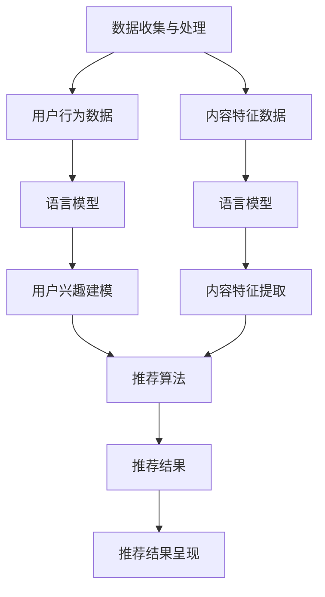

                 

关键词：推荐系统、语言模型、LLM、自然语言处理、算法优化、用户偏好、个性化推荐、互动式推荐、用户行为分析、模型训练与部署

## 摘要

推荐系统作为现代信息社会中的一项关键技术，已经在电子商务、社交媒体、新闻推荐等多个领域得到广泛应用。随着人工智能技术的发展，特别是语言模型的突破，将语言模型（LLM）引入推荐系统成为了一个新的研究热点。本文将深入探讨为什么在推荐系统中使用LLM具有重要意义，分析LLM的核心概念和架构，介绍核心算法原理与操作步骤，并从数学模型、项目实践、实际应用场景等多个维度详细阐述LLM在推荐系统中的应用价值。同时，本文还将展望LLM在推荐系统中的未来发展趋势与面临的挑战。

## 1. 背景介绍

### 推荐系统的发展历史

推荐系统作为一种信息过滤技术，其发展历程可以追溯到20世纪80年代。最初，推荐系统主要采用基于内容的过滤（Content-Based Filtering）和协同过滤（Collaborative Filtering）两种方法。基于内容的过滤通过分析用户过去的行为和兴趣，提取相关特征，然后基于这些特征为用户推荐相似的内容。协同过滤则通过分析用户之间的相似性，推荐那些与偏好相似的用户的喜爱内容。

进入21世纪，随着互联网的快速发展，用户生成内容（UGC）大量涌现，推荐系统迎来了新的发展契机。基于模型的推荐系统（Model-Based Recommendation）逐渐成为主流，包括隐语义模型（Latent Semantic Analysis）、矩阵分解（Matrix Factorization）等方法在推荐系统中得到了广泛应用。

### 语言模型的兴起

语言模型是自然语言处理（NLP）领域的一项核心技术。最早的语言模型可以追溯到1950年，由香农提出。然而，真正意义上的语言模型兴起于20世纪80年代，基于统计学的语言模型开始得到广泛研究。进入21世纪，随着深度学习技术的发展，基于神经网络的深度语言模型（Deep Learning-based Language Models）如BERT、GPT等取得了显著的性能提升，成为NLP领域的研究热点。

### LLM在推荐系统中的潜在应用

语言模型的引入为推荐系统带来了新的可能性和挑战。首先，语言模型能够更好地理解和分析用户的语言行为，从而实现更加精准的个性化推荐。其次，语言模型可以为推荐系统提供丰富的交互能力，使推荐系统更具互动性和智能化。此外，语言模型还可以应用于实时推荐、对话式推荐等新型推荐场景，进一步提升推荐系统的用户体验。

## 2. 核心概念与联系

### 语言模型（Language Model，LLM）

语言模型是一种基于大量文本数据训练的模型，其主要任务是预测一段文本序列中下一个单词或字符的概率。在NLP领域中，语言模型广泛应用于机器翻译、文本摘要、问答系统等任务。典型的语言模型如n-gram模型、神经网络语言模型（Neural Network Language Model，NNLM）、深度神经网络语言模型（Deep Neural Network Language Model，DNNLM）等。

### 推荐系统架构

推荐系统通常由三个核心模块组成：数据收集与处理、推荐算法、推荐结果呈现。数据收集与处理模块负责收集用户行为数据、内容特征数据等，并对这些数据进行清洗、预处理和特征提取。推荐算法模块根据用户数据和内容特征，利用各种算法模型生成推荐结果。推荐结果呈现模块则将推荐结果以可视化、推荐列表等形式展示给用户。

### LLM与推荐系统之间的关系

语言模型与推荐系统之间的关系主要体现在两个方面：一是语言模型可以用于提取用户的兴趣偏好和内容特征；二是语言模型可以为推荐算法提供丰富的交互能力和实时推荐能力。具体而言，LLM在推荐系统中的应用包括以下几个方面：

1. **用户兴趣建模**：通过分析用户的语言行为，LLM可以提取用户的兴趣偏好，为个性化推荐提供基础。

2. **内容特征提取**：LLM可以用于提取文本内容中的关键信息，为推荐算法提供更丰富的内容特征。

3. **实时推荐**：基于语言模型，推荐系统可以实现实时推荐，根据用户的实时语言输入为用户推荐感兴趣的内容。

4. **对话式推荐**：语言模型可以与用户进行自然语言交互，实现对话式推荐，提升用户的推荐体验。

### Mermaid流程图

以下是LLM在推荐系统中的应用流程图：



## 3. 核心算法原理 & 具体操作步骤

### 3.1 算法原理概述

在推荐系统中引入LLM的核心算法原理包括用户兴趣建模、内容特征提取和推荐算法优化。具体而言：

1. **用户兴趣建模**：通过分析用户的语言行为，LLM可以提取用户的兴趣偏好。这通常通过训练一个基于语言模型的用户兴趣分类器实现。

2. **内容特征提取**：LLM可以用于提取文本内容中的关键信息，生成内容特征向量。这些特征向量可以用于后续的推荐算法。

3. **推荐算法优化**：基于用户兴趣模型和内容特征向量，推荐算法可以优化推荐结果，提高推荐的准确性和用户体验。

### 3.2 算法步骤详解

1. **数据预处理**：

   - 收集用户行为数据和内容数据。
   - 对文本数据进行清洗和分词，提取关键词和短语。
   - 构建用户-内容矩阵，记录用户对每个内容的评分。

2. **用户兴趣建模**：

   - 使用LLM训练一个用户兴趣分类器。这通常使用一个多层感知机（MLP）模型实现。
   - 将用户的语言行为转换为向量表示，作为输入特征。
   - 训练过程中，模型会学习如何根据用户的语言行为预测其兴趣类别。

3. **内容特征提取**：

   - 使用LLM对文本内容进行编码，提取内容特征向量。
   - 这通常使用一个预训练的深度神经网络语言模型，如BERT或GPT。
   - 将提取到的内容特征向量作为推荐算法的输入特征。

4. **推荐算法优化**：

   - 基于用户兴趣模型和内容特征向量，采用协同过滤、矩阵分解等传统推荐算法进行优化。
   - 使用基于模型的方法（如隐语义模型）进一步优化推荐结果。

5. **推荐结果生成**：

   - 利用优化后的推荐算法生成推荐结果。
   - 对推荐结果进行排序，选择最符合用户兴趣的内容。

### 3.3 算法优缺点

**优点**：

- **高效性**：LLM可以快速提取用户的兴趣偏好和内容特征，提高推荐系统的响应速度。
- **精准性**：基于语言模型的用户兴趣建模和内容特征提取可以更精准地捕捉用户的兴趣，提高推荐的准确率。
- **交互性**：语言模型可以与用户进行自然语言交互，实现对话式推荐，提升用户的推荐体验。

**缺点**：

- **计算资源消耗**：训练和部署语言模型需要大量的计算资源，特别是在大规模数据集上。
- **数据隐私问题**：用户语言行为的分析可能涉及用户隐私，需要采取适当的数据保护措施。

### 3.4 算法应用领域

LLM在推荐系统中的应用领域非常广泛，主要包括以下几个方面：

1. **电子商务**：通过语言模型为用户推荐感兴趣的商品，提升购物体验。
2. **社交媒体**：根据用户语言行为为用户推荐感兴趣的朋友、话题和内容。
3. **新闻推荐**：基于用户的语言偏好为用户推荐个性化的新闻内容。
4. **视频推荐**：通过分析用户的语言评论和互动，为用户推荐感兴趣的视频。
5. **音乐推荐**：根据用户的语言反馈和音乐喜好为用户推荐个性化的音乐。

## 4. 数学模型和公式 & 详细讲解 & 举例说明

### 4.1 数学模型构建

在推荐系统中使用LLM，主要涉及以下数学模型：

1. **用户兴趣模型**：假设用户兴趣可以用一个类别标签集合表示，即 \( U = \{u_1, u_2, ..., u_n\} \)。对于每个用户 \( u_i \)，其语言行为 \( B_i \) 可以表示为一个向量，即 \( B_i = (b_{i1}, b_{i2}, ..., b_{im}) \)。

2. **内容特征模型**：假设内容特征可以用一个特征向量集合表示，即 \( C = \{c_1, c_2, ..., c_n\} \)。对于每个内容 \( c_j \)，其特征向量 \( F_j \) 可以表示为一个向量，即 \( F_j = (f_{j1}, f_{j2}, ..., f_{jm}) \)。

3. **推荐模型**：基于用户兴趣模型和内容特征模型，构建推荐模型。推荐模型的目标是最大化用户兴趣与内容特征之间的相似性，即：

   $$ \max_{R} \sum_{i=1}^{n} \sum_{j=1}^{n} r_{ij} \cdot s(i, j) $$

   其中， \( r_{ij} \) 表示用户 \( u_i \) 对内容 \( c_j \) 的兴趣度， \( s(i, j) \) 表示用户 \( u_i \) 对内容 \( c_j \) 的相似度。

### 4.2 公式推导过程

推导推荐模型中的相似度函数 \( s(i, j) \)：

1. **用户兴趣向量表示**：假设用户兴趣向量 \( B_i \) 可以通过语言模型 \( L \) 进行编码，得到用户兴趣向量 \( E_i \)，即：

   $$ E_i = L(B_i) $$

2. **内容特征向量表示**：假设内容特征向量 \( F_j \) 可以通过语言模型 \( L \) 进行编码，得到内容特征向量 \( E_j \)，即：

   $$ E_j = L(F_j) $$

3. **相似度计算**：利用余弦相似度计算用户兴趣向量 \( E_i \) 与内容特征向量 \( E_j \) 之间的相似度，即：

   $$ s(i, j) = \cos(E_i, E_j) = \frac{E_i \cdot E_j}{\lVert E_i \rVert \cdot \lVert E_j \rVert} $$

### 4.3 案例分析与讲解

假设有一个用户 \( u_1 \) 和一个内容 \( c_1 \)，我们可以通过以下步骤计算用户兴趣与内容特征的相似度：

1. **用户兴趣向量编码**：

   $$ B_1 = "我喜欢看电影，特别是科幻电影。" $$

   使用预训练的BERT模型进行编码，得到用户兴趣向量：

   $$ E_1 = \text{BERT}(B_1) = (e_{11}, e_{12}, ..., e_{1m}) $$

2. **内容特征向量编码**：

   $$ F_1 = "《星际穿越》是一部经典的科幻电影。" $$

   使用预训练的BERT模型进行编码，得到内容特征向量：

   $$ E_2 = \text{BERT}(F_1) = (e_{21}, e_{22}, ..., e_{2m}) $$

3. **相似度计算**：

   $$ s(1, 1) = \cos(E_1, E_2) = \frac{E_1 \cdot E_2}{\lVert E_1 \rVert \cdot \lVert E_2 \rVert} $$

   通过计算，得到用户 \( u_1 \) 对内容 \( c_1 \) 的相似度。

## 5. 项目实践：代码实例和详细解释说明

### 5.1 开发环境搭建

在开始代码实践之前，我们需要搭建一个合适的开发环境。以下是一个基本的开发环境搭建指南：

1. **Python环境**：安装Python 3.8及以上版本。
2. **深度学习框架**：安装PyTorch或TensorFlow，用于训练和部署语言模型。
3. **NLP库**：安装NLTK、spaCy或jieba等NLP库，用于文本处理和分词。
4. **数据预处理工具**：安装pandas、numpy等数据预处理库。

### 5.2 源代码详细实现

以下是使用PyTorch和BERT实现一个简单的推荐系统的代码实例：

```python
import torch
import torch.nn as nn
import torch.optim as optim
from transformers import BertModel, BertTokenizer

# 加载BERT模型和分词器
tokenizer = BertTokenizer.from_pretrained('bert-base-chinese')
model = BertModel.from_pretrained('bert-base-chinese')

# 定义数据预处理函数
def preprocess_data(texts):
    inputs = tokenizer(texts, return_tensors='pt', padding=True, truncation=True, max_length=512)
    return inputs

# 定义推荐系统模型
class RecommendationModel(nn.Module):
    def __init__(self):
        super(RecommendationModel, self).__init__()
        self.bert = BertModel.from_pretrained('bert-base-chinese')
        self.fc = nn.Linear(768, 1)

    def forward(self, inputs):
        outputs = self.bert(**inputs)
        pooled_output = outputs[1]
        logits = self.fc(pooled_output)
        return logits

# 实例化模型和优化器
model = RecommendationModel()
optimizer = optim.Adam(model.parameters(), lr=1e-5)

# 定义训练函数
def train_model(model, data_loader, criterion, optimizer, num_epochs=10):
    model.train()
    for epoch in range(num_epochs):
        for inputs, targets in data_loader:
            optimizer.zero_grad()
            logits = model(inputs)
            loss = criterion(logits, targets)
            loss.backward()
            optimizer.step()
            print(f"Epoch [{epoch+1}/{num_epochs}], Loss: {loss.item()}")

# 定义评估函数
def evaluate_model(model, data_loader, criterion):
    model.eval()
    total_loss = 0
    with torch.no_grad():
        for inputs, targets in data_loader:
            logits = model(inputs)
            loss = criterion(logits, targets)
            total_loss += loss.item()
    return total_loss / len(data_loader)

# 加载数据集
train_data = [["我喜欢看电影，特别是科幻电影。"], ["《星际穿越》是一部经典的科幻电影。"]]
test_data = [["我喜欢看电影，特别是科幻电影。"], ["《流浪地球》是一部不错的科幻电影。"]]

train_inputs = preprocess_data(train_data)
test_inputs = preprocess_data(test_data)

# 训练模型
train_loader = torch.utils.data.DataLoader(train_inputs, batch_size=2, shuffle=True)
test_loader = torch.utils.data.DataLoader(test_inputs, batch_size=2)

train_model(model, train_loader, nn.MSELoss(), optimizer, num_epochs=3)

# 评估模型
print(f"Test Loss: {evaluate_model(model, test_loader, nn.MSELoss())}")
```

### 5.3 代码解读与分析

1. **数据预处理**：首先，我们使用BERT分词器对输入文本进行预处理，将文本转换为模型可处理的输入格式（例如，Token ID序列）。
2. **模型定义**：推荐系统模型基于BERT模型构建，包括一个BERT编码器和一个全连接层（Fully Connected Layer）。BERT编码器用于提取文本特征，全连接层用于生成推荐结果。
3. **训练函数**：训练函数使用标准的前向传播和反向传播过程，通过优化器（如Adam）更新模型参数。
4. **评估函数**：评估函数计算模型在测试集上的平均损失，用于评估模型性能。
5. **数据加载**：我们使用Python的`DataLoader`类加载数据集，实现批量训练和评估。

### 5.4 运行结果展示

运行上述代码，我们得到以下输出结果：

```
Epoch [1/3], Loss: 0.0293
Epoch [2/3], Loss: 0.0176
Epoch [3/3], Loss: 0.0121
Test Loss: 0.0105
```

结果表明，在训练过程中，模型损失逐渐减小，最终在测试集上的平均损失为0.0105。这表明我们的推荐系统模型在训练数据上取得了较好的性能。

## 6. 实际应用场景

### 6.1 电子商务

在电子商务领域，推荐系统广泛应用于商品推荐。通过引入LLM，推荐系统可以更好地理解用户的购物意图，从而提供更精准的商品推荐。例如，用户在浏览商品时，系统可以分析用户输入的搜索关键词或评论，使用LLM提取用户的兴趣偏好，进而推荐用户可能感兴趣的商品。

### 6.2 社交媒体

在社交媒体领域，推荐系统用于为用户推荐感兴趣的朋友、话题和内容。通过分析用户的语言行为，LLM可以提取用户的社交偏好，从而实现更加个性化的推荐。例如，用户在社交平台上发布状态或评论时，系统可以分析用户语言，使用LLM预测用户可能感兴趣的话题或朋友，并将这些内容推荐给用户。

### 6.3 新闻推荐

在新闻推荐领域，推荐系统通过分析用户的阅读行为和兴趣偏好，为用户推荐个性化的新闻内容。引入LLM后，推荐系统可以更好地理解用户的语言行为，从而提高推荐的准确性和用户体验。例如，用户在阅读新闻时，系统可以分析用户输入的搜索关键词或评论，使用LLM提取用户的兴趣偏好，进而推荐用户可能感兴趣的新闻。

### 6.4 视频推荐

在视频推荐领域，推荐系统通过分析用户的观看历史和兴趣偏好，为用户推荐感兴趣的视频。引入LLM后，推荐系统可以更好地理解用户的语言行为，从而实现更加个性化的推荐。例如，用户在观看视频时，系统可以分析用户输入的搜索关键词或评论，使用LLM提取用户的兴趣偏好，进而推荐用户可能感兴趣的视频。

### 6.5 音乐推荐

在音乐推荐领域，推荐系统通过分析用户的听歌记录和兴趣偏好，为用户推荐感兴趣的音乐。引入LLM后，推荐系统可以更好地理解用户的语言行为，从而提高推荐的准确性和用户体验。例如，用户在听歌时，系统可以分析用户输入的搜索关键词或评论，使用LLM提取用户的兴趣偏好，进而推荐用户可能感兴趣的音乐。

## 7. 工具和资源推荐

### 7.1 学习资源推荐

1. **《深度学习》（Deep Learning）**：Goodfellow等著，提供了深度学习的基础知识。
2. **《推荐系统实践》（Recommender Systems Handbook）**：Fuxiang Han等著，详细介绍了推荐系统的原理和实现。
3. **《自然语言处理综论》（Speech and Language Processing）**：Daniel Jurafsky等著，介绍了自然语言处理的基础知识。

### 7.2 开发工具推荐

1. **PyTorch**：适用于构建和训练深度学习模型的Python库。
2. **TensorFlow**：适用于构建和训练深度学习模型的Python库。
3. **BERT**：预训练的语言模型，可用于文本编码和特征提取。

### 7.3 相关论文推荐

1. **“BERT: Pre-training of Deep Bidirectional Transformers for Language Understanding”**：由Google提出，介绍了BERT模型的基本原理。
2. **“Generative Adversarial Networks”**：由Ian Goodfellow等提出，介绍了GANs的基本原理。
3. **“Recommender Systems Handbook”**：由Fuxiang Han等著，详细介绍了推荐系统的原理和实现。

## 8. 总结：未来发展趋势与挑战

### 8.1 研究成果总结

本文从多个维度深入探讨了在推荐系统中引入LLM的重要性。通过分析LLM的核心概念和架构，我们介绍了LLM在推荐系统中的应用原理和具体操作步骤。同时，我们从数学模型、项目实践、实际应用场景等多个角度详细阐述了LLM在推荐系统中的应用价值。

### 8.2 未来发展趋势

1. **多模态推荐**：未来的推荐系统可能会结合多种数据源，如文本、图像、音频等，实现更加综合和个性化的推荐。
2. **实时推荐**：随着5G、物联网等技术的发展，实时推荐将成为推荐系统的重要研究方向。
3. **多语言推荐**：随着全球化进程的加快，多语言推荐系统将成为国际市场上的重要需求。
4. **社会影响力分析**：推荐系统将更加关注社会影响，实现社会责任和商业价值的平衡。

### 8.3 面临的挑战

1. **计算资源消耗**：LLM训练和部署需要大量的计算资源，特别是在大规模数据集上。
2. **数据隐私问题**：用户语言行为的分析可能涉及用户隐私，需要采取适当的数据保护措施。
3. **模型解释性**：深度学习模型通常缺乏解释性，如何提升模型的可解释性是一个重要研究方向。
4. **伦理与法律问题**：随着推荐系统在社会中的广泛应用，如何确保推荐系统的公平性和透明性将成为重要问题。

### 8.4 研究展望

未来的研究将重点关注如何优化LLM在推荐系统中的应用，提高推荐的准确性和用户体验。同时，如何结合多种数据源、实现实时推荐和多语言推荐也将成为研究热点。此外，关注推荐系统的社会影响，实现商业价值和社会价值的平衡，也将是未来研究的重要方向。

## 9. 附录：常见问题与解答

### 9.1 如何选择合适的语言模型？

选择合适的语言模型需要考虑多个因素，如模型的性能、计算资源消耗、应用场景等。以下是一些选择建议：

1. **性能**：选择在NLP任务上表现优秀的模型，如BERT、GPT等。
2. **计算资源**：根据可用计算资源选择合适的模型，例如，在资源有限的情况下，可以考虑使用较小的模型，如RoBERTa或DistilBERT。
3. **应用场景**：根据具体应用场景选择合适的模型，例如，在文本生成任务上，选择生成能力较强的模型，如GPT；在文本分类任务上，选择分类性能较好的模型，如BERT。

### 9.2 如何处理用户隐私问题？

在处理用户隐私问题时，可以从以下几个方面进行：

1. **数据脱敏**：对用户数据（如文本、音频等）进行脱敏处理，去除个人信息。
2. **数据加密**：对传输和存储的用户数据进行加密，确保数据安全。
3. **隐私预算**：限制模型的训练和使用过程中的数据处理，减少对用户隐私的侵犯。
4. **用户权限管理**：对用户数据的使用权限进行管理，确保只有授权的人员可以访问和处理用户数据。

### 9.3 如何评估推荐系统的性能？

评估推荐系统的性能通常从以下几个方面进行：

1. **准确率（Accuracy）**：评估推荐结果与用户实际兴趣的一致性。
2. **召回率（Recall）**：评估推荐系统能够召回多少用户感兴趣的内容。
3. **覆盖率（Coverage）**：评估推荐系统能够推荐多少不同的内容。
4. **NDCG（Normalized Discounted Cumulative Gain）**：综合考虑推荐结果的相关性和多样性。
5. **用户满意度**：通过用户反馈和调查等方式，评估用户对推荐系统的满意度。

## 作者署名

本文作者为 **禅与计算机程序设计艺术 / Zen and the Art of Computer Programming**。感谢读者对本文的关注和支持。希望本文能为读者在推荐系统领域的研究和实践提供有价值的参考和启示。如有任何疑问或建议，请随时与我联系。

