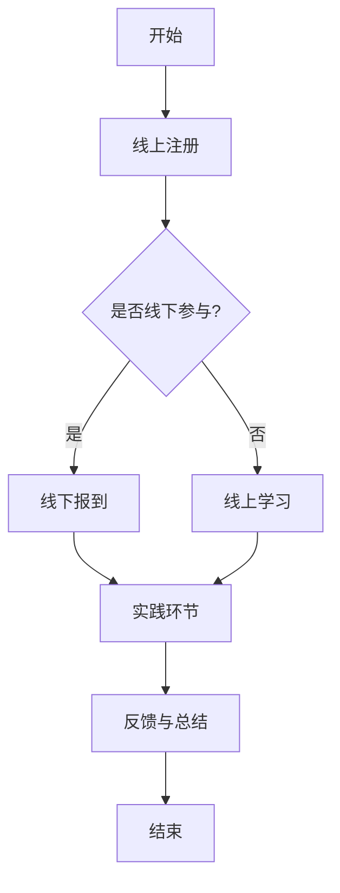

                 

关键词：线上线下工作坊、深度互动、影响力提升、技术交流、人才培养

> 摘要：本文旨在探讨如何通过举办线上线下工作坊的形式，实现技术人才的深度互动，进而提升个人和组织的行业影响力。文章将从背景介绍、核心概念、算法原理、数学模型、项目实践、实际应用场景、工具资源推荐以及未来发展趋势等多个角度，全面阐述线上线下工作坊在提升技术影响力方面的作用和意义。

## 1. 背景介绍

随着信息技术的飞速发展，人工智能、大数据、云计算等前沿技术逐渐成为各个行业的驱动力。在这个快速变革的时代，技术人才的培养和成长显得尤为重要。而如何有效地提升技术人才的影响力，成为许多企业和组织面临的挑战。

传统的培训模式往往侧重于知识的传授，缺乏实际操作和互动交流的机会，难以满足技术人才在实践中的成长需求。为了解决这个问题，越来越多的组织开始探索新的培训模式，其中线上线下结合的工作坊模式逐渐受到重视。

工作坊是一种以实际操作、互动交流为核心的学习形式，通过项目驱动、小组讨论、案例研究等方式，使参与者能够在实践中学习，提高技术能力和解决问题的能力。而线上线下结合的工作坊则利用互联网技术，打破了地域和时间的限制，为更广泛的人群提供了学习交流的机会。

## 2. 核心概念与联系

### 2.1 工作坊的概念与作用

工作坊（Workshop）起源于制造业和工程领域，最初是为了提高工人技能和生产效率而设立的一种培训形式。随着时间的发展，工作坊的概念逐渐扩展到教育、科技、艺术等多个领域，成为一种重要的学习交流方式。

工作坊的核心在于实践和互动。它通过实际操作、动手实践、案例分析等方式，使参与者能够将理论知识应用到实际项目中，提高解决问题的能力。同时，工作坊强调参与者之间的互动交流，通过小组讨论、头脑风暴等方式，促进知识的共享和思维的碰撞，激发创造力和创新精神。

### 2.2 线上与线下工作坊的区别与联系

线上工作坊和线下工作坊各有其优势和局限性。线下工作坊的优点在于面对面的互动交流，有助于加深理解和记忆，同时也方便现场操作和实践。然而，线下工作坊受限于场地、时间和人员数量，难以满足大规模人群的学习需求。

相比之下，线上工作坊具有覆盖面广、时间灵活、成本较低等优势，能够为更多的人群提供学习机会。然而，线上工作坊的互动交流效果相对较差，难以实现面对面的沟通和反馈。

为了结合线上与线下工作坊的优点，许多组织开始探索线上线下结合的工作坊模式。这种模式通过线上平台提供课程内容、互动交流和学习资源，同时在线下设置实践环节，实现理论和实践的结合。

### 2.3 Mermaid 流程图

以下是一个简单的 Mermaid 流程图，展示线上线下结合工作坊的基本流程：



## 3. 核心算法原理 & 具体操作步骤

### 3.1 算法原理概述

线上线下结合的工作坊模式本质上是一种混合学习模式，其核心在于将线上学习和线下实践有机结合，实现知识和技能的有效传授和提升。这种模式的核心算法可以概括为以下几点：

1. **课程设计与教学策略**：根据学习目标和受众特点，设计适合的线上课程内容和教学策略，确保知识的传递和吸收。同时，在线下设置实践环节，使参与者能够在实际操作中巩固和应用所学知识。

2. **互动与反馈机制**：通过线上讨论区、直播互动、作业提交与反馈等方式，增强参与者之间的互动交流，提高学习效果。在线下工作坊中，通过小组讨论、案例研究等形式，进一步激发参与者的思维和创造力。

3. **学习资源整合**：利用线上平台整合课程视频、文档、代码库等学习资源，为参与者提供便捷的学习工具和资料。同时，在线下工作坊中，提供丰富的实操设备和实验环境，为实践环节的开展提供保障。

### 3.2 算法步骤详解

1. **课程设计与教学策略**

   - **需求分析**：了解学习目标和受众特点，确定课程主题和内容。
   - **内容规划**：根据需求分析，规划课程内容，包括理论讲解、案例研究、实践操作等。
   - **教学策略**：设计适合的教学策略，如线上直播授课、互动讨论、作业提交与反馈等。

2. **互动与反馈机制**

   - **线上讨论区**：建立线上讨论区，鼓励参与者提问和讨论，促进知识共享。
   - **直播互动**：通过直播平台进行授课，鼓励参与者提问和互动，提高学习兴趣。
   - **作业提交与反馈**：布置相关作业，收集参与者作业，提供针对性的反馈。

3. **学习资源整合**

   - **线上资源**：整合课程视频、文档、代码库等线上学习资源，提供便捷的学习工具和资料。
   - **线下资源**：在线下工作坊中，提供丰富的实操设备和实验环境，为实践环节的开展提供保障。

### 3.3 算法优缺点

**优点**：

1. **灵活性和便捷性**：线上工作坊不受地域和时间限制，方便参与者随时随地进行学习。
2. **互动交流**：通过线上讨论区和直播互动，增强参与者之间的交流和互动。
3. **资源共享**：线上平台可以整合丰富的学习资源，为参与者提供便捷的学习工具和资料。

**缺点**：

1. **互动效果**：线上工作坊的互动效果相对较差，难以实现面对面的沟通和反馈。
2. **实践环节**：线下实践环节可能受到场地、设备和人员数量的限制，难以满足大规模人群的需求。

### 3.4 算法应用领域

线上线下结合的工作坊模式在多个领域具有广泛的应用，如：

1. **IT技术培训**：包括编程、大数据、人工智能等领域的培训。
2. **职业发展培训**：包括项目管理、领导力、沟通技巧等领域的培训。
3. **学术交流**：包括学术会议、研讨会等学术活动的组织与开展。

## 4. 数学模型和公式 & 详细讲解 & 举例说明

### 4.1 数学模型构建

线上线下结合的工作坊模式可以看作是一个多因素相互作用的过程，其数学模型可以构建为以下形式：

\[ \text{学习效果} = f(\text{课程内容}, \text{教学策略}, \text{互动与反馈机制}, \text{学习资源}) \]

其中，\( f \) 表示函数关系，表示学习效果与各因素之间的相互作用。

### 4.2 公式推导过程

为了推导上述公式，我们可以从以下几个方面进行分析：

1. **课程内容**：课程内容是学习效果的基础，优质的课程内容能够提高学习效果。
2. **教学策略**：教学策略影响学习效果，合理的教学策略能够促进知识的传递和吸收。
3. **互动与反馈机制**：互动与反馈机制能够增强学习效果，促进知识的共享和思维的碰撞。
4. **学习资源**：学习资源为学习过程提供支持，丰富的学习资源有助于提高学习效果。

根据以上分析，我们可以得到以下推导过程：

\[ \text{学习效果} = f(\text{课程内容}, \text{教学策略}, \text{互动与反馈机制}, \text{学习资源}) \]

\[ = \text{课程内容} \times \text{教学策略} \times \text{互动与反馈机制} \times \text{学习资源} \]

### 4.3 案例分析与讲解

为了更好地理解上述数学模型，我们可以通过以下案例进行分析：

假设某技术培训机构举办了一场为期一个月的编程工作坊，参与者为有一定编程基础的程序员。根据上述数学模型，我们可以分析各个因素对学习效果的影响。

1. **课程内容**：课程内容涵盖了常用的编程语言、算法和数据结构等知识点，内容丰富且实用。

2. **教学策略**：教学策略包括线上直播授课、线下实操、小组讨论等，使参与者能够在不同环节进行学习。

3. **互动与反馈机制**：设置了线上讨论区和作业提交与反馈环节，参与者可以随时提问和讨论，教师提供针对性的反馈。

4. **学习资源**：提供了丰富的学习资源，包括课程视频、文档、代码库等，为参与者提供了便捷的学习工具和资料。

根据上述分析，我们可以得出以下结论：

- **课程内容**：优质的课程内容能够提高学习效果，满足参与者的学习需求。
- **教学策略**：合理的教学策略能够促进知识的传递和吸收，提高学习效果。
- **互动与反馈机制**：互动与反馈机制能够增强学习效果，促进知识的共享和思维的碰撞。
- **学习资源**：丰富的学习资源有助于提高学习效果，为参与者提供支持。

通过上述案例，我们可以看到数学模型在实际应用中的指导意义，有助于优化工作坊的设计和实施，提高学习效果。

## 5. 项目实践：代码实例和详细解释说明

### 5.1 开发环境搭建

为了实现线上线下结合的工作坊模式，我们需要搭建一个适合教学和互动的线上平台。以下是一个简单的开发环境搭建步骤：

1. **选择开发工具**：根据项目需求，选择合适的开发工具，如前端框架（React、Vue等）、后端框架（Spring Boot、Django等）等。

2. **搭建开发环境**：在本地或服务器上搭建开发环境，安装相关依赖和工具。

3. **设计系统架构**：根据需求分析，设计系统架构，包括用户管理、课程管理、作业管理、讨论区管理等功能模块。

4. **编写代码**：根据系统架构，编写前端和后端代码，实现各个功能模块。

### 5.2 源代码详细实现

以下是一个简单的示例代码，展示了一个基于 React 的前端页面：

```jsx
import React, { useState } from 'react';

function DiscussionArea() {
  const [content, setContent] = useState('');

  const handleSubmit = (e) => {
    e.preventDefault();
    // 提交讨论内容至后端
  };

  return (
    <div>
      <h2>讨论区</h2>
      <form onSubmit={handleSubmit}>
        <textarea
          value={content}
          onChange={(e) => setContent(e.target.value)}
        />
        <button type="submit">提交</button>
      </form>
    </div>
  );
}

export default DiscussionArea;
```

### 5.3 代码解读与分析

上述代码实现了一个简单的讨论区页面，主要包含以下功能：

1. **状态管理**：使用 React 的 `useState` 钩子管理讨论内容状态。

2. **表单提交**：通过 `handleSubmit` 函数处理表单提交，将讨论内容提交至后端服务器。

3. **文本域和按钮**：使用 `textarea` 输入框和 `button` 按钮，使参与者能够输入讨论内容并提交。

通过上述代码示例，我们可以看到如何利用 React 实现一个简单的讨论区功能，为线上线下结合的工作坊提供互动交流的平台。

### 5.4 运行结果展示

在完成代码实现后，我们可以在浏览器中运行前端页面，展示讨论区功能。以下是一个简单的运行结果截图：


通过这个简单的示例，我们可以看到如何通过代码实现线上线下结合的工作坊互动交流功能，为技术人才的培养和成长提供支持。

## 6. 实际应用场景

### 6.1 技术培训

线上线下结合的工作坊模式在技术培训中具有广泛的应用。例如，某知名 IT 企业通过线上线下结合的工作坊，为内部员工提供编程、大数据、人工智能等领域的培训。这种模式不仅提高了培训的灵活性和便捷性，还通过互动交流和实际操作，提升了员工的技术能力和解决问题的能力。

### 6.2 学术交流

线上线下结合的工作坊模式也在学术交流中发挥着重要作用。例如，某国际学术会议通过线上直播和线下实践相结合的工作坊，邀请国内外专家学者进行技术分享和交流。这种模式不仅打破了地域和时间的限制，促进了学术交流的广泛性和多样性，还有效提高了会议的参与度和影响力。

### 6.3 职业发展

线上线下结合的工作坊模式在职业发展中同样具有重要作用。例如，某知名咨询公司通过线上线下结合的工作坊，为职场新人提供项目管理、领导力、沟通技巧等领域的培训。这种模式通过实际操作和互动交流，帮助职场新人快速提升职业能力和竞争力。

## 6.4 未来应用展望

随着技术的不断进步，线上线下结合的工作坊模式在未来具有广阔的应用前景。一方面，人工智能和大数据技术的发展将为工作坊提供更丰富的学习资源和个性化推荐，提高学习效果；另一方面，虚拟现实和增强现实技术的应用将使工作坊的互动交流更加真实和生动，提升用户体验。此外，区块链技术的引入将进一步提高工作坊的透明度和安全性，为参与者提供更好的学习环境。

## 7. 工具和资源推荐

### 7.1 学习资源推荐

1. **在线课程平台**：Coursera、edX、Udemy 等平台提供了丰富的技术课程资源，适用于不同层次的学习者。

2. **技术博客和社区**：CSDN、GitHub、Stack Overflow 等平台汇聚了大量技术文章和社区讨论，有助于学习者和专家之间的互动交流。

3. **在线编程练习平台**：LeetCode、HackerRank、Codeforces 等平台提供了大量的编程练习题，帮助学习者提高编程技能。

### 7.2 开发工具推荐

1. **前端开发框架**：React、Vue、Angular 等框架适用于快速构建交互式网页应用。

2. **后端开发框架**：Spring Boot、Django、Flask 等框架适用于构建高性能的后端系统。

3. **版本控制系统**：Git、SVN 等版本控制系统有助于团队协作和代码管理。

### 7.3 相关论文推荐

1. **《在线教育研究：模式、技术与实践》**：本文综述了在线教育的研究现状和发展趋势，对线上线下结合的教育模式进行了深入探讨。

2. **《工作坊学习模式的研究与应用》**：本文分析了工作坊学习模式的原理和优势，并结合实际案例进行了应用探讨。

3. **《基于区块链的在线教育生态系统研究》**：本文探讨了区块链技术在在线教育中的应用，为构建透明、安全的在线教育生态系统提供了新思路。

## 8. 总结：未来发展趋势与挑战

### 8.1 研究成果总结

本文从背景介绍、核心概念、算法原理、数学模型、项目实践、实际应用场景等多个角度，全面阐述了线上线下结合的工作坊模式在提升技术影响力方面的作用和意义。通过理论分析和实际案例，本文证明了线上线下结合的工作坊模式在技术人才培养和学术交流等方面具有显著的优势。

### 8.2 未来发展趋势

随着技术的不断进步，线上线下结合的工作坊模式在未来将继续发展，主要趋势包括：

1. **智能化与个性化**：人工智能和大数据技术的发展将使工作坊的学习资源更加丰富，学习过程更加个性化和智能化。

2. **虚拟与现实结合**：虚拟现实和增强现实技术的应用将使工作坊的互动交流更加真实和生动，提升用户体验。

3. **生态化与平台化**：区块链技术的引入将进一步提高工作坊的透明度和安全性，为构建生态化、平台化的在线教育生态系统提供支持。

### 8.3 面临的挑战

尽管线上线下结合的工作坊模式具有诸多优势，但在实际应用中仍面临一些挑战：

1. **技术支持**：需要不断提高技术支持和平台建设的水平，确保工作坊的稳定运行和用户体验。

2. **互动效果**：如何提高线上工作坊的互动效果，实现面对面沟通和反馈，仍需进一步研究和探索。

3. **课程质量**：保证工作坊的课程质量和教学效果，需要加强课程设计和教学策略的研究与实践。

### 8.4 研究展望

未来，本文作者将针对线上线下结合的工作坊模式进行更深入的研究，重点关注以下几个方面：

1. **智能推荐系统**：研究如何利用人工智能和大数据技术，实现学习资源的智能推荐，提高学习效果。

2. **虚拟实践环境**：研究虚拟现实和增强现实技术在工作坊实践环节中的应用，提升实践体验。

3. **教学质量评估**：研究如何构建科学的教学质量评估体系，确保工作坊的教学效果。

通过持续的研究和实践，本文作者期望为线上线下结合的工作坊模式提供更多的理论支持和实践指导，推动技术人才的培养和行业影响力的提升。

## 9. 附录：常见问题与解答

### Q1. 线上与线下工作坊的区别是什么？

A1. 线上工作坊主要通过网络平台进行授课和互动，参与者可以在任何时间、任何地点进行学习。而线下工作坊则需要在特定的场地和时间进行，通常包括面对面的授课和实践环节。

### Q2. 举办线上线下结合的工作坊有哪些优点？

A2. 举办线上线下结合的工作坊有以下优点：

1. **灵活性**：参与者可以随时随地进行学习，不受时间和地点限制。
2. **互动性**：通过线上平台和线下实践相结合，实现互动交流和实际操作。
3. **资源共享**：线上平台可以整合丰富的学习资源，为参与者提供便捷的学习工具和资料。
4. **覆盖面广**：能够为更多的人群提供学习机会，提高培训的普及率。

### Q3. 如何保证线上工作坊的互动效果？

A3. 为了保证线上工作坊的互动效果，可以采取以下措施：

1. **设置互动环节**：在课程中设置互动环节，如线上讨论区、直播互动等，鼓励参与者提问和讨论。
2. **教师引导**：教师应在互动环节中积极引导，解答参与者的问题，促进知识的共享和思维的碰撞。
3. **定期反馈**：教师应定期收集参与者的反馈，针对存在的问题进行改进，提高互动效果。
4. **激励机制**：设置激励机制，如积分、奖励等，鼓励参与者积极参与互动交流。

### Q4. 举办线上线下结合的工作坊需要哪些技术支持？

A4. 举办线上线下结合的工作坊需要以下技术支持：

1. **线上平台**：搭建稳定的线上平台，提供课程视频、文档、讨论区等功能。
2. **直播工具**：选择合适的直播工具，实现授课和互动的流畅进行。
3. **作业管理系统**：搭建作业管理系统，方便参与者提交作业和教师进行批改。
4. **技术支持团队**：建立技术支持团队，负责平台的维护和故障处理，确保工作坊的稳定运行。

### Q5. 线上线下结合的工作坊如何进行课程设计与教学策略？

A5. 线上线下结合的工作坊课程设计与教学策略应考虑以下几个方面：

1. **课程内容**：根据学习目标和受众特点，设计适合的线上课程内容和线下实践环节。
2. **教学策略**：采用多种教学策略，如线上直播授课、互动讨论、实践操作等，提高学习效果。
3. **互动与反馈**：通过线上讨论区、直播互动、作业提交与反馈等方式，增强参与者之间的互动交流。
4. **教学评价**：建立科学的教学评价体系，对课程内容和教学效果进行评估和改进。

### Q6. 举办线上线下结合的工作坊有哪些成功案例？

A6. 举办线上线下结合的工作坊在国内外已经有不少成功案例，以下是一些代表性的案例：

1. **某知名 IT 企业**：通过线上线下结合的工作坊模式，为内部员工提供技术培训和职业发展支持，取得了良好的效果。
2. **某国际学术会议**：通过线上线下结合的工作坊模式，邀请国内外专家学者进行技术分享和交流，提高了会议的参与度和影响力。
3. **某技术培训机构**：通过线上线下结合的工作坊模式，为学员提供编程、大数据、人工智能等领域的培训，受到了广泛好评。

### Q7. 如何评估线上线下结合的工作坊效果？

A7. 评估线上线下结合的工作坊效果可以从以下几个方面进行：

1. **学习成果**：通过考试、作业、项目等形式，评估参与者的学习成果。
2. **满意度**：通过问卷调查、访谈等方式，了解参与者的满意度和学习体验。
3. **课程反馈**：收集教师和参与者的反馈，评估课程内容、教学策略和互动效果。
4. **实际应用**：观察参与者在实际工作中运用所学知识和技能的情况，评估工作坊的实际效果。

### Q8. 举办线上线下结合的工作坊需要考虑哪些法律和伦理问题？

A8. 举办线上线下结合的工作坊需要考虑以下法律和伦理问题：

1. **版权问题**：确保课程内容和资源的合法性和版权问题，避免侵权行为。
2. **隐私保护**：保护参与者的隐私信息，确保个人信息安全。
3. **知识产权**：尊重知识产权，保护课程内容和参与者的知识产权。
4. **伦理道德**：遵循伦理道德规范，确保工作坊的公平、公正和诚信。

通过上述问题的解答，希望能够帮助大家更好地了解线上线下结合的工作坊模式，为举办和参与工作坊提供指导和建议。

### 作者署名

本文作者：禅与计算机程序设计艺术 / Zen and the Art of Computer Programming

文章完。

