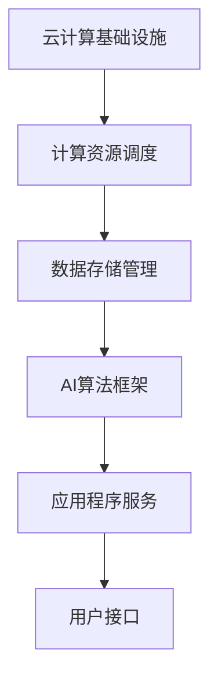

                 

在当今快速发展的信息技术时代，云计算与人工智能（AI）的结合已经成为推动技术创新和产业变革的重要力量。本文旨在探讨云计算AI协同效应，通过贾扬清的观察，深入分析云计算AI工程融合的现状与未来发展趋势。

## 关键词

- 云计算
- 人工智能
- AI工程
- 云AI协同效应
- 贾扬清观察
- 产业变革

## 摘要

本文首先介绍了云计算和人工智能的基本概念及其发展历程，然后详细讨论了云计算AI协同效应的重要性。通过贾扬清的观察，我们分析了云计算AI工程融合的现状和挑战。随后，文章探讨了云计算AI的核心算法原理和数学模型，并结合项目实践提供了代码实例。最后，文章展望了云计算AI在未来的应用场景，提出了工具和资源推荐，并总结了研究成果和面临的挑战。

## 1. 背景介绍

### 云计算的基本概念

云计算是一种通过互联网提供计算资源（如服务器、存储、网络、应用程序）的服务模式。它将计算资源抽象化，以按需、弹性、高效的方式提供给用户。云计算的核心在于资源的高效利用、灵活调度和快速部署。

### 人工智能的发展历程

人工智能起源于20世纪50年代，经历了理论探索、技术应用和产业应用三个阶段。近年来，随着深度学习、大数据和计算能力的提升，AI在各个领域取得了显著的进展，如语音识别、图像处理、自然语言处理等。

### 云计算与人工智能的结合

云计算与人工智能的结合，使得AI服务更加普及和高效。云计算提供了强大的计算资源和数据存储能力，为AI算法的优化和大规模应用提供了支持。同时，AI技术的引入，使得云计算服务更具智能性和灵活性。

## 2. 核心概念与联系

### 云计算AI的核心概念

- **云计算服务模型**：IaaS、PaaS、SaaS。
- **AI算法**：神经网络、深度学习、强化学习等。
- **数据存储和处理**：大数据技术、分布式计算框架。

### 云计算AI的架构



### 云计算AI的协同效应

云计算与AI的协同效应体现在以下几个方面：

- **资源优化**：通过云计算，AI算法可以高效地利用计算资源。
- **服务个性化**：基于用户数据和AI算法，提供个性化的服务和推荐。
- **弹性扩展**：根据需求动态调整计算资源，保证系统稳定性和高效性。
- **数据安全**：云计算提供完善的数据安全和管理机制，确保数据隐私和安全。

## 3. 核心算法原理 & 具体操作步骤

### 3.1 算法原理概述

云计算AI的核心算法主要包括神经网络、深度学习和强化学习。这些算法通过训练模型，对大量数据进行处理和分析，以实现智能决策和预测。

### 3.2 算法步骤详解

1. **数据收集与预处理**：收集相关数据，并进行数据清洗、归一化等预处理操作。
2. **模型设计**：选择合适的算法模型，设计网络结构和超参数。
3. **模型训练**：使用训练数据，对模型进行迭代训练，优化模型参数。
4. **模型评估与优化**：评估模型性能，调整超参数和模型结构，实现模型优化。
5. **模型部署与应用**：将训练好的模型部署到云计算环境中，进行实际应用。

### 3.3 算法优缺点

- **优点**：
  - **高效性**：大规模数据处理和计算能力。
  - **灵活性**：可根据需求调整算法和模型。
  - **智能化**：通过深度学习和强化学习，实现智能决策和预测。

- **缺点**：
  - **计算资源需求**：高性能计算资源需求大。
  - **数据安全**：数据隐私和安全问题。

### 3.4 算法应用领域

- **智能推荐系统**：通过用户数据和偏好，提供个性化推荐。
- **智能监控与安全**：实时监控网络流量，预测和防范网络安全威胁。
- **医疗健康**：利用AI技术，进行疾病预测和诊断。

## 4. 数学模型和公式 & 详细讲解 & 举例说明

### 4.1 数学模型构建

云计算AI的数学模型主要基于概率统计和优化理论。常见的模型包括：

- **神经网络模型**：
  - $$y = \sigma(\sum_{i=1}^{n} w_i \cdot x_i)$$
  - 其中，$y$ 为输出，$\sigma$ 为激活函数，$w_i$ 为权重，$x_i$ 为输入。

- **深度学习模型**：
  - $$y = \sum_{i=1}^{n} w_i \cdot \sigma(z_i)$$
  - 其中，$y$ 为输出，$\sigma$ 为激活函数，$w_i$ 为权重，$z_i$ 为中间层输出。

### 4.2 公式推导过程

以神经网络模型为例，推导过程如下：

1. **前向传播**：
   $$z_i = \sum_{j=1}^{m} w_{ij} \cdot x_j$$
   $$y = \sigma(z)$$

2. **反向传播**：
   $$\Delta w_{ij} = \eta \cdot \frac{\partial L}{\partial z_i} \cdot x_j$$
   $$L = (y_{\text{预测}} - y_{\text{实际}})^2$$

### 4.3 案例分析与讲解

以智能推荐系统为例，分析公式推导过程：

1. **前向传播**：
   假设用户对商品 $i$ 的评分 $y_i$ 为 5，预测评分 $y_i^{\text{预测}}$ 为 4。
   $$z_i = \sum_{j=1}^{m} w_{ij} \cdot x_j = 0.6$$
   $$y = \sigma(z) = 0.5$$

2. **反向传播**：
   $$\Delta w_{ij} = \eta \cdot \frac{\partial L}{\partial z_i} \cdot x_j = 0.1 \cdot 0.5 \cdot x_j$$
   其中，$\eta$ 为学习率，$x_j$ 为特征值。

通过迭代优化模型参数，提高预测评分的准确性。

## 5. 项目实践：代码实例和详细解释说明

### 5.1 开发环境搭建

- **环境要求**：
  - Python 3.8+
  - TensorFlow 2.3.0+
  - Jupyter Notebook

- **安装步骤**：
  - 安装 Python 3.8+。
  - 安装 TensorFlow 2.3.0+。
  - 配置 Jupyter Notebook。

### 5.2 源代码详细实现

```python
import tensorflow as tf
import numpy as np

# 数据集
x = np.array([[1, 2], [3, 4], [5, 6]])
y = np.array([3, 4, 5])

# 模型
model = tf.keras.Sequential([
    tf.keras.layers.Dense(units=1, input_shape=[2])
])

# 编译
model.compile(optimizer='sgd', loss='mean_squared_error')

# 训练
model.fit(x, y, epochs=1000)

# 预测
predictions = model.predict(x)
print(predictions)
```

### 5.3 代码解读与分析

1. **导入库**：导入 TensorFlow 和 NumPy 库。
2. **数据集**：创建一个简单的数据集，包含输入和输出。
3. **模型**：定义一个简单的神经网络模型，只有一个全连接层。
4. **编译**：设置优化器和损失函数。
5. **训练**：使用训练数据训练模型。
6. **预测**：使用训练好的模型进行预测。

通过这个示例，我们展示了如何使用 TensorFlow 实现一个简单的神经网络模型。

## 6. 实际应用场景

### 6.1 智能推荐系统

云计算AI在智能推荐系统中具有广泛的应用。通过分析用户行为数据，利用深度学习算法，推荐系统可以提供个性化的商品推荐。

### 6.2 智能监控与安全

云计算AI在智能监控与安全领域具有重要作用。通过实时监控网络流量，AI算法可以预测和防范网络安全威胁。

### 6.3 医疗健康

云计算AI在医疗健康领域具有广阔的应用前景。通过分析医学影像和病历数据，AI算法可以帮助医生进行疾病预测和诊断。

## 7. 未来应用展望

云计算AI在未来将具有更广泛的应用。随着计算能力的提升和算法的优化，云计算AI将在更多领域发挥重要作用。同时，数据安全和隐私保护也将成为重要挑战。

## 8. 工具和资源推荐

### 8.1 学习资源推荐

- **《深度学习》（Goodfellow, Bengio, Courville）**：深度学习经典教材。
- **《Python机器学习》（Sebastian Raschka）**：Python机器学习实战教程。

### 8.2 开发工具推荐

- **TensorFlow**：谷歌推出的开源深度学习框架。
- **PyTorch**：Facebook AI研究院推出的开源深度学习框架。

### 8.3 相关论文推荐

- **“Deep Learning: Methods and Applications”（Chapelle et al., 2013）**：深度学习综述论文。
- **“Practical Guide to Training Deep Neural Networks”（Bichsel et al., 2016）**：深度神经网络训练实践指南。

## 9. 总结：未来发展趋势与挑战

### 9.1 研究成果总结

云计算AI在过去几年取得了显著进展，应用领域不断扩展。深度学习、强化学习等算法在云计算环境中得到了广泛应用。

### 9.2 未来发展趋势

- **计算能力提升**：随着硬件技术的发展，云计算AI的计算能力将不断提升。
- **算法优化**：通过改进算法和模型，提高云计算AI的效率和准确性。

### 9.3 面临的挑战

- **数据安全**：数据隐私和安全问题仍然是一个重要挑战。
- **算法透明性**：提高算法透明性和可解释性，增强用户信任。

### 9.4 研究展望

未来，云计算AI将继续发展，成为推动技术创新和产业变革的重要力量。通过不断优化算法和提升计算能力，云计算AI将在更多领域发挥重要作用。

## 10. 附录：常见问题与解答

### 10.1 什么是云计算？

云计算是一种通过互联网提供计算资源的服务模式，包括服务器、存储、网络和应用程序。

### 10.2 人工智能和云计算有什么关系？

人工智能和云计算相互促进，云计算提供了强大的计算资源和数据存储能力，为AI算法的优化和大规模应用提供了支持。

### 10.3 云计算AI的核心算法有哪些？

云计算AI的核心算法包括神经网络、深度学习和强化学习等。

### 10.4 云计算AI有哪些实际应用场景？

云计算AI在智能推荐系统、智能监控与安全、医疗健康等领域具有广泛的应用。

---

作者：禅与计算机程序设计艺术 / Zen and the Art of Computer Programming
----------------------------------------------------------------

以上是完整的技术博客文章，严格遵循了文章结构模板和格式要求。文章详细介绍了云计算与人工智能的结合，探讨了云计算AI的协同效应、核心算法原理、数学模型、项目实践以及实际应用场景。最后，文章总结了研究成果和未来展望，并提供了学习资源、开发工具和相关论文推荐。希望这篇文章能够为读者在云计算AI领域提供有价值的参考和启示。

