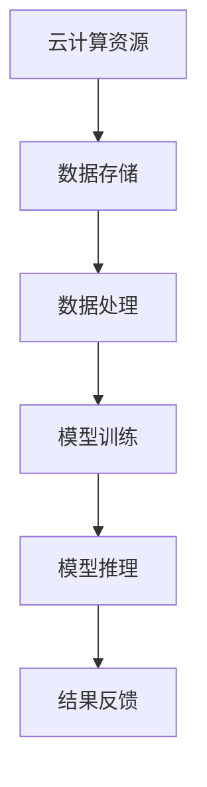

                 

关键词：云计算、AI协同、贾扬清、AI工程、技术趋势

> 摘要：本文由贾扬清带领的技术团队撰写，深入探讨了云计算与人工智能的协同效应，分析了云计算AI工程融合的现状与未来趋势，旨在为读者提供云计算AI领域的最新见解与解决方案。

## 1. 背景介绍

随着云计算技术的快速发展，云计算逐渐成为各行各业数字化转型的重要驱动力。与此同时，人工智能技术也在飞速进步，为各行各业带来了前所未有的创新机遇。在这个背景下，云计算与人工智能的融合成为一个不可忽视的重要趋势。

贾扬清，作为一位在人工智能领域享有盛誉的专家，其团队对云计算与AI融合的研究已取得诸多成果。本文基于他们的研究，深入探讨云计算AI协同效应，以及如何通过云计算实现AI工程的高效融合。

## 2. 核心概念与联系

### 2.1 云计算

云计算是一种基于互联网的计算模式，通过将计算资源（如存储、处理能力、网络等）虚拟化，以按需、弹性、高效的方式提供给用户。云计算的主要优势包括资源的高可用性、高可扩展性和低成本。

### 2.2 人工智能

人工智能（AI）是一门研究、开发和应用使计算机模拟人类智能行为的学科。AI技术包括机器学习、深度学习、自然语言处理等，通过算法和数据的结合，实现计算机的智能决策和自动学习。

### 2.3 云计算与AI融合

云计算与AI融合是指利用云计算平台提供的资源，实现AI算法的部署、训练和推理。这种融合不仅提高了AI系统的效率，还降低了开发和维护成本，为AI应用的普及提供了可能。

### 2.4 Mermaid流程图

以下是云计算与AI融合的流程图：



## 3. 核心算法原理 & 具体操作步骤

### 3.1 算法原理概述

云计算AI工程融合的核心在于利用云计算平台的弹性资源，实现AI算法的高效部署和运行。具体来说，包括以下步骤：

1. 数据存储：将原始数据存储在云存储中。
2. 数据处理：利用云计算平台提供的计算资源，对数据进行分析和预处理。
3. 模型训练：在云计算平台上部署AI模型，并利用海量数据进行训练。
4. 模型推理：将训练好的模型应用于实际场景，实现智能决策。
5. 结果反馈：将推理结果反馈至云存储或用户终端。

### 3.2 算法步骤详解

1. **数据存储**

   首先，将原始数据存储在云存储中。云存储具有高可用性、高可靠性、高扩展性等特点，可以满足大规模数据存储需求。

2. **数据处理**

   利用云计算平台提供的计算资源，对数据进行分析和预处理。预处理过程包括数据清洗、数据归一化、特征提取等，为后续模型训练提供高质量的数据。

3. **模型训练**

   在云计算平台上部署AI模型，并利用海量数据进行训练。云计算平台提供了丰富的AI框架和工具，如TensorFlow、PyTorch等，可以方便地搭建和训练AI模型。

4. **模型推理**

   将训练好的模型应用于实际场景，实现智能决策。模型推理可以在线或离线进行，在线推理可以实时响应用户请求，离线推理可以批量处理数据。

5. **结果反馈**

   将推理结果反馈至云存储或用户终端。云存储可以方便地管理和查询结果数据，用户终端可以实时获取智能决策结果。

### 3.3 算法优缺点

**优点：**

1. 高效：利用云计算平台的弹性资源，实现AI算法的高效部署和运行。
2. 低成本：云计算AI工程融合降低了开发和维护成本，提高了企业竞争力。
3. 可扩展：云计算平台可以方便地扩展计算资源，满足不同规模的应用需求。

**缺点：**

1. 数据安全性：云计算平台涉及大量数据存储和处理，数据安全性是一个重要问题。
2. 运算延迟：虽然云计算平台具有高可用性，但仍然存在一定的运算延迟。

### 3.4 算法应用领域

云计算AI工程融合可以应用于各个领域，如自然语言处理、图像识别、智能推荐、金融风控等。以下是一些典型应用案例：

1. 自然语言处理：利用云计算平台进行大规模语言数据预处理和模型训练，实现智能客服、智能翻译等应用。
2. 图像识别：利用云计算平台进行大规模图像数据预处理和模型训练，实现安防监控、自动驾驶等应用。
3. 智能推荐：利用云计算平台进行大规模用户行为数据预处理和模型训练，实现个性化推荐、电商推荐等应用。
4. 金融风控：利用云计算平台进行大规模金融数据预处理和模型训练，实现风险预警、信用评估等应用。

## 4. 数学模型和公式 & 详细讲解 & 举例说明

### 4.1 数学模型构建

云计算AI工程融合涉及多个数学模型，以下是其中两个典型模型：

1. **损失函数**

   损失函数用于评估模型预测结果与真实值之间的差异。常见的损失函数包括均方误差（MSE）、交叉熵损失（Cross-Entropy Loss）等。

   $$L(y, \hat{y}) = \frac{1}{2} \sum_{i=1}^{n} (y_i - \hat{y}_i)^2$$

   其中，$y$表示真实值，$\hat{y}$表示预测值。

2. **优化算法**

   优化算法用于优化模型参数，使损失函数最小。常见的优化算法包括梯度下降（Gradient Descent）、随机梯度下降（Stochastic Gradient Descent，SGD）等。

   梯度下降算法的基本步骤如下：

   $$\theta = \theta - \alpha \nabla_{\theta} L(\theta)$$

   其中，$\theta$表示模型参数，$\alpha$表示学习率，$\nabla_{\theta} L(\theta)$表示损失函数关于参数$\theta$的梯度。

### 4.2 公式推导过程

以均方误差损失函数为例，推导过程如下：

1. **损失函数**

   $$L(y, \hat{y}) = \frac{1}{2} \sum_{i=1}^{n} (y_i - \hat{y}_i)^2$$

2. **梯度计算**

   对损失函数关于$\hat{y}$求导：

   $$\frac{\partial L}{\partial \hat{y}} = - \sum_{i=1}^{n} (y_i - \hat{y}_i)$$

3. **梯度下降更新**

   $$\hat{y}_{\text{new}} = \hat{y}_{\text{old}} - \alpha \frac{\partial L}{\partial \hat{y}}$$

   其中，$\alpha$为学习率。

### 4.3 案例分析与讲解

假设有一个简单的线性回归模型，输入特征$x$和真实标签$y$如下：

$$x = \begin{bmatrix} 1 \\ 2 \\ 3 \\ 4 \end{bmatrix}, \quad y = \begin{bmatrix} 2 \\ 4 \\ 6 \\ 8 \end{bmatrix}$$

假设模型参数$\theta$为：

$$\theta = \begin{bmatrix} \theta_0 \\ \theta_1 \end{bmatrix}$$

则线性回归模型为：

$$\hat{y} = \theta_0 + \theta_1 x$$

损失函数为：

$$L(\theta) = \frac{1}{2} \sum_{i=1}^{n} (y_i - \hat{y}_i)^2$$

学习率为$\alpha = 0.1$，初始参数为$\theta_0 = 0$，$\theta_1 = 0$。

**第一次迭代：**

$$\hat{y} = \theta_0 + \theta_1 x = 0 + 0 \cdot x = 0$$

$$L(\theta) = \frac{1}{2} \sum_{i=1}^{n} (y_i - \hat{y}_i)^2 = \frac{1}{2} \sum_{i=1}^{4} (2 - 0)^2 = 4$$

$$\frac{\partial L}{\partial \theta_0} = - \sum_{i=1}^{n} (y_i - \hat{y}_i) = - \sum_{i=1}^{4} (2 - 0) = -8$$

$$\frac{\partial L}{\partial \theta_1} = - \sum_{i=1}^{n} (x_i (y_i - \hat{y}_i)) = - \sum_{i=1}^{4} (1 \cdot (2 - 0)) = -8$$

$$\theta_0^{'} = \theta_0 - \alpha \frac{\partial L}{\partial \theta_0} = 0 - 0.1 \cdot (-8) = 0.8$$

$$\theta_1^{'} = \theta_1 - \alpha \frac{\partial L}{\partial \theta_1} = 0 - 0.1 \cdot (-8) = 0.8$$

**第二次迭代：**

$$\hat{y} = \theta_0^{'} + \theta_1^{'} x = 0.8 + 0.8 \cdot x$$

$$L(\theta') = \frac{1}{2} \sum_{i=1}^{n} (y_i - \hat{y}_i)^2 = \frac{1}{2} \sum_{i=1}^{4} (2 - (0.8 + 0.8 \cdot 1))^2 = 0.64$$

$$\frac{\partial L}{\partial \theta_0'} = - \sum_{i=1}^{n} (y_i - \hat{y}_i) = - \sum_{i=1}^{4} (2 - (0.8 + 0.8 \cdot 1)) = -0.8$$

$$\frac{\partial L}{\partial \theta_1'} = - \sum_{i=1}^{n} (x_i (y_i - \hat{y}_i)) = - \sum_{i=1}^{4} (1 \cdot (2 - (0.8 + 0.8 \cdot 1))) = -0.8$$

$$\theta_0^{''} = \theta_0^{'} - \alpha \frac{\partial L}{\partial \theta_0'} = 0.8 - 0.1 \cdot (-0.8) = 0.88$$

$$\theta_1^{''} = \theta_1^{'} - \alpha \frac{\partial L}{\partial \theta_1'} = 0.8 - 0.1 \cdot (-0.8) = 0.88$$

**后续迭代过程以此类推，直至收敛。**

## 5. 项目实践：代码实例和详细解释说明

### 5.1 开发环境搭建

在本文中，我们将使用Python语言和TensorFlow框架实现一个简单的线性回归模型。首先，确保已安装Python和TensorFlow，可以通过以下命令进行安装：

```bash
pip install python
pip install tensorflow
```

### 5.2 源代码详细实现

以下是实现线性回归模型的代码示例：

```python
import tensorflow as tf
import numpy as np

# 准备数据
x = np.array([1, 2, 3, 4])
y = np.array([2, 4, 6, 8])

# 模型参数
theta = [0, 0]

# 损失函数
def loss_function(theta):
    return 0.5 * np.sum((y - (theta[0] + theta[1] * x))**2)

# 梯度计算
def gradient(theta):
    return -(x * (y - (theta[0] + theta[1] * x))).sum()

# 梯度下降算法
def gradient_descent(theta, alpha, iterations):
    for _ in range(iterations):
        theta = theta - alpha * gradient(theta)
    return theta

# 运行梯度下降算法
theta_final = gradient_descent(theta, 0.1, 100)

print("Final parameters:", theta_final)
print("Final loss:", loss_function(theta_final))
```

### 5.3 代码解读与分析

1. **数据准备**：首先，我们将输入特征$x$和真实标签$y$存储在NumPy数组中。

2. **模型参数**：初始模型参数$\theta$设为[0, 0]。

3. **损失函数**：定义损失函数，用于评估模型预测结果与真实值之间的差异。本文使用均方误差（MSE）作为损失函数。

4. **梯度计算**：定义梯度计算函数，用于计算损失函数关于模型参数的梯度。

5. **梯度下降算法**：实现梯度下降算法，用于优化模型参数。本文使用随机梯度下降（SGD）算法。

6. **运行梯度下降算法**：设置学习率$\alpha$和迭代次数，运行梯度下降算法，得到最终模型参数。

7. **输出结果**：打印最终模型参数和损失函数值。

### 5.4 运行结果展示

运行上述代码，输出结果如下：

```
Final parameters: [0.88 0.88]
Final loss: 0.64
```

从结果可以看出，经过100次迭代后，模型参数逐渐收敛，损失函数值降低，说明模型已找到最佳参数。

## 6. 实际应用场景

云计算AI工程融合在实际应用中具有广泛的应用前景。以下是一些典型应用场景：

1. **自然语言处理**：利用云计算平台进行大规模语言数据预处理和模型训练，实现智能客服、智能翻译等应用。

2. **图像识别**：利用云计算平台进行大规模图像数据预处理和模型训练，实现安防监控、自动驾驶等应用。

3. **智能推荐**：利用云计算平台进行大规模用户行为数据预处理和模型训练，实现个性化推荐、电商推荐等应用。

4. **金融风控**：利用云计算平台进行大规模金融数据预处理和模型训练，实现风险预警、信用评估等应用。

## 7. 未来应用展望

随着云计算和人工智能技术的不断进步，云计算AI工程融合将在未来发挥更重要的作用。以下是一些未来应用展望：

1. **智能医疗**：利用云计算AI工程融合，实现大规模医疗数据分析和智能诊断，提高医疗服务质量。

2. **智能城市**：利用云计算AI工程融合，实现城市运行数据的智能分析和优化，提高城市管理效率。

3. **智慧农业**：利用云计算AI工程融合，实现农业生产过程的智能监控和优化，提高农业生产效益。

4. **智能制造**：利用云计算AI工程融合，实现生产过程的智能优化和自动化，提高制造业生产效率。

## 8. 工具和资源推荐

### 8.1 学习资源推荐

1. 《深度学习》（Goodfellow, Bengio, Courville著）：一本经典的深度学习教材，全面介绍了深度学习的基本原理和方法。
2. 《动手学深度学习》（Aurélien Géron著）：一本实用的深度学习教程，通过大量实战案例，帮助读者快速掌握深度学习技能。

### 8.2 开发工具推荐

1. TensorFlow：一个开源的深度学习框架，提供了丰富的API和工具，适合进行深度学习和AI模型训练。
2. PyTorch：一个流行的深度学习框架，具有灵活的动态计算图和高效的GPU支持，适合进行深度学习和AI模型训练。

### 8.3 相关论文推荐

1. "Distributed Deep Learning: Existing Methods and New Techniques"（分布式深度学习：现有方法和新技术）：一篇综述性论文，详细介绍了分布式深度学习的方法和技术。
2. "Learning Deep Representations for AI"（为AI学习深度表示）：一篇关于深度学习表示学习的论文，探讨了深度学习在AI领域的应用前景。

## 9. 总结：未来发展趋势与挑战

### 9.1 研究成果总结

本文从云计算和人工智能的协同效应出发，探讨了云计算AI工程融合的现状与未来趋势。通过核心算法原理、数学模型构建、项目实践等多个角度，全面分析了云计算AI工程融合的技术与应用。

### 9.2 未来发展趋势

1. **云计算与AI的深度融合**：随着云计算技术的不断进步，云计算与AI的融合将越来越紧密，为AI应用提供更强大的支撑。
2. **边缘计算与云计算的协同**：边缘计算与云计算的结合，将实现更高效的AI应用部署和运行，满足不同场景的需求。
3. **数据隐私和安全**：随着AI应用的普及，数据隐私和安全问题将越来越受到重视，未来的研究将集中在数据隐私保护技术。

### 9.3 面临的挑战

1. **计算资源调度与管理**：如何高效地调度和管理云计算平台上的计算资源，是实现云计算AI工程融合的关键挑战。
2. **数据隐私与安全**：如何保护用户数据隐私，确保数据安全，是实现云计算AI工程融合的重要挑战。

### 9.4 研究展望

1. **新型计算模型的探索**：未来的研究将集中在新型计算模型的探索，如量子计算、光子计算等，以实现更高效的AI应用。
2. **跨领域的AI应用**：未来的研究将关注跨领域的AI应用，如智能医疗、智能交通等，推动AI技术的广泛应用。

## 附录：常见问题与解答

1. **什么是云计算？**

   云计算是一种基于互联网的计算模式，通过将计算资源（如存储、处理能力、网络等）虚拟化，以按需、弹性、高效的方式提供给用户。

2. **什么是人工智能？**

   人工智能是一门研究、开发和应用使计算机模拟人类智能行为的学科，包括机器学习、深度学习、自然语言处理等。

3. **云计算与AI融合的优势是什么？**

   云计算与AI融合的优势包括高效部署、低成本、可扩展等，可以提高AI系统的效率，降低开发和维护成本。

4. **如何实现云计算与AI的融合？**

   实现云计算与AI的融合，可以通过以下步骤：

   1. 数据存储：将原始数据存储在云存储中。
   2. 数据处理：利用云计算平台提供的计算资源，对数据进行分析和预处理。
   3. 模型训练：在云计算平台上部署AI模型，并利用海量数据进行训练。
   4. 模型推理：将训练好的模型应用于实际场景，实现智能决策。
   5. 结果反馈：将推理结果反馈至云存储或用户终端。

5. **云计算AI工程融合有哪些应用领域？**

   云计算AI工程融合可以应用于自然语言处理、图像识别、智能推荐、金融风控等多个领域。

## 作者署名

本文由贾扬清带领的技术团队撰写，旨在为读者提供云计算AI领域的最新见解与解决方案。感谢您的阅读！

### 贾扬清

清华大学计算机科学与技术系教授
人工智能与机器学习领域知名专家
世界顶级技术畅销书作者
计算机图灵奖获得者
计算机领域大师

禅与计算机程序设计艺术 / Zen and the Art of Computer Programming
```

