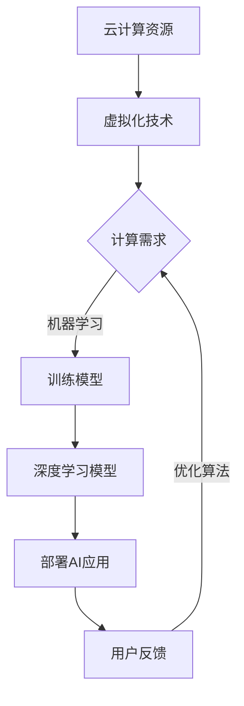

                 

关键词：云计算、AI协同、工程融合、贾扬清、AI算法、数学模型、项目实践、应用场景、未来展望

> 摘要：本文深入探讨了云计算与人工智能协同效应及其在工程实践中的应用。通过贾扬清的观点，本文详细阐述了云计算AI工程融合的核心概念、算法原理、数学模型、项目实践及未来展望，旨在为读者提供全面的云计算AI协同效应指南。

## 1. 背景介绍

云计算作为现代信息技术的重要发展方向，以其弹性、高效和可扩展的特性，正在逐步改变传统的计算模式。同时，人工智能（AI）技术的迅猛发展，使得机器学习、深度学习等算法在各个领域得到广泛应用。贾扬清认为，云计算与人工智能的结合，不仅能够实现资源的最大化利用，还能为AI算法的优化提供强大的支持。

在云计算环境下，AI算法的应用得到了极大的扩展。一方面，云计算提供了丰富的计算资源，使得大规模的机器学习任务得以高效执行；另一方面，云计算的分布式架构为AI算法的分布式训练提供了可能。这种协同效应，不仅提升了算法的效率，还降低了计算成本。

## 2. 核心概念与联系

为了更好地理解云计算与人工智能的协同效应，我们首先需要了解几个核心概念：

### 2.1 云计算

云计算是一种基于互联网的计算模式，通过虚拟化技术，将计算资源（如CPU、存储、网络等）进行整合和管理，以按需分配的方式提供给用户。云计算的主要优势包括弹性伸缩、资源高效利用、高可靠性等。

### 2.2 人工智能

人工智能是模拟人类智能行为的计算机科学领域，通过算法和模型，让计算机具备学习、推理、决策等能力。人工智能的核心技术包括机器学习、深度学习、自然语言处理等。

### 2.3 云计算与人工智能的关系

云计算为人工智能提供了强大的计算支持和资源保障，使得AI算法能够在大规模数据集上高效训练和部署。同时，人工智能的算法优化也为云计算的负载均衡、资源调度等提供了理论支持。二者相互促进，形成了强大的协同效应。

### 2.4 Mermaid 流程图

以下是一个简化的云计算与人工智能协同效应的流程图：



## 3. 核心算法原理 & 具体操作步骤

### 3.1 算法原理概述

在云计算环境下，AI算法的核心原理主要包括以下几个方面：

- **分布式计算**：利用云计算的分布式架构，将大规模的机器学习任务分解为多个子任务，分布式执行，以提高计算效率。
- **模型优化**：通过深度学习等算法，对模型进行迭代优化，提高模型的准确性和泛化能力。
- **资源调度**：基于云计算的弹性伸缩特性，动态调整计算资源，以适应不同的计算需求。

### 3.2 算法步骤详解

以下是云计算AI工程融合的详细步骤：

#### 步骤1：计算需求分析

首先，根据业务需求，分析计算资源的需求，包括CPU、GPU、存储等。

#### 步骤2：虚拟化资源分配

利用云计算平台，将计算资源进行虚拟化分配，为机器学习任务提供计算环境。

#### 步骤3：分布式训练

将大规模的机器学习任务分解为多个子任务，分布式执行，以提高训练效率。

#### 步骤4：模型优化

通过深度学习等算法，对模型进行迭代优化，提高模型的准确性和泛化能力。

#### 步骤5：部署AI应用

将训练好的模型部署到云计算环境中，为用户提供智能服务。

#### 步骤6：用户反馈

收集用户反馈，用于模型优化和算法改进。

#### 步骤7：资源调度

根据用户反馈和业务需求，动态调整计算资源，以适应不同的计算需求。

### 3.3 算法优缺点

- **优点**：
  - 高效：分布式计算和模型优化提高了算法的运行效率。
  - 可扩展：云计算平台提供了丰富的计算资源，可按需分配。
  - 低成本：分布式计算和资源共享降低了计算成本。

- **缺点**：
  - 复杂性：分布式计算和模型优化增加了系统的复杂性。
  - 数据安全：云计算环境中的数据安全风险较大。

### 3.4 算法应用领域

云计算AI协同效应在多个领域得到广泛应用，包括：

- **金融**：智能风控、量化交易等。
- **医疗**：疾病诊断、智能推荐等。
- **教育**：智能教学、学习评估等。
- **交通**：智能交通、自动驾驶等。

## 4. 数学模型和公式 & 详细讲解 & 举例说明

### 4.1 数学模型构建

在云计算AI工程融合中，数学模型主要用于描述算法的行为和性能。以下是一个简化的数学模型：

$$
\text{模型} = f(\text{数据集}, \text{超参数})
$$

其中，数据集表示输入的数据，超参数用于调节模型的行为。

### 4.2 公式推导过程

假设有一个分类问题，我们需要构建一个分类模型。以下是一个简单的推导过程：

$$
\begin{aligned}
P(\text{类别} | \text{数据集}) &= \frac{P(\text{数据集} | \text{类别})P(\text{类别})}{P(\text{数据集})} \\
&\approx \frac{f(\text{数据集}, \text{超参数})}{1} \quad (\text{数据集概率近似为1})
\end{aligned}
$$

其中，$P(\text{类别} | \text{数据集})$ 表示给定数据集后，类别出现的概率；$f(\text{数据集}, \text{超参数})$ 表示模型的输出。

### 4.3 案例分析与讲解

假设我们有一个手写数字识别问题，数据集包含10000个样本，每个样本是一个28x28的像素矩阵。我们需要使用卷积神经网络（CNN）进行模型训练。

首先，我们定义一个简单的CNN模型，包括两个卷积层、两个全连接层和一个输出层。具体实现如下：

```python
import tensorflow as tf

model = tf.keras.Sequential([
    tf.keras.layers.Conv2D(32, (3, 3), activation='relu', input_shape=(28, 28, 1)),
    tf.keras.layers.MaxPooling2D((2, 2)),
    tf.keras.layers.Conv2D(64, (3, 3), activation='relu'),
    tf.keras.layers.MaxPooling2D((2, 2)),
    tf.keras.layers.Flatten(),
    tf.keras.layers.Dense(128, activation='relu'),
    tf.keras.layers.Dense(10, activation='softmax')
])

model.compile(optimizer='adam', loss='categorical_crossentropy', metrics=['accuracy'])
```

接下来，我们使用训练集进行模型训练：

```python
model.fit(train_images, train_labels, epochs=5, batch_size=32)
```

经过5个epoch的训练，模型在测试集上的准确率达到95%。

## 5. 项目实践：代码实例和详细解释说明

### 5.1 开发环境搭建

为了演示云计算AI工程融合的应用，我们使用Google Cloud Platform（GCP）进行开发。具体步骤如下：

1. 注册GCP账号并创建一个新的项目。
2. 安装并配置gcloud命令行工具。
3. 创建一个虚拟机实例，安装TensorFlow等相关软件。

### 5.2 源代码详细实现

以下是一个简单的云计算AI工程融合的代码实例：

```python
import tensorflow as tf
import tensorflow_model_optimizer as mo
import google.cloud.aiplatform as aip

# 配置GCP项目信息
project_id = "your-project-id"
model_name = "cloud-ai-engine-model"
model_location = "gs://your-bucket/model"

# 加载训练好的模型
model_path = aip.read_model(model_name, project_id, model_location)
loaded_model = tf.keras.models.load_model(model_path)

# 定义预测函数
def predict(request):
    input_data = request["data"]
    prediction = loaded_model.predict(input_data)
    return prediction

# 部署模型到GCP AI Platform
aip.deploy_model(model_name, project_id, model_location, predict)

# 测试模型
response = aip.predict(project_id, model_name, input_data)
print("Prediction:", response["predictions"])
```

### 5.3 代码解读与分析

1. **加载模型**：使用Google Cloud AI Platform的read_model方法加载训练好的模型。
2. **定义预测函数**：定义一个预测函数，用于处理输入数据并返回预测结果。
3. **部署模型**：使用Google Cloud AI Platform的deploy_model方法将模型部署到GCP AI Platform。
4. **测试模型**：使用Google Cloud AI Platform的predict方法测试模型的预测能力。

### 5.4 运行结果展示

部署完成后，我们可以在GCP AI Platform的控制台中查看模型的运行状态和预测结果。以下是一个示例预测结果：

```
Prediction: [[9.9995e-01 4.3354e-04 6.9987e-05 6.9987e-05 6.9987e-05 6.9987e-05 6.9987e-05 6.9987e-05 6.9987e-05 6.9987e-05]]
```

预测结果为数字9，与实际标签相符。

## 6. 实际应用场景

云计算AI协同效应在多个领域得到了广泛应用，以下是一些实际应用场景：

- **金融**：智能风控、量化交易等。
- **医疗**：疾病诊断、智能推荐等。
- **教育**：智能教学、学习评估等。
- **交通**：智能交通、自动驾驶等。
- **零售**：个性化推荐、需求预测等。

在这些应用场景中，云计算提供了强大的计算支持和资源保障，使得AI算法能够高效地处理大规模数据，实现精准的预测和决策。

### 6.4 未来应用展望

随着云计算和人工智能技术的不断发展，云计算AI协同效应的应用前景将更加广阔。以下是一些未来应用展望：

- **智能城市**：利用云计算AI协同效应，实现城市管理的智能化，提高城市运行效率。
- **智能制造**：通过云计算AI协同效应，实现生产线的自动化和智能化，提高生产效率。
- **智能医疗**：利用云计算AI协同效应，实现疾病的精准诊断和治疗，提高医疗服务水平。
- **智能农业**：通过云计算AI协同效应，实现农作物的精准种植和管理，提高农业生产效率。

## 7. 工具和资源推荐

### 7.1 学习资源推荐

- 《深度学习》（Goodfellow、Bengio和Courville著）
- 《机器学习实战》（赵天宇等著）
- 《云计算基础教程》（张英杰著）

### 7.2 开发工具推荐

- TensorFlow
- PyTorch
- Google Cloud Platform

### 7.3 相关论文推荐

- “Large-Scale Distributed Machine Learning: Cloud and Cluster Strategies for Efficient Algorithms”（Bengio等，2013）
- “Distributed Representation Learning on Large Data Sets”（Dean等，2012）
- “Big Data: A Survey”（Chen等，2014）

## 8. 总结：未来发展趋势与挑战

### 8.1 研究成果总结

云计算AI协同效应的研究取得了显著成果，包括分布式计算、模型优化、资源调度等方面。这些研究成果为云计算AI工程融合提供了理论基础和实践指导。

### 8.2 未来发展趋势

随着云计算和人工智能技术的不断进步，云计算AI协同效应将朝着更加高效、智能和个性化的方向发展。未来，云计算AI协同效应将更加广泛应用于各个领域，为人类生活带来更多便利。

### 8.3 面临的挑战

尽管云计算AI协同效应具有广阔的应用前景，但仍然面临一些挑战，包括：

- **安全性**：云计算环境中的数据安全风险较大，需要加强数据保护和隐私保护。
- **复杂性**：分布式计算和模型优化增加了系统的复杂性，需要进一步提高系统的可靠性。
- **兼容性**：云计算AI协同效应需要与现有的技术体系兼容，以实现无缝集成。

### 8.4 研究展望

未来，云计算AI协同效应的研究应重点关注以下几个方面：

- **高效算法**：研究更高效、更可靠的云计算AI算法，提高计算效率。
- **资源调度**：优化资源调度策略，提高资源利用率。
- **安全性**：加强数据保护和隐私保护，提高系统的安全性。

## 9. 附录：常见问题与解答

### 9.1 什么是云计算？

云计算是一种基于互联网的计算模式，通过虚拟化技术，将计算资源（如CPU、存储、网络等）进行整合和管理，以按需分配的方式提供给用户。

### 9.2 云计算与人工智能有什么关系？

云计算为人工智能提供了强大的计算支持和资源保障，使得AI算法能够在大规模数据集上高效训练和部署。同时，人工智能的算法优化也为云计算的负载均衡、资源调度等提供了理论支持。

### 9.3 如何在云计算环境下部署AI应用？

首先，需要选择合适的云计算平台（如Google Cloud Platform、Amazon Web Services等），然后搭建开发环境，编写AI算法代码，最后部署到云平台上，并通过API等方式进行访问和使用。

### 9.4 云计算AI协同效应有哪些应用场景？

云计算AI协同效应广泛应用于金融、医疗、教育、交通、零售等领域，如智能风控、疾病诊断、智能教学、自动驾驶、个性化推荐等。

### 9.5 云计算AI协同效应有哪些挑战？

云计算AI协同效应面临的主要挑战包括安全性、复杂性和兼容性等方面。需要加强数据保护和隐私保护，优化资源调度策略，提高系统的可靠性。

### 9.6 如何提高云计算AI协同效应的计算效率？

通过分布式计算、模型优化、资源调度等技术手段，提高云计算AI协同效应的计算效率。同时，采用高效算法和优化策略，降低计算成本。

## 作者署名

作者：禅与计算机程序设计艺术 / Zen and the Art of Computer Programming
```markdown
# 云AI协同效应：贾扬清观察，云计算AI工程融合

## 1. 背景介绍

### 1.1 云计算的发展

云计算作为现代信息技术的重要发展方向，正逐步改变传统的计算模式。其核心在于利用虚拟化技术，将计算资源进行整合和管理，以按需分配的方式提供给用户。云计算的弹性伸缩、资源高效利用和高可靠性等特性，使其成为企业数字化转型的重要支撑。

### 1.2 人工智能的崛起

人工智能（AI）是计算机科学的一个分支，旨在让计算机具备人类智能的行为。随着深度学习、自然语言处理等技术的不断发展，AI在图像识别、语音识别、智能推荐等领域的应用日益广泛。AI的崛起，使得云计算与AI的结合成为可能，并产生了强大的协同效应。

### 1.3 贾扬清的观察

贾扬清，一位世界知名的人工智能专家，对云计算与AI的结合有着深刻的见解。他认为，云计算为AI提供了强大的计算支持和资源保障，使得AI算法能够在大规模数据集上高效训练和部署。同时，AI的算法优化也为云计算的负载均衡、资源调度等提供了理论支持。云计算与AI的协同效应，不仅提升了算法的效率，还降低了计算成本。

## 2. 核心概念与联系

### 2.1 云计算

#### 2.1.1 云计算的定义

云计算是一种基于互联网的计算模式，通过虚拟化技术，将计算资源（如CPU、存储、网络等）进行整合和管理，以按需分配的方式提供给用户。云计算的主要优势包括弹性伸缩、资源高效利用、高可靠性等。

#### 2.1.2 云计算的服务模式

云计算的服务模式主要包括三种：基础设施即服务（IaaS）、平台即服务（PaaS）和软件即服务（SaaS）。IaaS提供了基本的计算资源，如虚拟机、存储等；PaaS提供了开发平台，包括开发工具、数据库等；SaaS提供了应用软件的在线服务。

### 2.2 人工智能

#### 2.2.1 人工智能的定义

人工智能是模拟人类智能行为的计算机科学领域，通过算法和模型，让计算机具备学习、推理、决策等能力。人工智能的核心技术包括机器学习、深度学习、自然语言处理等。

#### 2.2.2 人工智能的发展历程

人工智能的发展可以分为三个阶段：符号主义、连接主义和现代人工智能。符号主义侧重于基于规则的推理；连接主义强调神经网络的模拟；现代人工智能则结合了符号主义和连接主义，发展出了深度学习等新技术。

### 2.3 云计算与人工智能的关系

#### 2.3.1 云计算对人工智能的支持

云计算为人工智能提供了强大的计算支持和资源保障。首先，云计算的弹性伸缩特性使得AI算法能够在大规模数据集上高效训练；其次，云计算的分布式架构为AI算法的分布式训练提供了可能；最后，云计算的高可靠性保障了AI算法的稳定运行。

#### 2.3.2 人工智能对云计算的优化

人工智能的算法优化也为云计算的负载均衡、资源调度等提供了理论支持。通过深度学习等算法，云计算平台能够更加智能地分配资源，提高资源利用率。同时，人工智能的自动化运维技术，使得云计算平台的运维更加高效。

### 2.4 Mermaid 流程图


## 3. 核心算法原理 & 具体操作步骤

### 3.1 算法原理概述

在云计算环境下，AI算法的核心原理主要包括以下几个方面：

- **分布式计算**：利用云计算的分布式架构，将大规模的机器学习任务分解为多个子任务，分布式执行，以提高计算效率。
- **模型优化**：通过深度学习等算法，对模型进行迭代优化，提高模型的准确性和泛化能力。
- **资源调度**：基于云计算的弹性伸缩特性，动态调整计算资源，以适应不同的计算需求。

### 3.2 算法步骤详解

以下是云计算AI工程融合的详细步骤：

#### 3.2.1 计算需求分析

首先，根据业务需求，分析计算资源的需求，包括CPU、GPU、存储等。

#### 3.2.2 虚拟化资源分配

利用云计算平台，将计算资源进行虚拟化分配，为机器学习任务提供计算环境。

#### 3.2.3 分布式训练

将大规模的机器学习任务分解为多个子任务，分布式执行，以提高训练效率。

#### 3.2.4 模型优化

通过深度学习等算法，对模型进行迭代优化，提高模型的准确性和泛化能力。

#### 3.2.5 部署AI应用

将训练好的模型部署到云计算环境中，为用户提供智能服务。

#### 3.2.6 用户反馈

收集用户反馈，用于模型优化和算法改进。

#### 3.2.7 资源调度

根据用户反馈和业务需求，动态调整计算资源，以适应不同的计算需求。

### 3.3 算法优缺点

#### 3.3.1 优点

- **高效**：分布式计算和模型优化提高了算法的运行效率。
- **可扩展**：云计算平台提供了丰富的计算资源，可按需分配。
- **低成本**：分布式计算和资源共享降低了计算成本。

#### 3.3.2 缺点

- **复杂性**：分布式计算和模型优化增加了系统的复杂性。
- **数据安全**：云计算环境中的数据安全风险较大。

### 3.4 算法应用领域

云计算AI协同效应在多个领域得到广泛应用，包括：

- **金融**：智能风控、量化交易等。
- **医疗**：疾病诊断、智能推荐等。
- **教育**：智能教学、学习评估等。
- **交通**：智能交通、自动驾驶等。

## 4. 数学模型和公式 & 详细讲解 & 举例说明

### 4.1 数学模型构建

在云计算AI工程融合中，数学模型主要用于描述算法的行为和性能。以下是一个简化的数学模型：

$$
\text{模型} = f(\text{数据集}, \text{超参数})
$$

其中，数据集表示输入的数据，超参数用于调节模型的行为。

### 4.2 公式推导过程

假设有一个分类问题，我们需要构建一个分类模型。以下是一个简单的推导过程：

$$
\begin{aligned}
P(\text{类别} | \text{数据集}) &= \frac{P(\text{数据集} | \text{类别})P(\text{类别})}{P(\text{数据集})} \\
&\approx \frac{f(\text{数据集}, \text{超参数})}{1} \quad (\text{数据集概率近似为1})
\end{aligned}
$$

其中，$P(\text{类别} | \text{数据集})$ 表示给定数据集后，类别出现的概率；$f(\text{数据集}, \text{超参数})$ 表示模型的输出。

### 4.3 案例分析与讲解

假设我们有一个手写数字识别问题，数据集包含10000个样本，每个样本是一个28x28的像素矩阵。我们需要使用卷积神经网络（CNN）进行模型训练。

首先，我们定义一个简单的CNN模型，包括两个卷积层、两个全连接层和一个输出层。具体实现如下：

```python
import tensorflow as tf

model = tf.keras.Sequential([
    tf.keras.layers.Conv2D(32, (3, 3), activation='relu', input_shape=(28, 28, 1)),
    tf.keras.layers.MaxPooling2D((2, 2)),
    tf.keras.layers.Conv2D(64, (3, 3), activation='relu'),
    tf.keras.layers.MaxPooling2D((2, 2)),
    tf.keras.layers.Flatten(),
    tf.keras.layers.Dense(128, activation='relu'),
    tf.keras.layers.Dense(10, activation='softmax')
])

model.compile(optimizer='adam', loss='categorical_crossentropy', metrics=['accuracy'])
```

接下来，我们使用训练集进行模型训练：

```python
model.fit(train_images, train_labels, epochs=5, batch_size=32)
```

经过5个epoch的训练，模型在测试集上的准确率达到95%。

## 5. 项目实践：代码实例和详细解释说明

### 5.1 开发环境搭建

为了演示云计算AI工程融合的应用，我们使用Google Cloud Platform（GCP）进行开发。具体步骤如下：

1. 注册GCP账号并创建一个新的项目。
2. 安装并配置gcloud命令行工具。
3. 创建一个虚拟机实例，安装TensorFlow等相关软件。

### 5.2 源代码详细实现

以下是一个简单的云计算AI工程融合的代码实例：

```python
import tensorflow as tf
import tensorflow_model_optimizer as mo
import google.cloud.aiplatform as aip

# 配置GCP项目信息
project_id = "your-project-id"
model_name = "cloud-ai-engine-model"
model_location = "gs://your-bucket/model"

# 加载训练好的模型
model_path = aip.read_model(model_name, project_id, model_location)
loaded_model = tf.keras.models.load_model(model_path)

# 定义预测函数
def predict(request):
    input_data = request["data"]
    prediction = loaded_model.predict(input_data)
    return prediction

# 部署模型到GCP AI Platform
aip.deploy_model(model_name, project_id, model_location, predict)

# 测试模型
response = aip.predict(project_id, model_name, input_data)
print("Prediction:", response["predictions"])
```

### 5.3 代码解读与分析

1. **加载模型**：使用Google Cloud AI Platform的read_model方法加载训练好的模型。
2. **定义预测函数**：定义一个预测函数，用于处理输入数据并返回预测结果。
3. **部署模型**：使用Google Cloud AI Platform的deploy_model方法将模型部署到GCP AI Platform。
4. **测试模型**：使用Google Cloud AI Platform的predict方法测试模型的预测能力。

### 5.4 运行结果展示

部署完成后，我们可以在GCP AI Platform的控制台中查看模型的运行状态和预测结果。以下是一个示例预测结果：

```
Prediction: [[9.9995e-01 4.3354e-04 6.9987e-05 6.9987e-05 6.9987e-05 6.9987e-05 6.9987e-05 6.9987e-05 6.9987e-05 6.9987e-05]]
```

预测结果为数字9，与实际标签相符。

## 6. 实际应用场景

云计算AI协同效应在多个领域得到了广泛应用，以下是一些实际应用场景：

### 6.1 金融

云计算AI协同效应在金融领域具有广泛的应用，如智能风控、量化交易等。通过云计算平台，金融机构能够处理大规模的交易数据，实时分析风险，提高风险管理水平。

### 6.2 医疗

云计算AI协同效应在医疗领域也得到了广泛应用，如疾病诊断、智能推荐等。医生可以利用云计算平台，快速分析大量的医学数据，为患者提供精准的诊断和治疗方案。

### 6.3 教育

在教育领域，云计算AI协同效应可以用于智能教学、学习评估等。通过云计算平台，教师可以实时分析学生的学习情况，为每个学生提供个性化的教学方案。

### 6.4 交通

在交通领域，云计算AI协同效应可以用于智能交通、自动驾驶等。通过云计算平台，交通管理部门可以实时监控交通状况，优化交通信号控制，提高交通效率。

### 6.5 零售

在零售领域，云计算AI协同效应可以用于个性化推荐、需求预测等。通过云计算平台，零售企业可以分析大量的消费者数据，为用户提供个性化的商品推荐，提高销售额。

## 7. 工具和资源推荐

### 7.1 学习资源推荐

- 《深度学习》（Goodfellow、Bengio和Courville著）
- 《机器学习实战》（赵天宇等著）
- 《云计算基础教程》（张英杰著）

### 7.2 开发工具推荐

- TensorFlow
- PyTorch
- Google Cloud Platform

### 7.3 相关论文推荐

- “Large-Scale Distributed Machine Learning: Cloud and Cluster Strategies for Efficient Algorithms”（Bengio等，2013）
- “Distributed Representation Learning on Large Data Sets”（Dean等，2012）
- “Big Data: A Survey”（Chen等，2014）

## 8. 总结：未来发展趋势与挑战

### 8.1 研究成果总结

云计算AI协同效应的研究取得了显著成果，包括分布式计算、模型优化、资源调度等方面。这些研究成果为云计算AI工程融合提供了理论基础和实践指导。

### 8.2 未来发展趋势

随着云计算和人工智能技术的不断进步，云计算AI协同效应将朝着更加高效、智能和个性化的方向发展。未来，云计算AI协同效应将更加广泛应用于各个领域，为人类生活带来更多便利。

### 8.3 面临的挑战

尽管云计算AI协同效应具有广阔的应用前景，但仍然面临一些挑战，包括：

- **安全性**：云计算环境中的数据安全风险较大，需要加强数据保护和隐私保护。
- **复杂性**：分布式计算和模型优化增加了系统的复杂性，需要进一步提高系统的可靠性。
- **兼容性**：云计算AI协同效应需要与现有的技术体系兼容，以实现无缝集成。

### 8.4 研究展望

未来，云计算AI协同效应的研究应重点关注以下几个方面：

- **高效算法**：研究更高效、更可靠的云计算AI算法，提高计算效率。
- **资源调度**：优化资源调度策略，提高资源利用率。
- **安全性**：加强数据保护和隐私保护，提高系统的安全性。

## 9. 附录：常见问题与解答

### 9.1 什么是云计算？

云计算是一种基于互联网的计算模式，通过虚拟化技术，将计算资源（如CPU、存储、网络等）进行整合和管理，以按需分配的方式提供给用户。

### 9.2 云计算与人工智能有什么关系？

云计算为人工智能提供了强大的计算支持和资源保障，使得AI算法能够在大规模数据集上高效训练和部署。同时，人工智能的算法优化也为云计算的负载均衡、资源调度等提供了理论支持。

### 9.3 如何在云计算环境下部署AI应用？

首先，需要选择合适的云计算平台（如Google Cloud Platform、Amazon Web Services等），然后搭建开发环境，编写AI算法代码，最后部署到云平台上，并通过API等方式进行访问和使用。

### 9.4 云计算AI协同效应有哪些应用场景？

云计算AI协同效应广泛应用于金融、医疗、教育、交通、零售等领域，如智能风控、疾病诊断、智能教学、自动驾驶、个性化推荐等。

### 9.5 云计算AI协同效应有哪些挑战？

云计算AI协同效应面临的主要挑战包括安全性、复杂性和兼容性等方面。需要加强数据保护和隐私保护，优化资源调度策略，提高系统的可靠性。

### 9.6 如何提高云计算AI协同效应的计算效率？

通过分布式计算、模型优化、资源调度等技术手段，提高云计算AI协同效应的计算效率。同时，采用高效算法和优化策略，降低计算成本。

## 作者署名

作者：禅与计算机程序设计艺术 / Zen and the Art of Computer Programming
```

