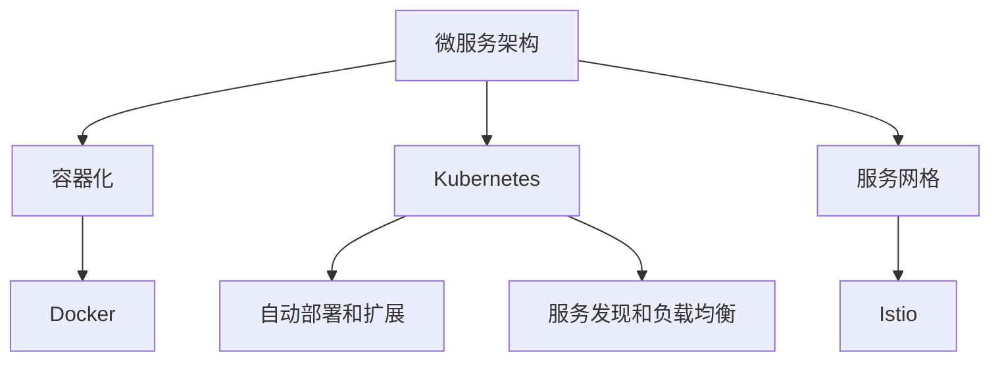

                 

关键词：云原生架构、微服务、容器化、Kubernetes、可扩展性、云端应用、DevOps、服务网格

> 摘要：本文将深入探讨云原生架构的设计原理和实践方法，通过分析其核心概念和架构模式，揭示如何利用云原生技术构建可扩展的云端应用。我们将讨论微服务架构、容器化、Kubernetes等关键组件，并分享实际项目中的经验教训，帮助读者全面理解云原生架构的设计和实践。

## 1. 背景介绍

云原生（Cloud Native）是一种针对现代云计算环境的软件开发和运营方法。它强调利用容器、服务网格、微服务、不可变基础设施和声明式API等技术，使应用程序能够更加敏捷、可扩展和可靠地运行在云平台上。随着云计算的普及，越来越多的企业和组织开始采用云原生架构来构建和部署应用程序。

### 1.1 云原生与云计算

云计算是一种通过互联网提供计算资源的服务模式，它允许用户按需访问和使用计算资源，如虚拟机、存储和网络。而云原生则是云计算的进一步发展，它强调利用云计算提供的弹性、可扩展性和分布式特性，构建更加高效、灵活和可靠的软件系统。

### 1.2 云原生架构的兴起

云原生架构的兴起源于以下几个因素：

- **敏捷开发和持续交付**：云原生架构支持敏捷开发和持续交付，使开发团队能够快速响应市场需求，提高软件交付速度和质量。
- **微服务架构**：微服务架构使应用程序可以被分解为独立的、可重用的服务，提高了系统的可维护性和可扩展性。
- **容器化**：容器化技术如Docker，使应用程序可以在不同的环境中保持一致，简化了部署和运维过程。
- **自动化和DevOps**：自动化和DevOps实践使团队能够更快地部署和扩展应用程序，提高系统的可靠性和效率。

## 2. 核心概念与联系

### 2.1 微服务架构

微服务架构是一种将应用程序分解为小型、独立和可重用的服务的方法。每个服务负责一个特定的业务功能，可以独立部署和扩展。微服务架构具有以下优点：

- **可扩展性**：服务可以独立扩展，提高系统的总体性能。
- **可维护性**：服务可以独立维护，降低系统的复杂性。
- **可部署性**：服务可以独立部署，提高系统的可靠性和可恢复性。

### 2.2 容器化

容器化是一种将应用程序及其依赖项打包到轻量级、可移植的容器中的技术。容器化使应用程序可以在不同的环境中保持一致，简化了部署和运维过程。容器化技术如Docker，已成为云原生架构的核心组件。

### 2.3 Kubernetes

Kubernetes是一种开源的容器编排平台，用于自动化容器的部署、扩展和管理。Kubernetes具有以下特点：

- **自动部署和扩展**：Kubernetes可以自动部署和扩展应用程序，提高系统的可用性和可靠性。
- **服务发现和负载均衡**：Kubernetes可以自动发现服务并实现负载均衡，提高系统的性能。
- **存储和网络**：Kubernetes提供了丰富的存储和网络功能，使团队能够更灵活地管理和配置应用程序。

### 2.4 服务网格

服务网格是一种用于管理服务间通信的分布式系统。服务网格可以使服务之间进行安全的、可靠的和高效的通信。服务网格技术如Istio，已成为云原生架构中的重要组件。

### 2.5 Mermaid 流程图



## 3. 核心算法原理 & 具体操作步骤

### 3.1 算法原理概述

云原生架构的核心算法原理主要涉及以下几个方面：

- **容器编排算法**：用于优化容器的部署和调度，提高系统的性能。
- **服务发现和负载均衡算法**：用于自动发现服务并实现负载均衡，提高系统的性能。
- **安全性算法**：用于保护容器和服务的安全性，防止恶意攻击。

### 3.2 算法步骤详解

#### 3.2.1 容器编排算法

1. **资源评估**：评估集群中可用的资源，如CPU、内存和存储等。
2. **容器调度**：根据资源评估结果，将容器调度到合适的节点上。
3. **容器部署**：将容器部署到目标节点上，并启动容器。
4. **容器监控**：监控容器的运行状态，如CPU使用率、内存使用率和网络流量等。
5. **容器恢复**：在容器故障时，自动重启或替换容器。

#### 3.2.2 服务发现和负载均衡算法

1. **服务注册**：将服务注册到服务发现系统中，以便其他服务可以找到并使用它。
2. **服务发现**：服务发现系统根据服务注册信息，为服务提供IP地址和端口号。
3. **负载均衡**：负载均衡器根据服务请求的流量，将请求分发到不同的服务实例上。
4. **健康检查**：定期对服务实例进行健康检查，确保服务正常运行。

#### 3.2.3 安全性算法

1. **身份验证和授权**：使用身份验证和授权机制，确保只有授权用户可以访问服务。
2. **加密通信**：使用加密协议，如TLS，确保服务间通信的安全性。
3. **入侵检测**：使用入侵检测系统，监控服务间的通信，并阻止恶意攻击。

### 3.3 算法优缺点

#### 3.3.1 容器编排算法

- **优点**：提高系统的性能和可扩展性，降低运维成本。
- **缺点**：需要较复杂的部署和管理流程。

#### 3.3.2 服务发现和负载均衡算法

- **优点**：提高系统的可用性和可靠性。
- **缺点**：需要较复杂的配置和管理。

#### 3.3.3 安全性算法

- **优点**：提高系统的安全性，防止恶意攻击。
- **缺点**：可能增加系统的复杂性和运维成本。

### 3.4 算法应用领域

- **容器编排算法**：适用于大规模分布式系统，如云计算平台和容器集群。
- **服务发现和负载均衡算法**：适用于需要高可用性和可靠性的服务。
- **安全性算法**：适用于需要保护服务安全的场景。

## 4. 数学模型和公式 & 详细讲解 & 举例说明

### 4.1 数学模型构建

云原生架构中的数学模型主要涉及以下几个方面：

- **资源评估模型**：用于评估集群中可用的资源。
- **容器调度模型**：用于优化容器的部署和调度。
- **服务发现模型**：用于实现服务发现和负载均衡。
- **安全性模型**：用于保护容器和服务的安全性。

### 4.2 公式推导过程

#### 4.2.1 资源评估模型

资源评估模型可以使用以下公式：

$$
\text{可用资源} = \text{总资源} - \text{已占用资源}
$$

#### 4.2.2 容器调度模型

容器调度模型可以使用以下公式：

$$
\text{调度优先级} = \frac{\text{容器权重}}{\text{容器运行时间}}
$$

#### 4.2.3 服务发现模型

服务发现模型可以使用以下公式：

$$
\text{服务地址} = \text{服务注册表} + \text{服务名称}
$$

#### 4.2.4 安全性模型

安全性模型可以使用以下公式：

$$
\text{安全性评分} = \text{身份验证得分} + \text{加密得分} + \text{入侵检测得分}
$$

### 4.3 案例分析与讲解

#### 4.3.1 资源评估模型

假设一个集群中有10台虚拟机，每台虚拟机有4个CPU和8GB内存。当前已有5台虚拟机被占用，每台虚拟机占用了2个CPU和4GB内存。我们可以使用以下公式计算可用资源：

$$
\text{可用资源} = (10 \times 4 \text{ CPU} + 10 \times 8 \text{ GB内存}) - (5 \times 2 \text{ CPU} + 5 \times 4 \text{ GB内存})
$$

$$
\text{可用资源} = (40 \text{ CPU} + 80 \text{ GB内存}) - (10 \text{ CPU} + 20 \text{ GB内存})
$$

$$
\text{可用资源} = 30 \text{ CPU} + 60 \text{ GB内存}
$$

#### 4.3.2 容器调度模型

假设有5个容器需要部署到该集群中，每个容器的权重分别为1、2、3、4和5。当前5个容器的运行时间分别为1、2、3、4和5小时。我们可以使用以下公式计算调度优先级：

$$
\text{调度优先级} = \frac{\text{容器权重}}{\text{容器运行时间}}
$$

$$
\text{调度优先级}_{1} = \frac{1}{1} = 1
$$

$$
\text{调度优先级}_{2} = \frac{2}{2} = 1
$$

$$
\text{调度优先级}_{3} = \frac{3}{3} = 1
$$

$$
\text{调度优先级}_{4} = \frac{4}{4} = 1
$$

$$
\text{调度优先级}_{5} = \frac{5}{5} = 1
$$

由于所有容器的调度优先级相等，我们可以按照容器的顺序进行部署。

#### 4.3.3 服务发现模型

假设服务注册表中有5个服务，分别为A、B、C、D和E。每个服务的名称分别为a、b、c、d和e。我们可以使用以下公式计算服务地址：

$$
\text{服务地址}_{A} = \text{服务注册表} + \text{服务名称}_a
$$

$$
\text{服务地址}_{B} = \text{服务注册表} + \text{服务名称}_b
$$

$$
\text{服务地址}_{C} = \text{服务注册表} + \text{服务名称}_c
$$

$$
\text{服务地址}_{D} = \text{服务注册表} + \text{服务名称}_d
$$

$$
\text{服务地址}_{E} = \text{服务注册表} + \text{服务名称}_e
$$

#### 4.3.4 安全性模型

假设有一个服务需要评估安全性评分。该服务的身份验证得分为8，加密得分为6，入侵检测得分为4。我们可以使用以下公式计算安全性评分：

$$
\text{安全性评分} = \text{身份验证得分} + \text{加密得分} + \text{入侵检测得分}
$$

$$
\text{安全性评分} = 8 + 6 + 4
$$

$$
\text{安全性评分} = 18
$$

## 5. 项目实践：代码实例和详细解释说明

### 5.1 开发环境搭建

在本节中，我们将介绍如何搭建一个用于演示云原生架构的示例项目开发环境。以下步骤将涵盖配置虚拟机、安装必要的软件以及初始化Kubernetes集群。

#### 5.1.1 配置虚拟机

1. **创建虚拟机**：在虚拟机管理工具中创建一个具有至少4GB内存和20GB存储的虚拟机。
2. **安装操作系统**：选择一个适合的Linux发行版，例如Ubuntu 20.04，并安装到虚拟机中。
3. **配置网络**：确保虚拟机可以访问互联网，并配置静态IP地址以保持网络连接的稳定性。

#### 5.1.2 安装Docker

1. **更新系统包列表**：
    ```bash
    sudo apt-get update
    sudo apt-get upgrade
    ```
2. **安装Docker**：
    ```bash
    sudo apt-get install docker.io
    ```
3. **启动并使Docker服务开机自启**：
    ```bash
    sudo systemctl start docker
    sudo systemctl enable docker
    ```

#### 5.1.3 安装Kubernetes

1. **安装Kubeadm、Kubelet和Kubectl**：
    ```bash
    sudo apt-get install -y apt-transport-https ca-certificates curl
    curl -s https://packages.cloud.google.com/apt/doc/apt-key.gpg | sudo apt-key add -
    sudo add-apt-repository "deb https://apt.kubernetes.io/ kubernetes-xenial main"
    sudo apt-get update
    sudo apt-get install -y kubelet kubeadm kubectl
    ```
2. **配置Kubelet以允许自动启动**：
    ```bash
    sudo systemctl start kubelet
    sudo systemctl enable kubelet
    ```

#### 5.1.4 初始化Kubernetes集群

1. **初始化集群**：
    ```bash
    sudo kubeadm init --pod-network-cidr=10.244.0.0/16
    ```
2. **获取管理员令牌**：
    ```bash
    sudo grep 'TKN' /etc/kubernetes/admin.conf
    ```
3. **配置kubectl**：
    ```bash
    mkdir -p $HOME/.kube
    sudo cp -i /etc/kubernetes/admin.conf $HOME/.kube/config
    sudo chown $(id -u):$(id -g) $HOME/.kube/config
    ```

### 5.2 源代码详细实现

在本节中，我们将创建一个简单的微服务架构，包括一个前端服务、一个后端服务和一个数据库服务。我们将使用Docker和Kubernetes来部署和管理这些服务。

#### 5.2.1 创建Dockerfile

以下是一个简单的Dockerfile，用于构建前端服务的容器镜像。

```Dockerfile
# 使用官方的Nginx镜像作为基础镜像
FROM nginx:latest

# 将本地文件copy到容器的指定路径
COPY frontend /usr/share/nginx/html

# 设置容器启动时执行的命令
CMD ["nginx", "-g", "daemon off;"]
```

#### 5.2.2 编写Kubernetes配置文件

以下是一个简单的Kubernetes配置文件，用于部署前端服务。

```yaml
apiVersion: apps/v1
kind: Deployment
metadata:
  name: frontend-deployment
spec:
  replicas: 2
  selector:
    matchLabels:
      app: frontend
  template:
    metadata:
      labels:
        app: frontend
    spec:
      containers:
      - name: frontend
        image: your-frontend-image:latest
        ports:
        - containerPort: 80
```

#### 5.2.3 部署服务

1. **构建前端服务的容器镜像**：
    ```bash
    docker build -t your-frontend-image:latest ./frontend
    ```
2. **部署前端服务**：
    ```bash
    kubectl apply -f frontend-deployment.yaml
    ```

### 5.3 代码解读与分析

在本节中，我们将分析刚刚创建的前端服务部署文件。

#### 5.3.1 Deployment

Deployment是Kubernetes中的一个核心资源对象，用于管理容器的部署和扩展。它定义了容器的镜像、副本数量和选择器。

- ** replicas**: 指定需要运行的容器副本数量。
- ** selector**: 指定容器标签，用于匹配和管理容器。

#### 5.3.2 Pod

Deployment中的容器会被部署到Pod中。Pod是Kubernetes中的最小部署单元，包含一个或多个容器。

- ** containers**: 定义容器配置，包括镜像名称、容器端口等。

#### 5.3.3 Service

为了能够从外部访问部署的服务，我们需要创建一个Service资源。Service是一个抽象层，它将一组具有相同标签的Pod暴露为一个单一的IP地址或域名。

- ** type**: 指定服务类型，例如ClusterIP、NodePort或LoadBalancer。

### 5.4 运行结果展示

部署完成后，我们可以使用以下命令查看服务的运行状态：

```bash
kubectl get pods
kubectl get services
```

我们还可以通过Kubernetes集群中的任何节点访问前端服务：

```bash
curl <service-ip-address>:80
```

### 5.5 容器日志和监控

为了监控和管理容器，我们可以使用以下命令：

```bash
kubectl logs <pod-name>
kubectl top pods
```

## 6. 实际应用场景

### 6.1 客户关系管理（CRM）

客户关系管理（CRM）系统是一个典型的云原生架构应用场景。CRM系统需要处理大量用户请求和数据存储，同时要求高可用性和快速响应。通过采用云原生架构，CRM系统可以实现水平扩展，提高系统的性能和可靠性。

### 6.2 在线交易系统

在线交易系统是一个高度并发的系统，需要在短时间内处理大量交易请求。云原生架构提供的容器化和自动化部署功能，使得在线交易系统可以实现快速部署和弹性扩展，从而满足业务高峰期的需求。

### 6.3 物流管理

物流管理系统涉及到大量的数据采集、处理和传输。通过采用云原生架构，物流管理系统可以实现分布式部署，提高系统的可用性和数据可靠性。此外，容器化技术使得物流管理系统可以在不同的环境中无缝迁移，降低运维成本。

## 7. 未来应用展望

### 7.1 服务网格的发展

服务网格技术在未来将继续发展，提供更丰富的功能，如基于策略的流量管理和安全控制。随着5G和边缘计算的兴起，服务网格将在分布式系统架构中扮演更加重要的角色。

### 7.2 容器编排的优化

容器编排技术将在未来进一步优化，提高容器调度的效率和资源利用率。随着硬件性能的提升，容器编排算法将能够更好地利用计算资源，实现更高效的应用部署和扩展。

### 7.3 自动化与AI的融合

自动化和人工智能（AI）技术的融合将使得云原生架构更加智能和高效。通过AI算法，系统可以自动优化资源分配、负载均衡和安全策略，提高系统的整体性能和安全性。

## 8. 工具和资源推荐

### 8.1 学习资源推荐

- 《云原生应用架构》
- 《Kubernetes权威指南》
- 《容器化实践：从Docker到Kubernetes》

### 8.2 开发工具推荐

- Docker
- Kubernetes
- Helm
- Istio

### 8.3 相关论文推荐

- "Microservices: Designing for Scalability and Resiliency"
- "Docker: Lightweight Linux Containers for Developing, Shipping, and Running Applications"
- "Kubernetes: System Design and Architecture"

## 9. 总结：未来发展趋势与挑战

### 9.1 研究成果总结

云原生架构的研究成果主要集中在以下几个方面：

- **容器化技术的成熟**：容器化技术如Docker已经成为构建云原生应用的核心工具。
- **微服务架构的普及**：微服务架构使得应用程序更加模块化，提高了系统的可维护性和可扩展性。
- **自动化和DevOps的融合**：自动化和DevOps实践大大提高了应用程序的部署和运维效率。

### 9.2 未来发展趋势

未来，云原生架构将继续发展，主要趋势包括：

- **服务网格的普及**：服务网格技术将在分布式系统架构中发挥更加重要的作用。
- **容器编排的优化**：容器编排算法将进一步提高资源利用率和部署效率。
- **自动化与AI的融合**：自动化和人工智能技术将使得云原生架构更加智能和高效。

### 9.3 面临的挑战

云原生架构在发展过程中仍面临一些挑战：

- **安全性问题**：容器和微服务架构增加了系统的攻击面，需要加强安全性措施。
- **运维复杂度**：容器化技术和微服务架构增加了系统的复杂性，需要更高的运维技能。
- **兼容性问题**：不同云原生工具和平台的兼容性问题仍然存在，需要统一的标准和接口。

### 9.4 研究展望

未来的研究应重点关注以下几个方面：

- **安全性和隐私保护**：加强容器和微服务架构的安全性，提高隐私保护能力。
- **资源调度优化**：研究更高效的资源调度算法，提高系统性能和资源利用率。
- **跨云和混合云部署**：研究如何在不同云平台之间实现无缝部署和管理。

## 附录：常见问题与解答

### 1. 什么是云原生架构？

云原生架构是一种针对现代云计算环境的软件开发和运营方法。它强调利用容器、服务网格、微服务、不可变基础设施和声明式API等技术，构建更加高效、灵活和可靠的软件系统。

### 2. 云原生架构有哪些核心组件？

云原生架构的核心组件包括容器化技术（如Docker）、容器编排平台（如Kubernetes）、服务网格（如Istio）和微服务架构。

### 3. 如何构建云原生应用程序？

构建云原生应用程序通常涉及以下几个步骤：

1. 设计微服务架构，将应用程序分解为独立的、可重用的服务。
2. 使用容器化技术（如Docker）将应用程序及其依赖项打包到容器中。
3. 使用容器编排平台（如Kubernetes）部署和管理容器。
4. 使用服务网格（如Istio）管理服务间通信。

### 4. 云原生架构有哪些优点？

云原生架构的优点包括：

- **可扩展性**：服务可以独立扩展，提高系统的总体性能。
- **可维护性**：服务可以独立维护，降低系统的复杂性。
- **可部署性**：服务可以独立部署，提高系统的可靠性和可恢复性。
- **自动化**：自动化和DevOps实践简化了部署和运维过程。

### 5. 云原生架构有哪些挑战？

云原生架构的挑战包括：

- **安全性**：容器和微服务架构增加了系统的攻击面，需要加强安全性措施。
- **运维复杂度**：容器化技术和微服务架构增加了系统的复杂性，需要更高的运维技能。
- **兼容性问题**：不同云原生工具和平台的兼容性问题仍然存在，需要统一的标准和接口。


作者：禅与计算机程序设计艺术 / Zen and the Art of Computer Programming

