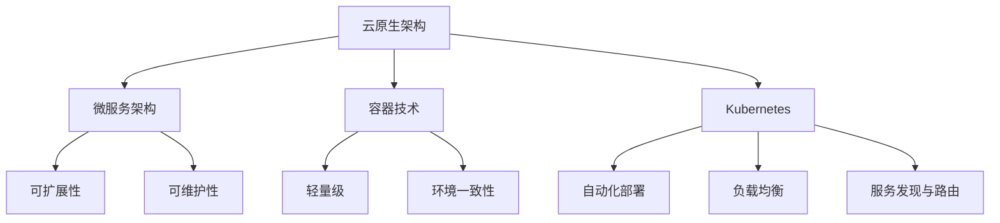

                 

关键词：云原生架构、微服务、容器、Kubernetes、分布式系统

摘要：本文旨在深入探讨云原生架构的核心概念、微服务与容器的密切关系，以及Kubernetes在云原生生态系统中的关键作用。通过分析这些技术如何共同推动了现代分布式系统的演进，文章将揭示云原生架构的优势和挑战，并提供一些建议和资源，帮助读者更好地理解和应用这一技术。

## 1. 背景介绍

在数字化转型的浪潮中，企业面临着越来越多的挑战，其中之一就是如何快速部署、扩展和维护复杂的软件系统。传统的单体架构已逐渐无法满足这些需求，而云原生架构应运而生，成为现代软件开发和运维的基石。

### 1.1 云原生架构的定义

云原生架构（Cloud-Native Architecture）是指一种设计理念，旨在充分利用云计算的弹性、可靠性和灵活性。它强调模块化、可扩展性、自动化和高效性，通过微服务、容器和自动化基础设施管理，构建出一个高度灵活、可靠且易于维护的分布式系统。

### 1.2 云原生架构与传统架构的比较

- **可扩展性**：传统架构往往依赖于垂直扩展（增加硬件资源），而云原生架构则支持水平扩展（增加服务实例），能够更好地应对流量波动。
- **容错性**：云原生架构利用容器和自动化管理，可以实现快速故障转移和自愈，提高系统的容错性。
- **部署速度**：容器化使得应用部署变得更加快速和简便，有助于加快软件交付周期。
- **环境一致性**：云原生架构通过容器镜像确保环境一致性，减少由于环境差异导致的部署问题。

## 2. 核心概念与联系

### 2.1 微服务架构

微服务架构（Microservices Architecture）是一种设计方法，它将大型应用程序拆分成多个小型、独立的、可复用的服务。每个服务负责一个特定的业务功能，可以独立部署、扩展和更新。

#### 2.1.1 微服务架构的优势

- **可扩展性**：单个服务可以独立扩展，根据需要分配资源。
- **可维护性**：服务之间解耦，便于独立开发和维护。
- **部署灵活性**：服务可以独立部署，不影响其他服务的运行。
- **高可用性**：服务故障不会导致整个系统崩溃。

#### 2.1.2 微服务架构的挑战

- **分布式复杂性**：服务之间需要进行大量的通信和协调。
- **服务治理**：需要有效的服务发现、负载均衡和服务监控。
- **数据一致性**：分布式系统中的数据一致性是一个难题。

### 2.2 容器技术

容器（Container）是一种轻量级的虚拟化技术，可以提供独立的环境，使得应用在不同的操作系统和硬件上运行时保持一致性。

#### 2.2.1 容器的优势

- **轻量级**：容器共享操作系统内核，比虚拟机更加轻量。
- **高性能**：容器启动速度快，资源利用率高。
- **环境一致性**：容器镜像确保了环境一致性。

#### 2.2.2 容器的应用

- **应用部署**：容器使得应用的部署变得更加简单和快速。
- **持续集成与持续部署**（CI/CD）：容器化支持自动化构建、测试和部署。
- **微服务实现**：容器是微服务架构实现的基础。

### 2.3 Kubernetes

Kubernetes（简称K8s）是一个开源的容器编排系统，用于自动化部署、扩展和管理容器化应用程序。它是实现云原生架构的重要工具。

#### 2.3.1 Kubernetes的核心概念

- **Pod**：Kubernetes的最小部署单元，包含一个或多个容器。
- **Service**：将一组Pod暴露为一个统一的访问点，支持负载均衡。
- **Ingress**：管理外部访问到集群内部服务的路由规则。
- **StatefulSet**：管理有状态的服务，确保服务实例的稳定性和一致性。

#### 2.3.2 Kubernetes的功能

- **自动化部署与回滚**：Kubernetes可以自动化部署新版本的应用，并在必要时回滚到旧版本。
- **自动化扩展与缩放**：Kubernetes可以根据负载自动扩展或缩放服务。
- **负载均衡**：Kubernetes支持内部和外部负载均衡，确保服务的可靠性。
- **服务发现与路由**：Kubernetes自动管理服务发现和路由，简化了服务之间的通信。

### 2.4 Mermaid 流程图



## 3. 核心算法原理 & 具体操作步骤

### 3.1 算法原理概述

云原生架构的核心算法原理主要包括：

- **服务发现**：通过DNS或API实现服务之间的自动发现和通信。
- **负载均衡**：根据流量策略将请求分发到不同的服务实例。
- **自动扩展**：根据监控指标自动增加或减少服务实例的数量。
- **自动化回滚**：在部署新版本时，自动检测并回滚到旧版本以避免故障。

### 3.2 算法步骤详解

#### 3.2.1 服务发现

1. 客户端发送请求到Kubernetes集群。
2. Kubernetes通过Service对象将请求路由到后端Pod。
3. Pod通过环境变量或API获取服务地址，实现服务发现。

#### 3.2.2 负载均衡

1. Kubernetes根据流量策略（轮询、最小连接数等）将请求分发到不同的Pod。
2. Pod处理请求，并将响应返回给客户端。

#### 3.2.3 自动扩展

1. Kubernetes监控系统监控指标（如CPU利用率、内存使用率等）。
2. 根据预设策略自动增加或减少Pod的数量。

#### 3.2.4 自动化回滚

1. Kubernetes部署新版本Pod。
2. 监控新版本Pod的运行状态。
3. 若发现故障，自动回滚到旧版本Pod。

### 3.3 算法优缺点

#### 3.3.1 优点

- **高可扩展性**：支持水平扩展，可根据负载动态调整资源。
- **高可靠性**：自动故障转移和自愈，提高系统的容错性。
- **高效率**：自动化部署和运维，减少人工干预。

#### 3.3.2 缺点

- **复杂性**：分布式系统带来更多的复杂性和维护难度。
- **数据一致性**：分布式系统中的数据一致性需要特殊处理。

### 3.4 算法应用领域

云原生架构广泛应用于以下领域：

- **在线服务**：如电子商务、社交媒体、在线游戏等，需要高可用性和可扩展性。
- **物联网**：处理海量设备和数据，需要高效的数据处理和传输。
- **大数据**：处理和分析大规模数据集，需要分布式计算和存储。

## 4. 数学模型和公式 & 详细讲解 & 举例说明

### 4.1 数学模型构建

在云原生架构中，常用的数学模型包括：

- **负载均衡算法**：如轮询算法、最小连接数算法等。
- **自动扩展策略**：如基于CPU利用率、内存使用率的阈值策略。
- **服务发现算法**：如基于DNS的算法、基于API的算法等。

### 4.2 公式推导过程

以轮询算法为例，其负载均衡公式如下：

\[ P_i = \frac{1}{N} \]

其中，\( P_i \) 表示将请求路由到第 \( i \) 个Pod的概率，\( N \) 表示Pod的总数。

### 4.3 案例分析与讲解

假设一个微服务系统包含3个Pod，请求量为1000次。根据轮询算法，每个Pod被请求的概率为：

\[ P_i = \frac{1}{3} \]

即每个Pod被请求的平均次数为：

\[ \frac{1000}{3} \approx 333.33 \]

因此，3个Pod的请求量分别为333、333和334次。

## 5. 项目实践：代码实例和详细解释说明

### 5.1 开发环境搭建

在开始编写代码之前，我们需要搭建一个Kubernetes开发环境。这里我们使用Minikube模拟Kubernetes集群。

1. 安装Minikube。
2. 启动Minikube集群。

### 5.2 源代码详细实现

以下是一个简单的微服务应用，包含一个前端API和一个后端服务。

**前端API（main.go）：**

```go
package main

import (
    "github.com/gin-gonic/gin"
    "net/http"
)

func main() {
    router := gin.Default()
    router.GET("/hello", func(c *gin.Context) {
        c.JSON(http.StatusOK, gin.H{
            "message": "Hello, World!",
        })
    })
    router.Run(":8080")
}
```

**后端服务（main.go）：**

```go
package main

import (
    "github.com/gin-gonic/gin"
    "net/http"
)

func main() {
    router := gin.Default()
    router.GET("/hello", func(c *gin.Context) {
        c.JSON(http.StatusOK, gin.H{
            "message": "Hello, Kubernetes!",
        })
    })
    router.Run(":9090")
}
```

### 5.3 代码解读与分析

前端API使用Gin框架实现，提供一个简单的Hello World接口。后端服务同样使用Gin框架，但实现了一个特定的Hello Kubernetes接口。

通过Kubernetes的Deployment和Service，可以将前端API和后端服务部署到集群中，并通过Service进行负载均衡。

### 5.4 运行结果展示

1. 部署前端API和后端服务。

```bash
kubectl apply -f frontend.yaml
kubectl apply -f backend.yaml
```

2. 访问前端API。

```bash
curl http://localhost:8080/hello
```

输出结果：

```json
{
  "message": "Hello, World!"
}
```

3. 访问后端服务。

```bash
curl http://localhost:9090/hello
```

输出结果：

```json
{
  "message": "Hello, Kubernetes!"
}
```

## 6. 实际应用场景

### 6.1 在线服务

云原生架构在在线服务领域有广泛应用，如电子商务平台、社交媒体、在线游戏等。通过微服务架构，可以将复杂的业务拆分成多个独立的服务，每个服务都可以独立扩展和部署，提高系统的可维护性和可扩展性。

### 6.2 物联网

物联网（IoT）领域需要处理海量设备和数据，云原生架构可以通过容器技术和自动化管理，实现高效的数据处理和传输。例如，使用Kubernetes管理大量物联网设备，并实现数据的实时分析和处理。

### 6.3 大数据

大数据领域需要分布式计算和存储，云原生架构可以通过容器化和自动化管理，实现大数据处理的高效性和灵活性。例如，使用Kubernetes部署和管理Hadoop、Spark等大数据处理框架，实现大规模数据的实时分析和处理。

### 6.4 未来应用展望

随着云计算和容器技术的不断发展，云原生架构将在更多领域得到应用。未来的趋势包括：

- **服务网格**：服务网格（Service Mesh）将提供更高效的服务间通信和监控，进一步简化微服务架构。
- **云原生数据库**：云原生数据库将提供更好的弹性、可扩展性和容错性，满足现代应用的需求。
- **无服务器架构**：无服务器架构（Serverless Architecture）将使开发者更加专注于业务逻辑，而无需担心基础设施的管理。

## 7. 工具和资源推荐

### 7.1 学习资源推荐

- 《云原生应用架构指南》
- 《Kubernetes权威指南》
- 《云原生微服务架构实战》

### 7.2 开发工具推荐

- Minikube：用于本地模拟Kubernetes集群。
- Docker：用于容器化应用部署。
- Jenkins：用于持续集成和持续部署。

### 7.3 相关论文推荐

- "Microservices: A Definition of a New Approach to Building Large-Scale Applications" by Martin Fowler.
- "Docker: Using containerization to streamline the development process" by Solomon Hykes.
- "Kubernetes: A System for Automating Deployment, Scaling, and Operations of Containerized Applications" by Kelsey Hightower, Brendan Burns, and Joe Beda.

## 8. 总结：未来发展趋势与挑战

### 8.1 研究成果总结

云原生架构在分布式系统的构建中取得了显著成果，包括：

- 提高系统的可扩展性和容错性。
- 简化应用部署和运维流程。
- 降低开发成本和运维成本。

### 8.2 未来发展趋势

未来的发展趋势包括：

- 服务网格和云原生数据库的发展。
- 无服务器架构的普及。
- 云原生架构在更多领域的应用。

### 8.3 面临的挑战

云原生架构面临的挑战包括：

- 分布式系统带来的复杂性。
- 数据一致性的处理。
- 安全性的保障。

### 8.4 研究展望

未来的研究方向包括：

- 提高分布式系统的性能和效率。
- 解决数据一致性和安全性问题。
- 探索云原生架构在更多领域的应用。

## 9. 附录：常见问题与解答

### 9.1 什么是云原生架构？

云原生架构是一种设计理念，旨在充分利用云计算的弹性、可靠性和灵活性，通过微服务、容器和自动化基础设施管理，构建出一个高度灵活、可靠且易于维护的分布式系统。

### 9.2 Kubernetes有哪些核心概念？

Kubernetes的核心概念包括Pod、Service、Ingress等。Pod是Kubernetes的最小部署单元，Service将一组Pod暴露为一个统一的访问点，Ingress管理外部访问到集群内部服务的路由规则。

### 9.3 云原生架构有哪些优点？

云原生架构的优点包括：

- 高可扩展性：支持水平扩展，可根据负载动态调整资源。
- 高可靠性：自动故障转移和自愈，提高系统的容错性。
- 高效率：自动化部署和运维，减少人工干预。
- 环境一致性：容器镜像确保了环境一致性。

### 9.4 云原生架构有哪些挑战？

云原生架构面临的挑战包括：

- 分布式复杂性：服务之间需要进行大量的通信和协调。
- 数据一致性：分布式系统中的数据一致性需要特殊处理。
- 安全性：保障系统的安全性是一个重要挑战。

---

作者：禅与计算机程序设计艺术 / Zen and the Art of Computer Programming

在云原生架构的引领下，现代分布式系统的构建和发展正迎来新的机遇和挑战。通过深入理解云原生架构的核心概念和关键技术，我们可以更好地应对数字化转型中的各种挑战，构建高效、可靠和可扩展的软件系统。希望本文能为读者提供有价值的参考和启示，助力您在云原生架构领域取得更大的成就。

