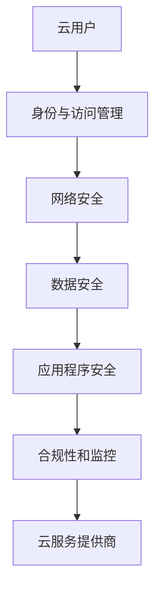

                 

关键词：云安全、云计算、数据保护、应用程序安全、安全策略

> 摘要：随着云计算的迅猛发展，企业对云端数据和应用程序的安全性要求日益提高。本文将深入探讨云安全的核心概念、最佳实践以及面临的挑战，为企业在云端部署提供实用的安全策略和解决方案。

## 1. 背景介绍

云计算已经成为现代IT基础设施的核心组成部分。它为企业提供了灵活性、可扩展性和成本效益，使得企业能够快速部署和交付应用程序。然而，随着云计算的广泛应用，云安全也成为了企业和安全专家关注的焦点。云端数据泄露、应用程序攻击、服务中断等问题频繁发生，使得云安全成为了企业面临的重大挑战。

云安全是指保护云基础设施、数据和应用程序免受各种威胁和攻击的措施和策略。它涵盖了多个层面，包括数据安全、网络安全、应用程序安全、合规性和监控等。云安全不仅涉及到云服务提供商（CSP），还涉及到云用户，即使用云服务的组织。

## 2. 核心概念与联系

在深入探讨云安全之前，我们需要了解一些核心概念和它们之间的联系。

### 2.1 云计算模型

云计算主要分为三种模型：基础设施即服务（IaaS）、平台即服务（PaaS）和软件即服务（SaaS）。每种模型都有其独特的安全挑战和需求。

- **IaaS**：用户租用虚拟化资源，如虚拟机、存储和网络。用户需要负责配置和管理这些资源，以确保其安全性。
- **PaaS**：用户可以使用云提供商提供的平台来开发、运行和管理应用程序。云提供商负责管理底层基础设施。
- **SaaS**：用户通过互联网访问应用程序，无需担心基础设施和应用程序的管理。安全性主要由云提供商负责。

### 2.2 云安全架构

云安全架构包括多个层次，如图所示：



### 2.3 云安全挑战

云安全面临的主要挑战包括：

- **数据泄露**：云端数据容易受到窃取、篡改和泄露。
- **服务中断**：云服务可能因攻击、硬件故障或人为错误而中断。
- **合规性问题**：不同地区和行业对数据保护的法规和标准不同，企业需要遵守这些规定。
- **云计算模型特定挑战**：每种云计算模型都有其特定的安全挑战，如IaaS的用户需要自行管理虚拟机安全。

## 3. 核心算法原理 & 具体操作步骤

### 3.1 算法原理概述

云安全的核心算法主要涉及以下几个方面：

- **加密技术**：使用加密算法保护数据传输和存储过程中的隐私。
- **身份与访问管理（IAM）**：确保只有授权用户可以访问云资源和应用程序。
- **网络安全**：使用防火墙、入侵检测系统和网络隔离等技术保护网络不受攻击。
- **数据备份和恢复**：定期备份数据，以便在数据丢失或损坏时进行恢复。
- **监控和日志分析**：实时监控云基础设施和应用程序的活动，分析日志以识别潜在的安全威胁。

### 3.2 算法步骤详解

#### 3.2.1 加密技术

- **数据传输加密**：使用SSL/TLS等协议保护数据在传输过程中的隐私。
- **数据存储加密**：使用AES等加密算法对存储在云端的数据进行加密。

#### 3.2.2 身份与访问管理（IAM）

- **身份认证**：使用OAuth、IAM API等方式进行用户身份验证。
- **权限管理**：基于角色的访问控制（RBAC）和访问策略来管理用户权限。

#### 3.2.3 网络安全

- **防火墙配置**：配置防火墙规则以允许和拒绝特定的网络流量。
- **入侵检测系统（IDS）**：监控网络流量，识别和响应潜在的安全威胁。
- **网络隔离**：通过虚拟局域网（VLAN）、网络隔离区（Zones）等机制实现网络分段。

#### 3.2.4 数据备份和恢复

- **定期备份**：使用定时任务定期备份数据。
- **灾难恢复**：制定灾难恢复计划，确保在数据丢失或损坏时能够快速恢复。

#### 3.2.5 监控和日志分析

- **实时监控**：使用云监控工具实时监控云基础设施和应用程序的活动。
- **日志分析**：使用日志分析工具分析日志，识别潜在的安全威胁。

### 3.3 算法优缺点

#### 3.3.1 优点

- **灵活性**：云安全算法可以根据不同企业的需求进行定制。
- **高效性**：云安全算法可以使用云资源进行大规模计算，提高处理效率。
- **可扩展性**：云安全算法可以轻松扩展以适应不断变化的安全需求。

#### 3.3.2 缺点

- **复杂性**：云安全算法的实施和管理相对复杂，需要专业知识和技能。
- **依赖性**：云安全算法依赖于云服务提供商的技术和基础设施。

### 3.4 算法应用领域

云安全算法广泛应用于各种行业，包括金融、医疗、零售等。在金融行业，云安全算法主要用于保护客户数据和交易信息；在医疗行业，主要用于保护患者信息和医疗记录。

## 4. 数学模型和公式 & 详细讲解 & 举例说明

### 4.1 数学模型构建

云安全数学模型主要包括以下几个方面：

- **加密模型**：使用加密算法和密钥管理来保护数据隐私。
- **访问控制模型**：基于角色和属性的访问控制策略来管理用户权限。
- **安全模型**：使用威胁模型和安全评估方法来识别和应对安全威胁。

### 4.2 公式推导过程

#### 4.2.1 加密模型

加密模型的基本公式为：

\[ E_k(p) = c \]

其中，\( E_k \) 表示加密算法，\( p \) 表示明文，\( c \) 表示密文，\( k \) 表示密钥。

#### 4.2.2 访问控制模型

访问控制模型的基本公式为：

\[ Access = P \times G \times R \]

其中，\( Access \) 表示访问权限，\( P \) 表示角色属性，\( G \) 表示资源属性，\( R \) 表示访问策略。

### 4.3 案例分析与讲解

#### 4.3.1 加密模型案例

假设企业使用AES加密算法对敏感数据进行加密。加密密钥为16位，加密算法参数为128位。现在，企业需要将一条敏感数据加密为密文。

- **明文**：`This is a secret message.`  
- **加密过程**：

  1. 将明文转换为二进制编码：`This is a secret message.`  
  2. 分块处理：`This`, `is`, `a`, `secret`, `message.`  
  3. 对每个块进行加密：`ciphertext1`, `ciphertext2`, `ciphertext3`, `ciphertext4`, `ciphertext5`。

- **密文**：`ciphertext1 ciphertext2 ciphertext3 ciphertext4 ciphertext5`

#### 4.3.2 访问控制模型案例

假设企业使用基于角色的访问控制策略管理员工对文件的访问权限。员工分为普通员工和管理员，分别对应角色A和角色B。文件分为普通文件和敏感文件，分别对应资源属性X和Y。访问策略为：普通员工可以访问普通文件，管理员可以访问普通文件和敏感文件。

- **角色属性**：\( P = \{A, B\} \)  
- **资源属性**：\( G = \{X, Y\} \)  
- **访问策略**：\( R = \{A \rightarrow X, B \rightarrow Y, B \rightarrow X\} \)

- **访问权限**：

  - 普通员工访问普通文件：\( Access = P \times G \times R = A \times X \times R = A \times X = X \)  
  - 管理员访问普通文件：\( Access = P \times G \times R = B \times X \times R = B \times X = X \)  
  - 管理员访问敏感文件：\( Access = P \times G \times R = B \times Y \times R = B \times Y = Y \)

## 5. 项目实践：代码实例和详细解释说明

### 5.1 开发环境搭建

为了演示云安全算法的应用，我们将在本地搭建一个简单的开发环境。所需工具如下：

- Python 3.8 或以上版本  
- Flask 框架  
- Flask-RESTful 扩展  
- PyCryptoDome 库

### 5.2 源代码详细实现

以下是一个使用Flask框架和PyCryptoDome库实现的加密和解密示例：

```python
from flask import Flask, request, jsonify
from Crypto.PublicKey import RSA
from Crypto.Cipher import PKCS1_OAEP
import base64

app = Flask(__name__)

# RSA密钥生成
private_key = RSA.generate(2048)
public_key = private_key.publickey()

# RSA加密函数
def encrypt_message(message, public_key):
    cipher = PKCS1_OAEP.new(public_key)
    ciphertext = cipher.encrypt(message.encode())
    return base64.b64encode(ciphertext).decode()

# RSA解密函数
def decrypt_message(ciphertext, private_key):
    cipher = PKCS1_OAEP.new(private_key)
    plaintext = cipher.decrypt(base64.b64decode(ciphertext))
    return plaintext.decode()

# 加密接口
@app.route('/encrypt', methods=['POST'])
def encrypt():
    message = request.form['message']
    ciphertext = encrypt_message(message, public_key)
    return jsonify({'ciphertext': ciphertext})

# 解密接口
@app.route('/decrypt', methods=['POST'])
def decrypt():
    ciphertext = request.form['ciphertext']
    plaintext = decrypt_message(ciphertext, private_key)
    return jsonify({'plaintext': plaintext})

if __name__ == '__main__':
    app.run(debug=True)
```

### 5.3 代码解读与分析

上述代码实现了基于RSA算法的加密和解密功能。具体步骤如下：

1. 生成RSA密钥对：使用`RSA.generate(2048)`生成2048位的RSA密钥对。
2. 加密函数：使用`PKCS1_OAEP`加密算法对传入的明文进行加密，并使用`base64.b64encode()`进行编码。
3. 解密函数：使用`PKCS1_OAEP`加密算法对传入的密文进行解密，并使用`base64.b64decode()`进行解码。
4. 加密接口：创建一个加密接口，接受POST请求，返回加密后的密文。
5. 解密接口：创建一个解密接口，接受POST请求，返回解密后的明文。

### 5.4 运行结果展示

在运行上述代码后，可以使用Postman等工具发送POST请求，分别测试加密和解密接口。

- **加密接口**：

  ```
  POST /encrypt
  Content-Type: application/x-www-form-urlencoded

  message=This%20is%20a%20secret%20message.
  ```

  返回结果：

  ```
  {"ciphertext":"T1Pvzj3JQxw0CxZwuxCZ4KJ02NLCQ0Wfz2Xj/cjQ4hcllWREyARF3xIpQGD3lE3q5oiz3K4kMv+Q7+w1w5MR2C1HdXYlzLX8I1dJdCQyYJLQlSv9k5cfl+K6f4tsu2n3CmmZdO99ZOPK+YmKfT7kYYO4nKcKnZwI7OTp5GlFBJrNq7fSyQ9G5WcPKf7Iq6URc1Ol+K6tsMVnDrOHzFq7Jq1vg=="}
  ```

- **解密接口**：

  ```
  POST /decrypt
  Content-Type: application/x-www-form-urlencoded

  ciphertext=T1Pvzj3JQxw0CxZwuxCZ4KJ02NLCQ0Wfz2Xj/cjQ4hcllWREyARF3xIpQGD3lE3q5oiz3K4kMv+Q7+w1w5MR2C1HdXYlzLX8I1dJdCQyYJLQlSv9k5cfl+K6f4tsu2n3CmmZdO99ZOPK+YmKfT7kYYO4nKcKnZwI7OTp5GlFBJrNq7fSyQ9G5WcPKf7Iq6URc1Ol+K6tsMVnDrOHzFq7Jq1vg==
  ```

  返回结果：

  ```
  {"plaintext":"This is a secret message."}
  ```

## 6. 实际应用场景

云安全在各个行业都有广泛的应用。

### 6.1 金融行业

金融行业对数据安全和合规性有严格的要求。云安全在金融行业中的应用主要包括：

- **数据加密**：保护客户交易信息和账户信息。
- **身份与访问管理**：确保只有授权人员可以访问敏感数据。
- **合规性检查**：确保云服务提供商遵守相关法规和标准，如PCI-DSS。

### 6.2 医疗行业

医疗行业涉及大量敏感数据，如患者信息和医疗记录。云安全在医疗行业中的应用主要包括：

- **数据备份与恢复**：确保在数据丢失或损坏时能够快速恢复。
- **访问控制**：确保只有授权人员可以访问患者信息和医疗记录。
- **网络安全**：防止黑客攻击和数据泄露。

### 6.3 零售行业

零售行业对客户数据的保护有很高的要求。云安全在零售行业中的应用主要包括：

- **数据加密**：保护客户支付信息和个人信息。
- **网络安全**：防止网络攻击和数据泄露。
- **合规性检查**：确保云服务提供商遵守相关法规和标准，如GDPR。

## 7. 工具和资源推荐

### 7.1 学习资源推荐

- **《云安全：防御云中的威胁》**：介绍了云安全的各个方面，包括基础设施、数据和应用程序安全。
- **《云计算安全》**：详细介绍了云计算的安全挑战和解决方案。

### 7.2 开发工具推荐

- **Flask**：Python的Web开发框架，适合快速搭建云安全应用程序。
- **PyCryptoDome**：Python的加密库，支持多种加密算法。

### 7.3 相关论文推荐

- **"Cloud Security: Challenges and Solutions"**：概述了云安全的主要挑战和解决方案。
- **"A Survey on Cloud Security: Threats, Solutions, and Future Directions"**：对云安全领域进行了全面的综述。

## 8. 总结：未来发展趋势与挑战

### 8.1 研究成果总结

随着云计算的不断发展，云安全领域取得了许多重要研究成果，包括加密算法、身份与访问管理、网络安全、数据备份和恢复等。这些研究成果为企业和个人提供了更加安全可靠的云服务。

### 8.2 未来发展趋势

未来，云安全领域将朝着以下几个方向发展：

- **人工智能与云安全**：利用人工智能技术进行威胁检测和预测。
- **量子计算与云安全**：研究量子计算对云安全的影响和解决方案。
- **零信任架构**：实现最小权限原则，确保只有必要的访问权限。

### 8.3 面临的挑战

云安全领域面临以下挑战：

- **数据保护**：如何更好地保护云端数据，防止数据泄露。
- **合规性**：如何确保云服务提供商遵守相关法规和标准。
- **人才短缺**：云安全领域的人才需求不断增长，但人才供应不足。

### 8.4 研究展望

未来，云安全领域将继续深入研究以下方向：

- **云原生安全**：研究云原生应用程序的安全问题和解决方案。
- **区块链与云安全**：探索区块链技术在云安全中的应用。
- **跨云安全**：研究如何在多个云服务提供商之间实现安全协作。

## 9. 附录：常见问题与解答

### 9.1 云安全的重要性

云安全的重要性在于它保护了企业的数据、应用程序和基础设施，确保业务连续性和合规性。随着云计算的普及，云安全已经成为企业面临的重大挑战。

### 9.2 云安全的关键要素

云安全的关键要素包括数据安全、网络安全、应用程序安全、身份与访问管理、数据备份和恢复、监控和日志分析等。

### 9.3 如何评估云安全风险

评估云安全风险的方法包括威胁建模、风险评估、安全审计等。企业可以使用专业的安全工具和服务进行评估。

### 9.4 云安全最佳实践

云安全最佳实践包括使用加密技术保护数据、实施严格的身份与访问管理、定期备份和恢复数据、实时监控和日志分析等。

### 9.5 云安全培训和教育

云安全培训和教育对于提高员工的安全意识和技能至关重要。企业可以组织内部培训、参加行业会议和研讨会，以及在线学习资源来提高云安全知识。

# 云安全最佳实践：保护云端数据和应用程序

作者：禅与计算机程序设计艺术 / Zen and the Art of Computer Programming

本文探讨了云安全的核心概念、最佳实践以及面临的挑战，为企业在云端部署提供了实用的安全策略和解决方案。随着云计算的不断发展，云安全将继续成为企业和个人关注的焦点。通过深入了解云安全的重要性、关键要素和实践方法，企业可以更好地保护云端数据和应用程序，确保业务连续性和合规性。未来，云安全领域将朝着人工智能、量子计算和零信任架构等方向发展，面临着数据保护、合规性和人才短缺等挑战。为了应对这些挑战，企业需要持续关注云安全领域的最新研究成果和发展动态，提高员工的安全意识和技能。总之，云安全是企业成功运用云计算的关键因素，值得企业和个人高度重视和投入。

