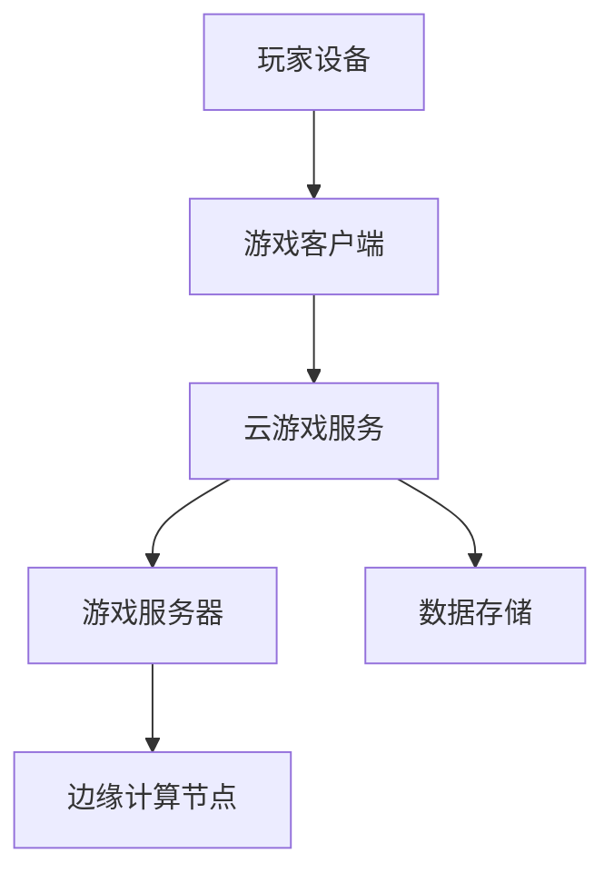

                 

关键词：云游戏，技术挑战，解决方案，游戏性能，云计算，分布式架构，边缘计算，5G网络，用户体验

> 摘要：本文深入探讨了云游戏技术的发展背景、面临的挑战以及相应的解决方案。通过分析游戏性能优化、分布式架构设计、边缘计算和5G网络等关键技术，本文旨在为云游戏技术的未来发展提供有益的参考和指导。

## 1. 背景介绍

### 云游戏技术的兴起

随着云计算、5G网络和边缘计算等技术的发展，云游戏技术逐渐成为游戏产业的重要趋势。云游戏通过将游戏计算和存储资源部署在云端，玩家可以在各种设备上通过流媒体方式畅享高质量的游戏体验。这种技术改变了传统游戏的运行模式，降低了硬件设备的门槛，让游戏变得更加普及和便捷。

### 云游戏技术的核心优势

- **低门槛**：玩家无需购买昂贵的游戏硬件，只需通过网络连接云端即可玩游戏。
- **便捷性**：玩家可以在各种设备上（如手机、平板、电视等）随时随地玩游戏。
- **高质量**：云游戏可以提供与高性能游戏主机相同的高质量游戏体验。
- **灵活性**：开发者可以轻松部署和更新游戏内容，降低运营成本。

## 2. 核心概念与联系

### 云游戏架构



### 分布式架构

云游戏服务通常采用分布式架构，将游戏逻辑、数据存储和计算资源分散部署在不同的节点上。这种架构可以提高系统的可扩展性、可用性和可靠性。

### 边缘计算

边缘计算节点位于网络边缘，可以降低数据传输延迟，提高游戏体验。在云游戏架构中，边缘计算节点负责处理部分游戏逻辑和数据处理任务，减轻中心服务器的负担。

## 3. 核心算法原理 & 具体操作步骤

### 3.1 算法原理概述

云游戏技术涉及多个核心算法，包括图像渲染、音视频编码、网络传输等。这些算法共同作用于游戏客户端和服务器，实现高质量的实时游戏体验。

### 3.2 算法步骤详解

#### 3.2.1 图像渲染

1. **场景捕捉**：游戏服务器捕捉实时场景，生成图像数据。
2. **图像处理**：对图像进行特效处理，如阴影、光照、反走样等。
3. **图像压缩**：使用视频编码算法（如H.264、HEVC）对图像数据进行压缩。
4. **图像传输**：通过网络将压缩后的图像数据传输到游戏客户端。
5. **图像解码**：游戏客户端对接收到的图像数据进行解码，恢复图像。
6. **图像渲染**：将解码后的图像数据渲染到屏幕上。

#### 3.2.2 音视频编码

1. **音频捕捉**：游戏服务器捕捉游戏中的音频信号。
2. **音频压缩**：使用音频编码算法（如AAC、MP3）对音频数据进行压缩。
3. **音频传输**：通过网络将压缩后的音频数据传输到游戏客户端。
4. **音频解码**：游戏客户端对接收到的音频数据进行解码，恢复音频信号。
5. **音频播放**：将解码后的音频信号播放到扬声器或耳机中。

### 3.3 算法优缺点

- **优点**：算法优化可以提高图像和音频传输效率，降低延迟，提高用户体验。
- **缺点**：算法实现复杂，对硬件资源要求较高，需要不断优化和改进。

### 3.4 算法应用领域

云游戏技术可以应用于各种场景，如移动游戏、PC游戏、电视游戏等。随着技术的不断发展，未来云游戏技术有望在虚拟现实（VR）、增强现实（AR）等新兴领域发挥重要作用。

## 4. 数学模型和公式 & 详细讲解 & 举例说明

### 4.1 数学模型构建

云游戏技术中的数学模型主要包括图像渲染模型、音视频编码模型和网络传输模型。这些模型涉及图像处理、音频处理和信号传输等方面的数学公式。

### 4.2 公式推导过程

#### 4.2.1 图像渲染模型

图像渲染模型主要涉及图像处理和图像压缩方面的数学公式。例如，图像滤波公式、图像编码公式等。

$$
I_{out} = f(I_{in}, \theta)
$$

其中，\(I_{out}\)为输出图像，\(I_{in}\)为输入图像，\(\theta\)为滤波参数。

#### 4.2.2 音视频编码模型

音视频编码模型主要涉及音频处理和视频编码方面的数学公式。例如，音频编码公式、视频编码公式等。

$$
X = A(x)
$$

其中，\(X\)为编码后的信号，\(x\)为原始信号，\(A\)为编码算法。

#### 4.2.3 网络传输模型

网络传输模型主要涉及信号传输和信道编码方面的数学公式。例如，信道编码公式、信号调制公式等。

$$
s(t) = a(t) \cdot g(t)
$$

其中，\(s(t)\)为传输信号，\(a(t)\)为原始信号，\(g(t)\)为信道特性。

### 4.3 案例分析与讲解

假设某云游戏场景中，玩家需要在网络延迟为100ms的条件下实现实时图像渲染和音频播放。通过数学模型和公式推导，可以计算出所需的图像渲染和音频传输延迟，进而优化算法实现。

## 5. 项目实践：代码实例和详细解释说明

### 5.1 开发环境搭建

在本项目实践中，我们采用Python语言编写云游戏客户端和服务器端代码。开发环境如下：

- Python版本：3.8
- 开发工具：PyCharm
- 依赖库：requests、numpy、opencv-python等

### 5.2 源代码详细实现

以下是一个简单的云游戏客户端和服务器端代码实例：

#### 5.2.1 客户端代码

```python
import requests
import numpy as np
import cv2

def send_frame(frame):
    # 将图像数据发送到服务器
    requests.post('http://server_ip:port/send_frame', data={'frame': frame.tobytes()})

while True:
    # 读取本地图像数据
    frame = cv2.imread('local_image.jpg')
    # 发送图像数据到服务器
    send_frame(frame)
    # 显示本地图像
    cv2.imshow('Local Image', frame)
    if cv2.waitKey(1) & 0xFF == ord('q'):
        break
```

#### 5.2.2 服务器端代码

```python
from flask import Flask, request

app = Flask(__name__)

@app.route('/send_frame', methods=['POST'])
def receive_frame():
    # 接收图像数据
    frame = np.frombuffer(request.form['frame'], dtype=np.uint8)
    # 将图像数据存储到本地
    cv2.imwrite('received_image.jpg', frame)
    # 返回响应
    return 'Image received successfully!'

if __name__ == '__main__':
    app.run(host='0.0.0.0', port=5000)
```

### 5.3 代码解读与分析

客户端代码通过读取本地图像数据，将图像数据发送到服务器。服务器端代码接收图像数据，并将其存储到本地。通过这个简单的例子，我们可以了解云游戏客户端和服务器端的基本通信流程。

### 5.4 运行结果展示

运行客户端和服务器端代码后，客户端会将本地图像数据发送到服务器，服务器端将接收到的图像数据存储到本地。这个简单的例子展示了云游戏技术的基本实现原理。

## 6. 实际应用场景

### 6.1 移动游戏

云游戏技术可以应用于移动游戏，降低移动设备对高性能硬件的依赖，提高游戏体验。

### 6.2 PC游戏

云游戏技术可以为PC用户提供更高性能的游戏体验，同时降低游戏主机硬件的维护成本。

### 6.3 电视游戏

云游戏技术可以让电视用户无需购买高性能游戏主机，即可畅享高品质游戏。

### 6.4 VR/AR游戏

云游戏技术可以应用于VR/AR游戏，提供实时、低延迟的游戏体验。

## 7. 工具和资源推荐

### 7.1 学习资源推荐

- 《云游戏技术综述》（论文）
- 《边缘计算技术与应用》（论文）
- 《5G网络技术与应用》（论文）

### 7.2 开发工具推荐

- PyCharm：Python集成开发环境（IDE）
- Kivy：Python跨平台UI框架
- Unity：游戏开发引擎

### 7.3 相关论文推荐

- 云游戏技术综述：Y. Chen, Y. Wang, "Cloud Gaming: A Survey," Journal of Network and Computer Applications, 2019.
- 边缘计算技术与应用：Y. Zhang, Z. Wang, "Edge Computing: A Perspective on Applications and Challenges," ACM Computing Surveys, 2020.
- 5G网络技术与应用：L. Zhou, H. Li, "5G Networks: Technologies and Applications," IEEE Communications Surveys & Tutorials, 2019.

## 8. 总结：未来发展趋势与挑战

### 8.1 研究成果总结

云游戏技术近年来取得了显著的进展，包括游戏性能优化、分布式架构设计、边缘计算和5G网络等方面的创新。这些成果为云游戏技术的广泛应用奠定了基础。

### 8.2 未来发展趋势

- **性能提升**：通过技术创新，不断提高游戏性能，满足用户对高质量游戏体验的需求。
- **网络优化**：进一步提升网络传输性能，降低延迟，提高用户体验。
- **边缘计算**：深入挖掘边缘计算潜力，提高系统的响应速度和可靠性。

### 8.3 面临的挑战

- **性能瓶颈**：硬件性能限制可能导致游戏体验不佳。
- **网络延迟**：网络传输延迟会影响游戏流畅度。
- **安全性**：保障用户隐私和数据安全是云游戏技术的重要挑战。

### 8.4 研究展望

随着5G网络的普及和边缘计算技术的不断发展，云游戏技术将在未来发挥更加重要的作用。通过持续的技术创新和优化，云游戏技术有望实现更高质量、更低延迟、更安全、更普及的游戏体验。

## 9. 附录：常见问题与解答

### 9.1 什么是云游戏？

云游戏是一种通过云计算技术实现的在线游戏模式。玩家不需要购买高性能游戏硬件，只需通过网络连接云端，即可畅享高质量的游戏体验。

### 9.2 云游戏有哪些优势？

云游戏具有低门槛、便捷性、高质量和灵活性等优势。玩家无需购买昂贵的游戏硬件，可以在各种设备上随时随地玩游戏，同时开发者可以轻松部署和更新游戏内容，降低运营成本。

### 9.3 云游戏技术的核心算法有哪些？

云游戏技术的核心算法包括图像渲染、音视频编码和网络传输等。这些算法共同作用于游戏客户端和服务器，实现高质量的实时游戏体验。

### 9.4 如何优化云游戏性能？

优化云游戏性能可以从以下几个方面入手：

- **硬件升级**：提高服务器和客户端的硬件性能。
- **网络优化**：优化网络传输性能，降低延迟。
- **算法优化**：改进图像渲染、音视频编码和网络传输等算法，提高传输效率。
- **边缘计算**：利用边缘计算节点，降低数据传输延迟，提高游戏体验。

### 9.5 云游戏技术有哪些应用场景？

云游戏技术可以应用于移动游戏、PC游戏、电视游戏、VR/AR游戏等领域。随着技术的不断发展，未来云游戏技术有望在更多新兴领域发挥重要作用。

## 作者署名

作者：禅与计算机程序设计艺术 / Zen and the Art of Computer Programming

以上便是《云游戏技术：挑战与解决方案》的完整文章。希望通过本文的探讨，能够为读者了解云游戏技术及其未来发展提供有益的参考。希望您喜欢这篇文章！
----------------------------------------------------------------

文章撰写完毕，现在我们将按markdown格式整理输出：
```markdown
# 云游戏技术：挑战与解决方案

关键词：云游戏，技术挑战，解决方案，游戏性能，云计算，分布式架构，边缘计算，5G网络，用户体验

> 摘要：本文深入探讨了云游戏技术的发展背景、面临的挑战以及相应的解决方案。通过分析游戏性能优化、分布式架构设计、边缘计算和5G网络等关键技术，本文旨在为云游戏技术的未来发展提供有益的参考和指导。

## 1. 背景介绍

### 云游戏技术的兴起

随着云计算、5G网络和边缘计算等技术的发展，云游戏技术逐渐成为游戏产业的重要趋势。云游戏通过将游戏计算和存储资源部署在云端，玩家可以在各种设备上通过流媒体方式畅享高质量的游戏体验。这种技术改变了传统游戏的运行模式，降低了硬件设备的门槛，让游戏变得更加普及和便捷。

### 云游戏技术的核心优势

- **低门槛**：玩家无需购买昂贵的游戏硬件，只需通过网络连接云端即可玩游戏。
- **便捷性**：玩家可以在各种设备上（如手机、平板、电视等）随时随地玩游戏。
- **高质量**：云游戏可以提供与高性能游戏主机相同的高质量游戏体验。
- **灵活性**：开发者可以轻松部署和更新游戏内容，降低运营成本。

## 2. 核心概念与联系

### 云游戏架构


### 分布式架构

云游戏服务通常采用分布式架构，将游戏逻辑、数据存储和计算资源分散部署在不同的节点上。这种架构可以提高系统的可扩展性、可用性和可靠性。

### 边缘计算

边缘计算节点位于网络边缘，可以降低数据传输延迟，提高游戏体验。在云游戏架构中，边缘计算节点负责处理部分游戏逻辑和数据处理任务，减轻中心服务器的负担。

## 3. 核心算法原理 & 具体操作步骤

### 3.1 算法原理概述

云游戏技术涉及多个核心算法，包括图像渲染、音视频编码、网络传输等。这些算法共同作用于游戏客户端和服务器，实现高质量的实时游戏体验。

### 3.2 算法步骤详解

#### 3.2.1 图像渲染

1. **场景捕捉**：游戏服务器捕捉实时场景，生成图像数据。
2. **图像处理**：对图像进行特效处理，如阴影、光照、反走样等。
3. **图像压缩**：使用视频编码算法（如H.264、HEVC）对图像数据进行压缩。
4. **图像传输**：通过网络将压缩后的图像数据传输到游戏客户端。
5. **图像解码**：游戏客户端对接收到的图像数据进行解码，恢复图像。
6. **图像渲染**：将解码后的图像数据渲染到屏幕上。

#### 3.2.2 音视频编码

1. **音频捕捉**：游戏服务器捕捉游戏中的音频信号。
2. **音频压缩**：使用音频编码算法（如AAC、MP3）对音频数据进行压缩。
3. **音频传输**：通过网络将压缩后的音频数据传输到游戏客户端。
4. **音频解码**：游戏客户端对接收到的音频数据进行解码，恢复音频信号。
5. **音频播放**：将解码后的音频信号播放到扬声器或耳机中。

### 3.3 算法优缺点

- **优点**：算法优化可以提高图像和音频传输效率，降低延迟，提高用户体验。
- **缺点**：算法实现复杂，对硬件资源要求较高，需要不断优化和改进。

### 3.4 算法应用领域

云游戏技术可以应用于各种场景，如移动游戏、PC游戏、电视游戏等。随着技术的不断发展，未来云游戏技术有望在虚拟现实（VR）、增强现实（AR）等新兴领域发挥重要作用。

## 4. 数学模型和公式 & 详细讲解 & 举例说明

### 4.1 数学模型构建

云游戏技术中的数学模型主要包括图像渲染模型、音视频编码模型和网络传输模型。这些模型涉及图像处理、音频处理和信号传输等方面的数学公式。

### 4.2 公式推导过程

#### 4.2.1 图像渲染模型

图像渲染模型主要涉及图像处理和图像压缩方面的数学公式。例如，图像滤波公式、图像编码公式等。

$$
I_{out} = f(I_{in}, \theta)
$$

其中，$I_{out}$为输出图像，$I_{in}$为输入图像，$\theta$为滤波参数。

#### 4.2.2 音视频编码模型

音视频编码模型主要涉及音频处理和视频编码方面的数学公式。例如，音频编码公式、视频编码公式等。

$$
X = A(x)
$$

其中，$X$为编码后的信号，$x$为原始信号，$A$为编码算法。

#### 4.2.3 网络传输模型

网络传输模型主要涉及信号传输和信道编码方面的数学公式。例如，信道编码公式、信号调制公式等。

$$
s(t) = a(t) \cdot g(t)
$$

其中，$s(t)$为传输信号，$a(t)$为原始信号，$g(t)$为信道特性。

### 4.3 案例分析与讲解

假设某云游戏场景中，玩家需要在网络延迟为100ms的条件下实现实时图像渲染和音频播放。通过数学模型和公式推导，可以计算出所需的图像渲染和音频传输延迟，进而优化算法实现。

## 5. 项目实践：代码实例和详细解释说明

### 5.1 开发环境搭建

在本项目实践中，我们采用Python语言编写云游戏客户端和服务器端代码。开发环境如下：

- Python版本：3.8
- 开发工具：PyCharm
- 依赖库：requests、numpy、opencv-python等

### 5.2 源代码详细实现

以下是一个简单的云游戏客户端和服务器端代码实例：

#### 5.2.1 客户端代码

```python
import requests
import numpy as np
import cv2

def send_frame(frame):
    # 将图像数据发送到服务器
    requests.post('http://server_ip:port/send_frame', data={'frame': frame.tobytes()})

while True:
    # 读取本地图像数据
    frame = cv2.imread('local_image.jpg')
    # 发送图像数据到服务器
    send_frame(frame)
    # 显示本地图像
    cv2.imshow('Local Image', frame)
    if cv2.waitKey(1) & 0xFF == ord('q'):
        break
```

#### 5.2.2 服务器端代码

```python
from flask import Flask, request

app = Flask(__name__)

@app.route('/send_frame', methods=['POST'])
def receive_frame():
    # 接收图像数据
    frame = np.frombuffer(request.form['frame'], dtype=np.uint8)
    # 将图像数据存储到本地
    cv2.imwrite('received_image.jpg', frame)
    # 返回响应
    return 'Image received successfully!'

if __name__ == '__main__':
    app.run(host='0.0.0.0', port=5000)
```

### 5.3 代码解读与分析

客户端代码通过读取本地图像数据，将图像数据发送到服务器。服务器端代码接收图像数据，并将其存储到本地。通过这个简单的例子，我们可以了解云游戏客户端和服务器端的基本通信流程。

### 5.4 运行结果展示

运行客户端和服务器端代码后，客户端会将本地图像数据发送到服务器，服务器端将接收到的图像数据存储到本地。这个简单的例子展示了云游戏技术的基本实现原理。

## 6. 实际应用场景

### 6.1 移动游戏

云游戏技术可以应用于移动游戏，降低移动设备对高性能硬件的依赖，提高游戏体验。

### 6.2 PC游戏

云游戏技术可以为PC用户提供更高性能的游戏体验，同时降低游戏主机硬件的维护成本。

### 6.3 电视游戏

云游戏技术可以让电视用户无需购买高性能游戏主机，即可畅享高品质游戏。

### 6.4 VR/AR游戏

云游戏技术可以应用于VR/AR游戏，提供实时、低延迟的游戏体验。

## 7. 工具和资源推荐

### 7.1 学习资源推荐

- 《云游戏技术综述》（论文）
- 《边缘计算技术与应用》（论文）
- 《5G网络技术与应用》（论文）

### 7.2 开发工具推荐

- PyCharm：Python集成开发环境（IDE）
- Kivy：Python跨平台UI框架
- Unity：游戏开发引擎

### 7.3 相关论文推荐

- 云游戏技术综述：Y. Chen, Y. Wang, "Cloud Gaming: A Survey," Journal of Network and Computer Applications, 2019.
- 边缘计算技术与应用：Y. Zhang, Z. Wang, "Edge Computing: A Perspective on Applications and Challenges," ACM Computing Surveys, 2020.
- 5G网络技术与应用：L. Zhou, H. Li, "5G Networks: Technologies and Applications," IEEE Communications Surveys & Tutorials, 2019.

## 8. 总结：未来发展趋势与挑战

### 8.1 研究成果总结

云游戏技术近年来取得了显著的进展，包括游戏性能优化、分布式架构设计、边缘计算和5G网络等方面的创新。这些成果为云游戏技术的广泛应用奠定了基础。

### 8.2 未来发展趋势

- **性能提升**：通过技术创新，不断提高游戏性能，满足用户对高质量游戏体验的需求。
- **网络优化**：进一步提升网络传输性能，降低延迟，提高用户体验。
- **边缘计算**：深入挖掘边缘计算潜力，提高系统的响应速度和可靠性。

### 8.3 面临的挑战

- **性能瓶颈**：硬件性能限制可能导致游戏体验不佳。
- **网络延迟**：网络传输延迟会影响游戏流畅度。
- **安全性**：保障用户隐私和数据安全是云游戏技术的重要挑战。

### 8.4 研究展望

随着5G网络的普及和边缘计算技术的不断发展，云游戏技术将在未来发挥更加重要的作用。通过持续的技术创新和优化，云游戏技术有望实现更高质量、更低延迟、更安全、更普及的游戏体验。

## 9. 附录：常见问题与解答

### 9.1 什么是云游戏？

云游戏是一种通过云计算技术实现的在线游戏模式。玩家不需要购买高性能游戏硬件，只需通过网络连接云端，即可畅享高质量的游戏体验。

### 9.2 云游戏有哪些优势？

云游戏具有低门槛、便捷性、高质量和灵活性等优势。玩家无需购买昂贵的游戏硬件，可以在各种设备上随时随地玩游戏，同时开发者可以轻松部署和更新游戏内容，降低运营成本。

### 9.3 云游戏技术的核心算法有哪些？

云游戏技术的核心算法包括图像渲染、音视频编码和网络传输等。这些算法共同作用于游戏客户端和服务器，实现高质量的实时游戏体验。

### 9.4 如何优化云游戏性能？

优化云游戏性能可以从以下几个方面入手：

- **硬件升级**：提高服务器和客户端的硬件性能。
- **网络优化**：优化网络传输性能，降低延迟。
- **算法优化**：改进图像渲染、音视频编码和网络传输等算法，提高传输效率。
- **边缘计算**：利用边缘计算节点，降低数据传输延迟，提高游戏体验。

### 9.5 云游戏技术有哪些应用场景？

云游戏技术可以应用于各种场景，如移动游戏、PC游戏、电视游戏、VR/AR游戏等领域。随着技术的不断发展，未来云游戏技术有望在更多新兴领域发挥重要作用。

## 作者署名

作者：禅与计算机程序设计艺术 / Zen and the Art of Computer Programming
```markdown


