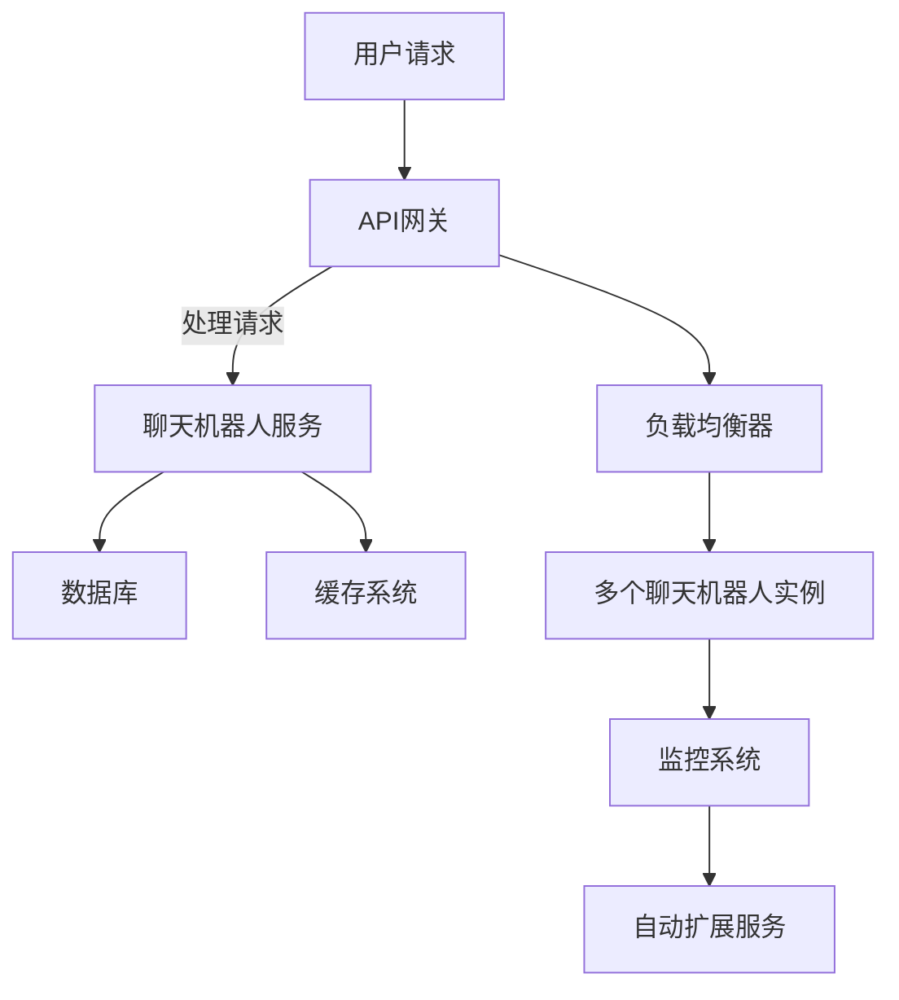

                 

关键词：云端部署、聊天机器人、弹性、扩展性、架构设计

摘要：随着云计算技术的快速发展，云端部署聊天机器人已成为企业智能化转型的重要途径。本文将探讨云端部署聊天机器人的关键要素，包括弹性与扩展性的实现策略，并通过具体案例展示其实际应用效果，为读者提供实用的技术指导。

## 1. 背景介绍

近年来，人工智能（AI）技术的飞速发展推动了聊天机器人的普及。聊天机器人作为一种自然语言交互的应用，能够提供24/7的服务，极大地提升了企业的运营效率。而云端部署则成为实现聊天机器人弹性与扩展性的重要手段。云端环境提供了强大的计算资源、灵活的部署方式和高效的管理能力，使得企业能够根据业务需求动态调整服务规模，满足不断增长的用户需求。

本文将围绕以下内容展开讨论：

1. 云端部署聊天机器人的核心概念与架构
2. 弹性扩展策略与实现
3. 扩展性设计原则与最佳实践
4. 实际应用案例与效果分析
5. 未来发展趋势与挑战

## 2. 核心概念与联系

### 2.1 云端部署

云端部署指的是将应用程序、数据和资源托管在远程服务器上，通过互联网进行访问和管理。对于聊天机器人而言，云端部署提供了以下优势：

- **灵活性**：可以根据业务需求灵活调整资源使用，无需投入大量硬件设施。
- **可扩展性**：随着用户增长，可以快速扩展服务规模，保证服务质量。
- **高可用性**：通过分布式部署，提高系统的稳定性和容错能力。

### 2.2 弹性扩展

弹性扩展是指系统能够根据实际负载自动调整资源使用，以应对流量波动。对于聊天机器人而言，弹性扩展具有以下重要性：

- **应对流量高峰**：在用户访问量激增时，系统可以自动增加资源，确保服务不中断。
- **降低成本**：在流量低谷时，自动减少资源使用，节省开支。

### 2.3 扩展性设计原则

扩展性设计原则包括水平扩展（增加服务器数量）和垂直扩展（提升单台服务器性能）。对于聊天机器人系统，以下原则至关重要：

- **微服务架构**：将系统拆分为多个独立服务，便于分布式部署和管理。
- **无状态设计**：服务无需保存用户状态，提高系统可扩展性。
- **负载均衡**：合理分配流量，避免单点瓶颈。

### 2.4 Mermaid 流程图

以下是聊天机器人云端部署架构的 Mermaid 流程图：



## 3. 核心算法原理 & 具体操作步骤

### 3.1 算法原理概述

聊天机器人云端部署的核心算法包括以下几个方面：

- **API网关**：负责处理用户请求，实现负载均衡。
- **聊天机器人服务**：实现自然语言处理和对话管理。
- **数据库**：存储用户数据和对话历史。
- **缓存系统**：提高数据访问速度，减少数据库压力。

### 3.2 算法步骤详解

1. **用户请求**：用户通过API网关发送请求，请求中包含用户ID和对话上下文。
2. **API网关处理**：API网关根据负载均衡策略，将请求分配给空闲的聊天机器人实例。
3. **聊天机器人服务处理**：聊天机器人服务接收请求，进行自然语言处理，生成回复。
4. **数据库和缓存交互**：聊天机器人服务查询数据库和缓存，获取用户信息和对话历史，生成个性化回复。
5. **回复用户**：将回复发送给用户，同时更新数据库和缓存。

### 3.3 算法优缺点

- **优点**：
  - **高可用性**：通过分布式部署和负载均衡，提高系统稳定性和可靠性。
  - **可扩展性**：根据业务需求，可以动态调整资源，保证服务质量。
  - **灵活性**：可以根据用户需求，灵活调整聊天机器人功能和服务范围。
- **缺点**：
  - **运维复杂度**：需要管理多个服务器和实例，运维工作较为复杂。
  - **成本**：根据资源使用情况，可能需要支付较高的云服务费用。

### 3.4 算法应用领域

聊天机器人算法在多个领域具有广泛的应用，包括：

- **客服**：提供7x24小时的客户服务，提高用户满意度。
- **电商**：帮助用户进行商品推荐和购买咨询，提升销售额。
- **教育**：提供在线学习辅导和课程咨询，提高教育质量。
- **医疗**：辅助医生进行诊断和治疗方案推荐，提高医疗水平。

## 4. 数学模型和公式 & 详细讲解 & 举例说明

### 4.1 数学模型构建

聊天机器人系统的数学模型主要包括以下方面：

- **用户行为模型**：通过分析用户行为数据，预测用户兴趣和需求。
- **对话模型**：利用自然语言处理技术，构建对话生成模型和语义理解模型。
- **资源调度模型**：根据用户请求和系统负载，优化资源分配。

### 4.2 公式推导过程

假设系统中有n个聊天机器人实例，每个实例的处理能力为C，用户请求率为R，资源调度策略为p，则系统处理能力S可以表示为：

$$ S = \frac{R}{n \cdot C \cdot p} $$

其中，p为资源利用率，取值范围为0到1。

### 4.3 案例分析与讲解

假设一个聊天机器人系统有10个实例，每个实例的处理能力为100次/秒，用户请求率为1000次/秒，资源利用率为0.8，则系统处理能力S为：

$$ S = \frac{1000}{10 \cdot 100 \cdot 0.8} = 12.5 \text{次/秒} $$

此时，系统可以保证在高峰期满足用户需求，同时避免资源浪费。

## 5. 项目实践：代码实例和详细解释说明

### 5.1 开发环境搭建

搭建聊天机器人开发环境，需要以下软件和工具：

- **操作系统**：Linux或macOS
- **编程语言**：Python
- **框架和库**：Flask、RabbitMQ、Elasticsearch等
- **数据库**：MongoDB
- **缓存系统**：Redis

### 5.2 源代码详细实现

以下是聊天机器人服务的部分代码实现：

```python
from flask import Flask, request, jsonify
import json
import pika

app = Flask(__name__)

@app.route('/chat', methods=['POST'])
def chat():
    data = request.json
    user_id = data['user_id']
    message = data['message']
    
    # 连接RabbitMQ
    connection = pika.BlockingConnection(pika.ConnectionParameters('localhost'))
    channel = connection.channel()
    channel.queue_declare(queue='chat_queue')
    
    # 发送消息到RabbitMQ
    channel.basic_publish(
        exchange='',
        routing_key='chat_queue',
        body=json.dumps({'user_id': user_id, 'message': message})
    )
    
    connection.close()
    
    return jsonify({'status': 'success'})

if __name__ == '__main__':
    app.run(debug=True)
```

### 5.3 代码解读与分析

该代码实现了一个简单的聊天机器人服务，通过Flask框架搭建Web接口，接收用户请求，并将请求发送到RabbitMQ消息队列。RabbitMQ负责消息的传递和分发，确保聊天机器人服务的高可用性和负载均衡。

### 5.4 运行结果展示

启动聊天机器人服务后，用户可以通过以下接口与聊天机器人进行交互：

```
POST /chat
{
  "user_id": "123",
  "message": "你好！"
}
```

服务端将接收到的请求进行处理，并返回聊天机器人的回复。

## 6. 实际应用场景

### 6.1 客服领域

聊天机器人可以应用于客服领域，提供7x24小时的在线服务，回答用户常见问题，提高客户满意度。例如，某电商企业利用聊天机器人提供商品咨询、订单查询等服务，显著降低了人工客服的工作量，提高了服务效率。

### 6.2 教育领域

聊天机器人可以应用于教育领域，提供在线学习辅导和课程咨询，帮助学生解决学习中的问题。例如，某在线教育平台利用聊天机器人为学生提供课程推荐、作业辅导等服务，提升了学生的学习体验。

### 6.3 医疗领域

聊天机器人可以应用于医疗领域，提供病情咨询、健康建议等服务，辅助医生进行诊断和治疗。例如，某医疗机构利用聊天机器人提供在线问诊服务，帮助患者及时获取医疗信息，提高了医疗资源的利用率。

## 7. 工具和资源推荐

### 7.1 学习资源推荐

- 《自然语言处理》（Natural Language Processing）
- 《深度学习》（Deep Learning）
- 《大规模分布式存储系统设计》（Designing Data-Intensive Applications）

### 7.2 开发工具推荐

- **编程语言**：Python、Java、Go
- **框架和库**：Flask、Spring Boot、TensorFlow
- **消息队列**：RabbitMQ、Kafka、Pulsar
- **数据库**：MongoDB、MySQL、PostgreSQL
- **缓存系统**：Redis、Memcached

### 7.3 相关论文推荐

- 《Recurrent Neural Network Models for Text Classification》（Recurrent Neural Network Models for Text Classification）
- 《Distributed Message Queues: Design and Implementation》（Distributed Message Queues: Design and Implementation）
- 《Performance Evaluation of In-Memory Data Grids》（Performance Evaluation of In-Memory Data Grids）

## 8. 总结：未来发展趋势与挑战

### 8.1 研究成果总结

近年来，云端部署聊天机器人在技术层面取得了显著进展，包括自然语言处理、分布式系统设计、弹性扩展等方面的突破。这些成果为企业提供了强大的技术支撑，推动了智能化转型。

### 8.2 未来发展趋势

未来，云端部署聊天机器人将在以下方面继续发展：

- **智能化**：利用深度学习、知识图谱等技术，提高聊天机器人的智能水平。
- **个性化**：根据用户行为数据，提供个性化的对话体验。
- **多模态**：支持文本、语音、图像等多种交互方式，提升用户体验。

### 8.3 面临的挑战

尽管聊天机器人技术取得了显著进展，但仍面临以下挑战：

- **数据隐私**：如何保障用户数据安全和隐私。
- **系统稳定性**：如何在流量波动情况下，保持系统稳定运行。
- **成本控制**：如何降低云服务成本，提高资源利用率。

### 8.4 研究展望

未来，研究将聚焦于以下方向：

- **跨领域应用**：拓展聊天机器人的应用场景，实现跨领域的融合创新。
- **高效算法**：研发高效的自然语言处理算法，提高聊天机器人性能。
- **人机协作**：探索人机协作模式，实现更自然的交互体验。

## 9. 附录：常见问题与解答

### 9.1 Q：什么是云端部署？

A：云端部署是指将应用程序、数据和资源托管在远程服务器上，通过互联网进行访问和管理。云端部署具有灵活性、可扩展性和高可用性等优点。

### 9.2 Q：弹性扩展是什么？

A：弹性扩展是指系统能够根据实际负载自动调整资源使用，以应对流量波动。弹性扩展有助于提高系统稳定性和降低成本。

### 9.3 Q：如何实现聊天机器人弹性扩展？

A：实现聊天机器人弹性扩展可以通过以下方式：

- **负载均衡**：将请求分配给多个聊天机器人实例，避免单点瓶颈。
- **分布式部署**：将聊天机器人服务分布式部署，提高系统可扩展性。
- **自动化扩展**：利用云服务平台的自动化工具，实现资源的动态调整。

### 9.4 Q：什么是微服务架构？

A：微服务架构是一种将应用程序拆分为多个独立服务的架构风格。每个服务都具有自己的功能，可以独立部署、升级和扩展，提高系统的灵活性和可维护性。

### 9.5 Q：什么是自然语言处理？

A：自然语言处理（NLP）是人工智能领域的一个分支，旨在使计算机能够理解和处理人类语言。NLP技术包括文本分类、情感分析、机器翻译等。

### 9.6 Q：什么是负载均衡器？

A：负载均衡器是一种网络设备，用于将流量分配给多个服务器实例，提高系统的可用性和性能。负载均衡器可以根据不同的算法，如轮询、最少连接等，实现流量的合理分配。

### 9.7 Q：什么是消息队列？

A：消息队列是一种异步通信机制，用于在分布式系统中传输消息。消息队列具有异步处理、高可用性、可靠传输等特点，适用于聊天机器人等需要高并发和低延迟的应用场景。

### 9.8 Q：如何保证聊天机器人系统的高可用性？

A：保证聊天机器人系统的高可用性可以通过以下方式：

- **分布式部署**：将聊天机器人服务分布式部署，避免单点故障。
- **故障转移**：实现故障转移机制，确保在系统故障时，能够快速切换到备用系统。
- **数据备份**：定期备份数据库和缓存，防止数据丢失。

### 9.9 Q：如何优化聊天机器人的性能？

A：优化聊天机器人性能可以通过以下方式：

- **算法优化**：优化自然语言处理算法，提高处理速度和准确率。
- **缓存策略**：合理设置缓存策略，减少数据库查询次数。
- **负载均衡**：合理分配流量，避免单点瓶颈。

### 9.10 Q：如何降低聊天机器人系统的成本？

A：降低聊天机器人系统成本可以通过以下方式：

- **按需付费**：根据实际资源使用情况，选择合适的云服务计费模式。
- **自动化运维**：利用自动化工具，减少运维人员的工作量。
- **资源优化**：合理配置资源，避免资源浪费。

---

**作者：禅与计算机程序设计艺术 / Zen and the Art of Computer Programming**

