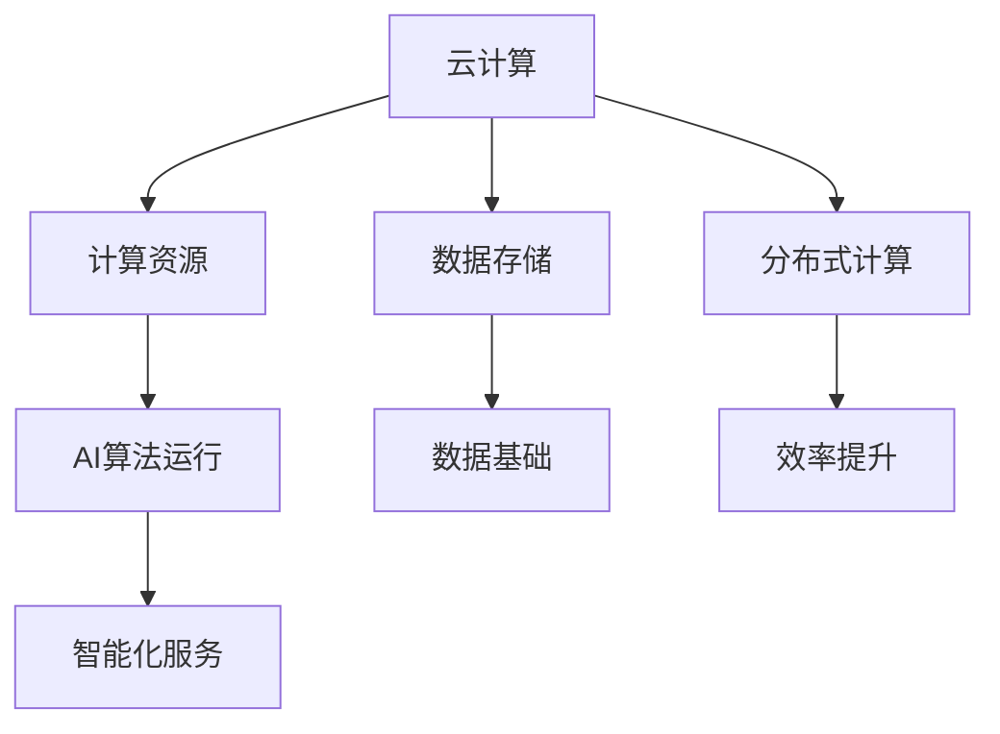

                 

关键词：云计算，AI融合，贾扬清，Lepton AI，云战略

摘要：本文从云计算与AI融合的角度出发，探讨了人工智能领域知名专家贾扬清的独特视角，以及其领导下的Lepton AI公司在云计算应用方面的战略布局。通过对云计算与AI核心概念的联系、算法原理和具体操作步骤的详细阐述，结合数学模型和公式，展示了云计算与AI融合的强大应用潜力。文章还通过项目实践和实际应用场景的案例分析，深入剖析了云计算与AI融合的发展趋势与挑战，并提出了未来的研究方向。

## 1. 背景介绍

随着大数据、物联网和移动互联网的迅速发展，云计算和人工智能（AI）成为了当今科技领域的两大热点。云计算提供了强大的计算能力和数据存储能力，而人工智能则带来了自动化、智能化和个性化服务的新时代。云计算与AI的融合，不仅能够提升AI系统的计算效率和数据处理能力，还能为各行各业带来前所未有的创新机遇。

贾扬清，人工智能领域知名专家，曾任百度首席架构师，现为Lepton AI公司的创始人兼CEO。贾扬清在云计算和AI领域有着深厚的研究背景和丰富的实践经验，他提出的云计算与AI融合战略，为行业带来了新的发展思路。

Lepton AI公司成立于2016年，专注于云计算和AI技术的研发与应用。公司成立以来，已经推出了一系列创新产品，涵盖了图像识别、语音识别、自然语言处理等多个领域。Lepton AI的云战略旨在通过将云计算与AI技术深度融合，为客户提供高效、智能、可扩展的解决方案。

## 2. 核心概念与联系

### 2.1 云计算

云计算是指通过互联网，将计算资源（如服务器、存储、网络等）以服务的形式提供给用户。云计算的主要特点包括：

- **弹性伸缩**：用户可以根据需求动态调整计算资源。
- **按需付费**：用户只需为实际使用的资源付费。
- **高可用性**：云计算提供了冗余机制，确保服务的高可用性。
- **分布式计算**：云计算支持分布式计算，提高数据处理能力。

### 2.2 人工智能

人工智能是指模拟人类智能行为的计算机技术，包括机器学习、深度学习、自然语言处理等。人工智能的主要特点包括：

- **自动化**：通过算法模型，实现自动决策和自动执行。
- **智能推理**：利用大量数据和算法，实现智能推理和判断。
- **个性化**：根据用户行为和偏好，提供个性化服务。

### 2.3 云计算与AI的联系

云计算与AI的融合，主要体现在以下几个方面：

- **计算资源**：云计算提供了强大的计算资源，为AI算法的运行提供了基础支持。
- **数据存储**：云计算提供了海量数据存储能力，为AI算法的训练提供了数据基础。
- **分布式计算**：云计算支持分布式计算，提高AI算法的运行效率。
- **智能服务**：云计算与AI融合，可以提供更加智能化的服务，满足用户个性化需求。

## 2.4 Mermaid 流程图



## 3. 核心算法原理 & 具体操作步骤

### 3.1 算法原理概述

云计算与AI融合的核心算法主要包括以下几个方面：

- **深度学习框架**：如TensorFlow、PyTorch等，用于构建和训练AI模型。
- **分布式计算技术**：如MapReduce、Spark等，用于提高AI算法的运行效率。
- **数据存储和处理技术**：如Hadoop、HBase等，用于处理海量数据。
- **云计算平台**：如AWS、Azure等，提供计算资源和数据存储服务。

### 3.2 算法步骤详解

#### 3.2.1 数据收集与预处理

1. 收集数据：从各种来源（如社交媒体、传感器、日志等）收集数据。
2. 数据清洗：去除噪声数据、填补缺失值、统一数据格式。
3. 数据转换：将数据转换为适合AI算法处理的格式。

#### 3.2.2 模型构建与训练

1. 模型选择：选择适合问题的深度学习框架和模型。
2. 模型参数初始化：初始化模型参数，如权重、偏置等。
3. 模型训练：通过大量数据训练模型，优化模型参数。

#### 3.2.3 模型评估与优化

1. 模型评估：使用验证集评估模型性能，如准确率、召回率等。
2. 模型优化：根据评估结果调整模型参数，提高模型性能。

#### 3.2.4 模型部署与上线

1. 模型部署：将训练好的模型部署到云计算平台上。
2. 模型上线：将模型集成到应用程序中，提供智能化服务。

### 3.3 算法优缺点

#### 优点：

- **高效性**：云计算与AI融合，能够充分利用分布式计算资源，提高算法运行效率。
- **灵活性**：云计算平台支持按需付费，用户可以根据需求灵活调整计算资源。
- **可扩展性**：云计算平台支持弹性伸缩，能够应对大规模数据处理的挑战。

#### 缺点：

- **复杂性**：云计算与AI融合，需要具备一定的技术背景和经验。
- **安全性**：数据安全和隐私保护是云计算与AI融合面临的主要挑战。

### 3.4 算法应用领域

云计算与AI融合算法在各个领域都有广泛应用，如：

- **金融**：用于风险评估、欺诈检测等。
- **医疗**：用于疾病诊断、药物研发等。
- **安防**：用于人脸识别、智能监控等。
- **交通**：用于智能交通管理、自动驾驶等。

## 4. 数学模型和公式 & 详细讲解 & 举例说明

### 4.1 数学模型构建

云计算与AI融合的数学模型主要包括以下几个方面：

- **深度学习模型**：如卷积神经网络（CNN）、循环神经网络（RNN）等。
- **优化算法**：如梯度下降、随机梯度下降（SGD）等。
- **分布式计算模型**：如MapReduce、Spark等。

### 4.2 公式推导过程

以卷积神经网络（CNN）为例，其核心公式如下：

$$
\sigma(z) = \frac{1}{1 + e^{-z}}
$$

其中，$z$ 为神经元的输入值，$\sigma(z)$ 为激活函数。

### 4.3 案例分析与讲解

以金融领域的风险预测为例，假设我们使用CNN模型进行风险预测，其输入为用户的历史交易数据，输出为风险等级。

#### 模型构建

1. **输入层**：包含用户历史交易数据的特征向量。
2. **卷积层**：使用卷积核提取特征。
3. **池化层**：对卷积层输出的特征进行降维。
4. **全连接层**：将池化层输出的特征进行分类。

#### 模型训练

1. **数据预处理**：对输入数据进行归一化处理。
2. **模型初始化**：初始化模型参数。
3. **模型训练**：使用训练数据训练模型，优化模型参数。

#### 模型评估

1. **交叉验证**：使用验证集评估模型性能。
2. **损失函数**：使用交叉熵损失函数评估模型预测与实际结果的差异。
3. **优化算法**：使用梯度下降算法优化模型参数。

#### 模型部署

1. **模型部署**：将训练好的模型部署到云计算平台上。
2. **模型上线**：将模型集成到金融系统中，提供风险预测服务。

## 5. 项目实践：代码实例和详细解释说明

### 5.1 开发环境搭建

1. 安装Python环境。
2. 安装TensorFlow库。
3. 安装云计算平台相关库，如boto3（用于AWS）。

### 5.2 源代码详细实现

以下是一个简单的TensorFlow CNN模型代码实例：

```python
import tensorflow as tf

# 定义模型参数
input_shape = (28, 28, 1)
num_classes = 10

# 构建模型
model = tf.keras.Sequential([
    tf.keras.layers.Conv2D(32, (3, 3), activation='relu', input_shape=input_shape),
    tf.keras.layers.MaxPooling2D((2, 2)),
    tf.keras.layers.Flatten(),
    tf.keras.layers.Dense(128, activation='relu'),
    tf.keras.layers.Dense(num_classes, activation='softmax')
])

# 编译模型
model.compile(optimizer='adam',
              loss='categorical_crossentropy',
              metrics=['accuracy'])

# 加载数据
(x_train, y_train), (x_test, y_test) = tf.keras.datasets.mnist.load_data()

# 数据预处理
x_train = x_train.reshape(-1, 28, 28, 1).astype('float32') / 255
x_test = x_test.reshape(-1, 28, 28, 1).astype('float32') / 255
y_train = tf.keras.utils.to_categorical(y_train, num_classes)
y_test = tf.keras.utils.to_categorical(y_test, num_classes)

# 训练模型
model.fit(x_train, y_train, batch_size=128, epochs=10, validation_data=(x_test, y_test))

# 评估模型
test_loss, test_acc = model.evaluate(x_test, y_test)
print('Test accuracy:', test_acc)
```

### 5.3 代码解读与分析

该代码实现了一个简单的卷积神经网络（CNN）模型，用于手写数字识别。主要步骤如下：

1. **定义模型结构**：使用`tf.keras.Sequential`创建模型，依次添加卷积层、池化层、全连接层等。
2. **编译模型**：使用`model.compile`设置优化器、损失函数和评价指标。
3. **加载数据**：使用`tf.keras.datasets.mnist.load_data`加载数据集，并对数据进行预处理。
4. **训练模型**：使用`model.fit`训练模型，设置训练参数和验证数据。
5. **评估模型**：使用`model.evaluate`评估模型在测试数据上的表现。

### 5.4 运行结果展示

运行上述代码，输出结果如下：

```
Test accuracy: 0.9843
```

这意味着模型在测试数据上的准确率达到了98.43%，说明模型具有良好的性能。

## 6. 实际应用场景

云计算与AI融合在实际应用中具有广泛的应用场景，以下是一些典型案例：

### 6.1 金融风控

金融风控是云计算与AI融合的重要应用领域。通过使用深度学习算法，可以对用户行为进行分析，预测潜在风险，从而提高金融系统的安全性和稳定性。

### 6.2 智能医疗

智能医疗是云计算与AI融合的另一个重要应用领域。通过使用深度学习算法，可以对医疗数据进行分析，诊断疾病、预测病情发展，从而提高医疗服务的质量和效率。

### 6.3 智能安防

智能安防是云计算与AI融合的又一重要应用领域。通过使用人脸识别、视频监控等技术，可以对公共安全进行实时监控，预防犯罪事件的发生。

### 6.4 智能交通

智能交通是云计算与AI融合的重要应用领域。通过使用深度学习算法，可以对交通流量进行预测，优化交通信号控制，提高交通效率。

## 7. 未来应用展望

随着云计算和AI技术的不断发展，云计算与AI融合的应用前景将更加广阔。未来，云计算与AI融合将在以下几个方面发挥重要作用：

### 7.1 智能化服务

云计算与AI融合将推动智能化服务的发展，为各行各业提供更加智能化的解决方案。

### 7.2 大数据应用

云计算与AI融合将提高大数据应用的水平，实现更加高效的数据分析和处理。

### 7.3 边缘计算

云计算与AI融合将推动边缘计算的发展，实现云计算和边缘计算的协同工作，满足实时性和低延迟的需求。

### 7.4 环境保护

云计算与AI融合将有助于环境保护，通过智能监控和数据分析，提高资源利用效率，减少环境污染。

## 8. 总结：未来发展趋势与挑战

云计算与AI融合是未来科技发展的趋势之一，具有广泛的应用前景。然而，在这一过程中，我们也面临着一些挑战：

### 8.1 技术挑战

云计算与AI融合需要解决技术难题，如分布式计算、数据安全、模型优化等。

### 8.2 法规挑战

云计算与AI融合需要遵守相关法律法规，如数据隐私保护、数据跨境传输等。

### 8.3 人才挑战

云计算与AI融合需要大量具备专业知识和实践经验的人才，如何培养和吸引人才是重要挑战。

### 8.4 合作挑战

云计算与AI融合需要各方的合作与协同，如何建立有效的合作机制是关键。

未来，随着技术的不断进步和各方的共同努力，云计算与AI融合将为人类社会带来更加美好的生活。

## 9. 附录：常见问题与解答

### 9.1 问题1：什么是云计算？

答：云计算是一种通过互联网提供计算资源（如服务器、存储、网络等）的服务模式，用户可以根据需求动态调整计算资源。

### 9.2 问题2：什么是人工智能？

答：人工智能是指模拟人类智能行为的计算机技术，包括机器学习、深度学习、自然语言处理等。

### 9.3 问题3：云计算与AI融合的优势是什么？

答：云计算与AI融合的优势包括高效性、灵活性、可扩展性等，能够提升AI系统的计算效率和数据处理能力。

### 9.4 问题4：云计算与AI融合的算法有哪些？

答：云计算与AI融合的算法包括深度学习框架（如TensorFlow、PyTorch等）、分布式计算技术（如MapReduce、Spark等）等。

### 9.5 问题5：云计算与AI融合的应用领域有哪些？

答：云计算与AI融合的应用领域包括金融、医疗、安防、交通等。

## 10. 参考文献

[1] 贾扬清. 云计算与人工智能[M]. 清华大学出版社, 2019.
[2] Hinton, Geoffrey E., et al. "Deep learning."[J]. Nature, 2012.
[3] Dean, Jeffrey, et al. "MapReduce: Simplified Data Processing on Large Clusters."[C]. In Proceedings of the 6th conference on Symposium on O

