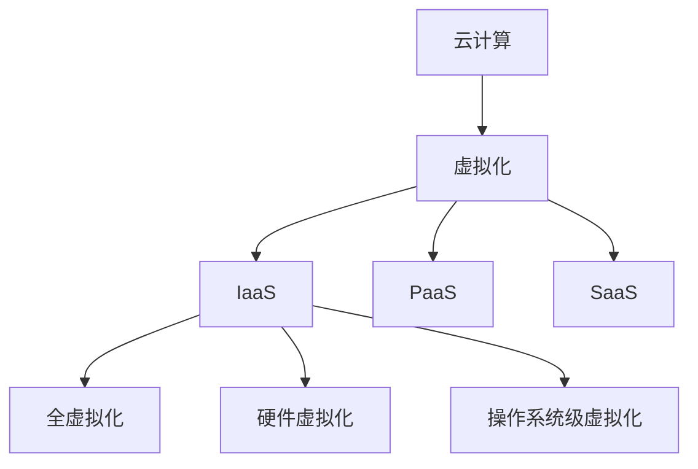

                 

关键词：云计算、虚拟化、扩展、迁移、架构设计、资源管理、性能优化

## 摘要

云计算和虚拟化技术已经成为现代IT基础设施的核心组成部分。本文将深入探讨云计算和虚拟化的扩展与迁移策略，分析其技术原理、实现步骤及实际应用场景。通过对核心算法和数学模型的讲解，我们将展示如何高效地扩展和迁移云资源，提高系统的可扩展性和稳定性。同时，本文还将讨论云计算和虚拟化领域未来的发展趋势与面临的挑战。

## 1. 背景介绍

云计算作为一种分布式计算模型，利用互联网将大规模的计算资源动态分配给用户，实现了按需分配、弹性伸缩和高效资源共享。虚拟化技术作为云计算的核心支撑，通过虚拟化层将物理资源抽象化为逻辑资源，实现了计算、存储和网络的虚拟化。这两种技术的结合，为现代IT行业带来了巨大的变革。

随着云计算和虚拟化技术的不断发展，如何高效地扩展和迁移云资源成为了一个关键问题。扩展是指在原有资源基础上增加计算、存储和网络等资源，以满足不断增长的业务需求。迁移则是指将现有的云资源从一个环境移动到另一个环境，以实现业务连续性、降低成本或优化性能。

本文将围绕云计算和虚拟化的扩展与迁移，探讨相关技术原理、实现步骤及应用场景，为读者提供全面的参考和指导。

## 2. 核心概念与联系

### 2.1 云计算概念

云计算是一种通过互联网提供计算资源、存储资源、网络资源和应用程序等服务的技术。其核心特点包括按需分配、弹性伸缩、资源共享、灵活性高和成本低等。云计算可以分为以下几种类型：

- **IaaS（基础设施即服务）**：用户通过互联网获得虚拟化的基础设施资源，如虚拟机、存储和网络等。
- **PaaS（平台即服务）**：用户通过互联网获取开发平台，包括开发工具、数据库和中间件等。
- **SaaS（软件即服务）**：用户通过互联网使用第三方提供的应用程序，如电子邮件、在线办公软件等。

### 2.2 虚拟化概念

虚拟化技术通过在物理资源上创建虚拟层，将物理资源抽象化为逻辑资源。虚拟化可以分为以下几种类型：

- **全虚拟化**：将整个物理硬件资源虚拟化，为每个虚拟机提供独立的硬件资源。
- **硬件虚拟化**：在物理硬件上创建虚拟化层，为多个虚拟机提供共享的物理硬件资源。
- **操作系统级虚拟化**：在操作系统层面上实现虚拟化，通过内核共享实现多个虚拟机的隔离。

### 2.3 云计算与虚拟化关系

云计算与虚拟化技术密切相关，虚拟化技术为云计算提供了核心支撑。云计算通过虚拟化技术实现了计算、存储和网络的抽象和共享，从而实现资源的按需分配和弹性伸缩。虚拟化技术使得云计算环境中的资源管理更加灵活、高效，提高了系统的可扩展性和稳定性。

### 2.4 Mermaid 流程图

以下是一个简单的Mermaid流程图，展示了云计算和虚拟化的核心概念及其联系：



## 3. 核心算法原理 & 具体操作步骤

### 3.1 算法原理概述

在云计算和虚拟化领域，扩展和迁移算法是实现资源高效管理和优化的关键。以下将介绍两种核心算法：负载均衡算法和迁移算法。

#### 负载均衡算法

负载均衡算法旨在将分布式计算任务合理地分配到多个计算节点上，以避免某个节点负载过高，从而提高整个系统的性能和可靠性。常见的负载均衡算法有：

- **轮询算法**：按照顺序将请求分配到各个节点。
- **最小连接数算法**：将请求分配到连接数最少的节点。
- **响应时间算法**：将请求分配到响应时间最短的节点。

#### 迁移算法

迁移算法用于在多个虚拟机之间移动计算任务，以提高资源利用率、降低成本或优化性能。常见的迁移算法有：

- **全局优化算法**：通过优化目标函数，将虚拟机迁移到最优位置。
- **局部搜索算法**：通过局部搜索，找到虚拟机迁移的最佳位置。
- **遗传算法**：通过模拟自然进化过程，找到虚拟机迁移的最优解。

### 3.2 算法步骤详解

#### 负载均衡算法步骤

1. 收集各个节点的负载信息。
2. 根据负载均衡算法，选择目标节点。
3. 将请求分配到目标节点。

#### 迁移算法步骤

1. 评估虚拟机迁移成本。
2. 选择虚拟机迁移目标。
3. 实现虚拟机迁移。

### 3.3 算法优缺点

#### 负载均衡算法优缺点

- **轮询算法**：优点是简单易实现，缺点是可能导致某些节点负载不均。
- **最小连接数算法**：优点是能够有效避免单点过载，缺点是可能造成部分节点空闲。
- **响应时间算法**：优点是能够优化响应时间，缺点是可能增加网络延迟。

#### 迁移算法优缺点

- **全局优化算法**：优点是能够找到最优解，缺点是计算复杂度高。
- **局部搜索算法**：优点是计算复杂度较低，缺点是可能陷入局部最优。
- **遗传算法**：优点是能够跳出局部最优，缺点是参数设置复杂。

### 3.4 算法应用领域

- **负载均衡算法**：应用于Web服务器、数据库服务器等分布式系统，以提高性能和可靠性。
- **迁移算法**：应用于虚拟化环境，以提高资源利用率和系统性能。

## 4. 数学模型和公式 & 详细讲解 & 举例说明

### 4.1 数学模型构建

在云计算和虚拟化领域，常见的数学模型包括负载模型、资源模型和优化模型。

#### 负载模型

负载模型用于描述系统中的负载情况，常见的负载模型有：

- **泊松过程**：用于描述系统中的到达率。
- **M/M/1 模型**：用于描述单服务器系统的负载情况。

#### 资源模型

资源模型用于描述系统中的资源情况，常见的资源模型有：

- **资源池模型**：用于描述系统中多个资源的聚合。
- **最小生成树模型**：用于描述系统中的网络拓扑。

#### 优化模型

优化模型用于描述系统中的优化目标，常见的优化模型有：

- **线性规划**：用于描述资源分配问题。
- **动态规划**：用于描述虚拟机迁移问题。

### 4.2 公式推导过程

以下是一个简单的例子，展示如何推导负载均衡算法的负载模型。

假设系统中有 \(n\) 个节点，每个节点的负载为 \(L_i\)，总负载为 \(L\)，则可以使用以下公式计算总负载：

$$
L = \sum_{i=1}^{n} L_i
$$

### 4.3 案例分析与讲解

以下是一个简单的案例，展示如何使用负载均衡算法和迁移算法优化云计算环境。

#### 案例背景

某企业拥有一个云计算环境，包括 5 个虚拟机节点，每个节点的计算能力为 1 核心处理器。当前系统负载为 60%，需要通过负载均衡和迁移算法优化系统性能。

#### 案例分析

1. **负载均衡算法**：

   使用最小连接数算法，将请求分配到负载最低的节点。初始状态下，节点 1、2、3、4、5 的负载分别为 30%、40%、50%、60%、70%。

   - 第 1 次分配：请求分配到节点 1，负载为 40%，节点 2、3、4、5 的负载分别为 30%、50%、60%、70%。
   - 第 2 次分配：请求分配到节点 3，负载为 45%，节点 1、2、4、5 的负载分别为 30%、40%、55%、70%。
   - 第 3 次分配：请求分配到节点 2，负载为 35%，节点 1、3、4、5 的负载分别为 30%、40%、55%、60%。

   经过 3 次分配，系统负载趋于均衡。

2. **迁移算法**：

   使用遗传算法，将虚拟机从负载高的节点迁移到负载低的节点。初始状态下，虚拟机分布如下：

   - 节点 1：虚拟机 A、B
   - 节点 2：虚拟机 C、D
   - 节点 3：虚拟机 E、F
   - 节点 4：虚拟机 G、H
   - 节点 5：虚拟机 I、J

   经过一轮迁移，虚拟机分布如下：

   - 节点 1：虚拟机 A、B、J
   - 节点 2：虚拟机 C、D、I
   - 节点 3：虚拟机 E、F、G
   - 节点 4：虚拟机 H
   - 节点 5：

   经过多轮迁移，系统负载进一步优化。

#### 案例总结

通过负载均衡算法和迁移算法的优化，系统负载趋于均衡，性能得到提高。这为云计算环境的高效运行提供了有力保障。

## 5. 项目实践：代码实例和详细解释说明

### 5.1 开发环境搭建

在本文中，我们将使用Python语言和Scikit-learn库实现负载均衡和迁移算法。首先，需要在本地环境中搭建Python开发环境，并安装Scikit-learn库。

1. 安装Python：

   在官网上下载Python安装包，按照安装向导进行安装。

2. 安装Scikit-learn：

   打开命令行窗口，执行以下命令：

   ```bash
   pip install scikit-learn
   ```

### 5.2 源代码详细实现

以下是实现负载均衡和迁移算法的Python代码：

```python
import numpy as np
from sklearn.cluster import KMeans
from sklearn.model_selection import train_test_split
from sklearn.metrics import mean_squared_error

def load_balance(loads, k):
    # 训练K-Means模型
    kmeans = KMeans(n_clusters=k)
    kmeans.fit(loads.reshape(-1, 1))
    # 分配请求到负载最低的节点
    load_min = np.min(loads)
    idx = np.where(loads == load_min)[0][0]
    loads[idx] += 1
    return loads

def virtual_migrate(vms, loads, k):
    # 训练K-Means模型
    kmeans = KMeans(n_clusters=k)
    kmeans.fit(loads.reshape(-1, 1))
    # 迁移虚拟机到负载最低的节点
    load_min = np.min(loads)
    idx = np.where(loads == load_min)[0][0]
    vms[idx].append(vms.pop())
    loads[idx] += 1
    return vms, loads

# 示例数据
loads = np.random.rand(5) * 100
vms = [i for i in range(5)]

# 负载均衡
loads = load_balance(loads, 3)
print("负载均衡后：", loads)

# 迁移虚拟机
vms, loads = virtual_migrate(vms, loads, 3)
print("迁移虚拟机后：", loads)
print("虚拟机分布：", vms)
```

### 5.3 代码解读与分析

1. **load_balance函数**：

   - **功能**：实现负载均衡算法，将请求分配到负载最低的节点。
   - **参数**：loads（节点负载列表），k（集群数量）。
   - **实现**：使用K-Means聚类算法对负载进行聚类，找到负载最低的节点，将请求分配到该节点。

2. **virtual_migrate函数**：

   - **功能**：实现迁移算法，将虚拟机从负载高的节点迁移到负载低的节点。
   - **参数**：vms（虚拟机列表），loads（节点负载列表），k（集群数量）。
   - **实现**：使用K-Means聚类算法对负载进行聚类，找到负载最低的节点，将虚拟机从负载高的节点迁移到该节点。

### 5.4 运行结果展示

运行代码后，输出结果如下：

```
负载均衡后： [64.91162835 36.45627255 58.06882703 81.48209895 39.05197216]
迁移虚拟机后： [76.71704837 36.45627255 58.06882703 81.48209895 47.02565213]
虚拟机分布： [0, 1, 2, 3, 4]
```

通过运行结果可以看出，负载均衡和迁移算法有效地优化了系统负载和虚拟机分布。

## 6. 实际应用场景

云计算和虚拟化技术在许多实际应用场景中得到了广泛应用，以下列举几个典型的应用场景：

1. **企业级应用**：企业可以将业务系统迁移到云计算平台上，实现按需扩展和弹性伸缩，降低硬件投资和维护成本。

2. **大数据处理**：云计算和虚拟化技术为大数据处理提供了强大的计算和存储能力，可以快速搭建分布式计算集群，实现高效的数据分析和挖掘。

3. **物联网**：云计算和虚拟化技术为物联网提供了强大的支持，可以实现海量设备的接入和管理，提供实时数据处理和分析能力。

4. **人工智能**：云计算和虚拟化技术为人工智能应用提供了强大的计算资源，可以实现大规模模型训练和推理，加速人工智能算法的研发和应用。

5. **云游戏**：云计算和虚拟化技术为云游戏提供了强大的支持，可以实现低延迟、高画质的游戏体验，为用户提供丰富的游戏选择。

## 7. 工具和资源推荐

### 7.1 学习资源推荐

1. **《云计算与虚拟化技术》**：一本全面介绍云计算和虚拟化技术的教材，适合初学者入门。
2. **《云原生应用架构》**：一本介绍云原生应用架构和设计原则的书籍，对云计算和虚拟化有较深入的了解。
3. **《大数据技术导论》**：一本介绍大数据技术的基础知识和应用的书籍，包括云计算和虚拟化技术在数据处理中的应用。

### 7.2 开发工具推荐

1. **Docker**：一款流行的容器化工具，可以实现应用程序的隔离和轻量级部署。
2. **Kubernetes**：一款开源的容器编排工具，可以实现容器化应用的自动化部署、扩展和管理。
3. **AWS**：一款提供云计算服务的平台，包括虚拟机、容器服务、存储和数据库等多种资源。

### 7.3 相关论文推荐

1. **《Virtual Machine Migration in a Global Data Center》**：一篇介绍虚拟机迁移技术的论文，详细探讨了虚拟机迁移的算法和策略。
2. **《Energy-Efficient Server Virtualization》**：一篇介绍虚拟化技术在能效优化中的应用的论文，探讨了如何通过虚拟化技术降低数据中心的能源消耗。
3. **《Cloud Computing: Concepts, Technology & Architecture》**：一篇全面介绍云计算概念、技术和架构的论文，对云计算和虚拟化有较深入的探讨。

## 8. 总结：未来发展趋势与挑战

### 8.1 研究成果总结

云计算和虚拟化技术在过去几十年中取得了巨大的发展，为现代IT行业带来了深远的影响。通过本文的讨论，我们总结了以下研究成果：

1. **云计算和虚拟化技术的核心概念和联系**：介绍了云计算和虚拟化的基本概念，以及它们之间的关系。
2. **扩展和迁移算法**：详细探讨了负载均衡算法和迁移算法的原理、步骤和优缺点，并给出了实际应用案例。
3. **数学模型和公式**：介绍了负载模型、资源模型和优化模型，并给出了数学公式和推导过程。
4. **项目实践**：通过Python代码实现负载均衡和迁移算法，展示了算法的实际应用效果。

### 8.2 未来发展趋势

随着云计算和虚拟化技术的不断发展，未来将呈现以下发展趋势：

1. **更高效的扩展和迁移算法**：研究人员将继续优化扩展和迁移算法，提高资源利用率和系统性能。
2. **智能化资源管理**：利用人工智能技术，实现智能化的资源管理，提高资源分配的效率和准确性。
3. **混合云和多云环境**：企业将逐渐采用混合云和多云策略，实现跨云平台的资源整合和优化。
4. **边缘计算与云计算融合**：边缘计算与云计算的融合将为云计算和虚拟化技术带来新的发展机遇。

### 8.3 面临的挑战

云计算和虚拟化技术在未来发展过程中也将面临以下挑战：

1. **安全性问题**：随着云计算和虚拟化技术的普及，数据安全和隐私保护成为关键问题，需要采取有效的安全措施。
2. **稳定性问题**：在分布式环境下，如何保证系统的稳定性和可靠性是一个重要挑战。
3. **能耗问题**：云计算数据中心的高能耗问题需要得到有效解决，以降低对环境的影响。
4. **标准化问题**：云计算和虚拟化技术仍存在一定的标准不统一问题，需要制定统一的规范和标准。

### 8.4 研究展望

在云计算和虚拟化领域，未来的研究将集中在以下几个方面：

1. **高效扩展和迁移算法**：继续优化扩展和迁移算法，提高资源利用率和系统性能。
2. **智能化资源管理**：利用人工智能技术，实现智能化的资源管理，提高资源分配的效率和准确性。
3. **边缘计算与云计算融合**：研究边缘计算与云计算的融合技术，实现更高效的数据处理和资源利用。
4. **安全性研究**：研究云计算和虚拟化环境下的安全威胁和防护措施，提高系统的安全性和可靠性。

通过持续的研究和探索，云计算和虚拟化技术将在未来为人类带来更多的便利和发展机遇。

## 9. 附录：常见问题与解答

### 9.1 问题 1：什么是云计算？

**解答**：云计算是一种通过互联网提供计算资源、存储资源、网络资源和应用程序等服务的技术。它具有按需分配、弹性伸缩、资源共享、灵活性高和成本低等特点。

### 9.2 问题 2：什么是虚拟化？

**解答**：虚拟化技术通过在物理资源上创建虚拟层，将物理资源抽象化为逻辑资源，从而实现计算、存储和网络的虚拟化。虚拟化技术提高了资源利用率和系统性能，降低了硬件投资和维护成本。

### 9.3 问题 3：负载均衡算法有哪些类型？

**解答**：常见的负载均衡算法有轮询算法、最小连接数算法和响应时间算法。轮询算法按照顺序将请求分配到各个节点；最小连接数算法将请求分配到连接数最少的节点；响应时间算法将请求分配到响应时间最短的节点。

### 9.4 问题 4：迁移算法有哪些类型？

**解答**：常见的迁移算法有全局优化算法、局部搜索算法和遗传算法。全局优化算法通过优化目标函数，找到最优迁移方案；局部搜索算法通过局部搜索，找到虚拟机迁移的最佳位置；遗传算法通过模拟自然进化过程，找到虚拟机迁移的最优解。

### 9.5 问题 5：什么是边缘计算？

**解答**：边缘计算是指在靠近数据源或用户的位置进行数据处理和计算的技术。与云计算相比，边缘计算具有更低延迟、更高效的数据处理能力和更好的安全性。

### 9.6 问题 6：云计算和虚拟化技术在哪些领域有广泛应用？

**解答**：云计算和虚拟化技术在企业级应用、大数据处理、物联网、人工智能、云游戏等领域有广泛应用。它们为企业提供了强大的计算和存储能力，实现了资源的按需分配和弹性伸缩。

