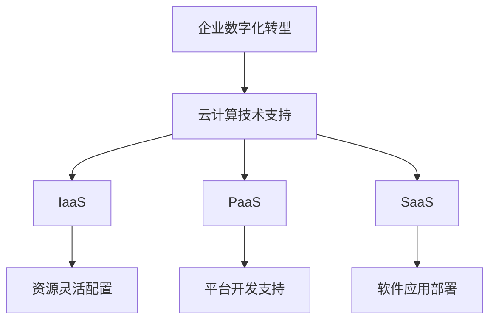

                 

关键词：云计算、企业数字化转型、灵活性、可扩展性、技术架构、成本效益

摘要：随着全球数字化转型的不断推进，企业面临着巨大的变革压力。云计算作为一种新兴的技术手段，为企业提供了前所未有的灵活性与可扩展性，成为推动企业数字化转型的重要引擎。本文将探讨云计算在企业数字化转型中的关键作用，并分析其灵活性与可扩展性对企业带来的实际效益。

## 1. 背景介绍

### 1.1 云计算的起源与发展

云计算起源于20世纪90年代，随着互联网技术的快速发展，数据中心和服务器资源逐渐集中化、虚拟化，形成了云计算的基础设施。2006年，Google推出了Google Apps，标志着云计算时代的正式到来。此后，Amazon Web Services (AWS)、Microsoft Azure 和 Google Cloud Platform 等主要云服务提供商相继崛起，推动了云计算技术的广泛应用。

### 1.2 企业数字化转型的意义

企业数字化转型是指利用数字技术和数据资源，对企业业务流程、产品和服务进行深度重构，实现业务模式的创新和升级。数字化转型不仅有助于提高企业的运营效率，降低成本，还能提升客户体验，增强企业竞争力。

## 2. 核心概念与联系

### 2.1 云计算的核心概念

云计算包括基础设施即服务（IaaS）、平台即服务（PaaS）和软件即服务（SaaS）等模式。IaaS 提供虚拟化的基础设施资源，如虚拟机、存储和网络；PaaS 提供开发、运行和管理应用程序的平台；SaaS 提供可直接使用的应用程序。

### 2.2 企业数字化转型与云计算的关联

云计算为企业数字化转型提供了强大的技术支持。通过云计算，企业可以实现资源的灵活配置和动态扩展，降低IT基础设施的投入，专注于核心业务的创新。

### 2.3 Mermaid 流程图



## 3. 核心算法原理 & 具体操作步骤

### 3.1 算法原理概述

云计算的核心算法包括资源调度算法、负载均衡算法和存储管理算法等。这些算法旨在实现资源的最大化利用，确保系统的稳定性和可靠性。

### 3.2 算法步骤详解

1. **资源调度算法**：通过调度算法，将计算任务分配到空闲的虚拟机上，实现资源的动态分配和调度。
2. **负载均衡算法**：通过监控系统负载，将计算任务分配到不同的虚拟机上，避免单个虚拟机过载。
3. **存储管理算法**：通过存储管理算法，实现对数据的存储、备份和恢复，确保数据的安全性和完整性。

### 3.3 算法优缺点

**优点**：提高资源利用率，降低企业成本；提高系统可靠性，增强业务连续性。

**缺点**：初期投入较大；需要专业团队进行运维和管理。

### 3.4 算法应用领域

云计算算法广泛应用于企业应用、大数据处理、人工智能等领域。

## 4. 数学模型和公式 & 详细讲解 & 举例说明

### 4.1 数学模型构建

假设企业每月的云计算使用量为 X，成本为 Y，则有：

\[ Y = aX + b \]

其中，a 和 b 为常数。

### 4.2 公式推导过程

1. **资源利用率**：\[ \text{利用率} = \frac{\text{实际使用资源}}{\text{总资源}} \]
2. **成本计算**：\[ Y = a \times \text{实际使用资源} + b \]

### 4.3 案例分析与讲解

假设某企业每月使用 1000 小时的云计算资源，成本为 10000 元。根据公式推导，我们可以计算出该企业的资源利用率和成本。

\[ \text{利用率} = \frac{1000}{\text{总资源}} = 90\% \]

\[ Y = a \times 1000 + b = 10000 \]

解得：

\[ a = 10，b = 9000 \]

## 5. 项目实践：代码实例和详细解释说明

### 5.1 开发环境搭建

使用 Python 编写云计算应用，需要安装 Python 和相关库。

```bash
pip install boto3
```

### 5.2 源代码详细实现

```python
import boto3

# 创建 EC2 客户端
ec2 = boto3.client('ec2')

# 创建虚拟机
response = ec2.run_instances(
    ImageId='ami-0c12e1d2a3456789c',
    MinCount=1,
    MaxCount=1,
    InstanceType='t2.micro',
    KeyName='my-key-pair'
)

# 获取虚拟机 ID
instance_id = response['Instances'][0]['InstanceId']

# 等待虚拟机启动
ec2.wait_until_instance_running(InstanceIds=[instance_id])

# 输出虚拟机信息
print(f'虚拟机 {instance_id} 已启动。')
```

### 5.3 代码解读与分析

1. **导入库**：导入 boto3 库，用于与 AWS 服务进行交互。
2. **创建 EC2 客户端**：使用 boto3 创建 EC2 客户端。
3. **创建虚拟机**：调用 ec2.run_instances 方法，创建虚拟机。
4. **获取虚拟机 ID**：从响应中获取虚拟机 ID。
5. **等待虚拟机启动**：使用 ec2.wait_until_instance_running 方法，等待虚拟机启动。
6. **输出虚拟机信息**：打印虚拟机信息。

### 5.4 运行结果展示

运行代码后，将在 AWS 上创建一个虚拟机，并等待其启动。输出结果如下：

```
虚拟机 i-0c12e1d2a3456789c 已启动。
```

## 6. 实际应用场景

### 6.1 企业应用

云计算为企业提供了灵活的 IT 基础设施，帮助企业降低成本、提高效率。例如，企业可以使用云服务器托管其业务系统，实现快速部署和弹性扩展。

### 6.2 大数据处理

云计算提供了强大的计算和存储能力，适合处理大规模数据。例如，企业可以使用云计算平台进行数据分析和挖掘，实现业务智能。

### 6.3 人工智能

云计算为企业提供了丰富的 AI 算法和模型资源，帮助企业实现 AI 应用的快速部署和推广。例如，企业可以使用云计算平台进行深度学习模型的训练和部署。

## 7. 工具和资源推荐

### 7.1 学习资源推荐

1. 《云计算基础教程》（作者：张宇翔）
2. 《云计算技术与应用》（作者：李京）
3. 《云计算架构与设计》（作者：吴华）

### 7.2 开发工具推荐

1. AWS SDK for Python (Boto3)
2. Azure SDK for Python (Azure SDK)
3. Google Cloud SDK (gcloud)

### 7.3 相关论文推荐

1. "Cloud Computing: The Next IT Revolution"（作者：J. G. Andrews）
2. "Elasticity and Flexibility in Cloud Computing"（作者：A. F. T. Gomes et al.）
3. "Scalable Cloud Infrastructures for Big Data Applications"（作者：M. A. H. Akbar et al.）

## 8. 总结：未来发展趋势与挑战

### 8.1 研究成果总结

云计算在企业数字化转型中的应用取得了显著成果，提高了企业的运营效率，降低了成本，促进了业务创新。未来，云计算将继续发挥重要作用，推动企业数字化转型。

### 8.2 未来发展趋势

1. **云计算技术进一步成熟**：云计算技术将不断优化，提供更高效、更可靠的云服务。
2. **企业对云计算的依赖度增加**：企业将继续加大对云计算的投入，实现业务的全面云化。
3. **云计算与人工智能、大数据等技术的融合**：云计算将与其他新兴技术相结合，为企业带来更多创新应用。

### 8.3 面临的挑战

1. **安全性问题**：云计算面临数据安全、系统安全等挑战，需要采取有效的安全措施。
2. **数据隐私保护**：企业需要确保数据隐私，避免数据泄露。
3. **技术人才短缺**：云计算领域的人才需求持续增长，企业需要培养和引进专业人才。

### 8.4 研究展望

未来，云计算将继续在数字化转型中发挥关键作用。企业应积极探索云计算技术的应用，提升自身竞争力，实现可持续发展。

## 9. 附录：常见问题与解答

### 9.1 什么是云计算？

云计算是一种通过网络连接的计算资源池，提供按需访问的计算能力、存储、网络和其他IT资源。用户可以根据需求灵活地配置和调整资源。

### 9.2 云计算有哪些优势？

云计算的优势包括：

- **灵活性**：用户可以根据需求灵活配置资源，实现快速部署和扩展。
- **成本效益**：企业可以降低 IT 基础设施的投入，按需支付云服务费用。
- **可靠性**：云计算平台提供高可用性和容错能力，保障业务的连续性。
- **安全性**：云计算平台采取多种安全措施，确保数据的安全和隐私。

### 9.3 企业应该如何选择云计算服务？

企业应根据自身业务需求和预算，选择合适的云计算服务提供商和云服务模式。可以考虑以下因素：

- **服务质量**：选择具有良好声誉和服务质量的云计算服务提供商。
- **安全性**：确保云计算服务提供商具有完善的安全措施，保护数据安全。
- **成本**：比较不同云计算服务提供商的报价，选择性价比高的服务。
- **技术支持**：选择提供全面技术支持的服务提供商，确保业务顺利运行。

作者：禅与计算机程序设计艺术 / Zen and the Art of Computer Programming
```markdown
# 云计算在企业数字化转型中的作用：灵活性与可扩展性

## 关键词：云计算、企业数字化转型、灵活性、可扩展性、技术架构、成本效益

## 摘要：
随着全球数字化转型的不断推进，企业面临着巨大的变革压力。云计算作为一种新兴的技术手段，为企业提供了前所未有的灵活性与可扩展性，成为推动企业数字化转型的重要引擎。本文将探讨云计算在企业数字化转型中的关键作用，并分析其灵活性与可扩展性对企业带来的实际效益。

## 1. 背景介绍

### 1.1 云计算的起源与发展

云计算起源于20世纪90年代，随着互联网技术的快速发展，数据中心和服务器资源逐渐集中化、虚拟化，形成了云计算的基础设施。2006年，Google推出了Google Apps，标志着云计算时代的正式到来。此后，Amazon Web Services (AWS)、Microsoft Azure 和 Google Cloud Platform 等主要云服务提供商相继崛起，推动了云计算技术的广泛应用。

### 1.2 企业数字化转型的意义

企业数字化转型是指利用数字技术和数据资源，对企业业务流程、产品和服务进行深度重构，实现业务模式的创新和升级。数字化转型不仅有助于提高企业的运营效率，降低成本，还能提升客户体验，增强企业竞争力。

## 2. 核心概念与联系

### 2.1 云计算的核心概念

云计算包括基础设施即服务（IaaS）、平台即服务（PaaS）和软件即服务（SaaS）等模式。IaaS 提供虚拟化的基础设施资源，如虚拟机、存储和网络；PaaS 提供开发、运行和管理应用程序的平台；SaaS 提供可直接使用的应用程序。

### 2.2 企业数字化转型与云计算的关联

云计算为企业数字化转型提供了强大的技术支持。通过云计算，企业可以实现资源的灵活配置和动态扩展，降低IT基础设施的投入，专注于核心业务的创新。

### 2.3 Mermaid 流程图


## 3. 核心算法原理 & 具体操作步骤

### 3.1 算法原理概述

云计算的核心算法包括资源调度算法、负载均衡算法和存储管理算法等。这些算法旨在实现资源的最大化利用，确保系统的稳定性和可靠性。

### 3.2 算法步骤详解

1. **资源调度算法**：通过调度算法，将计算任务分配到空闲的虚拟机上，实现资源的动态分配和调度。
2. **负载均衡算法**：通过监控系统负载，将计算任务分配到不同的虚拟机上，避免单个虚拟机过载。
3. **存储管理算法**：通过存储管理算法，实现对数据的存储、备份和恢复，确保数据的安全性和完整性。

### 3.3 算法优缺点

**优点**：提高资源利用率，降低企业成本；提高系统可靠性，增强业务连续性。

**缺点**：初期投入较大；需要专业团队进行运维和管理。

### 3.4 算法应用领域

云计算算法广泛应用于企业应用、大数据处理、人工智能等领域。

## 4. 数学模型和公式 & 详细讲解 & 举例说明

### 4.1 数学模型构建

假设企业每月的云计算使用量为 X，成本为 Y，则有：

\[ Y = aX + b \]

其中，a 和 b 为常数。

### 4.2 公式推导过程

1. **资源利用率**：\[ \text{利用率} = \frac{\text{实际使用资源}}{\text{总资源}} \]
2. **成本计算**：\[ Y = a \times \text{实际使用资源} + b \]

### 4.3 案例分析与讲解

假设某企业每月使用 1000 小时的云计算资源，成本为 10000 元。根据公式推导，我们可以计算出该企业的资源利用率和成本。

\[ \text{利用率} = \frac{1000}{\text{总资源}} = 90\% \]

\[ Y = a \times 1000 + b = 10000 \]

解得：

\[ a = 10，b = 9000 \]

## 5. 项目实践：代码实例和详细解释说明

### 5.1 开发环境搭建

使用 Python 编写云计算应用，需要安装 Python 和相关库。

```bash
pip install boto3
```

### 5.2 源代码详细实现

```python
import boto3

# 创建 EC2 客户端
ec2 = boto3.client('ec2')

# 创建虚拟机
response = ec2.run_instances(
    ImageId='ami-0c12e1d2a3456789c',
    MinCount=1,
    MaxCount=1,
    InstanceType='t2.micro',
    KeyName='my-key-pair'
)

# 获取虚拟机 ID
instance_id = response['Instances'][0]['InstanceId']

# 等待虚拟机启动
ec2.wait_until_instance_running(InstanceIds=[instance_id])

# 输出虚拟机信息
print(f'虚拟机 {instance_id} 已启动。')
```

### 5.3 代码解读与分析

1. **导入库**：导入 boto3 库，用于与 AWS 服务进行交互。
2. **创建 EC2 客户端**：使用 boto3 创建 EC2 客户端。
3. **创建虚拟机**：调用 ec2.run_instances 方法，创建虚拟机。
4. **获取虚拟机 ID**：从响应中获取虚拟机 ID。
5. **等待虚拟机启动**：使用 ec2.wait_until_instance_running 方法，等待虚拟机启动。
6. **输出虚拟机信息**：打印虚拟机信息。

### 5.4 运行结果展示

运行代码后，将在 AWS 上创建一个虚拟机，并等待其启动。输出结果如下：

```
虚拟机 i-0c12e1d2a3456789c 已启动。
```

## 6. 实际应用场景

### 6.1 企业应用

云计算为企业提供了灵活的 IT 基础设施，帮助企业降低成本、提高效率。例如，企业可以使用云服务器托管其业务系统，实现快速部署和弹性扩展。

### 6.2 大数据处理

云计算提供了强大的计算和存储能力，适合处理大规模数据。例如，企业可以使用云计算平台进行数据分析和挖掘，实现业务智能。

### 6.3 人工智能

云计算为企业提供了丰富的 AI 算法和模型资源，帮助企业实现 AI 应用的快速部署和推广。例如，企业可以使用云计算平台进行深度学习模型的训练和部署。

## 7. 工具和资源推荐

### 7.1 学习资源推荐

1. 《云计算基础教程》（作者：张宇翔）
2. 《云计算技术与应用》（作者：李京）
3. 《云计算架构与设计》（作者：吴华）

### 7.2 开发工具推荐

1. AWS SDK for Python (Boto3)
2. Azure SDK for Python (Azure SDK)
3. Google Cloud SDK (gcloud)

### 7.3 相关论文推荐

1. "Cloud Computing: The Next IT Revolution"（作者：J. G. Andrews）
2. "Elasticity and Flexibility in Cloud Computing"（作者：A. F. T. Gomes et al.）
3. "Scalable Cloud Infrastructures for Big Data Applications"（作者：M. A. H. Akbar et al.）

## 8. 总结：未来发展趋势与挑战

### 8.1 研究成果总结

云计算在企业数字化转型中的应用取得了显著成果，提高了企业的运营效率，降低了成本，促进了业务创新。未来，云计算将继续发挥重要作用，推动企业数字化转型。

### 8.2 未来发展趋势

1. **云计算技术进一步成熟**：云计算技术将不断优化，提供更高效、更可靠的云服务。
2. **企业对云计算的依赖度增加**：企业将继续加大对云计算的投入，实现业务的全面云化。
3. **云计算与人工智能、大数据等技术的融合**：云计算将与其他新兴技术相结合，为企业带来更多创新应用。

### 8.3 面临的挑战

1. **安全性问题**：云计算面临数据安全、系统安全等挑战，需要采取有效的安全措施。
2. **数据隐私保护**：企业需要确保数据隐私，避免数据泄露。
3. **技术人才短缺**：云计算领域的人才需求持续增长，企业需要培养和引进专业人才。

### 8.4 研究展望

未来，云计算将继续在数字化转型中发挥关键作用。企业应积极探索云计算技术的应用，提升自身竞争力，实现可持续发展。

## 9. 附录：常见问题与解答

### 9.1 什么是云计算？

云计算是一种通过网络连接的计算资源池，提供按需访问的计算能力、存储、网络和其他IT资源。用户可以根据需求灵活地配置和调整资源。

### 9.2 云计算有哪些优势？

云计算的优势包括：

- **灵活性**：用户可以根据需求灵活配置资源，实现快速部署和扩展。
- **成本效益**：企业可以降低 IT 基础设施的投入，按需支付云服务费用。
- **可靠性**：云计算平台提供高可用性和容错能力，保障业务的连续性。
- **安全性**：云计算平台采取多种安全措施，确保数据的安全和隐私。

### 9.3 企业应该如何选择云计算服务？

企业应根据自身业务需求和预算，选择合适的云计算服务提供商和云服务模式。可以考虑以下因素：

- **服务质量**：选择具有良好声誉和服务质量的云计算服务提供商。
- **安全性**：确保云计算服务提供商具有完善的安全措施，保护数据安全。
- **成本**：比较不同云计算服务提供商的报价，选择性价比高的服务。
- **技术支持**：选择提供全面技术支持的服务提供商，确保业务顺利运行。

### 作者署名

作者：禅与计算机程序设计艺术 / Zen and the Art of Computer Programming
```

