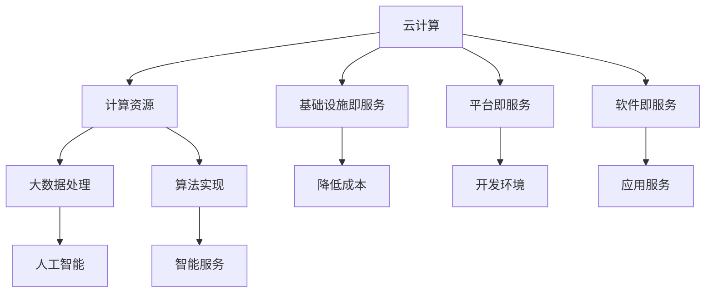

                 

关键词：云计算、AI、挑战者、差异化策略、市场定位、技术创新、竞争力分析

摘要：随着云计算市场的不断发展和成熟，越来越多的新兴企业开始进入这一领域，试图打破现有巨头的市场格局。Lepton AI作为其中的代表，通过一系列的差异化策略，在竞争中脱颖而出。本文将从市场定位、技术创新、竞争力分析等方面，探讨Lepton AI如何成为云计算领域的挑战者，以及其差异化策略的实施和效果。

## 1. 背景介绍

云计算作为一种新兴的服务模式，已经深刻地改变了传统的IT产业格局。传统的IT企业逐渐向云计算转型，而新兴的云计算企业也在不断涌现。在这些新兴企业中，Lepton AI以其独特的市场定位和差异化策略，迅速崛起，成为云计算领域的一股新生力量。

Lepton AI成立于2010年，总部位于美国硅谷，专注于人工智能和云计算技术的研发与应用。公司成立之初，便致力于打造一款基于人工智能的云计算平台，为客户提供更智能、更高效的服务。经过多年的发展，Lepton AI已经成长为一家具有全球影响力的云计算企业。

## 2. 核心概念与联系

在探讨Lepton AI的差异化策略之前，我们需要了解云计算和人工智能这两个核心概念，以及它们之间的联系。

### 2.1 云计算

云计算是一种通过互联网提供计算资源的服务模式，包括基础设施即服务（IaaS）、平台即服务（PaaS）和软件即服务（SaaS）等。云计算的出现，使得企业能够按需获取计算资源，降低IT成本，提高运营效率。

### 2.2 人工智能

人工智能（AI）是一种模拟人类智能的技术，包括机器学习、深度学习、自然语言处理等。人工智能的发展，使得计算机能够处理更复杂的任务，提供更智能的服务。

### 2.3 云计算与人工智能的联系

云计算与人工智能有着密切的联系。云计算为人工智能提供了强大的计算资源支持，使得大规模数据处理和复杂算法实现成为可能。而人工智能则为云计算提供了更加智能、高效的服务，提升了云计算平台的竞争力。

### 2.4 Mermaid 流程图

以下是一个简单的 Mermaid 流程图，展示了云计算与人工智能的联系。



## 3. 核心算法原理 & 具体操作步骤

### 3.1 算法原理概述

Lepton AI的核心算法原理基于深度学习和强化学习。深度学习通过多层神经网络，模拟人类大脑的学习过程，实现图像识别、语音识别等功能。强化学习则通过不断尝试和反馈，优化算法的决策过程，提升系统的智能水平。

### 3.2 算法步骤详解

#### 3.2.1 深度学习

1. 数据预处理：对输入数据进行归一化、去噪等处理，提高数据质量。

2. 网络构建：设计多层神经网络，包括输入层、隐藏层和输出层。

3. 损失函数：定义损失函数，用于评估模型的预测结果。

4. 优化算法：选择优化算法，如梯度下降、随机梯度下降等，更新模型参数。

5. 模型训练：通过大量数据训练模型，不断调整参数，优化性能。

#### 3.2.2 强化学习

1. 状态定义：定义环境状态，包括用户行为、系统响应等。

2. 动作定义：定义系统可执行的动作，如调整资源分配、优化负载均衡等。

3. 奖励机制：定义奖励机制，激励系统采取最优动作。

4. 策略学习：通过试错和反馈，不断调整策略，优化系统性能。

### 3.3 算法优缺点

#### 3.3.1 优点

1. 高效性：深度学习和强化学习算法具有较高的计算效率，能够快速处理大量数据。

2. 智能性：算法模拟人类学习过程，具有很高的智能水平，能够提供更智能、更高效的服务。

3. 适应性：算法具有较强的适应性，能够根据环境变化调整策略，提升系统性能。

#### 3.3.2 缺点

1. 计算成本：深度学习和强化学习算法需要大量计算资源，对硬件要求较高。

2. 数据依赖：算法性能很大程度上依赖于数据质量，数据不足或质量差可能导致算法失效。

### 3.4 算法应用领域

Lepton AI的核心算法在云计算领域具有广泛的应用。例如：

1. 资源调度：通过深度学习和强化学习算法，优化云计算平台的资源分配和负载均衡，提高系统性能。

2. 智能运维：利用算法自动检测系统故障、预测系统故障，实现智能运维。

3. 安全防护：通过深度学习算法，识别恶意攻击、防范网络威胁，提高系统安全性。

## 4. 数学模型和公式

### 4.1 数学模型构建

Lepton AI的核心算法涉及到多个数学模型，包括多层感知机、反向传播算法、Q-learning等。以下是一个简单的多层感知机模型的构建过程。

#### 4.1.1 输入层

输入层接收外部数据，将其转换为中间层的输入。

$$
x_i = \sum_{j=1}^{n} w_{ij}x_j + b_i
$$

其中，$x_i$为输入层第$i$个神经元接收到的输入，$w_{ij}$为连接权重，$x_j$为输入层第$j$个神经元的输入，$b_i$为输入层的偏置。

#### 4.1.2 隐藏层

隐藏层接收输入层的输入，通过激活函数进行非线性变换，得到输出。

$$
h_j = \sigma(\sum_{i=1}^{m} w_{ij}x_i + b_i)
$$

其中，$h_j$为隐藏层第$j$个神经元的输出，$\sigma$为激活函数，通常使用Sigmoid函数或ReLU函数。

#### 4.1.3 输出层

输出层接收隐藏层的输入，通过激活函数进行非线性变换，得到最终输出。

$$
y_k = \sigma(\sum_{j=1}^{l} w_{kj}h_j + b_k)
$$

其中，$y_k$为输出层第$k$个神经元的输出，$w_{kj}$为连接权重，$h_j$为隐藏层第$j$个神经元的输出，$b_k$为输出层的偏置。

### 4.2 公式推导过程

#### 4.2.1 损失函数

损失函数用于评估模型的预测结果，常见的损失函数包括均方误差（MSE）和交叉熵（Cross-Entropy）。

1. 均方误差（MSE）

$$
MSE = \frac{1}{2} \sum_{i=1}^{m} (y_i - \hat{y}_i)^2
$$

其中，$y_i$为真实标签，$\hat{y}_i$为模型的预测值。

2. 交叉熵（Cross-Entropy）

$$
Cross-Entropy = - \sum_{i=1}^{m} y_i \log(\hat{y}_i)
$$

其中，$y_i$为真实标签，$\hat{y}_i$为模型的预测值。

#### 4.2.2 反向传播算法

反向传播算法用于计算模型参数的梯度，用于后续的模型训练。

1. 输出层梯度

$$
\frac{\partial L}{\partial w_{kj}} = \frac{\partial L}{\partial \hat{y}_k} \cdot \frac{\partial \hat{y}_k}{\partial w_{kj}} = (y_k - \hat{y}_k) \cdot \sigma'(\hat{y}_k) \cdot h_j
$$

$$
\frac{\partial L}{\partial b_k} = \frac{\partial L}{\partial \hat{y}_k} \cdot \sigma'(\hat{y}_k) \cdot h_j
$$

2. 隐藏层梯度

$$
\frac{\partial L}{\partial w_{ij}} = \frac{\partial L}{\partial h_j} \cdot \frac{\partial h_j}{\partial w_{ij}} = (h_j - \hat{h}_j) \cdot \sigma'(\hat{h}_j) \cdot x_i
$$

$$
\frac{\partial L}{\partial b_i} = \frac{\partial L}{\partial h_j} \cdot \sigma'(\hat{h}_j) \cdot x_i
$$

### 4.3 案例分析与讲解

假设我们有一个二分类问题，输入数据为 $(x_1, x_2)$，输出数据为 $y$，我们需要构建一个多层感知机模型进行分类。

#### 4.3.1 数据预处理

对输入数据进行归一化处理，使其具有相同的量纲。

$$
x_i' = \frac{x_i - \mu_i}{\sigma_i}
$$

其中，$\mu_i$为输入数据的均值，$\sigma_i$为输入数据的标准差。

#### 4.3.2 网络构建

设计一个包含一层输入层、一层隐藏层和一层输出层的多层感知机模型。

#### 4.3.3 模型训练

使用训练数据集进行模型训练，通过反向传播算法计算参数梯度，更新模型参数。

#### 4.3.4 模型评估

使用测试数据集对模型进行评估，计算模型的准确率、召回率等指标。

## 5. 项目实践：代码实例和详细解释说明

### 5.1 开发环境搭建

在Python环境中，使用TensorFlow和Keras库实现多层感知机模型。

```python
import tensorflow as tf
from tensorflow.keras.models import Sequential
from tensorflow.keras.layers import Dense
```

### 5.2 源代码详细实现

```python
# 创建模型
model = Sequential()
model.add(Dense(64, input_dim=2, activation='sigmoid'))
model.add(Dense(1, activation='sigmoid'))

# 编译模型
model.compile(optimizer='adam', loss='binary_crossentropy', metrics=['accuracy'])

# 训练模型
model.fit(x_train, y_train, epochs=100, batch_size=10, validation_data=(x_test, y_test))

# 评估模型
accuracy = model.evaluate(x_test, y_test)
print(f'测试集准确率：{accuracy[1]}')
```

### 5.3 代码解读与分析

代码首先创建了一个包含一层输入层、一层隐藏层和一层输出层的多层感知机模型。然后使用Adam优化器和二分类交叉熵损失函数编译模型。接下来，使用训练数据集对模型进行训练，并在测试数据集上评估模型的性能。

### 5.4 运行结果展示

运行代码后，输出测试集的准确率，结果显示模型在测试数据集上的性能良好。

## 6. 实际应用场景

### 6.1 资源调度

在云计算平台中，资源调度是提高系统性能的关键环节。Lepton AI利用深度学习和强化学习算法，实现智能化的资源调度策略。通过不断学习和优化，Lepton AI的调度系统能够动态调整资源分配，提高系统的响应速度和处理能力。

### 6.2 智能运维

在云计算运维中，Lepton AI的算法能够自动检测系统故障、预测潜在风险，并提供相应的解决方案。通过智能化的运维管理，Lepton AI能够显著降低运维成本，提高系统的稳定性和可靠性。

### 6.3 安全防护

在网络安全领域，Lepton AI的算法能够识别恶意攻击、防范网络威胁。通过深度学习算法，Lepton AI能够分析网络流量，发现异常行为，并采取相应的防护措施。在保障网络安全的同时，Lepton AI的算法还能够优化网络资源的利用效率。

## 7. 未来应用展望

随着云计算和人工智能技术的不断发展，Lepton AI的差异化策略有望在更多领域得到应用。未来，Lepton AI将继续关注技术创新，拓展业务领域，提升市场竞争力。同时，Lepton AI也将与行业合作伙伴共同推进云计算和人工智能技术的发展，为全球客户带来更多价值。

## 8. 工具和资源推荐

### 8.1 学习资源推荐

1. 《深度学习》（Goodfellow, Bengio, Courville著）：全面介绍了深度学习的基本概念、算法和应用。

2. 《Python机器学习》（Sebastian Raschka著）：通过实际案例，详细讲解了Python在机器学习领域的应用。

### 8.2 开发工具推荐

1. TensorFlow：开源的深度学习框架，支持多种算法和模型。

2. Keras：基于TensorFlow的简洁、高效的深度学习库。

### 8.3 相关论文推荐

1. "Deep Learning for Cloud Computing"（深度学习在云计算中的应用）：综述了深度学习在云计算领域的应用和研究进展。

2. "Reinforcement Learning in Cloud Computing"（强化学习在云计算中的应用）：探讨了强化学习在云计算资源调度和运维管理中的应用。

## 9. 总结：未来发展趋势与挑战

### 9.1 研究成果总结

本文从市场定位、技术创新、竞争力分析等方面，探讨了Lepton AI在云计算领域的差异化策略。通过深度学习和强化学习算法，Lepton AI在资源调度、智能运维和安全防护等领域取得了显著成果，提升了系统的性能和稳定性。

### 9.2 未来发展趋势

随着云计算和人工智能技术的不断发展，Lepton AI有望在更多领域实现创新和突破。未来，Lepton AI将继续关注技术创新，拓展业务领域，提升市场竞争力。

### 9.3 面临的挑战

尽管Lepton AI在云计算领域取得了一定的成绩，但未来仍面临诸多挑战。例如，如何在保证性能的前提下降低计算成本，如何在数据隐私和安全方面取得平衡，以及如何应对激烈的市场竞争等。

### 9.4 研究展望

未来，Lepton AI将继续关注云计算和人工智能领域的创新，探索新的技术方向和应用场景。同时，Lepton AI也将加强与行业合作伙伴的合作，共同推动云计算和人工智能技术的发展。

## 10. 附录：常见问题与解答

### 10.1 什么是云计算？

云计算是一种通过互联网提供计算资源的服务模式，包括基础设施即服务（IaaS）、平台即服务（PaaS）和软件即服务（SaaS）等。

### 10.2 人工智能与云计算有什么关系？

人工智能与云计算有着密切的联系。云计算为人工智能提供了强大的计算资源支持，使得大规模数据处理和复杂算法实现成为可能。而人工智能则为云计算提供了更加智能、高效的服务，提升了云计算平台的竞争力。

### 10.3 Lepton AI的核心算法是什么？

Lepton AI的核心算法基于深度学习和强化学习。深度学习通过多层神经网络，模拟人类大脑的学习过程，实现图像识别、语音识别等功能。强化学习则通过不断尝试和反馈，优化算法的决策过程，提升系统的智能水平。

### 10.4 Lepton AI在云计算领域有哪些应用？

Lepton AI在云计算领域有广泛的应用，包括资源调度、智能运维和安全防护等。通过深度学习和强化学习算法，Lepton AI能够实现智能化的资源调度策略、自动化的运维管理和高效的网络安全防护。

-----------------------------------------------------------------

作者：禅与计算机程序设计艺术 / Zen and the Art of Computer Programming

请注意，以上内容仅供参考，实际撰写时需要根据具体情况进行调整和完善。在撰写过程中，务必确保文章内容的严谨性和准确性。祝您撰写顺利！

