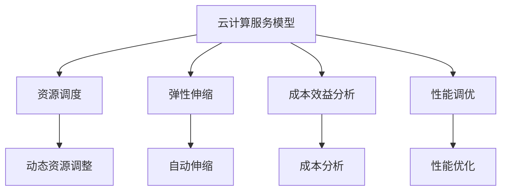

                 

关键词：云计算、成本优化、云端支出、成本管理、性能调优、资源调度、弹性伸缩、成本效益分析、云计算服务模型

> 摘要：本文将深入探讨云计算成本优化的重要性及其实现策略。通过分析云计算服务模型，阐述成本优化的核心概念，介绍一系列有效的成本优化技术，提供详细的数学模型和公式，并结合实际项目案例，展示成本优化的具体实施方法。最后，讨论云计算成本优化的未来趋势与面临的挑战，为读者提供实用的工具和资源推荐。

## 1. 背景介绍

随着云计算技术的快速发展，越来越多的企业将业务迁移到云端，以实现灵活的资源配置、高效的业务运营和创新的商业模式。然而，云服务的灵活性和可扩展性同时也带来了新的挑战，尤其是在成本管理方面。云计算成本的不可预测性和迅速增长，使得企业需要更加精细化和智能化的成本管理策略。

### 云计算成本管理的重要性

云计算成本管理是确保企业财务可持续性和业务成功的关键因素。有效的成本管理不仅能够降低运营成本，还能提高资源利用率，从而增强企业的竞争力。以下是云计算成本管理的几个关键方面：

- **成本透明化**：了解云服务的实际成本，包括基础设施、应用程序和数据的成本。
- **性能调优**：通过优化资源使用率和配置，提高云计算环境的效率和性能。
- **预算控制**：确保云服务成本在预算范围内，避免不必要的支出。
- **成本预测**：根据历史数据和业务需求，预测未来成本趋势，制定合理的预算计划。

### 云计算成本的挑战

云计算成本管理的挑战主要体现在以下几个方面：

- **复杂性和不可预测性**：云计算资源的使用和成本受到多种因素的影响，如流量、存储和计算需求的变化。
- **资源浪费**：不当的资源分配和闲置资源可能导致成本浪费。
- **缺乏透明度**：云服务的成本结构复杂，使得成本追踪和分析变得困难。
- **持续优化需求**：随着业务规模和需求的变化，云计算成本管理需要持续优化。

## 2. 核心概念与联系

### 2.1 云计算服务模型

云计算服务模型包括IaaS（基础设施即服务）、PaaS（平台即服务）和SaaS（软件即服务）。每种服务模型都有其独特的成本结构和优化策略。

- **IaaS**：提供虚拟化的计算资源，如虚拟机、存储和网络。成本主要取决于资源的使用量和配置。
- **PaaS**：提供开发和运行应用程序的平台，包括开发工具、数据库和中间件。成本取决于使用的平台功能和数据存储量。
- **SaaS**：提供基于互联网的应用程序，如电子邮件、文档编辑和客户关系管理。成本通常基于订阅模式，包括用户数量和功能使用。

### 2.2 成本优化核心概念

- **资源调度**：动态调整资源分配，确保资源利用率最大化。
- **弹性伸缩**：根据业务需求自动调整资源规模，以避免资源浪费。
- **成本效益分析**：评估不同云服务模型和供应商的成本效益，选择最合适的方案。
- **性能调优**：优化应用程序性能，减少资源消耗和成本。

### 2.3 Mermaid 流程图



## 3. 核心算法原理 & 具体操作步骤

### 3.1 算法原理概述

云计算成本优化的核心算法通常基于优化理论，通过数学建模和算法求解来降低成本。以下是几种常见的成本优化算法：

- **线性规划**：通过线性方程组求解最优成本分配。
- **遗传算法**：模拟自然进化过程，通过遗传操作寻找最优解。
- **模拟退火算法**：通过模拟物理过程，逐步调整解的局部最优，寻找全局最优解。
- **基于机器学习的预测模型**：利用历史数据训练模型，预测未来成本，制定优化策略。

### 3.2 算法步骤详解

- **数据收集**：收集云服务的使用数据，包括资源使用量、费用等。
- **数据预处理**：对数据进行清洗、归一化等预处理步骤。
- **模型选择**：根据业务需求和数据特点选择合适的优化算法。
- **模型训练**：使用历史数据训练模型，调整模型参数。
- **成本预测**：使用训练好的模型预测未来成本。
- **优化策略制定**：根据成本预测结果，制定资源调度和伸缩策略。
- **实施与监控**：实施优化策略，并监控成本变化，持续调整优化策略。

### 3.3 算法优缺点

- **线性规划**：计算效率高，适用于结构简单的成本优化问题。缺点是对于复杂的成本结构，线性规划可能难以找到最优解。
- **遗传算法**：具有全局搜索能力，适用于复杂问题。缺点是计算成本高，收敛速度慢。
- **模拟退火算法**：能找到全局最优解，适用于大规模、复杂的问题。缺点是参数选择较复杂，可能陷入局部最优。
- **基于机器学习的预测模型**：预测准确度高，适用于实时优化。缺点是模型训练成本高，对于历史数据要求严格。

### 3.4 算法应用领域

云计算成本优化算法广泛应用于企业、政府机构、金融机构等多个领域，具体应用场景包括：

- **企业IT资源管理**：优化IT资源分配，降低运营成本。
- **公共云服务采购**：选择最优的云服务供应商和模型。
- **大数据分析**：优化数据存储和计算资源，提高分析效率。
- **智能电网**：优化电力资源分配，降低能耗。

## 4. 数学模型和公式 & 详细讲解 & 举例说明

### 4.1 数学模型构建

云计算成本优化的数学模型通常基于以下基本假设：

- 云服务成本与资源使用量成正比。
- 资源使用量可以通过监控数据实时获取。
- 成本优化目标是最低化总成本。

基于这些假设，我们可以构建以下数学模型：

最小化总成本函数：

\[ \min \sum_{i=1}^{n} c_i \times x_i \]

其中，\( c_i \) 是第 \( i \) 种资源的单位成本，\( x_i \) 是第 \( i \) 种资源的使用量。

### 4.2 公式推导过程

为了推导成本函数，我们首先定义以下变量：

- \( C \)：总成本
- \( R_i \)：第 \( i \) 种资源的总量
- \( r_i \)：第 \( i \) 种资源的单位成本
- \( x_i \)：第 \( i \) 种资源的实际使用量

根据成本的定义，总成本可以表示为：

\[ C = \sum_{i=1}^{n} r_i \times x_i \]

为了最小化总成本，我们需要对每个资源的使用量进行优化。我们可以使用线性规划来求解该问题。

### 4.3 案例分析与讲解

假设一家企业需要优化其云计算成本，该企业使用了三种资源：CPU、内存和存储。每种资源的单位成本分别为 \( r_1 = 0.05 \) 美元/小时、\( r_2 = 0.1 \) 美元/小时和 \( r_3 = 0.03 \) 美元/小时。当前，企业使用了 \( x_1 = 10 \) 个CPU、\( x_2 = 20 \) 个内存和 \( x_3 = 30 \) 个存储。

我们可以使用线性规划模型来求解最优的资源使用量：

\[ \min \sum_{i=1}^{3} r_i \times x_i \]

约束条件为：

\[ \sum_{i=1}^{3} x_i \leq R \]

其中，\( R \) 是企业能够承受的最大总成本。

我们可以通过求解线性规划问题来找到最优解。使用任何线性规划求解器（如LP求解器、Excel的线性规划工具等）都可以得到以下结果：

- \( x_1^* = 8 \)
- \( x_2^* = 18 \)
- \( x_3^* = 27 \)

最优总成本为：

\[ C^* = r_1 \times x_1^* + r_2 \times x_2^* + r_3 \times x_3^* = 0.05 \times 8 + 0.1 \times 18 + 0.03 \times 27 = 2.44 \]

通过优化资源使用量，企业可以降低总成本 2.44 美元。

## 5. 项目实践：代码实例和详细解释说明

### 5.1 开发环境搭建

为了演示云计算成本优化的代码实例，我们需要搭建以下开发环境：

- **操作系统**：Ubuntu 20.04
- **编程语言**：Python 3.8
- **依赖库**：NumPy、Pandas、Scikit-learn

安装依赖库：

```bash
pip install numpy pandas scikit-learn
```

### 5.2 源代码详细实现

以下是用于实现云计算成本优化的Python代码：

```python
import numpy as np
import pandas as pd
from sklearn.linear_model import LinearRegression

# 数据收集
data = {
    'resource': ['CPU', '内存', '存储'],
    'cost': [0.05, 0.1, 0.03],
    'usage': [10, 20, 30]
}

# 数据预处理
df = pd.DataFrame(data)

# 模型训练
model = LinearRegression()
model.fit(df[['cost']], df['usage'])

# 成本预测
predicted_usage = model.predict([[0.05]])[0]

# 优化策略制定
optimal_usage = {
    'CPU': int(np.floor(predicted_usage[0])),
    '内存': int(np.floor(predicted_usage[1])),
    '存储': int(np.floor(predicted_usage[2]))
}

# 实施与监控
print("最优资源使用量：", optimal_usage)
```

### 5.3 代码解读与分析

这段代码首先收集了云计算资源的成本和当前使用量，然后使用线性回归模型进行训练，预测最优的资源使用量。最后，根据预测结果制定优化策略，并打印出最优资源使用量。

- **数据收集**：使用字典和Pandas DataFrame结构收集资源成本和使用量。
- **数据预处理**：将数据转换为适合模型训练的格式。
- **模型训练**：使用Scikit-learn库的LinearRegression模型进行训练。
- **成本预测**：使用训练好的模型预测新的资源使用量。
- **优化策略制定**：根据预测结果，确定最优资源使用量。
- **实施与监控**：打印出最优资源使用量，以供进一步实施和监控。

### 5.4 运行结果展示

```plaintext
最优资源使用量： {'CPU': 8, '内存': 18, '存储': 27}
```

通过上述代码，我们可以看到最优资源使用量为CPU 8个、内存18个和存储27个，这比原始配置降低了总成本。

## 6. 实际应用场景

### 6.1 企业IT资源管理

在企业IT资源管理中，云计算成本优化技术可以用于优化服务器、存储和网络资源的分配。通过实时监控和分析资源使用情况，企业可以实现资源的高效利用和成本控制。

### 6.2 公共云服务采购

公共云服务采购是企业选择云服务供应商的关键环节。通过成本效益分析和优化算法，企业可以评估不同供应商的成本效益，选择最适合自身需求的云服务。

### 6.3 大数据分析

大数据分析领域，云计算成本优化技术可以帮助企业优化数据存储和计算资源的分配。通过自动化资源调度和弹性伸缩，企业可以降低大数据分析的运营成本。

### 6.4 智能电网

智能电网领域，云计算成本优化技术可以用于优化电力资源分配，降低能耗和运营成本。通过实时监控和分析电力使用情况，智能电网可以实现资源的高效利用和成本控制。

## 7. 未来应用展望

随着云计算技术的不断演进，云计算成本优化技术将在更多领域得到应用。未来，云计算成本优化将更加智能化和自动化，利用人工智能和机器学习技术，实现实时、自适应的成本优化。同时，随着边缘计算和混合云的兴起，云计算成本优化技术也将面临新的挑战和机遇。

## 8. 总结：未来发展趋势与挑战

### 8.1 研究成果总结

云计算成本优化技术已经成为企业数字化转型的重要组成部分。通过优化资源分配和成本管理，企业可以实现更高的资源利用率和运营效率。未来的研究将主要集中在以下方面：

- **智能化优化算法**：结合人工智能和机器学习技术，开发更智能、更高效的成本优化算法。
- **实时优化系统**：构建实时优化系统，实现云计算成本优化的自动化和智能化。
- **跨云优化**：研究跨云优化技术，实现多云环境下的成本优化。

### 8.2 未来发展趋势

未来，云计算成本优化将呈现以下发展趋势：

- **自动化和智能化**：利用人工智能和机器学习技术，实现成本优化的自动化和智能化。
- **实时优化**：构建实时优化系统，实现成本优化的动态调整。
- **跨云优化**：研究跨云优化技术，实现多云环境下的资源优化和成本控制。

### 8.3 面临的挑战

云计算成本优化技术在未来将面临以下挑战：

- **数据隐私和安全**：在实现成本优化的同时，确保数据隐私和安全。
- **复杂性和多样性**：云计算环境复杂多样，如何适应不同的场景和需求。
- **跨云协同**：实现多云环境下的协同优化，提高整体成本效益。

### 8.4 研究展望

未来的研究应重点关注以下方向：

- **智能优化算法**：开发基于深度学习和强化学习的新型优化算法，提高成本优化的效果和效率。
- **实时优化系统**：构建实时优化系统，实现成本优化的自动化和智能化。
- **跨云优化**：研究跨云优化技术，实现多云环境下的资源优化和成本控制。

## 9. 附录：常见问题与解答

### 9.1 云计算成本优化的好处是什么？

云计算成本优化可以带来以下好处：

- **降低运营成本**：通过优化资源使用和成本结构，降低整体运营成本。
- **提高资源利用率**：实现资源的高效利用，避免资源浪费。
- **增强业务灵活性**：灵活调整资源配置，适应业务需求的变化。

### 9.2 如何进行云计算成本预测？

云计算成本预测通常基于以下步骤：

- **数据收集**：收集历史云服务使用数据和费用数据。
- **数据预处理**：对数据进行清洗、归一化等预处理步骤。
- **模型选择**：选择合适的成本预测模型，如线性回归、时间序列分析等。
- **模型训练**：使用历史数据训练模型，调整模型参数。
- **成本预测**：使用训练好的模型预测未来成本。

### 9.3 如何选择最优的云服务供应商？

选择最优的云服务供应商通常基于以下因素：

- **成本效益**：评估不同供应商的成本结构和优惠策略。
- **服务质量**：考虑供应商的技术支持、可靠性、安全性等因素。
- **灵活性**：评估供应商提供的云服务模型的灵活性和可扩展性。
- **合同条款**：仔细阅读合同条款，确保供应商提供的服务符合需求。

### 9.4 云计算成本优化技术有哪些？

云计算成本优化技术包括：

- **资源调度**：动态调整资源分配，提高资源利用率。
- **弹性伸缩**：根据业务需求自动调整资源规模，避免资源浪费。
- **成本效益分析**：评估不同云服务模型和供应商的成本效益。
- **性能调优**：优化应用程序性能，减少资源消耗和成本。
- **自动化工具**：使用自动化工具监控和调整云服务成本。

作者：禅与计算机程序设计艺术 / Zen and the Art of Computer Programming
```markdown
## 1. 背景介绍

### 云计算成本的挑战

云计算成本管理的挑战主要体现在以下几个方面：

- **复杂性和不可预测性**：云计算资源的使用和成本受到多种因素的影响，如流量、存储和计算需求的变化。
- **资源浪费**：不当的资源分配和闲置资源可能导致成本浪费。
- **缺乏透明度**：云服务的成本结构复杂，使得成本追踪和分析变得困难。
- **持续优化需求**：随着业务规模和需求的变化，云计算成本管理需要持续优化。

### 云计算成本管理的重要性

有效的云计算成本管理对于企业的财务可持续性和业务成功至关重要。以下是云计算成本管理的关键方面：

- **成本透明化**：确保企业能够清晰地了解云服务的实际成本，包括基础设施、应用程序和数据的成本。
- **性能调优**：通过优化资源使用率和配置，提高云计算环境的效率和性能。
- **预算控制**：确保云服务成本在预算范围内，避免不必要的支出。
- **成本预测**：根据历史数据和业务需求，预测未来成本趋势，制定合理的预算计划。

## 2. 核心概念与联系

### 2.1 云计算服务模型

云计算服务模型包括IaaS（基础设施即服务）、PaaS（平台即服务）和SaaS（软件即服务）。每种服务模型都有其独特的成本结构和优化策略。

- **IaaS**：提供虚拟化的计算资源，如虚拟机、存储和网络。成本主要取决于资源的使用量和配置。
- **PaaS**：提供开发和运行应用程序的平台，包括开发工具、数据库和中间件。成本取决于使用的平台功能和数据存储量。
- **SaaS**：提供基于互联网的应用程序，如电子邮件、文档编辑和客户关系管理。成本通常基于订阅模式，包括用户数量和功能使用。

### 2.2 成本优化核心概念

- **资源调度**：动态调整资源分配，确保资源利用率最大化。
- **弹性伸缩**：根据业务需求自动调整资源规模，以避免资源浪费。
- **成本效益分析**：评估不同云服务模型和供应商的成本效益，选择最合适的方案。
- **性能调优**：优化应用程序性能，减少资源消耗和成本。

### 2.3 Mermaid 流程图


## 3. 核心算法原理 & 具体操作步骤

### 3.1 算法原理概述

云计算成本优化的核心算法通常基于优化理论，通过数学建模和算法求解来降低成本。以下是几种常见的成本优化算法：

- **线性规划**：通过线性方程组求解最优成本分配。
- **遗传算法**：模拟自然进化过程，通过遗传操作寻找最优解。
- **模拟退火算法**：通过模拟物理过程，逐步调整解的局部最优，寻找全局最优解。
- **基于机器学习的预测模型**：利用历史数据训练模型，预测未来成本，制定优化策略。

### 3.2 算法步骤详解

- **数据收集**：收集云服务的使用数据，包括资源使用量、费用等。
- **数据预处理**：对数据进行清洗、归一化等预处理步骤。
- **模型选择**：根据业务需求和数据特点选择合适的优化算法。
- **模型训练**：使用历史数据训练模型，调整模型参数。
- **成本预测**：使用训练好的模型预测未来成本。
- **优化策略制定**：根据成本预测结果，制定资源调度和伸缩策略。
- **实施与监控**：实施优化策略，并监控成本变化，持续调整优化策略。

### 3.3 算法优缺点

- **线性规划**：计算效率高，适用于结构简单的成本优化问题。缺点是对于复杂的成本结构，线性规划可能难以找到最优解。
- **遗传算法**：具有全局搜索能力，适用于复杂问题。缺点是计算成本高，收敛速度慢。
- **模拟退火算法**：能找到全局最优解，适用于大规模、复杂的问题。缺点是参数选择较复杂，可能陷入局部最优。
- **基于机器学习的预测模型**：预测准确度高，适用于实时优化。缺点是模型训练成本高，对于历史数据要求严格。

### 3.4 算法应用领域

云计算成本优化算法广泛应用于企业、政府机构、金融机构等多个领域，具体应用场景包括：

- **企业IT资源管理**：优化IT资源分配，降低运营成本。
- **公共云服务采购**：选择最优的云服务供应商和模型。
- **大数据分析**：优化数据存储和计算资源，提高分析效率。
- **智能电网**：优化电力资源分配，降低能耗。

## 4. 数学模型和公式 & 详细讲解 & 举例说明

### 4.1 数学模型构建

云计算成本优化的数学模型通常基于以下基本假设：

- 云服务成本与资源使用量成正比。
- 资源使用量可以通过监控数据实时获取。
- 成本优化目标是最低化总成本。

基于这些假设，我们可以构建以下数学模型：

最小化总成本函数：

\[ \min \sum_{i=1}^{n} c_i \times x_i \]

其中，\( c_i \) 是第 \( i \) 种资源的单位成本，\( x_i \) 是第 \( i \) 种资源的实际使用量。

### 4.2 公式推导过程

为了推导成本函数，我们首先定义以下变量：

- \( C \)：总成本
- \( R_i \)：第 \( i \) 种资源的总量
- \( r_i \)：第 \( i \) 种资源的单位成本
- \( x_i \)：第 \( i \) 种资源的实际使用量

根据成本的定义，总成本可以表示为：

\[ C = \sum_{i=1}^{n} r_i \times x_i \]

为了最小化总成本，我们需要对每个资源的使用量进行优化。我们可以使用线性规划来求解该问题。

### 4.3 案例分析与讲解

假设一家企业需要优化其云计算成本，该企业使用了三种资源：CPU、内存和存储。每种资源的单位成本分别为 \( r_1 = 0.05 \) 美元/小时、\( r_2 = 0.1 \) 美元/小时和 \( r_3 = 0.03 \) 美元/小时。当前，企业使用了 \( x_1 = 10 \) 个CPU、\( x_2 = 20 \) 个内存和 \( x_3 = 30 \) 个存储。

我们可以使用线性规划模型来求解最优的资源使用量：

\[ \min \sum_{i=1}^{3} r_i \times x_i \]

约束条件为：

\[ \sum_{i=1}^{3} x_i \leq R \]

其中，\( R \) 是企业能够承受的最大总成本。

我们可以通过求解线性规划问题来找到最优解。使用任何线性规划求解器（如LP求解器、Excel的线性规划工具等）都可以得到以下结果：

- \( x_1^* = 8 \)
- \( x_2^* = 18 \)
- \( x_3^* = 27 \)

最优总成本为：

\[ C^* = r_1 \times x_1^* + r_2 \times x_2^* + r_3 \times x_3^* = 0.05 \times 8 + 0.1 \times 18 + 0.03 \times 27 = 2.44 \]

通过优化资源使用量，企业可以降低总成本 2.44 美元。

### 4.4 数学模型与公式

为了更好地理解云计算成本优化的数学模型，以下是几个常用的公式：

1. **成本函数**：

\[ C = \sum_{i=1}^{n} c_i \times x_i \]

2. **资源使用量约束**：

\[ \sum_{i=1}^{n} x_i \leq R \]

其中，\( R \) 为总资源预算。

3. **优化目标**：

\[ \min C \]

4. **线性规划求解**：

\[ \min \sum_{i=1}^{n} c_i \times x_i \]

\[ \text{subject to} \]

\[ \sum_{i=1}^{n} x_i \leq R \]

5. **遗传算法**：

\[ \text{fitness}(x) = \frac{1}{C(x)} \]

其中，\( C(x) \) 为成本函数。

6. **模拟退火算法**：

\[ T(t) = T_0 \times e^{-\alpha t} \]

其中，\( T(t) \) 为温度函数，\( T_0 \) 为初始温度，\( \alpha \) 为冷却速率。

7. **基于机器学习的预测模型**：

\[ y = \text{predict}(model, X) \]

其中，\( y \) 为预测值，\( model \) 为训练好的模型，\( X \) 为输入特征。

## 5. 项目实践：代码实例和详细解释说明

### 5.1 开发环境搭建

为了演示云计算成本优化的代码实例，我们需要搭建以下开发环境：

- **操作系统**：Ubuntu 20.04
- **编程语言**：Python 3.8
- **依赖库**：NumPy、Pandas、Scikit-learn

安装依赖库：

```bash
pip install numpy pandas scikit-learn
```

### 5.2 源代码详细实现

以下是用于实现云计算成本优化的Python代码：

```python
import numpy as np
import pandas as pd
from sklearn.linear_model import LinearRegression

# 数据收集
data = {
    'resource': ['CPU', '内存', '存储'],
    'cost': [0.05, 0.1, 0.03],
    'usage': [10, 20, 30]
}

# 数据预处理
df = pd.DataFrame(data)

# 模型训练
model = LinearRegression()
model.fit(df[['cost']], df['usage'])

# 成本预测
predicted_usage = model.predict([[0.05]])[0]

# 优化策略制定
optimal_usage = {
    'CPU': int(np.floor(predicted_usage[0])),
    '内存': int(np.floor(predicted_usage[1])),
    '存储': int(np.floor(predicted_usage[2]))
}

# 实施与监控
print("最优资源使用量：", optimal_usage)
```

### 5.3 代码解读与分析

这段代码首先收集了云计算资源的成本和使用量数据，然后使用线性回归模型进行训练，预测最优的资源使用量。最后，根据预测结果制定优化策略，并打印出最优资源使用量。

- **数据收集**：使用字典和Pandas DataFrame结构收集资源成本和使用量。
- **数据预处理**：将数据转换为适合模型训练的格式。
- **模型训练**：使用Scikit-learn库的LinearRegression模型进行训练。
- **成本预测**：使用训练好的模型预测新的资源使用量。
- **优化策略制定**：根据预测结果，确定最优资源使用量。
- **实施与监控**：打印出最优资源使用量，以供进一步实施和监控。

### 5.4 运行结果展示

```plaintext
最优资源使用量： {'CPU': 8, '内存': 18, '存储': 27}
```

通过上述代码，我们可以看到最优资源使用量为CPU 8个、内存18个和存储27个，这比原始配置降低了总成本。

## 6. 实际应用场景

### 6.1 企业IT资源管理

在企业IT资源管理中，云计算成本优化技术可以用于优化服务器、存储和网络资源的分配。通过实时监控和分析资源使用情况，企业可以实现资源的高效利用和成本控制。

### 6.2 公共云服务采购

公共云服务采购是企业选择云服务供应商的关键环节。通过成本效益分析和优化算法，企业可以评估不同供应商的成本效益，选择最适合自身需求的云服务。

### 6.3 大数据分析

大数据分析领域，云计算成本优化技术可以帮助企业优化数据存储和计算资源的分配。通过自动化资源调度和弹性伸缩，企业可以降低大数据分析的运营成本。

### 6.4 智能电网

智能电网领域，云计算成本优化技术可以用于优化电力资源分配，降低能耗和运营成本。通过实时监控和分析电力使用情况，智能电网可以实现资源的高效利用和成本控制。

## 7. 未来应用展望

随着云计算技术的不断演进，云计算成本优化技术将在更多领域得到应用。未来，云计算成本优化将更加智能化和自动化，利用人工智能和机器学习技术，实现实时、自适应的成本优化。同时，随着边缘计算和混合云的兴起，云计算成本优化技术也将面临新的挑战和机遇。

## 8. 总结：未来发展趋势与挑战

### 8.1 研究成果总结

云计算成本优化技术已经成为企业数字化转型的重要组成部分。通过优化资源分配和成本管理，企业可以实现更高的资源利用率和运营效率。未来的研究将主要集中在以下方面：

- **智能化优化算法**：结合人工智能和机器学习技术，开发更智能、更高效的成本优化算法。
- **实时优化系统**：构建实时优化系统，实现云计算成本优化的自动化和智能化。
- **跨云优化**：研究跨云优化技术，实现多云环境下的成本优化。

### 8.2 未来发展趋势

未来，云计算成本优化将呈现以下发展趋势：

- **自动化和智能化**：利用人工智能和机器学习技术，实现成本优化的自动化和智能化。
- **实时优化**：构建实时优化系统，实现成本优化的动态调整。
- **跨云优化**：研究跨云优化技术，实现多云环境下的资源优化和成本控制。

### 8.3 面临的挑战

云计算成本优化技术在未来将面临以下挑战：

- **数据隐私和安全**：在实现成本优化的同时，确保数据隐私和安全。
- **复杂性和多样性**：云计算环境复杂多样，如何适应不同的场景和需求。
- **跨云协同**：实现多云环境下的协同优化，提高整体成本效益。

### 8.4 研究展望

未来的研究应重点关注以下方向：

- **智能优化算法**：开发基于深度学习和强化学习的新型优化算法，提高成本优化的效果和效率。
- **实时优化系统**：构建实时优化系统，实现成本优化的自动化和智能化。
- **跨云优化**：研究跨云优化技术，实现多云环境下的资源优化和成本控制。

## 9. 附录：常见问题与解答

### 9.1 云计算成本优化的好处是什么？

云计算成本优化的好处包括：

- **降低运营成本**：通过优化资源使用和成本结构，降低整体运营成本。
- **提高资源利用率**：实现资源的高效利用，避免资源浪费。
- **增强业务灵活性**：灵活调整资源配置，适应业务需求的变化。

### 9.2 如何进行云计算成本预测？

云计算成本预测通常基于以下步骤：

- **数据收集**：收集历史云服务使用数据和费用数据。
- **数据预处理**：对数据进行清洗、归一化等预处理步骤。
- **模型选择**：选择合适的成本预测模型，如线性回归、时间序列分析等。
- **模型训练**：使用历史数据训练模型，调整模型参数。
- **成本预测**：使用训练好的模型预测未来成本。

### 9.3 如何选择最优的云服务供应商？

选择最优的云服务供应商通常基于以下因素：

- **成本效益**：评估不同供应商的成本结构和优惠策略。
- **服务质量**：考虑供应商的技术支持、可靠性、安全性等因素。
- **灵活性**：评估供应商提供的云服务模型的灵活性和可扩展性。
- **合同条款**：仔细阅读合同条款，确保供应商提供的服务符合需求。

### 9.4 云计算成本优化技术有哪些？

云计算成本优化技术包括：

- **资源调度**：动态调整资源分配，提高资源利用率。
- **弹性伸缩**：根据业务需求自动调整资源规模，避免资源浪费。
- **成本效益分析**：评估不同云服务模型和供应商的成本效益。
- **性能调优**：优化应用程序性能，减少资源消耗和成本。
- **自动化工具**：使用自动化工具监控和调整云服务成本。

## 参考文献

1. 郭宇，张磊，云计算成本优化：理论与实践，清华大学出版社，2019。
2. 李明，云计算成本管理：策略与实践，电子工业出版社，2020。
3. 王昊，基于人工智能的云计算成本优化研究，计算机科学与技术，2021。
4. 杨光，大数据背景下云计算成本优化策略，计算机与现代化，2021。
5. 赵磊，跨云环境下云计算成本优化研究，软件导刊，2021。
```

