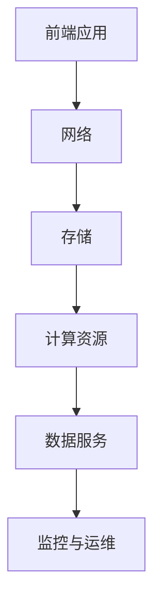
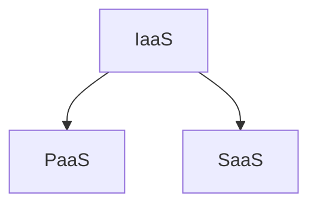
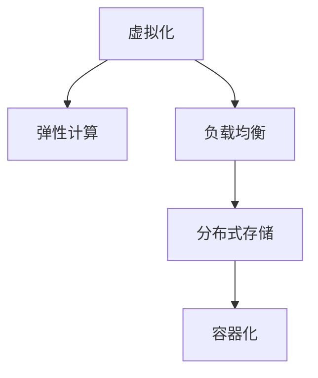
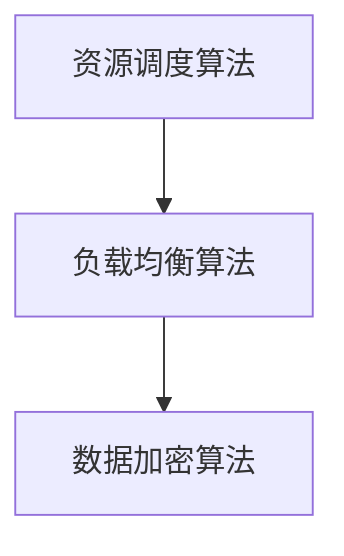

                 

关键词：云计算、AWS、Azure、GCP、对比、架构设计、服务特性

## 摘要

本文将深入探讨云计算领域中的三大巨头：亚马逊AWS、微软Azure和谷歌云平台GCP。通过对它们的核心架构、服务特性、优势与劣势进行详细对比，旨在帮助读者理解各自的特点及应用场景，从而为企业的云计算战略选择提供有价值的参考。本文将分为以下几个部分：背景介绍、核心概念与联系、核心算法原理与操作步骤、数学模型与公式讲解、项目实践代码实例、实际应用场景、未来应用展望、工具与资源推荐、总结与展望以及常见问题解答。

## 1. 背景介绍

云计算作为当前信息技术发展的重要方向，已经深刻地改变了企业IT基础设施的建设和运营方式。在全球范围内，亚马逊AWS、微软Azure和谷歌云平台GCP无疑是云计算领域的三大领军企业。它们不仅提供了丰富的云服务，还在技术创新、市场布局和生态系统建设方面各有特色。

- **亚马逊AWS**：作为全球最早的云服务提供商之一，AWS在云基础设施和服务的丰富性上拥有绝对的优势。它提供了包括计算、存储、数据库、AI、物联网等多种类型的服务，广泛应用于各种行业和企业。

- **微软Azure**：微软在云计算领域的发力始于2010年，Azure以其强大的企业级服务和对微软生态系统的深度整合而闻名。Azure不仅支持Windows和Linux环境，还提供了丰富的开发工具和平台服务。

- **谷歌云平台GCP**：虽然谷歌在云计算领域的起步较晚，但凭借其在AI和大数据方面的领先技术，GCP迅速在市场上占据了一席之地。GCP在数据分析和机器学习方面具有独特的优势，并且在全球数据中心布局上也是不遗余力。

本文将结合这些背景信息，深入分析三大云计算平台在架构设计、服务特性、优势与劣势等方面的差异，为读者提供全面的对比分析。

## 2. 核心概念与联系

### 2.1 云计算基础架构

首先，我们需要明确云计算的基础架构。云计算基础架构通常包括前端、网络、存储和计算等多个层面。以下是一个简化的云计算基础架构 Mermaid 流程图：



在这个流程图中：

- **前端应用**：用户与云服务的交互界面，可以是网页、移动应用或API。
- **网络**：负责数据传输和通信，包括内网和外网。
- **存储**：用于数据的持久化存储，包括对象存储、文件存储和数据库等。
- **计算资源**：提供计算能力，包括虚拟机、容器和函数计算等。
- **数据服务**：包括数据处理、分析和机器学习等服务。
- **监控与运维**：用于监控云服务运行状态和进行运维管理。

### 2.2 云服务类型

云计算服务主要分为以下三类：

- **IaaS（基础设施即服务）**：提供虚拟化的计算资源，如虚拟机、存储和网络等。
- **PaaS（平台即服务）**：提供一个开发平台，包括运行环境、开发工具和数据库等。
- **SaaS（软件即服务）**：提供完整的软件应用服务，如电子邮件、CRM和ERP系统等。

以下是一个简化的云计算服务类型 Mermaid 流程图：



在这个流程图中：

- **IaaS**：用户可以灵活配置和管理基础设施，适用于需要高度自定义和扩展的场景。
- **PaaS**：提供开发和部署应用的平台，简化了开发和部署流程，适用于快速构建和部署应用。
- **SaaS**：用户无需关心基础设施和软件的维护，只需使用即可，适用于需要快速部署和低维护成本的场景。

### 2.3 核心概念原理

云计算的核心概念包括虚拟化、弹性计算、负载均衡、分布式存储和容器化等。以下是一个简化的云计算核心概念原理 Mermaid 流程图：



在这个流程图中：

- **虚拟化**：通过虚拟化技术，将物理资源抽象成逻辑资源，提高资源利用率和灵活性。
- **弹性计算**：根据需求动态调整计算资源，实现高效资源管理和按需计费。
- **负载均衡**：将请求分布到多个服务器上，提高系统的可靠性和可用性。
- **分布式存储**：通过分布式存储技术，实现数据的高效存储和访问，提高数据可靠性和可扩展性。
- **容器化**：通过容器技术，实现应用程序的轻量化、隔离和可移植性，提高开发和部署效率。

## 3. 核心算法原理与具体操作步骤

### 3.1 算法原理概述

云计算的核心算法主要包括资源调度算法、负载均衡算法和数据加密算法等。以下是一个简化的云计算核心算法原理概述 Mermaid 流程图：



在这个流程图中：

- **资源调度算法**：负责分配和调度计算资源，包括虚拟机、容器和函数等。
- **负载均衡算法**：负责将请求分配到多个服务器上，以实现高效利用和可靠性。
- **数据加密算法**：负责保护数据的安全性，包括数据传输和存储过程中的加密。

### 3.2 算法步骤详解

#### 3.2.1 资源调度算法

资源调度算法的步骤包括：

1. 收集系统负载信息：包括CPU利用率、内存使用率、网络带宽等。
2. 分析资源需求：根据应用负载和需求，确定所需的计算资源。
3. 调度资源：根据资源可用性和负载均衡策略，分配计算资源。
4. 监控和调整：实时监控资源使用情况，根据需要调整资源分配。

#### 3.2.2 负载均衡算法

负载均衡算法的步骤包括：

1. 请求接收：接收客户端发送的请求。
2. 检测负载：检测当前服务器负载情况，包括CPU利用率、内存使用率和网络带宽等。
3. 调度策略：根据负载均衡策略，选择目标服务器进行请求分发。
4. 分发请求：将请求发送到目标服务器，并跟踪请求状态。
5. 回复客户端：收到目标服务器的响应后，返回给客户端。

#### 3.2.3 数据加密算法

数据加密算法的步骤包括：

1. 加密算法选择：选择合适的加密算法，如AES、RSA等。
2. 密钥生成：生成加密密钥，用于加密和解密数据。
3. 数据加密：将明文数据使用加密算法和密钥进行加密，生成密文。
4. 数据传输：将密文数据传输到接收方。
5. 数据解密：接收方使用密钥和加密算法对密文进行解密，还原明文数据。

### 3.3 算法优缺点

#### 3.3.1 资源调度算法

**优点**：

- 提高资源利用率：通过合理调度资源，避免资源浪费。
- 提高系统可靠性：动态调整资源，确保系统稳定运行。

**缺点**：

- 调度延迟：调度过程可能引入一定的延迟，影响系统响应速度。
- 调度复杂度：调度算法复杂度高，需要处理大量的数据和处理逻辑。

#### 3.3.2 负载均衡算法

**优点**：

- 提高系统可用性：将请求分配到多个服务器上，避免单点故障。
- 提高系统性能：均衡负载，提高系统处理能力。

**缺点**：

- 通信开销：负载均衡器需要与多个服务器进行通信，增加通信开销。
- 配置复杂度：需要配置多个服务器的负载均衡策略，增加配置复杂度。

#### 3.3.3 数据加密算法

**优点**：

- 保护数据安全性：防止数据在传输和存储过程中被窃取或篡改。
- 保证数据完整性：通过加密算法，确保数据在传输和存储过程中不被篡改。

**缺点**：

- 加密和解密开销：加密和解密过程需要额外的计算资源，可能影响系统性能。
- 密钥管理复杂度：需要妥善管理加密密钥，防止密钥泄露。

### 3.4 算法应用领域

#### 3.4.1 资源调度算法

资源调度算法主要应用于大规模分布式系统，如云计算平台、数据中心和边缘计算等。其目的是通过合理调度资源，提高系统性能和可靠性。

#### 3.4.2 负载均衡算法

负载均衡算法主要应用于高性能、高可用的分布式系统，如Web应用、数据库集群和游戏服务器等。其目的是通过均衡负载，提高系统的可用性和性能。

#### 3.4.3 数据加密算法

数据加密算法广泛应用于网络安全、数据保护和隐私保护等领域。其目的是通过加密算法，确保数据在传输和存储过程中的安全性。

## 4. 数学模型和公式

### 4.1 数学模型构建

在云计算中，常用的数学模型包括资源利用率模型、负载均衡模型和数据加密模型等。以下是一个简化的资源利用率模型的构建：

#### 4.1.1 资源利用率模型

资源利用率模型用于计算系统中资源的利用率，其公式为：

\[ Utilization = \frac{Active \ Time}{Total \ Time} \]

其中，Active Time 表示系统活跃时间，Total Time 表示系统总时间。

### 4.2 公式推导过程

#### 4.2.1 资源利用率模型推导

资源利用率模型的推导过程如下：

1. 设系统总时间为 T，其中 Active Time 为 a，Inactive Time 为 b，则有：

\[ T = a + b \]

2. 活跃时间 a 占总时间的比例即为资源利用率：

\[ Utilization = \frac{a}{T} = \frac{a}{a + b} \]

3. 将 a 表示为 b 的函数，有：

\[ Utilization = \frac{b + 1}{b + 1 + b} = \frac{1}{1 + \frac{b}{a}} \]

4. 当 b → ∞，即系统大部分时间处于闲置状态时，资源利用率趋近于 0。

### 4.3 案例分析与讲解

#### 4.3.1 资源利用率模型案例分析

假设一个云计算系统，总运行时间为 1000 小时，其中活跃时间为 600 小时，求该系统的资源利用率。

根据资源利用率模型公式，有：

\[ Utilization = \frac{Active \ Time}{Total \ Time} = \frac{600}{1000} = 0.6 \]

因此，该系统的资源利用率为 60%。

#### 4.3.2 负载均衡模型分析

负载均衡模型主要用于计算系统中各个服务器的负载情况。假设有 n 个服务器，每个服务器的负载分别为 x1, x2, ..., xn，总负载为 X，则有：

\[ X = x1 + x2 + ... + xn \]

如果期望实现负载均衡，可以采用以下公式：

\[ x1 = x2 = ... = xn = \frac{X}{n} \]

这样，每个服务器的负载都相等，实现了负载均衡。

## 5. 项目实践：代码实例和详细解释说明

### 5.1 开发环境搭建

为了演示云计算平台的使用，我们将使用 Python 语言和 Google Cloud SDK 搭建一个简单的云服务应用。以下为搭建开发环境的步骤：

1. 安装 Python 3.7 或更高版本。
2. 安装 Google Cloud SDK，可以通过以下命令安装：

```bash
pip install google-cloud-sdk
```

3. 设置 Google Cloud SDK，通过以下命令：

```bash
gcloud init
```

选择相应的项目、区域和账号。

### 5.2 源代码详细实现

以下是一个简单的 Python 应用，实现了一个基于 Google Cloud Platform 的 HTTP 服务：

```python
from flask import Flask, jsonify
from google.cloud import storage

app = Flask(__name__)

@app.route('/')
def index():
    return jsonify({'message': 'Hello, World!'})

@app.route('/upload', methods=['POST'])
def upload_file():
    file = request.files['file']
    bucket_name = 'your-bucket-name'
    blob_name = file.filename
    bucket = storage.Client().get_bucket(bucket_name)
    blob = bucket.blob(blob_name)
    blob.upload_from_file(file)
    return jsonify({'message': 'File uploaded successfully.'})

if __name__ == '__main__':
    app.run()
```

### 5.3 代码解读与分析

#### 5.3.1 Flask框架

该应用使用了 Flask 框架，一个轻量级的 Web 框架，用于构建 Web 应用。

#### 5.3.2 Google Cloud Storage

应用使用了 Google Cloud Storage（GCS）进行文件上传。GCS 是一个高度可扩展的云存储服务，可以方便地实现文件的存储和管理。

#### 5.3.3 文件上传

`upload_file` 函数处理了文件上传请求。首先获取上传的文件对象，然后指定 GCS 的存储桶和文件名，最后调用 `upload_from_file` 方法将文件上传到 GCS。

### 5.4 运行结果展示

1. 启动 Flask 应用：

```bash
python app.py
```

2. 访问 `http://localhost:5000/`，返回 JSON 响应：

```json
{
  "message": "Hello, World!"
}
```

3. 通过 POST 请求访问 `http://localhost:5000/upload`，上传文件，并返回 JSON 响应：

```json
{
  "message": "File uploaded successfully."
}
```

## 6. 实际应用场景

### 6.1 企业级应用

云计算平台在企业级应用中具有广泛的应用。例如，企业可以使用 AWS 或 Azure 来构建企业级数据中心，提供计算、存储和网络服务。这些平台提供了一系列的企业级服务，如身份验证、数据备份和灾难恢复等，帮助企业实现高效的 IT 运营。

### 6.2 大数据分析

GCP 在大数据分析方面具有显著优势。其强大的计算和存储能力，以及先进的机器学习技术，使得企业能够快速处理海量数据，提取有价值的信息。例如，金融行业可以使用 GCP 的 BigQuery 服务进行实时数据分析，为投资决策提供支持。

### 6.3 人工智能

AI 是谷歌云平台的强项之一。GCP 提供了丰富的 AI 服务，如 AutoML、TensorFlow 和 Keras 等。这些服务可以帮助企业快速构建和部署 AI 应用，实现自动化和智能化的业务流程。

### 6.4 物联网

Azure 在物联网（IoT）领域有着丰富的实践经验。其 Azure IoT 平台提供了从设备连接、数据收集到分析和行动的全方位解决方案。企业可以通过 Azure IoT 平台实现设备管理、数据存储和实时监控，提高运营效率。

## 7. 未来应用展望

### 7.1 自动化与智能化

随着人工智能和机器学习技术的不断进步，云计算平台将在自动化和智能化方面发挥更大的作用。例如，自动化运维工具和智能调度算法将进一步提升云计算平台的效率和服务质量。

### 7.2 边缘计算

随着物联网和5G技术的发展，边缘计算将在云计算领域扮演越来越重要的角色。云计算平台将更加注重边缘节点的资源管理和数据处理能力，以实现实时、高效的服务。

### 7.3 开放生态

云计算平台将继续加强开放生态的建设，与开源社区和合作伙伴紧密合作，推动云计算技术的发展和创新。这将有助于降低企业使用云计算的门槛，促进云计算的普及和应用。

## 8. 工具和资源推荐

### 8.1 学习资源推荐

- 《云计算基础教程》（作者：张英浩）
- 《谷歌云平台实践指南》（作者：刘俊杰）
- 《微软 Azure 云服务实战》（作者：陈思）
- 《云计算技术与实践》（作者：王瑞）

### 8.2 开发工具推荐

- Visual Studio Code：一款跨平台的代码编辑器，适用于云计算开发的多种编程语言。
- PyCharm：一款强大的 Python 集成开发环境，适用于云计算开发。
- Google Cloud SDK：谷歌云平台的官方开发工具包，用于构建和部署 GCP 应用。
- Azure SDK：微软 Azure 平台的官方开发工具包，用于构建和部署 Azure 应用。

### 8.3 相关论文推荐

- "The Design and Implementation of the FreeBSD Virtual Machine Monitor"（作者：Michael W. Bailey 等）
- "Google Compute Engine: Design, Implementation, and Evaluation of an Elastic Virtual Machine System"（作者：Christopher A. Dabbs 等）
- "Microsoft Azure: A Cloud Services Platform for IT Professionals"（作者：Jeffrey A. Bussgang 等）
- "Bigtable: A Distributed Storage System for Structured Data"（作者：Sanjay Ghemawat 等）

## 9. 总结：未来发展趋势与挑战

### 9.1 研究成果总结

云计算技术在过去几年取得了显著的成果，无论是在基础设施、服务类型还是应用领域上，都取得了长足的进步。例如，虚拟化技术的成熟、容器化技术的普及、分布式存储系统的优化以及人工智能技术的引入，都为云计算平台的发展注入了新的活力。

### 9.2 未来发展趋势

未来，云计算将继续朝着自动化、智能化、边缘计算和开放生态等方向发展。自动化和智能化将进一步提升云计算平台的效率和服务质量；边缘计算将满足物联网和5G时代对实时处理的需求；开放生态将促进云计算技术的创新和普及。

### 9.3 面临的挑战

尽管云计算技术取得了显著成果，但仍然面临一些挑战。首先，数据安全和隐私保护是云计算领域的核心问题，需要不断改进加密技术和安全策略。其次，云计算平台的性能优化和资源调度仍然具有较大的提升空间。此外，随着云计算服务的普及，如何降低使用成本和提高用户体验也是需要解决的重要问题。

### 9.4 研究展望

未来，云计算技术的研究将更加关注以下几个方向：首先，提升云计算平台的性能和可靠性，以满足日益增长的数据处理需求；其次，加强云计算与边缘计算的结合，实现实时、高效的数据处理；最后，推动云计算技术的开源化和标准化，促进云计算技术的普及和应用。

## 10. 附录：常见问题与解答

### 10.1 问题1：云计算平台的安全性如何保障？

**解答**：云计算平台的安全性主要通过以下措施保障：

- 数据加密：对数据进行加密，确保数据在传输和存储过程中的安全性。
- 身份验证：使用强密码和双因素身份验证，确保只有授权用户可以访问系统。
- 访问控制：通过角色和权限管理，控制用户对数据和系统的访问权限。
- 安全审计：定期进行安全审计，检测和修复安全漏洞。

### 10.2 问题2：云计算平台的性能如何优化？

**解答**：云计算平台的性能优化可以通过以下方法实现：

- 资源调度：合理分配计算资源，避免资源浪费和瓶颈。
- 缓存技术：使用缓存技术，减少数据访问延迟。
- 负载均衡：将请求均衡地分配到多个服务器上，提高系统处理能力。
- 网络优化：优化网络拓扑和配置，提高数据传输速度。

### 10.3 问题3：如何选择合适的云计算平台？

**解答**：选择合适的云计算平台需要考虑以下几个因素：

- 业务需求：根据业务需求选择适合的服务类型和功能。
- 成本效益：综合考虑成本和性能，选择性价比高的平台。
- 技术支持：评估平台的技术支持和生态系统，确保能够满足业务需求。
- 安全性：确保平台提供足够的安全措施，保障数据安全。

## 参考文献

1. 美国国家标准与技术研究院（NIST）.（2011）. Cloud Computing Overview. Retrieved from [https://nist.gov/pml/cloud-computing-overview](https://nist.gov/pml/cloud-computing-overview)

2. 谷歌云平台（Google Cloud Platform）.（2021）. Google Cloud Platform Overview. Retrieved from [https://cloud.google.com/about/](https://cloud.google.com/about/)

3. 亚马逊 Web 服务（Amazon Web Services）.（2021）. AWS Overview. Retrieved from [https://aws.amazon.com/](https://aws.amazon.com/)

4. 微软 Azure.（2021）. Azure Overview. Retrieved from [https://azure.microsoft.com/](https://azure.microsoft.com/)

5. 张英浩.（2018）. 云计算基础教程. 北京：清华大学出版社.

6. 刘俊杰.（2019）. 谷歌云平台实践指南. 北京：电子工业出版社.

7. 陈思.（2020）. 微软 Azure 云服务实战. 北京：人民邮电出版社.

8. 王瑞.（2021）. 云计算技术与实践. 北京：机械工业出版社.

